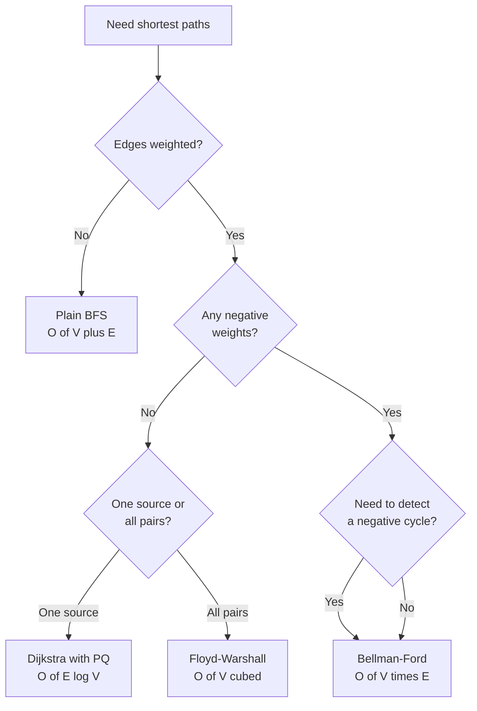

# DSA and Problem-Solving Memory: Keywords and Keypoints

A grouped reference of DSA keypoints, code snippets, formulas and one-liners converted from `DSA_Memory.txt`; the original item numbers (for example `[-33]` or `[45]`) are kept in every heading so each entry can be traced back to the source notes.

Every snippet marked **verified** below was extracted to a scratch file, compiled with `tools/runjava` on the repo JDK, and run against the cases shown. Snippets marked **fragment** are deliberately partial — they are correct as far as they go, and the missing scaffolding is named in the entry.

## How to read this file

| # | Section | What it covers | Items |
|---|---|---|---|
| 1 | [Problem-solving approach](#1-problem-solving-approach) | How to attack an unseen problem | 7 |
| 2 | [Coding habits and common mistakes](#2-coding-habits-and-common-mistakes) | The slips that cost real interviews | 7 |
| 3 | [Arrays, prefix sums and cyclic sort](#3-arrays-prefix-sums-and-cyclic-sort) | In-place array tricks, rotation, prefix-sum maps | 15 |
| 4 | [Two pointers and sliding window](#4-two-pointers-and-sliding-window) | Window index algebra, monotonic deque | 5 |
| 5 | [Binary search](#5-binary-search) | Bounds, partition search, 2-D flattening | 7 |
| 6 | [Sorting, comparators, selection and heaps](#6-sorting-comparators-selection-and-heaps) | Comparator semantics, quickselect, heap layout | 10 |
| 7 | [Linked lists](#7-linked-lists) | Two-pointer node surgery | 3 |
| 8 | [Strings](#8-strings) | ASCII, scanning, overflow-safe parsing | 6 |
| 9 | [Matrix and grid](#9-matrix-and-grid) | Rotation recipes, neighbour indexing | 2 |
| 10 | [Binary trees and BST](#10-binary-trees-and-bst) | Traversal order, height, node counting | 6 |
| 11 | [Graphs: traversal, cycles and topological sort](#11-graphs-traversal-cycles-and-topological-sort) | BFS/DFS, cycle rules, Kahn's | 12 |
| 12 | [Graphs: shortest paths, MST, DSU and SCC](#12-graphs-shortest-paths-mst-dsu-and-scc) | Dijkstra family, Kruskal/Prim, Tarjan | 11 |
| 13 | [Recursion, backtracking and subsets](#13-recursion-backtracking-and-subsets) | Pick / not-pick, N-Queens bookkeeping | 7 |
| 14 | [Dynamic programming](#14-dynamic-programming) | Grid, string and partition recurrences | 6 |
| 15 | [Math, number theory and bit tricks](#15-math-number-theory-and-bit-tricks) | GCD, XOR, binary exponentiation, Pascal | 11 |
| 16 | [Java specifics](#16-java-specifics) | Language gotchas that break solutions | 11 |
| 17 | [Miscellaneous](#17-miscellaneous) | Leftovers | 1 |
| A | [Corrections applied in this pass](#appendix-a-corrections-applied-in-this-pass) | Every claim that was wrong, and what it is now | 30 |
| B | [Complexity cheat sheet](#appendix-b-complexity-cheat-sheet) | One table for the algorithms named above | — |

## Table of Contents

1. [Problem-solving approach](#1-problem-solving-approach)
2. [Coding habits and common mistakes](#2-coding-habits-and-common-mistakes)
3. [Arrays, prefix sums and cyclic sort](#3-arrays-prefix-sums-and-cyclic-sort)
4. [Two pointers and sliding window](#4-two-pointers-and-sliding-window)
5. [Binary search](#5-binary-search)
6. [Sorting, comparators, selection and heaps](#6-sorting-comparators-selection-and-heaps)
7. [Linked lists](#7-linked-lists)
8. [Strings](#8-strings)
9. [Matrix and grid](#9-matrix-and-grid)
10. [Binary trees and BST](#10-binary-trees-and-bst)
11. [Graphs: traversal, cycles and topological sort](#11-graphs-traversal-cycles-and-topological-sort)
12. [Graphs: shortest paths, MST, DSU and SCC](#12-graphs-shortest-paths-mst-dsu-and-scc)
13. [Recursion, backtracking and subsets](#13-recursion-backtracking-and-subsets)
14. [Dynamic programming](#14-dynamic-programming)
15. [Math, number theory and bit tricks](#15-math-number-theory-and-bit-tricks)
16. [Java specifics](#16-java-specifics)
17. [Miscellaneous](#17-miscellaneous)
- [Appendix A: corrections applied in this pass](#appendix-a-corrections-applied-in-this-pass)
- [Appendix B: complexity cheat sheet](#appendix-b-complexity-cheat-sheet)

---

## 1. Problem-solving approach

### Brute force to better than best

Brute Force -> (Sorting) Better -> Best -> Better than Best

### Think from easy to hard

- Thinking from easy to hard, simple to complex, small to large.
- Constraints will be getting added making it more complex, so new logic will be added.

### Constraints narrow the scope

- Constraints -> Narrow down the scope, define limits.

### Rephrase the problem

- Rephrase the problem and constraints as many times as needed to understand it fully.
- Like multiple sentence-version representations of the same problem.

### Logic is just ifs, elses and loops

Problem-Solving with Algorithms and Data Structures:

It is so simple. What is logic? Nothing but ifs and elses and loops. That is all what logic is, and using the right data structures and algorithmic approaches with the help of a grasp of the problem.

### Read, rephrase, focus on constraints

- Read through the problem carefully and multiple times and rephrase the problem with the rules involved.
- Focus on constraints and edge cases.
- Implement logic that follows constraints.
- Constraints and the rules which control the logic to be implemented.
- Constraints VS Logic (apply intuition and common sense).
- Logic VS Constraints (intuition: the ability to understand something intrinsic instinctively and intuitively without the need for conscious reasoning).

### Break the problem down into smaller parts

Break down the problem into smaller, manageable parts.

- 1 Dimension
  - 0 elements
  - 1 element
  - 2 elements
  - 3 elements
  - 4 elements -- repeat the process until the problem is solved.
- 2 Dimension (grid or matrix)
  - Solve only a column (left-most or right-most).
  - Solve only a row (first or last).
  - Solve single row, then move to multi-row thinking.
  - Use solved row results to solve a new row addition with usage of the solved or previous dp row: `dp[i][j] = grid[i][j] + max(dp[i-1][j], dp[i][j-1])`
  - 1 x 1
  - 2 x 2
  - 3 x 3
  - 4 x 4

---

## 2. Coding habits and common mistakes

### [-12] While, not if

- Inside, sometimes it's `while` not `if` -- it will be a common mistake.
- Generally when we use a for-i loop it means we are exploiting the `i` value.

The two places this bites hardest:

| Pattern | `if` is enough | `while` is required |
|---|---|---|
| Monotonic stack / deque pop | never | always — many elements can be popped for one new element |
| Deque front expiry in a fixed window | yes — only one index can fall out per step | not needed |
| `wait()` on a condition | never | always — spurious wakeups, see item [-18] |
| Shrinking a variable-size window | no | yes — the window may need several shrinks |

### [-9] Basic building blocks

- if / else-if
- if / if
- for loop with `i`
- while loop
- swap
- find mid in binary search
- find min value or index
- find max value or index
- binary tree: check left, check right

### [-8] Variable naming pairs

- `low`, `left`, `start`
- `high`, `right`, `end`
- `high = arr.length - 1;`

### [-7] Edge cases

Edge cases like start and end, length, null etc.

### [-6] Identify, then process

- Identify, Process.
- After identification perform action.

### [-2] Check places of i and j

Check places of `i`, `j` as `i`, `j` -- swapping them is a very common mistake in coding.

### [52] Start the inner loop at j = i + 1

Remember `j = i + 1` when we don't want to include elements that are on the right side of `i`, not on the left side of `i`.

---

## 3. Arrays, prefix sums and cyclic sort

### [-33] Cyclic sort

Practice file: [`../18-Sorting-Searching-Algorithms/A04_CyclicSort.java`](../18-Sorting-Searching-Algorithms/A04_CyclicSort.java)

**Verified.** `[3,5,2,1,4]` -> `[1,2,3,4,5]`.

```java
public static void cyclicSort(int[] nums) {
    int i = 0;
    while (i < nums.length) {
        int correctIndex = nums[i] - 1;
        if (nums[i] != nums[correctIndex]) {
            swap(nums, i, correctIndex);
        } else {
            i++;
        }
    }
}
```

Precondition to say out loud: every value must lie in `[1, n]`. If a value can be `0`, negative, or `> n`, `nums[i] - 1` throws — guard it (`if (nums[i] > 0 && nums[i] <= n)`) before indexing. That guard is exactly what First Missing Positive needs; see [`../01-Arrays/D01_FirstMissingPositive.java`](../01-Arrays/D01_FirstMissingPositive.java).

Why it is O(n) and not O(n^2): every swap puts at least one value on its final index for good, so there are at most `n` swaps in total across the whole `while` loop.

### [-32] Merge two sorted arrays in place (gap method)

Practice file: [`../02-Two-Pointers-Sliding-Window/D03_MergeTwoSortedArrays.java`](../02-Two-Pointers-Sliding-Window/D03_MergeTwoSortedArrays.java)

**Verified.** `arr1=[1,4,8,10]`, `arr2=[2,3,9]` -> `[1,2,3,4]` and `[8,9,10]`.

```java
int m = arr1.length;
int n = arr2.length;

int length = m + n;
// Calculate the initial gap: ceil(length / 2)
int gap = (length / 2) + (length % 2);

while (gap > 0) {
    int left = 0;
    int right = left + gap;
    while (right < length) {
        // Case 1: arr1 and arr2 comparison
        if (left < m && right >= m) {
            swapIfGreater(left, right - m, arr1, arr2);
        }
        // Case 2: arr2 and arr2 comparison
        else if (left >= m) {
            swapIfGreater(left - m, right - m, arr2, arr2);
        }
        // Case 3: arr1 and arr1 comparison
        else {
            swapIfGreater(left, right, arr1, arr1);
        }
        left++;
        right++;
    }
    if (gap == 1)
        break; // When gap is 1, we can stop further halving

    // Reduce gap for the next iteration
    gap = (gap / 2) + (gap % 2); // == ceil(gap / 2)
}
```

`swapIfGreater(i, j, a, b)` swaps when `a[i] > b[j]`. Cost is O((m+n) log(m+n)) time and O(1) extra space — that O(1) is the only reason to prefer this over the trivial merge into a third array.

### [-27] Majority element (Boyer-Moore voting)

Practice file: [`../01-Arrays/B09_MajorityElement.java`](../01-Arrays/B09_MajorityElement.java)

**Verified.** `[2,2,1,1,1,2,2]` -> `2`.

```java
int candidate = nums[0];
int count = 0;
// Boyer-Moore Voting Algorithm
for (int num : nums) {
    if (count == 0) candidate = num;
    count += (num == candidate) ? 1 : -1;
}
return candidate;
```

**Correction — the snippet alone is not a full answer.** Boyer-Moore only guarantees the right value *when a majority element exists*. On `[1,2,3]` it returns `3`, which is not a majority of anything (verified). LeetCode 169 promises a majority exists so the bare return is accepted there; anywhere else (and for "majority element II") you must add a second pass:

```java
int occurrences = 0;
for (int num : nums) if (num == candidate) occurrences++;
return occurrences > nums.length / 2 ? candidate : -1;
```

### [-26] Sort colors (Dutch national flag)

Practice file: [`../01-Arrays/C08_Sort012.java`](../01-Arrays/C08_Sort012.java)

**Verified** (with the loop header restored). `[2,0,2,1,1,0]` -> `[0,0,1,1,2,2]`.

```java
int low = 0, mid = 0, high = n - 1;
while (mid <= high) {           // <- the source note omitted this line
    switch (nums[mid]) {
        case 0:
            swap(nums, low, mid);
            low++; mid++;
            break;
        case 1: // If the element is 1
            mid++;
            break;
        case 2: // If the element is 2
            swap(nums, mid, high);
            high--;             // note: mid does NOT move here
            break;
    }
}
```

The two facts that make it work, and that get asked about:

| Region | Index range | Invariant |
|---|---|---|
| Sorted 0s | `[0, low)` | all values are 0 |
| Sorted 1s | `[low, mid)` | all values are 1 |
| Unknown | `[mid, high]` | not yet examined |
| Sorted 2s | `(high, n-1]` | all values are 2 |

Case 2 must not advance `mid`: the value swapped in from `high` has never been looked at. Case 0 may advance `mid` because the value swapped in from `low` is known to be a 1 (or `low == mid`).

### [-21] Kth missing positive number

Practice file: [`../03-Binary-Search/B01_KthMissingPositive.java`](../03-Binary-Search/B01_KthMissingPositive.java)

**Verified.** `arr=[2,3,4,7,11], k=5` -> `9`; `arr=[1,2,3,4], k=2` -> `6`.

```java
public int findKthPositive(int[] arr, int k) {
    int missingCount = 0;
    int expectedNum = 1;
    int index = 0;
    while (missingCount < k) {
        if (index < arr.length && arr[index] == expectedNum)
            index++;
        else
            missingCount++;

        if (missingCount == k)
            return expectedNum;
        expectedNum++;
    }
    return -1;
}
```

This is the O(n + k) walk. The file above also carries the O(log n) binary-search version: search for the first index where `arr[i] - (i + 1) >= k`, then the answer is `low + k` (`arr[i] - (i+1)` is how many positives are missing before `arr[i]`).

### [-15] Next permutation (lexicographical order)

Practice file: [`../01-Arrays/C10_NextGreaterPermutation.java`](../01-Arrays/C10_NextGreaterPermutation.java)

**Correction — the pivot test was inverted in the source note.** It said "find an adjacent pair from right to left such that `arr[i] > arr[i+1]`". That finds the *descending* suffix boundary the wrong way round and produces the previous permutation, not the next. The pivot is the first index from the right where the value is **smaller** than its neighbour.

1. Scan from the right for the first `i` with `arr[i] < arr[i+1]`. Everything to the right of `i` is non-increasing (that is the already-maximal suffix). If no such `i` exists the array is the last permutation — reverse the whole thing and stop.
2. Scan from the right again for the first `j` with `arr[j] > arr[i]`; swap `arr[i]` and `arr[j]`. Because the suffix is non-increasing, that first `j` is the smallest value in the suffix still greater than `arr[i]`.
3. Reverse `i+1 .. n-1`. The suffix was non-increasing, so reversing makes it non-decreasing, i.e. the smallest arrangement.

**Verified:** `[1,2,3]` -> `[1,3,2]`; `[3,2,1]` -> `[1,2,3]`; `[1,5,8,4,7,6,5,3,1]` -> `[1,5,8,5,1,3,4,6,7]`.

### [-13] Count subarrays with sum equal to K (prefix-sum map)

Practice file: [`../05-Hashing-Prefix-Sum/C01_CountSubarraySumEqualsK.java`](../05-Hashing-Prefix-Sum/C01_CountSubarraySumEqualsK.java)

**Verified.** `[1,2,3], k=3` -> `2`; `[1,1,1], k=2` -> `2`; `[0,0,0], k=0` -> `6`; `[1,-1,0], k=0` -> `3`.

```java
/**
 * Input: nums = [1,2,3], k = 3
 * <p>
 * Output: 2
 */
class CountSubarraySumEqualsK {
    public static int subarraySum(int[] nums, int k) {
        int count = 0;
        Map<Integer, Integer> preSumCountMap = new HashMap<>();
        int preSum = 0;
        for (int i = 0; i < nums.length; i++) {
            preSum += nums[i];
            if (preSum == k) count++;   // the subarray starting at index 0
            int remSum = preSum - k;
            if (preSumCountMap.containsKey(remSum)) {
                // remember: we add the COUNT stored for remSum,
                // not 1, because remSum may have occurred many times
                count += preSumCountMap.get(remSum);
            }
            // and we store preSum, never remSum
            preSumCountMap.put(preSum, preSumCountMap.getOrDefault(preSum, 0) + 1);
        }
        return count;
    }
    public static void main(String[] args) {
        System.out.println(subarraySum(new int[]{1, 2, 3}, 3));
    }
}
```

Two equivalent ways to handle the prefix that starts at index 0 — use **one**, never both:

| Style | Seed | Extra line in the loop |
|---|---|---|
| Explicit check (used above) | empty map | `if (preSum == k) count++;` |
| Seeded map | `map.put(0, 1)` | none |

The map is needed (rather than a sliding window) precisely because `nums` may contain negatives, so the prefix sum is not monotonic. With all-positive values a two-pointer window is O(1) space.

### [3] Prefix sum

```text
25 = 25
25 + 10 = 35
35 - 10 = 25
```

Sum of `nums[l..r]` is `preSum[r] - preSum[l-1]`. Building the array is the easy half; the interview half is remembering that `l == 0` needs `preSum[r]` alone, which is why the seeded-map trick above stores `0 -> 1`.

### [16] Left rotate an array by k steps

Practice file: [`../01-Arrays/C09_RotateArray.java`](../01-Arrays/C09_RotateArray.java)

Example: `arr = [1, 2, 3, 4, 5, 6, 7]`, `k = 2` -> `[3, 4, 5, 6, 7, 1, 2]`

**Correction — two of the three index pairs were off by one.** `reverse(from, to)` here is inclusive at both ends, so the last index is always `n - 1`, never `n`. The source note wrote `reverse(arr, k, n)` and `reverse(arr, 0, n)`, which throw `ArrayIndexOutOfBoundsException`.

- Normalize k -> `k = k % n` (rotating by n brings the array back; this also stops `k > n` breaking the index maths).
- Reverse the first k elements: `reverse(arr, 0, k - 1);`
- Reverse the remaining n-k elements: `reverse(arr, k, n - 1);`
- Reverse the whole array: `reverse(arr, 0, n - 1);`

**Verified** with the corrected indices: `[1..7]` with `k=2` -> `[3,4,5,6,7,1,2]`.

### [17] Right rotate an array by k steps

Practice file: [`../01-Arrays/C09_RotateArray.java`](../01-Arrays/C09_RotateArray.java)

**Correction — all three index pairs were off by one** for the same inclusive-bounds reason as [16], and the first one (`n - k + 1`) also started one element too late, which would have left the last `k` elements mis-rotated even if it had not overrun.

- Normalize k -> `k = k % n`.
- Reverse the last k elements: `reverse(arr, n - k, n - 1);`
- Reverse the first n-k elements: `reverse(arr, 0, n - k - 1);`
- Reverse the whole array: `reverse(arr, 0, n - 1);`

**Verified:** `[1..7]` with `k=2` -> `[6,7,1,2,3,4,5]`.

Memory hook: left and right rotation are the same three reversals; only which block you reverse *first* changes.

| Direction | Step 1 | Step 2 | Step 3 |
|---|---|---|---|
| Left by k | `reverse(0, k-1)` | `reverse(k, n-1)` | `reverse(0, n-1)` |
| Right by k | `reverse(n-k, n-1)` | `reverse(0, n-k-1)` | `reverse(0, n-1)` |

Right rotation by `k` is also just left rotation by `n - k`.

### [18] If / else-if ladder for set operations on arrays

Practice files: [`../02-Two-Pointers-Sliding-Window/A06_UnionOfArrays.java`](../02-Two-Pointers-Sliding-Window/A06_UnionOfArrays.java), [`../05-Hashing-Prefix-Sum/B03_IntersectionOfTwoArrays.java`](../05-Hashing-Prefix-Sum/B03_IntersectionOfTwoArrays.java), [`../05-Hashing-Prefix-Sum/B01_FindTheDifferenceOfTwoArrays.java`](../05-Hashing-Prefix-Sum/B01_FindTheDifferenceOfTwoArrays.java)

- IF ELSEIF LADDER
- Intersection of two or more arrays
- Union of two or more arrays
- Un-common of two or more arrays
- (For uneven / all possible ways, two sets and sorting `ansList` can help.)

The ladder on two **sorted** arrays with pointers `i` and `j`:

| Comparison | Union | Intersection | Symmetric difference |
|---|---|---|---|
| `a[i] < b[j]` | take `a[i]`, `i++` | `i++` | take `a[i]`, `i++` |
| `a[i] > b[j]` | take `b[j]`, `j++` | `j++` | take `b[j]`, `j++` |
| equal | take once, `i++ j++` | take once, `i++ j++` | skip both, `i++ j++` |
| one array exhausted | drain the other | stop | drain the other |

Skip duplicates by comparing against the last value appended, not against `a[i-1]`.

### [21] Cyclic sort solution (find duplicate and missing)

Practice file: [`../01-Arrays/B11_FindCorruptPair.java`](../01-Arrays/B11_FindCorruptPair.java)

**Fragment** — the swap has to sit inside the usual `while` loop from item [-33]; shown below with the scaffolding so the trace is reproducible.

```java
// If a number is not in its correct place, swap it with the number at its correct position.
// [1, 2, 3, 5, 2]
int i = 0;
while (i < nums.length) {
    int correctIdx = nums[i] - 1;      // i is currentIndex
    if (nums[i] != nums[correctIdx]) { // nums[i] = 2, nums[correctIdx] = 2 -> stop
        swap(nums, i, correctIdx);
    } else {
        i++;                           // only advance when this slot is settled
    }
}

for (int j = 0; j < nums.length; j++) {
    if (nums[j] != j + 1) {
        duplicated = nums[j];
        missing = j + 1;
    }
}
```

Trace for `[1,2,3,5,2]`: the 5 at index 3 swaps with index 4 giving `[1,2,3,2,5]`; index 3 then holds a 2 whose home already holds a 2, so `i` advances. The scan finds `nums[3] == 2 != 4`, so `duplicated = 2`, `missing = 4`.

Compare the sign-marking variant in `DSA_Memory_Keypoints_II.md` item [5] — same O(n)/O(1) result, but it never reorders the array.

### [34] Can place flowers

Practice file: [`../13-Greedy/B01_CanPlaceFlowers.java`](../13-Greedy/B01_CanPlaceFlowers.java)

**Fragment** — braces closed here so the block is readable; the enclosing `for (int i = 0; i < flowerbed.length; i++)` and the final `return count >= n;` are the caller's.

```java
// canPlaceFlowers
//              [0 , 0 , 0]
if (flowerbed[i] == 0 &&
    (i == 0 || flowerbed[i - 1] == 0) &&
    (i == flowerbed.length - 1 || flowerbed[i + 1] == 0)) {
    flowerbed[i] = 1; // Place a flower here
    count++;
}
```

The two `||` short-circuits are the whole trick: they say "a missing neighbour counts as empty", which is what makes the first and last slots plantable without a special case. Planting greedily at the earliest legal slot is optimal — pushing a flower rightwards can only block a later slot, never unblock one.

### [37] Use long for the prefix-sum remainder

```java
long preSum = 0;              // the running sum must be long too
long rem = preSum - target;
```

**Correction — `rem` alone being `long` does nothing.** If `preSum` is an `int`, it has already overflowed before the subtraction, and widening the result afterwards preserves the wrong value. Declare the running prefix sum as `long` (and make the map `Map<Long, Integer>` to match). Needed whenever `n * max|nums[i]|` can pass 2^31 - 1 — for example `n = 10^5` with values up to `10^5`.

### [38] Cyclic sort: correct index of x is x - 1

For an array containing 1 to n, the correct index of a number x is `x - 1`.

```java
// Cyclic sort
// currVal to correctIdx means correctIdx = currVal - 1
// value at correctIdx to currentIdx means to the currentVal idx
// nums[i] -> currVal
int correctIdx = nums[i] - 1;
if (nums[correctIdx] != nums[i]) {
    int temp = nums[correctIdx];
    nums[correctIdx] = nums[i];
    nums[i] = temp;
}
```

Compare by **value** (`nums[correctIdx] != nums[i]`), not by index (`correctIdx != i`). With duplicates present the value test terminates and the index test loops forever swapping two equal values back and forth.

| Value range in the array | Correct index of `x` |
|---|---|
| `1 .. n` | `x - 1` |
| `0 .. n-1` | `x` |
| `1 .. n` with one duplicate, array size `n+1` | `x - 1`, plus a duplicate-guard |

---

## 4. Two pointers and sliding window

### [-29] Longest substring without repeating characters

Practice file: [`../02-Two-Pointers-Sliding-Window/C03_LongestSubStringWithoutRepeatingCharacter.java`](../02-Two-Pointers-Sliding-Window/C03_LongestSubStringWithoutRepeatingCharacter.java)

**Verified.** `"abcddcba"` -> `4`; `"pwwkew"` -> `3`; `"bbbbb"` -> `1`.

```java
// C03_LongestSubStringWithoutRepeatingCharacter
public static void main(String[] args) {
    String string = "abcddcba";
    Map<Character, Integer> map = new HashMap<>();
    int maxLength = 0;
    for (int left = 0, right = 0; right < string.length(); right++) {
        char c = string.charAt(right);
        if (map.containsKey(c))
            left = Math.max(map.get(c) + 1, left);

        if (maxLength < right - left + 1)
            maxLength = right - left + 1;
        // Remember update or insert latest
        // index for current character in map
        map.put(c, right);
    }
    System.out.println(maxLength);
}
```

`Math.max(map.get(c) + 1, left)` is the line that gets dropped in interviews. Without it, a repeat whose stored index is *behind* the current `left` (a stale entry never cleaned out of the map) drags `left` backwards and the window silently re-admits duplicates.

### [45] Max cyclic sum of window size k (max score from cards)

Practice file: [`../02-Two-Pointers-Sliding-Window/C09_MaximumPointsFromCards.java`](../02-Two-Pointers-Sliding-Window/C09_MaximumPointsFromCards.java)

**Corrections:** `Integer max` boxed a hot loop variable for no reason, and a stray `Math.max(max, sum);` whose result was discarded sat under the real assignment. Both removed. The index algebra itself was right and is **verified**: `[1,2,3,4,5,6,1], k=3` -> `12`; `[2,2,2], k=2` -> `4`; `[9,7,7,9,7,7,9], k=7` -> `55`.

```java
// maxCyclicSum of window size k
private static int maxScore(int[] cards, int k) {
    int n = cards.length;
    int sum = 0;
    // start from the "all k taken from the back" split
    for (int i = n - k; i < n; i++) {
        sum += cards[i];
    }
    int max = sum;
    // move one card at a time from the back split to the front split
    for (int i = 1; i <= k; i++) {
        sum += cards[i - 1] - cards[n - 1 - k + i];
        max = Math.max(max, sum);
    }
    return max;
}
```

Read the loop as: after `i` steps we hold `cards[0..i-1]` from the front and `cards[n-k+i..n-1]` from the back. Step `i` adds `cards[i-1]` and drops `cards[n-k+i-1]`, which is what `cards[n-1-k+i]` spells. `i` runs to `k` inclusive so the "all from the front" split is also scored.

Assumes `k <= n`. It is O(n) with O(1) space; the naive "try every split with a fresh sum" is O(k^2).

### [-20] Sliding window maximum (monotonic deque)

Practice file: [`../07-Stack-Queue-Monotonic/D04_SlidingWindowMaximum.java`](../07-Stack-Queue-Monotonic/D04_SlidingWindowMaximum.java)

**Verified.** `[1,3,-1,-3,5,3,6,7], k=3` -> `[3,3,5,5,6,7]`; `[7,2,4], k=2` -> `[7,4]`.

```java
// D04_SlidingWindowMaximum
public int[] maxSlidingWindow(int[] nums, int k) {
    if (nums == null || k <= 0 || k > nums.length) return new int[0];
    int n = nums.length;
    int[] result = new int[n - k + 1];
    Deque<Integer> deque = new ArrayDeque<>();   // holds INDICES, decreasing by value
    for (int i = 0; i < n; i++) {
        if (!deque.isEmpty() && deque.peekFirst() < i - k + 1)
            deque.pollFirst();
        while (!deque.isEmpty() && nums[deque.peekLast()] < nums[i])
            deque.pollLast();
        deque.offer(i);                          // offer == offerLast
        if (i >= k - 1)
            result[i - k + 1] = nums[deque.peek()];   // peek == peekFirst
    }
    return result;
}
```

Small changes from the source note: `k > nums.length` added to the guard (`new int[n - k + 1]` throws `NegativeArraySizeException` otherwise), and `LinkedList` swapped for `ArrayDeque`, which is the faster `Deque` here and refuses `null` elements outright.

Why the front check is an `if` and the back check is a `while`: at most one index leaves through the front per step, but any number of smaller values can be evicted from the back by one new element. This is the concrete case behind item [-12].

The deque holds indices, not values, because expiry is decided by index. Total work is O(n): each index is pushed once and popped at most once.

### [-11] Window index formula for window size k

Another variation of window size k, where `n` is the size of the array and `k` is the size of the window:

```text
Window.i = A[i : i+k-1] for i in [0, n-k]
So:
Window 1    -> indices 0 ... k-1
Window 2    -> indices 1 ... k
.....
Last window -> indices n-k ... n-1
```

There are `n - k + 1` windows, which is why every fixed-window answer array has that length.

### [1] Start index from end index and max length

```text
StartIndex = EndIndex - MaxLength + 1;
```

Rearranged: `MaxLength = EndIndex - StartIndex + 1`. Keep whichever two you are tracking and derive the third; recording `EndIndex` while the maximum updates is usually cheaper than carrying both ends.

---

## 5. Binary search

### [-28] Median of two sorted arrays

Practice file: [`../03-Binary-Search/D02_MedianOfTwoSortedArrays.java`](../03-Binary-Search/D02_MedianOfTwoSortedArrays.java)

**Correction — the source version crashed whenever `arr1` was the longer array.** It binary-searched over `arr1` without first guaranteeing `m <= n`. With `arr1=[1,2,3,4,5]` and `arr2=[6]` it throws `ArrayIndexOutOfBoundsException: Index -1 out of bounds for length 1` (reproduced), because `mid2 = halfLength - mid1` goes negative and the `(mid2 < n)` guard happily lets a negative index through. The two-line swap below fixes it and also caps the search at O(log(min(m, n))).

**Verified after the fix:** `[1,3],[2]` -> `2.0`; `[1,2],[3,4]` -> `2.5`; `[1,2,3,4,5],[6]` -> `3.5`.

```java
private static double findMedianSortedArrays(int[] arr1, int[] arr2) {

    // ALWAYS binary-search the SHORTER array
    if (arr1.length > arr2.length) return findMedianSortedArrays(arr2, arr1);

    int m = arr1.length;
    int n = arr2.length;
    int totalLength = m + n;
    // REMEMBER: the +1 makes the odd case land on the LEFT side
    int halfLength = (m + n + 1) / 2;
    int low = 0, high = m;

    while (low <= high) {
        int mid1 = low + (high - low) / 2;
        int mid2 = halfLength - mid1;   // REMEMBER

        // Use appropriate values for left and right partitions
        int l1 = (mid1 > 0) ? arr1[mid1 - 1] : Integer.MIN_VALUE;
        int l2 = (mid2 > 0) ? arr2[mid2 - 1] : Integer.MIN_VALUE;
        int r1 = (mid1 < m) ? arr1[mid1] : Integer.MAX_VALUE;
        int r2 = (mid2 < n) ? arr2[mid2] : Integer.MAX_VALUE;

        if (l1 <= r2 && l2 <= r1) {
            if (totalLength % 2 == 1)
                return Math.max(l1, l2);
            return (Math.max(l1, l2) + Math.min(r1, r2)) / 2.0;
        }
        if (l1 > r2) high = mid1 - 1;
        else low = mid1 + 1;
    }
    return 0.0;
}
```

What each piece is doing:

| Piece | Meaning |
|---|---|
| `mid1` | how many of `arr1` go into the left half |
| `mid2 = halfLength - mid1` | how many of `arr2` must join them |
| `l1 <= r2 && l2 <= r1` | the cut is valid: every left value <= every right value |
| `Integer.MIN_VALUE` sentinel | "nothing on the left of this array", so it never wins a `max` |
| `Integer.MAX_VALUE` sentinel | "nothing on the right of this array", so it never wins a `min` |

`(m + n + 1) / 2` puts the extra element on the left for odd totals, which is why the odd branch reads the answer from `max(l1, l2)` and never touches the right side.

### [4] Kth element of two sorted arrays (search bounds)

Practice file: [`../03-Binary-Search/D01_KthElementOf2SortedArrays.java`](../03-Binary-Search/D01_KthElementOf2SortedArrays.java)

- `m` is the size of array A and `n` is the size of array B.
- **Correction to the worked example's arithmetic.** With `m = 3`, `n = 5`, `k = 7`, an unclamped search starts at `low = 0, high = m = 3`, so `mid1 = 1` and therefore `mid2 = k - mid1 = 6`, not 7. Six is still greater than `n = 5`, so the point stands — `arr2[mid2 - 1]` reads past the end of B — but the number in the note was one off.
- The fix is to clamp the low end: you must take at least `k - n` elements from A, because B can supply at most `n`.

```java
// D01_KthElementOf2SortedArrays
int low = Math.max(0, k - n), high = Math.min(k, m);
```

With the clamp the same case gives `low = 2`, `high = 3`, so `mid1 = 2` and `mid2 = 5 = n` — in bounds. `high = Math.min(k, m)` is the mirror: you cannot take more than `k` elements in total, nor more than `m` from A.

### [11] Overflow-safe mid

```java
int mid = low + (high - low) / 2;
```

`(low + high) / 2` overflows to a negative index once `low + high` passes `Integer.MAX_VALUE`. It only bites on arrays above ~1.07 billion elements — but it is also the answer the interviewer is listening for, so write it this way by default.

### [12] First and last occurrence (like floor and ceil)

Practice file: [`../03-Binary-Search/A02_FirstAndLastOccurrence.java`](../03-Binary-Search/A02_FirstAndLastOccurrence.java)

- Use the `high` index and move towards the left to find the first occurrence.
- Use the `low` index and move towards the right to find the last occurrence.

Concretely, on `arr[mid] == target`:

| Looking for | Record `mid`, then | Ends at |
|---|---|---|
| First occurrence | `high = mid - 1` (keep searching left) | leftmost match |
| Last occurrence | `low = mid + 1` (keep searching right) | rightmost match |

Do not return on the first match — that is the mistake this item exists to prevent.

### [18.1] Moving left and right using the mid pointer

- `midValue` and `targetValue`: in binary search, if `midVal < targetValue` it means `targetVal` is on the right of `midVal`, so ignore the left half: `left = mid + 1` (move `left` to the right of `mid`).
- Vice versa: `right = mid - 1`.
- Here `left` moving to the right or `right` moving to the left uses the mid pointer.

Always `mid + 1` / `mid - 1`, never `left = mid` / `right = mid`: excluding `mid` is what guarantees the range shrinks and the loop ends.

### [24] Binary search on a 2D matrix

Practice file: [`../03-Binary-Search/C01_Search2DMatrix.java`](../03-Binary-Search/C01_Search2DMatrix.java)

**Fragment** — `mid` and `midValue` belong inside the `while (left <= right)` body; as written they are computed once.

```java
int rows = matrix.length;
int cols = matrix[0].length;
int left = 0;
int right = rows * cols - 1;
while (left <= right) {
    int mid = left + (right - left) / 2;
    // number of COLUMNS is the row size (one "record" per row)
    int midValue = matrix[mid / cols][mid % cols];
    ...
}
```

Flat index `mid` maps back with `row = mid / cols` and `col = mid % cols` — divide by the row **length**, which is the column count. Valid only when each row's last value is smaller than the next row's first (LeetCode 74). For the weaker "rows sorted, columns sorted" matrix (LeetCode 240) this flattening is wrong; walk from the top-right corner instead.

### [48] Lower bound and upper bound

Practice file: [`../03-Binary-Search/A01_LowerAndUpperBounds.java`](../03-Binary-Search/A01_LowerAndUpperBounds.java)

| Query | Returns | If no element qualifies |
|---|---|---|
| `lower_bound(target)` | first index with `arr[i] >= target` | `n` |
| `upper_bound(target)` | first index with `arr[i] > target` | `n` |
| count of `target` | `upper_bound - lower_bound` | `0` |
| floor (largest `<= target`) | `upper_bound - 1` | `-1` |
| ceil (smallest `>= target`) | `lower_bound` | `n` |

- Lower Bound (LB) -> the first position in the array where the target (or a condition) could appear.
- Upper Bound (UB) -> the position just after the last occurrence of the target (or where the condition fails).

Both are half-open on the right, which is why `upper_bound - lower_bound` is a clean count and why an insertion at `lower_bound` keeps the array sorted.

---

## 6. Sorting, comparators, selection and heaps

### [-31] Min-heap of map entries ordered by frequency

Practice file: [`../08-Heap-Priority-Queue/C01_topKFrequent.java`](../08-Heap-Priority-Queue/C01_topKFrequent.java)

```java
PriorityQueue<Map.Entry<Integer, Integer>> minHeap = new PriorityQueue<>(
        Comparator.comparingInt(Map.Entry::getValue)   // order by frequency (map values)
);
```

The source note used `(a, b) -> a.getValue() - b.getValue()`. It works for small counts but subtraction overflows once the two values straddle `Integer.MAX_VALUE`/`MIN_VALUE`, and a comparator that lies about ordering can make `PriorityQueue` return the wrong element or `Arrays.sort` throw `IllegalArgumentException: Comparison method violates its general contract!`. `Comparator.comparingInt` (or `Integer.compare(a, b)`) is subtraction-free. Same caveat applies to item [-17] and [26].

Top-K pattern: push everything, and whenever `heap.size() > k` poll. A **min**-heap of size k leaves the k **largest** on the heap, because the smallest is the one that keeps getting evicted.

### [-30] Quickselect with partition

Practice file: [`../18-Sorting-Searching-Algorithms/C01_QuickSelect.java`](../18-Sorting-Searching-Algorithms/C01_QuickSelect.java)

**Verified.** `[7,10,4,3,20,15]` with `k = 2` (0-based) -> `7`, the 3rd smallest.

```java
private static int quickSelect(int low, int high, int k, int[] arr) {
    int partitionIndex = partition(low, high, arr);
    if (partitionIndex == k) return arr[k];
    else if (partitionIndex < k)
        return quickSelect(partitionIndex + 1, high, k, arr);

    return quickSelect(low, partitionIndex - 1, k, arr);
}

private static int partition(int low, int high, int[] arr) {
    int pivotValue = arr[high];
    int partitionIndex = low;
    for (int j = partitionIndex; j < high; j++) {
        if (arr[j] < pivotValue) {
            int lessThanPivot = arr[j];
            arr[j] = arr[partitionIndex];
            arr[partitionIndex] = lessThanPivot;
            // values left side of partitionIndex
            // are smaller than pivotValue
            partitionIndex++;
        }
    }
    int temp = arr[partitionIndex];
    arr[partitionIndex] = arr[high];
    arr[high] = temp;
    return partitionIndex;
}
```

`k` is a **0-based index into the sorted order**: `k = 0` is the smallest, `k = n - 1` the largest, and "kth largest" means passing `n - k`. There is no explicit `low == high` base case and none is needed — `k` always stays inside the recursed range, and when the range collapses to one element `partition` returns that index, which equals `k`.

| Method | Average | Worst | Space |
|---|---|---|---|
| Quickselect (Lomuto, last-element pivot) | O(n) | O(n^2) on sorted input | O(1) extra, O(log n) stack |
| Min-heap of size k | O(n log k) | O(n log k) | O(k) |
| Full sort | O(n log n) | O(n log n) | O(n) or O(log n) |

Quickselect's O(n) average holds because the recursion halves the *range*, giving `n + n/2 + n/4 + ... = 2n`. Shuffle the array or pick a random pivot to avoid the sorted-input worst case.

### [-19] Min-heap and max-heap behaviour

- minHeap -> when `poll` is executed the min value will be removed and returned.
- maxHeap -> when `poll` is executed the max value will be removed and returned.
- For a sorted array -> the left half of values in a maxHeap and the right half can be stored in a minHeap.

That last line is the median-of-a-stream layout; see [`../08-Heap-Priority-Queue/D01_MedianOfStream.java`](../08-Heap-Priority-Queue/D01_MedianOfStream.java) and item [42]. Two invariants to keep after every insert:

1. every value in `maxHeap` <= every value in `minHeap`;
2. `maxHeap.size()` is equal to `minHeap.size()` or exactly one larger.

Then the median is `maxHeap.peek()` for an odd count, or the average of both peeks for an even count.

`PriorityQueue` iteration and `toString()` are **not** sorted — only `peek()`/`poll()` respect the ordering. Printing a `PriorityQueue` to check your work is a trap.

### [-17] Comparator semantics

- `a.compareTo(b) < 0` -> a comes before b.
- `a.compareTo(b) > 0` -> a comes after b.
- `a.compareTo(b) == 0` -> the two are considered equal by this ordering.

**Correction — returning 0 does not by itself "maintain insertion order".** What preserves the original relative order of equal elements is **stability**, a property of the sort, not of the comparator:

| Operation | Stable? | Equal elements keep input order? |
|---|---|---|
| `Collections.sort`, `List.sort` | yes (TimSort) | yes |
| `Arrays.sort(T[], Comparator)` | yes (TimSort) | yes |
| `Stream.sorted()` on an ordered stream | yes | yes |
| `Arrays.sort(int[])` and other primitives | no (dual-pivot quicksort) | no (and no comparator applies) |
| `PriorityQueue` | no | no — ties break arbitrarily |

```java
Collections.sort(names, (a, b) -> b.compareTo(a)); // descending
Collections.sort(names, Comparator.reverseOrder()); // same, clearer

public int compareTo(Edge b) {
    return Integer.compare(this.weight, b.weight);  // not this.weight - b.weight
}
```

For a `PriorityQueue` where ties must break predictably, put the tiebreaker in the comparator itself (`Comparator.comparingInt(...).thenComparing(...)`); never rely on insertion order.

### [-14] Heap sort child indices

Practice file: [`../18-Sorting-Searching-Algorithms/A07_HeapSort.java`](../18-Sorting-Searching-Algorithms/A07_HeapSort.java)

```java
// Heap Sort
int largest = i;       // Initialize largest as root
int left = 2 * i + 1;  // left = 2*i + 1
int right = 2 * i + 2; // right = 2*i + 2
```

| Relationship | 0-based formula |
|---|---|
| left child of `i` | `2*i + 1` |
| right child of `i` | `2*i + 2` |
| parent of `i` | `(i - 1) / 2` |
| last non-leaf node | `n / 2 - 1` |

Build the heap by calling `heapify` from `n/2 - 1` down to `0` — that is O(n), not O(n log n). The sort phase (swap root to the end, shrink, re-heapify) is the O(n log n) half. Heap sort is in-place but not stable.

### [-1] Ascending vs descending comparators

- Comparing `a(o1)`, `b(o2)` as `a - b` for ascending order.
- Comparing `a(o1)`, `b(o2)` as `b - a` for descending order.

Same overflow caveat as [-31]: prefer `Integer.compare(a, b)` and `Integer.compare(b, a)`. The mnemonic still holds — "first argument first" means ascending.

### [26] Sort intervals by their end

Practice files: [`../15-Intervals/C07_MinimumArrowsToBurstBalloons.java`](../15-Intervals/C07_MinimumArrowsToBurstBalloons.java), [`../15-Intervals/C06_NonOverlappingIntervals.java`](../15-Intervals/C06_NonOverlappingIntervals.java)

**Verified** — both forms compile and sort identically under the repo JDK.

```java
int[][] points = {{1,2},{3,4},{5,6},{7,8}};
// sort by ends of intervals
Arrays.sort(points, (o1, o2) -> Integer.compare(o1[1], o2[1]));
Arrays.sort(points, Comparator.comparingInt(a -> a[1]));
```

`o1[1] - o2[1]` (as the source note had it) is fine for small coordinates but overflows for values near `Integer.MAX_VALUE`, which is exactly the case LeetCode 452 uses to catch people.

Which end to sort by is the whole decision:

| Goal | Sort by | Greedy rule |
|---|---|---|
| Max non-overlapping intervals / min arrows | **end** ascending | keep an interval if it starts after the last kept end |
| Merge overlapping intervals | **start** ascending | extend the current merge while `start <= currentEnd` |
| Min meeting rooms | **start**, plus a min-heap of ends | reuse a room when `start >= heap.peek()` |

### [35] Quick sort

Practice file: [`../18-Sorting-Searching-Algorithms/A06_QuickSort.java`](../18-Sorting-Searching-Algorithms/A06_QuickSort.java)

**Verified.** `[5,3,8,1,9,2]` -> `[1,2,3,5,8,9]`.

```java
void quickSort(int[] array, int low, int high) {
    if (low < high) {
        int partitionIndex = partition(array, low, high);
        quickSort(array, low, partitionIndex - 1);
        quickSort(array, partitionIndex + 1, high);
    }
}
```

**Correction — the prose describing `partition` was garbled.** It read "all right are sorted but necessarily in the right place", which says the opposite of what happens. What partition actually guarantees:

- the pivot lands on its **final** sorted index, and never moves again;
- everything left of it is **smaller** than the pivot, in no particular order;
- everything right of it is **greater than or equal to** the pivot, in no particular order.

Neither side is sorted. That is precisely why both sides are recursed on, and why the pivot index is excluded from both recursive calls.

| | Average | Worst | Space | Stable |
|---|---|---|---|---|
| Quick sort | O(n log n) | O(n^2) | O(log n) stack | no |
| Merge sort | O(n log n) | O(n log n) | O(n) | yes |
| Heap sort | O(n log n) | O(n log n) | O(1) | no |

### [42] Max-heap and min-heap for the two halves

```java
// maxHeap for left half sorted part
// minHeap for right half sorted part
PriorityQueue<Integer> maxHeap = new PriorityQueue<>(Collections.reverseOrder());
PriorityQueue<Integer> minHeap = new PriorityQueue<>(); // min-heap
```

`PriorityQueue` is a min-heap by default; `Collections.reverseOrder()` is the shortest way to flip it. See item [-19] for the two invariants and [`../08-Heap-Priority-Queue/D01_MedianOfStream.java`](../08-Heap-Priority-Queue/D01_MedianOfStream.java) for the running code.

### [49] Merge sort

Practice file: [`../18-Sorting-Searching-Algorithms/A05_MergeSort.java`](../18-Sorting-Searching-Algorithms/A05_MergeSort.java)

**Verified.** `[5,3,8,1,9,2]` -> `[1,2,3,5,8,9]`.

```java
private int[] mergeSort(int left, int right, int[] nums) {
    if (left == right) {
        // Base case, single element array either left or right
        return new int[]{nums[right]};
    }

    int mid = left + (right - left) / 2;
    int[] leftPart = mergeSort(left, mid, nums);
    int[] rightPart = mergeSort(mid + 1, right, nums);

    return merge(leftPart, rightPart);
}
```

The base case is `left == right`, so the initial call must be `mergeSort(0, n - 1, nums)` on a **non-empty** array; `n == 0` would recurse forever with `left > right`. The `merge` step must take from the left part on ties (`a[i] <= b[j]`) to stay stable.

---

## 7. Linked lists

### [-23] Delete Nth node from end

Practice file: [`../06-Linked-List/C02_DeleteNthNodefromEnd.java`](../06-Linked-List/C02_DeleteNthNodefromEnd.java)

**Correction — the source snippet stopped one line short of deleting anything.** It positioned `slowp` correctly and then never unlinked the node. **Verified** with the final line restored: `1->2->3->4->5` with `N=2` -> `1->2->3->5`; with `N=5` -> `2->3->4->5`.

```java
// Delete Nth node from end
ListNode fastp = head, slowp = head;
for (int i = 0; i < N; i++) fastp = fastp.next;
if (fastp == null) return head.next;      // the head itself is the target
while (fastp.next != null) {
    fastp = fastp.next;
    slowp = slowp.next;
}
slowp.next = slowp.next.next;             // <- this line was missing
return head;
```

The gap argument: after the `for`, `fastp` is `N` nodes ahead of `slowp`. Advancing both until `fastp` is the last node leaves `slowp` on the node **before** the target. `fastp == null` after the `for` means the list has exactly `N` nodes, so the target is the head — the one case the `slowp` logic cannot express, which is why it is checked separately. A dummy node before the head removes that special case entirely.

### [32] Find the middle of a linked list and reverse a list

Practice files: [`../06-Linked-List/A03_FindMiddleOfLinkedList.java`](../06-Linked-List/A03_FindMiddleOfLinkedList.java), [`../06-Linked-List/A02_ReverseLinkedList.java`](../06-Linked-List/A02_ReverseLinkedList.java)

These are two separate fragments; the source note ran them together inside one block, which does not compile. Both are **verified** below.

Finding the middle (and the node before it):

```java
// here prev is the pointer before mid of the linked list
// keep prev only when you need to cut the list in two (merge sort, palindrome);
// otherwise slow alone is enough
ListNode prev = null;
ListNode slow = head;
ListNode fast = head;
while (fast != null && fast.next != null) {
    prev = slow;
    slow = slow.next;
    fast = fast.next.next;
}
// slow is now the middle
```

Reversing:

```java
private static ListNode reverseList(ListNode head) {
    ListNode prev = null;
    while (head != null) {
        ListNode nextNode = head.next;
        head.next = prev;
        prev = head;
        head = nextNode;
    }
    return prev;
}
```

Which middle you get depends on the loop condition, and the two are not interchangeable:

| Loop condition | Even-length list `1->2->3->4` | Use it for |
|---|---|---|
| `fast != null && fast.next != null` | `slow` = 3 (second middle) | LeetCode 876 "middle of the list" |
| `fast.next != null && fast.next.next != null` | `slow` = 2 (first middle) | splitting into two halves, palindrome check |

**Verified:** `1->2->3->4->5` gives `prev=2, slow=3`; `1->2->3->4` gives `prev=2, slow=3`. `reverseList` on `1->2->3->4->5` gives `5->4->3->2->1`. `reverseList` returns `prev`, never `head` — `head` is `null` when the loop ends.

### [55] DeleteNthNodeFromEnd

Title only in the source notes. The snippet is item [-23] above; the practice file is [`../06-Linked-List/C02_DeleteNthNodefromEnd.java`](../06-Linked-List/C02_DeleteNthNodefromEnd.java).

---

## 8. Strings

### [0] ASCII values of A and a

- `A = 65`, `a = 97`
- `A + 32 = a`

| Character | Decimal | Use |
|---|---|---|
| `'0'` | 48 | `c - '0'` gives the digit value |
| `'A'` | 65 | `c - 'A'` indexes a 26-slot uppercase array |
| `'a'` | 97 | `c - 'a'` indexes a 26-slot lowercase array |
| gap `'a' - 'A'` | 32 | `c ^ 32` flips the case of an ASCII letter |

A `new int[26]` frequency array only works if you know the case; mixed case needs `new int[128]` indexed by the raw char, or a `HashMap`.

### [23] Find every occurrence of a word

**Fragment** — and the missing line is the one that matters.

```java
int start = 0;
while ((start = s.indexOf(word, start)) != -1) {
    hits.add(start);
    start++;                 // <- without this the loop never terminates
}
```

`indexOf` returns the same index forever if `start` is not advanced. Advance by `1` to count **overlapping** matches, or by `word.length()` for non-overlapping ones. **Verified:** `"aaaa".indexOf("aa", ...)` with `start++` yields `[0, 1, 2]`; with `start += 2` it would yield `[0, 2]`.

### [33] Join strings with a delimiter

```java
String joined = String.join(" ", List.of("abc", "def"));   // "abc def"
```

### [39] ATOI overflow check

Practice file: [`../04-Strings/C02_ATOI.java`](../04-Strings/C02_ATOI.java)

The source note left only the cryptic hint `(Integer.MAX_VALUE - intVal) / 10)`. Written out as the actual guard, and **verified** against all four boundary strings:

```java
// check BEFORE the multiply, never after - after is already too late
int digit = s.charAt(i) - '0';
if (result > (Integer.MAX_VALUE - digit) / 10) {
    return sign == 1 ? Integer.MAX_VALUE : Integer.MIN_VALUE;
}
result = result * 10 + digit;
```

Why that expression: you want to reject `result * 10 + digit > Integer.MAX_VALUE` without ever computing the overflowing product, so rearrange to `result > (MAX - digit) / 10`. Integer division is safe here because the left side is an integer count of tens.

| Input | Returned | Why |
|---|---|---|
| `"2147483647"` | 2147483647 | exactly `MAX`, guard does not fire |
| `"2147483648"` | 2147483647 | clamped to `MAX` |
| `"-2147483648"` | -2147483648 | magnitude 2147483648 overflows, so clamp to `MIN` |
| `"-2147483649"` | -2147483648 | clamped to `MIN` |

Note the asymmetry: `|Integer.MIN_VALUE|` is one larger than `Integer.MAX_VALUE`, so `"-2147483648"` is a legal input whose positive magnitude is not representable. Building the magnitude in an `int` and clamping (as above) handles it; building it and then negating does not. Accumulating in a `long` and comparing against both bounds is the simpler alternative if `long` is allowed.

### [44] Text justification line-fit condition

Practice file: [`../04-Strings/D02_TextJustification.java`](../04-Strings/D02_TextJustification.java)

**Verified.** `["This","is","an","example","of","text","justification."]` with `maxWidth = 16` breaks as `This is an | example of text | justification.`

```java
// D02_TextJustification
if (currentLineLength + word.length() + currentLine.size() > maxWidth) {
    // flush the current line, start a new one with this word
}
```

Read the three terms: `currentLineLength` is the total letters already on the line, `word.length()` is the candidate, and `currentLine.size()` is the **number of single spaces** needed — one before each word already present, which is exactly the count of words on the line. If the sum exceeds `maxWidth`, the word does not fit even at minimum spacing.

The last line (and any line holding a single word) is left-justified with the padding all on the right; every other line distributes the extra spaces left-heavy.

### [50] String.join on a list

```java
List<String> strings = List.of("abc", "def");
String joined = String.join(",", strings);
System.out.println(joined);   // abc,def
```

`String.join` is the inverse of `split` — but not exactly, because of the trailing-empty rule in `DSA_Memory_Keypoints_II.md` item [11].

---

## 9. Matrix and grid

### [6] Transpose and rotate a matrix

Practice file: [`../16-Matrix/A01_MatrixRotate90Degree.java`](../16-Matrix/A01_MatrixRotate90Degree.java)

```java
// Perform Transpose (square matrix, in place)
for (int i = 0; i < n; i++) {
    // remember -> int j = i + 1
    for (int j = i + 1; j < n; j++) {
        // now swap mat[i][j] with mat[j][i]
        int temp = mat[i][j];
        mat[i][j] = mat[j][i];
        mat[j][i] = temp;
    }
}
```

`j = i + 1` is the whole point: starting at `j = 0` swaps every pair twice and leaves the matrix unchanged.

| Rotation | Recipe | Check on `[[1,2],[3,4]]` |
|---|---|---|
| 90 clockwise | transpose, then reverse each **row** | `[[3,1],[4,2]]` |
| 180 | reverse the **order of the rows**, then reverse each row | `[[4,3],[2,1]]` |
| 270 clockwise (= 90 anticlockwise) | transpose, then reverse the **order of the rows** | `[[2,4],[1,3]]` |

The source note's phrase "reverse each column" means reversing the values within every column, which is the same operation as reversing the order of the rows — the wording above says it unambiguously. All three recipes were checked by hand against the 2x2 case shown and are correct.

### [22] Row and column neighbours

- `noOfRows = n`; the row variable may start from `0` or from `n - 1`.

**Correction — the source note said "from 0 or n".** Row index `n` does not exist; the last valid row is `n - 1`. Same for columns.

- If iterating downwards from `n - 1` to `0`, then:
  - `row` = current row
  - `row + 1` = below row
  - `row - 1` = above row
- Same kind for column:
  - `col - 1` = the left column
  - `col + 1` = the right column

The bounds test, written the fast way (see item [59]):

```java
if (r < 0 || c < 0 || r >= rows || c >= cols) continue;   // one negated OR-chain
```

| Neighbourhood | Offsets |
|---|---|
| 4-directional | `{{1,0},{-1,0},{0,1},{0,-1}}` |
| 8-directional | the four above plus `{{1,1},{1,-1},{-1,1},{-1,-1}}` |
| compact 4-dir trick | `int[] d = {0, 1, 0, -1, 0};` then use pairs `(d[i], d[i+1])` |

---

## 10. Binary trees and BST

### [-25] Height of a binary tree

Practice file: [`../09-Trees-BST/A02_HeightOfBinaryTree.java`](../09-Trees-BST/A02_HeightOfBinaryTree.java)

**Verified.** On a 6-node complete tree this returns `3`.

```java
class HeightOfBinaryTree {
    public int maxDepth(TreeNode root) {
        if (root == null) return 0;
        return 1 + Math.max(maxDepth(root.left), maxDepth(root.right));
    }
}
```

Say which unit you mean, because interviewers switch between them:

| Definition | Empty tree | Single node | Counted in |
|---|---|---|---|
| `maxDepth` above (LeetCode 104) | 0 | 1 | **nodes** on the longest path |
| Height as usually defined in textbooks | -1 | 0 | **edges** |

The two differ by exactly 1 for any non-empty tree. Items [25] and [79] below both depend on the node-counting version, so keep it consistent.

### [-4] Complete binary tree

1. All levels except possibly the last are completely filled.
2. The last level is filled from left to right without gaps.

| Shape | Rule | Node count |
|---|---|---|
| Perfect | every level completely filled | exactly `2^h - 1` (h = levels) |
| Complete | as above, last level left-packed | between `2^(h-1)` and `2^h - 1` |
| Full / strict | every node has 0 or 2 children | any odd count |
| Balanced | left and right heights differ by <= 1 everywhere | any |

A complete tree is what makes the array-backed heap layout in item [-14] work with no gaps.

### [2] Think of three nodes

If it is a binary tree problem, think of three nodes and write the logic; now repeat the same logic for the left child (or left tree) and the right child (or right tree).

### [9] Traversal orders

Practice file: [`../09-Trees-BST/A06_PrePostInorderInOneTraversal.java`](../09-Trees-BST/A06_PrePostInorderInOneTraversal.java)

| Order | Visit sequence | Reach for it when |
|---|---|---|
| Pre-order | root, left, right | serialising, copying, deciding top-down with the current node |
| In-order | left, root, right | a BST — this emits the values in ascending order |
| Post-order | left, right, root | the answer needs both children's results first (height, diameter, deletion) |
| Level order (BFS) | level by level | anything about depth, width, or shortest hop count |

- Post order -> process the left subtree, process the right subtree, then derive the result from both results.
- Pre order -> process the possibility with the current node, then traverse left and right.
- In order on a BST -> ascending order, always. For BST-to-DLL, the previously visited node is the in-order predecessor and the current node is the one being linked.

In-order on a **non**-BST is not sorted; the sorted property comes from the BST invariant, not from the traversal.

### [10] Floor and ceil in a BST

Practice file: [`../09-Trees-BST/B13_FloorCeilOfBST.java`](../09-Trees-BST/B13_FloorCeilOfBST.java)

- Floor of x = the greatest value in the BST **<= x**.
- Ceil of x = the smallest value in the BST **>= x**.

Both are `<=` / `>=`, so when `x` is present in the tree, floor and ceil are both `x`. The search is a single root-to-leaf descent, O(h): on `node.val == x` return immediately; for floor, on `node.val < x` record it as a candidate and go right, otherwise go left; mirror that for ceil.

### [25] Count nodes of a complete binary tree

Practice file: [`../09-Trees-BST/C29_CountCompleteTreeNodes.java`](../09-Trees-BST/C29_CountCompleteTreeNodes.java)

**Verified.** 6-node complete tree -> `6`; perfect 3-node tree -> `3`; single node -> `1`.

```java
// leftHeight / rightHeight count NODES on the spine, so a single node has height 1
if (leftHeight == rightHeight) {
    // If the heights are equal, it is a PERFECT binary tree
    return (1 << leftHeight) - 1; // 2^levels - 1
} else {
    // Otherwise, recursively count nodes in left and right subtrees
    return 1 + countNodes(root.left) + countNodes(root.right);
}
```

The two spine walks that feed it — and the unit here is load-bearing. `(1 << leftHeight) - 1` is only right when height counts **nodes** (single node -> 1 -> `2^1 - 1 = 1`). If you measure in edges, every result is wrong by roughly half.

```java
private int leftDepth(TreeNode n) {
    int d = 0;
    while (n != null) { d++; n = n.left; }
    return d;
}

private int rightDepth(TreeNode n) {
    int d = 0;
    while (n != null) { d++; n = n.right; }
    return d;
}
```

Why this beats a plain O(n) traversal: at each level only **one** of the two children can be imperfect, so the recursion follows a single path down. That is O(log n) recursive calls, each doing an O(log n) spine walk — **O(log^2 n)** overall.

---

## 11. Graphs: traversal, cycles and topological sort

### DFS and BFS

Practice file: [`../11-Graphs/A01_BFSandDFS.java`](../11-Graphs/A01_BFSandDFS.java)

| | BFS | DFS |
|---|---|---|
| Structure | queue | stack or recursion |
| Finds | fewest **edges** (unweighted only) | any path, plus finish-time ordering |
| Memory | O(width) — can be huge on wide graphs | O(depth) — can blow the stack on deep ones |
| Natural fit | shortest hops, level order, multi-source spread | cycles, topological sort, SCC, bridges |

### [58] Visited vs explored; BFS (level order traversal)

- visited -> just come across the vertex.
- explored -> all adjacent nodes of the vertex also visited.
- BFS (level order traversal):
  - Use a Queue and `vis[]`.
  - `queue.add(0); vis[0] = true`
  - Take `int size = queue.size()` **before** the inner loop to finish exactly one level.

Mark `vis[node] = true` when you **enqueue**, not when you dequeue. Marking on dequeue lets the same node enter the queue several times before it is first processed, which turns O(V+E) into something much worse and can double-count levels.

### [59] Rotten oranges (multi-source BFS on a grid)

Practice file: [`../11-Graphs/B06_RottenOranges.java`](../11-Graphs/B06_RottenOranges.java)

```java
// Rotten oranges
// 4 directions: down, up, right, left  (row-first pairs)
int[][] dirs = {{1, 0}, {-1, 0}, {0, 1}, {0, -1}};
// compact alternative: int[] d = {0, 1, 0, -1, 0}; use the pairs (d[i], d[i+1])

// remember fresh > 0 also
while (!queue.isEmpty() && fresh > 0) {
    int size = queue.size();
    for (int i = 0; i < size; i++) {
        int[] point = queue.poll();
        for (int[] d : dirs) {
            int x = point[0] + d[0];
            int y = point[1] + d[1];
            // out of bounds with OR conditions is more readable (and no slower)
            // than asserting all four in-bounds conditions with AND
            if (x < 0 || y < 0 || x >= rows || y >= cols || grid[x][y] != 1)
                continue;
            grid[x][y] = 2;  // rot it
            queue.offer(new int[]{x, y});
            fresh--;  // one less fresh
        }
    }
    minutes++;
}
return fresh == 0 ? minutes : -1;   // leftover fresh oranges are unreachable
```

**Correction — the direction comment was mislabelled.** The source note said "right, down, left, up", but the array is row-first: `{1,0}` is **down** (row + 1), `{-1,0}` is **up**, `{0,1}` is **right**, `{0,-1}` is **left**.

Two details that decide the answer:

- `fresh > 0` in the loop condition stops the clock the moment the last fresh orange rots. Without it, `minutes` gets one extra tick from the final drain round.
- Every initially-rotten cell must be in the queue **before** the loop starts — that is what makes it multi-source BFS and why one pass gives the true minimum time.

O(rows * cols) time and space; each cell is enqueued at most once because it is marked `2` on entry.

### [60] Cycle detection in an undirected graph

Practice file: [`../11-Graphs/A02_CheckForCycleInUnDirected.java`](../11-Graphs/A02_CheckForCycleInUnDirected.java)

```java
private boolean dfs(int node,
                    int parent,
                    boolean[] vis,
                    ArrayList<ArrayList<Integer>> adj) {
    vis[node] = true;
    for (int adjacentNode : adj.get(node)) {
        if (!vis[adjacentNode]) {
            if (dfs(adjacentNode, node, vis, adj)) return true;
        }
        else if (adjacentNode != parent) return true;
    }
    return false;
}
```

**Correction — one bullet in the source note contradicted the rest of the entry.** It read "`1->2->1` (parent -> node -> adjNode), `(parent != adjNode)` return true", which claims a cycle for the walk back along the edge you just arrived on. The rule is the opposite, and the code above already has it right:

| Neighbour of the current node | Meaning | Action |
|---|---|---|
| not visited | new territory | recurse with `parent = node` |
| visited **and equal to** `parent` | the edge you just came in on | **skip** — not a cycle |
| visited **and not** `parent` | reached by another route | **cycle found**, return true |

- My parent and my adjacent node shouldn't be the same.
- `u --> v` means u is the parent of v.
- Walking `1 -> 2 -> 1` is not a cycle; it is one undirected edge traversed both ways.
- A real cycle is something like `1 -> 2 -> 3 -> 1`.
- In BFS the reasoning is identical, with a queue of `(node, parent)` pairs.

Two cases the parent test silently misses, worth naming if the interviewer asks: a **self-loop** (`u -> u`) and a **parallel edge** (two distinct edges between the same pair) are both cycles, but neither is caught. Handle them before the DFS, or track edge ids rather than parent ids.

### [61] Cycle detection in a directed graph

Practice file: [`../11-Graphs/A03_CycleCheckInDirectedGraph.java`](../11-Graphs/A03_CycleCheckInDirectedGraph.java)

In directed graphs we use the same DFS shape but with `pathVisited` — and **the parent trick from [60] does not apply at all**. Direction means a visited neighbour is only a cycle if it is still on the current recursion stack.

```java
vis[node] = true;
pathVis[node] = true;
for (int next : adj.get(node)) {
    if (!vis[next]) { if (dfs(next)) return true; }
    else if (pathVis[next]) return true;     // back edge into the current path
}
pathVis[node] = false;                        // MUST unset on the way out
```

Forgetting the final `pathVis[node] = false` reports a cycle for any diamond shape (`1->2->4`, `1->3->4`), which is acyclic. `vis` says "explored at some point"; `pathVis` says "on the stack right now" — only the second one implies a cycle.

### [62] Bipartite colouring

Practice file: [`../11-Graphs/B09_IsBipartite.java`](../11-Graphs/B09_IsBipartite.java)

```text
col = 1
(constant(1) variable(col))
newCol = 1 - col --> 0
col = 1 - 0 --> 1
```

`1 - col` flips between 0 and 1 with no branch. Colour the start node, colour every neighbour with the flipped value, and report failure the moment a neighbour is already coloured the **same** as the current node. Works with BFS or DFS; run it from every uncoloured node so disconnected components are covered. Use `-1` for "uncoloured" so that 0 stays a real colour.

A graph is bipartite exactly when it has no odd-length cycle.

### [63] Topological sort

Practice file: [`../11-Graphs/A04_ToposortDFS.java`](../11-Graphs/A04_ToposortDFS.java)

- Topological sorting only exists in a Directed Acyclic Graph (DAG).
- If the nodes of a graph are connected through directed edges and the graph does not contain a cycle, it is called a directed acyclic graph (DAG).
- The topological sorting of a DAG is the linear ordering of vertices such that if there is an edge between node u and v (`u -> v`), node u appears before v in that ordering.

The ordering is generally **not unique** — any order respecting all edges qualifies. If a problem asks for *the* order, it either wants lexicographically smallest (use a `PriorityQueue` in Kahn's) or it is implicitly asking you to detect that the order is ambiguous.

### [64] Topological sort using DFS

- Perform DFS on the graph.
- When a node finishes (all its neighbours are visited), push it onto a stack (or add it to the front of a list).
- At the end, popping the stack gives the topological order.
- `1->2->3->4->5`: the stack contains `(5,4,3,2,1)` bottom to top after DFS, with 1 on top, so popping yields `1,2,3,4,5`.
- Time Complexity: O(V + E) (DFS traversal), space O(V).

The push happens on the way **out** of the recursion, not on the way in. A node can only be pushed once everything reachable from it is already on the stack beneath it, which is exactly the ordering guarantee.

This version does not detect cycles on its own — if the input might not be a DAG, run the `pathVis` check from [61] in the same DFS, or use Kahn's.

### [65] Kahn's algorithm

- Compute in-degrees: for every node, count its incoming edges.
- Initialize a queue: put all nodes with in-degree 0 into a queue.
- Process nodes in the queue. While the queue is not empty:
  - Pop a node from the queue.
  - Add it to the topological order result list.
  - For each neighbour (outgoing edge) of this node: reduce that neighbour's in-degree by 1 (one dependency is removed). If the in-degree becomes 0, push it into the queue.
- Check for a cycle:
  - After processing, if the result list contains all V nodes -> valid topological sort.
  - If it is shorter than V -> the graph has a cycle, and the missing nodes are the ones inside or downstream of it.

| | Kahn's (BFS) | DFS-based |
|---|---|---|
| Detects cycles | yes, for free (count check) | only if you add `pathVis` |
| Lexicographically smallest order | swap the queue for a `PriorityQueue` | awkward |
| Recursion depth risk | none | O(V) stack |
| Complexity | O(V + E) | O(V + E) |

This count check is the whole of "Course Schedule" ([`../11-Graphs/B10_CourseSchedule.java`](../11-Graphs/B10_CourseSchedule.java)).

### [74] Eventual safe nodes

Practice file: [`../11-Graphs/C06_EventualSafeNodesByDFS.java`](../11-Graphs/C06_EventualSafeNodesByDFS.java)

- A node with zero out-degree is a **terminal** node.
- A node is **eventually safe** if every possible path starting from it leads to a terminal node.
- `C06_EventualSafeNodesByDFS`: run DFS with `vis`, `pathVis` and `safe` boolean arrays; a node that is not part of, and cannot reach, a cycle is marked safe.
- States, if you prefer one array to three:

| State | Meaning |
|---|---|
| 0 | unvisited |
| 1 | visiting — currently in the recursion stack, so reaching it again is a cycle |
| 2 | safe — already proven to reach only terminal nodes |

Equivalently: reverse every edge and run Kahn's; the nodes that come out are exactly the safe ones. Safe means **all** outgoing paths are safe, so one bad neighbour condemns the node. O(V + E).

### [75] Building an adjacency list from edges

You will be given edges from which you build the graph — pick **one** of these shapes:

```java
// unweighted: adjList.get(u) holds neighbour ids
List<List<Integer>> adjList = new ArrayList<>();
for (int i = 0; i < n; i++) adjList.add(new ArrayList<>());
for (int[] e : edges) {
    adjList.get(e[0]).add(e[1]);
    adjList.get(e[1]).add(e[0]);   // drop this line for a DIRECTED graph
}

// weighted: each entry is new int[]{neighbour, weight}
List<List<int[]>> weighted = new ArrayList<>();
```

(The source note listed both declarations under the same name; two variables named `adjList` in one scope will not compile — they are alternatives, not a sequence.)

The `for` loop that pre-fills the empty lists is the line most often forgotten; without it the first `adjList.get(u)` throws `IndexOutOfBoundsException`.

### [76] Converting (i, j) to a node index

- `rowSize` = the **length of a row** = the number of columns. (The source note wrote `rowSize = n` without saying which `n`; it is the column count, matching item [24].)

```java
int numCols = grid[0].length;
int node = i * numCols + j;    // flatten
int i = node / numCols;        // unflatten
int j = node % numCols;
```

This is what lets a grid problem reuse DSU or a plain 1-D `visited[]`: see [`../11-Graphs/D03_MakingALargeIsland.java`](../11-Graphs/D03_MakingALargeIsland.java) and [`../11-Graphs/C10_MostStonesRemovedWithSameRowOrColumn.java`](../11-Graphs/C10_MostStonesRemovedWithSameRowOrColumn.java). Multiply by the **column** count, not the row count — with a non-square grid, getting it backwards produces silently wrong indices rather than an exception.

---

## 12. Graphs: shortest paths, MST, DSU and SCC

### Which shortest-path algorithm



| Algorithm | Handles negatives | Scope | Time | Space |
|---|---|---|---|---|
| BFS | n/a (unweighted) | single source | O(V + E) | O(V) |
| Dijkstra (binary heap) | no | single source | O((V + E) log V) | O(V + E) |
| Bellman-Ford | yes, detects neg. cycles | single source | O(V * E) | O(V) |
| Floyd-Warshall | yes, no neg. cycles | all pairs | O(V^3) | O(V^2) |

### [66] Dijkstra's algorithm (using a priority queue)

Practice file: [`../11-Graphs/A06_DijkstrasAlgoPQ.java`](../11-Graphs/A06_DijkstrasAlgoPQ.java)

- Dijkstra's algorithm finds the shortest path from a source node to all other nodes in a weighted graph. [Shortest Path Algorithm]
- Can't handle negative weights.
- Initialize `dist[]` with infinity, and `dist[src] = 0`.
- Push `(0, src)` into a min-heap (`PriorityQueue` in Java). Format: `(distance, node)` — distance first, because that is what the heap orders by.
- While the PQ is not empty:
  - Pop the node u with the smallest distance.
  - For each neighbour `(v, weight)` of u: if `dist[u] + weight < dist[v]` -> update `dist[v]` -> push `(dist[v], v)` into the PQ.
- Continue until the PQ is empty.
- Complexity:
  - PQ operations -> O(log V)
  - Time Complexity: O((V + E) log V)
  - Space Complexity: O(V + E)

Why negative weights break it: Dijkstra finalises a node the first time it is popped, on the assumption that no later path can be shorter. A negative edge can make a later path shorter, so the finalised value is wrong.

Java's `PriorityQueue` has no decrease-key, so the standard approach is **lazy deletion** — push a new `(dist, node)` entry and skip any popped entry whose distance is stale (`if (d > dist[node]) continue;`). That skip line is what keeps the heap work bounded.

### [67] Bellman-Ford algorithm

Practice file: [`../11-Graphs/A07_BellmanFord.java`](../11-Graphs/A07_BellmanFord.java)

- O(VE)
- Used for Single Source Shortest Path and works with negative weights, unlike Dijkstra.
- Initialization: create a `dist[]` array of size V.
  - `dist[src] = 0` (distance to itself is 0)
  - `dist[v] = infinity` (for all other vertices initially)
- Relax all edges (V-1) times:
  - For i = 1 to V-1, for all edges `(u, v, w)`: if `dist[u] != infinity && dist[u] + w < dist[v]` -> update `dist[v] = dist[u] + w`.
- Check for negative weight cycles: run **one more** relaxation round over all edges.
  - For every edge `(u, v, w)`: if `dist[u] + w < dist[v]`, a negative weight cycle exists (distances can still be reduced after V-1 rounds).

Why V-1 rounds: any shortest path in a graph with no negative cycle uses at most V-1 edges, and round `i` guarantees all shortest paths of `i` edges are correct. If a V-th round still improves something, no finite shortest path exists.

The `dist[u] != infinity` guard matters in practice: without it, `infinity + w` on a sentinel like `Integer.MAX_VALUE` overflows to a negative number and poisons the array.

### [68] Floyd-Warshall algorithm

Practice file: [`../11-Graphs/A08_FloydWarshallAlgorithm.java`](../11-Graphs/A08_FloydWarshallAlgorithm.java)

- `matrix[i][j] = (int) (1e9);` -> the `(int)` cast is needed because `1e9` is a `double` literal. `1e9` is chosen over `Integer.MAX_VALUE` so that `dist[i][k] + dist[k][j]` cannot overflow.
- Used to find the shortest paths between all pairs of vertices in a weighted graph (handles positive and negative weights, but the answers are only meaningful when there is no negative cycle).
- Build a distance matrix `dist[V][V]`, where:
  - `dist[i][j]` = weight of edge (i -> j) if it exists.
  - `dist[i][i] = 0` (distance from a node to itself is zero).
  - `dist[i][j]` = infinity (large number) if no direct edge exists.
  - relaxation: `dist[i][j] = min(dist[i][j], dist[i][k] + dist[k][j])`
- Run three loops, **in this order**:
  - Outer loop (k) -> iterate over each vertex k as an intermediate.
  - Middle loop (i) -> pick a source vertex.
  - Inner loop (j) -> pick a destination vertex.
- Time Complexity: O(V^3)
- Space Complexity: O(V^2)

`k` **must** be the outermost loop. With `k` inside, you are not building up "paths allowed to use the first k vertices" and the result is wrong. This is the single most common Floyd-Warshall bug.

Negative-cycle test afterwards: if any `dist[i][i] < 0`, vertex `i` sits on a negative cycle.

### [69] Disjoint set with path compression

Practice file: [`../11-Graphs/A05_DisjointSets.java`](../11-Graphs/A05_DisjointSets.java)

If you initialise from 0 to v inclusive, the DSU supports indices `[0..v]`, i.e. **v+1** elements. Sizing it `new int[v]` and then touching index `v` is the classic off-by-one here.

```java
int find(int x) {
    if (parent[x] != x) {
        parent[x] = find(parent[x]);   // path compression: re-point straight at the root
    }
    return parent[x];
}

public int findUPar(int node) {
    if (node == parent.get(node))
        return node;
    // find ultimate parent for my parent
    int ulp = findUPar(parent.get(node));
    parent.set(node, ulp);
    return parent.get(node);
}
```

| Variant | Amortised cost per operation |
|---|---|
| Neither optimisation | O(n) |
| Union by rank/size only | O(log n) |
| Path compression only | O(log n) |
| **Both together** | O(alpha(n)), effectively constant |

Union must always join **roots** (`find(a)` to `find(b)`), never the raw nodes — joining non-roots corrupts the forest.

### [70] Disjoint Set Union (DSU) uses

1. Cycle detection in an undirected graph (an edge whose endpoints already share a root closes a cycle)
2. Minimum Spanning Tree (MST) -- Kruskal's algorithm
3. Connected components (count the distinct roots at the end)

A property of a minimum spanning tree: if V is the number of vertices, an MST of a **connected** graph has exactly `E_mst = V - 1` edges. On a disconnected graph there is no spanning tree at all, only a spanning forest with `V - (number of components)` edges.

### [71] Kruskal's algorithm

Practice file: [`../11-Graphs/A10_KruskalAlgorithm.java`](../11-Graphs/A10_KruskalAlgorithm.java)

- Better for sparse graphs (fewer edges) since sorting edges is cheaper.
- O(E log E), which is the same as O(E log V) because `E <= V^2` so `log E <= 2 log V`.
- Sort all edges by weight:
  - Pick the lightest edge first (greedy choice).
  - Sorting takes O(E log E).
- Initialize DSU (Disjoint Set Union).
- Iterate all edges, check the ultimate parent of u and v; if not the same, union by size and add the weight.
- Stop once `V - 1` edges have been taken; return the accumulated sum as the minimum spanning tree weight.

Kruskal's is edge-centric and does not need the graph to be connected — run it to completion and you get a minimum spanning **forest**.

### [72] Prim's algorithm

Practice file: [`../11-Graphs/A09_PrimsAlgo.java`](../11-Graphs/A09_PrimsAlgo.java)

**Correction — the "dense graph" claim needed its reason fixed.** The source note said Prim's is more efficient on dense graphs "since it works with an adjacency list and PQ". That is backwards: the adjacency-list-plus-heap version is O(E log V), essentially the same as Kruskal's. Prim's advantage on dense graphs comes from the **other** implementation — an adjacency **matrix** with a linear scan for the cheapest frontier edge, which is O(V^2) and beats O(E log V) once `E` approaches `V^2`.

| Implementation | Complexity | Best when |
|---|---|---|
| Prim's, adjacency matrix, linear scan | O(V^2) | dense, `E` near `V^2` |
| Prim's, adjacency list + binary heap | O(E log V) | sparse to medium |
| Kruskal's, sort + DSU | O(E log E) | sparse; also gives a forest |

It is Dijkstra's shape with one change: the heap key is the **single edge weight** to the frontier, not the accumulated distance from the source. That one substitution is the difference between a shortest-path tree and a minimum spanning tree.

### [73] Accounts merge

Practice file: [`../11-Graphs/C09_AccountsMerge.java`](../11-Graphs/C09_AccountsMerge.java)

```java
// Hashmap to store the pair: {mail, node}
Map<String, Integer> mapMailNode = new HashMap<>();
if (!mapMailNode.containsKey(mail))
    mapMailNode.put(mail, i);      // first account that claimed this mail
else {
    ds.unionBySize(i, mapMailNode.get(mail));   // same mail -> same person
}
```

The trick worth remembering: the **account index** is the DSU node, and the email is only the key that discovers which two accounts to union. Afterwards, group every email under `find(mapMailNode.get(mail))` and sort each group.

### [77] Kosaraju's algorithm (strongly connected components)

Practice file: [`../11-Graphs/A11_KosarajusAlgorithm.java`](../11-Graphs/A11_KosarajusAlgorithm.java)

- A graph algorithm used to find Strongly Connected Components (SCCs) in a **directed** graph.
- An SCC is a maximal subgraph where every vertex is reachable from every other vertex in that subgraph.
- Example: if A -> B and B -> A, then {A, B} forms an SCC.
- Steps:
  - a. DFS over the original graph, pushing each node onto a stack **when it finishes**
  - b. reverse (transpose) every edge
  - c. pop the stack and DFS on the reversed graph; each DFS that starts from an unvisited node yields exactly one SCC
  - While doing c, count the components.

Three passes, O(V + E) overall. Reversing the edges is what stops a DFS in step c from leaking out of its component: an edge that leaves an SCC in the original graph points back *into* it after reversal, and its target is already visited.

A single vertex with no two-way path is its own SCC, so every vertex belongs to exactly one.

### [78] Tarjan's algorithm to find all bridges

Practice file: [`../11-Graphs/A12_BridgesInGraph.java`](../11-Graphs/A12_BridgesInGraph.java)

- `A12_BridgesInGraph` -- BIDIRECTIONAL (undirected) graph, "critical connections".
- Discovery Time (`disc[]` / `tin[]`): the time when a node is first visited during DFS.
- Lowest Reachable Time (`low[]`): the smallest discovery time reachable from this node's subtree, including via one back edge.
- Bridge condition: an edge `(u, v)` is a bridge if `low[v] > disc[u]`.
  - Meaning: if v (and its descendants) cannot reach back to u or any of u's ancestors, removing `(u, v)` disconnects the graph.
- DFS, for a tree edge to child v:
  - Recurse: `dfs(v, u)`.
  - After return: update `low[u] = min(low[u], low[v])`.
  - Bridge check: if `low[v] > disc[u]`, then `(u, v)` is a bridge.
  - Else (already-visited neighbour, i.e. back edge): update `low[u] = min(low[u], disc[v])`.

Note the asymmetry that trips people up: a tree edge propagates `low[v]`, a back edge propagates `disc[v]` — **not** `low[v]`. Using `low` for back edges over-relaxes and makes real bridges disappear. Skip the parent edge exactly once (see [60]); with parallel edges, skip by edge id, not by parent id. O(V + E).

### [79] Articulation point

Practice file: [`../11-Graphs/A13_ArticulationPointInGraph.java`](../11-Graphs/A13_ArticulationPointInGraph.java)

```java
low[node] = Math.min(low[node], low[it]);
if (low[it] >= tin[node] && parent != -1) {
    mark[node] = true;
}
child++;
```

Note `>=` here, against `>` for bridges in [78]: a child that can reach back to the node *itself* still leaves the node critical, though the edge is not.

**The root case is missing from the source snippet and is the standard follow-up question.** The `parent != -1` test deliberately excludes the DFS root, so the root needs its own rule, applied after its loop finishes:

```java
if (parent == -1 && child > 1) mark[node] = true;   // root with 2+ DFS children
```

A root with one DFS child is not an articulation point (removing it leaves that one subtree intact); a root with two or more is, because nothing but the root connected those subtrees.

---

## 13. Recursion, backtracking and subsets

### [-22] N-Queens bookkeeping arrays

Practice file: [`../14-Backtracking-Recursion/D01_NQueens.java`](../14-Backtracking-Recursion/D01_NQueens.java)

**Correction — the source snippet referenced an undefined variable `length`.** It should be `n`, the board size. With that fixed the whole scheme is **verified**: solution counts came out 2, 10, 4, 40, 92 for n = 4..8, which match the known values.

```java
int[] leftRow = new int[n];
int[] upperDiagonal = new int[2 * n - 1];
int[] lowerDiagonal = new int[2 * n - 1];

board[row][col] = 'Q';
leftRow[row] = 1;
lowerDiagonal[row + col] = 1;
upperDiagonal[n - 1 + col - row] = 1;     // `length` in the source note was undefined
```

Why `2 * n - 1`: `row + col` ranges over `0 .. 2n-2`, and `col - row` ranges over `-(n-1) .. (n-1)`, which the `+ (n - 1)` shift maps onto the same `0 .. 2n-2`. Both are exactly `2n - 1` distinct diagonals.

The three arrays turn each "is this square attacked?" test from an O(n) scan into O(1). Remember to reset all three on the way back up the recursion — the marks are per-path, not global.

### [-16] Recursion: pick and not-pick

- Recursion: left (not-pick), right (pick).
- min or max -> `Math.max(left, right)` (or `Math.min`)
- count of all ways -> `left + right`
- "does any way exist" -> `left || right`

The recursion shape is identical in all three; only the combine step changes. That is the single most reusable idea in subset-style DP.

### [7] Recursion with pick and non-pick

Practice file: [`../12-Dynamic-Programming/A03_CountSubsequenceWithTargetSum.java`](../12-Dynamic-Programming/A03_CountSubsequenceWithTargetSum.java)

- Recursion with pick and non-pick -> count possible ways, min, max etc.
- `A03_CountSubsequenceWithTargetSum` is the worked example; [`../12-Dynamic-Programming/A04_SubsetSumEqualsToTarget.java`](../12-Dynamic-Programming/A04_SubsetSumEqualsToTarget.java) is the boolean version (item [80]).

### [53] Subsets

Practice file: [`../14-Backtracking-Recursion/A04_Subsets.java`](../14-Backtracking-Recursion/A04_Subsets.java)

```java
/**
 * Example 1:
 * <p>
 * Input: nums = [1,2,3]
 * <p>
 */
```

- pick, notPick, conditional pick
- pick all -> gives a subset
- pick half -> gives a subset
- pick none -> gives a subset

Both orders produce all 8 subsets of `[1,2,3]`; only the **order they are emitted in** differs. Both outputs below were **verified** by running the code.

Pick first, then not-pick:

```java
private static void subsets(int[] ints, int i,
                            List<Integer> subset,
                            List<List<Integer>> subsets) {
    if (i == ints.length) {
        subsets.add(new ArrayList<>(subset));
        return;
    }
    subset.add(ints[i]);
    subsets(ints, i + 1, subset, subsets);
    subset.remove(subset.size() - 1);
    subsets(ints, i + 1, subset, subsets);
}
```

Output: `[[1, 2, 3], [1, 2], [1, 3], [1], [2, 3], [2], [3], []]`

Not-pick first, then pick:

```java
private static void subsets(int[] ints, int i,
                            List<Integer> subset,
                            List<List<Integer>> subsets) {
    if (i == ints.length) {
        subsets.add(new ArrayList<>(subset));
        return;
    }
    subsets(ints, i + 1, subset, subsets);
    subset.add(ints[i]);
    subsets(ints, i + 1, subset, subsets);
    subset.remove(subset.size() - 1);
}
```

Output: `[[], [3], [2], [2, 3], [1], [1, 3], [1, 2], [1, 2, 3]]`

**Correction — the source note recorded this second output as `[[],[1],[2],[1,2],[3],[1,3],[2,3],[1,2,3]]`, which is wrong.** That sequence is what the **bitmask** enumeration produces (`for (int mask = 0; mask < (1 << n); mask++)`, taking element `j` when bit `j` is set), not what this recursion produces. The real output is above: because index 0 defers its decision the longest, element `1` is the **last** thing to vary, so it appears only in the second half of the list.

The `subset.remove(subset.size() - 1)` line has to sit immediately after the "pick" branch in both versions — that is the backtrack, and its position is the only structural difference between the two.

### [57] N-Queens diagonals

Practice file: [`../14-Backtracking-Recursion/D01_NQueens.java`](../14-Backtracking-Recursion/D01_NQueens.java)

- Row is chosen by the `for` loop; col is advanced by the recursive call (one queen per column).
- UPPER DIAGONAL (top-left to bottom-right, `col - row` constant): `INDEX = (COL - ROW) + (N - 1)`
- Lower diagonal (bottom-left to top-right, `col + row` constant): `INDEX = col + row`

```java
int[] leftRow = new int[n];
int[] upperDiagonal = new int[2 * n - 1];
int[] lowerDiagonal = new int[2 * n - 1];
```

Both formulas **verified** through the solution counts in item [-22]. The `+ (N - 1)` exists solely to shift a range that starts at `-(n-1)` up to 0 so it can index an array.

### [81] Recursion principles

1. Define a clear BASE CASE -> prevents infinite recursion.
2. Reduce the problem -> recursion must MOVE TOWARD the BASE CASE.
3. Decide whether you need return values (like Fibonacci) or accumulating results (like DFS/backtracking).
4. Think: "If I had the solution for a smaller input, how do I build the answer for the current input?"

For backtracking specifically, add a fifth: every mutation on the way down needs an exact undo on the way up, and the undo belongs immediately after the recursive call — not at the end of the method.

### [83] Subsets vs subsequences

`[1, 2, 3]`

Sub-sets (membership; order is not part of the identity):

```text
[]
[1], [2], [3]
[1,2], [1,3], [2,3]
[1,2,3]
```

Sub-sequences (positions kept in their original relative order):

```text
[]
[1], [2], [3]
[1,2], [1,3], [2,3]
[1,2,3]     ([3,2,1] is NOT a subsequence - the order is wrong)
```

**Clarification — the source note listed these two as though they showed a difference, and they are identical.** That is not an error in the lists; it is the actual point, but it was never stated. For **distinct** elements written in index order, the enumerations coincide: both have `2^n` entries. The definitions still differ, and the difference shows up in two places:

| | Subarray / substring | Subsequence | Subset |
|---|---|---|---|
| Contiguous? | yes | no | no |
| Order matters? | yes | yes (original relative order) | no |
| Count for n distinct items | `n(n+1)/2 + 1` | `2^n` | `2^n` |
| `[3,2,1]` from `[1,2,3]` | no | no | yes — same subset as `{1,2,3}` |

The second place they diverge is duplicates: from `[1,1]` there are 4 subsequences (empty, first 1, second 1, both) but only 3 distinct subsets as multisets. That is exactly why "Subsets II" ([`../14-Backtracking-Recursion/C02_SubsetsII.java`](../14-Backtracking-Recursion/C02_SubsetsII.java)) has to sort first and skip equal siblings.

---

## 14. Dynamic programming

### Introduction to dynamic programming

DP buys you the **correctness of exhaustive search at a cost closer to greedy**: it explores every option like brute force, but each distinct subproblem is solved once and reused.

The three things to name before writing any DP:

| Question | For "unique paths" | For "edit distance" |
|---|---|---|
| What is the **state**? | `(i, j)` = cell reached | `(i, j)` = prefixes compared |
| What is the **transition**? | come from above or left | match, or insert/delete/replace |
| What is the **base case**? | `dp[0][0] = 1` | `dp[i][0] = i`, `dp[0][j] = j` |

Memoised recursion and bottom-up tabulation compute the same thing; tabulation avoids stack depth and usually allows the 1-D space rolling trick, memoisation is faster to write under time pressure.

### [28] Longest common subsequence

Practice file: [`../12-Dynamic-Programming/A07_CommonSubSequence.java`](../12-Dynamic-Programming/A07_CommonSubSequence.java)

```text
if s1[i-1] == s2[j-1]:   dp[i][j] = 1 + dp[i-1][j-1]      // chars match: take both
else:                    dp[i][j] = max(dp[i-1][j],       // drop a char of s1
                                        dp[i][j-1])       // drop a char of s2
```

(The source note listed the two lines without saying which case each belongs to — that labelling is the whole recurrence.)

`dp` is `(m+1) x (n+1)` with row 0 and column 0 left as zeros, which is why the string indices are `i-1` and `j-1`. O(m*n) time; O(min(m,n)) space if you roll two rows. Note there is no third `max` term for "drop from both" — it is already covered.

### [29] Edit distance (horse, ros)

Practice file: [`../12-Dynamic-Programming/C11_EditDistance.java`](../12-Dynamic-Programming/C11_EditDistance.java)

```text
if s1[i-1] == s2[j-1]:   dp[i][j] = dp[i-1][j-1]          // free, no operation
else:                    dp[i][j] = 1 + min(
                             dp[i-1][j],    // delete from X
                             dp[i][j-1],    // insert into X
                             dp[i-1][j-1]   // replace
                         )
```

Base cases carry the answer for an empty string: `dp[i][0] = i` (delete all i characters) and `dp[0][j] = j` (insert all j). Leaving them as zeros is the usual bug — the recurrence itself never sets them.

Mapping the three moves back to the indices: deleting from X consumes a character of X only, so the row index drops; inserting consumes a character of Y only, so the column index drops; replacing consumes one of each.

### [30] Unique paths

Practice file: [`../12-Dynamic-Programming/B01_UniquePaths.java`](../12-Dynamic-Programming/B01_UniquePaths.java)

```text
dp[i][j] = dp[i-1][j] + dp[i][j-1]
```

Base case `dp[0][0] = 1`, with the first row and first column all `1` (one way to walk a straight line). With obstacles, set the blocked cell to `0` instead of summing.

The closed form is `C(m+n-2, m-1)` — worth mentioning as the O(min(m,n)) alternative, computed with the multiply-then-divide loop from item [36] to stay in integers.

### [80] Subset sum equals target

Practice file: [`../12-Dynamic-Programming/A04_SubsetSumEqualsToTarget.java`](../12-Dynamic-Programming/A04_SubsetSumEqualsToTarget.java)

**Verified.** On `[3,34,4,12,5,2]`: target 9 -> `true` (4+5), target 30 -> `false`.

```java
// A04_SubsetSumEqualsToTarget
private boolean func(int ind, int target, int[] arr) {
    if (target == 0) return true;
    if (ind == 0) return arr[0] == target;
    // we will add to a list and remove from the list
    // if we want to capture the answer(s) themselves
    boolean notTaken = func(ind - 1, target, arr);
    boolean taken = false;
    int currVal = arr[ind];
    if (currVal <= target)
        taken = func(ind - 1, target - currVal, arr);
    return notTaken || taken;
}
```

The base-case order is load-bearing: `target == 0` must be checked **before** `ind == 0`, otherwise the single-element case `arr[0] == 0` with `target == 0` returns the wrong answer. Call it as `func(n - 1, target, arr)`.

For the **count-ways** variant, the same recursion returns an `int` and the combine becomes addition — the source note's trailing comment was a snippet of that variant and does not type-check against the booleans above:

```java
// count-ways variant: notTaken and taken are ints, and the combine is +
return dp[ind][T] = (notTaken + taken) % MOD;
```

Memoise on `(ind, target)` for O(n * target) time and space; the `arr[ind] <= target` guard is what keeps `target` non-negative and the table indexable.

### [82] Partition DP

Practice files: [`../12-Dynamic-Programming/C16_MCM.java`](../12-Dynamic-Programming/C16_MCM.java), [`../12-Dynamic-Programming/D01_MinimumCostToCutTheStick.java`](../12-Dynamic-Programming/D01_MinimumCostToCutTheStick.java), [`../12-Dynamic-Programming/C15_PalindromePartitioning.java`](../12-Dynamic-Programming/C15_PalindromePartitioning.java)

```text
Partition DP
Base case with return
            k -> i to j, try a partition at every possible index
            such that a left and a right partition both exist
            (i, j, arr) -> initially i = 0, j = n-1 (may change)
    (i, k, arr)        (k+1, j)    -> try all partitions
    return the best of the two partitions, combined
make sure at least one element is left on either side of every cut
```

The shape in code:

```java
int best = Integer.MAX_VALUE;
for (int k = i; k < j; k++) {
    int cost = solve(i, k) + solve(k + 1, j) + costOfJoining(i, k, j);
    best = Math.min(best, cost);
}
```

Three things to get right:

1. The base case is `i == j` (a single element costs nothing) or `i > j`, depending on how the split is indexed — pick one and stay consistent.
2. `k` runs `i` to `j-1`, never to `j`; `k == j` would make the right partition empty and the recursion never shrink.
3. `costOfJoining` is problem-specific and is the only part that changes between MCM, stick cutting and palindrome partitioning.

O(n^2) states times O(n) choices per state = O(n^3).

---

## 15. Math, number theory and bit tricks

### [-24] Binary exponentiation

Practice file: [`../17-Math-Bit-Manipulation/A10_BinaryExponentiation.java`](../17-Math-Bit-Manipulation/A10_BinaryExponentiation.java)

**Verified.** `2^10` -> `1024`; `3^0` -> `1`.

```java
// Function to calculate b^p using binary exponentiation
public static long binaryExponentiation(long b, long p) {
    long result = 1;
    long base = b;
    while (p > 0) {
        // If p is odd, multiply the current base to the result
        if ((p & 1) == 1) {
            result *= base;
        }
        // Square the base and halve the exponent
        base *= base;
        p >>= 1;  // equivalent to p = p / 2
    }
    return result;
}
```

O(log p) multiplications instead of O(p). Two limits to state before using it:

- `p` must be non-negative. A negative `p` skips the loop and silently returns `1`, which is wrong; `b^-p` is not an integer anyway.
- `result` overflows `long` quickly (`2^63` already does). Anything with a large exponent wants the modular version, which is what competitive problems actually ask for:

```java
public static long power(long b, long p, long mod) {
    long result = 1;
    b %= mod;
    while (p > 0) {
        if ((p & 1) == 1) result = result * b % mod;
        b = b * b % mod;
        p >>= 1;
    }
    return result;
}
```

Keep `mod` under about `3 * 10^9` so that `result * b` stays inside `long`.

### [8] LCM and GCD

Practice file: [`../17-Math-Bit-Manipulation/A09_LCMOfTwoNumbers.java`](../17-Math-Bit-Manipulation/A09_LCMOfTwoNumbers.java)

LCM -> Least Common Multiple of two numbers n1, n2: `(n1 * n2) / GCD`

Write it as `n1 / gcd * n2` instead: `n1 * n2` overflows `int` at around 46341 * 46341, while dividing first cannot (the gcd always divides `n1` exactly).

**Verified:** both functions below give `gcd(48,18) = 6` and `gcd(0,5) = 5`.

```java
private static int gcd(int a, int b) {
    return b == 0 ? a : gcd(b, a % b);
}

private int GCD(int n1, int n2) {
    while (n1 > 0 && n2 > 0) {
        if (n1 > n2)
            n1 = n1 % n2;
        else
            n2 = n2 % n1;
    }
    if (n1 == 0) return n2;
    return n1;
}
```

`gcd(a, 0) == a` is the base case, which is also why `gcd(0, 0)` is defined as 0 and why `lcm(0, x)` must be special-cased before dividing.

### [14] XOR properties

Practice file: [`../17-Math-Bit-Manipulation/A03_SingleNumber.java`](../17-Math-Bit-Manipulation/A03_SingleNumber.java)

| Identity | Consequence |
|---|---|
| `a ^ 0 = a` | 0 is the identity, so it is the safe accumulator seed |
| `a ^ a = 0` | pairs cancel — the whole "single number" family |
| `(a ^ b) ^ b = a` | XOR is its own inverse |
| `a ^ b = b ^ a`, and associative | order of the scan does not matter |
| `a ^ 111...111 = ~a` | XOR with all-ones is ones-complement |

- XOR is reversible:
  - `c = a ^ b`
  - `a = c ^ b`
  - `b = c ^ a`
- `1 ^ 0 ^ 1 ^ 1 = 1` (three 1's -> odd count -> result 1). XOR of a bit column is just its parity.

### [15] Missing number

Practice file: [`../17-Math-Bit-Manipulation/B01_MissingNumber.java`](../17-Math-Bit-Manipulation/B01_MissingNumber.java)

Missing Number: expected sum `(n * (n + 1)) / 2` minus the actual sum; or XOR everything together.

| Method | Formula | Risk |
|---|---|---|
| Sum | `n*(n+1)/2 - sum(nums)` | `n*(n+1)` overflows `int` past n ~ 46340 — use `long` |
| XOR | `0^1^...^n ^ nums[0]^...` | none; cannot overflow |

The XOR version is the safer default precisely because it has no overflow mode. Works for `0..n` and `1..n` alike as long as the expected range you fold in matches the problem's.

### [20] Binary watch: count set bits

Practice file: [`../17-Math-Bit-Manipulation/B03_BinaryWatch.java`](../17-Math-Bit-Manipulation/B03_BinaryWatch.java)

`Integer.bitCount(x)` == number of set bits (1 bits) in the binary representation. **Verified:** `Integer.bitCount(11)` -> `3`.

Related one-liners worth having ready: `x & (x - 1)` clears the lowest set bit (so `x & (x-1) == 0` tests for a power of two), and `x & -x` isolates it (item [41]).

### [36] Pascal's triangle row

Practice file: [`../17-Math-Bit-Manipulation/B11_PascalTriangleTwoLoops.java`](../17-Math-Bit-Manipulation/B11_PascalTriangleTwoLoops.java)

**Verified.** `generateRow(5)` -> `[1, 4, 6, 4, 1]`; `generateRow(1)` -> `[1]`.

```java
private static List<Integer> generateRow(int rowNumber) {
    List<Integer> pascalRow = new ArrayList<>();
    pascalRow.add(1);
    int ans = 1;
    for (int col = 1; col < rowNumber; col++) {
        ans *= (rowNumber - col);   // multiply FIRST
        ans /= col;                 // then divide - always exact
        pascalRow.add(ans);
    }
    return pascalRow;
}
```

The source bullets described this as "decreasing numerator from `rowNum - col` to `col`" and "increasing denominator from `col` to `< rowNum`", which is hard to act on. Stated plainly: at step `col` the running value is multiplied by `(rowNumber - col)` and divided by `col`, walking `C(n, col-1)` to `C(n, col)`.

Multiply before dividing, never the other way round. The intermediate product is always divisible by `col` (it equals `C(n, col) * col`), so integer division loses nothing — but `ans / col` computed first would truncate and corrupt every later term.

### [40] Maximum swap

Practice file: [`../13-Greedy/C04_MaximumSwap.java`](../13-Greedy/C04_MaximumSwap.java)

**Fragment.**

```java
// Maximum Swap
for (int i = 0; i < digits.length; i++) {
    // key condition to swap: d > digits[i] - '0'
    for (int d = 9; d > digits[i] - '0'; d--) {
        // find the LAST index at which digit d occurs, and only after i
        ...
    }
}
```

Two rules the fragment implies but does not show, and both are needed for a correct answer:

1. Take the **first** (leftmost) position `i` that can be improved at all, then stop — improving a more significant digit always beats any later gain.
2. Swap with the **last** occurrence of the chosen larger digit. `1993` -> swapping the 1 with the *first* 9 gives `9193`; with the *last* 9 it gives `9931`, which is the answer.

The clean O(n) form is one right-to-left pass recording `lastIndex[digit]`, then one left-to-right pass looking for a bigger digit that occurs later.

### [41] Missing and repeating numbers: differentiating bit

Practice file: [`../01-Arrays/B11_FindCorruptPair.java`](../01-Arrays/B11_FindCorruptPair.java)

```java
// Step 2: Find the differentiating bit number:
int number = (xr & -xr);
```

**Verified:** for `xr = 12` (binary 1100), `xr & -xr` -> `4`.

`xr` is the XOR of everything in the array with everything in `1..n`, so it equals `missing ^ repeating`. Every set bit in `xr` is a position where the two numbers differ; `xr & -xr` isolates the lowest such bit. Partition both the array and `1..n` on that bit, XOR each bucket separately, and the two numbers fall out — O(n) time, O(1) space, no overflow (unlike the sum-and-sum-of-squares method).

`x & -x` works because `-x` is two's complement, i.e. `~x + 1`, which flips everything above the lowest set bit and leaves that bit set in both operands.

### [46] Clock angles

Practice file: [`../17-Math-Bit-Manipulation/C02_AngleBetweenHandsOfClock.java`](../17-Math-Bit-Manipulation/C02_AngleBetweenHandsOfClock.java)

| Hand | Degrees per hour | Degrees per minute |
|---|---|---|
| Minute | 360 | 6 |
| Hour | 30 | 0.5 |

- 30 degrees per hour / 60 minutes per hour = 0.5 degrees per minute.
- `hourAngle = (hour % 12) * 30 + minute * 0.5` — the `minute * 0.5` term is the one people drop; the hour hand does not jump, it creeps.
- `minuteAngle = minute * 6`

**Correction — `hoursAngle - minutesAngle` on its own is not the answer.** The difference can be negative, and it can exceed 180. Take the absolute value, then fold:

```java
double diff = Math.abs(hourAngle - minuteAngle);
return Math.min(diff, 360 - diff);      // the smaller of the two angles
```

### [54] Binary exponentiation (repeated)

Same code as item [-24]; kept here because it appears twice in the source notes.

```java
public static long binaryExponentiation(long b, long p) {
    long result = 1;
    long base = b;

    while (p > 0) {
        // If p is odd, multiply the current base to the result
        if ((p & 1) == 1) {
            result *= base;
        }
        // Square the base and halve the exponent
        base *= base;
        p >>= 1;  // equivalent to p = p / 2
    }
    return result;
}
```

See [-24] for the non-negative-exponent precondition and the modular variant.

### [56] Mean / median of an array

Practice file: [`../17-Math-Bit-Manipulation/B13_MeanMedianCalculator.java`](../17-Math-Bit-Manipulation/B13_MeanMedianCalculator.java)

**Verified.** `[3,1,2]` -> `2.0`; `[4,1,3,2]` -> `2.5`.

The code below computes the **median** only, after `Arrays.sort(array)`; `n` is the length. (The source heading said "mean / median" but only the median branch was recorded — the mean is just `sum / (double) n`, with the sum accumulated in a `long`.)

```java
Arrays.sort(array);
if (n % 2 == 1) {
    return array[n / 2]; // Odd case
} else {
    return (array[(n / 2) - 1] + array[n / 2]) / 2.0; // Even case
}
```

The `/ 2.0` is essential — `/ 2` would do integer division and drop the `.5`. Sorting makes this O(n log n); quickselect (item [-30]) gets the median in O(n) average when you do not need the array sorted afterwards.

```text
0 1 2 3 4 (5) 6 7 8 9 -> total 10 elements
10/2 = 5, left of index 5 there are 5 elements and to the right there are 4
```

That asymmetry is why the even case averages indices `n/2 - 1` and `n/2`.

---

## 16. Java specifics

### Calling an interface default method

`A.super.m1();` -- `m1` is a default method of interface A. **Verified** on a class implementing two interfaces that both declare `m1`.

Only legal inside a class that **directly** implements `A`. It is the required disambiguation when two interfaces supply the same default method — Java will not compile the class otherwise, forcing you to override `m1` and pick, or combine, the parents explicitly.

### [27] Interval list to 2D array, and List to int[]

```java
int[][] intervals;
List<int[]> result = new ArrayList<>();
return result.toArray(new int[result.size()][]);
// list to int array
List<Integer> list = Arrays.asList(7, 8, 9);
int[] array = list.stream()
      .mapToInt(Integer::intValue)
      .toArray();
```

`new int[result.size()][]` leaves the second dimension empty on purpose — the rows already exist as `int[]` objects inside the list, so only the outer array is allocated. `new int[0][]` works too and is idiomatic.

`mapToInt` is required going `List<Integer> -> int[]`: `.toArray()` on the object stream would give you an `Integer[]`, and there is no autoboxing conversion between the two array types.

### [-5] Creating a standalone Map.Entry

Creating only a key/value pair object of `Map.Entry`. Here `SimpleEntry` is a **static nested** class inside `AbstractMap`.

```java
new AbstractMap.SimpleEntry<>(first.getKey(), first.getValue() - 1)
```

Java 9+ also has `Map.entry(k, v)`, which is shorter — but it is **immutable** and rejects `null` keys and values. Use `AbstractMap.SimpleEntry` when you need `setValue`, and `Map.entry` otherwise.

### [-18] Correct usage of wait and notify

**Correction — the pattern recorded in the source note was the textbook wrong one.** It put `wait()` in the `else` branch of an `if`. `wait()` must always sit inside a **`while`** loop that re-tests the condition, for two reasons:

1. **Spurious wakeups.** The JVM is permitted to return from `wait()` with nobody having called `notify`. An `if` treats that as "my turn"; a `while` re-checks and goes back to waiting.
2. **Stolen conditions.** `notifyAll()` wakes every waiter, but only one of them re-acquires the monitor first and may consume the state the others were waiting for. By the time the second thread runs, the condition is false again.

The correct skeleton — **verified** by running a two-thread odd/even printer built on it, which produced `1 2 3 4 5 6 7 8 9 10` in order:

```java
synchronized (lock) {                 // wait/notify need the monitor held
    while (!conditionIsTrue()) {      // while, never if
        lock.wait();                  // releases the monitor, re-acquires it on wake
    }
    // manipulate the shared data
    lock.notifyAll();                 // prefer notifyAll over notify
}
```

| Rule | Why |
|---|---|
| Call `wait`/`notify` on the **same** object you synchronized on | otherwise `IllegalMonitorStateException` at runtime |
| `while`, not `if` | spurious wakeups and stolen conditions |
| `notifyAll` over `notify` | `notify` may wake a thread whose condition is still false, and the right one never wakes |
| `wait()` throws `InterruptedException` | it is checked — handle it or re-interrupt the thread |

For printing even and odd numbers you also need an outer loop bounded by a `maxVal` condition, and a final `notifyAll()` so the partner thread is not left blocked forever once the bound is reached; the same applies to Producer and Consumer.

### [-10] Math.log10, Math.log and substring

**All values below verified by running them.**

```java
sout((int) Math.log10(12345));        // 4
sout((int) Math.log10(10000));        // 4
sout(Math.log(123));                  // 4.812184355372417  <- NATURAL log, base e
sout(Math.ceil(Math.log(123)));       // 5.0
sout(Math.floor(Math.log(123)));      // 4.0
str.substring(startIdx, endIdx)       // endIdx is exclusive
```

| Call | Base | Note |
|---|---|---|
| `Math.log(x)` | e | natural log — **not** base 10 |
| `Math.log10(x)` | 10 | exact for exact powers of ten, by spec |
| `Math.log(x) / Math.log(b)` | b | the change-of-base workaround |

Number of digits in a positive integer: `(int) Math.log10(x) + 1` — **verified**, 12345 -> 5. It is safe because `Math.log10` is specified to return exactly `n` for an argument of `10^n`, so the floor never slips to `n-1`. It is still undefined for `x <= 0`; guard it.

`substring(start, end)` gives `end - start` characters. `substring(start)` runs to the end of the string.

### [-3] 1e9 equals one billion

```java
System.out.println(1e9 == 1000_000_000); // true  (verified)
```

`1e9` is a `double` literal; the `int` on the right is widened to `double` before the comparison, and 10^9 is exactly representable, so it is `true`. Underscores are legal anywhere between digits, so `1000_000_000` compiles — but `1_000_000_000` is the grouping that actually reads as a billion.

This is why `1e9` is the conventional "infinity" sentinel in Floyd-Warshall (item [68]): it is large enough to dominate real distances and small enough that adding two of them stays inside `int`, which `Integer.MAX_VALUE` does not.

### [5] Narrowing cast to byte

```java
byte b = (byte) 10000;   // 16   (verified)
```

A narrowing cast to `byte` keeps the low 8 bits and reinterprets them as **signed**.

**Correction — the source note's shortcut `(byte) x == x % 256` only holds by accident here.** It works for 10000 because `10000 % 256 = 16`, which is below 128. It breaks as soon as the remainder reaches 128: `(byte) 200` is `-56`, while `200 % 256` is `200` (both **verified**). The complete rule:

```text
r = x % 256          (for x >= 0)
byte value = r < 128 ? r : r - 256
```

`byte` spans -128..127, `short` -32768..32767, `char` 0..65535 (unsigned). Casting down never throws — it silently truncates, which is exactly why it is worth remembering.

### [13] Integer cache and ==

```java
Integer i = 1000;
int j = 1000;
Integer k = 1000;
i == j // true   (verified)
i == k // false  (verified)
```

- `i == j` compares an `Integer` with an `int`, so `i` is **unboxed** and the values are compared. Always true when the values match.
- `i == k` compares two references. 1000 is outside the cache, so two separate objects exist and the test is false.
- `Integer p = 100, q = 100; p == q` is **true** (verified) — 100 is inside the cached range.

The JLS guarantees caching for `-128..127`; the upper bound can be raised with `-XX:AutoBoxCacheMax`. Outside that range caching is *permitted but not required*, so `i == k` being false is the behaviour you will observe, not a language guarantee. Either way the lesson is the same: compare boxed numbers with `.equals()` or `intValue()`, never `==`.

### [43] Stack iteration order

```java
Stack<String> stack = new Stack<>();
stack.add("1");
stack.add("2");
stack.add("3");
stack.add("4");
// for-each / toString  -> 1,2,3,4   (bottom to top)   verified
// while + pop          -> 4,3,2,1   (top to bottom)   verified
```

`Stack` extends `Vector`, so iteration and `toString()` follow **insertion** order, which is the opposite of pop order. Printing a `Stack` to debug a LIFO algorithm shows it upside down. (`ArrayDeque` used as a stack iterates head-first, i.e. in pop order — the opposite convention, another reason not to trust a printed dump.)

Prefer `ArrayDeque` over `Stack` for new code: `Stack` is synchronised legacy and measurably slower.

### [47] Random

```java
Random rand = new Random();
rand.nextInt(bound)      // bound must be POSITIVE, else IllegalArgumentException
// Value between zero (inclusive) and bound (exclusive)
// to generate a random value in a range
rand.nextInt(1, 10)      // 1 inclusive, 10 exclusive  -> 1..9
// nextInt(1, 7) -> rolling a dice
```

**The two-argument `nextInt(origin, bound)` requires Java 17 or newer** (it arrives via the `RandomGenerator` interface). **Verified** on this repo's JDK. On anything older, write `rand.nextInt(bound - origin) + origin` — the same formula, and it is worth knowing anyway because interviewers ask for it.

`new Random(seed)` makes a run reproducible, which is how you write a deterministic test around randomised code such as reservoir sampling ([`../19-Design-Data-Structures/A01_RandomPickIndex.java`](../19-Design-Data-Structures/A01_RandomPickIndex.java)).

### [51] computeIfAbsent for grouping

```java
map.computeIfAbsent(key, k -> new ArrayList<>()).add(str);
```

One line replaces the containsKey/put/get dance. The lambda runs **only** when the key is absent, so no wasted allocation on the common path. See [`../05-Hashing-Prefix-Sum/C05_GroupAnagrams.java`](../05-Hashing-Prefix-Sum/C05_GroupAnagrams.java).

| Method | Fires when | Returns |
|---|---|---|
| `computeIfAbsent(k, f)` | key absent (or mapped to null) | the existing or newly computed value |
| `getOrDefault(k, d)` | always | the value or `d` — **does not** insert |
| `merge(k, v, f)` | always | `v` if absent, else `f(old, v)` |
| `putIfAbsent(k, v)` | key absent | the **previous** value, or null |

`getOrDefault(key, 0) + 1` is the counting idiom; `computeIfAbsent` is the grouping idiom. Do not reach for `getOrDefault` when you need the collection stored back in the map — it never writes.

---

## 17. Miscellaneous

### [31] Rolling variables

```text
prevPrev = a
prev = b
current = c
```

The O(1)-space form of any DP whose recurrence only looks back one or two steps — Fibonacci, climbing stairs, house robber. The update order is the trap: compute `current` first, then shift `prevPrev = prev; prev = current;`. Assigning in the other order loses the value you still needed.

See [`../12-Dynamic-Programming/A01_Fibonacci.java`](../12-Dynamic-Programming/A01_Fibonacci.java) and [`../12-Dynamic-Programming/B03_HouseRobber.java`](../12-Dynamic-Programming/B03_HouseRobber.java).

---

## Appendix A: corrections applied in this pass

Every entry below was wrong in the source note and is now fixed in place. Read this table once; it is where the learning is.

| Item | What it said | What is true |
|---|---|---|
| [-27] | Boyer-Moore returns the majority element | only if one exists — `[1,2,3]` returns 3; needs a verify pass |
| [-26] | switch cases only | the `while (mid <= high)` header was missing |
| [-15] | pivot is `arr[i] > arr[i+1]` | pivot is the first `arr[i] < arr[i+1]` from the right |
| [16] | `reverse(arr, k, n)`, `reverse(arr, 0, n)` | inclusive bounds, so `n - 1` in both |
| [17] | `reverse(arr, n-k+1, n)`, `reverse(arr, 0, n-k)` | `reverse(arr, n-k, n-1)`, `reverse(arr, 0, n-k-1)` |
| [21] | bare `if` + swap | must sit inside the `while` loop with the `else i++` |
| [34] | unbalanced braces | closed; enclosing loop and `return` named |
| [37] | only `rem` declared `long` | the running `preSum` must be `long` too |
| [-28] | binary-searches `arr1` unconditionally | crashes when `m > n`; swap to search the shorter array |
| [4] | `m1 = 1, m2 = 7 > n` | `mid1 = 1` gives `mid2 = 6`, not 7 |
| [-31] | `a.getValue() - b.getValue()` | subtraction overflows; use `Comparator.comparingInt` |
| [-17] | returning 0 "maintains insertion order" | that is sort **stability**; `PriorityQueue` gives no such guarantee |
| [26] | `o1[1] - o2[1]` | overflow-prone; `Integer.compare` |
| [35] | "all right are sorted but necessarily in the right place" | right side is **greater**, and **not** sorted |
| [-23] | ends after positioning `slowp` | `slowp.next = slowp.next.next;` was missing |
| [32] | two fragments in one block | does not compile as written; split in two |
| [23] | `while ((start = s.indexOf(word, start)) != -1)` | infinite loop without `start++` inside |
| [22] | "row may start from 0 or n" | the last valid row is `n - 1` |
| [59] | dirs commented "right, down, left, up" | row-first array is down, up, right, left |
| [60] | "`1->2->1` ... return true" | that is the edge you came in on — **not** a cycle |
| [72] | Prim's beats Kruskal on dense graphs "because adjacency list + PQ" | that version is O(E log V); the O(V^2) matrix version is what wins |
| [79] | child/parent condition only | the root rule `parent == -1 && child > 1` was missing |
| [-22] | `upperDiagonal[length - 1 + col - row]` | `length` is undefined; it is `n` |
| [53] | not-pick output `[[],[1],[2],[1,2],...]` | actually `[[],[3],[2],[2,3],[1],[1,3],[1,2],[1,2,3]]` |
| [83] | subsets and subsequences shown as different, listed identically | identical **for distinct elements**; they diverge on duplicates |
| [46] | `hoursAngle - minutesAngle` | needs `Math.abs`, then `min(diff, 360 - diff)` |
| [36] | "decreasing numerator ... increasing denominator" | multiply by `(rowNumber - col)`, then divide by `col` |
| [-18] | `wait()` in an `else` branch | `wait()` must be inside a `while` re-testing the condition |
| [5] | `(byte) x == x % 256` | only when the remainder is under 128; `(byte) 200` is `-56` |
| [47] | `rand.nextInt(1, 10)` | correct, but requires **Java 17+** |

## Appendix B: complexity cheat sheet

| Algorithm | Time | Space | Item |
|---|---|---|---|
| Cyclic sort | O(n) | O(1) | [-33] |
| In-place merge, gap method | O((m+n) log(m+n)) | O(1) | [-32] |
| Boyer-Moore voting | O(n) | O(1) | [-27] |
| Dutch national flag | O(n) | O(1) | [-26] |
| Subarray sum equals K | O(n) | O(n) | [-13] |
| Sliding window maximum | O(n) | O(k) | [-20] |
| Median of two sorted arrays | O(log min(m,n)) | O(1) | [-28] |
| Quickselect | O(n) avg, O(n^2) worst | O(1) | [-30] |
| Quick / merge / heap sort | O(n log n) | O(log n) / O(n) / O(1) | [35] [49] [-14] |
| Count nodes, complete tree | O(log^2 n) | O(log n) | [25] |
| BFS / DFS | O(V + E) | O(V) | [58] |
| Topological sort (both forms) | O(V + E) | O(V) | [64] [65] |
| Dijkstra (binary heap) | O((V + E) log V) | O(V + E) | [66] |
| Bellman-Ford | O(V * E) | O(V) | [67] |
| Floyd-Warshall | O(V^3) | O(V^2) | [68] |
| DSU, both optimisations | O(alpha(n)) amortised | O(V) | [69] |
| Kruskal / Prim (heap) | O(E log E) / O(E log V) | O(V + E) | [71] [72] |
| Kosaraju SCC / Tarjan bridges | O(V + E) | O(V) | [77] [78] |
| N-Queens | O(n!) explored, O(1) per check | O(n) | [-22] |
| Subsets | O(2^n * n) | O(n) recursion | [53] |
| LCS / edit distance | O(m * n) | O(m * n), O(min) rolled | [28] [29] |
| Subset sum (memoised) | O(n * target) | O(n * target) | [80] |
| Partition DP (MCM family) | O(n^3) | O(n^2) | [82] |
| Binary exponentiation | O(log p) | O(1) | [-24] |
