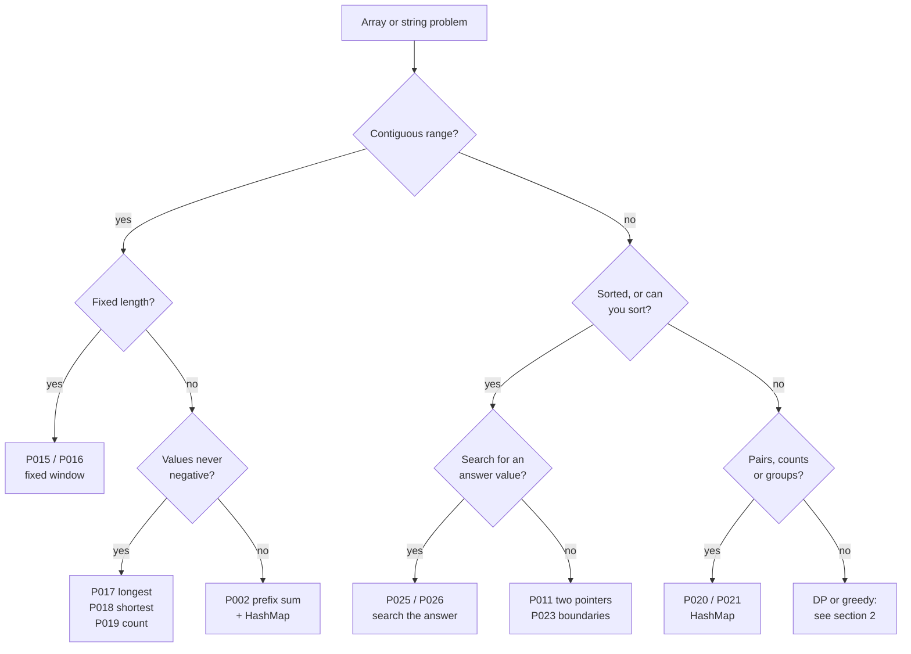

# DSA pattern recognition map

Use this page when you read a new problem and do not know where to start. Find the wording or
the input shape in the tables below, open the pattern file it points to, and check the file's
`RECOGNIZE WHEN` section to confirm. Every link goes to a file in
[00-Patterns](../00-Patterns/): one pattern per file, with a reusable template, one classic
problem solved, and its variants coded or listed.

| Section | What it answers |
|---|---|
| [1. Read the constraints first](#1-read-the-constraints-first) | Which complexity, and so which family, the input size allows |
| [2. Signal to pattern](#2-signal-to-pattern) | "The problem says X" to the pattern file, grouped by input shape |
| [3. Look-alikes](#3-look-alikes) | Pairs of patterns that are easy to confuse, and the one test that separates them |
| [4. Decision flow for arrays and strings](#4-decision-flow-for-arrays-and-strings) | A short flowchart for the most common input |
| [5. Revision passes](#5-revision-passes) | The 54-file quick pass, the 110-file full pass, and how to practise |
| [6. Not covered on purpose](#6-not-covered-on-purpose) | Topics left out, and why |

## 1. Read the constraints first

The input size usually tells you the intended complexity before you understand the problem.

| Largest n | Budget | Usually means |
|---|---|---|
| up to about 10 | O(n!) | try every ordering: [P077](../00-Patterns/13-Backtracking/P077_Permutations.java) |
| up to about 20 | O(2^n) | every subset or a bitmask state: [P076](../00-Patterns/13-Backtracking/P076_Subsets.java), [P094](../00-Patterns/14-Dynamic-Programming/P094_BitmaskDp.java) |
| up to about 500 | O(n^3) | interval DP or all-pairs shortest paths: [P091](../00-Patterns/14-Dynamic-Programming/P091_IntervalDp.java), [P073](../00-Patterns/12-Graphs/P073_BellmanFordFloyd.java) |
| up to about 5,000 | O(n^2) | 2D DP over two strings or a pair of indices: [P087](../00-Patterns/14-Dynamic-Programming/P087_TwoStringDp.java), [P086](../00-Patterns/14-Dynamic-Programming/P086_LongestIncreasingSubsequence.java) |
| up to about 10^6 | O(n log n) or O(n) | sort, heap, binary search, window, prefix sums, BFS |
| 10^9 or more | O(log n) | binary search on the answer, or a formula: [P025](../00-Patterns/05-Binary-Search/P025_AnswerSpaceMinimize.java), [P101](../00-Patterns/16-Math-Bits/P101_NumberTheory.java) |

| When the input... | Think first of |
|---|---|
| is sorted | [P023](../00-Patterns/05-Binary-Search/P023_BoundarySearch.java) boundary search, [P011](../00-Patterns/02-Two-Pointers/P011_OppositeEndsSorted.java) two pointers |
| was sorted, then rotated | [P024](../00-Patterns/05-Binary-Search/P024_RotatedSortedArray.java) |
| holds values in 1..n | [P005](../00-Patterns/01-Arrays-Prefix-Sums/P005_CyclicSortIndexAsHash.java) cyclic sort |
| has negatives and asks about a sum | [P002](../00-Patterns/01-Arrays-Prefix-Sums/P002_PrefixSumHashMap.java) prefix sum + HashMap (a window breaks) |
| is a grid | [P065](../00-Patterns/12-Graphs/P065_GridFloodFill.java) flood fill, [P067](../00-Patterns/12-Graphs/P067_BfsShortestPath.java) BFS, [P089](../00-Patterns/14-Dynamic-Programming/P089_GridDp.java) grid DP |
| asks for "minimum maximum" or "maximum minimum" | [P025](../00-Patterns/05-Binary-Search/P025_AnswerSpaceMinimize.java) or [P026](../00-Patterns/05-Binary-Search/P026_AnswerSpaceMaximize.java) |
| asks for the k-th or the top k | [P043](../00-Patterns/08-Heap-TreeMap/P043_TopK.java) |
| arrives as a stream | [P043](../00-Patterns/08-Heap-TreeMap/P043_TopK.java), [P045](../00-Patterns/08-Heap-TreeMap/P045_TwoHeaps.java) |
| asks to LIST every combination or arrangement | backtracking, [P076](../00-Patterns/13-Backtracking/P076_Subsets.java) to [P081](../00-Patterns/13-Backtracking/P081_StringPartitionGenerate.java) |
| asks to COUNT ways or find the best cost | dynamic programming, [P082](../00-Patterns/14-Dynamic-Programming/P082_LinearTakeSkip.java) to [P094](../00-Patterns/14-Dynamic-Programming/P094_BitmaskDp.java) |

## 2. Signal to pattern

### Arrays and strings: contiguous ranges

| The problem says or shows | Pattern | Classic |
|---|---|---|
| sum of a range, many queries, array never changes | [P001](../00-Patterns/01-Arrays-Prefix-Sums/P001_PrefixSumRangeQuery.java) | LC 303 |
| number of subarrays with sum k, negatives allowed | [P002](../00-Patterns/01-Arrays-Prefix-Sums/P002_PrefixSumHashMap.java) | LC 560 |
| add v to every index in [l, r], read values at the end | [P003](../00-Patterns/01-Arrays-Prefix-Sums/P003_DifferenceArray.java) | LC 1109 |
| maximum sum or product of a subarray | [P004](../00-Patterns/01-Arrays-Prefix-Sums/P004_KadaneBestEndingHere.java) | LC 53 |
| every window of length k (sum, count, average) | [P015](../00-Patterns/03-Sliding-Window/P015_FixedWindowAggregate.java) | LC 643 |
| an anagram or permutation of p inside s | [P016](../00-Patterns/03-Sliding-Window/P016_FixedWindowFrequencyMatch.java) | LC 438 |
| LONGEST substring or subarray with at most k of something | [P017](../00-Patterns/03-Sliding-Window/P017_VariableWindowLongest.java) | LC 3 |
| SHORTEST subarray reaching a sum, or covering all of t | [P018](../00-Patterns/03-Sliding-Window/P018_VariableWindowShortest.java) | LC 209 |
| NUMBER of subarrays with exactly k of something | [P019](../00-Patterns/03-Sliding-Window/P019_CountSubarraysAtMost.java) | LC 713 |
| maximum or minimum of every sliding window | [P042](../00-Patterns/07-Stack-Queue-Monotonic/P042_MonotonicDeque.java) | LC 239 |
| answer[i] needs everything left and right of i | [P008](../00-Patterns/01-Arrays-Prefix-Sums/P008_PrefixSuffixTwoPasses.java) | LC 238 |

### Arrays: pairs, order and in-place work

| The problem says or shows | Pattern | Classic |
|---|---|---|
| a pair or triple with a target sum, sorted input | [P011](../00-Patterns/02-Two-Pointers/P011_OppositeEndsSorted.java) | LC 167 |
| a pair with a target sum, unsorted, return indices | [P020](../00-Patterns/04-Hashing/P020_ComplementLookup.java) | LC 1 |
| palindrome check, or reverse in place | [P012](../00-Patterns/02-Two-Pointers/P012_PalindromePointers.java) | LC 125 |
| remove or compact in place, keep the order | [P013](../00-Patterns/02-Two-Pointers/P013_ReadWriteFilter.java) | LC 26 |
| merge or intersect two sorted sequences | [P014](../00-Patterns/02-Two-Pointers/P014_WalkTwoSequences.java) | LC 88 |
| values in 1..n, find missing or duplicate in O(1) space | [P005](../00-Patterns/01-Arrays-Prefix-Sums/P005_CyclicSortIndexAsHash.java) | LC 448 |
| an element appearing more than n/2 (or n/3) times | [P006](../00-Patterns/01-Arrays-Prefix-Sums/P006_BoyerMooreVoting.java) | LC 169 |
| sort three kinds of values in one pass | [P007](../00-Patterns/01-Arrays-Prefix-Sums/P007_ThreeWayPartition.java) | LC 75 |
| rotate, next permutation, reverse the words | [P009](../00-Patterns/01-Arrays-Prefix-Sums/P009_ReverseTricks.java) | LC 189 |
| spiral, rotate or zero rows of a matrix | [P010](../00-Patterns/01-Arrays-Prefix-Sums/P010_MatrixInPlace.java) | LC 54 |
| group anagrams, isomorphic strings, same word pattern | [P021](../00-Patterns/04-Hashing/P021_FrequencyCanonicalKey.java) | LC 49 |
| longest run of consecutive VALUES in O(n), unsorted | [P022](../00-Patterns/04-Hashing/P022_HashSetRunDetection.java) | LC 128 |

### Searching

| The problem says or shows | Pattern | Classic |
|---|---|---|
| first or last position, insert position | [P023](../00-Patterns/05-Binary-Search/P023_BoundarySearch.java) | LC 34 |
| sorted array rotated at an unknown point | [P024](../00-Patterns/05-Binary-Search/P024_RotatedSortedArray.java) | LC 33 |
| minimum speed / capacity / days so that it is possible | [P025](../00-Patterns/05-Binary-Search/P025_AnswerSpaceMinimize.java) | LC 875 |
| maximise the minimum distance or piece | [P026](../00-Patterns/05-Binary-Search/P026_AnswerSpaceMaximize.java) | LC 1552 |
| peak, mountain, bitonic | [P027](../00-Patterns/05-Binary-Search/P027_SlopePeak.java) | LC 162 |
| search or k-th smallest in a sorted matrix | [P028](../00-Patterns/05-Binary-Search/P028_MatrixSearch.java) | LC 74 |
| single element among pairs, k-th missing, h-index | [P029](../00-Patterns/05-Binary-Search/P029_IndexValuePredicate.java) | LC 540 |
| median or k-th of two sorted arrays in log time | [P030](../00-Patterns/05-Binary-Search/P030_PartitionTwoArrays.java) | LC 4 |

### Linked lists

| The problem says or shows | Pattern | Classic |
|---|---|---|
| cycle, cycle start, middle node, duplicate in read-only array | [P031](../00-Patterns/06-Linked-List/P031_FastSlowPointers.java) | LC 141 |
| reverse the list, a sublist, or every k nodes; palindrome list | [P032](../00-Patterns/06-Linked-List/P032_InPlaceReversal.java) | LC 206 |
| merge lists, add two numbers, partition, remove duplicates | [P033](../00-Patterns/06-Linked-List/P033_DummyHeadMerge.java) | LC 21 |
| n-th node from the end, rotate, intersection point | [P034](../00-Patterns/06-Linked-List/P034_GapPointers.java) | LC 19 |
| deep copy with random pointers, clone a graph | [P035](../00-Patterns/06-Linked-List/P035_CloneWithMap.java) | LC 138 |

### Stacks, queues, heaps and ordered maps

| The problem says or shows | Pattern | Classic |
|---|---|---|
| valid brackets, minimum removals, longest valid run | [P036](../00-Patterns/07-Stack-Queue-Monotonic/P036_MatchingStack.java) | LC 20 |
| next greater / warmer day / stock span | [P037](../00-Patterns/07-Stack-Queue-Monotonic/P037_NextGreaterElement.java) | LC 739 |
| largest rectangle, sum of subarray minimums | [P038](../00-Patterns/07-Stack-Queue-Monotonic/P038_StackBoundariesContribution.java) | LC 84 |
| remove k digits, smallest subsequence of distinct letters | [P039](../00-Patterns/07-Stack-Queue-Monotonic/P039_GreedyRemovalStack.java) | LC 402 |
| evaluate an expression, calculator, decode k[...] | [P040](../00-Patterns/07-Stack-Queue-Monotonic/P040_ExpressionEvaluation.java) | LC 150 |
| collisions, simplify a path, car fleets, function run times | [P041](../00-Patterns/07-Stack-Queue-Monotonic/P041_StackSimulation.java) | LC 735 |
| k largest, k most frequent, k closest | [P043](../00-Patterns/08-Heap-TreeMap/P043_TopK.java) | LC 215 |
| merge k sorted lists, k-th smallest across sorted rows | [P044](../00-Patterns/08-Heap-TreeMap/P044_KWayMerge.java) | LC 23 |
| running median, median of a window, choose projects (IPO) | [P045](../00-Patterns/08-Heap-TreeMap/P045_TwoHeaps.java) | LC 295 |
| task cooldowns, reorganise string, bricks and ladders, refuelling | [P046](../00-Patterns/08-Heap-TreeMap/P046_HeapSchedulingGreedy.java) | LC 621 |
| book without overlap, nearest key below or above x | [P047](../00-Patterns/08-Heap-TreeMap/P047_TreeMapFloorCeiling.java) | LC 729 |

### Intervals

| The problem says or shows | Pattern | Classic |
|---|---|---|
| merge, insert, any overlap, intersections | [P048](../00-Patterns/09-Intervals/P048_MergeIntervals.java) | LC 56 |
| remove the fewest, keep the most, minimum arrows | [P049](../00-Patterns/09-Intervals/P049_SortByEndGreedy.java) | LC 435 |
| minimum rooms or platforms, most overlapping at once | [P050](../00-Patterns/09-Intervals/P050_SweepLineMinRooms.java) | LC 253 |
| intervals with profits, maximise the total | [P093](../00-Patterns/14-Dynamic-Programming/P093_WeightedJobScheduling.java) | LC 1235 |

### Trees

| The problem says or shows | Pattern | Classic |
|---|---|---|
| traverse without recursion, or in O(1) space | [P051](../00-Patterns/10-Trees/P051_IterativeTraversals.java) | LC 94 |
| per level: right view, zigzag, minimum depth, averages | [P052](../00-Patterns/10-Trees/P052_BfsByLevel.java) | LC 102 |
| height, diameter, balanced, maximum path sum | [P053](../00-Patterns/10-Trees/P053_BottomUpDfs.java) | LC 543 |
| root-to-leaf sums, good nodes, path sums starting anywhere | [P054](../00-Patterns/10-Trees/P054_TopDownDfsPath.java) | LC 113 |
| same tree, symmetric, subtree, invert | [P055](../00-Patterns/10-Trees/P055_TwoTreeRecursion.java) | LC 100 |
| validate a BST, k-th smallest, minimum difference | [P056](../00-Patterns/10-Trees/P056_BstProperty.java) | LC 98 |
| insert into or delete from a BST, sorted array to BST | [P057](../00-Patterns/10-Trees/P057_BstModifyBuild.java) | LC 450 |
| lowest common ancestor (any tree, parent links, many nodes) | [P058](../00-Patterns/10-Trees/P058_LowestCommonAncestor.java) | LC 236 |
| build from two traversals, serialise and deserialise | [P059](../00-Patterns/10-Trees/P059_BuildSerializeTree.java) | LC 105 |
| vertical order, top view, bottom view | [P060](../00-Patterns/10-Trees/P060_VerticalOrderViews.java) | LC 987 |
| distance k from a node, time to burn the whole tree | [P061](../00-Patterns/10-Trees/P061_TreeAsGraph.java) | LC 863 |
| rob houses arranged as a tree, cameras, distribute coins | [P062](../00-Patterns/10-Trees/P062_TreeDp.java) | LC 337 |

### Tries

| The problem says or shows | Pattern | Classic |
|---|---|---|
| prefix search, autocomplete, words with '.' wildcards | [P063](../00-Patterns/11-Trie/P063_TrieBasics.java) | LC 208 |
| many words in one grid, maximum XOR of two numbers | [P064](../00-Patterns/11-Trie/P064_TrieDfsBitTrie.java) | LC 212 |

### Graphs and grids

| The problem says or shows | Pattern | Classic |
|---|---|---|
| islands, regions, flood fill, surrounded cells | [P065](../00-Patterns/12-Graphs/P065_GridFloodFill.java) | LC 200 |
| provinces, rooms and keys, equations like a / b = 2 | [P066](../00-Patterns/12-Graphs/P066_AdjacencyComponents.java) | LC 547 |
| fewest steps, equal costs, states (lock, word ladder) | [P067](../00-Patterns/12-Graphs/P067_BfsShortestPath.java) | LC 1091 |
| spreads from many sources (rot, nearest 0, gates) | [P068](../00-Patterns/12-Graphs/P068_MultiSourceBfs.java) | LC 994 |
| prerequisites, build order, alien dictionary | [P069](../00-Patterns/12-Graphs/P069_TopologicalSort.java) | LC 210 |
| split into two teams, detect a cycle, is it a tree | [P070](../00-Patterns/12-Graphs/P070_DfsColoringCycleBipartite.java) | LC 785 |
| connect as edges arrive, redundant edge, merge accounts | [P071](../00-Patterns/12-Graphs/P071_UnionFind.java) | LC 684 |
| cheapest path, non-negative weights; minimax; 0/1 costs | [P072](../00-Patterns/12-Graphs/P072_Dijkstra.java) | LC 743 |
| at most k stops, negative weights, all pairs | [P073](../00-Patterns/12-Graphs/P073_BellmanFordFloyd.java) | LC 787 |
| connect all points as cheaply as possible | [P074](../00-Patterns/12-Graphs/P074_MinimumSpanningTree.java) | LC 1584 |
| critical connections, strongly connected groups, use every edge once | [P075](../00-Patterns/12-Graphs/P075_BridgesSccEuler.java) | LC 1192 |

### Backtracking: list every solution

| The problem says or shows | Pattern | Classic |
|---|---|---|
| all subsets (the power set) | [P076](../00-Patterns/13-Backtracking/P076_Subsets.java) | LC 78 |
| all orderings, the k-th ordering | [P077](../00-Patterns/13-Backtracking/P077_Permutations.java) | LC 46 |
| all combinations reaching a target, choose k of n | [P078](../00-Patterns/13-Backtracking/P078_CombinationSum.java) | LC 39 |
| N-Queens, sudoku, graph colouring | [P079](../00-Patterns/13-Backtracking/P079_ConstraintPlacement.java) | LC 51 |
| a word in a grid, paths covering every cell | [P080](../00-Patterns/13-Backtracking/P080_GridPathBacktracking.java) | LC 79 |
| split into palindromes or IP parts, generate brackets or phone letters | [P081](../00-Patterns/13-Backtracking/P081_StringPartitionGenerate.java) | LC 131 |

### Dynamic programming: count or optimise

| The problem says or shows | Pattern | Classic |
|---|---|---|
| neighbours cannot both be picked, climbing stairs | [P082](../00-Patterns/14-Dynamic-Programming/P082_LinearTakeSkip.java) | LC 198 |
| split a string into dictionary words, decode ways | [P083](../00-Patterns/14-Dynamic-Programming/P083_StringPrefixDp.java) | LC 139 |
| each item at most once, capacity or target sum | [P084](../00-Patterns/14-Dynamic-Programming/P084_ZeroOneKnapsack.java) | LC 416 |
| unlimited copies, coin change, combinations vs sequences | [P085](../00-Patterns/14-Dynamic-Programming/P085_UnboundedKnapsack.java) | LC 322 |
| longest increasing subsequence, chains, nested envelopes | [P086](../00-Patterns/14-Dynamic-Programming/P086_LongestIncreasingSubsequence.java) | LC 300 |
| two strings: common subsequence, edit distance, counting matches | [P087](../00-Patterns/14-Dynamic-Programming/P087_TwoStringDp.java) | LC 1143 |
| wildcard or regular expression matching | [P088](../00-Patterns/14-Dynamic-Programming/P088_WildcardRegexDp.java) | LC 44 |
| grid paths moving right or down, largest square | [P089](../00-Patterns/14-Dynamic-Programming/P089_GridDp.java) | LC 62 |
| longest palindromic substring, count them, minimum cuts | [P090](../00-Patterns/14-Dynamic-Programming/P090_PalindromeDp.java) | LC 5 |
| burst balloons, cut a stick, matrix chain, stone game | [P091](../00-Patterns/14-Dynamic-Programming/P091_IntervalDp.java) | LC 312 |
| stock trading with cooldown, fee or k transactions | [P092](../00-Patterns/14-Dynamic-Programming/P092_StockStateMachine.java) | LC 309 |
| non-overlapping jobs with profits | [P093](../00-Patterns/14-Dynamic-Programming/P093_WeightedJobScheduling.java) | LC 1235 |
| n up to 20: partition into k groups, travelling salesman | [P094](../00-Patterns/14-Dynamic-Programming/P094_BitmaskDp.java) | LC 698 |

### Greedy

| The problem says or shows | Pattern | Classic |
|---|---|---|
| can you reach the end, fewest jumps, fewest taps | [P095](../00-Patterns/15-Greedy/P095_Reachability.java) | LC 55 |
| match two groups (cookies, boats), order to maximise | [P096](../00-Patterns/15-Greedy/P096_SortAndPair.java) | LC 455 |
| gas station, giving change, best hour to close | [P097](../00-Patterns/15-Greedy/P097_RunningBalance.java) | LC 134 |
| partition labels, maximum swap, candy | [P098](../00-Patterns/15-Greedy/P098_BoundariesTwoPasses.java) | LC 763 |

### Bits, math, design, string algorithms, range queries

| The problem says or shows | Pattern | Classic |
|---|---|---|
| one value appears once, the rest twice; missing number | [P099](../00-Patterns/16-Math-Bits/P099_XorTricks.java) | LC 136 |
| count bits, power of two, reverse bits | [P100](../00-Patterns/16-Math-Bits/P100_BitMasksCounting.java) | LC 191 |
| count primes, x to the n, gcd and lcm, trailing zeros | [P101](../00-Patterns/16-Math-Bits/P101_NumberTheory.java) | LC 204 |
| LRU or LFU cache | [P102](../00-Patterns/17-Design/P102_LruLfuCache.java) | LC 146 |
| O(1) insert, delete and random; min stack; queue from stacks | [P103](../00-Patterns/17-Design/P103_ConstantTimeCombos.java) | LC 380 |
| value as of time t, snapshots, hits in the last 5 minutes | [P104](../00-Patterns/17-Design/P104_VersionedTimeMap.java) | LC 981 |
| iterator over nested lists, a BST, or with peek | [P105](../00-Patterns/17-Design/P105_IteratorDesign.java) | LC 341 |
| find a pattern in O(n + m), repeated pattern, shortest palindrome | [P106](../00-Patterns/18-String-Algorithms/P106_KmpPrefixFunction.java) | LC 28 |
| repeated substrings of length L, longest duplicate substring | [P107](../00-Patterns/18-String-Algorithms/P107_RollingHash.java) | LC 187 |
| atoi, string compression, valid number | [P108](../00-Patterns/18-String-Algorithms/P108_CarefulParsing.java) | LC 8 |
| prefix sums WITH updates, count smaller after self, inversions | [P109](../00-Patterns/19-Range-Queries/P109_FenwickAndMergeCounting.java) | LC 307 |
| range minimum with updates, range add with range sum | [P110](../00-Patterns/19-Range-Queries/P110_SegmentTree.java) | RMQ |

## 3. Look-alikes

These pairs are where most wrong first attempts come from. The middle column is the single
question that decides between them.

| These look alike | Decide with | Go to |
|---|---|---|
| longest subarray with sum k | can values be negative? no: window; yes: prefix map | [P017](../00-Patterns/03-Sliding-Window/P017_VariableWindowLongest.java) / [P002](../00-Patterns/01-Arrays-Prefix-Sums/P002_PrefixSumHashMap.java) |
| shortest subarray with sum >= k | negatives? no: window; yes: deque of prefix sums | [P018](../00-Patterns/03-Sliding-Window/P018_VariableWindowShortest.java) / [P042](../00-Patterns/07-Stack-Queue-Monotonic/P042_MonotonicDeque.java) |
| count subarrays with exactly k | non-negative: atMost(k) - atMost(k - 1); negatives: prefix map | [P019](../00-Patterns/03-Sliding-Window/P019_CountSubarraysAtMost.java) / [P002](../00-Patterns/01-Arrays-Prefix-Sums/P002_PrefixSumHashMap.java) |
| coin change II vs combination sum IV | does order matter? coins outer loop: combinations; amounts outer: sequences | [P085](../00-Patterns/14-Dynamic-Programming/P085_UnboundedKnapsack.java) |
| 0/1 vs unbounded knapsack | can an item repeat? capacity loop goes DOWN (once) or UP (repeat) | [P084](../00-Patterns/14-Dynamic-Programming/P084_ZeroOneKnapsack.java) / [P085](../00-Patterns/14-Dynamic-Programming/P085_UnboundedKnapsack.java) |
| binary search to minimise vs maximise | is the answer the first true or the last true? (last true rounds mid up) | [P025](../00-Patterns/05-Binary-Search/P025_AnswerSpaceMinimize.java) / [P026](../00-Patterns/05-Binary-Search/P026_AnswerSpaceMaximize.java) |
| BFS vs Dijkstra vs 0-1 BFS vs Bellman-Ford | all edges equal / non-negative / only 0 and 1 / negative or stop limit | [P067](../00-Patterns/12-Graphs/P067_BfsShortestPath.java) / [P072](../00-Patterns/12-Graphs/P072_Dijkstra.java) / [P073](../00-Patterns/12-Graphs/P073_BellmanFordFloyd.java) |
| heap vs quickselect vs buckets for top k | stream or small k: heap; one-off: quickselect; small integer keys: buckets | [P043](../00-Patterns/08-Heap-TreeMap/P043_TopK.java) |
| merge vs keep-most vs minimum rooms | sort by start and merge / sort by end and keep / sweep the events | [P048](../00-Patterns/09-Intervals/P048_MergeIntervals.java) / [P049](../00-Patterns/09-Intervals/P049_SortByEndGreedy.java) / [P050](../00-Patterns/09-Intervals/P050_SweepLineMinRooms.java) |
| interval greedy vs interval DP | do intervals carry different weights? | [P049](../00-Patterns/09-Intervals/P049_SortByEndGreedy.java) / [P093](../00-Patterns/14-Dynamic-Programming/P093_WeightedJobScheduling.java) |
| subsets vs permutations vs combinations | forward start index / used[] from 0 / a size or sum bound | [P076](../00-Patterns/13-Backtracking/P076_Subsets.java) / [P077](../00-Patterns/13-Backtracking/P077_Permutations.java) / [P078](../00-Patterns/13-Backtracking/P078_CombinationSum.java) |
| backtracking vs DP on the same story | LIST every solution, or COUNT / OPTIMISE them? | [P078](../00-Patterns/13-Backtracking/P078_CombinationSum.java) / [P085](../00-Patterns/14-Dynamic-Programming/P085_UnboundedKnapsack.java) |
| palindromic substring vs subsequence | contiguous? expand around centre; not: LCS with the reverse | [P090](../00-Patterns/14-Dynamic-Programming/P090_PalindromeDp.java) / [P087](../00-Patterns/14-Dynamic-Programming/P087_TwoStringDp.java) |
| union-find vs DFS components | edges arrive over time, or one traversal is enough? | [P071](../00-Patterns/12-Graphs/P071_UnionFind.java) / [P066](../00-Patterns/12-Graphs/P066_AdjacencyComponents.java) |
| bottom-up vs top-down tree DFS | does a node need its children's results, or its ancestors' state? | [P053](../00-Patterns/10-Trees/P053_BottomUpDfs.java) / [P054](../00-Patterns/10-Trees/P054_TopDownDfsPath.java) |
| LCA in a BST vs any tree | can you use the ordering? | [P056](../00-Patterns/10-Trees/P056_BstProperty.java) / [P058](../00-Patterns/10-Trees/P058_LowestCommonAncestor.java) |
| monotonic stack vs monotonic deque | nearest greater per element, or max of each sliding window? | [P037](../00-Patterns/07-Stack-Queue-Monotonic/P037_NextGreaterElement.java) / [P042](../00-Patterns/07-Stack-Queue-Monotonic/P042_MonotonicDeque.java) |
| prefix sum vs difference array vs Fenwick vs segment tree | static / updates then reads / point updates + sums / min, max or range updates | [P001](../00-Patterns/01-Arrays-Prefix-Sums/P001_PrefixSumRangeQuery.java) / [P003](../00-Patterns/01-Arrays-Prefix-Sums/P003_DifferenceArray.java) / [P109](../00-Patterns/19-Range-Queries/P109_FenwickAndMergeCounting.java) / [P110](../00-Patterns/19-Range-Queries/P110_SegmentTree.java) |
| cycle detection: Floyd vs HashSet | is O(1) extra space required? | [P031](../00-Patterns/06-Linked-List/P031_FastSlowPointers.java) / [P022](../00-Patterns/04-Hashing/P022_HashSetRunDetection.java) |
| greedy vs DP | can you prove "the locally best choice is never wrong"? if not, DP | [P095](../00-Patterns/15-Greedy/P095_Reachability.java) / [P082](../00-Patterns/14-Dynamic-Programming/P082_LinearTakeSkip.java) |

## 4. Decision flow for arrays and strings

## 5. Revision passes

**Quick pass (54 files).** The files marked `MUST-KNOW` in their title line, in folder order:

| Family | Must-know files |
|---|---|
| 01-Arrays-Prefix-Sums | [P002](../00-Patterns/01-Arrays-Prefix-Sums/P002_PrefixSumHashMap.java), [P004](../00-Patterns/01-Arrays-Prefix-Sums/P004_KadaneBestEndingHere.java), [P005](../00-Patterns/01-Arrays-Prefix-Sums/P005_CyclicSortIndexAsHash.java), [P008](../00-Patterns/01-Arrays-Prefix-Sums/P008_PrefixSuffixTwoPasses.java) |
| 02-Two-Pointers | [P011](../00-Patterns/02-Two-Pointers/P011_OppositeEndsSorted.java), [P013](../00-Patterns/02-Two-Pointers/P013_ReadWriteFilter.java) |
| 03-Sliding-Window | [P015](../00-Patterns/03-Sliding-Window/P015_FixedWindowAggregate.java), [P016](../00-Patterns/03-Sliding-Window/P016_FixedWindowFrequencyMatch.java), [P017](../00-Patterns/03-Sliding-Window/P017_VariableWindowLongest.java), [P018](../00-Patterns/03-Sliding-Window/P018_VariableWindowShortest.java), [P019](../00-Patterns/03-Sliding-Window/P019_CountSubarraysAtMost.java) |
| 04-Hashing | [P020](../00-Patterns/04-Hashing/P020_ComplementLookup.java), [P021](../00-Patterns/04-Hashing/P021_FrequencyCanonicalKey.java), [P022](../00-Patterns/04-Hashing/P022_HashSetRunDetection.java) |
| 05-Binary-Search | [P023](../00-Patterns/05-Binary-Search/P023_BoundarySearch.java), [P024](../00-Patterns/05-Binary-Search/P024_RotatedSortedArray.java), [P025](../00-Patterns/05-Binary-Search/P025_AnswerSpaceMinimize.java), [P026](../00-Patterns/05-Binary-Search/P026_AnswerSpaceMaximize.java) |
| 06-Linked-List | [P031](../00-Patterns/06-Linked-List/P031_FastSlowPointers.java), [P032](../00-Patterns/06-Linked-List/P032_InPlaceReversal.java), [P033](../00-Patterns/06-Linked-List/P033_DummyHeadMerge.java) |
| 07-Stack-Queue-Monotonic | [P036](../00-Patterns/07-Stack-Queue-Monotonic/P036_MatchingStack.java), [P037](../00-Patterns/07-Stack-Queue-Monotonic/P037_NextGreaterElement.java), [P038](../00-Patterns/07-Stack-Queue-Monotonic/P038_StackBoundariesContribution.java), [P040](../00-Patterns/07-Stack-Queue-Monotonic/P040_ExpressionEvaluation.java), [P042](../00-Patterns/07-Stack-Queue-Monotonic/P042_MonotonicDeque.java) |
| 08-Heap-TreeMap | [P043](../00-Patterns/08-Heap-TreeMap/P043_TopK.java), [P044](../00-Patterns/08-Heap-TreeMap/P044_KWayMerge.java), [P045](../00-Patterns/08-Heap-TreeMap/P045_TwoHeaps.java) |
| 09-Intervals | [P048](../00-Patterns/09-Intervals/P048_MergeIntervals.java), [P049](../00-Patterns/09-Intervals/P049_SortByEndGreedy.java) |
| 10-Trees | [P052](../00-Patterns/10-Trees/P052_BfsByLevel.java), [P053](../00-Patterns/10-Trees/P053_BottomUpDfs.java), [P054](../00-Patterns/10-Trees/P054_TopDownDfsPath.java), [P056](../00-Patterns/10-Trees/P056_BstProperty.java), [P058](../00-Patterns/10-Trees/P058_LowestCommonAncestor.java) |
| 11-Trie | [P063](../00-Patterns/11-Trie/P063_TrieBasics.java) |
| 12-Graphs | [P065](../00-Patterns/12-Graphs/P065_GridFloodFill.java), [P067](../00-Patterns/12-Graphs/P067_BfsShortestPath.java), [P068](../00-Patterns/12-Graphs/P068_MultiSourceBfs.java), [P069](../00-Patterns/12-Graphs/P069_TopologicalSort.java), [P071](../00-Patterns/12-Graphs/P071_UnionFind.java), [P072](../00-Patterns/12-Graphs/P072_Dijkstra.java) |
| 13-Backtracking | [P076](../00-Patterns/13-Backtracking/P076_Subsets.java), [P077](../00-Patterns/13-Backtracking/P077_Permutations.java), [P078](../00-Patterns/13-Backtracking/P078_CombinationSum.java) |
| 14-Dynamic-Programming | [P082](../00-Patterns/14-Dynamic-Programming/P082_LinearTakeSkip.java), [P084](../00-Patterns/14-Dynamic-Programming/P084_ZeroOneKnapsack.java), [P085](../00-Patterns/14-Dynamic-Programming/P085_UnboundedKnapsack.java), [P086](../00-Patterns/14-Dynamic-Programming/P086_LongestIncreasingSubsequence.java), [P087](../00-Patterns/14-Dynamic-Programming/P087_TwoStringDp.java), [P089](../00-Patterns/14-Dynamic-Programming/P089_GridDp.java) |
| 15-Greedy | [P095](../00-Patterns/15-Greedy/P095_Reachability.java) |
| 17-Design | [P102](../00-Patterns/17-Design/P102_LruLfuCache.java) |

**Full pass (110 files).** Every file in [00-Patterns](../00-Patterns/), folder by folder. The
[DSA README](../README.md) lists each one with its key insight.

**How to practise a file.** Open it in `tools/codeview` and switch on Practice. The method
bodies are hidden, and so are `RECOGNIZE WHEN`, `TEMPLATE`, `APPROACH`, `VARIATIONS` and
`PITFALLS`. The Hint button reveals them gentlest first: which pattern it is, then the
template, then the key insight. Run until every `expected` line matches. Then try one or two
of the listed (uncoded) variants from the file's `VARIATIONS` section on LeetCode.

## 6. Not covered on purpose

Digit DP, suffix arrays and automata, maximum flow and bipartite matching, 2-SAT, convex hull
and other geometry, matrix exponentiation, heavy-light decomposition. They are rare in
product-company interviews and each needs more than one page. Manacher's algorithm is only
named in [P090](../00-Patterns/14-Dynamic-Programming/P090_PalindromeDp.java).
