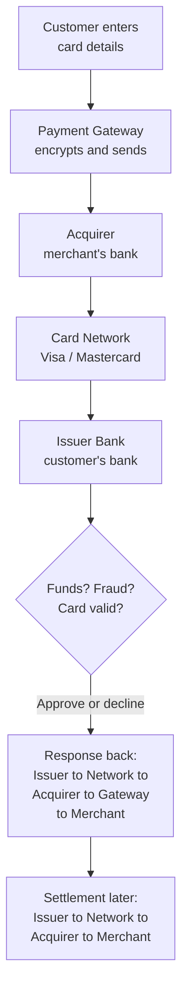
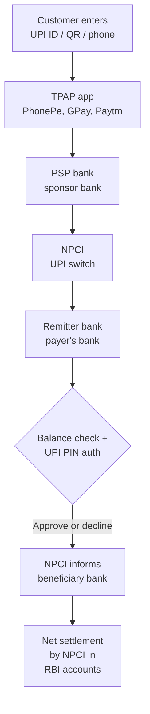

# Payment System Design

Explanatory notes on the building blocks of a payment system — compliance, ledgers, payment gateways versus PSPs, card networks, and UPI — converted from a Q&A transcript.

Blocks marked **Correction** flag a statement that was wrong or has gone out of date
since these notes were first written, and say what the right distinction is.

## Table of Contents

1. [Compliance for payment systems: AML/CFT, KYC and PCI-DSS](#1-compliance-for-payment-systems-amlcft-kyc-and-pci-dss)
2. [Names to remember: PSPs and payment gateways](#2-names-to-remember-psps-and-payment-gateways)
3. [What is a ledger?](#3-what-is-a-ledger)
4. [Payment Gateway vs Payment Service Provider (PSP)](#4-payment-gateway-vs-payment-service-provider-psp)
5. [Why do Visa/Mastercard exist when we already have banks?](#5-why-do-visamastercard-exist-when-we-already-have-banks)
6. [Authorization, capture, clearing, settlement — four different things](#6-authorization-capture-clearing-settlement--four-different-things)
7. [How UPI fits into the ecosystem (compared with Visa/Mastercard)](#7-how-upi-fits-into-the-ecosystem-compared-with-visamastercard)

---

## Who does what: the whole cast in one table

Read this first; the rest of the document expands each row.

| Actor | One-line job | Holds the money? | Example |
| ----- | ------------ | ---------------- | ------- |
| Issuer bank | Gave the customer the card/account; approves or declines | Yes, the payer's | SBI, HDFC, Chase |
| Acquirer bank | Banks the merchant; submits transactions into the network | Yes, the merchant's | Axis, ICICI, Barclays |
| Card network | Routes messages between acquirer and issuer; sets the rules | No | Visa, Mastercard, RuPay |
| Payment gateway | Captures and securely relays payment data | No | Authorize.Net, PayU Gateway |
| PSP / aggregator | Gateway + multiple acquirers + risk + settlement, in one contract | Often, in transit | Stripe, Adyen, Razorpay |

---

## 1. Compliance for payment systems: AML/CFT, KYC and PCI-DSS

AML/CFT compliance, KYC, and PCI-DSS are crucial for payment systems.

- **AML (Anti-Money Laundering)** and **CFT (Counter Financing of Terrorism)** compliance are essential for payment systems to prevent illegal activities.
- **KYC (Know Your Customer)** processes help verify the identity of users, ensuring that the payment system is not used for fraudulent purposes.
- **PCI-DSS (Payment Card Industry Data Security Standard)** compliance ensures that payment systems handle cardholder data securely, protecting against data breaches and fraud.

> **Version currency — PCI DSS v4.0.1 is the only active version.**
> v3.2.1 retired 31 March 2024 and v4.0 retired 31 December 2024, so "we are
> PCI DSS 3.2.1 compliant" is not a valid statement any more. v4.0.1 (June 2024)
> was a clarifying revision that added and removed no requirements. The 51
> future-dated requirements introduced by v4 stopped being "best practice" and
> became mandatory on 31 March 2025, so an assessment today covers the whole
> standard. *(Checked September 2026 — re-verify before quoting dates in an
> interview, since this is the fastest-moving fact in the document.)*

The scope point that matters in a design interview: the cheapest way to be
PCI-compliant is to never let card data touch your servers. Tokenize at the edge —
the customer's browser posts the card directly to the PSP, which returns a token,
and your backend only ever stores that token. This moves you from the full
assessment (SAQ D) to the much smaller one, and it is a design decision, not a
paperwork decision.

## 2. Names to remember: PSPs and payment gateways

- **Tipalti** — the original notes list this as a bare name. For the record, it is
  accounts-payable and mass-payout automation (paying your suppliers and creators),
  not a checkout gateway. It belongs in the *payouts* half of a payments design, not
  the *accepting money* half.
- Stripe, Braintree, PayPal, Square are popular payment gateways or PSPs.
- PSP -> Payment Service Provider

> **Correction — spelling and corporate names.** It is **Braintree** (one word,
> a PayPal subsidiary), not "BrainTree". Square is the merchant-facing brand; the
> parent company renamed itself **Block, Inc.** in 2021, so both names appear in
> documentation and they refer to the same organisation.

## 3. What is a ledger?

- A ledger is simply a record of transactions.
- In accounting: it's a book where debits and credits are written.
- Every entry = who paid, who received, when, and how much.
- It guarantees traceability.

> **Correction — a ledger does not by itself "prevent double spending".**
> The original note said it "prevents double spending (you can't spend money you
> don't have)". Two things are muddled there. *Double spending* is a
> cryptocurrency term for spending the same coin twice in the absence of a central
> authority; the equivalent problem in a bank ledger is simply an **overdraft**, and
> what prevents it is a balance check plus a constraint or a row lock at write time,
> not the act of recording. What the ledger genuinely gives you is **auditability**:
> an immutable, append-only history you can replay to derive any balance at any
> point in time.

The property to name instead, because it is what makes a ledger design correct:

| Rule | What it means | What it catches |
| ---- | ------------- | --------------- |
| Double entry | Every movement writes two rows: one debit, one credit | Money appearing or vanishing |
| Entries sum to zero | Debits and credits of one transaction must balance | A half-applied transfer |
| Append-only | Corrections are new reversing entries, never `UPDATE` | Silent tampering, lost audit trail |
| Balances are derived | Balance = sum of entries, optionally snapshotted | A cached balance drifting from reality |

## 4. Payment Gateway vs Payment Service Provider (PSP)

Payment Service Providers (PSPs) and Payment Gateways are related but play different roles in online and offline payments.

### Payment Gateway

Think of it as a digital POS terminal that captures and securely transmits payment data between the customer, the merchant, and the banks.

**Main role:** Acts as a technical bridge between the merchant's checkout page and the acquiring bank/payment processor.

**Responsibilities:**

- Encrypts and transfers the customer's payment data securely.
- Relays the authorization request, and returns the approve/decline in real time.
- Works like the "card swipe machine" but for the internet.
- Does NOT handle settlement of funds. It only passes information.

> **Correction — the gateway does not authorize anything.**
> The note previously read "Authorizes/declines transactions in real time", which
> gives the gateway a power it does not have. The **issuer bank** makes the
> approve/decline decision, because only the issuer knows the balance, the credit
> line and the cardholder's risk profile. The gateway formats and relays the request
> and carries the answer back. This matters in an interview: if you say the gateway
> authorizes, the natural follow-up ("so what happens when the gateway can't reach
> the issuer?") has no good answer, whereas the real system has one — stand-in
> processing, where the network answers on the issuer's behalf under pre-agreed
> limits.

**Examples of Payment Gateways:**

- Stripe (its gateway part)
- PayPal (its gateway part)
- Authorize.Net
- Razorpay Gateway
- PayU Gateway

### Payment Service Provider (PSP)

A PSP is broader — it bundles the gateway + connections to multiple acquiring banks, card networks, wallets, and sometimes offers merchant accounts.

**Main role:** Provides end-to-end infrastructure to accept online payments from multiple methods (cards, UPI, wallets, BNPL, etc.).

**Responsibilities:**

- Offers merchants a single integration to multiple payment methods.
- Provides risk/fraud management.
- Handles settlement (collects payments from customers and transfers them to the merchant's account).
- Offers reporting, reconciliation, sometimes compliance (PCI DSS, KYC).

**Examples of PSPs:**

- Stripe
- Adyen
- Razorpay (India)
- PayU
- Worldpay
- PhonePe (as a UPI app — see the [correction on UPI terminology](#where-psps-fit-with-upi), where "PSP" means something different)

### Key difference in roles

| Feature | Payment Gateway | PSP |
| ------- | --------------- | --- |
| Scope | Just a tech layer for secure transaction transfer | Full-stack payment solution |
| Merchant Account | Usually needs the merchant to have their own account with a bank | Often provides an aggregated merchant account |
| Settlement | No settlement – only forwards authorization | Manages settlement into the merchant's account |
| Payment Methods | Primarily card-focused | Cards, UPI, wallets, BNPL, net banking, etc. |
| Example | Authorize.Net | Stripe, Razorpay, PayU |

### Analogy

- Payment Gateway = "Highway" (secure road that moves payment data between parties).
- PSP = "Logistics Company" (owns trucks, manages routes, collects goods, delivers them, and handles everything end-to-end).

**In short:**

- Payment Gateway = technology enabler for payments.
- PSP = business + technology + settlement provider (all-in-one).

## 5. Why do Visa/Mastercard exist when we already have banks?

Original question: "Then what do Mastercard/Visa etc. do, and why? We have banks — are they not enough?"

This is where card networks like Visa and Mastercard come in. Let's put them in context of banks, PSPs, and gateways.

### Why Visa/Mastercard exist

- Even though we have banks, banks can't directly talk to every other bank in the world in real time for card payments.
- Imagine you have an SBI (India) debit card and you want to buy something from a US website where the seller uses Chase Bank (USA).
- SBI and Chase don't have a direct integration to process millions of card transactions worldwide.
- That's where Visa/Mastercard networks step in — they are global "switching" networks that connect issuer banks (your card's bank) with acquirer banks (the merchant's bank).
- The combinatorial argument is the one to say out loud: N banks connecting
  point-to-point need N² links; a hub needs N. That is the entire reason a switch
  exists, in payments and in every other network.

### Roles of Visa/Mastercard (card networks)

- Provide the rules, infrastructure, and rails for card payments.
- Route the transaction between the merchant's acquiring bank and the customer's issuing bank.
- Define standards (EMV chips, 3D Secure, tokenization, chargeback rules).
- Switch authorization messages between acquirer and issuer, and guarantee
  settlement between the two banks.
- Act as a trusted middle layer so banks don't need direct one-to-one connections with every other bank worldwide.

> **Correction — "authorization within milliseconds" oversells it.**
> The network's own switching hop is very fast, but that is not the number a user or
> a designer cares about. End-to-end card authorization — browser to gateway to
> acquirer to network to issuer and all the way back, including the issuer's fraud
> scoring — is typically a few hundred milliseconds to a couple of seconds, and the
> card schemes' own rules allow issuers several seconds before the network times out
> and applies stand-in processing. Budget your checkout timeouts against seconds,
> not milliseconds.

### Four-party vs three-party networks

A distinction the original note gestured at ("Amex also acts as issuer + network")
but did not name:

| Model | Who is involved | Consequence | Examples |
| ----- | --------------- | ----------- | -------- |
| Four-party (open loop) | Issuer, acquirer, network, merchant — all separate | Network sets interchange, banks compete | Visa, Mastercard, RuPay |
| Three-party (closed loop) | One company is issuer *and* acquirer *and* network | Sets its own merchant fees; fewer merchants accept it | American Express, Discover (historically), Diners |

### The payment ecosystem

Here's how it works step by step when you pay with a Visa/Mastercard card:

1. Customer enters card details on the merchant's checkout page.
2. Payment Gateway encrypts and sends data to the PSP/Acquirer.
3. Acquirer (merchant's bank) sends the request via the Visa/Mastercard network.
4. Card Network routes it to the Issuer (your bank).
5. Issuer Bank checks:
   - Sufficient funds?
   - Fraud/security checks?
   - Card validity?
   - Then approves or declines.
6. Response goes back → Issuer → Network → Acquirer → Gateway → Merchant.
7. Settlement: Later, money moves from Issuer → through Network → Acquirer → Merchant.

### Analogy

- Bank (Issuer/Acquirer) = Players (customer's and merchant's teams).
- Payment Gateway = The microphone/headset they use to send messages.
- PSP = The coach/manager arranging the whole play and collecting fees.
- Visa/Mastercard = The referee + stadium infrastructure ensuring both teams follow the same rules and can actually play.

### Examples

- Card Networks: Visa, Mastercard, American Express (Amex is a three-party network — issuer, acquirer and network in one), RuPay (India), Discover.
- Issuer Bank: SBI, HDFC, Chase, Citi (the bank that gave you the card).
- Acquirer Bank: Axis Bank, ICICI, Barclays, etc. (the merchant's bank).
- PSP: Stripe, Razorpay, Adyen.
- Gateway: Authorize.Net, PayU Gateway.

### So banks alone are not enough because

- They don't have a universal protocol to talk across countries.
- They'd need to connect with thousands of other banks individually.
- They can't enforce global security/standards.

That's why Visa/Mastercard networks exist: they provide the rails + rules that make card payments work globally.

### Who pays for it: interchange vs MDR

> **Correction — the notes listed "Interchange fees (0.3–3%)". That number is the
> MDR, not the interchange.** They are different fees paid by different parties,
> and conflating them makes the whole fee discussion wrong.

The merchant pays exactly one number — the **MDR (Merchant Discount Rate)** — to its
acquirer or PSP. That number is then split three ways:

| Component | Paid to | Who sets it | Rough size |
| --------- | ------- | ----------- | ---------- |
| Interchange | The **issuer** bank | The card network's published schedule | EU: capped at 0.2% debit / 0.3% credit. US credit: roughly 1.4–2.7% |
| Scheme / assessment fee | The **network** (Visa, Mastercard) | The network | A small fraction of a percent |
| Acquirer markup | The **acquirer / PSP** | Negotiated with the merchant | The part a merchant can actually negotiate |

Two consequences worth stating:

- Interchange is the **largest** component and flows to the *issuer*, which is why
  banks push credit cards and rewards programmes so hard — rewards are funded out of
  interchange.
- Capping interchange (as the EU did) does not cap what the merchant pays, because
  scheme fees and acquirer markup sit on top. Across all US merchants, the average
  total fee on Visa and Mastercard transactions was about 2.36% in 2025.

## 6. Authorization, capture, clearing, settlement — four different things

The original step 7 above compressed all of this into "settlement: later, money
moves". Interviewers pull on exactly this thread, because the four stages have
different failure modes and different reconciliation jobs.

| Stage | What happens | Money moved? | Typical timing |
| ----- | ------------ | ------------ | -------------- |
| Authorization | Issuer checks and *holds* funds against the credit line | No | Seconds, at checkout |
| Capture | Merchant confirms the amount it actually wants | No | At ship time, or immediately |
| Clearing | Acquirer submits captured batches; network exchanges records | No | End of day |
| Settlement | Net positions move between banks | **Yes** | T+1 to T+3 |
| Payout | PSP pays the merchant its share, minus MDR | Yes | T+1 to T+7 |

Design implications to have ready:

- **An authorization is a hold, not a payment.** Holds expire (commonly ~7 days for
  cards, shorter for some issuers). If you capture after the hold expires, the
  capture can fail even though the auth succeeded — so any "authorize now, ship
  later" flow needs a re-auth path.
- **Auth amount ≠ capture amount.** Partial capture (you shipped two of three items)
  and incremental auth (hotel, fuel) are normal, and your ledger must model them.
- **Reconciliation is a separate daily batch job**, not a side effect of the API
  call. You compare your own ledger against the settlement file from the acquirer,
  and the mismatches — a capture with no settlement line, a settlement line with no
  capture — are the ones that need a human. Say "three-way reconciliation" (your
  ledger, the PSP report, the bank statement) and you sound like you have run one.
- **Chargebacks run backwards through the same chain**, weeks or months later, and
  reverse money that was already paid out. The merchant's ledger needs to carry the
  liability, not treat settlement as final.

## 7. How UPI fits into the ecosystem (compared with Visa/Mastercard)

UPI (India) removes the need for Visa/Mastercard in many cases. Here is how it compares with the card network model.

### How UPI is different from Visa/Mastercard

- Visa/Mastercard = private global card networks → connect banks for card-based payments.
- UPI (Unified Payments Interface) = public payments infrastructure in India,
  operated by NPCI (National Payments Corporation of India) → directly connects bank
  accounts, no cards needed.

> **Correction — RBI does not own NPCI.**
> The note said "owned by RBI + Indian banks". NPCI was *set up* in 2008 by the RBI
> together with the IBA (Indian Banks' Association), and it is a **not-for-profit
> company under Section 8 of the Companies Act**, but the RBI holds no equity in it.
> The shareholders are the member banks — ten promoter banks originally, broadened
> since to roughly 56 public sector, private, co-operative, foreign and payments
> banks. RBI's relationship is **regulatory**: it authorises NPCI as a payment system
> operator under the Payment and Settlement Systems Act and appoints directors to the
> board. The accurate phrasing is "promoted by RBI and IBA, owned by a consortium of
> banks, regulated by RBI".

### UPI flow (simplified)

When you pay using UPI (say PhonePe, GPay, Paytm, BHIM):

1. Customer enters UPI ID / QR / phone number in a **TPAP app**.
2. The TPAP routes the request through its **PSP bank**, which is the entity actually
   connected to NPCI.
3. NPCI (the UPI switch) routes the request to the payer's bank (the remitter bank).
4. Payer's bank checks balance, authenticates with the UPI PIN, then approves/declines.
5. NPCI informs the payee's bank (the beneficiary bank).
6. NPCI computes **multilateral net positions** across all banks and settles them in
   the banks' accounts held at the RBI.

> **Correction — UPI settlement is netted through NPCI, not bilateral.**
> The note said "settlement happens directly between issuer bank ↔ acquirer bank".
> It does not. NPCI acts as the central counterparty: it nets everything every bank
> owes every other bank across a settlement cycle down to one figure per bank, and
> those net figures move in the banks' settlement accounts at the RBI. This is why a
> payments system can clear billions of transactions without billions of interbank
> transfers, and it is the reason NPCI, not the banks, carries the settlement
> guarantee.

> **Terminology note — "issuer" and "acquirer" are card words.**
> In UPI the correct terms are **remitter bank** (payer's) and **beneficiary bank**
> (payee's). Using the card vocabulary is not fatal, but the right words signal that
> you know these are different rail designs rather than one design with two brands.

### Key differences

| Feature | Visa/Mastercard (Card Networks) | UPI (NPCI) |
| ------- | ------------------------------- | ---------- |
| Ownership | Private, listed global corporations | Section 8 not-for-profit, owned by member banks |
| Base | Works on cards (debit/credit) | Works on bank accounts directly |
| Merchant fees | MDR of roughly 1–3%, mostly interchange to the issuer | Zero for most transactions; see the MDR note below |
| Settlement | Net settlement under network rules | Multilateral netting by NPCI, settled at RBI |
| Authentication | Card + CVV + OTP/3DS | Mobile app + UPI PIN |

| Feature | Visa/Mastercard (Card Networks) | UPI (NPCI) |
| ------- | ------------------------------- | ---------- |
| Reach | Global | India-focused, with a growing set of partner countries |
| Example | Buy on Amazon with HDFC Visa card | Pay on Zomato using PhonePe UPI |

> **Correction — "near-zero MDR" is no longer the whole story.**
> Zero MDR on UPI P2M was mandated from January 2020, and for six years "UPI is free
> for merchants" was simply true. Under the MDR framework announced in September 2026
> and effective **15 October 2026**, a **0.4% MDR applies to P2M transactions above
> ₹2,000**, capped at ₹300 for transactions of ₹75,000 and above. What stays free:
> all P2P transfers at any amount, all P2M up to ₹2,000, and small merchants under
> the P2PM framework receiving up to ₹1 lakh a month. Railways, telecom and
> agri-input payments above ₹2,000 attract a flat ₹5. Merchants may not surcharge the
> customer, so UPI remains free at the consumer end.
> *(Checked September 2026, before the effective date — confirm the final rules
> before quoting the numbers.)*

### Analogy

- Visa/Mastercard = "International airline alliances" (e.g., Star Alliance) → let airlines (banks) interconnect globally.
- UPI = "National railway system" → one common public infrastructure where all trains (banks) run on shared tracks.

### Where PSPs fit with UPI

> **Correction — "PSP" means something different in UPI than in the card world, and
> PhonePe/GPay/Paytm are not PSPs.** This is the single most commonly mangled fact
> about UPI, and the original note had it the common wrong way round.

| Role in UPI | What it is | Examples |
| ----------- | ---------- | -------- |
| TPAP | Third-Party Application Provider: the non-bank app you actually tap | PhonePe, Google Pay, Paytm, Amazon Pay, CRED, WhatsApp |
| PSP bank | The **bank** licensed to connect to UPI and issue UPI handles; sponsors the TPAP | Yes Bank, Axis, ICICI, HDFC, SBI |
| NPCI | Owns and operates the switch; sets rules; nets and settles | NPCI |

So the corrected version of the original bullets:

- PhonePe, Google Pay, Paytm are **TPAPs** — apps. The **PSP** in UPI terminology is
  the sponsor bank behind the app.
- They don't hold your money; they provide the interface and the UPI PIN capture.
- The actual debit/credit happens between the remitter and beneficiary banks, netted
  and settled by NPCI.
- A TPAP **cannot talk to NPCI directly** — it must route through its PSP bank.
  Two real incidents make this concrete: when Yes Bank went into moratorium in March
  2020, PhonePe went dark with it, and PhonePe subsequently moved to a multi-bank
  model (Yes, Axis, ICICI). The same thing happened to Paytm in 2024 after the
  restrictions on Paytm Payments Bank, and NPCI approved a multi-bank arrangement
  (Axis, HDFC, SBI, Yes) to keep it running. The sponsor bank is a real dependency
  and a real single point of failure, which is exactly the kind of detail an
  interviewer is hoping you know.

### Bottom line

- Visa/Mastercard: private global card networks, necessary because banks alone can't talk to each other globally.
- UPI: India's public, bank-owned, RBI-regulated open payment network, directly linking bank accounts and reducing dependency on card networks.
