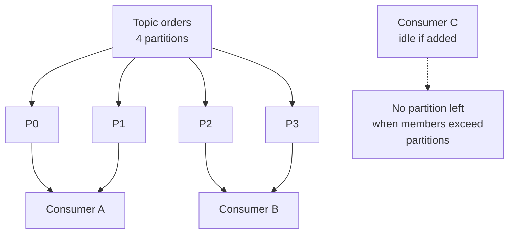

# Kafka Q&A

Interview-prep notes on Apache Kafka: consumer groups and partition assignment, offset commit
semantics, what exactly-once really requires, ordering guarantees, retention versus compaction,
producer and consumer configuration, throughput tuning, and why Kafka is fast.

## Contents

| # | Question | The one thing to remember |
| --- | --- | --- |
| 1 | [Exactly-once with ordering](#1-how-do-you-ensure-exactly-once-semantics-with-ordering-of-messages-in-kafka) | EOS is read-process-write inside one transaction, plus `read_committed` on the consumer. |
| 2 | [Consumer groups and partition assignment](#2-how-do-consumer-groups-and-partition-assignment-work) | A partition goes to exactly one consumer in a group; extra consumers idle. |
| 3 | [Offset commit semantics](#3-offset-commit-semantics-what-do-you-actually-get) | Commit after processing = at-least-once. There is no at-least-once *and* no duplicates. |
| 4 | [Ordering guarantees](#4-what-ordering-does-kafka-actually-guarantee) | Per partition, never per topic. |
| 5 | [Retention vs compaction](#5-retention-versus-compaction) | `delete` drops old records; `compact` keeps the newest per key. |
| 6 | [DB write + event publish](#6-transaction-boundaries-across-services-db-write-plus-event-publish) | Transactional outbox: one local transaction, then a relay. |
| 7 | [Producer with a callback](#7-how-do-you-write-a-basic-kafka-producer-with-a-send-callback) | `send()` is async; the callback runs on the I/O thread. |
| 8 | [`max.poll.interval.ms` exceeded](#8-what-happens-when-a-consumer-takes-longer-than-maxpollintervalms) | The consumer is kicked out of the group; fix the batch size, not the timeout. |
| 9 | [Idempotent producers](#9-how-do-you-implement-idempotent-producers) | On by default since Kafka 3.0, and it only covers producer retries. |
| 10 | [EOS in Kafka Streams / Spring Kafka](#10-how-do-you-ensure-exactly-once-in-kafka-streams-or-spring-kafka) | One property in Streams; a chain of settings by hand. |
| 11 | [Consumer throughput tuning](#11-how-do-you-tune-kafka-consumer-throughput) | Parallelism is capped by partition count. |
| 12 | [Designing a Kafka microservice system](#12-how-do-you-design-a-scalable-kafka-based-microservice-system) | Schema registry, DLT, idempotent consumers. |
| 13 | [What a Kafka transaction is](#13-what-is-a-kafka-transaction-and-why-is-it-useful) | Atomic writes across partitions, plus the offset commit. |
| 14 | [`acks` levels](#14-what-is-acks-in-the-kafka-producer-and-what-are-its-levels) | `acks=all` is only as strong as `min.insync.replicas`. |
| 15 | [Why Kafka is fast](#15-why-is-kafka-fast) | Sequential I/O, page cache, zero copy, batching. |

## Corrections made to this file

| Topic | The note used to say | What is actually true |
| --- | --- | --- |
| `max.in.flight.requests.per.connection` | Set it to `1` to preserve ordering | Only needed when idempotence is **off**. With `enable.idempotence=true` the broker de-duplicates and re-sequences, so ordering holds with up to **5** in flight. Forcing `1` throws away most of your throughput for nothing. |
| `enable.idempotence` | "Guarantees exactly-once delivery per partition" | It removes duplicates caused by **producer retries within one producer session**, per partition. A restarted producer gets a new producer id, so an application-level resend still duplicates. That needs `transactional.id` or a dedup key downstream. |
| Idempotence default | Implied opt-in | Default `true` since Kafka 3.0 — which also forces `acks=all`, `retries > 0` and `max.in.flight ≤ 5`, or the producer refuses to start. |
| Consumer side of EOS | Not mentioned | Without `isolation.level=read_committed` the consumer reads **aborted and uncommitted** records, and the whole transaction was pointless. |
| `sendOffsetsToTransaction` | `(offsets, consumerGroupId)` | The `String` overload is deprecated. Use `sendOffsetsToTransaction(offsets, consumer.groupMetadata())`, which also survives rebalances correctly. |
| `acks=all` | "All replicas acknowledge (strongest durability)" | All *in-sync* replicas. If the ISR has shrunk to just the leader, `acks=all` is exactly as weak as `acks=1`. Durability comes from `acks=all` **plus** `min.insync.replicas=2` on a topic with `replication.factor=3`. |
| Coverage | No consumer groups, offsets, retention or compaction | All four added — they are the standard opening questions. |

## 1. How do you ensure exactly-once semantics with ordering of messages in Kafka?

This is the heart of designing reliable, ordered pipelines — the question that fintech,
inventory and payment interviews open with.

### The core challenge

- **Exactly-once semantics (EOS)** — each message is processed once and only once (no
  duplicates, no loss).
- **Ordering** — messages are processed in the order they were produced.

Failures, retries, batching and distributed consumers can break both if they are not handled
deliberately.

### Kafka guarantees: quick recap

| Guarantee | How you get it | Cost |
| --- | --- | --- |
| **At-most-once** | Commit the offset *before* processing | Messages lost on a crash |
| **At-least-once** | Commit *after* processing (the common default) | Duplicates on a crash |
| **Exactly-once** | Idempotent producer + transactions + `read_committed` consumer (Kafka 0.11+) | ~3-20% throughput, higher latency |
| **Ordering** | Within a **partition**, by key | Cross-partition order is never guaranteed |

### What "exactly once" actually means

Kafka cannot make delivery happen exactly once — the network makes that impossible. What it
gives you is an **atomic read-process-write cycle**: the output records and the consumer's
offset commit land in the same transaction, so a retry either sees both or neither. Everything
outside that boundary (an HTTP call, an email, a write to a non-Kafka database) is **not**
covered, which is why "we have EOS" is only true for Kafka-to-Kafka pipelines.

State it that way in an interview and the follow-up usually stops there.

### Producer configuration

```java
props.put(ProducerConfig.ENABLE_IDEMPOTENCE_CONFIG, "true");   // default since 3.0
props.put(ProducerConfig.ACKS_CONFIG, "all");
props.put(ProducerConfig.RETRIES_CONFIG, Integer.MAX_VALUE);
props.put(ProducerConfig.MAX_IN_FLIGHT_REQUESTS_PER_CONNECTION, "5");  // <= 5, NOT 1
props.put(ProducerConfig.TRANSACTIONAL_ID_CONFIG, "orders-processor-0");
```

> **Correction.** The old note set `max.in.flight.requests.per.connection=1` "so messages are
> not re-ordered during retries". That advice predates the idempotent producer. With
> idempotence on, each batch carries a producer id and sequence number, and the broker rejects
> or re-orders out-of-sequence batches for you — so ordering survives with up to 5 in flight.
> `1` is only required if you deliberately turn idempotence off.

`transactional.id` must be **stable across restarts** (so the broker can fence the old
instance) and **unique per producer instance** (two live producers sharing one id will fence
each other). Deriving it from the partition or the pod ordinal is the usual pattern.

```java
KafkaProducer<String, String> producer = new KafkaProducer<>(props);
producer.initTransactions();                 // once, at startup
try {
    producer.beginTransaction();
    producer.send(new ProducerRecord<>("orders", key, value));
    // any number of topics and partitions, atomically
    producer.commitTransaction();
} catch (ProducerFencedException | OutOfOrderSequenceException
         | AuthorizationException e) {
    producer.close();                        // fatal: this producer is dead, do NOT abort
} catch (KafkaException e) {
    producer.abortTransaction();             // retriable: abort and try again
}
```

The split catch matters: aborting after a fencing error is meaningless, because another
producer has already taken over the transactional id.

### Consumer configuration

```java
props.put(ConsumerConfig.ISOLATION_LEVEL_CONFIG, "read_committed");
props.put(ConsumerConfig.ENABLE_AUTO_COMMIT_CONFIG, "false");
```

Both are mandatory, and both were missing from the original note:

- `read_committed` makes the consumer skip aborted records and stop at the last stable offset.
  The default, `read_uncommitted`, hands you records from transactions that were later aborted.
- Auto-commit must be off, because the offsets are committed **by the producer**, inside the
  transaction.

### Read-process-write by hand

1. `poll()` records.
2. `producer.beginTransaction()`.
3. Process.
4. `producer.send(...)` the outputs with the same transactional producer.
5. Commit the input offsets **into the transaction**:

   ```java
   producer.sendOffsetsToTransaction(offsets, consumer.groupMetadata());
   ```

6. `producer.commitTransaction()`.

> **Correction.** The old note used `sendOffsetsToTransaction(offsets, consumerGroupId)`. The
> `String` overload is deprecated (Kafka 2.5+); the `ConsumerGroupMetadata` overload carries the
> generation id, which is what lets the broker reject a commit from a consumer that has already
> been rebalanced out of the group.

### Kafka Streams does all of this for you

```java
props.put(StreamsConfig.PROCESSING_GUARANTEE_CONFIG, StreamsConfig.EXACTLY_ONCE_V2);
```

One property. Streams manages the transactional producer, the offset commits and the state-store
changelogs together. `EXACTLY_ONCE_V2` (Kafka 2.6+, brokers 2.5+) replaced the older
`exactly_once`, which needed one producer per input partition and scaled badly.

### Ordering, concretely

- Records with the same **key** go to the same partition, so ordering is per key. Choose the
  key as the entity whose order matters: `accountId`, `orderId`, `sku`.
- Only **one consumer in a group** is ever assigned a partition, so a single group cannot
  process one partition out of order — unless you hand records to a thread pool yourself, which
  silently destroys the guarantee.
- **Changing the partition count breaks key ordering permanently.** `hash(key) % partitions`
  moves existing keys to different partitions, so old and new records for the same key can sit
  in two partitions with no ordering between them. Size partitions with headroom instead.

### Real-time use cases

You want exactly-once plus ordering where correctness outranks latency:

1. **Financial transactions** — debit before credit; never double-process a payment. Order by
   `accountId`.
2. **Inventory** — increments and decrements must sequence, or stock goes negative.
3. **Fraud detection and audit** — the sequence itself is the evidence.
4. **Derived/aggregated topics** — a double-counted event corrupts the aggregate permanently.

### Performance trade-offs

| Trade-off | Impact |
| --- | --- |
| Throughput ↓ | Transaction markers and sequence checks add per-batch overhead |
| Latency ↑ | `read_committed` consumers only see records up to the last stable offset, so they wait for the commit marker |
| Complexity ↑ | Manual offset-in-transaction handling is easy to get subtly wrong — prefer Streams or Spring Kafka |

For clickstream and telemetry, at-least-once plus an idempotent consumer is cheaper and
usually enough. For money, stock and orders, pay for EOS.

### Summary

| Concern | Solution |
| --- | --- |
| **Duplicates from retries** | `enable.idempotence=true` (default since 3.0) |
| **Atomic multi-partition writes** | `transactional.id` + transactional producer |
| **Ordering** | Partition key, and `max.in.flight ≤ 5` with idempotence on |
| **Exactly-once processing** | `sendOffsetsToTransaction()` + `isolation.level=read_committed` |
| **Anything outside Kafka** | Not covered — use an idempotency key and a dedup store |

## 2. How do consumer groups and partition assignment work?

A **consumer group** is a set of consumers sharing a `group.id`. Kafka divides the partitions
of the subscribed topics among the live members, and guarantees that **each partition is
assigned to exactly one consumer in the group**.



**The consequences that get asked about:**

| Situation | What happens |
| --- | --- |
| Consumers < partitions | Some consumers hold several partitions |
| Consumers = partitions | One each — the sweet spot |
| Consumers > partitions | The extras sit **idle**. Partition count is the hard ceiling on group parallelism |
| Two different `group.id`s | Each group gets its **own** copy of every record — this is how fan-out works |

**Assignment strategies** (`partition.assignment.strategy`):

| Strategy | Behaviour |
| --- | --- |
| `RangeAssignor` | Per topic, split partitions into contiguous ranges. Skews load when topics have few partitions |
| `RoundRobinAssignor` | Deals all partitions across all consumers; balanced, but reassigns everything on a rebalance |
| `StickyAssignor` | Balanced, and preserves existing assignments where possible |
| `CooperativeStickyAssignor` | Sticky, plus **incremental** rebalancing — only the moving partitions are revoked, instead of the stop-the-world "revoke everything" protocol |

The default in Kafka 3.x is `[RangeAssignor, CooperativeStickyAssignor]` — range is used, and
the second entry exists so a cluster can migrate to cooperative rebalancing with a single
rolling restart that drops `RangeAssignor` from the list.

**Rebalancing** is triggered when a member joins or leaves, when a member misses
`max.poll.interval.ms`, or when partition metadata changes. During an eager rebalance every
consumer stops. Two ways to reduce the pain:

- `group.instance.id` (**static membership**) — a restarting pod keeps its partitions if it
  returns within `session.timeout.ms`, so rolling deploys stop causing rebalance storms.
- Cooperative rebalancing, as above.

## 3. Offset commit semantics: what do you actually get?

An offset is just a number stored in the internal `__consumer_offsets` topic, saying "this
group has processed up to here in this partition". It is bookkeeping, not an acknowledgement
of any individual record.

| Mode | Config | Delivery semantics | Failure mode |
| --- | --- | --- | --- |
| Auto-commit | `enable.auto.commit=true`, `auto.commit.interval.ms=5000` (defaults) | At-least-once in practice | On a crash, up to 5 s of already-processed records are re-delivered |
| Commit **before** processing | Manual `commitSync()` then process | At-most-once | A crash mid-processing loses those records forever |
| Commit **after** processing | Manual `commitSync()` after the batch | At-least-once | A crash after processing but before the commit re-delivers the batch |
| Offsets inside a Kafka transaction | `sendOffsetsToTransaction` | Effectively exactly-once, Kafka-to-Kafka only | See section 1 |

**The auto-commit detail people get wrong:** auto-commit does not run on a timer thread. It
commits inside `poll()`, and it commits the offsets of the records returned by the *previous*
poll — the ones you are assumed to have finished. So it is at-least-once if your processing is
synchronous in the poll loop, and silently at-most-once if you hand records to another thread.

```java
props.put(ConsumerConfig.ENABLE_AUTO_COMMIT_CONFIG, "false");
while (true) {
    ConsumerRecords<String, String> records = consumer.poll(Duration.ofMillis(100));
    for (ConsumerRecord<String, String> record : records) {
        processOrder(record.value());
    }
    consumer.commitSync();          // at-least-once
}
```

`commitSync()` blocks and retries; `commitAsync()` does not and can commit out of order. The
usual production pattern is `commitAsync()` in the loop for throughput and one `commitSync()`
in the `finally` before closing.

**Because at-least-once is what you will actually run, the consumer must be idempotent.** Store
a processed-message key (topic-partition-offset, or a business idempotency key) in the same
transaction as the effect, and skip anything you have seen. "We use Kafka so we get
exactly-once" is the answer interviewers are listening for you *not* to give.

**`auto.offset.reset`** applies only when a group has no committed offset for a partition:
`latest` (default, skip the backlog), `earliest` (read from the beginning), `none` (throw).

## 4. What ordering does Kafka actually guarantee?

**Per partition. Never per topic.**

| Scope | Ordered? |
| --- | --- |
| One partition | Yes — offsets are assigned in append order and never change |
| One key (with the default partitioner) | Yes — the key always hashes to the same partition, as long as the partition count never changes |
| One topic with multiple partitions | **No** |
| Across topics | **No** |
| One partition consumed by a thread pool | **No** — you gave it away yourself |

Records with a `null` key are distributed across partitions (sticky batching since 2.4), so they
have no per-entity ordering at all.

The design consequence: **ordering and parallelism are the same dial.** One partition gives you
total order and one consumer's worth of throughput. More partitions give you throughput and
only per-key order. If a requirement says "process all events in order", the real question is
"in order *per what*" — and that answer is your partition key.

## 5. Retention versus compaction

`cleanup.policy` decides what the log cleaner does with old segments:

| | `cleanup.policy=delete` (default) | `cleanup.policy=compact` |
| --- | --- | --- |
| Keeps | Everything inside the time/size window | The **latest record for each key**, forever |
| Controlled by | `retention.ms` (default 7 days), `retention.bytes` | `min.cleanable.dirty.ratio`, `delete.retention.ms`, `min.compaction.lag.ms` |
| Deleting a key | Not possible — records age out | Produce a **tombstone**: same key, `null` value |
| Used for | Event streams, logs, metrics | Changelogs, current-state topics, `__consumer_offsets`, Streams state stores |

**Things that trip people up:**

- Compaction is **not** deduplication on arrival. The cleaner runs in the background on
  inactive segments, so a compacted topic can contain many versions of a key at any moment. A
  consumer reading from the beginning may see several — it must treat the last one as current.
- The **active segment is never compacted**, so the most recent data is always in full history
  form.
- A tombstone is retained for `delete.retention.ms` (default 24 h) so that every consumer gets
  a chance to observe the delete, then it too is removed.
- The two policies combine: `cleanup.policy=compact,delete` keeps the latest value per key *and*
  ages the whole thing out after `retention.ms` — the usual setting for a large changelog you
  do not want to keep forever.
- Compaction guarantees a consumer that reads the whole topic ends up with the correct final
  value per key. It guarantees nothing about intermediate values being present.

## 6. Transaction boundaries across services: DB write plus event publish

You cannot atomically write to your database and publish to Kafka — they are two systems, and a
crash between the two leaves you with a row and no event, or an event and no row. (Distributed
XA across a database and Kafka is not a practical option.)

**Transactional outbox:**

1. In **one local database transaction**, write the domain row *and* an `outbox` row.
2. A relay — a poller, or Debezium reading the database's write-ahead log (change data capture)
   — reads the outbox and publishes to Kafka.
3. It marks the row sent, or deletes it, after the broker acknowledges.

The relay is at-least-once by construction (it can crash after publishing and before marking),
so the outbox row carries an idempotency key and consumers deduplicate on it. For multi-step
workflows, chain these into a saga — see
[Microservices Q&A](Microservices_QA.md#1-how-do-you-handle-data-consistency-across-multiple-microservices).

Note the direction of the guarantee: the outbox ensures an event is published **if and only if**
the data was committed. It does not make delivery exactly once.

## 7. How do you write a basic Kafka producer with a send callback?

```java
Properties props = new Properties();
props.put(ProducerConfig.BOOTSTRAP_SERVERS_CONFIG, "localhost:9092");
props.put(ProducerConfig.KEY_SERIALIZER_CLASS_CONFIG, StringSerializer.class.getName());
props.put(ProducerConfig.VALUE_SERIALIZER_CLASS_CONFIG, StringSerializer.class.getName());
props.put(ProducerConfig.ACKS_CONFIG, "all");   // required anyway when idempotence is on
props.put(ProducerConfig.RETRIES_CONFIG, 3);

KafkaProducer<String, String> producer = new KafkaProducer<>(props);

ProducerRecord<String, String> record =
        new ProducerRecord<>("orders", "order123", "Order placed");

producer.send(record, (metadata, exception) -> {
    if (exception != null) {
        log.error("send failed for key {}", record.key(), exception);
    } else {
        System.out.printf("Sent to partition %d, offset %d%n",
                metadata.partition(), metadata.offset());
    }
});
producer.close();   // flushes and blocks, so the callback above still runs
```

**Four notes on this snippet:**

- `send()` is asynchronous: it appends to a batch and returns. `close()` (or `flush()`) is what
  guarantees the batch is actually transmitted, which is why the callback still fires here.
- The callback runs on the producer's **I/O thread**. Never block in it, and never call
  `producer.close()` from inside it.
- Since Kafka 3.0 idempotence is on by default, which *requires* `acks=all`. Setting `acks=1`
  here alongside default idempotence makes the producer fail to start with a `ConfigException`.
- Producing in a loop and calling `send(...).get()` each time gives you synchronous,
  one-record-at-a-time throughput. If you need the result, collect the `Future`s and resolve
  them after the loop.

## 8. What happens when a consumer takes longer than `max.poll.interval.ms`?

**Question intent:** tests understanding of consumer liveness and rebalances.

Kafka tracks two different kinds of "alive":

| Config | Default | Checked by | Means |
| --- | --- | --- | --- |
| `session.timeout.ms` | 45 s | Background **heartbeat thread** | The process is alive |
| `max.poll.interval.ms` | 5 min | The gap between `poll()` calls | The process is *making progress* |

Since Kafka 0.10.1 heartbeats run on their own thread, so a consumer stuck processing keeps
heartbeating happily. `max.poll.interval.ms` exists precisely to catch that case: exceed it,
and on the next `poll()` the consumer leaves the group, a rebalance moves its partitions to
someone else, and its pending `commitSync()` fails with `CommitFailedException`. Whatever it
had already processed is reprocessed by the new owner.

**Fixes, best first:**

| Fix | Why |
| --- | --- |
| Lower `max.poll.records` (default 500) | The direct cause is usually batch size × per-record time. Halve the batch, halve the interval |
| Move slow work off the poll thread, with `pause()` / `resume()` | Keeps polling (and heartbeating) while a worker pool processes; resume when it drains |
| Raise `max.poll.interval.ms` | Legitimate for genuinely slow work, but it also delays detection of a truly hung consumer |
| Make processing faster | Batch the database writes, drop the synchronous HTTP call |

```java
props.put(ConsumerConfig.MAX_POLL_RECORDS_CONFIG, "100");
props.put(ConsumerConfig.MAX_POLL_INTERVAL_MS_CONFIG, "300000");
props.put(ConsumerConfig.ENABLE_AUTO_COMMIT_CONFIG, "false");

KafkaConsumer<String, String> consumer = new KafkaConsumer<>(props);
consumer.subscribe(Collections.singletonList("orders"));

while (true) {
    ConsumerRecords<String, String> records = consumer.poll(Duration.ofMillis(100));
    for (ConsumerRecord<String, String> record : records) {
        processOrder(record.value());
    }
    try {
        consumer.commitSync();
    } catch (CommitFailedException e) {
        // we were rebalanced out mid-batch; those records will be redelivered
        log.warn("commit failed after rebalance", e);
    }
}
```

The original note's advice — "use manual commits and asynchronous processing" — is only half an
answer: manual commits do not stop the rebalance, and naive async processing converts the
consumer to at-most-once. The `pause()`/`resume()` pattern is the version that actually works.

## 9. How do you implement idempotent producers?

```java
props.put(ProducerConfig.ENABLE_IDEMPOTENCE_CONFIG, "true");  // default since Kafka 3.0
props.put(ProducerConfig.ACKS_CONFIG, "all");                 // required
props.put(ProducerConfig.RETRIES_CONFIG, Integer.MAX_VALUE);  // must be > 0
props.put(ProducerConfig.MAX_IN_FLIGHT_REQUESTS_PER_CONNECTION, 5);  // must be <= 5
```

**How it works.** The broker assigns the producer a **producer id (PID)**, and the producer
stamps every batch with a monotonic **sequence number** per partition. The broker keeps the
last five sequence numbers per partition and rejects a duplicate as
`DuplicateSequenceException` — silently, as a successful send. That is what makes a retry
after an ambiguous timeout safe.

**What it does not do** (the correction that matters most):

| Scenario | Deduplicated? |
| --- | --- |
| Producer retries the same batch after a network timeout | **Yes** |
| Producer restarts, application resends the record | **No** — new PID, new sequence, duplicate in the log |
| Two application instances send the same logical event | **No** |
| Consumer reprocesses after a rebalance | **No** — that is a consumer-side concern |

So `enable.idempotence=true` gives *exactly-once writes per producer session per partition*. End
to end you still need `transactional.id`, or a business idempotency key that the consumer
deduplicates on.

The constraints are enforced: with idempotence on, `acks` must be `all`, `retries` must be
positive, and `max.in.flight.requests.per.connection` must be ≤ 5 (the broker only retains five
batches per producer). Violate any of them and the producer throws a `ConfigException` at
construction.

## 10. How do you ensure exactly-once in Kafka Streams or Spring Kafka?

**Kafka Streams** — one property, and it covers input offsets, output records and state store
changelogs together:

```java
props.put(StreamsConfig.PROCESSING_GUARANTEE_CONFIG, StreamsConfig.EXACTLY_ONCE_V2);
```

**Spring Kafka** — set a transaction id prefix, and the container manages the rest:

```yaml
spring:
  kafka:
    producer:
      transaction-id-prefix: orders-tx-      # enables the transactional producer
    consumer:
      isolation-level: read_committed
      enable-auto-commit: false
```

```java
@KafkaListener(topics = "orders")
@Transactional("kafkaTransactionManager")
public void handle(Order order) {
    kafkaTemplate.send("orders-enriched", order.id(), enrich(order));
    // offsets are committed into the same Kafka transaction by the container
}
```

**Raw producer** (as the original note showed), now with the consumer half made explicit:

```java
props.put(ProducerConfig.ENABLE_IDEMPOTENCE_CONFIG, true);
props.put(ProducerConfig.TRANSACTIONAL_ID_CONFIG, "txn-1234");

KafkaProducer<String, String> producer = new KafkaProducer<>(props);
producer.initTransactions();

try {
    producer.beginTransaction();
    producer.send(new ProducerRecord<>("orders", "123", "processed"));
    producer.sendOffsetsToTransaction(offsets, consumer.groupMetadata());
    producer.commitTransaction();
} catch (ProducerFencedException e) {
    producer.close();                 // fatal
} catch (KafkaException e) {
    producer.abortTransaction();
}
```

Remember the consumer must run with `isolation.level=read_committed`, or none of this changes
what it reads.

**Spring Kafka note:** chaining a `KafkaTransactionManager` with a `JpaTransactionManager`
(`ChainedKafkaTransactionManager`) is *not* exactly-once across the two systems — it is two
transactions committed one after the other, with a window in between. If the database write
must be atomic with the publish, use the outbox in section 6.

## 11. How do you tune Kafka consumer throughput?

| Property | Default | Effect |
| --- | --- | --- |
| `fetch.min.bytes` | 1 | Wait for this much data before responding — larger batches, fewer round trips, more latency |
| `fetch.max.wait.ms` | 500 | How long the broker waits for `fetch.min.bytes` before replying anyway |
| `max.poll.records` | 500 | Records handed to your loop per `poll()`. The main lever against `max.poll.interval.ms` timeouts |
| `max.partition.fetch.bytes` | 1 MB | Per-partition cap; must exceed your largest record or the consumer stalls |
| `enable.auto.commit` | true | Turn off for at-least-once you control |

**The setting that is not a setting:** a consumer group cannot run more usefully-employed
consumers than there are partitions. If one group is saturated at 8 consumers on an 8-partition
topic, no amount of tuning helps — you need more partitions (and the key-ordering caveat in
section 4).

Keep `heartbeat.interval.ms` at roughly one third of `session.timeout.ms`, and keep
`session.timeout.ms` within the broker's `group.min.session.timeout.ms` /
`group.max.session.timeout.ms` bounds or the consumer is rejected at join time.

## 12. How do you design a scalable Kafka-based microservice system?

- Event-driven communication between services; publish facts, not commands, wherever you can.
- Separate command topics from event topics — they have different retention and different
  consumers.
- A **schema registry** (Avro or Protobuf) with an explicit compatibility mode
  (`BACKWARD` is the usual default) so producers can evolve without breaking consumers.
- Retry topics plus a **dead letter topic**, so one poison message cannot block a partition
  forever. Spring Kafka's `DefaultErrorHandler` with a `DeadLetterPublishingRecoverer` does
  this out of the box.
- **Idempotent consumers** — see section 3. This is not optional in an at-least-once system.
- Exactly-once (section 1) only where the money justifies the throughput cost.
- Partition keys chosen from the entity whose ordering matters, with enough partitions to never
  need a resize.

## 13. What is a Kafka transaction and why is it useful?

- It makes writes to **multiple partitions and topics atomic** — all of them become visible to
  `read_committed` consumers, or none do.
- It can include the **consumer offset commit**, which is what turns "atomic writes" into
  "exactly-once processing".
- It is implemented with a transaction coordinator, a transaction log, and commit/abort markers
  written into each partition. `read_committed` consumers read up to the *last stable offset* —
  the point beyond which some transaction is still open.

```java
producer.initTransactions();      // once per producer
producer.beginTransaction();
producer.send(record);
producer.sendOffsetsToTransaction(offsets, consumer.groupMetadata());
producer.commitTransaction();
```

A transaction is bounded by `transaction.timeout.ms` (default 60 s, capped by the broker's
`transaction.max.timeout.ms`). Exceed it and the coordinator aborts on your behalf.

## 14. What is `acks` in the Kafka producer, and what are its levels?

| Setting | Leader waits for | Durability | Latency |
| --- | --- | --- | --- |
| `acks=0` | Nothing — fire and forget | Lost on any failure, including a full buffer | Lowest |
| `acks=1` | Its own local write | Lost if the leader dies before a follower replicates | Middle |
| `acks=all` (`-1`) | Every replica **currently in the ISR** | Survives leader loss, *given enough in-sync replicas* | Highest |

> **Correction.** "All replicas acknowledge" is the phrase to drop. `acks=all` waits for the
> **in-sync replica set**, which shrinks when followers fall behind. If the ISR has degraded to
> the leader alone, `acks=all` returns as soon as the leader writes — identical to `acks=1`, and
> the record dies with that broker.

The durable configuration is three settings together, and only one of them lives on the
producer:

```properties
# producer
acks=all
# topic / broker
replication.factor=3
min.insync.replicas=2
```

`min.insync.replicas=2` makes the broker **reject** the write with
`NotEnoughReplicasException` when fewer than two replicas are in sync, instead of quietly
accepting it. Rejecting a write is the point: it converts silent data loss into a visible
error the producer can retry. Note that `min.insync.replicas` has no effect at all unless the
producer uses `acks=all`.

Keep `unclean.leader.election.enable=false` (the default) so an out-of-sync replica can never
be promoted and truncate committed records.

## 15. Why is Kafka fast?

- **Sequential disk I/O.** The log is append-only, so writes are sequential — on spinning disks
  that is orders of magnitude faster than random I/O, and on SSDs it still avoids write
  amplification.
- **Page cache, not a JVM heap cache.** Kafka writes to the OS page cache and lets the kernel
  flush. Reads of recent data never touch the disk, the cache survives a broker restart, and
  Kafka's own heap stays small (so GC pauses stay small).
- **Zero copy.** `sendfile()` moves bytes from the page cache to the socket without copying
  them into user space. *Caveat worth naming:* zero copy is bypassed when TLS is enabled (the
  data must be encrypted in user space) or when the broker has to convert record formats or
  recompress — which is one reason an old client version can quietly halve broker throughput.
- **Batching and compression.** The producer batches by `linger.ms` and `batch.size`, and
  compresses the batch as a unit (`lz4` or `zstd`); the broker stores it still compressed and
  the consumer decompresses. The batch is the unit of everything.
- **Partitioning.** Throughput scales with partitions across brokers and consumers.
- **A dumb broker.** No per-message state, no acknowledgement bookkeeping, no message deletion
  on read — consumers track their own offsets. Less work per message than a traditional queue.
