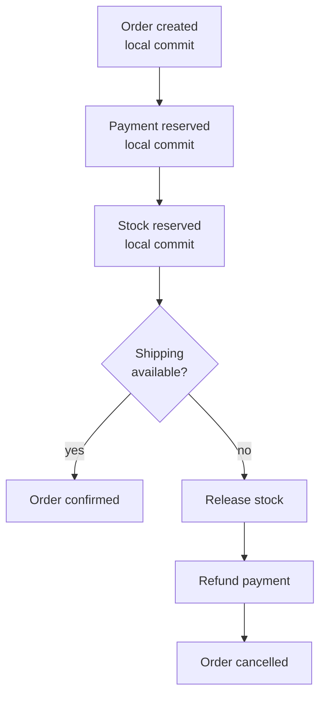
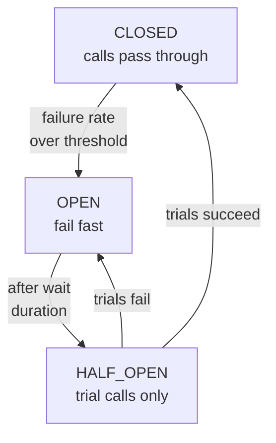

# Microservices Q&A

Interview-prep notes on microservices: data consistency and sagas, resilience against slow
dependencies, circuit breakers, service discovery, distributed tracing, read-your-own-write in
CQRS, retries, idempotency, and caching.

## Contents

| # | Question | The one thing to remember |
| --- | --- | --- |
| 1 | [Data consistency across services](#1-how-do-you-handle-data-consistency-across-multiple-microservices) | Saga = local transactions + compensating transactions. |
| 2 | [A slow downstream service](#2-what-would-you-do-if-one-downstream-microservice-becomes-very-slow) | Timeout first. A circuit breaker without a timeout does nothing. |
| 3 | [Circuit breakers in detail](#3-how-does-a-circuit-breaker-actually-work) | Closed → open → half-open, driven by a failure *rate* over a window. |
| 4 | [Service discovery](#4-how-does-service-discovery-work) | Client-side (Eureka) vs server-side (Kubernetes Service). |
| 5 | [Debugging a cross-service request](#5-how-do-you-debug-a-user-request-that-spans-multiple-microservices) | One trace id, propagated in headers, in every log line. |
| 6 | [Read-your-own-write in CQRS](#6-how-would-you-ensure-read-your-own-write-consistency-in-a-cqrs-system) | Route the reader to the truth, or wait for the projection. |
| 7 | [Retry mechanisms](#7-how-do-you-apply-a-retry-mechanism-in-microservices) | Retry only what is idempotent and only what is transient. |
| 8 | [Idempotency](#8-how-do-you-actually-make-an-operation-idempotent) | The dedup record must be written in the same transaction as the effect. |
| 9 | [Caching](#9-why-caching-and-where-and-how-do-you-apply-it) | Cache-aside is the app's job; read-through is the cache's. |
| 10 | [When NOT to use a saga](#10-when-would-you-not-use-saga-for-distributed-transactions) | When you cannot write a compensation. |
| 11 | [Choreography vs orchestration](#11-choreography-versus-orchestration-in-a-saga) | Choreography for simple flows, orchestration when someone must own the process. |

## Corrections made to this file

| Topic | The note used to say | What is actually true |
| --- | --- | --- |
| Idempotency | "Retried operations must not cause side effects" | Idempotent operations very often have side effects. The property is that performing the operation **N times leaves the same end state as performing it once**. "Charge this card" has a side effect and can still be idempotent, given an idempotency key. |
| Saga rollback | "Use event sourcing + compensating transactions for rollback logic" | Two unrelated things. **Compensating transactions** are what a saga uses to undo. **Event sourcing** is a way of storing state as a log of events — useful, optional, and not how a saga rolls back. |
| `@Retryable` delays | "3 times → 2s, 4s, 8s" | `maxAttempts = 3` counts the **first call**, so it is 1 attempt + 2 retries, and there are only **two** waits: 2 s then 4 s. Also `@EnableRetry` was missing — without it the annotation does nothing at all. |
| Feign retries | Implied Feign retries by default | Spring Cloud OpenFeign registers `Retryer.NEVER_RETRY` by default, so retries are **off** unless you declare a `Retryer` bean. (Native Feign does retry `IOException`s — Spring Cloud deliberately differs.) |
| Hystrix | Listed as a current option | Hystrix has been in maintenance mode since 2018 and was removed from Spring Cloud in the 2020.0 release train. Use Resilience4j, or Spring Cloud CircuitBreaker as the abstraction. |
| Read-through cache | Described as "application reads from cache; if missing, loads from DB" | That is **cache-aside**. In **read-through** the cache itself loads from the store via a loader; the application only ever talks to the cache. |
| 2PC | "Not scalable" | The real objection is that it is **blocking**: participants hold locks until the coordinator decides, and a coordinator crash leaves them stuck. It also requires XA support everywhere, which Kafka and most HTTP APIs do not have. |
| Coverage | No circuit-breaker mechanics, no service discovery, no idempotency implementation | All three added. |

## 1. How do you handle data consistency across multiple microservices?

**What the interviewer is checking:** that you know the saga pattern, event-driven
communication, and idempotency — and that you do not reach for a distributed transaction.

**The answer:**

- **Avoid distributed transactions (2PC).** Not mainly because of scale: because 2PC is
  *blocking*. Every participant holds its locks until the coordinator says commit or abort, and
  if the coordinator dies mid-protocol they stay locked (the "in-doubt" state). It also needs XA
  resource managers on both sides, which rules out Kafka, REST APIs and most managed services.
- **Use the Saga pattern.** A saga is a sequence of **local** transactions. Each step commits
  in its own service and publishes an event that triggers the next. If step 4 fails, you run
  **compensating transactions** for steps 3, 2 and 1 — business-level undos, not rollbacks.
  - **Choreography** — each service reacts to events; no central coordinator.
  - **Orchestration** — one orchestrator tells each service what to do next.
- **Make every step idempotent** — at-least-once delivery means every handler will see
  duplicates. See section 8.
- **Publish events reliably** — a saga step that commits its database transaction and then
  fails to publish has broken the chain. Use the transactional outbox
  ([Kafka Q&A](Kafka_QA.md#6-transaction-boundaries-across-services-db-write-plus-event-publish)).
- **Accept eventual consistency** and design the UI around it ("your order is being
  confirmed"), because there is an observable window where the system is inconsistent.

**Compensation is not rollback.** A rollback erases history; a compensation adds to it. You
cannot un-send an email — you send an apology. You cannot un-charge a card — you refund it, and
the statement shows both lines. Any step whose effect is externally visible needs a
compensation that a human would recognise as correct.



## 2. What would you do if one downstream microservice becomes very slow?

**What the interviewer is checking:** resilience and fault tolerance — and specifically whether
you know that *slow* is more dangerous than *down*.

A service that returns errors fast is easy to survive. A service that takes 30 seconds to
answer consumes one of your threads and one connection for those 30 seconds, and under load
your thread pool fills with calls to a dependency you do not even need for most requests. That
is how one slow service takes down three healthy ones — a **cascading failure**.

**The answer, in the order the defences must be applied:**

1. **Timeouts, first and always.** Connect timeout and read timeout on every outbound call.
   Nothing else on this list works without them: a circuit breaker counts failures, and a call
   that hangs forever never becomes a failure.
2. **Circuit breaker** (Resilience4j — see section 3). Stop calling a dependency that is
   failing, and fail fast instead.
3. **Bulkhead.** Give each dependency its own bounded thread pool or semaphore, so saturating
   one cannot starve the others.
4. **Retries with exponential backoff and jitter** — but only for idempotent operations, and
   inside the circuit breaker's budget (section 7).
5. **Fallbacks** where a degraded answer beats an error: cached data, a default, a partial
   response with the slow section omitted.
6. **Load shedding / rate limiting** at the edge, so you reject cheaply rather than queue.
7. **Make the call asynchronous** if the caller does not need the answer now — publish an event
   and let the work happen later.
8. **Observe it:** latency percentiles (p99, not the mean), distributed tracing (Zipkin,
   Jaeger, OpenTelemetry) to find *which* hop is slow, and alerts on the circuit breaker's
   state transitions.

## 3. How does a circuit breaker actually work?

A circuit breaker is a state machine wrapped around a call. It counts outcomes over a sliding
window, and when too many fail it stops letting calls through at all.



| State | Behaviour |
| --- | --- |
| **CLOSED** | Calls pass through; outcomes are recorded in the sliding window |
| **OPEN** | Calls are rejected immediately with `CallNotPermittedException` — no request is sent, so the struggling service gets breathing room |
| **HALF_OPEN** | After the wait duration, a limited number of trial calls are allowed. They decide whether to close again or reopen |

**Resilience4j's defaults, and the one that surprises everyone:**

| Setting | Default | Meaning |
| --- | --- | --- |
| `slidingWindowSize` | 100 | Calls (or seconds, if `TIME_BASED`) in the window |
| `minimumNumberOfCalls` | 100 | **No failure rate is calculated until this many calls have been recorded** |
| `failureRateThreshold` | 50% | Open above this |
| `waitDurationInOpenState` | 60 s | How long OPEN lasts before HALF_OPEN |
| `permittedNumberOfCallsInHalfOpenState` | 10 | Trial calls |

`minimumNumberOfCalls = 100` is why a breaker "does not work" in a demo: with nine failing
calls the rate is never even computed. Lower it for low-traffic endpoints.

**Slow calls count too.** `slowCallDurationThreshold` and `slowCallRateThreshold` open the
breaker on latency rather than errors — directly addressing the problem in section 2.

```yaml
resilience4j:
  circuitbreaker:
    instances:
      paymentService:
        sliding-window-type: TIME_BASED
        sliding-window-size: 60            # seconds
        minimum-number-of-calls: 10
        failure-rate-threshold: 50
        slow-call-duration-threshold: 2s
        slow-call-rate-threshold: 50
        wait-duration-in-open-state: 30s
        permitted-number-of-calls-in-half-open-state: 5
```

```java
@CircuitBreaker(name = "paymentService", fallbackMethod = "payLater")
public Receipt pay(Order order) { ... }

private Receipt payLater(Order order, Throwable t) {   // same signature + Throwable
    return Receipt.pending(order.id());
}
```

**Combining decorators.** Resilience4j's default aspect order is
`Retry → CircuitBreaker → RateLimiter → TimeLimiter → Bulkhead`, with **Retry outermost**. That
means a retry re-enters the circuit breaker, so failed retries count toward opening it — usually
what you want, but it also means a 3× retry burns 3 slots in the window per logical call. Budget
for that, or move Retry inside by changing the aspect order.

## 4. How does service discovery work?

**The problem:** instances are created and destroyed constantly, with addresses you cannot know
in advance, so you cannot hard-code a host list.

**Two families:**

| | Client-side discovery | Server-side discovery |
| --- | --- | --- |
| Example | Eureka + Spring Cloud LoadBalancer, Consul, Nacos | Kubernetes `Service`, AWS ALB/NLB, an API gateway |
| Who picks the instance | The **client**, from a registry it has cached | A **load balancer** in front of the pool |
| Client knows about | Every instance | One stable name or VIP |
| Pros | No extra network hop; client-aware routing (zone affinity, weights) | Language-agnostic; nothing to build into the client |
| Cons | A library in every service, in every language | An extra hop; less routing intelligence |

**Client-side, concretely (Spring Cloud + Eureka):**

1. Each instance **self-registers** with the Eureka server at startup and heartbeats every 30 s.
2. Clients pull the registry (cached locally, refreshed every 30 s by default).
3. `@LoadBalanced RestTemplate`, `WebClient.Builder`, or an OpenFeign client resolves the
   logical name `http://payment-service/pay` to a real instance.
4. An instance that stops heartbeating is evicted (after ~90 s).

```java
@FeignClient(name = "payment-service")   // a registry name, not a hostname
public interface PaymentClient {
    @GetMapping("/pay")
    String makePayment();
}
```

**Two facts that date a candidate:**

- **Ribbon is dead.** Netflix Ribbon was removed from Spring Cloud and replaced by **Spring
  Cloud LoadBalancer**. Same for Hystrix → Resilience4j and Zuul 1 → Spring Cloud Gateway.
- **On Kubernetes you usually do not need Eureka at all.** A `Service` gives you a stable DNS
  name and load balancing, and the kubelet does the health checking through readiness probes —
  that *is* server-side service discovery. Running Eureka inside Kubernetes duplicates it.

**Why discovery alone is not enough.** Eureka's registry is eventually consistent — up to
roughly 90 seconds of staleness, longer in self-preservation mode — so clients will sometimes
call instances that are already gone. That is not a bug to fix; it is why every call still needs
a timeout, a retry on a *different* instance, and a circuit breaker.

## 5. How do you debug a user request that spans multiple microservices?

**What the interviewer is checking:** distributed tracing and observability.

**The answer:**

- **Distributed tracing** — OpenTelemetry (the vendor-neutral standard), with Jaeger, Zipkin or
  Tempo as the backend. In Spring Boot 3 this is Micrometer Tracing; in Boot 2 it was Spring
  Cloud Sleuth.
- **A trace id per request, propagated in headers.** The W3C `traceparent` header is the
  standard; B3 headers are the older Zipkin convention. Each hop creates a **span** (a timed
  unit of work) with the trace id and its parent span id, so the backend can rebuild the tree
  and show you which hop cost the time.
- **Put the trace id in every log line** (Micrometer/Sleuth do this through MDC) and in the
  response to the caller. Then "the customer says their order failed at 14:32" becomes one
  query.
- **Aggregate logs** — ELK, Grafana Loki, Datadog — so you can search across services.
- **Metrics and alerting** — Micrometer → Prometheus → Grafana, alerting on error rate, p99
  latency, and circuit-breaker state.

The three signals are complementary: **metrics** tell you something is wrong, **traces** tell
you where, **logs** tell you what. Correlate all three on the trace id.

## 6. How would you ensure "read-your-own-write" consistency in a CQRS system?

**Why this is real:** in CQRS the write model and the read model are separate stores, joined by
an asynchronous projection. A user saves their profile, the UI immediately reloads it, and the
projection has not caught up — so their own change is missing. It looks like data loss.

| Option | How | Cost |
| --- | --- | --- |
| **1. Synchronous projection** | Update the read model in the same transaction as the write | Loses the decoupling CQRS was for; write latency goes up |
| **2. Session / sticky consistency** | Route this user's reads to the write model (or to the node that has their data) for a short window after a write | Needs routing state; only helps that one user |
| **3. Cache the write result** | Serve the user their own just-written value from a short-lived per-user cache until the projection lands | Simple; only covers the exact object written |
| **4. Version / timestamp check** | Return a version on write; the read waits for, or reports, a read model at least that fresh | Most correct; needs version plumbing on both sides |
| **5. Respond from the command** | Return the resulting state directly from the write API, so the UI does not need to re-read | Often the cheapest real fix |

Option 5 is worth reaching for first: a lot of read-your-own-write problems are really "the UI
re-fetched something it had already been given".

## 7. How do you apply a retry mechanism in microservices?

### Why you need one

Microservices talk over unreliable networks. A call can fail from:

- a transient network glitch,
- service overload or throttling (HTTP 429, 503),
- a database connection timeout,
- a gateway hiccup.

Retrying recovers automatically from failures that will not still be there in two seconds.

### Core principles

| Principle | What it means |
| --- | --- |
| **Idempotency** | Repeating the call must leave the same end state as making it once — not "must have no side effects". Non-idempotent operations need an idempotency key before they may be retried (section 8). |
| **Retry only transient failures** | 5xx, timeouts and connection errors, yes. 4xx, no — a `400` or `422` will fail identically forever, and retrying a `401` can lock the account. |
| **Backoff** | Exponential: 1 s, 2 s, 4 s. Immediate retries hit a service that is already struggling. |
| **Jitter** | Randomise the delay. Without it, every client that failed at the same instant retries at the same instant — a thundering herd that re-breaks the service each time it recovers. |
| **A limit** | 3 attempts is the usual default. Retries multiply load on an unhealthy dependency: 3 retries across 3 hops is 27 calls for one request. |
| **Circuit breaker integration** | Stop retrying when the dependency is clearly down. |
| **Metrics** | Count retries. A rising retry rate is the earliest warning you get. |

### A. Spring Retry with `@Retryable`

```java
@Configuration
@EnableRetry                      // REQUIRED - without it the annotation does nothing
public class RetryConfig { }
```

```java
@Service
public class PaymentServiceClient {

    private final RestClient restClient;   // configured with connect + read timeouts

    @Retryable(
        retryFor = { ResourceAccessException.class, HttpServerErrorException.class },
        maxAttempts = 3,
        backoff = @Backoff(delay = 2000, multiplier = 2, random = true)
    )
    public String callPaymentService() {
        return restClient.get().uri("http://payment-service/pay")
                         .retrieve().body(String.class);
    }

    @Recover
    public String recover(Exception e) {
        return "payment-unavailable";      // called after the last attempt fails
    }
}
```

**What this actually does:**

- **3 attempts total** — the initial call plus 2 retries. `maxAttempts` counts the first call.
- **2 waits, not 3:** 2 s, then 4 s. (The old note said "2s, 4s, 8s", which would need
  `maxAttempts = 4`.)
- `random = true` adds jitter.
- `retryFor` replaces the deprecated `value` attribute (Spring Retry 2.0).
- Retrying **all** `RuntimeException`s — as the original example did — also retries
  `HttpClientErrorException` (4xx), which can never succeed. Name the exceptions.
- `@Recover` gives you the fallback; without it, the last exception propagates.
- Spring Retry is **AOP proxy-based**, so a self-invocation inside the same bean is not
  retried — the same rule as `@Transactional`
  ([details](Spring_Transaction_Management.md#1-how-transactional-is-applied-the-proxy-model)).

### B. Feign client retry

```java
@FeignClient(name = "payment-service", configuration = PaymentRetryConfig.class)
public interface PaymentClient {
    @GetMapping("/pay")
    String makePayment();
}

@Configuration
public class PaymentRetryConfig {
    @Bean
    public Retryer retryer() {
        // period, maxPeriod, maxAttempts (maxAttempts includes the first call)
        return new Retryer.Default(1000, 5000, 3);
    }
}
```

> **Correction.** Spring Cloud OpenFeign publishes `Retryer.NEVER_RETRY` as the default bean,
> so a plain `@FeignClient` **does not retry at all** — a deliberate divergence from native
> Feign, which retries `IOException`s and any `RetryableException` from an `ErrorDecoder`.
> Declaring the bean above is what turns retries on. Also note Feign only retries what its
> `ErrorDecoder` maps to a `RetryableException`, so 5xx responses are *not* retried unless you
> write that decoder.

### C. Resilience4j retry

```yaml
resilience4j:
  retry:
    instances:
      inventoryRetry:
        max-attempts: 3
        wait-duration: 2s
        exponential-backoff-multiplier: 2
        randomized-wait-factor: 0.5          # jitter
        retry-exceptions:
          - java.net.ConnectException
          - java.net.SocketTimeoutException
        ignore-exceptions:
          - com.example.BusinessValidationException
```

```java
@Retry(name = "inventoryRetry", fallbackMethod = "fromCache")
public Stock check(String sku) { ... }
```

### Retry options by layer

| Layer | Tools | Notes |
| --- | --- | --- |
| **HTTP client** | Spring Retry, Resilience4j, Feign `Retryer` | Declarative; pair with a circuit breaker |
| **Async messaging** | Kafka retry topics + DLT, RabbitMQ retry queues | Retry off the hot path so one poison message cannot block a partition |
| **Service-to-service** | Resilience4j Retry + CircuitBreaker | Mind the aspect order (section 3) |
| **Database** | Retry only transient errors (deadlock, connection reset) | Never retry a constraint violation |

## 8. How do you actually make an operation idempotent?

Everything above depends on this, and "we make it idempotent" is where most answers stop.

**The definition:** running the operation N times leaves the system in the same state as
running it once. It says nothing about having no side effects.

| Operation | Naturally idempotent? |
| --- | --- |
| `GET /orders/42`, `PUT /orders/42` with a full body, `DELETE /orders/42` | Yes |
| `SET status = 'PAID'` | Yes |
| `POST /orders` (creates a new row each time) | **No** |
| `balance = balance - 10` | **No** |

**The standard implementation — an idempotency key:**

1. The caller generates a unique key per logical operation (a UUID, or a business id such as
   `orderId + step`) and sends it: `Idempotency-Key: 7f3c…` or as an event field.
2. The handler tries to insert that key into a `processed_requests` table with a **unique
   constraint**.
3. Insert succeeds → this is the first time: do the work.
4. Insert violates the constraint → already processed: return the stored result, do nothing
   else.

```java
@Transactional
public Receipt charge(String idempotencyKey, Money amount) {
    try {
        // SAME transaction as the effect - this is the whole point
        processedRepo.save(new Processed(idempotencyKey));
    } catch (DataIntegrityViolationException dup) {
        return receiptRepo.findByKey(idempotencyKey).orElseThrow();
    }
    Receipt r = gateway.charge(amount);
    receiptRepo.save(new StoredReceipt(idempotencyKey, r));
    return r;
}
```

**The detail that makes or breaks it:** the dedup record and the effect must commit in **one
local transaction**. If you write the key first and commit, then do the work and crash, the
retry is rejected as a duplicate and the work never happens. If you do the work first and crash
before recording the key, the retry does it twice. Same transaction, or the guarantee is
imaginary.

**For Kafka consumers**, the key can be `topic-partition-offset` for pure dedup, or the business
key when the same event may legitimately arrive from two producers. Store it with a TTL — a
dedup table that grows forever is its own outage.

**For HTTP APIs**, the consumer must send the *same* key on retry. A key generated fresh inside
the retry loop deduplicates nothing, which is the most common way this is implemented wrongly.

## 9. Why caching, and where and how do you apply it?

### Why

Caching stores frequently used data close to the reader, so you avoid repeatedly querying the
database, calling an external API, or recomputing something expensive. Benefits: lower latency,
less load on the database and on downstream services, lower cost, better scalability.

### Where to apply it

| Layer | Example | What it avoids |
| --- | --- | --- |
| **Client-side** | Browser cache, mobile app memory | The request entirely |
| **CDN / gateway** | CloudFront, NGINX, API gateway | Hitting your service at all |
| **Service layer** | Spring's `@Cacheable` | Recomputing or re-querying |
| **Database** | Query cache, materialised views | Repeated expensive plans |
| **Distributed** | Redis, Memcached, Hazelcast | Per-instance duplication; shared across the fleet |

### Caching strategies

| Strategy | Who loads on a miss | Notes |
| --- | --- | --- |
| **Cache-aside (lazy loading)** | The **application**: check cache → miss → read DB → populate cache | The most common pattern, and what Spring's `@Cacheable` does for you |
| **Read-through** | The **cache**, via a configured loader; the app only talks to the cache | Needs provider support (Ehcache/JCache `CacheLoader`) |
| **Write-through** | Write to cache and DB together, synchronously | Cache never stale; writes are slower |
| **Write-behind (write-back)** | Write to cache, flush to DB asynchronously | Fastest writes; data loss if the cache dies before the flush |

> **Correction.** The original table described *cache-aside* under the "read-through" heading.
> The distinction is simply **who** talks to the database on a miss: in cache-aside the
> application does; in read-through the cache does.

### In-memory vs distributed

| Type | Example | Scope | Use case |
| --- | --- | --- | --- |
| **In-memory** | Caffeine, `ConcurrentHashMap` | One instance | Small, hot, tolerant of per-instance divergence |
| **Distributed** | Redis, Memcached, Hazelcast | Shared | Consistency across instances; survives a restart |

A per-instance cache means 10 instances can hold 10 different values for the same key, and an
eviction on one does not evict the others. That is fine for a currency list and wrong for a
feature flag.

### Spring Boot example

```java
@SpringBootApplication
@EnableCaching                       // without this, @Cacheable does nothing
public class ProductApplication {
    public static void main(String[] args) {
        SpringApplication.run(ProductApplication.class, args);
    }
}

@Service
public class ProductService {

    @Cacheable(value = "products", key = "#productId", sync = true)
    public Product getProductById(Long productId) {
        simulateSlowService();
        return productRepository.findById(productId).orElseThrow();
    }

    @CacheEvict(value = "products", key = "#product.id")
    public void updateProduct(Product product) {
        productRepository.save(product);
    }

    private void simulateSlowService() {
        try {
            Thread.sleep(2000);                     // simulate DB latency
        } catch (InterruptedException e) {
            Thread.currentThread().interrupt();     // restore the flag before rethrowing
            throw new IllegalStateException(e);
        }
    }
}
```

- First call goes to the database; later calls are served from the cache named `products`,
  keyed by product id.
- `sync = true` prevents a **cache stampede**: without it, 200 concurrent requests for a cold
  key all run the slow method.

**Four traps:**

| Trap | Detail |
| --- | --- |
| Self-invocation | `@Cacheable` is proxy-based. An internal call to `getProductById` from another method of the same bean is not cached — the same rule as `@Transactional`. |
| TTL | `@Cacheable` has no expiry attribute. TTL is configured on the cache manager (`spring.cache.redis.time-to-live`, or a Caffeine spec). A cache with no TTL and no eviction is a memory leak with stale data in it. |
| Eviction timing | `@CacheEvict` runs **after** the method returns by default. If the method throws, nothing is evicted; if you need the eviction to happen first, set `beforeInvocation = true`. |
| Caching `null` | A miss that returns `null` may be cached, depending on the provider — sometimes wanted (negative caching stops a repeated lookup storm), sometimes a bug. Set `unless = "#result == null"` deliberately. |

## 10. When would you NOT use Saga for distributed transactions?

**Do not use a saga when:**

- You genuinely need **atomicity and isolation** (classic ACID). A saga is eventually
  consistent and has **no isolation** — other transactions can observe the half-finished state
  between steps 2 and 3.
- A step **cannot be compensated**. Money can be refunded; a sent email, a published press
  release or a fired missile cannot.
- The business cannot tolerate the intermediate inconsistent state being visible.
- Compensation itself can fail and cascade — you then need compensation for the compensation,
  which is a sign the boundaries are wrong.

**Alternatives:**

| Alternative | When it fits |
| --- | --- |
| **Redraw the service boundary** | If two "services" always change together in one transaction, they are one service with one database. This is the answer interviewers most want to hear and candidates least often give. |
| **2PC / XA** | Small scale, all participants support XA, and blocking on a coordinator failure is acceptable |
| **Transactional outbox + CDC** | Reliable async propagation when you only need "this happened", not a multi-step workflow |
| **TCC (Try-Confirm/Cancel)** | Reserve resources in a Try phase, then Confirm or Cancel — gives you something closer to isolation than a plain saga |
| **Idempotent writes + retries** | Simple flows where retrying to success is genuinely sufficient |

## 11. Choreography versus orchestration in a saga

**Use choreography when:**

- Few services are involved (a rule of thumb: under five).
- The workflow is simple and mostly linear.
- No single place needs to understand the whole flow.
- The flow changes often and decentralised ownership is preferred.

**Signals choreography is failing:**

- "Distributed spaghetti" — so many event listeners that nobody can name the flow.
- Nobody can answer "where is order 123 in the process?" without opening a tracing tool.
- Debugging requires reading five services' logs.
- One business change touches many services at once.
- Cyclic event chains, where service A's event ultimately triggers service A again.

**Switch to orchestration when:**

- Someone must own the process end to end.
- There are many conditional or branching paths.
- You need visibility and audit of the whole workflow (a state machine you can query).
- You want the business logic of the *process* separated from the services that execute steps.

| | Choreography | Orchestration |
| --- | --- | --- |
| Control | Distributed; each service reacts | Central orchestrator issues commands |
| Coupling | Loose, but implicit — coupled through event shapes | Explicit; services are coupled to the orchestrator |
| Visibility | Poor; needs tracing to reconstruct | Good; the orchestrator holds the state |
| Failure handling | Each service must know its own compensation | Orchestrator drives the compensations in order |
| Risk | Spaghetti | The orchestrator becomes a distributed monolith and a single point of failure |
| Tools | Kafka, event bus | Camunda, Temporal, AWS Step Functions, a hand-written state machine |
