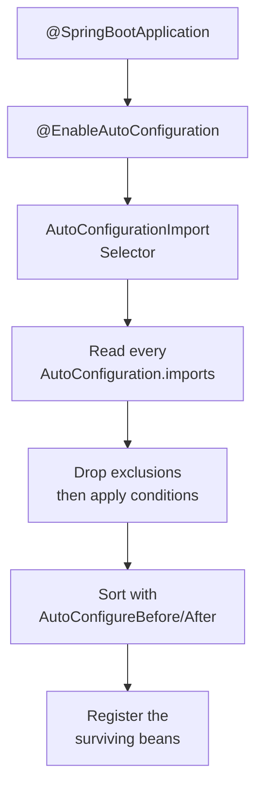

# Spring Boot Q&A

Interview-prep notes on Spring Boot: where a property can come from and which source wins, how
auto-configuration decides what to create, what a starter really is, and what changed in
Spring Boot 3.

## Contents

| # | Question | The one thing to remember |
| --- | --- | --- |
| 1 | [Property source precedence](#1-where-can-serverport-be-set-and-which-property-source-wins) | Command line beats system properties beats environment variables beats every file. |
| 2 | [How auto-configuration works](#2-how-does-auto-configuration-actually-work) | Auto-config runs *after* your beans, so `@ConditionalOnMissingBean` lets you win. |
| 3 | [What a starter is](#3-what-is-a-starter-and-what-does-it-actually-do) | A starter ships dependencies, not configuration. |
| 4 | [What changed in Spring Boot 3](#4-what-changed-in-spring-boot-3) | Java 17 baseline and `javax.*` → `jakarta.*`. |
| 5 | [`@Value` vs `@ConfigurationProperties`](#5-value-vs-configurationproperties-and-relaxed-binding) | Relaxed binding is why `SERVER_PORT` sets `server.port`. |

## Corrections made to this file

| Topic | The note used to say | What is actually true |
| --- | --- | --- |
| System properties vs environment variables | Environment variables outrank `-D` system properties | The other way round. Spring Boot's documented order (lowest to highest) puts OS environment variables *below* Java system properties. |
| Spring Cloud Config | "Config Server (if used)" always at the top | Depends on the mechanism. With the modern `spring.config.import=configserver:` it is *config data* and loses to command-line args, system properties and environment variables. See the note in section 1. |
| Coverage | Only property precedence | Auto-configuration, starters and the Spring Boot 3 migration were missing entirely and are the questions actually asked most often. |

## 1. Where can `server.port` be set, and which property source wins?

The same property is set in seven different places below, listed **from lowest to highest
precedence**. The summary at the end shows which one wins.

### 1. `src/main/resources/application.yml` (inside the jar)

```yaml
server:
  port: 8080
```

Lowest of the file-based sources. If both `application.properties` and `application.yml` exist
in the same location, `.properties` wins — the docs recommend picking one format and sticking
to it.

### 2. External `./config/application.yml`

```yaml
server:
  port: 9090
```

Spring Boot searches four locations, and later ones override earlier ones:
`classpath:/`, `classpath:/config/`, `file:./`, `file:./config/`. So a file next to the jar
beats the same file inside the jar — which is the whole point of shipping one artifact and
configuring it per environment.

### 3. Profile file `application-dev.yml`

```yaml
server:
  port: 8181
```

*"Profile-specific properties are loaded from the same locations as standard
`application.properties`, with profile-specific files always overriding the non-specific
ones."* That "always" matters: `application-dev.yml` **inside** the jar beats plain
`application.yml` **outside** it. Location is the tie-break only between files of the same
kind.

### 4. Environment variable

```bash
export SERVER_PORT=9292
```

Relaxed binding maps `SERVER_PORT` to `server.port` (see section 5). This is how you configure
a container without touching the image.

### 5. System property

```bash
java -Dserver.port=9191 -jar myapp.jar
```

> **Correction.** These notes previously put environment variables *above* system properties.
> Spring Boot's documented list runs (low to high): config data files → `RandomValuePropertySource`
> → **OS environment variables** → **Java system properties** → JNDI → servlet init params →
> `SPRING_APPLICATION_JSON` → **command-line arguments** → test-only sources. So `-D` beats
> `export`, and both beat every file.

### 6. Command-line argument

```bash
java -jar myapp.jar --server.port=9393
```

The highest source in a normal (non-test) application. Note the two different syntaxes above:
`-Dserver.port=...` goes **before** `-jar` and is a JVM system property; `--server.port=...`
goes **after** the jar name and is a Spring Boot command-line argument.

### 7. Spring Cloud Config (remote)

```properties
server.port=9494
```

Where this lands depends on which mechanism the app uses, and it is the one item on this list
you should verify rather than recite:

| Mechanism | Where the remote values sit |
| --- | --- |
| `spring.config.import=configserver:...` (Spring Cloud 2020.0+, the default today) | Ordinary **config data** — it loses to command-line args, system properties and environment variables, and Spring Boot ranks an imported document *below* the file that imported it |
| Legacy bootstrap context (`spring-cloud-starter-bootstrap`) | The remote source is added high in the list; local sources can only override it if the *remote* config sets `spring.cloud.config.allowOverride=true`, with `overrideNone` and `overrideSystemProperties` tuning how far that goes |

Setting `spring.cloud.config.allowOverride=true` locally does nothing — it has to come from
the remote property source itself.

### Summary (highest wins)

```text
Command-line args   (--server.port=9393)
↑
System properties   (-Dserver.port=9191)
↑
Environment vars    (SERVER_PORT=9292)
↑
Profile files       (application-dev.yml, anywhere)
↑
External config     (./config/application.yml)
↑
Packaged config     (application.yml inside the jar)
```

Config Server sits wherever the table above says — with `spring.config.import` it is a file-level
source, with the legacy bootstrap it is above the local files.

**Do not argue this from memory in production.** Start the app and read
`GET /actuator/env` (or `/actuator/configprops` for bound objects): it lists every property
source in resolution order and shows which one supplied the value actually in use.

## 2. How does auto-configuration actually work?



**The mechanism, step by step:**

1. `@SpringBootApplication` is a composite of `@SpringBootConfiguration`,
   `@ComponentScan` and `@EnableAutoConfiguration`.
2. `@EnableAutoConfiguration` imports `AutoConfigurationImportSelector`.
3. That selector reads every
   `META-INF/spring/org.springframework.boot.autoconfigure.AutoConfiguration.imports` file on
   the classpath — one line per auto-configuration class. (Before Spring Boot 2.7 this was the
   `EnableAutoConfiguration` key in `META-INF/spring.factories`, removed in 3.0.)
4. Each candidate class is filtered by its `@Conditional` annotations.
5. Survivors are ordered by `@AutoConfigureBefore`, `@AutoConfigureAfter` and
   `@AutoConfigureOrder`, then their `@Bean` methods run.

**The conditions that do the deciding:**

| Condition | Fires when |
| --- | --- |
| `@ConditionalOnClass` / `@ConditionalOnMissingClass` | A class is (or is not) on the classpath — this is how "add the H2 jar and a DataSource appears" works |
| `@ConditionalOnBean` / `@ConditionalOnMissingBean` | A bean of that type is (or is not) already defined |
| `@ConditionalOnProperty` | A property has a given value, e.g. `spring.cache.type=redis` |
| `@ConditionalOnWebApplication` | The app is servlet-based or reactive |
| `@ConditionalOnResource` / `@ConditionalOnExpression` | A file exists / a SpEL expression is true |

**The key ordering fact.** Auto-configuration classes are processed **after** your own
`@Component` and `@Bean` definitions have been registered. That is what makes
`@ConditionalOnMissingBean` meaningful: define your own `ObjectMapper` or `DataSource` and the
matching auto-configuration quietly backs off. You override Spring Boot by *declaring a bean*,
not by editing anything.

**How to debug it:**

- Run with `--debug` (or `debug=true`) to print the **conditions evaluation report**: positive
  matches, negative matches, and exclusions, with the reason for each.
- Or hit `GET /actuator/conditions` on a running app.
- Turn one off with `@SpringBootApplication(exclude = DataSourceAutoConfiguration.class)` or
  `spring.autoconfigure.exclude=...`.

**Writing your own:** a class annotated `@AutoConfiguration` plus a line naming it in your own
`META-INF/spring/org.springframework.boot.autoconfigure.AutoConfiguration.imports`. Guard every
bean with `@ConditionalOnMissingBean` so consumers can still override you.

## 3. What is a starter, and what does it actually do?

A starter is a **POM with no code in it**. It exists to pull in a curated, version-compatible
set of dependencies in one line.

```xml
<dependency>
    <groupId>org.springframework.boot</groupId>
    <artifactId>spring-boot-starter-web</artifactId>
</dependency>
```

That one line brings Spring MVC, Jackson, validation, and `spring-boot-starter-tomcat` (the
embedded server). No `<version>` is needed because `spring-boot-starter-parent` — or the
`spring-boot-dependencies` BOM if you have your own parent — manages every version.

| Misconception | Reality |
| --- | --- |
| "The starter configures Tomcat for me" | The starter only puts the jars on the classpath. The **auto-configuration** inside `spring-boot-autoconfigure` sees those classes and creates the beans. Starter = dependencies, auto-config = behaviour. |
| "Starters are magic" | Open one. `spring-boot-starter-web/pom.xml` is about 20 lines of `<dependency>` entries. |
| "All starters are called `spring-boot-starter-*`" | Only the official ones. Third-party starters are supposed to be named `something-spring-boot-starter` so the namespace stays clear. |

**Swapping the embedded server** shows how thin the mechanism is — exclude Tomcat, add Jetty,
and the auto-configuration picks the other one up:

```xml
<dependency>
    <groupId>org.springframework.boot</groupId>
    <artifactId>spring-boot-starter-web</artifactId>
    <exclusions>
        <exclusion>
            <groupId>org.springframework.boot</groupId>
            <artifactId>spring-boot-starter-tomcat</artifactId>
        </exclusion>
    </exclusions>
</dependency>
<dependency>
    <groupId>org.springframework.boot</groupId>
    <artifactId>spring-boot-starter-jetty</artifactId>
</dependency>
```

## 4. What changed in Spring Boot 3?

Spring Boot 3.0 (November 2022) was the breaking release. These are the facts interviewers
check.

| Area | Spring Boot 2.x | Spring Boot 3.x |
| --- | --- | --- |
| Minimum Java | 8 (2.0) / 17 supported from 2.5 | **Java 17 minimum**, Java 21 supported and recommended for virtual threads |
| Spring Framework | 5.x | 6.x |
| Namespace | `javax.persistence`, `javax.servlet`, `javax.validation` | **`jakarta.persistence`, `jakarta.servlet`, `jakarta.validation`** (Jakarta EE 9/10) |
| Hibernate | 5.x | 6.x |
| Servlet container | Tomcat 9 | Tomcat 10.1 |
| Auto-config registration | `META-INF/spring.factories` | `META-INF/spring/...AutoConfiguration.imports` |
| Native images | Experimental (Spring Native) | Built in, via GraalVM AOT (`-Pnative`) |

**What the `javax` → `jakarta` change means in practice.** It is a *package rename*, forced by
Oracle's transfer of Java EE to the Eclipse Foundation — Eclipse could not keep the `javax`
namespace. Every `import javax.persistence.Entity;` becomes
`import jakarta.persistence.Entity;`. It is mechanical, but it is not optional and it cascades:
any library that still compiles against `javax.servlet` will not work on Spring Boot 3, so the
real migration cost is your third-party dependencies, not your own imports.

**Other Boot 3 behaviour changes worth knowing:**

- Trailing-slash URL matching is off by default: `/orders` and `/orders/` are no longer the
  same mapping.
- `@ConstructorBinding` is no longer needed on a `@ConfigurationProperties` class with a single
  constructor, and at type level it was removed.
- Actuator endpoint and metric names shifted to Micrometer's Observation API; tracing moved
  from Spring Cloud Sleuth to Micrometer Tracing.
- Add `spring-boot-properties-migrator` as a temporary dependency during an upgrade — it logs
  every renamed property it finds.
- Spring Boot 3.2+ on Java 21: `spring.threads.virtual.enabled=true` puts request handling on
  virtual threads.

The sample project in this folder uses Spring Boot 3.5.7 on Java 21 — see
[orders-springboot-project/pom.xml](../orders-springboot-project/pom.xml).

## 5. `@Value` vs `@ConfigurationProperties`, and relaxed binding

| | `@Value("${server.port}")` | `@ConfigurationProperties(prefix = "server")` |
| --- | --- | --- |
| Binds | One property at a time | A whole group into a typed object |
| SpEL | Yes | No |
| Relaxed binding | **No** — the name must match exactly | **Yes** |
| Validation | No | Yes, with `@Validated` and Bean Validation annotations |
| Best for | A one-off value | Any real configuration block |

**Relaxed binding** is why `SERVER_PORT`, `server.port`, `server-port` and `serverPort` all
reach the same target. Environment variables can only contain `[A-Z0-9_]`, so Spring Boot
canonicalises: uppercase, `.` → `_`, remove `-`. It applies to `@ConfigurationProperties`
binding only — `@Value` does a literal lookup, which is why `@Value("${SERVER_PORT}")` may fail
where `@ConfigurationProperties` succeeds.

```java
@ConfigurationProperties(prefix = "app.orders")
@Validated
public record OrderProperties(@NotBlank String topic, @Positive int batchSize) { }
```

```yaml
app:
  orders:
    topic: orders-v1
    batch-size: 500     # binds to batchSize
```
