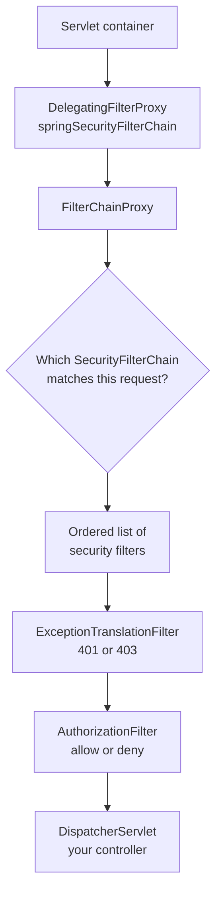
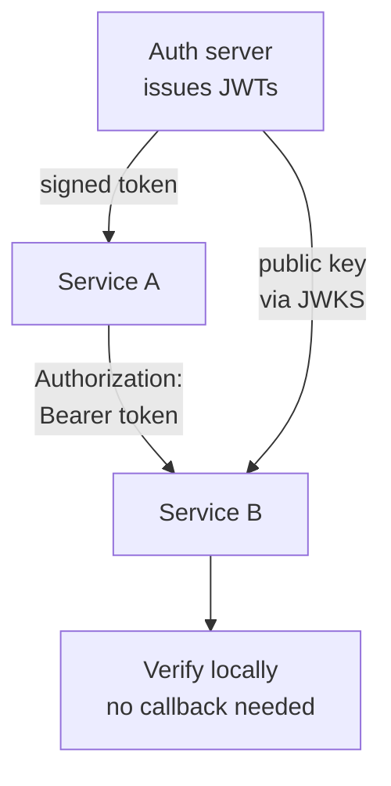

# Spring Security Q&A

Interview-prep notes on Spring Security: authentication versus authorisation, the filter chain,
the modern lambda DSL that replaced `WebSecurityConfigurerAdapter`, how service-to-service APIs
are secured with JWT and why that scales, and the OAuth 2.0 grant types.

## Contents

| # | Question | The one thing to remember |
| --- | --- | --- |
| 1 | [What does LDAP stand for?](#1-what-does-ldap-stand-for) | Lightweight Directory Access Protocol. |
| 2 | [Authentication vs authorisation](#2-authentication-versus-authorisation) | 401 means "who are you?", 403 means "not allowed". |
| 3 | [Main components](#3-what-are-the-main-components-of-spring-security) | `AuthenticationManager` → `AuthenticationProvider` → `UserDetailsService`. |
| 4 | [The filter chain](#4-the-filter-chain-what-runs-and-in-what-order) | Spring Security is one servlet filter that delegates to an ordered list. |
| 5 | [Configuring it in Spring Security 6](#5-configuring-it-the-lambda-dsl-and-the-removed-adapter) | `WebSecurityConfigurerAdapter` is gone; publish a `SecurityFilterChain` bean. |
| 6 | [JWT for service-to-service APIs](#6-how-are-application-to-application-apis-secured-with-jwt-and-how-does-it-help-scalability) | Stateless verification scales; the price is that you cannot revoke a token. |
| 7 | [Method security](#7-method-security) | `@PreAuthorize` needs `@EnableMethodSecurity`, and it is proxy-based. |
| 8 | [OAuth 2.0 grant types](#8-what-are-the-grant-types-in-oauth-20) | OAuth 2.0 is authorisation; OIDC is what authenticates the user. |

## Corrections made to this file

| Topic | The note used to say | What is actually true |
| --- | --- | --- |
| `SecurityContextPersistenceFilter` | Listed as a key filter | Deprecated. Spring Security 6 uses **`SecurityContextHolderFilter`**, which only *loads* the context and never saves it automatically — you must call `securityContextRepository.saveContext(...)` yourself. |
| `WebSecurityConfigurerAdapter` | Not mentioned at all | Deprecated in 5.7 and **removed in 6.0**. Configuration is now a `SecurityFilterChain` `@Bean`. This is the single most common "is this candidate current?" check. |
| Authorisation | Only authentication was covered | Added. `FilterSecurityInterceptor` and `AccessDecisionManager` were replaced by `AuthorizationFilter` and `AuthorizationManager` in 6.0. |
| JWT signing | "Signed with a private secret key (or asymmetric key)" | Two different things: HMAC (`HS256`) uses one **shared secret**, so every verifier can also mint tokens; RSA/EC (`RS256`, `ES256`) uses a **private key** to sign and a public key (via JWKS) to verify. For microservices, use the asymmetric one. |
| JWT trade-offs | Only upsides listed | Added the one that gets asked immediately after: a stateless token cannot be revoked before it expires. |
| OAuth 2.0 framing | "Grant types ... used for authentication" | OAuth 2.0 grants obtain **access tokens** — that is authorisation. Authenticating the user is **OIDC** (`openid` scope, ID token). |
| Method security | Not mentioned | `@EnableGlobalMethodSecurity` is deprecated; use `@EnableMethodSecurity` (which has `prePostEnabled = true` by default). |

## 1. What does LDAP stand for?

LDAP stands for **Lightweight Directory Access Protocol** — a protocol for querying a directory
server (Active Directory, OpenLDAP) that holds users, groups and their attributes. In Spring
Security it appears as an `AuthenticationProvider` that binds to the directory to check
credentials and reads group membership as authorities.

## 2. Authentication versus authorisation

| | Authentication | Authorisation |
| --- | --- | --- |
| Question | "Who are you?" | "Are you allowed to do this?" |
| Happens | Once per request or session, early in the chain | On every protected resource, late in the chain |
| Spring types | `Authentication`, `AuthenticationManager`, `UserDetailsService` | `AuthorizationManager`, `@PreAuthorize`, `authorizeHttpRequests` |
| Failure | **401 Unauthorized** (a misnomer — it means unauthenticated) | **403 Forbidden** |
| Handled by | `AuthenticationEntryPoint` | `AccessDeniedHandler` |

`ExceptionTranslationFilter` is what converts the two exceptions into those two responses. Its
rule is worth memorising: if the current user is **anonymous**, an `AccessDeniedException`
becomes a 401 and the entry point kicks in (log in first); if the user is already
**authenticated**, it becomes a 403.

**Roles versus authorities.** A "role" is just an authority with a `ROLE_` prefix, and the API
is inconsistent about adding it for you:

| Expression | Checks for the authority |
| --- | --- |
| `hasRole("ADMIN")` | `ROLE_ADMIN` — the prefix is added for you |
| `hasAuthority("ADMIN")` | `ADMIN` — literal, no prefix |
| `hasAuthority("ROLE_ADMIN")` | `ROLE_ADMIN` — equivalent to `hasRole("ADMIN")` |

Passing `hasRole("ROLE_ADMIN")` throws at startup. If JWT scopes arrive as `SCOPE_read`,
`hasAuthority("SCOPE_read")` is the match, not `hasRole`.

## 3. What are the main components of Spring Security?

### Authentication

- **Purpose:** verifies the identity of a user ("who are you?").
- **Key components:**
  - `Authentication` – the token itself: principal, credentials, authorities, and an
    `isAuthenticated` flag. It is both the request *and* the result.
  - `AuthenticationManager` – the entry point for processing an authentication request. The
    standard implementation is `ProviderManager`.
  - `AuthenticationProvider` – performs the actual check. `ProviderManager` walks its list and
    uses the first provider that `supports()` the token type. Example:
    `DaoAuthenticationProvider`, which uses a `UserDetailsService`.
  - `UserDetailsService` – loads user data by username, usually from a database. It returns
    `UserDetails` or throws `UsernameNotFoundException`.
  - `UserDetails` – the loaded identity: username, encoded password, authorities, account
    flags.
  - `PasswordEncoder` – `BCryptPasswordEncoder` by default in modern setups. Spring Security's
    `DelegatingPasswordEncoder` prefixes the hash with the algorithm id (`{bcrypt}...`) so you
    can migrate algorithms without invalidating existing passwords.
  - `SecurityContextHolder` – a `ThreadLocal` holding the current `Authentication`. It is how
    any code reaches the current user, and it is thread-confined, which is why authentication
    does not propagate to a thread pool unless you copy it across
    (`DelegatingSecurityContextExecutor`).

### Authorisation

- **Purpose:** decides whether the authenticated principal may proceed.
- `AuthorizationManager` – the decision interface since 6.0, replacing `AccessDecisionManager`
  and its voters.
- `AuthorizationFilter` – enforces URL-level rules; replaced `FilterSecurityInterceptor`.
- `GrantedAuthority` – one permission or role held by the principal.
- Method security (`@PreAuthorize`, `@PostAuthorize`) – see section 7.

### Security filters (the filter chain)

- **Purpose:** the heart of Spring Security — it intercepts requests before they reach your
  controllers. See section 4 for the order and the mechanism.

### OAuth2 / JWT / SSO integration

- OAuth2 **Client** – your app logs users in through an external provider (Google, Okta).
- OAuth2 **Resource Server** – your API validates incoming bearer tokens
  (`spring-boot-starter-oauth2-resource-server`). This is the one microservices usually want.
- **OIDC** – extends OAuth2 with an ID token, which is what actually authenticates a user.

## 4. The filter chain: what runs, and in what order

Spring Security is, from the servlet container's point of view, **one filter**. Everything else
happens inside it.



- `DelegatingFilterProxy` is a container-registered filter that delegates to a Spring bean, so
  security filters get dependency injection and the Spring lifecycle.
- `FilterChainProxy` holds a **list** of `SecurityFilterChain`s and picks the **first** whose
  `RequestMatcher` matches. Only that one runs. This is why the order of multiple
  `SecurityFilterChain` beans matters, and why a broad matcher declared first can silently
  shadow a later, narrower one — use `@Order` and put the specific chains first.

**The filters that matter, in order:**

| Filter | Job |
| --- | --- |
| `SecurityContextHolderFilter` | Loads the `SecurityContext` for this request from the repository (session, or nothing if stateless) |
| `HeaderWriterFilter` | Adds security response headers (HSTS, X-Content-Type-Options, …) |
| `CorsFilter` | Handles CORS preflight — must run **before** CSRF and authentication |
| `CsrfFilter` | Validates the CSRF token on state-changing requests |
| `LogoutFilter` | Handles `/logout` |
| `UsernamePasswordAuthenticationFilter` | Form login (`POST /login`) |
| `BasicAuthenticationFilter` | HTTP Basic |
| `BearerTokenAuthenticationFilter` | OAuth2 / JWT bearer tokens (resource server) |
| `AnonymousAuthenticationFilter` | Gives unauthenticated requests an anonymous token, so downstream code never sees `null` |
| `ExceptionTranslationFilter` | Turns `AuthenticationException` / `AccessDeniedException` into 401 / 403 |
| `AuthorizationFilter` | The last one: applies `authorizeHttpRequests` rules and lets the request through or denies it |

> **Correction.** `SecurityContextPersistenceFilter` (in the old note) both loaded *and saved*
> the context. It is deprecated. Spring Security 6 uses `SecurityContextHolderFilter`, which
> **only loads**. If your custom code sets the context and expects it to persist across
> requests, you must now save it explicitly:
>
> ```java
> SecurityContextHolder.setContext(context);
> securityContextRepository.saveContext(context, request, response);
> ```
>
> For a stateless JWT API this changes nothing — there was never anything to save.

Two ordering rules follow from the table: `ExceptionTranslationFilter` must sit immediately
before the authorisation filter so it can catch what that filter throws, and any custom
authentication filter has to be added *before* the point where authorisation runs — hence
`addFilterBefore(jwtFilter, UsernamePasswordAuthenticationFilter.class)`.

**Seeing the real list:** set `logging.level.org.springframework.security=DEBUG`, and Spring
Security logs the full, resolved filter list for each chain at startup.

## 5. Configuring it: the lambda DSL, and the removed adapter

**The old way (Spring Security 5.6 and earlier) — does not compile on 6.x:**

```java
@Configuration
@EnableWebSecurity
public class SecurityConfig extends WebSecurityConfigurerAdapter {   // REMOVED in 6.0
    @Override
    protected void configure(HttpSecurity http) throws Exception {
        http.csrf().disable()
            .authorizeRequests()                 // replaced by authorizeHttpRequests
                .antMatchers("/auth/**").permitAll()   // replaced by requestMatchers
                .anyRequest().authenticated();
    }
}
```

**The modern way — publish beans:**

```java
@Configuration
@EnableWebSecurity
public class SecurityConfig {

    @Bean
    SecurityFilterChain api(HttpSecurity http, JwtAuthenticationFilter jwtFilter)
            throws Exception {
        return http
            .csrf(AbstractHttpConfigurer::disable)
            .sessionManagement(s ->
                s.sessionCreationPolicy(SessionCreationPolicy.STATELESS))
            .authorizeHttpRequests(auth -> auth
                .requestMatchers("/auth/**", "/actuator/health").permitAll()
                .requestMatchers("/admin/**").hasRole("ADMIN")
                .anyRequest().authenticated())
            .addFilterBefore(jwtFilter, UsernamePasswordAuthenticationFilter.class)
            .build();
    }

    @Bean
    PasswordEncoder passwordEncoder() {
        return PasswordEncoderFactories.createDelegatingPasswordEncoder();
    }

    @Bean
    AuthenticationManager authenticationManager(AuthenticationConfiguration cfg)
            throws Exception {
        return cfg.getAuthenticationManager();   // replaces authenticationManagerBean()
    }
}
```

**What changed, and why:**

| Spring Security ≤ 5.6 | Spring Security 6.x |
| --- | --- |
| `extends WebSecurityConfigurerAdapter` | A `SecurityFilterChain` `@Bean` |
| `http.csrf().disable().authorizeRequests()...` (chained, with `and()`) | One lambda per section. `and()` was deprecated across the 6.x line and **removed in Spring Security 7.0** |
| `authorizeRequests()` | `authorizeHttpRequests()` (uses `AuthorizationManager`); the old one is removed in 7.0 |
| `antMatchers()` / `mvcMatchers()` | `requestMatchers()` |
| `WebSecurityConfigurerAdapter.authenticationManagerBean()` | `AuthenticationConfiguration.getAuthenticationManager()` |
| `@EnableGlobalMethodSecurity(prePostEnabled = true)` | `@EnableMethodSecurity` (pre/post enabled by default) |
| `FilterSecurityInterceptor`, `AccessDecisionManager`, voters | `AuthorizationFilter`, `AuthorizationManager` |

The adapter was removed because one class could only produce one chain, and overriding
`configure()` made the real configuration hard to see. Beans compose; inheritance did not.

**On `csrf().disable()`:** this is correct for a **stateless, token-only API** — CSRF works by
making a browser send credentials it stores automatically (cookies, Basic auth), and a bearer
token in an `Authorization` header is never sent automatically. The moment the app uses session
cookies for browser clients, disabling CSRF is a real vulnerability. Do not learn it as a
reflex.

## 6. How are application-to-application APIs secured with JWT, and how does it help scalability?

### The scenario

- Several microservices (User, Order, Payment) call each other over REST.
- We want secure communication, no session overhead, and stateless, horizontally scalable APIs.
- So we use JWT (JSON Web Token) bearer authentication.

### Step 1: authentication and token issue

- The client (or a service) presents credentials — `client_id` + `client_secret` for
  service-to-service, username + password for a user — to the authorisation server.
- The server validates them (via `UserDetailsService`, an identity provider, or LDAP).
- On success it issues a JWT: `Header.Payload.Signature`
  - **Header** – algorithm and token type
  - **Payload** – the claims (`sub`, `iss`, `aud`, `exp`, roles or scopes)
  - **Signature** – over the first two parts

```json
{
  "sub": "user123",
  "iss": "https://auth.example.com",
  "aud": "orders-service",
  "scope": "orders:read orders:write",
  "exp": 1735116557
}
```

**How it is signed matters:**

| Algorithm family | Key setup | Consequence |
| --- | --- | --- |
| `HS256` (HMAC) | One **shared secret**, held by issuer and every verifier | Any service that can verify can also **mint** tokens. Fine for one app, wrong for a fleet |
| `RS256` / `ES256` | Issuer holds the **private key**; verifiers fetch the **public key** from the issuer's JWKS endpoint | Verifiers can only verify. Keys rotate without redeploying consumers. Use this for microservices |

### Step 2: the service-to-service call

Service A attaches the token:

```text
Authorization: Bearer <jwt-token>
```

Service B validates it **locally**:

- Verifies the signature with the shared secret or the issuer's public key.
- Checks `exp` (and `nbf`), `iss` and `aud`.
- Reads roles or scopes from the claims.
- Valid → proceed. Invalid or missing → `401`. Valid but insufficient scope → `403`.

**Never trust the `alg` header.** The classic JWT attacks are `alg: none` (a token with an
empty signature) and algorithm confusion (an `HS256` token signed with the RSA *public* key,
which a naive verifier accepts as the HMAC secret). Pin the expected algorithm in the verifier.
Spring Security's resource server does this for you — which is the argument for using it
instead of a hand-written filter.

### Step 3: stateless authorisation

The token carries the identity and its own proof, so no session lookup and no call back to the
auth service is needed per request. Every instance can verify independently.

### With Spring Security's resource server (preferred)

```yaml
spring:
  security:
    oauth2:
      resourceserver:
        jwt:
          issuer-uri: https://auth.example.com   # discovers the JWKS endpoint
```

```java
http.oauth2ResourceServer(oauth2 -> oauth2.jwt(Customizer.withDefaults()));
```

That replaces the whole hand-rolled filter below, including JWKS caching and key rotation.

### Hand-rolled filter (what the original note showed)

```java
@Bean
public SecurityFilterChain securityFilterChain(HttpSecurity http) throws Exception {
    http
        .csrf(AbstractHttpConfigurer::disable)
        .sessionManagement(s -> s.sessionCreationPolicy(SessionCreationPolicy.STATELESS))
        .authorizeHttpRequests(auth -> auth
            .requestMatchers("/auth/**").permitAll()
            .anyRequest().authenticated()
        )
        .addFilterBefore(jwtAuthenticationFilter,
                         UsernamePasswordAuthenticationFilter.class);
    return http.build();
}
```

The filter extracts the token, validates it, and populates the context:

```java
String token = resolveToken(request);
if (tokenProvider.validateToken(token)) {
    Authentication auth = tokenProvider.getAuthentication(token);
    SecurityContextHolder.getContext().setAuthentication(auth);
}
filterChain.doFilter(request, response);   // always continue the chain
```

Extend `OncePerRequestFilter` so the filter does not run twice on a forward or async dispatch.

### How JWT helps with scalability

| Aspect | Session-based | JWT-based |
| --- | --- | --- |
| Session storage | Central store (DB/Redis) needed | None — stateless |
| Server state | Stateful | Stateless |
| Horizontal scaling | Sessions must be shared or replicated | Any instance can serve any request |
| Per-request cost | A store lookup | Local signature verification |
| Inter-service auth | Share sessions or propagate manually | Verify with a public key |

Result: no sticky sessions, trivial horizontal scaling, and no shared session tier to operate.

### Typical architecture



### Security considerations — including the one you will be asked about

- **You cannot revoke a JWT.** It is valid until `exp`, because nothing is consulted at
  verification time. A compromised token, or a user you just disabled, stays valid. The
  mitigations are: short-lived access tokens (5–15 minutes) with refresh tokens held by the
  client, plus a **denylist of `jti` values** checked by an API gateway if you truly need
  instant revocation — and that reintroduces the shared state JWT was meant to remove. Say that
  trade-off out loud; "JWTs are stateless so they're better" is the answer that gets probed.
- Always HTTPS — a bearer token is a password in a header.
- Do not put anything sensitive in the payload: it is **base64url-encoded, not encrypted**, and
  anyone holding the token can read it.
- In a browser, storing tokens in `localStorage` exposes them to XSS; an `HttpOnly` `Secure`
  `SameSite` cookie is safer but then CSRF protection becomes relevant again.
- Store signing keys in a secret manager, and rotate via JWKS `kid`.

### How to explain it in an interview

> "We secure inter-service calls with JWT bearer tokens signed by the auth server with an RSA
> private key. Each service validates locally against the public key from the JWKS endpoint, so
> there is no central session store and no per-request call back to auth — any instance can
> serve any request. The trade-off is revocation: a token is valid until it expires, so we keep
> access tokens at 15 minutes and use refresh tokens for longer sessions."

## 7. Method security

URL rules cover the front door; method security covers the service layer, which is where the
business rule usually belongs.

```java
@Configuration
@EnableMethodSecurity          // prePostEnabled = true by default
public class MethodSecurityConfig { }
```

```java
@PreAuthorize("hasRole('ADMIN')")
public void deleteOrder(Long id) { ... }

@PreAuthorize("#userId == authentication.name or hasRole('ADMIN')")
public Profile getProfile(String userId) { ... }

@PostAuthorize("returnObject.ownerId == authentication.name")
public Order findOrder(Long id) { ... }
```

| Annotation | When it runs | Note |
| --- | --- | --- |
| `@PreAuthorize` | Before the method | The one to use; full SpEL, including method arguments |
| `@PostAuthorize` | After, on the return value | The method already ran — side effects have happened |
| `@Secured` / JSR-250 `@RolesAllowed` | Before | Role lists only, no SpEL |

**Two traps:**

- `@EnableGlobalMethodSecurity` is the deprecated predecessor. Its `prePostEnabled = true` had
  to be set explicitly; `@EnableMethodSecurity` defaults it to on.
- Method security is **AOP proxy-based**, exactly like `@Transactional`: a self-invocation
  inside the same bean bypasses the check entirely, and `private` methods are never advised.
  See [Spring Transaction Management](Spring_Transaction_Management.md#1-how-transactional-is-applied-the-proxy-model)
  — it is the same mechanism and the same failure.

## 8. What are the grant types in OAuth 2.0?

> **Correction to the framing.** The old heading said these grants are "used for
> authentication". They are not. OAuth 2.0 is a **delegated authorisation** protocol: a grant
> gets you an **access token** that says what a client may do at a resource server. It tells the
> client nothing reliable about *who* the user is. Authentication is **OpenID Connect (OIDC)**,
> a layer on top: request the `openid` scope and you also get an **ID token** — a JWT about the
> user, intended for the client and never sent to an API. "Sign in with Google" is OIDC, not
> plain OAuth 2.0.

The grant type you choose depends on the client: does it have a backend that can keep a secret,
is a human present, is there a browser.

### 1. Authorization Code Grant (most common)

- **Used by:** web apps with a backend server.
- **Purpose:** obtain tokens on behalf of a user.
- **Flow:**
  1. User is redirected to the authorisation server.
  2. User authenticates and consents.
  3. The server redirects back with a short-lived **authorization code**.
  4. The app's **backend** exchanges the code for an access token (and optionally a refresh
     token), authenticating itself with its client secret.
- **Advantages:** the token never passes through the browser; supports refresh tokens; suits
  confidential clients.
- **Use case:** "Log in with Google" for a server-rendered web app.

### 2. Authorization Code Grant with PKCE

- **Used by:** mobile apps and SPAs — any **public** client that cannot keep a secret.
- **Purpose:** stop an attacker who intercepts the authorization code from redeeming it.
- **Flow:** as above, plus:
  - the client generates a random `code_verifier`,
  - sends its hash as the `code_challenge` in step 1,
  - and presents the original `code_verifier` when redeeming the code.
  Only the client that started the flow can finish it.
- **Advantages:** secure for public clients; replaces the Implicit flow.
- **Note:** OAuth 2.1 requires PKCE for **all** clients, confidential ones included, so treat it
  as the default rather than the mobile special case.

### 3. Client Credentials Grant

- **Used by:** machine-to-machine calls. **No user is involved.**
- **Flow:** the client sends `client_id` + `client_secret` and receives an access token.
- **Advantages:** simple; the correct choice for service-to-service authorisation.
- **Tokens:** access token only — the spec says a refresh token **should not** be issued, since
  the client can just ask for another one.
- **Use case:** the Order service calling the Payment service's internal API.

### 4. Resource Owner Password Credentials (legacy)

- **Used by:** trusted first-party apps only.
- **Flow:** the user types their password into the client, which forwards it to the auth server.
- **Disadvantages:** the client sees the user's password, which defeats the point of OAuth, and
  it cannot support MFA or federated login.
- **Status:** **removed in OAuth 2.1** and already discouraged by the security best-current-practice.
  Replace with Authorization Code + PKCE.

### 5. Implicit Grant (removed)

- **Used by:** old browser-based SPAs, before CORS made the code flow workable from JavaScript.
- **Flow:** the access token comes straight back in the URL fragment (`#access_token=...`).
- **Disadvantages:** the token lands in browser history, logs and referrers; no refresh token;
  no client authentication.
- **Status:** **removed in OAuth 2.1.** Use Authorization Code + PKCE.

### Extension flows

#### 6. Refresh Token Grant

- **Used to:** get a new access token without sending the user through login again.
- **Flow:** the client posts the refresh token and receives a new access token, often with a new
  refresh token (**rotation**, which lets the server detect a stolen token when an old one is
  replayed).
- **Use case:** keeping a mobile app signed in while access tokens stay short-lived.

#### 7. Device Authorization Grant (device flow)

- **Used by:** devices with no browser or keyboard — TVs, CLIs, IoT.
- **Flow:** the device shows a short code and a URL; the user authorises on their phone; the
  device polls the token endpoint until it succeeds.
- **Use case:** signing in to a streaming account on a smart TV, or `gh auth login`.

### Grant type summary

| Grant type | User present | Use case | Recommended? | Tokens returned |
| --- | --- | --- | --- | --- |
| Authorization Code | Yes | Web apps with a backend | Yes | Access + Refresh |
| Authorization Code + PKCE | Yes | Mobile / SPA — and now everything | Yes (preferred) | Access + Refresh |
| Client Credentials | No | Machine-to-machine | Yes | Access only |
| Password | Yes | Legacy trusted apps | No — removed in 2.1 | Access + Refresh |
| Implicit | Yes | Old SPAs | No — removed in 2.1 | Access only |
| Refresh Token | No | Token renewal | Yes | Access (+ rotated Refresh) |
| Device Code | Yes, elsewhere | TVs, CLIs, IoT | Yes | Access + Refresh |
