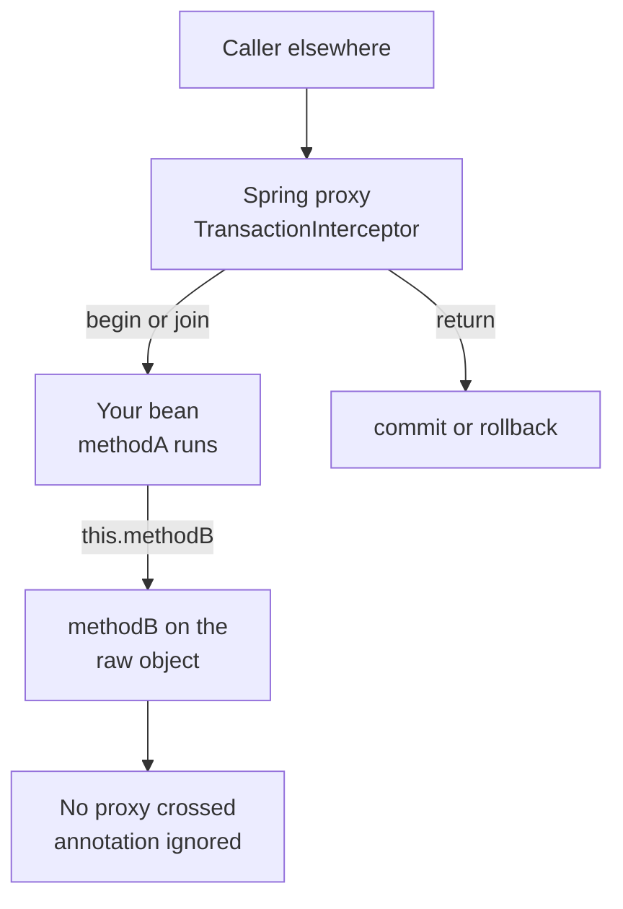

# Spring Transaction Management

Interview-prep notes on `@Transactional`: how the proxy actually applies it, the seven
propagation levels, the rollback rules, and the isolation levels.

## Contents

| # | Section | The one thing to remember |
| --- | --- | --- |
| 1 | [How `@Transactional` is applied](#1-how-transactional-is-applied-the-proxy-model) | A call that does not go through the proxy gets no transaction. |
| 2 | [Propagation at a glance](#2-propagation-at-a-glance) | `REQUIRED` joins, `REQUIRES_NEW` suspends, `NESTED` uses a savepoint. |
| 3 | [The seven propagation levels](#3-the-seven-propagation-levels-in-detail) | Each level answers two questions: what if a transaction exists, what if none does. |
| 4 | [Rollback rules](#4-rollback-rules-checked-vs-unchecked) | Unchecked rolls back, checked commits — unless you say otherwise. |
| 5 | [Isolation levels](#5-isolation-levels) | Isolation is about what *other* transactions let you see. |
| 6 | [`readOnly`, timeout, and traps](#6-readonly-timeout-and-the-usual-traps) | `readOnly` is a hint to the driver and to Hibernate, not a lock. |

## Corrections made to this file

| Topic | The note used to say | What is actually true |
| --- | --- | --- |
| `MANDATORY` with no transaction | Throws `TransactionRequiredException` | Throws `IllegalTransactionStateException`. `TransactionRequiredException` is a **JPA** exception thrown by `EntityManager` when you flush a write with no transaction — a different failure. |
| `NESTED` | "Creates a nested transaction" with no caveat | Needs a transaction manager that allows savepoints. `JpaTransactionManager` has `nestedTransactionAllowed = false` by default, so `NESTED` throws `NestedTransactionNotSupportedException` in a typical Spring Data JPA app. JTA never supports it. |
| Proxy behaviour | Not covered | Self-invocation and `private` methods silently get no transaction. This is the most common real bug and was missing. |
| Rollback rules | Not covered | Checked exceptions do **not** roll back by default. |
| Isolation levels | Not covered | Added, with the anomaly each level prevents. |

## 1. How `@Transactional` is applied (the proxy model)

Spring does not rewrite your method. It wraps your bean in a **proxy** (a CGLIB subclass for
a class, a JDK dynamic proxy for an interface). The proxy runs a `TransactionInterceptor`
before and after the call: begin/join a transaction on the way in, commit or roll back on the
way out.

Everything surprising about `@Transactional` follows from that one fact.



### Why `@Transactional` on a self-invoked method does nothing

```java
@Service
public class OrderService {

    public void placeOrder(Order o) {
        save(o);                 // <-- plain this.save(o), no proxy involved
    }

    @Transactional
    public void save(Order o) { // annotation is never seen at runtime here
        repo.save(o);
    }
}
```

`placeOrder` already holds a reference to the *target* object (`this`), not to the proxy. The
interceptor sits on the proxy, so an internal call walks straight past it. No error is raised,
no log line appears — the method simply runs without a transaction.

From the Spring reference: *"In proxy mode (which is the default), only external method calls
coming in through the proxy are intercepted... self-invocation ... does not lead to an actual
transaction at runtime even if the invoked method is marked with `@Transactional`."*

The same caveat applies to `@PostConstruct` and other initialisation code: the proxy is not
fully wired yet, so transactions there are unreliable.

**Fixes, best first:**

| Fix | How | When to use it |
| --- | --- | --- |
| Move the method | Put `save()` on a second bean and inject it | Almost always the right answer |
| Self-injection | Inject the bean into itself and call `self.save(o)` | Quick, but hides the design smell |
| `AopContext` | `((OrderService) AopContext.currentProxy()).save(o)` | Needs `@EnableAspectJAutoProxy(exposeProxy = true)` |
| AspectJ mode | `@EnableTransactionManagement(mode = ADVICE_MODE_ASPECTJ)` | Weaving cost; use only if you truly need it |

### Why `@Transactional` on a `private` method does nothing

Visibility rules, as of Spring Framework 6.0:

| Visibility | Class-based (CGLIB) proxy | Interface (JDK) proxy |
| --- | --- | --- |
| `public` | Advised | Advised (must be on the interface) |
| `protected` | Advised since 6.0 | Not advised |
| package-private | Advised since 6.0 | Not advised |
| `private` | **Never advised** | **Never advised** |

A CGLIB proxy works by *subclassing* your bean and overriding methods. A `private` method
cannot be overridden, so there is nothing for the interceptor to hook. Again: no error, just
silence. Before 6.0 only `public` was advised in every mode, so `public` remains the safe
habit — and note that a `private` method is always reached by self-invocation anyway, which
would have killed the transaction regardless.

## 2. Propagation at a glance

Propagation answers two questions for the method being called: *what happens if a transaction
is already running*, and *what happens if none is*.

| Level | If a transaction exists | If none exists | Rolls back with the caller? |
| --- | --- | --- | --- |
| `REQUIRED` (default) | Join it | Start one | Yes — it is the same transaction |
| `SUPPORTS` | Join it | Run with no transaction | Yes, when it joined |
| `MANDATORY` | Join it | Throw `IllegalTransactionStateException` | Yes |
| `REQUIRES_NEW` | Suspend it, start a new one | Start one | **No** — independent commit |
| `NOT_SUPPORTED` | Suspend it, run without | Run with no transaction | No |
| `NEVER` | Throw `IllegalTransactionStateException` | Run with no transaction | No |
| `NESTED` | Savepoint inside the caller's transaction | Behaves like `REQUIRED` | Partly — inner rollback goes to the savepoint only |

Two of these physically need a **second database connection** while the first is held open:
`REQUIRES_NEW` and `NOT_SUPPORTED`. If your pool has 10 connections and 10 threads each hold
an outer transaction and then call a `REQUIRES_NEW` method, every thread waits for a
connection that only another thread can release. That is a self-inflicted deadlock, and it is
the single most common `REQUIRES_NEW` production incident.

## 3. The seven propagation levels in detail

### 1. REQUIRED (default)

Joins the existing transaction if one exists; otherwise starts a new one.

**Behavior:**

- If a transaction exists → reuse it.
- If none exists → start a new transaction.

```java
@Transactional(propagation = Propagation.REQUIRED)
public void methodA() {
    // joins existing or starts new transaction
}
```

**Usage:** Most common choice — everything runs in one transaction unless stated otherwise.

**The catch nobody expects:** "joins" means there is only *one* physical transaction. If the
inner method throws and something in between catches the exception, the inner call has already
marked the shared transaction **rollback-only**. The outer method then commits happily, and
Spring throws `UnexpectedRollbackException` at the very end:

```java
@Transactional                       // outer
public void process() {
    try {
        inner.doWork();              // @Transactional REQUIRED, throws
    } catch (Exception e) {
        log.warn("carrying on");     // too late: the tx is already rollback-only
    }
}                                    // --> UnexpectedRollbackException on commit
```

If the inner step is genuinely optional, it must be `REQUIRES_NEW` (or `NESTED`), not
`REQUIRED`.

### 2. SUPPORTS

Executes within a transaction if one exists; otherwise runs non-transactionally.

**Behavior:**

- If a transaction exists → participate in it.
- If none exists → run normally, no new transaction is started.

```java
@Transactional(propagation = Propagation.SUPPORTS)
public void methodB() {
    // optional transaction
}
```

**Usage:** Read-only methods that can run inside or outside a transaction.

**Caveat:** with no transaction, JPA gives you no persistence-context guarantees — each query
may use a different connection, so two identical reads can return different data, and lazy
loading will fail. `SUPPORTS` is rarely the right answer; prefer
`@Transactional(readOnly = true)` on the read path.

### 3. MANDATORY

Requires an existing transaction — throws if none exists.

**Behavior:**

- If a transaction exists → join it.
- If none → throw `IllegalTransactionStateException` ("No existing transaction found for
  transaction marked with propagation 'mandatory'").

```java
@Transactional(propagation = Propagation.MANDATORY)
public void methodC() {
    // must be called inside a transaction
}
```

**Usage:** Internal steps that must never be invoked standalone. It is an assertion about the
caller, enforced at runtime.

> **Correction.** These notes previously said `TransactionRequiredException`. That is a
> `jakarta.persistence` exception, thrown by the `EntityManager` when you attempt a write with
> no active transaction. Spring's propagation check is its own and throws
> `IllegalTransactionStateException` — the same type `NEVER` throws.

### 4. REQUIRES_NEW

Always starts a new transaction; suspends any existing one.

**Behavior:**

- If a transaction exists → suspend it, start a new one.
- Executes in its own independent transaction, with its own commit and rollback.

```java
@Transactional(propagation = Propagation.REQUIRES_NEW)
public void methodD() {
    // new independent transaction
}
```

**Usage:** Audit logging, notifications, or any step that must survive a rollback of the main
work.

**Two hard requirements:**

- It needs a **second connection** from the pool while the outer one is suspended — size the
  pool for it (see the deadlock note in section 2).
- The outer transaction's uncommitted changes are **invisible** to it, because it is a separate
  database transaction. An audit row that reads the entity the outer transaction just modified
  will see the old value.

### 5. NOT_SUPPORTED

Does not support transactions — suspends any existing one.

**Behavior:**

- If a transaction exists → suspend it.
- Always runs non-transactionally.

```java
@Transactional(propagation = Propagation.NOT_SUPPORTED)
public void methodE() {
    // runs outside any transaction
}
```

**Usage:** Long-running reports or bulk reads that should not hold a transaction (and its
locks and undo space) open for minutes.

### 6. NEVER

Must not run inside a transaction — throws if one exists.

**Behavior:**

- If a transaction exists → throw `IllegalTransactionStateException`.
- Otherwise → run non-transactionally.

```java
@Transactional(propagation = Propagation.NEVER)
public void methodF() {
    // strictly non-transactional
}
```

**Usage:** Code that must never be inside a transaction — for example a slow external HTTP
call that would otherwise pin a database connection for its whole duration.

### 7. NESTED

Creates a savepoint inside the existing transaction.

**Behavior:**

- If a transaction exists → set a JDBC savepoint; a failure rolls back to that savepoint only.
- If none exists → behaves like `REQUIRED`.
- There is still only **one** physical transaction and **one** connection — unlike
  `REQUIRES_NEW`. The inner work commits only when the outer transaction commits.

```java
@Transactional(propagation = Propagation.NESTED)
public void methodG() {
    // nested transaction with savepoint
}
```

**Usage:**

- If the inner step fails → roll back to the savepoint; the outer transaction continues.
- Useful for partial rollbacks within a larger transaction — for example, trying a
  best-effort enrichment step that may fail.

> **Correction.** `NESTED` is not available everywhere, and that was not flagged before.
>
> | Transaction manager | `NESTED` works? |
> | --- | --- |
> | `DataSourceTransactionManager` | Yes — savepoints enabled by default |
> | `JpaTransactionManager` | **No by default** — `nestedTransactionAllowed` is `false`, so you get `NestedTransactionNotSupportedException`. Set it to `true` and savepoints apply to the JDBC connection, not to the persistence context |
> | `JtaTransactionManager` | No — JTA has no savepoint concept |
>
> The JPA restriction exists because a savepoint rolls back the *database*, but Hibernate's
> first-level cache still holds the entities you changed. After rolling back to a savepoint you
> should `clear()` the persistence context, or the in-memory state and the database disagree.

## 4. Rollback rules (checked vs unchecked)

The default rule surprises people every time:

| Thrown from a `@Transactional` method | Default behaviour |
| --- | --- |
| `RuntimeException` and subclasses | **Roll back** |
| `Error` and subclasses | **Roll back** |
| Checked `Exception` (e.g. `IOException`, `SQLException`) | **Commit** |
| Nothing thrown | Commit |

The reason is historical and deliberate: EJB drew the same line, and Spring kept it. A checked
exception is treated as a *business* outcome the caller is expected to handle, not as a system
failure.

**Overriding it:**

```java
// roll back on everything, checked included
@Transactional(rollbackFor = Exception.class)
public void transfer() throws InsufficientFundsException { ... }

// commit even though this unchecked exception escaped
@Transactional(noRollbackFor = NotificationFailedException.class)
public void placeOrder() { ... }
```

**Traps:**

- **A caught exception is not a rollback.** If you `try/catch` inside the transactional method
  and swallow the exception, the transaction commits. To roll back from inside, either rethrow
  or call `TransactionAspectSupport.currentTransactionStatus().setRollbackOnly()`.
- `rollbackFor` on the *inner* method does not help if the outer method catches and continues —
  see `UnexpectedRollbackException` in section 3.1.
- Rollback rolls back the database only. Anything already sent — an email, a Kafka message, an
  HTTP call — is gone. That is exactly the gap the transactional-outbox pattern closes
  (see [Kafka Q&A](Kafka_QA.md#6-transaction-boundaries-across-services-db-write-plus-event-publish)).

## 5. Isolation levels

Isolation controls which *other* transactions' work you can see. Each level is defined by the
read anomalies it prevents.

| Level | Dirty read | Non-repeatable read | Phantom read | Cost |
| --- | --- | --- | --- | --- |
| `READ_UNCOMMITTED` | Possible | Possible | Possible | Lowest; rarely justified |
| `READ_COMMITTED` | Prevented | Possible | Possible | Default on PostgreSQL, Oracle, SQL Server |
| `REPEATABLE_READ` | Prevented | Prevented | Possible (per the SQL standard) | Default on MySQL InnoDB |
| `SERIALIZABLE` | Prevented | Prevented | Prevented | Highest; expect lock waits or serialization failures |
| `DEFAULT` | — | — | — | Whatever the database is configured to use |

The three anomalies, concretely:

- **Dirty read** — you read a row another transaction has changed but not committed; it may
  roll back, so you read a value that never existed.
- **Non-repeatable read** — you read the same row twice in one transaction and get two
  different values, because someone committed an `UPDATE` in between.
- **Phantom read** — you run the same `WHERE` clause twice and get a different *set* of rows,
  because someone committed an `INSERT` or `DELETE` in between.

**Things interviewers push on:**

- `Isolation.DEFAULT` is the Spring default: Spring does not change the connection's isolation
  at all. So "what is Spring's default isolation?" is really "what is your database's default?"
- Real engines are not the textbook. PostgreSQL's `REPEATABLE READ` is snapshot isolation and
  prevents phantoms too. MySQL InnoDB's `REPEATABLE READ` prevents phantoms for plain reads via
  a consistent snapshot, and uses gap locks for locking reads. Oracle does not support
  `READ_UNCOMMITTED` at all.
- Raising isolation costs concurrency. For a lost-update problem, JPA optimistic locking
  (`@Version`) is usually the cheaper and more precise fix than `SERIALIZABLE`.

```java
@Transactional(isolation = Isolation.REPEATABLE_READ, timeout = 10)
public Report build() { ... }
```

## 6. `readOnly`, timeout, and the usual traps

| Attribute | What it actually does |
| --- | --- |
| `readOnly = true` | A **hint**. Spring flags the JDBC connection read-only (some drivers then route to a replica or skip undo logging) and puts Hibernate's flush mode to `MANUAL`, which skips dirty checking — a real speedup on large read queries. It does not physically prevent writes on every database. |
| `timeout = 10` | Seconds. Applied as the JDBC statement query timeout, so a runaway query fails instead of holding locks forever. |
| `rollbackFor` / `noRollbackFor` | See section 4. |
| `propagation` | See sections 2 and 3. |
| `isolation` | See section 5. Not honoured by every transaction manager; `JpaTransactionManager` needs a dialect that can apply it. |

**Checklist of silent failures:**

| Symptom | Cause |
| --- | --- |
| No transaction at all | Self-invocation, or a `private` method, or the bean was created with `new` instead of injected |
| `UnexpectedRollbackException` | An inner `REQUIRED` call failed and marked the transaction rollback-only; the outer caught it |
| Data committed despite an exception | The exception was checked, and no `rollbackFor` was set |
| `LazyInitializationException` after the method returns | The persistence context closed with the transaction — see [Hibernate / JPA Q&A](Hibernate_JPA_QA.md#9-what-is-lazyinitializationexception-and-how-do-you-really-fix-it) |
| Pool exhaustion under load | `REQUIRES_NEW` or `NOT_SUPPORTED` holding two connections per thread |
| `NestedTransactionNotSupportedException` | `NESTED` on `JpaTransactionManager` or JTA |
