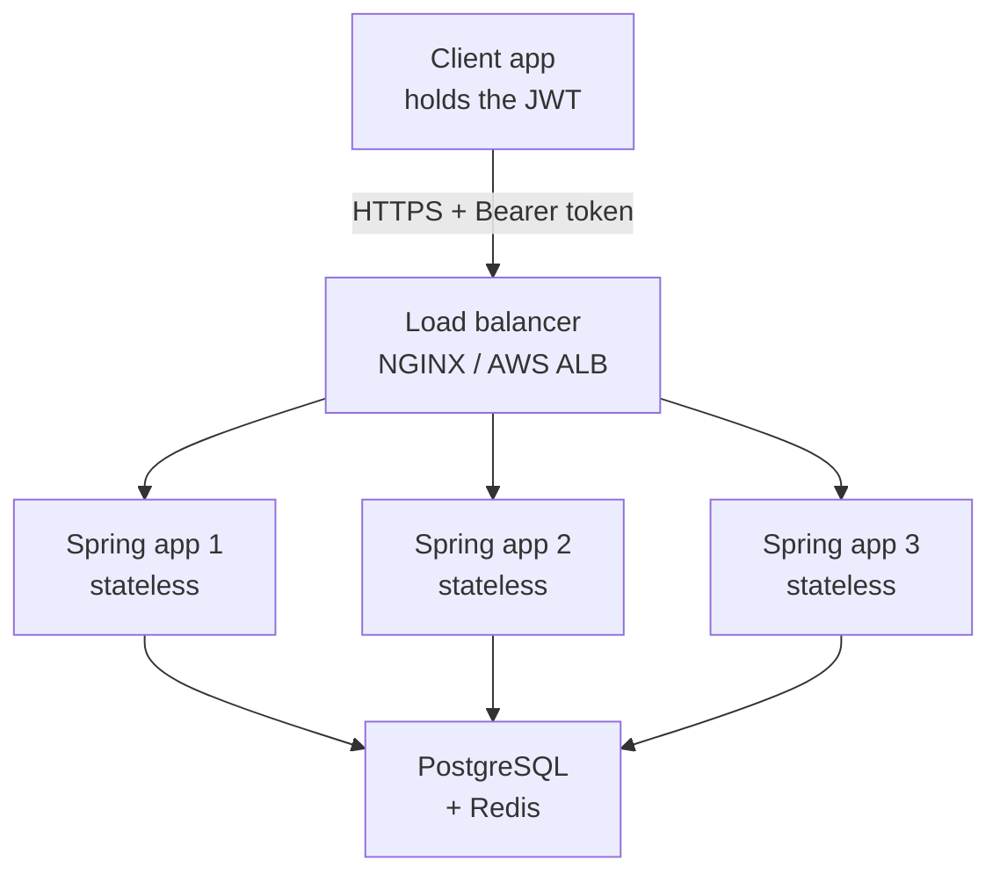
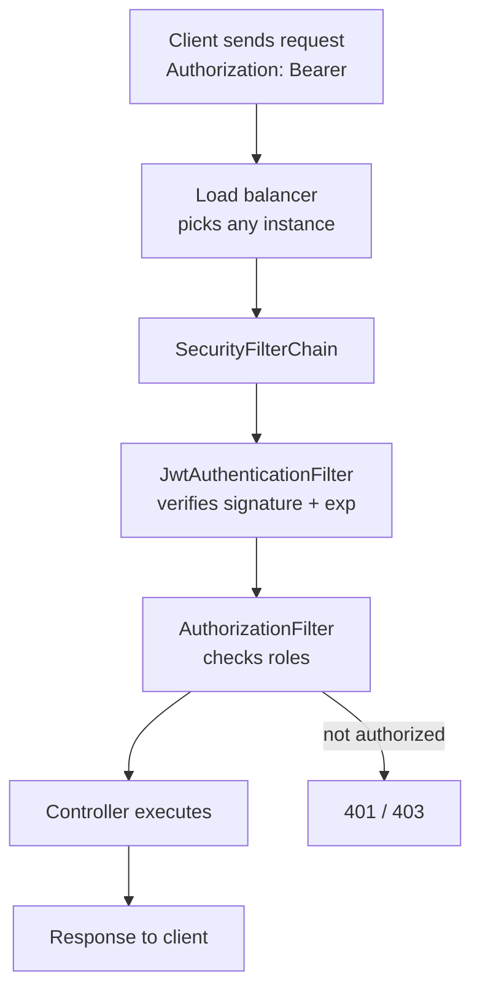

# Interview Memory Q&A — Part 2

Numbered, mixed-topic memory notes (Spring AOP proxies, JUnit 5 parameterized tests,
the 12-factor principles, deployment strategies, and a full Spring Security + JWT +
load-balancer walkthrough) kept in the original order and with the original item
numbers.

The Spring Security section was recorded against Spring Security 5 and **most of its
API no longer exists in Spring Security 6** (Spring Boot 3). Those parts carry a
**Correction** line naming what was removed and what replaced it, so the distinction
sticks rather than just the new code. Items marked *(new)* fill gaps the original
left open.

## How to use this file

| # | Topic | The one thing to remember |
| --- | --- | --- |
| 1 | Spring AOP proxies | Spring **Boot** defaults to CGLIB even when interfaces exist. |
| 2 | JUnit 5 `@ParameterizedTest` | A test that reimplements the logic asserts nothing. |
| 3 | 12-factor principles | Twelve factors, not fourteen — "build, release, run" is one. |
| 4 | Deployment strategies | Eight named strategies with their real trade-offs. |
| 5 | Spring Security + JWT + LB | `WebSecurityConfigurerAdapter` is **removed** in Security 6. |
| 6 | *(new)* JWT revocation | Stateless means you cannot log someone out. Plan for it. |

## Table of Contents

- [1. How Spring AOP proxies work](#1-how-spring-aop-proxies-work)
- [2. JUnit 5 @ParameterizedTest (ValueSource, CsvSource, MethodSource)](#2-junit-5-parameterizedtest-valuesource-csvsource-methodsource)
- [3. Explain the 12-factor principles](#3-explain-the-12-factor-principles)
- [4. Explain different deployment strategies](#4-explain-different-deployment-strategies)
- [Q. How Spring Security works in real time with a load balancer, and how it helps scalability](#q-how-spring-security-works-in-real-time-with-a-load-balancer-and-how-it-helps-scalability)
- [Q. How do you log someone out of a stateless JWT system? (new)](#q-how-do-you-log-someone-out-of-a-stateless-jwt-system-new)

## 1. How Spring AOP proxies work

**Correction — the recorded rule is the plain Spring Framework default, not the
Spring Boot one, and Spring Boot is what you are actually running.**

The note said: *"If target class implements an interface → JDK Dynamic Proxy used.
Else → CGLIB."* That is true for Spring Framework with its own defaults. But
**Spring Boot sets `spring.aop.proxy-target-class=true`**, so since Boot 2.0 the
answer is:

| Runtime | Class implements an interface | Proxy actually used |
| --- | --- | --- |
| Plain Spring Framework (`proxyTargetClass=false`) | Yes | JDK dynamic proxy |
| Plain Spring Framework | No | CGLIB subclass |
| **Spring Boot (default)** | **Yes** | **CGLIB** |
| **Spring Boot (default)** | No | CGLIB |

Saying "interface means JDK proxy" in a Spring Boot interview invites the follow-up
"are you sure? check `AopAutoConfiguration`" — and the answer is that Boot chose
CGLIB everywhere precisely because JDK proxies only expose the interface, so
injecting a concrete class type failed with a confusing `BeanNotOfRequiredTypeException`.

How the two differ:

| | JDK dynamic proxy | CGLIB proxy |
| --- | --- | --- |
| Mechanism | Implements the interfaces at runtime | Generates a **subclass** at runtime |
| Requires | At least one interface | A non-final class |
| Cannot proxy | Methods not on the interface | `final` classes, `final` / `private` / `static` methods |
| Injecting by concrete type | Fails | Works |
| Constructor | Not called | Bypassed via Objenesis (since Spring 4.3, no no-arg constructor needed) |

**The self-invocation trap — this is what the question is really testing.**

The proxy wraps the bean. A call that comes *in* from outside goes through the
proxy and gets the advice. A call from one method of the bean to another is a plain
`this.` call on the target object — it never touches the proxy, so **no advice
runs**:

```java
@Service
public class OrderService {

    public void processAll(List<Order> orders) {
        for (Order o : orders) {
            save(o);          // self-invocation: NO transaction starts here
        }
    }

    @Transactional
    public void save(Order o) { ... }
}
```

This silently does nothing transactional, and it applies equally to
`@Transactional`, `@Cacheable`, `@Async`, `@Retry` and `@CircuitBreaker`. The fixes,
best first:

1. Move the annotated method into a **separate bean** and inject it.
2. Inject the proxy into itself (`@Lazy` self-reference) and call `self.save(o)`.
3. Use `TransactionTemplate` / the programmatic API and skip AOP for this case.

Two more facts worth having ready:

- Spring AOP is **proxy-based and method-level only** — it cannot advise field
  access or constructor calls. AspectJ with load-time weaving can, and that is the
  standard "what if you need more?" answer.
- Advice types, in execution order around a joinpoint: `@Around` (before) →
  `@Before` → method → `@AfterReturning` or `@AfterThrowing` → `@After` →
  `@Around` (after).

## 2. JUnit 5 @ParameterizedTest (ValueSource, CsvSource, MethodSource)

A parameterized test runs the same method once per argument set, reporting each as a
separate test. It needs the `junit-jupiter-params` dependency, which
`spring-boot-starter-test` already brings in.

**Example 1 — `@ValueSource`**

```java
public class MathUtils {
    public static boolean isEven(int number) {
        return number % 2 == 0;
    }
}
```

```java
import org.junit.jupiter.params.ParameterizedTest;
import org.junit.jupiter.params.provider.ValueSource;
import static org.junit.jupiter.api.Assertions.assertTrue;

public class MathUtilsTest {

    @ParameterizedTest
    @ValueSource(ints = {2, 4, 6, 8, 10})
    void testIsEven_ShouldReturnTrueForEvenNumbers(int number) {
        assertTrue(MathUtils.isEven(number));
    }
}
```

`@ValueSource` takes exactly **one** argument per run, and it cannot supply `null`
(annotation values cannot be null). That limitation is why `@NullSource`,
`@EmptySource` and `@MethodSource` exist.

**Example 2 — `@CsvSource`**

```java
public class DiscountService {
    public double calculateDiscount(double price, double discountPercent) {
        return price - (price * discountPercent / 100);
    }
}
```

```java
import org.junit.jupiter.params.ParameterizedTest;
import org.junit.jupiter.params.provider.CsvSource;
import static org.junit.jupiter.api.Assertions.assertEquals;

public class DiscountServiceTest {

    DiscountService service = new DiscountService();

    @ParameterizedTest
    @CsvSource({
        "100, 10, 90",
        "200, 25, 150",
        "50, 0, 50",
        "120, 50, 60"
    })
    void testCalculateDiscount(double price, double discountPercent, double expected) {
        double actual = service.calculateDiscount(price, discountPercent);
        assertEquals(expected, actual, 0.01);
    }
}
```

All four expected values check out by hand: 100−10=90, 200−50=150, 50−0=50,
120−60=60. The `0.01` delta is the right call — `assertEquals` on bare `double`
without a delta compares exact binary representations and fails on rounding.

**Example 3 — `@MethodSource`**

**Correction — the recorded version of this test asserted nothing.** It was named
`StringUtilsTest` but never called `StringUtils`; instead the test body
reimplemented the logic:

```java
// WRONG - as originally recorded: the test re-derives the expected value
// boolean actual = input == null || input.trim().isEmpty();
// Assertions.assertEquals(expected, actual);
```

That is a tautology. It passes no matter what the production code does, and it would
keep passing after `StringUtils.isBlank` was deleted. A test must call the code
under test:

```java
import org.junit.jupiter.params.ParameterizedTest;
import org.junit.jupiter.params.provider.MethodSource;
import org.junit.jupiter.api.Assertions;
import org.junit.jupiter.params.provider.Arguments;
import java.util.stream.Stream;

public class StringUtilsTest {

    static Stream<Arguments> provideStringsForIsBlank() {
        return Stream.of(
            Arguments.of("   ", true),
            Arguments.of("",   true),
            Arguments.of("abc", false),
            Arguments.of(null, true)
        );
    }

    @ParameterizedTest
    @MethodSource("provideStringsForIsBlank")
    void testIsBlank(String input, boolean expected) {
        Assertions.assertEquals(expected, StringUtils.isBlank(input));
    }
}
```

The `@MethodSource` factory must be `static` (unless the test class is
`@TestInstance(PER_CLASS)`), and it must return `Stream`, `Iterable`, `Iterator` or
an array. `Arguments.of(...)` wraps one row.

**Summary**

**Correction —** the original summary table listed `@SpringBootTest` as a
parameterized-test feature. It is not related to `@ParameterizedTest` at all; it
starts an application context. It is replaced below with the sources that were
actually missing.

| Source | Supplies |
| --- | --- |
| `@ParameterizedTest` | The marker that makes the method run once per argument set. |
| `@ValueSource` | One simple literal per run. Cannot supply `null`. |
| `@CsvSource` | Several arguments per run, written inline. |
| `@CsvFileSource` | The same, read from a classpath CSV file. |
| `@MethodSource` | Arbitrary or complex objects from a static factory method. |
| `@EnumSource` | Every constant of an enum, or a filtered subset. |
| `@NullSource` / `@EmptySource` / `@NullAndEmptySource` | The edge cases `@ValueSource` cannot express. |

Add `@DisplayName` or the `name` attribute
(`@ParameterizedTest(name = "{index}: isEven({0})")`) so failures name the offending
input instead of reading "testIsEven[3]".

## 3. Explain the 12-factor principles

Mnemonic: **CDCBBPPCDDLA** — Codebase, Dependencies, Config, Backing services,
Build-release-run, Processes, Port binding, Concurrency, Disposability, Dev/prod
parity, Logs, Admin processes. Twelve letters, twelve factors.

**Correction —** the recorded expansion listed **fourteen** items, because it split
factor 5 into "Build, Release, Run" as three separate names. The mnemonic has twelve
letters and the numbered list below has twelve entries, so the expansion contradicted
both. "Build, release, run" is **one** factor: the point is the *separation between*
the three stages, not that each is a principle.

| # | Factor | What it means | Example |
| --- | --- | --- | --- |
| 1 | **Codebase** | One codebase in version control, many deploys. Dev, staging and prod are deployments of the same repo, not forks of it. | All environments build from the same Git repo with different config. |
| 2 | **Dependencies** | Declare every dependency explicitly and isolate them. Never assume the host has something installed. | `pom.xml` (Maven), `requirements.txt` (Python) or `package.json` (Node) pins versions; a container or virtualenv provides the isolation. |
| 3 | **Config** | Anything that varies between deploys lives in the environment, not the code. | `DATABASE_URL` as an env var, not credentials in `application.properties`. |
| 4 | **Backing services** | Databases, queues and caches are attached resources, swappable by changing a URL. | Moving from a local PostgreSQL to RDS changes the connection string only. |
| 5 | **Build, release, run** | Three strictly separated stages. Build makes an artifact; release binds it to config; run executes it. Releases are immutable. | Never edit code or config on a production box — cut a new release. |
| 6 | **Processes** | The app runs as one or more **stateless** processes. Nothing durable in local memory or disk. | Sessions in Redis, not in the instance's heap. |
| 7 | **Port binding** | The app is self-contained and exports its service by binding a port. | Spring Boot serves on 8080 via embedded Tomcat rather than being deployed into an external servlet container. |
| 8 | **Concurrency** | Scale out by running more processes, not by making one process bigger. | Ten instances behind a load balancer, not one instance with more RAM. |
| 9 | **Disposability** | Fast startup, graceful shutdown. Processes are cattle. | On `SIGTERM` a Kafka consumer commits offsets and finishes in-flight work. |
| 10 | **Dev/prod parity** | Keep environments similar — dependencies, config mechanism, database version, deployment method. Minimise the time, personnel and tooling gaps. | Docker gives every environment the same PostgreSQL version. |
| 11 | **Logs** | Logs are an event stream written to stdout/stderr. The app never manages log files or rotation. | The platform (Kubernetes, CloudWatch) collects and aggregates the stream. |
| 12 | **Admin processes** | One-off tasks run in the same environment and from the same codebase as the app. | `java -jar app.jar --migrate` on the same release, not a script from a laptop. |

One nuance on factor 7 worth stating: "don't rely on an external web server" means
the app must not *require* being deployed into one to serve traffic. Putting NGINX
or an ingress controller in front for TLS termination and routing is completely
normal and does not break the factor.

## 4. Explain different deployment strategies

| Strategy | Description | When to use | Pros | Cons |
| --- | --- | --- | --- | --- |
| Recreate | Stop the old version entirely, then start the new. | Dev/test, or small apps where downtime is acceptable. | Simple; no version overlap. | Causes downtime. |
| Rolling | Replace instances in batches. | High-availability production systems. | No downtime, gradual. | Slower rollback; two versions run at once. |
| Blue-Green | Two full environments; switch traffic when the new one is ready. | Zero downtime with instant rollback. | Rollback is a traffic switch. | Double infrastructure cost. |
| Canary | Route a small percentage of users to the new version, then widen. | Large-scale, risk-sensitive changes. | Limits blast radius. | Needs routing and per-version monitoring. |
| Shadow | New version receives mirrored real traffic; responses are discarded. | Performance testing under real load. | No user impact. | Complex; resource-heavy; unsafe for writes. |
| A/B testing | Two versions served deliberately to different cohorts. | UX experiments and data-driven decisions. | Controlled comparison. | Needs analytics and statistical rigour. |
| Feature toggles | Ship the code disabled; turn it on at runtime. | Continuous delivery; decoupling deploy from release. | No redeploy to enable or roll back. | Toggle debt if old flags are never removed. |
| Partitioned / regional | Roll out region by region or service by service. | Distributed systems, microservice fleets. | Isolated risk per region. | Requires orchestration and version-skew tolerance. |

Two things that separate a good answer from a list:

- **Rolling and canary both mean two versions run simultaneously**, so the release
  must be backwards-compatible with the previous one — especially the database
  schema. Use expand-then-contract migrations: add the new column, deploy code that
  writes both, backfill, then drop the old column in a later release.
- **Blue-green's real cost is stateful dependencies.** Switching the app tier is
  easy; a shared database that both colours write to is what makes rollback hard.
  Say that before being asked.

## Q. How Spring Security works in real time with a load balancer, and how it helps scalability

Explain Spring Security: how it works in real time with an example and flow, with a
load balancer, and how it helps to achieve scalability.

This walks from Spring Security fundamentals → real-time flow → load balancer
integration → scalability and statelessness.

### 1. What is Spring Security?

Spring Security provides authentication, authorization, and protection against
common attacks (CSRF, session fixation, clickjacking) for Spring applications.

It is built on a **filter chain**: every request passes through an ordered series of
servlet filters before reaching your controller. Spring Security registers a single
`DelegatingFilterProxy` into the servlet container, which delegates to a
`FilterChainProxy`, which picks the matching `SecurityFilterChain`.

### 2. How Spring Security works (core flow)

**Example: a user logs in to a microservice-based web app behind a load balancer.**

#### Step 1. User sends login request

```http
POST /login
Content-Type: application/json

{
  "username": "ravi",
  "password": "password123"
}
```

#### Step 2. Security filter chain intercepts

**Correction — two of the four filters originally listed no longer exist in Spring
Security 6.** Naming removed classes is an easy thing for an interviewer to catch.

| Originally recorded | Status in Spring Security 6 | Replacement |
| --- | --- | --- |
| `SecurityContextPersistenceFilter` | **Removed** (deprecated in 5.8) | `SecurityContextHolderFilter` |
| `UsernamePasswordAuthenticationFilter` | Still current | — |
| `ExceptionTranslationFilter` | Still current | — |
| `FilterSecurityInterceptor` | **Removed** (deprecated in 5.8) | `AuthorizationFilter` |

The behavioural difference behind the first swap matters: the old
`SecurityContextPersistenceFilter` **automatically saved** the context to the session
at the end of every request. `SecurityContextHolderFilter` only *loads* it — saving
is now explicit. Code that authenticates manually and relied on the automatic save
silently stops persisting the login on upgrade.

`UsernamePasswordAuthenticationFilter` captures the credentials and hands them to the
`AuthenticationManager`.

#### Step 3. AuthenticationManager → AuthenticationProvider

`AuthenticationManager` (normally `ProviderManager`) delegates to one or more
`AuthenticationProvider`s. For username/password that is `DaoAuthenticationProvider`,
which calls `UserDetailsService` and then the `PasswordEncoder`.

**Correction — the recorded configuration used
`protected void configure(AuthenticationManagerBuilder auth)`, an override of
`WebSecurityConfigurerAdapter`, which was deprecated in Spring Security 5.7 and
REMOVED in 6.0.** The component-based replacement:

```java
@Bean
public UserDetailsService userDetailsService(UserRepository repo) {
    return username -> repo.findByUsername(username)
        .orElseThrow(() -> new UsernameNotFoundException(username));
}

@Bean
public PasswordEncoder passwordEncoder() {
    return new BCryptPasswordEncoder();
}

@Bean
public AuthenticationManager authenticationManager(
        AuthenticationConfiguration config) throws Exception {
    return config.getAuthenticationManager();
}
```

Spring Boot auto-wires a `DaoAuthenticationProvider` from the `UserDetailsService`
and `PasswordEncoder` beans, so you rarely declare the provider yourself.

#### Step 4. On success

- A fully populated `Authentication` object is created.
- It is stored in the `SecurityContext` (held in a `ThreadLocal` by
  `SecurityContextHolder`).
- Persisted either in the HTTP session (stateful) or not at all (stateless + JWT).
- The response carries either a `Set-Cookie` session id or a token.

### 3. Stateless authentication with JWT (for scalability)

Session replication across nodes is costly and couples the instances, so in a
load-balanced microservice estate we keep the app stateless and carry identity in a
signed token.

#### Step 1. Login

The server authenticates the credentials, then issues a signed JWT:

```json
{
  "sub": "ravi",
  "roles": ["USER"],
  "iat": 1734768000,
  "exp": 1734771600
}
```

**A JWT is signed, not encrypted.** The payload is base64url — anyone holding the
token can read every claim. The signature only proves it has not been *altered*.
Never put anything confidential in a JWT.

Signing algorithm matters for the load-balancer question:

| Family | Example | Key distribution |
| --- | --- | --- |
| HMAC (symmetric) | `HS256` | Every service shares the **same secret**, and any of them can therefore mint tokens. |
| RSA / ECDSA (asymmetric) | `RS256`, `ES256` | Only the auth server holds the private key; services verify with the **public** key, usually fetched from a JWKS endpoint. |

Prefer asymmetric across service boundaries — with HMAC, compromising any one
service gives an attacker a token factory.

#### Step 2. Client stores the JWT

**Correction — the recorded answer said "browser localStorage", and that is the
answer interviewers push back on.** `localStorage` is readable by any JavaScript on
the page, so a single XSS flaw hands over every user's token. The safer default for
a browser client is an **`HttpOnly`, `Secure`, `SameSite=Strict` cookie**, which
script cannot read — at the cost of re-introducing CSRF protection, since cookies
are sent automatically. For a native mobile app, the platform keystore/keychain.

#### Step 3. For each request

```http
GET /profile
Authorization: Bearer <jwt-token>
```

#### Step 4. On the server side

- `JwtAuthenticationFilter` extracts and validates the token: signature, `exp`, and
  normally `iss` and `aud` too.
- Builds an `Authentication` from the claims.
- Sets it into the `SecurityContext`.
- `AuthorizationFilter` then allows or rejects the request.

Result: no server-side session, any instance can validate any token, and horizontal
scaling needs no coordination between nodes.

### 4. Real-time architecture with load balancer



Key points:

- The load balancer (NGINX / AWS ALB) distributes traffic with no affinity rules.
- Each instance runs its own `SecurityFilterChain` and validates the token locally —
  **no call back to the auth server per request**, which is the actual scalability
  win.
- All instances share the signing secret (HMAC) or the public key (RSA).
- **No sticky sessions required.** With server-side sessions the load balancer must
  pin each user to one node, which breaks rebalancing and makes a node failure log
  everyone on it out.
- Scaling out is adding instances to the target group.

### 5. Example JWT-based Spring Security config

**Correction — the recorded configuration was Spring Security 5 and does not
compile on Spring Security 6.** Four separate removals:

| Recorded (Security 5) | Spring Security 6 |
| --- | --- |
| `extends WebSecurityConfigurerAdapter` | **Removed.** Declare a `SecurityFilterChain` `@Bean`. |
| `http.csrf().disable()` | Removed chaining style → `csrf(csrf -> csrf.disable())` |
| `.authorizeRequests()` | **Removed** → `.authorizeHttpRequests()` |
| `.antMatchers(...)` | **Removed** → `.requestMatchers(...)` |

```java
import static org.springframework.security.config.http.SessionCreationPolicy.STATELESS;

@Configuration
@EnableWebSecurity
public class SecurityConfig {

    private final JwtAuthenticationFilter jwtFilter;

    public SecurityConfig(JwtAuthenticationFilter jwtFilter) {
        this.jwtFilter = jwtFilter;
    }

    @Bean
    SecurityFilterChain filterChain(HttpSecurity http) throws Exception {
        return http
            .csrf(csrf -> csrf.disable())          // safe: token auth, no cookies
            .sessionManagement(sm -> sm.sessionCreationPolicy(STATELESS))
            .authorizeHttpRequests(auth -> auth
                .requestMatchers("/auth/login", "/auth/register").permitAll()
                .requestMatchers("/admin/**").hasRole("ADMIN")
                .anyRequest().authenticated())
            .addFilterBefore(jwtFilter, UsernamePasswordAuthenticationFilter.class)
            .build();
    }
}
```

`JwtAuthenticationFilter`:

```java
public class JwtAuthenticationFilter extends OncePerRequestFilter {

    private final JwtService jwtService;
    private final UserDetailsService userDetailsService;

    public JwtAuthenticationFilter(JwtService jwtService,
                                   UserDetailsService userDetailsService) {
        this.jwtService = jwtService;
        this.userDetailsService = userDetailsService;
    }

    @Override
    protected void doFilterInternal(HttpServletRequest req,
                                    HttpServletResponse res,
                                    FilterChain chain)
            throws ServletException, IOException {

        String authHeader = req.getHeader("Authorization");
        if (authHeader != null && authHeader.startsWith("Bearer ")) {
            String token = authHeader.substring(7);
            String username = jwtService.extractUsername(token);
            if (username != null
                    && SecurityContextHolder.getContext().getAuthentication() == null) {
                UserDetails user = userDetailsService.loadUserByUsername(username);
                if (jwtService.isTokenValid(token, user)) {
                    UsernamePasswordAuthenticationToken auth =
                        new UsernamePasswordAuthenticationToken(
                            user, null, user.getAuthorities());
                    auth.setDetails(
                        new WebAuthenticationDetailsSource().buildDetails(req));
                    SecurityContextHolder.getContext().setAuthentication(auth);
                }
            }
        }
        chain.doFilter(req, res);
    }
}
```

Two corrections applied to the filter, both of which cause real production bugs:

- **`@Component` was removed from the filter class.** A `Filter` that is also a
  Spring bean gets registered **twice** — once by you via `addFilterBefore`, and
  once automatically by Spring Boot into the main servlet chain, where it runs on
  every request including ones the security chain does not cover. Either drop
  `@Component` and declare it as a `@Bean` in the config, or keep it and register a
  `FilterRegistrationBean` with `setEnabled(false)` to suppress the automatic one.
- **Field `@Autowired` became constructor injection**, so the dependencies can be
  `final` and the filter is unit-testable without a container.

One behaviour to note: the filter deliberately does **not** reject a request with a
bad token — it just leaves the context empty and calls `chain.doFilter`. The
`AuthorizationFilter` further down produces the 401/403. Throwing here instead would
break `permitAll()` endpoints.

### 6. How Spring Security helps scalability

| Feature | Stateful (session) | Stateless (JWT) |
| --- | --- | --- |
| Session storage | Server-side, per node | None |
| Load balancer | Needs sticky sessions or session replication | Any node can serve any request |
| Scale-out | Constrained by session sharing | Add instances freely |
| Security context | Loaded from the session | Rebuilt per request from the token |
| Per-request cost | Session lookup (possibly a network hop to Redis) | Signature verification, CPU-only |
| Revocation | Immediate — delete the session | **Hard** — see the next section |
| Token/session size | A small id in a cookie | The full claim set on every request |

The honest framing: stateless is not strictly better, it is a **trade**. You give up
instant revocation and pay per-request bytes, and you get nodes that need to know
nothing about each other.

### 7. Real-world integrations

| Use case | How Spring Security fits |
| --- | --- |
| API gateway | Validate the JWT once at the edge before forwarding. |
| Microservices | Each service validates independently via the shared public key. |
| OAuth2 / OIDC login | `spring-boot-starter-oauth2-client` for Google, GitHub or a corporate IdP. |
| Resource server | `spring-boot-starter-oauth2-resource-server` validates JWTs for you — prefer it over a hand-rolled filter. |
| Role-based access | `@PreAuthorize("hasRole('ADMIN')")` with `@EnableMethodSecurity`. |
| CSRF protection | On for cookie/session web apps; off for stateless token APIs. |

Worth saying: if you are validating standard JWTs, the hand-written
`JwtAuthenticationFilter` above is mostly a teaching exercise. In production use
`oauth2-resource-server`, which gives you JWKS fetching, key rotation, clock-skew
handling and claim validation out of the box.

### 8. Summary — real-time flow with load balancer



- **Scalability:** achieved by keeping services stateless, so no node holds anything
  another node needs.
- **Security:** enforced by the filter chain and per-request token validation.
- **Flexibility:** works behind any load balancer without sticky sessions.

## Q. How do you log someone out of a stateless JWT system? (new)

*The original file ended with an empty `Q:` placeholder. This is the follow-up that
section 6's "Revocation: hard" row sets up, and it is asked almost every time JWT
statelessness is claimed as an advantage.*

**The problem.** A signed JWT is valid until it expires, because validation is a
pure function of the token and the key — nothing is looked up. Deleting it from the
client does not invalidate it. If a token is stolen, or a user is deactivated, or an
admin revokes a role, every instance keeps honouring the old token until `exp`.

**The options, and what each really costs:**

| Approach | How it works | Cost |
| --- | --- | --- |
| Short-lived access token + refresh token | Access token lives 5–15 min; a long-lived refresh token is stored server-side and exchanged for new ones. | Revocation is delayed by the access-token lifetime. This is the standard answer. |
| Denylist of revoked token ids | Store the `jti` of revoked tokens in Redis until their `exp` passes; every request checks it. | Re-introduces a shared lookup — you are no longer fully stateless. Small and bounded, though. |
| Token version / `tokenVersion` claim | Store a counter per user; bump it on logout. Compare the claim to the stored counter. | One user lookup per request, usually cached. |
| Rotate the signing key | Invalidates every token at once. | Logs out every user. Only for a key compromise. |

**What to say:** "Short-lived access tokens with refresh-token rotation, plus a
Redis denylist keyed on `jti` for immediate revocation when we need it. The denylist
entries expire at the token's own `exp`, so it stays small — and I'd be explicit
that this makes us not *purely* stateless, which is the trade for being able to
actually log someone out."

Two details that show depth:

- **Rotate refresh tokens on use.** Issue a new refresh token each time one is
  redeemed and invalidate the old one. If an old one is ever presented again, that
  is a replay — revoke the whole family.
- **Logout must clear the client side too**, whatever the server does: drop the
  cookie or wipe the stored token. Server-side revocation and client-side clearing
  are both needed, and answering with only one is the common miss.
