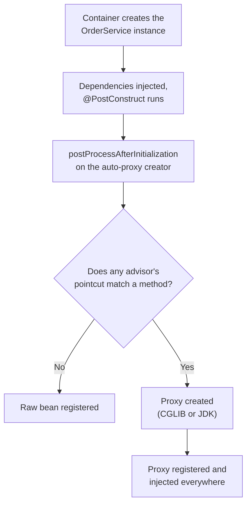
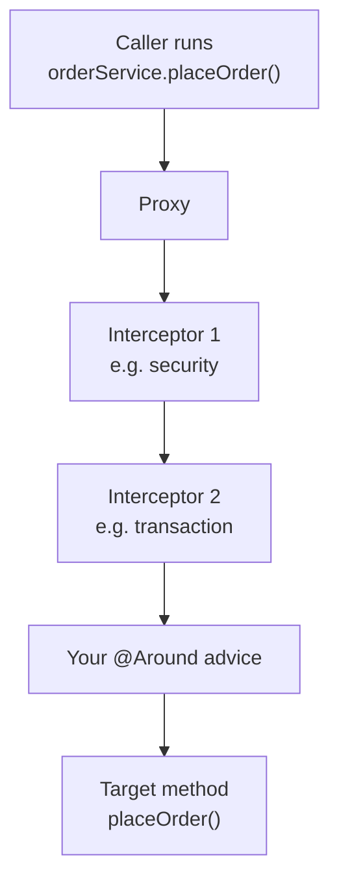

# Spring AOP — Interview Q&A

Short answers first. A question gets more depth only when interviewers usually go
deeper on it. The weight marks say how much.

Version facts were checked against the jars in the local Maven repository:
Spring Boot 3.5.7 (Spring Framework 6.2) and Spring Boot 4.0.3 (Spring Framework 7.0).

Related notes: [Spring Boot Q&A](04_Spring_Boot_QA.md) ·
[Transaction management](../05-Spring-Microservices/notes/Spring_Transaction_Management.md)

## Weight legend

| Mark | What it means | How the answer is written |
| --- | --- | --- |
| ★★★ | Asked in almost every Java backend round, with follow-ups | Answer, mechanism, code, traps |
| ★★ | Asked often | Answer and one example or table |
| ★ | Occasional, or a senior-level bonus | Two to four lines |

## Contents

| # | Question | Weight | One-line answer |
| --- | --- | --- | --- |
| 1 | [What is AOP?](#1-what-is-aop-and-what-problem-does-it-solve) | ★★ | Moves cross-cutting code (tx, security, logging) out of business methods |
| 2 | [Core terms](#2-the-core-aop-terms) | ★★★ | Pointcut = where, advice = what and when, aspect = both |
| 3 | [How Spring AOP works](#3-how-does-spring-aop-work-internally) | ★★★ | A BeanPostProcessor swaps the bean for a proxy |
| 4 | [JDK proxy vs CGLIB](#4-jdk-dynamic-proxy-vs-cglib-proxy) | ★★★ | Interface-based vs subclass; Boot uses CGLIB by default |
| 5 | [Spring AOP vs AspectJ](#5-spring-aop-vs-aspectj) | ★★★ | Runtime proxies vs bytecode weaving |
| 6 | [Advice types and order](#6-the-five-advice-types-and-their-order) | ★★★ | Before, AfterReturning, AfterThrowing, After, Around |
| 7 | [Writing Around advice](#7-writing-an-around-advice-correctly) | ★★★ | Call `proceed()` once and return its result |
| 8 | [Pointcut expressions](#8-pointcut-expressions) | ★★★ | `execution`, `within`, `@annotation`, `args`, `bean` |
| 9 | [Custom annotation aspect](#9-custom-annotation-plus-aspect) | ★★★ | RUNTIME retention + `@annotation(param)` binding |
| 10 | [Self-invocation](#10-self-invocation-why-the-annotation-is-ignored) | ★★★ | `this.method()` skips the proxy, so advice is skipped |
| 11 | [What can't be advised](#11-which-methods-can-spring-aop-not-advise) | ★★ | private, final, static, constructors, non-beans |
| 12 | [Ordering aspects](#12-ordering-multiple-aspects) | ★★ | Lower `@Order` = outermost; retry must wrap the transaction |
| 13 | [JoinPoint API](#13-the-joinpoint-api) | ★★ | `getArgs`, `getSignature`, `getTarget` vs `getThis` |
| 14 | [Features built on AOP](#14-spring-features-built-on-aop) | ★★★ | `@Transactional`, `@Async`, `@Cacheable`, `@PreAuthorize` |
| 15 | [Enabling AOP in Boot](#15-enabling-aop-in-spring-boot) | ★★ | Starter + `@Aspect` **and** `@Component` |
| 16 | [Exceptions in aspects](#16-exceptions-in-aspects) | ★★ | AfterThrowing can't swallow; Around can |
| 17 | [Filter vs interceptor vs aspect](#17-filter-vs-handlerinterceptor-vs-aspect) | ★★ | HTTP layer vs MVC layer vs any bean method |
| 18 | [When not to use AOP](#18-when-not-to-use-aop) | ★★ | Never hide business rules in aspects |
| 19 | [Performance](#19-performance-and-startup-cost) | ★ | Per-call cost tiny; broad pointcuts hurt startup |
| 20 | [Testing an aspect](#20-testing-an-aspect) | ★ | `AspectJProxyFactory` for unit tests |
| 21 | [Proxy identity traps](#21-proxy-identity-traps) | ★ | `getClass()` lies; proxy fields are null |
| 22 | [Debugging checklist](#22-my-aspect-is-not-running-debugging-checklist) | ★★★ | Ten causes, checked in order |

---

## 1. What is AOP and what problem does it solve?

**Weight:** ★★

**Answer:** AOP (aspect-oriented programming) takes code that many methods need but
that is not business logic — transactions, security checks, logging, metrics — and
puts it in one module called an **aspect**. Spring then applies the aspect to many
methods without those methods containing that code.

These are called **cross-cutting concerns** because they cut across every layer.
Without AOP the same code is copied into every method (*scattering*) and mixed into
the business logic (*tangling*):

```java
public Order placeOrder(OrderRequest req) {
    long start = System.nanoTime();                       // metrics
    log.info("placeOrder {}", req.id());                  // logging
    checkPermission("ORDER_CREATE");                      // security
    TransactionStatus tx = txManager.getTransaction(def); // transaction
    try {
        Order order = doPlaceOrder(req);                  // the only business line
        txManager.commit(tx);
        return order;
    } catch (RuntimeException e) {
        txManager.rollback(tx);
        throw e;
    } finally {
        metrics.record(System.nanoTime() - start);
    }
}
```

With AOP the method keeps only the business line, and annotations ask for the rest:

```java
@Transactional
@PreAuthorize("hasAuthority('ORDER_CREATE')")
@Timed("orders.place")
public Order placeOrder(OrderRequest req) {
    return doPlaceOrder(req);
}
```

Typical cross-cutting concerns: transactions, security, caching, retry, auditing,
metrics, tenant context, idempotency checks.

---

## 2. The core AOP terms

**Weight:** ★★★

| Term | Meaning | Spring example |
| --- | --- | --- |
| Aspect | The class holding the cross-cutting logic | A class with `@Aspect` |
| Join point | A point where an aspect can run. In Spring AOP: **only the execution of a method on a Spring bean** | The call to `placeOrder(..)` |
| Pointcut | An expression that selects join points | `execution(* com.shop.service..*(..))` |
| Advice | The code to run, plus *when* (before, after, around) | A method with `@Around` |
| Advisor | One pointcut + one advice as a unit (Spring-internal) | The advisor behind `@Transactional` |
| Target | The original object being advised | Your `OrderService` instance |
| Proxy | The wrapper object Spring creates; it runs the advice, then calls the target | `OrderService$$SpringCGLIB$$0` |
| Weaving | Linking aspects to targets. Spring AOP does it at runtime, with proxies | — |
| Introduction | Adding a new interface to an existing bean | `@DeclareParents` |

**One sentence to say in the interview:** a pointcut picks *where*, advice says *what
and when*, an aspect packages them, and Spring weaves them in by wrapping the bean in
a proxy.

---

## 3. How does Spring AOP work internally?

**Weight:** ★★★

**Answer:** Spring AOP is proxy-based. While the container creates beans, a
`BeanPostProcessor` called `AnnotationAwareAspectJAutoProxyCreator` checks each bean
against every advisor. If any pointcut matches any method of the bean, it returns a
**proxy** instead of the bean. The container stores the proxy and injects the proxy
everywhere. The real object sits behind it.

When the proxy is created:



What happens on every call:



**Mechanism:**

- Each matching advice becomes a `MethodInterceptor` in an ordered chain.
- The proxy builds a `ReflectiveMethodInvocation`. Each interceptor calls
  `invocation.proceed()` to pass control to the next one. The last `proceed()` calls
  the target method.
- The chain for each method is worked out once and cached, so a call costs only a
  few hops.
- The proxy is created **after** initialization. So anything that runs during the
  bean's own setup (constructor, `@PostConstruct`) runs on the raw object, and no
  advice applies there.

**Senior follow-ups:**

- *Where is the decision made?* `AbstractAutoProxyCreator.wrapIfNecessary()`.
- *What about circular references?* The proxy is created early through
  `getEarlyBeanReference()`, so the other bean receives the proxy, not the raw object.

---

## 4. JDK dynamic proxy vs CGLIB proxy

**Weight:** ★★★

| | JDK dynamic proxy | CGLIB proxy |
| --- | --- | --- |
| How it is built | A runtime class that **implements the bean's interfaces** (`java.lang.reflect.Proxy`) | A runtime **subclass of the bean's class** (CGLIB, repackaged inside `spring-core`) |
| Needs | At least one interface | Class and advised methods not `final` |
| You can inject it as | The interface only | The interface or the concrete class |
| Methods it can advise | Interface methods (public) | Public, protected and package-private, non-final methods |
| Class name at runtime | `jdk.proxy2.$Proxy87` | `OrderService$$SpringCGLIB$$0` |

**Which one Spring picks:**

- **Plain Spring:** JDK proxy if the bean implements an interface, CGLIB otherwise.
  Force CGLIB with `@EnableAspectJAutoProxy(proxyTargetClass = true)`.
- **Spring Boot:** CGLIB always. `spring.aop.proxy-target-class` defaults to `true`
  (checked in Boot 3.5.7 and 4.0.3 metadata). Set it to `false` to get JDK proxies
  back for beans with interfaces.

**Why Boot chose CGLIB:** with a JDK proxy, injecting by class
(`@Autowired OrderServiceImpl svc`) fails with `BeanNotOfRequiredTypeException`,
because the proxy implements only the interface. CGLIB removes that surprise.

**Traps:**

- A `final` **class** that needs advice fails at startup — CGLIB cannot subclass it.
- A `final` **method** is silently not advised. Worse: the call runs on the proxy
  object itself, whose fields were never injected, so it can throw
  `NullPointerException`.
- Kotlin classes are `final` by default. The `kotlin-spring` compiler plugin opens
  classes that carry Spring annotations, for exactly this reason.
- CGLIB proxies are created with Objenesis, so the target's constructor is **not**
  run a second time (it was, before Spring 4).

---

## 5. Spring AOP vs AspectJ

**Weight:** ★★★

| | Spring AOP | AspectJ |
| --- | --- | --- |
| Weaving | Runtime, through a proxy | Compile time (`ajc`), after compile (binary), or load time (`-javaagent`) |
| Join points | Method execution on Spring beans only | Method call and execution, constructors, field read/write, static init, any object |
| Self-invocation | Not advised | Advised — the class's own bytecode is changed |
| private, final, static methods | Not advised | Advised |
| Setup | One starter | Build plugin or a JVM agent |
| Extra cost per call | One proxy hop | None beyond the advice itself |

**Common confusion:** Spring AOP uses AspectJ's *annotations and pointcut language*
(`@Aspect`, `@Around`, `execution(..)`) through the `aspectjweaver` jar, but **not**
AspectJ's weaver. "Spring uses AspectJ" is half right: it borrows the syntax, not the
weaving.

**When to choose AspectJ:** advice on objects Spring does not create (`new`), on
self-calls, on field access, or on very hot code paths. Otherwise Spring AOP — the
build stays simple, and almost every real use case is a public service method.

`@Transactional` can also run in AspectJ mode:
`@EnableTransactionManagement(mode = AdviceMode.ASPECTJ)` plus weaving. That fixes
self-invocation for transactions.

---

## 6. The five advice types and their order

**Weight:** ★★★

| Advice | When it runs | Can it change args or result? | Can it stop the call? |
| --- | --- | --- | --- |
| `@Before` | Before the method | No (it can mutate argument objects) | Only by throwing |
| `@AfterReturning` | After a normal return | Reads the result (`returning = "r"`), cannot replace it | No |
| `@AfterThrowing` | After an exception | Reads it (`throwing = "ex"`), **cannot swallow it** | No — the exception still propagates |
| `@After` | Always, like `finally` | No | No |
| `@Around` | Wraps the whole call | Yes — new args through `proceed(args)`, any return value | Yes — by not calling `proceed()` |

```java
@Aspect
@Component
public class OrderAspect {

    @Pointcut("execution(* com.shop.order.OrderService.place(..))")
    void place() {}

    @Before("place()")
    public void before(JoinPoint jp) { log.info("args {}", jp.getArgs()); }

    @AfterReturning(pointcut = "place()", returning = "order")
    public void ok(Order order) { log.info("placed {}", order.getId()); }

    @AfterThrowing(pointcut = "place()", throwing = "ex")
    public void failed(Exception ex) { log.warn("failed: {}", ex.getMessage()); }

    @After("place()")
    public void always() { MDC.remove("orderFlow"); }

    @Around("place()")
    public Object around(ProceedingJoinPoint pjp) throws Throwable {
        MDC.put("orderFlow", "place");
        return pjp.proceed();
    }
}
```

**Execution order inside one aspect** (Spring 5.2.7 and later):

```text
@Around (code before proceed)
  → @Before
    → target method
  → @AfterReturning  or  @AfterThrowing
  → @After
@Around (code after proceed)
```

**Rule of thumb:** use the weakest advice that does the job. `@Around` is the most
powerful and the easiest to break (forgetting `proceed()`, forgetting to return).

---

## 7. Writing an Around advice correctly

**Weight:** ★★★

```java
@Aspect
@Component
public class TimingAspect {

    private static final Logger log = LoggerFactory.getLogger(TimingAspect.class);

    @Around("execution(public * com.shop.service..*(..))")
    public Object time(ProceedingJoinPoint pjp) throws Throwable {
        long start = System.nanoTime();
        try {
            return pjp.proceed();            // call it, and return what it returns
        } finally {
            long ms = (System.nanoTime() - start) / 1_000_000;
            log.info("{} took {} ms", pjp.getSignature().toShortString(), ms);
        }
    }
}
```

**The rules:**

1. Only `@Around` receives a `ProceedingJoinPoint`. Return type `Object`, and declare
   `throws Throwable`.
2. Call `proceed()` once in the normal path. Calling it twice runs the method twice —
   that is exactly how a retry aspect works, so only do it on purpose.
3. Return what `proceed()` returned. Returning `null` for a method with a primitive
   return type throws
   `AopInvocationException: Null return value from advice does not match primitive return type`.
4. To change the arguments, pass a new array: `pjp.proceed(new Object[]{ trimmed })`.
5. Don't swallow exceptions unless that is the job of the aspect (Q16).

**Modern note:** for timing, prefer Micrometer's `@Timed` or `@Observed` — those are
aspects someone already wrote and tested. Write your own only for project-specific
logic.

---

## 8. Pointcut expressions

**Weight:** ★★★

**`execution` syntax** — parts marked `?` are optional:

```text
execution( modifiers?  return-type  declaring-type?  name(params)  throws? )
execution( public      *            com.shop..*Service.find*(..)            )
```

- `*` matches one of anything (a type, a name part).
- `..` in a package means "this package and all sub-packages".
- `(..)` = any number of arguments; `(*)` = exactly one; `(String, ..)` = first is a String.

| Designator | Matches | Example |
| --- | --- | --- |
| `execution` | Method signature | `execution(* com.shop.service.*.*(..))` |
| `within` | Every method in matching types or packages | `within(com.shop.service..*)` |
| `@annotation` | Methods carrying an annotation | `@annotation(com.shop.Audited)` |
| `@within` | Every method of classes carrying an annotation | `@within(org.springframework.stereotype.Service)` |
| `args` | Runtime argument types; can bind them | `args(orderId, ..)` |
| `this` / `target` | Proxy type / target object type | `target(com.shop.Auditable)` |
| `bean` | Spring bean name (Spring-only) | `bean(*Service)` |

**Combining and reusing:** use `&&`, `||`, `!`, and name your pointcuts.

```java
@Pointcut("within(com.shop.service..*)")
void serviceLayer() {}

@Pointcut("@annotation(com.shop.Audited)")
void audited() {}

@Before("serviceLayer() && audited()")
public void audit(JoinPoint jp) { ... }
```

**Follow-ups interviewers ask:**

- **`this` vs `target`:** `this` tests the *proxy* object's type; `target` tests the
  *target* object's type. With JDK proxies they differ (the proxy is not an instance
  of the class). With CGLIB both usually match.
- **`@within` vs `@target`:** `@within` checks the declared type statically, once.
  `@target` checks the runtime class on every call. A bare `@target(...)` pointcut
  can make Spring try to proxy every bean, including `final` framework classes, and
  fail at startup. Prefer `@within`, or always combine with `within(com.shop..*)`.
- **Performance:** keep pointcuts narrow. `execution`, `within` and `@annotation` are
  resolved once when the proxy is built. `args`, `@args` and `@target` add a check on
  every call.

---

## 9. Custom annotation plus aspect

**Weight:** ★★★ — the most common "have you written an aspect?" example.

```java
@Target(ElementType.METHOD)
@Retention(RetentionPolicy.RUNTIME)   // CLASS or SOURCE → the aspect never sees it
public @interface Audited {
    String action();
}
```

```java
@Aspect
@Component
@RequiredArgsConstructor
public class AuditAspect {

    private final AuditRepository auditRepository;

    // "audited" binds the annotation instance to the parameter of the same name
    @AfterReturning(pointcut = "@annotation(audited)", returning = "result")
    public void record(JoinPoint jp, Audited audited, Object result) {
        auditRepository.save(new AuditEntry(
                audited.action(),
                jp.getSignature().toShortString(),
                currentUser(),
                Instant.now()));
    }
}
```

```java
@Audited(action = "ORDER_CANCEL")
public void cancel(long orderId) { ... }
```

**What to point out:**

- Retention must be `RUNTIME`.
- Binding by name (`@annotation(audited)`) hands you the annotation with its
  attributes — no reflection needed.
- The binding relies on parameter names. Boot's parent POM compiles with
  `-parameters`. Without it, set `argNames` on the advice.
- `@AfterReturning` means failed calls are not audited. If they must be, use
  `@Around` or add an `@AfterThrowing` advice.
- Should the audit row be in the same transaction as the business change? That is
  decided by aspect ordering (Q12).

---

## 10. Self-invocation: why the annotation is ignored

**Weight:** ★★★ — the single most asked AOP question.

**Answer:** advice runs only when the call goes **through the proxy**. A call from one
method of a bean to another method of the same bean uses `this`, which is the raw
target, so every interceptor is skipped.

```java
@Service
public class ReportService {

    public void generateAll() {
        for (long id : ids()) {
            generate(id);              // really this.generate(id) → no proxy
        }
    }

    @Transactional(propagation = Propagation.REQUIRES_NEW)
    public void generate(long id) { ... }   // runs WITHOUT a new transaction
}
```

There is no error and no warning. The annotation is silently ignored. The same thing
happens to `@Async` (runs synchronously), `@Cacheable` (never caches), `@Retryable`
(never retries) and `@PreAuthorize` (never checks).

**Fixes, best first:**

| Fix | How | Trade-off |
| --- | --- | --- |
| Move the method to another bean | Inject `ReportGenerator` and call `generator.generate(id)` | Best — clearer design, no tricks |
| Inject the bean's own proxy | `@Lazy @Autowired private ReportService self;` then `self.generate(id)` | Works, but reads oddly |
| `AopContext.currentProxy()` | Needs `@EnableAspectJAutoProxy(exposeProxy = true)` | Ties code to Spring AOP; uses a ThreadLocal |
| `TransactionTemplate` | `txTemplate.execute(status -> ...)` | Explicit; only for transactions |
| AspectJ weaving | `mode = AdviceMode.ASPECTJ` | Build or agent complexity |

**Related:** calls made from the constructor or `@PostConstruct` are never advised,
because the proxy does not exist yet. For startup work that needs a transaction, run
it from an `ApplicationReadyEvent` listener instead.

---

## 11. Which methods can Spring AOP not advise?

**Weight:** ★★

| Case | Why | What happens |
| --- | --- | --- |
| `private` method | The proxy can't override or expose it | Silently not advised |
| `final` method (CGLIB) | The subclass can't override it | Not advised; runs on the proxy whose fields are null |
| `final` class (CGLIB) | Can't be subclassed | Startup failure if a pointcut matches |
| `static` method | Not called on an instance | Not advised |
| Self-invocation | `this` is the target | Not advised (Q10) |
| Object made with `new` | Not a Spring bean, so no proxy | Not advised |
| Call during constructor or `@PostConstruct` | The proxy is created later | Not advised |
| Non-interface method on a JDK proxy | The proxy only has interface methods | Not reachable through the proxy |

**Visibility note:** with CGLIB, Spring intercepts public and protected methods (and
package-private ones when needed). For `@Transactional` specifically, Spring 6 and
later also apply it to protected and package-private methods on class-based proxies;
before 6.0 it was public methods only.

---

## 12. Ordering multiple aspects

**Weight:** ★★

- Put `@Order(n)` on the aspect class, or implement `Ordered`.
- **Lower number = higher precedence = outermost.** It runs first on the way in and
  last on the way out.
- Without `@Order`, the order between two aspects is undefined.
- Order belongs to the aspect class, not to each advice method. To order two advices
  separately, put them in separate aspects.

**The real-world case — retry and transactions:**

```text
Wrong (retry inside the transaction):
  tx begins → retry → method fails → retry again → same broken transaction

Right (retry outside the transaction):
  retry → tx begins → method fails → rollback → retry → NEW transaction
```

The `@Transactional` advisor has `Ordered.LOWEST_PRECEDENCE` by default (configurable
with `@EnableTransactionManagement(order = ...)`). So a retry aspect with
`@Order(1)` wraps it. This matters most for optimistic-lock retries: retrying inside
the same persistence context just sees the same stale entity again.

---

## 13. The JoinPoint API

**Weight:** ★★

| Method | Returns |
| --- | --- |
| `getArgs()` | The arguments. Changing this array does not change the call — use `proceed(args)` |
| `getSignature()` | The method signature. Cast to `MethodSignature` for `getMethod()`, return type, parameter names |
| `getTarget()` | The target object |
| `getThis()` | The proxy |
| `getKind()` | Always `"method-execution"` in Spring AOP |

Reading an annotation when you did not bind it in the pointcut:

```java
MethodSignature sig = (MethodSignature) jp.getSignature();
Audited audited = AnnotationUtils.findAnnotation(sig.getMethod(), Audited.class);
```

**Trap:** with a JDK proxy, `sig.getMethod()` returns the **interface** method.
Annotations placed on the implementation class's method are not on it. Use
`AopUtils.getMostSpecificMethod(method, targetClass)`, or bind the annotation in the
pointcut (Q9), which avoids the problem.

---

## 14. Spring features built on AOP

**Weight:** ★★★

| Annotation | What runs it | Switched on by |
| --- | --- | --- |
| `@Transactional` | `TransactionInterceptor` | `@EnableTransactionManagement` (automatic in Boot) |
| `@Async` | `AnnotationAsyncExecutionInterceptor` | `@EnableAsync` |
| `@Cacheable`, `@CachePut`, `@CacheEvict` | `CacheInterceptor` | `@EnableCaching` |
| `@PreAuthorize`, `@PostAuthorize` | `AuthorizationManagerBeforeMethodInterceptor` and the After variant | `@EnableMethodSecurity` |
| `@Retryable`, `@ConcurrencyLimit` (Spring 7 core) | `RetryAnnotationBeanPostProcessor`, `ConcurrencyLimitBeanPostProcessor` | `@EnableResilientMethods` |
| `@Validated` method validation | `MethodValidationInterceptor` | Automatic in Boot |
| `@Timed`, `@Observed` (Micrometer) | `TimedAspect`, `ObservedAspect` | A bean of that aspect |

The Spring 7 resilience classes were checked in `spring-context` 7.0.5.

**Why this matters:** every one of these inherits the proxy limits — self-invocation,
private and final methods. One root cause, many different symptoms ("my cache never
hits", "my async runs on the request thread", "my REQUIRES_NEW does nothing").

**Senior detail — `@Async` plus `@Transactional` on the same method:** the async
interceptor goes first (its post-processor adds its advisor *before* the existing
ones), so the method hops to the executor thread and the transaction starts there.
Transactions are thread-bound, so the caller's transaction never reaches an `@Async`
method.

---

## 15. Enabling AOP in Spring Boot

**Weight:** ★★

1. **Dependency.** Boot 3: `spring-boot-starter-aop`. Boot 4 renamed it to
   `spring-boot-starter-aspectj` (both checked in the respective dependency BOMs).
   It brings in `aspectjweaver`, which provides the annotations and the pointcut
   parser.
2. **Nothing else to switch on.** `AopAutoConfiguration` applies
   `@EnableAspectJAutoProxy` for you (`spring.aop.auto=true` by default).
3. **The aspect needs both `@Aspect` and `@Component`** (or a `@Bean` method).
   `@Aspect` alone is not a stereotype, so component scanning ignores it and the
   aspect silently never runs.

**Senior detail:** `@Transactional` works even without the AOP starter. It uses
Spring's own advisor, not `@Aspect` parsing. Only your own `@Aspect` classes need the
weaver jar.

---

## 16. Exceptions in aspects

**Weight:** ★★

- `@AfterThrowing` only **observes**. It can log or count the failure, but the
  exception continues to the caller. It cannot swallow it.
- `@Around` can catch, translate or swallow:

```java
@Around("within(com.shop.payment..*)")
public Object translate(ProceedingJoinPoint pjp) throws Throwable {
    try {
        return pjp.proceed();
    } catch (DataAccessException e) {
        throw new PaymentStoreUnavailableException(e);   // unchecked, domain-level
    }
}
```

- Throwing a **checked** exception that the advised method does not declare reaches
  the caller wrapped in `UndeclaredThrowableException`.
- An exception thrown *inside* `@After` or `@AfterReturning` replaces the method's
  result. A bug in a logging aspect can fail a business call that succeeded. Wrap
  side-effect-only advice in its own try/catch.

---

## 17. Filter vs HandlerInterceptor vs aspect

**Weight:** ★★

| | Servlet `Filter` | `HandlerInterceptor` | AOP aspect |
| --- | --- | --- | --- |
| Layer | Servlet container, before `DispatcherServlet` | Spring MVC, around the controller | Any Spring bean method |
| Sees | Raw request and response | Request, response, and the chosen controller method | Method arguments and return value |
| Typical use | Auth tokens, CORS, correlation id, request logging | Per-endpoint checks, timing per handler | Transactions, caching, auditing service calls |
| Works for Kafka listeners and schedulers | No | No | Yes |

**How to answer:** choose by what you need to see. Need raw HTTP → filter. Need to
know which controller method handles the request → interceptor. Need it on service
methods regardless of how they were called → aspect.

---

## 18. When not to use AOP

**Weight:** ★★ — a senior-level judgement question.

- **Business rules.** Hiding "apply loyalty discount" in an aspect makes it invisible
  to anyone reading the method and to unit tests of that class.
- **Order-sensitive interactions.** When several aspects (transaction, retry,
  security, caching) interact and the order decides correctness, explicit code can be
  clearer than `@Order` numbers.
- **Debugging cost.** Stack traces get longer and behaviour appears "from nowhere"
  for new team members.
- **A better tool exists.** Filters for HTTP concerns, Micrometer annotations for
  metrics, Spring Security for authorization.

**Rule to state:** AOP for infrastructure that is truly independent of the business
logic. Explicit code for anything a reader must know to understand what the method
does.

---

## 19. Performance and startup cost

**Weight:** ★

- Per call: a few interceptor hops — nanoseconds to low microseconds. Irrelevant next
  to a database or HTTP call.
- The real cost is at **startup**: every bean is matched against every advisor. A
  broad pointcut such as `execution(* *(..))` proxies everything, including framework
  beans — slower startup, more memory, and failures on `final` classes.
- Always scope pointcuts to your own code first: `within(com.shop..*) && ...`.

---

## 20. Testing an aspect

**Weight:** ★

Unit test without a Spring context:

```java
@Test
void auditsCancel() {
    AuditRepository repo = mock(AuditRepository.class);
    AspectJProxyFactory factory = new AspectJProxyFactory(new OrderService());
    factory.addAspect(new AuditAspect(repo));
    OrderService proxy = factory.getProxy();

    proxy.cancel(42L);

    verify(repo).save(any(AuditEntry.class));
}
```

Integration: a slice test with `@Import(AuditAspect.class)` and
`@EnableAspectJAutoProxy`, or a `@SpringBootTest`. To assert a bean really was
proxied: `assertThat(AopUtils.isAopProxy(bean)).isTrue()`.

---

## 21. Proxy identity traps

**Weight:** ★

- `bean.getClass()` returns `OrderService$$SpringCGLIB$$0`. Use
  `AopUtils.getTargetClass(bean)` or `ClassUtils.getUserClass(bean)` for the real
  class.
- A CGLIB proxy's own fields are all `null`. Never read another bean's fields
  directly (`otherBean.config`) — always go through a method, which the proxy
  forwards to the target.
- With JDK proxies, `instanceof OrderServiceImpl` is `false` for the injected bean.

---

## 22. My aspect is not running: debugging checklist

**Weight:** ★★★ — interviewers love "it doesn't work, what do you check?"

| # | Check | Fix |
| --- | --- | --- |
| 1 | The aspect has `@Component`, not only `@Aspect` | Add `@Component` |
| 2 | The aspect's package is under the main class's package | Move it, or widen the component scan |
| 3 | The AOP starter (`aspectjweaver`) is on the classpath | Add the starter |
| 4 | The pointcut really matches (package, return type, `..`) | Start broad, confirm, then narrow |
| 5 | The annotation has `@Retention(RUNTIME)` | Fix the retention |
| 6 | The call goes through the proxy, not `this.` | Q10 |
| 7 | The method is not private, final or static | Q11 |
| 8 | The object is a Spring bean, not created with `new` | Inject it |
| 9 | `AopUtils.isAopProxy(bean)` is true | If false, no pointcut matched at startup |
| 10 | JDK proxy + annotation on the implementation method | Use CGLIB, or bind the annotation |

Extra visibility: `logging.level.org.springframework.aop=DEBUG`.
