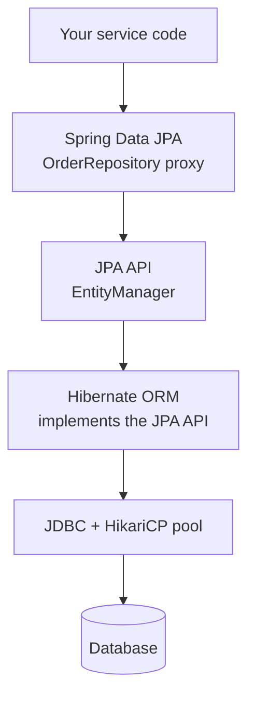
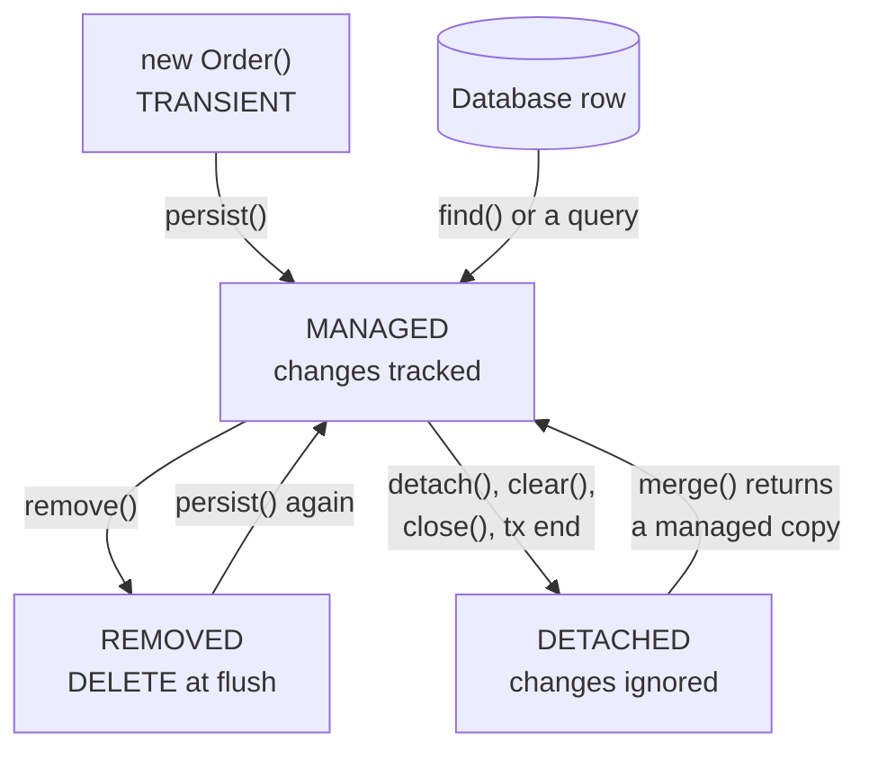

# JPA and Spring Data JPA — Interview Q&A

This file covers the JPA specification (now called **Jakarta Persistence**) and
Spring Data JPA, the repository layer most Spring teams use on top of it. What
Hibernate does underneath — caches, dirty checking, flushing, batching — is in
[02_Hibernate_QA.md](02_Hibernate_QA.md).

Version facts were checked against the jars in the local Maven repository: Spring
Boot 3.5.7 ships JPA 3.1.0 and Spring Data JPA 3.5.5; Spring Boot 4.0.3 ships JPA
3.2.0 and Spring Data JPA 4.0.3.

Related notes: [Interview Memory Part 1](../07-Interview-QA-Memory/Interview_Memory_QA_Part1.md)
(Specifications, `@EntityGraph`, bidirectional mapping) ·
[Transaction management](../05-Spring-Microservices/notes/Spring_Transaction_Management.md)

## Weight legend

| Mark | What it means | How the answer is written |
| --- | --- | --- |
| ★★★ | Asked in almost every Java backend round, with follow-ups | Answer, mechanism, code, traps |
| ★★ | Asked often | Answer and one example or table |
| ★ | Occasional, or a senior-level bonus | Two to four lines |

## Contents

| # | Question | Weight | One-line answer |
| --- | --- | --- | --- |
| 1 | [JPA vs Hibernate vs Spring Data](#1-jpa-vs-hibernate-vs-spring-data-jpa) | ★★★ | Contract, engine, repository generator |
| 2 | [EntityManager, persistence context](#2-entitymanager-and-the-persistence-context) | ★★★ | The API, and the set of objects it is tracking |
| 3 | [What makes an entity](#3-what-makes-a-class-an-entity) | ★★ | `@Entity`, `@Id`, no-arg constructor, not final |
| 4 | [Entity lifecycle states](#4-entity-lifecycle-states) | ★★★ | Transient, managed, detached, removed |
| 5 | [Owning side](#5-relationships-and-the-owning-side) | ★★★ | The side with the foreign key; only it is saved |
| 6 | [Best one-to-many mapping](#6-the-best-way-to-map-one-to-many) | ★★★ | `@ManyToOne(LAZY)` on the child + `mappedBy` + helper methods |
| 7 | [Fetch types](#7-fetch-types-and-their-defaults) | ★★★ | To-one is EAGER by default — make it LAZY |
| 8 | [N+1 problem](#8-the-n1-select-problem) | ★★★ | 1 query + 1 per row; fix with fetch join, graph or DTO |
| 9 | [JOIN vs JOIN FETCH, paging](#9-join-vs-join-fetch-and-paging-with-fetch-joins) | ★★★ | Collection fetch + paging = paging in memory |
| 10 | [Cascade, orphanRemoval](#10-cascade-types-and-orphanremoval) | ★★★ | Parent to child only; never REMOVE toward a parent |
| 11 | [ManyToMany pitfalls](#11-manytomany-pitfalls) | ★★ | Use `Set`; link entity once it needs columns |
| 12 | [OneToOne pitfalls](#12-onetoone-pitfalls) | ★★ | Inverse side can't be lazy; use `@MapsId` |
| 13 | [Inheritance strategies](#13-inheritance-mapping-strategies) | ★★ | SINGLE_TABLE, JOINED, TABLE_PER_CLASS, MappedSuperclass |
| 14 | [Embeddables, converters, enums](#14-embeddables-element-collections-converters-and-enums) | ★★ | Always `EnumType.STRING` |
| 15 | [Composite keys](#15-composite-keys) | ★ | `@EmbeddedId` or `@IdClass` |
| 16 | [Primary key generation](#16-primary-key-generation) | ★★ | SEQUENCE for batching; IDENTITY blocks it |
| 17 | [JPQL vs Criteria vs native](#17-jpql-vs-criteria-api-vs-native-sql) | ★★ | Entities as strings, entities as code, raw tables |
| 18 | [Projections and DTOs](#18-projections-and-dtos) | ★★★ | Entities for writes, DTOs for reads |
| 19 | [Locking](#19-optimistic-and-pessimistic-locking) | ★★★ | `@Version` vs `SELECT … FOR UPDATE` |
| 20 | [Callbacks and auditing](#20-lifecycle-callbacks-and-auditing) | ★★ | `@PrePersist`… and `@CreatedDate` with `@EnableJpaAuditing` |
| 21 | [How repositories work](#21-how-spring-data-repositories-work) | ★★★ | A proxy over `SimpleJpaRepository` + parsed query methods |
| 22 | [Derived queries vs Query](#22-derived-queries-vs-query-annotation) | ★★★ | Name-parsed for simple cases, `@Query` beyond three conditions |
| 23 | [Modifying queries](#23-modifying-queries) | ★★ | Needs `@Modifying`, a transaction, and usually clearing |
| 24 | [save() and isNew](#24-save-persist-or-merge-and-the-isnew-trap) | ★★★ | Assigned ids turn every save into SELECT + INSERT |
| 25 | [Pagination](#25-pagination-page-slice-and-keyset-scrolling) | ★★★ | Page counts, Slice doesn't, keyset scales |
| 26 | [Specifications](#26-specifications-for-dynamic-filters) | ★★ | Composable predicates for optional filters |
| 27 | [Transactions, readOnly](#27-transactions-and-readonly) | ★★ | Service-level `@Transactional`; readOnly skips dirty checks |
| 28 | [findById vs getReferenceById](#28-findbyid-vs-getreferencebyid) | ★★ | Loads now vs proxy for a foreign key |
| 29 | [Streaming results](#29-streaming-large-result-sets) | ★ | `Stream<T>` in a transaction, closed, with fetch size |
| 30 | [JPA 3.2 additions](#30-what-jpa-32-added) | ★ | `runInTransaction`, `FindOption`, `PersistenceConfiguration` |

---

## 1. JPA vs Hibernate vs Spring Data JPA

**Weight:** ★★★



| Layer | What it is | How to describe it |
| --- | --- | --- |
| JPA (Jakarta Persistence) | A specification: interfaces and annotations in `jakarta.persistence`. No running code | The contract |
| Hibernate | The most used implementation of JPA, plus its own extras | The engine |
| Spring Data JPA | Generates repository implementations on top of the `EntityManager` | Removes hand-written DAO code |
| JDBC | Java's low-level SQL API | What every layer above ends up calling |

The package moved from `javax.persistence` to `jakarta.persistence` in version 3.0.

---

## 2. EntityManager and the persistence context

**Weight:** ★★★

- **Persistence unit** — the configuration: which entity classes, which data source,
  which provider settings. Boot builds it from `spring.datasource.*` and `spring.jpa.*`,
  and finds entities by scanning from the main class's package (override with
  `@EntityScan`).
- **`EntityManagerFactory`** — built once from the unit. Thread-safe.
- **`EntityManager`** — the API for one unit of work: `persist`, `find`, `merge`,
  `remove`, `createQuery`. **Not** thread-safe.
- **Persistence context** — the set of entity instances the `EntityManager` is
  currently tracking, at most one instance per id. Hibernate calls this the
  first-level cache.

**Scopes:**

- *Transaction-scoped* (Spring's default): the context lives as long as the
  transaction.
- *Extended* (`@PersistenceContext(type = EXTENDED)`): lives across transactions, for
  stateful components. Rare in Spring applications.

**Injection:** `@PersistenceContext private EntityManager em;` (constructor injection
also works in Boot). What you get is a shared proxy that forwards each call to the
`EntityManager` of the current transaction, so it is safe in a singleton.

---

## 3. What makes a class an entity

**Weight:** ★★

- `@Entity` and a field marked `@Id`.
- A public or protected **no-argument constructor** — the provider creates instances
  by reflection.
- A top-level class that is **not `final`**, with no `final` persistent fields or
  methods — Hibernate subclasses entities to make lazy proxies.
- **Records can't be entities** — they are final, immutable and have no no-arg
  constructor. Use records for DTO projections (Q18).
- **Field vs property access** is decided by where `@Id` sits. Field access is the
  usual choice: getters can then contain logic without changing what is stored.

---

## 4. Entity lifecycle states

**Weight:** ★★★

| State | Meaning |
| --- | --- |
| Transient (new) | Created with `new`; JPA doesn't know about it |
| Managed | In the persistence context; changes are tracked and written at flush |
| Detached | Was managed, but the context closed or it was detached; changes are ignored |
| Removed | Scheduled for DELETE at the next flush |



| Operation | Effect | SQL |
| --- | --- | --- |
| `persist(e)` | Transient → managed | INSERT at flush (IDENTITY ids: immediately) |
| `find(Order.class, id)` | Returns a managed entity or `null` | SELECT, unless already in the context |
| `getReference(Order.class, id)` | Returns a proxy | None until a field is used |
| `merge(e)` | Copies a detached entity's state into a managed one and returns it | SELECT if not in the context; UPDATE at flush |
| `remove(e)` | Managed → removed | DELETE at flush |
| `refresh(e)` | Overwrites the entity with the database state | SELECT |
| `detach(e)` / `clear()` | Stop tracking one entity / all of them | None |
| `flush()` | Sends pending changes | INSERT / UPDATE / DELETE |
| `contains(e)` | Is it managed? | None |

**Trap:** `remove()` on a detached entity throws `IllegalArgumentException`. Spring
Data's `delete()` handles this by loading the entity first.

---

## 5. Relationships and the owning side

**Weight:** ★★★

| Annotation | Example | Default fetch |
| --- | --- | --- |
| `@ManyToOne` | Many `OrderItem`s → one `Order` | EAGER |
| `@OneToMany` | One `Order` → many `OrderItem`s | LAZY |
| `@OneToOne` | One `User` → one `UserProfile` | EAGER |
| `@ManyToMany` | `Student` ↔ `Course` | LAZY |

**Owning side:** the side whose table holds the foreign key. In JPA it is the side
**without** `mappedBy`. For a one-to-many / many-to-one pair, the "many" side always
owns.

**The rule that causes bugs:** only the owning side is written to the database.

```java
order.getItems().add(item);   // inverse side only
// item.setOrder(order) never called → item saved with order_id = NULL
```

- `mappedBy = "order"` names the field on the owning side.
- A *unidirectional* `@OneToMany` without `@JoinColumn` makes JPA create a join table
  (`order_items`) — an extra table and extra INSERTs. Prefer a `@ManyToOne` on the
  child, with an optional `mappedBy` collection on the parent.

---

## 6. The best way to map one-to-many

**Weight:** ★★★

```java
@Entity
public class Order {

    @Id
    @GeneratedValue(strategy = GenerationType.SEQUENCE)
    private Long id;

    @OneToMany(mappedBy = "order", cascade = CascadeType.ALL, orphanRemoval = true)
    private List<OrderItem> items = new ArrayList<>();

    public void addItem(OrderItem item) {      // keeps both sides in sync
        items.add(item);
        item.setOrder(this);
    }

    public void removeItem(OrderItem item) {
        items.remove(item);
        item.setOrder(null);
    }

    public List<OrderItem> getItems() {
        return Collections.unmodifiableList(items);
    }
}

@Entity
public class OrderItem {

    @Id
    @GeneratedValue(strategy = GenerationType.SEQUENCE)
    private Long id;

    @ManyToOne(fetch = FetchType.LAZY, optional = false)
    @JoinColumn(name = "order_id")
    private Order order;
}
```

**Why each choice:**

- The foreign key lives on the child, so the child owns the relationship.
- LAZY on the `@ManyToOne` — overriding the EAGER default.
- Helper methods keep both sides consistent in memory and in the database.
- `cascade = ALL` + `orphanRemoval` because an item is part of the order — it can't
  exist without it.
- No public setter for the list; callers go through the helpers.

**Senior point:** you don't have to map every collection. If a customer can have
100,000 orders, don't map `Customer.orders` — query orders by customer id with
pagination. An unbounded mapped collection is a memory and performance risk.

---

## 7. Fetch types and their defaults

**Weight:** ★★★

| Association | Default | What to set |
| --- | --- | --- |
| `@ManyToOne` | EAGER | `fetch = FetchType.LAZY` |
| `@OneToOne` | EAGER | `fetch = FetchType.LAZY` |
| `@OneToMany` | LAZY | Keep |
| `@ManyToMany` | LAZY | Keep |
| `@ElementCollection` | LAZY | Keep |

**Why make everything LAZY:**

- EAGER is decided once, globally. Every query that loads the entity pays for the
  association, even when no one uses it.
- For JPQL queries, an EAGER association is loaded with a separate SELECT per row —
  N+1 that you didn't even ask for.
- With LAZY, each use case decides what to load (Q8, Q9).

How Hibernate executes fetching (`@Fetch`, `@BatchSize`) is in
[Hibernate Q10](02_Hibernate_QA.md#10-fetchtype-vs-fetchmode-and-batch-fetching).

---

## 8. The N+1 select problem

**Weight:** ★★★ — the most asked JPA question.

**What it is:** one query loads N parent rows, then one more query runs for **each**
parent to load an association.

```java
List<Order> orders = orderRepository.findAll();    // 1 query → 100 orders
for (Order o : orders) {
    o.getCustomer().getName();                     // +1 query per order → 100 more
}
```

The SQL log shows 101 statements. If `customer` is EAGER, it happens inside
`findAll()` itself, even if you never touch the customer.

**Why it matters:** latency multiplies (2 ms × 100 = 200 ms per request), the
connection is held longer, and the database does 100× the work. It grows with data and
is invisible on a test database with three rows.

**How to detect it:** count statements in the SQL log or Hibernate statistics; assert
statement counts in tests; in APM traces, look for the same query repeated many times
in one request.

**Fixes:**

| Fix | Example | Best for |
| --- | --- | --- |
| `JOIN FETCH` | `select o from Order o join fetch o.customer` | A use case that needs the entities |
| `@EntityGraph` | `@EntityGraph(attributePaths = "customer") List<Order> findByStatus(Status s);` | The same, on derived queries without JPQL |
| DTO projection | `select new com.shop.OrderView(o.id, c.name) from Order o join o.customer c` | Read-only APIs; loads only the columns needed |
| Batch fetching | `hibernate.default_batch_fetch_size=50` | A safety net: turns N queries into N/50 |
| Subselect | `@Fetch(FetchMode.SUBSELECT)` on a collection | Collections across a whole result list |

**Not a fix:** switching to EAGER. The data is always loaded, and JPQL queries still
load it with one SELECT per row.

---

## 9. JOIN vs JOIN FETCH, and paging with fetch joins

**Weight:** ★★★

- `join` — used for **filtering**. The association is *not* filled in on the results;
  touching it later triggers a lazy load.
- `join fetch` — filters **and** fills in the association in the same query.

```sql
-- filters by customer country; o.customer is still a lazy proxy
select o from Order o join o.customer c where c.country = 'IN'

-- filters and loads the customer in the same SQL
select o from Order o join fetch o.customer c where c.country = 'IN'
```

Fetch-joining a **collection** repeats the parent once per child row. Hibernate 6 and
later remove those duplicate parents automatically (Hibernate 5 needed `distinct`).

**Paging + a collection fetch join — the trap:**

SQL `LIMIT` counts rows, and with a collection join there is one row per child. So
Hibernate can't page in SQL. It loads **all** matching rows and pages in memory,
logging a warning:

```text
firstResult/maxResults specified with collection fetch; applying in memory
```

On a large table that means an `OutOfMemoryError`.

**Fix — two queries: page the ids, then fetch by id:**

```java
@Query("select o.id from Order o where o.status = :s")
Page<Long> findIdsByStatus(@Param("s") Status s, Pageable pageable);

@Query("select o from Order o left join fetch o.items where o.id in :ids")
List<Order> findWithItems(@Param("ids") List<Long> ids);
```

Apply the sort again in the second query (or re-order in Java), because `IN` doesn't
keep the order of the page.

- Make the problem fail loudly in development:
  `spring.jpa.properties.hibernate.query.fail_on_pagination_over_collection_fetch=true`.
- Fetch-joining a **to-one** association while paging is fine — it doesn't multiply
  rows.

---

## 10. Cascade types and orphanRemoval

**Weight:** ★★★

| Cascade type | When the parent is… | …the children are too |
| --- | --- | --- |
| `PERSIST` | persisted | persisted |
| `MERGE` | merged | merged |
| `REMOVE` | removed | removed |
| `REFRESH`, `DETACH` | refreshed / detached | refreshed / detached |
| `ALL` | any of the above | all of the above |

- Cascades flow along the association they are declared on — normally **parent →
  child**.
- Use them for *composition*: the child is part of the parent (`Order` → `OrderItem`).
- **Never** cascade REMOVE from a child toward its parent:
  `@ManyToOne(cascade = CascadeType.REMOVE)` on `Order.customer` deletes the customer
  when one order is deleted — or fails because other orders still reference it.
- **Never** cascade REMOVE on `@ManyToMany` — it deletes the shared row for everyone.

**orphanRemoval vs CascadeType.REMOVE:**

| Situation | `CascadeType.REMOVE` | `orphanRemoval = true` |
| --- | --- | --- |
| Parent deleted | Children deleted | Children deleted |
| Child removed from the collection | Child row stays (its FK may be set to null) | Child row deleted |

**Traps:**

- Replacing the collection object (`order.setItems(newList)`) with orphanRemoval on
  throws
  `A collection with cascade="all-delete-orphan" was no longer referenced by the owning entity instance`.
  Change the existing collection instead: `items.clear(); items.addAll(newItems);`.
- Cascade REMOVE on a large collection loads every child and sends one DELETE per
  child. For large deletes use a bulk DELETE, or a database `ON DELETE CASCADE`
  together with Hibernate's `@OnDelete(action = OnDeleteAction.CASCADE)`.

---

## 11. ManyToMany pitfalls

**Weight:** ★★

- **Use `Set`, not `List`.** Removing one element from a `List` (a bag) makes
  Hibernate delete **all** join-table rows for that owner and insert the rest again.
- **No `CascadeType.REMOVE` or `ALL`** (Q10).
- Keep both sides in sync with helper methods, as in Q6.
- **Once the link needs its own columns** (`enrolled_at`, `grade`), `@ManyToMany` can't
  hold them. Model the link as an entity — `Enrollment` with two `@ManyToOne` fields.
  Most many-to-many relationships end up there, so many teams start there.
- A `Set` relies on stable `equals`/`hashCode`
  ([Hibernate Q18](02_Hibernate_QA.md#18-equals-hashcode-and-lombok-on-entities)).

---

## 12. OneToOne pitfalls

**Weight:** ★★

**Best mapping — the child shares the parent's primary key through `@MapsId`:**

```java
@Entity
public class UserProfile {

    @Id
    private Long id;                 // the same value as user.id

    @OneToOne(fetch = FetchType.LAZY)
    @MapsId
    @JoinColumn(name = "id")
    private User user;
}
```

Load the profile directly with `em.find(UserProfile.class, userId)`. No reverse
association is needed on `User`.

**The trap — the inverse side can't be lazy.** On
`@OneToOne(mappedBy = "user") UserProfile profile` inside `User`, Hibernate must know
whether to put `null` or a proxy in the field, and the only way to know is to query
the profile table. So **every** `User` load also queries for its profile — a hidden
N+1, whatever `fetch` says. Fix: drop the inverse side and use `@MapsId` + `find()`, or
enable bytecode enhancement with lazy loading.

---

## 13. Inheritance mapping strategies

**Weight:** ★★

| Strategy | Tables | Polymorphic query | Trade-offs |
| --- | --- | --- | --- |
| `SINGLE_TABLE` (default) | One table + a discriminator column | One SELECT — fastest | Subclass columns must be nullable; wide, sparse table |
| `JOINED` | A base table + one table per subclass | Joins (outer joins for "all payments") | Normalized, `NOT NULL` possible; slower with many subclasses |
| `TABLE_PER_CLASS` | One full table per concrete class | `UNION ALL` across tables | Slow polymorphic queries; `IDENTITY` ids not allowed |
| `@MappedSuperclass` | No parent table; fields copied into each child table | Not possible — the parent isn't an entity | For shared columns (id, audit fields) only |

**How to answer:** SINGLE_TABLE for small hierarchies with few subclass-only columns
(payment types). JOINED when subclasses differ a lot and you need `NOT NULL`
constraints. `@MappedSuperclass` for common base fields. Avoid TABLE_PER_CLASS. And
mention that composition often beats inheritance in a data model.

---

## 14. Embeddables, element collections, converters and enums

**Weight:** ★★

- **`@Embeddable` + `@Embedded`:** a value object (`Address`, `Money`) stored in the
  owner's own table columns. No id, no lifecycle of its own. Use `@AttributeOverrides`
  to embed two of the same type (billing and shipping address).
- **`@ElementCollection`:** a collection of values (`Set<String> tags`) in a separate
  table, fully owned by the entity. It has no id, so on any change to a `List`,
  Hibernate deletes all rows for the owner and inserts them again. Fine for small,
  rarely changed sets; otherwise make it an entity.
- **`AttributeConverter<X, Y>`** with `@Converter(autoApply = true)`: custom
  conversions — `Money` stored as cents, an encrypted string, a value type stored as
  JSON.
- **Enums — always `@Enumerated(EnumType.STRING)`.** The default, `ORDINAL`, stores the
  enum's position. Inserting or reordering a constant silently changes the meaning of
  every existing row.

---

## 15. Composite keys

**Weight:** ★

- `@EmbeddedId` with an `@Embeddable` key class, or `@IdClass` with matching `@Id`
  fields.
- The key class needs `equals`, `hashCode`, `Serializable` and a no-arg constructor.
- `@MapsId("orderId")` maps one part of the key to a `@ManyToOne`.
- Prefer a surrogate key for normal entities. Composite keys appear mostly in link
  entities and legacy schemas.

---

## 16. Primary key generation

**Weight:** ★★

| `GenerationType` | In one line |
| --- | --- |
| `IDENTITY` | Database auto-increment; disables JDBC insert batching |
| `SEQUENCE` | Database sequence with pooled allocation (`allocationSize`, default 50); best for batching |
| `TABLE` | Sequence emulated with a locked table row; contention — avoid |
| `UUID` | Generated in the application (JPA 3.1+) |
| `AUTO` | The provider decides — be explicit instead |

Why IDENTITY disables batching, and time-ordered UUIDs:
[Hibernate Q14](02_Hibernate_QA.md#14-id-generators-and-their-effect-on-batching).

---

## 17. JPQL vs Criteria API vs native SQL

**Weight:** ★★

| | JPQL / HQL | Criteria API | Native SQL |
| --- | --- | --- | --- |
| Works on | Entities and their fields | Entities, built as Java objects | Tables and columns |
| Type-safe | No — a string, but `@Query` is validated at startup | Yes, with the generated metamodel (`Order_`) | No |
| Dynamic filters | Awkward string building | Designed for it | Awkward string building |
| Database-specific features | Limited | Limited | Everything the database offers |
| Portable across databases | Yes | Yes | No |

- Spring Data validates JPQL in `@Query` at startup, so a typo fails the boot. Native
  queries are checked only when they run.
- **SQL injection:** always bind parameters (`:status`), never concatenate input into
  any of the three.

---

## 18. Projections and DTOs

**Weight:** ★★★

**Why:** loading an entity costs every column, a slot in the persistence context, a
snapshot, and a dirty check at flush. A read-only screen usually needs a handful of
columns.

**1. Interface projection (closed)** — Spring Data selects only these columns:

```java
public interface OrderSummary {
    Long getId();
    String getStatus();
    BigDecimal getTotal();
}

List<OrderSummary> findByCustomerId(Long customerId);
```

An *open* projection — a getter with `@Value("#{target.firstName + ' ' + target.lastName}")`
— loads the whole entity, so it saves nothing.

**2. Record / class DTO** with a constructor expression:

```java
public record OrderView(Long id, String customerName, BigDecimal total) {}

@Query("""
    select new com.shop.api.OrderView(o.id, c.name, o.total)
    from Order o join o.customer c
    where o.status = :status""")
List<OrderView> findViews(@Param("status") Status status);
```

**3. Dynamic projection** — the caller picks the shape:

```java
<T> List<T> findByStatus(Status status, Class<T> type);
```

**4. `Tuple`** for ad-hoc queries.

**Limits and the rule to state:**

- Projections are flat. For "order with its items" as a DTO, query flat rows and group
  them in Java, or load entities with a fetch plan and map them.
- **Entities for write use cases** (load → change → dirty checking writes it).
  **DTO projections for read use cases.**

---

## 19. Optimistic and pessimistic locking

**Weight:** ★★★

**Optimistic locking — detect conflicts at write time:**

```java
@Entity
public class Account {
    @Id private Long id;
    private BigDecimal balance;
    @Version private long version;
}
```

```sql
update account set balance = ?, version = 6 where id = ? and version = 5
-- 0 rows updated → someone else changed it first
```

- Zero rows updated → `OptimisticLockException`; Spring translates it to
  `ObjectOptimisticLockingFailureException`.
- No database locks are held. Good when conflicts are rare, and for long "user is
  editing" flows: send the version to the client and back (REST `ETag` / `If-Match`).
- **Handling it:** retry the whole transaction (new transaction, re-read the entity),
  or return **409 Conflict** to the client.

**Pessimistic locking — block other writers:**

```java
@Lock(LockModeType.PESSIMISTIC_WRITE)
@QueryHints(@QueryHint(name = "jakarta.persistence.lock.timeout", value = "3000"))
@Query("select a from Account a where a.id = :id")
Optional<Account> findByIdForUpdate(@Param("id") Long id);
```

- Runs `SELECT ... FOR UPDATE`. Other writers wait until this transaction ends.
- Use it when conflicts are frequent and retries would thrash — stock decrements, seat
  booking. Keep the transaction short.
- **Risks:** deadlocks (always lock rows in the same order), and waiting threads hold
  connections from the pool.
- **Work queues:** `SKIP LOCKED` lets several workers take different rows. With
  Hibernate, set the lock timeout hint to `-2`.

| `LockModeType` | Effect |
| --- | --- |
| `OPTIMISTIC` | Checks the version at commit even if this transaction didn't change the entity |
| `OPTIMISTIC_FORCE_INCREMENT` | Bumps the version even without changes — e.g. on the order when only an item changed |
| `PESSIMISTIC_READ` | Shared lock (`FOR SHARE` on PostgreSQL) |
| `PESSIMISTIC_WRITE` | Exclusive lock (`FOR UPDATE`) |
| `PESSIMISTIC_FORCE_INCREMENT` | Exclusive lock + version bump |

**Senior alternative — an atomic UPDATE needs neither:**

```sql
update inventory set qty = qty - :n where sku = :sku and qty >= :n
-- check rows affected: 0 means not enough stock
```

---

## 20. Lifecycle callbacks and auditing

**Weight:** ★★

- **Callbacks:** `@PrePersist`, `@PostPersist`, `@PreUpdate`, `@PostUpdate`,
  `@PreRemove`, `@PostRemove`, `@PostLoad` — on entity methods, or in a separate class
  registered with `@EntityListeners`.
- They are **not** fired by bulk JPQL or native updates.

**Spring Data auditing:**

```java
@Configuration
@EnableJpaAuditing
class JpaAuditConfig {

    @Bean
    AuditorAware<String> auditorAware() {
        return () -> Optional
                .ofNullable(SecurityContextHolder.getContext().getAuthentication())
                .map(Authentication::getName);
    }
}

@MappedSuperclass
@EntityListeners(AuditingEntityListener.class)
public abstract class Auditable {
    @CreatedDate      private Instant createdAt;
    @LastModifiedDate private Instant updatedAt;
    @CreatedBy        private String createdBy;
    @LastModifiedBy   private String updatedBy;
}
```

**Full history** (old and new values, who changed what) → Hibernate Envers
(`@Audited`), or change data capture (Debezium) when other systems need the events.

---

## 21. How Spring Data repositories work

**Weight:** ★★★

**The hierarchy (Spring Data 3 and later):**

```text
Repository<T, ID>                        (marker interface)
├── CrudRepository
│     └── ListCrudRepository             (returns List instead of Iterable)
├── PagingAndSortingRepository
│     └── ListPagingAndSortingRepository
└── JpaRepository extends ListCrudRepository,
                          ListPagingAndSortingRepository,
                          QueryByExampleExecutor
      adds: flush, saveAndFlush, deleteAllInBatch, getReferenceById
```

Since Spring Data 3, `PagingAndSortingRepository` no longer extends `CrudRepository`
(checked: in 3.5.5 and 4.0.3 it extends only `Repository`).

**What happens at startup:**

1. Repository interfaces are found by scanning (automatic in Boot).
2. `JpaRepositoryFactory` creates a proxy for each interface.
3. CRUD methods are forwarded to `SimpleJpaRepository`.
4. Query methods are parsed **once** into JPQL or Criteria queries. A typo fails the
   boot: `No property 'nmae' found for type 'Customer'`.

**Transactions:** `SimpleJpaRepository` is annotated
`@Transactional(readOnly = true)`, and its write methods override that with
`@Transactional`. So a repository call made outside any service transaction still
runs in its own short transaction.

**Custom methods:** declare an interface `OrderRepositoryCustom`, implement it in
`OrderRepositoryCustomImpl` (the `Impl` suffix matters), and have `OrderRepository`
extend both. Spring merges them.

---

## 22. Derived queries vs Query annotation

**Weight:** ★★★

**Derived queries** — the method name is parsed into a query:

```java
List<Order> findByStatusAndCreatedAtAfterOrderByCreatedAtDesc(Status status, Instant t);
Optional<Order> findFirstByCustomerIdOrderByCreatedAtDesc(Long customerId);
boolean existsByEmailIgnoreCase(String email);
long countByStatus(Status status);
```

Keywords: `And`, `Or`, `Between`, `LessThan`, `GreaterThanEqual`, `Like`,
`Containing`, `StartingWith`, `In`, `IsNull`, `True`, `IgnoreCase`, `OrderBy`,
`Top`/`First`, `existsBy`, `countBy`, `deleteBy`.

**When to switch to `@Query`:** past two or three conditions, the name becomes
unreadable. Write JPQL (validated at startup) or `nativeQuery = true`.

- A native query with `Page` needs an explicit `countQuery`.
- Return types: `Optional<T>`, `List<T>`, `Stream<T>`, `Page<T>`, `Slice<T>`,
  `Window<T>`, or projections.
- A derived `deleteBy...` loads every match and deletes them one at a time (callbacks
  run). For a single-statement delete use `@Modifying` (Q23).

---

## 23. Modifying queries

**Weight:** ★★

```java
@Transactional
@Modifying(clearAutomatically = true)
@Query("update Order o set o.status = 'EXPIRED' where o.createdAt < :cutoff")
int expireOlderThan(@Param("cutoff") Instant cutoff);
```

- `@Modifying` is required for UPDATE, DELETE or INSERT in `@Query`. Without it the
  call fails at run time because the statement is not a SELECT.
- It needs a transaction: `@Transactional` on the method, or a call from a
  transactional service. Otherwise you get `TransactionRequiredException`.
- `clearAutomatically` clears the persistence context afterwards, so later reads don't
  return stale managed entities.
- `flushAutomatically` flushes pending changes first, so the bulk statement sees them.
- It skips callbacks, auditing and version increments
  ([Hibernate Q16](02_Hibernate_QA.md#16-bulk-updates-and-deletes)).

---

## 24. save(): persist or merge, and the isNew trap

**Weight:** ★★★ — a favourite senior question.

**What `save()` does** (`SimpleJpaRepository`):

```java
if (entityInformation.isNew(entity)) {
    em.persist(entity);
    return entity;
} else {
    return em.merge(entity);
}
```

**How "new" is decided:**

1. If there is a `@Version` field of a wrapper type: new when it is `null`.
2. Otherwise: new when the id is `null` (or `0` for a primitive id).
3. Or the entity implements `Persistable` and answers `isNew()` itself.

**Trap 1 — assigned ids.** If your code sets the id (a UUID created in the
constructor, a natural key), the id is never `null`, so every `save()` calls `merge`.
Merge first SELECTs the row to see whether it exists, then INSERTs. Every insert costs
an extra SELECT; `saveAll()` of 10,000 rows sends 10,000 extra SELECTs.

**Fix — implement `Persistable`:**

```java
@Entity
public class Event implements Persistable<UUID> {

    @Id
    private UUID id = UUID.randomUUID();

    @Transient
    private boolean isNew = true;

    @Override public UUID getId() { return id; }
    @Override public boolean isNew() { return isNew; }

    @PostPersist
    @PostLoad
    void markNotNew() { this.isNew = false; }
}
```

Or add a `@Version Long version` field, which is `null` on new objects.

**Trap 2 — `save()` on an entity that is already managed** inside a transaction is
unnecessary; dirty checking writes it anyway. It is harmless, but it tells the
interviewer you don't know about dirty checking.

**Trap 3 — keep the returned instance.** For a detached entity, `save()` returns the
managed copy from `merge`. Further changes to the object you passed in are lost.

---

## 25. Pagination: Page, Slice and keyset scrolling

**Weight:** ★★★

| Return type | Extra query | Knows the total? | Use for |
| --- | --- | --- | --- |
| `Page<T>` | A COUNT query on every call | Yes | UIs that show page numbers |
| `Slice<T>` | None — fetches size + 1 rows to know if there is a next page | No | "Load more", infinite scroll |
| `List<T>` with a `Pageable` | None | No | Just the rows |
| `Window<T>` with a `ScrollPosition` | None | No | Deep paging, exports, feeds (keyset) |

**Why offset paging gets slow:** `LIMIT 20 OFFSET 200000` makes the database read and
throw away 200,000 rows. Pages also shift when rows are inserted between requests.

**Keyset (seek) paging** continues from the last row seen and uses the index:

```sql
where (created_at, id) < (:lastCreatedAt, :lastId)
order by created_at desc, id desc
limit 20
```

Spring Data 3.1+ supports it directly (`Window`, `ScrollPosition`,
`KeysetScrollPosition` checked in 3.5.5 and 4.0.3):

```java
Window<Order> findFirst20ByStatusOrderByCreatedAtDescIdDesc(
        Status status, ScrollPosition position);

Window<Order> first = repository.findFirst20ByStatusOrderByCreatedAtDescIdDesc(
        Status.OPEN, ScrollPosition.keyset());

ScrollPosition next = first.positionAt(first.size() - 1);   // pass back for page 2
```

**Other points:**

- The COUNT query can be the slowest part of a `Page` on a big table. Provide a cheaper
  `countQuery`, cache totals, or use `Slice`.
- `PageRequest.of(0, 20, Sort.by("createdAt").descending())` — the page index starts at
  **0**.
- Whitelist the sort properties a client may send; don't pass them through blindly.

---

## 26. Specifications for dynamic filters

**Weight:** ★★

```java
public final class OrderSpecs {

    public static Specification<Order> hasStatus(Status status) {
        return (root, query, cb) -> cb.equal(root.get("status"), status);
    }

    public static Specification<Order> createdAfter(Instant from) {
        return (root, query, cb) -> cb.greaterThan(root.get("createdAt"), from);
    }
}

public interface OrderRepository
        extends JpaRepository<Order, Long>, JpaSpecificationExecutor<Order> {}
```

```java
List<Specification<Order>> filters = new ArrayList<>();
if (req.status() != null) filters.add(OrderSpecs.hasStatus(req.status()));
if (req.from() != null)   filters.add(OrderSpecs.createdAfter(req.from()));

Page<Order> page = orderRepository.findAll(Specification.allOf(filters), pageable);
```

- Each specification is one predicate; `allOf` / `anyOf` / `not` combine them
  (`allOf` checked in Spring Data JPA 3.5.5 and 4.0.3).
- Adding only the filters the caller sent is how optional search parameters work.
- Alternatives: Querydsl (type-safe and more readable), the Criteria API directly, or
  jOOQ for SQL-heavy queries.

---

## 27. Transactions and readOnly

**Weight:** ★★

- Put `@Transactional` on **service** methods — the use case — not on controllers, and
  usually not on repositories.
- `readOnly = true` with Hibernate: the session becomes read-only (no snapshots), the
  flush mode becomes `MANUAL` (no dirty checking), and the JDBC connection gets a
  read-only hint. It can also be used to route reads to a replica, with
  `AbstractRoutingDataSource` + `LazyConnectionDataSourceProxy`.
- Propagation, rollback rules and isolation in full:
  [Spring_Transaction_Management.md](../05-Spring-Microservices/notes/Spring_Transaction_Management.md).

---

## 28. findById vs getReferenceById

**Weight:** ★★

- `findById(id)` → SELECT now; returns `Optional`, empty when the row is missing.
- `getReferenceById(id)` → a proxy with no SQL. Use it when you only need the entity as
  a foreign key, e.g. `item.setOrder(orderRepository.getReferenceById(orderId))`. A
  missing row fails later, with `EntityNotFoundException`, on first access.
- Details: [Hibernate Q6](02_Hibernate_QA.md#6-find-vs-getreference).

---

## 29. Streaming large result sets

**Weight:** ★

```java
@Query("select o from Order o where o.createdAt >= :from")
@QueryHints(@QueryHint(name = "org.hibernate.fetchSize", value = "500"))
Stream<Order> streamFrom(@Param("from") Instant from);

@Transactional(readOnly = true)
public void export(Instant from, Writer out) {
    try (Stream<Order> orders = orderRepository.streamFrom(from)) {   // must close
        orders.forEach(o -> {
            write(out, o);
            em.detach(o);                                          // keep memory flat
        });
    }
}
```

The stream needs an open transaction, must be closed, and the JDBC driver must really
stream ([Hibernate Q22](02_Hibernate_QA.md#22-statelesssession-and-processing-large-data)).

---

## 30. What JPA 3.2 added

**Weight:** ★ — Spring Boot 4 ships JPA 3.2; each item below was checked in the
`jakarta.persistence-api` 3.2.0 jar.

- `EntityManagerFactory.runInTransaction(em -> ...)` and
  `callInTransaction(em -> ...)` — transactions without a framework.
- `FindOption`, `LockOption` and `Timeout` — options passed to `find()` and `lock()`.
- `PersistenceConfiguration` — set up a persistence unit in code, without
  `persistence.xml`.

Spring developers rarely call these directly, since Spring manages transactions and
setup. Knowing they exist shows you follow the specification.
