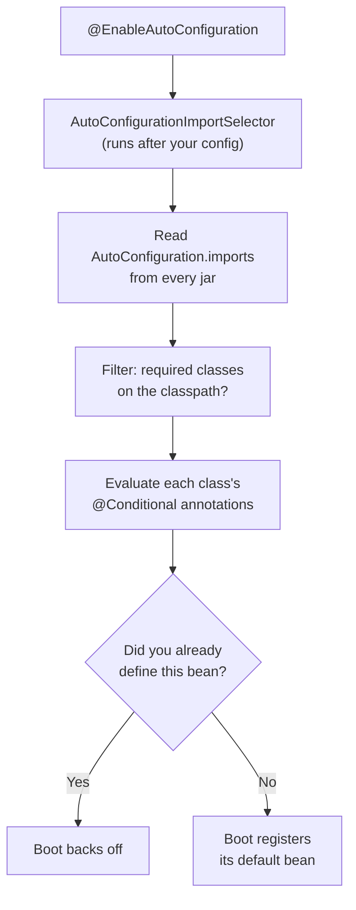
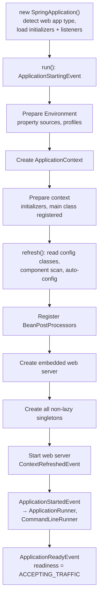
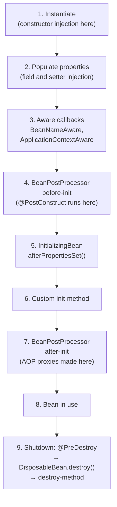
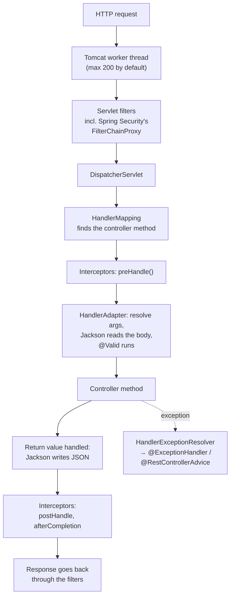

# Spring Boot — Interview Q&A

Short answers first. A question gets more depth only when interviewers usually go
deeper on it. The weight marks say how much.

Version facts were checked against the jars and BOMs in the local Maven repository:
Spring Boot 3.5.7 (Spring Framework 6.2.12) and Spring Boot 4.0.3 (Spring Framework
7.0.5).

Related notes, with longer answers on some topics:
[Spring_Boot_QA.md](../05-Spring-Microservices/notes/Spring_Boot_QA.md) (property
sources demo, auto-configuration, Boot 3 changes) ·
[Spring_Transaction_Management.md](../05-Spring-Microservices/notes/Spring_Transaction_Management.md) ·
[Spring_Security_QA.md](../05-Spring-Microservices/notes/Spring_Security_QA.md) ·
[01_Spring_AOP_QA.md](01_Spring_AOP_QA.md) · [03_JPA_Spring_Data_QA.md](03_JPA_Spring_Data_QA.md)

## Weight legend

| Mark | What it means | How the answer is written |
| --- | --- | --- |
| ★★★ | Asked in almost every Java backend round, with follow-ups | Answer, mechanism, code, traps |
| ★★ | Asked often | Answer and one example or table |
| ★ | Occasional, or a senior-level bonus | Two to four lines |

## Contents

| # | Question | Weight | One-line answer |
| --- | --- | --- | --- |
| 1 | [Boot vs Spring](#1-what-is-spring-boot-and-how-is-it-different-from-spring) | ★★★ | Spring with defaults: starters, auto-config, embedded server |
| 2 | [@SpringBootApplication](#2-what-does-springbootapplication-do) | ★★★ | Configuration + auto-configuration + component scan |
| 3 | [Auto-configuration](#3-how-does-auto-configuration-work) | ★★★ | Imports file → conditions → backs off if you define the bean |
| 4 | [Conditional annotations](#4-conditional-annotations) | ★★ | OnClass, OnMissingBean, OnProperty… |
| 5 | [Override or exclude](#5-overriding-or-excluding-auto-configuration) | ★★ | Properties, then customizers, then your own bean, then exclude |
| 6 | [Starters](#6-starters-and-dependency-management) | ★★ | Dependency bundles with versions from one BOM |
| 7 | [Custom starter](#7-writing-a-custom-starter) | ★★ | Auto-config module + starter POM + imports file |
| 8 | [Startup sequence](#8-what-happens-at-startup) | ★★★ | Environment → context → refresh → runners → ready |
| 9 | [Bean lifecycle](#9-bean-lifecycle) | ★★★ | Construct → inject → init → proxy → use → destroy |
| 10 | [Bean scopes](#10-bean-scopes-and-the-prototype-in-singleton-problem) | ★★ | Prototype in a singleton is created only once |
| 11 | [DI styles, circular deps](#11-dependency-injection-styles-and-circular-dependencies) | ★★★ | Constructor injection; cycles fail by default |
| 12 | [Same-type beans](#12-several-beans-of-the-same-type) | ★★ | `@Primary`, `@Qualifier`, or inject a `Map` |
| 13 | [Config precedence](#13-externalized-configuration-and-precedence) | ★★★ | Command line > system props > env vars > files |
| 14 | [@Value vs @ConfigurationProperties](#14-value-vs-configurationproperties) | ★★ | One value vs a typed, validated group |
| 15 | [Profiles](#15-profiles) | ★★ | Environment differences, not feature flags |
| 16 | [Request flow](#16-how-a-request-flows-through-a-spring-mvc-app) | ★★★ | Filters → DispatcherServlet → handler → converters |
| 17 | [Exception handling](#17-global-exception-handling-and-problemdetail) | ★★★ | `@RestControllerAdvice` returning `ProblemDetail` |
| 18 | [Validation](#18-validation) | ★★ | `@Valid` on the body → 400 |
| 19 | [@Transactional essentials](#19-transactional-essentials) | ★★★ | Proxy, rollback rules, rollback-only trap |
| 20 | [@Async](#20-async-methods-and-thread-pools) | ★★ | Default pool has an unbounded queue; context doesn't follow |
| 21 | [Caching](#21-caching) | ★★ | `@Cacheable` + a real provider with TTL |
| 22 | [@Scheduled on many instances](#22-scheduled-jobs-with-several-instances) | ★★ | Runs on every pod — use ShedLock or move it out |
| 23 | [Actuator, probes](#23-actuator-and-health-probes) | ★★★ | Liveness must not check the database |
| 24 | [Server threads, virtual threads](#24-embedded-server-threads-and-virtual-threads) | ★★ | 200 Tomcat threads; virtual threads move the limit to the DB pool |
| 25 | [Graceful shutdown](#25-graceful-shutdown) | ★★ | Default in 3.5.7; add a preStop sleep on Kubernetes |
| 26 | [Logging, tracing](#26-logging-and-tracing) | ★★ | Logback, runtime levels, trace ids in MDC |
| 27 | [Testing](#27-testing) | ★★★ | Slices, `@MockitoBean`, Testcontainers |
| 28 | [HTTP clients](#28-http-clients) | ★★ | RestClient for new blocking code; always set timeouts |
| 29 | [Application events](#29-application-events) | ★★ | `AFTER_COMMIT` listeners; outbox for reliability |
| 30 | [Startup time, memory](#30-startup-time-and-memory) | ★ | Lazy init, CDS, native image |
| 31 | [Boot 3 and Boot 4 changes](#31-what-changed-in-boot-3-and-boot-4) | ★★ | Jakarta + Java 17; then modular auto-config, Hibernate 7 |

---

## 1. What is Spring Boot, and how is it different from Spring?

**Weight:** ★★★

**Background:** the Spring Framework is a dependency-injection container plus modules
(MVC, Data, Security, transactions). Building an application with it alone means many
decisions: which library versions work together, which infrastructure beans to define
(`DataSource`, `EntityManagerFactory`, `DispatcherServlet`, Jackson's `ObjectMapper`),
and which server to deploy a WAR to.

**Answer:** Spring Boot is an opinionated layer on top of Spring that makes those
decisions for you, and lets you override any of them. It does not replace Spring —
every Boot application is a Spring application.

| Boot feature | What it saves you from |
| --- | --- |
| Starters | Choosing compatible library versions |
| Auto-configuration | Writing infrastructure `@Bean` definitions |
| Embedded server | Installing a server and deploying a WAR — the app is `java -jar app.jar` |
| Externalized configuration | Hard-coding per-environment settings |
| Actuator | Building health, metrics and diagnostics endpoints |
| Executable and layered jars | Packaging work, and slow container image rebuilds |

---

## 2. What does SpringBootApplication do?

**Weight:** ★★★

`@SpringBootApplication` = three annotations:

| Annotation | Effect |
| --- | --- |
| `@SpringBootConfiguration` | Marks the class as a `@Configuration` |
| `@EnableAutoConfiguration` | Turns on auto-configuration (Q3) |
| `@ComponentScan` | Scans this class's package **and everything below it** |

**Traps:**

- If the main class sits in `com.shop.app`, beans in `com.shop.order` are **not**
  scanned → `NoSuchBeanDefinitionException`. Put the main class in the root package.
- Entities and repositories are found from the same package. Override with
  `@EntityScan` and `@EnableJpaRepositories` only when you must.
- Switch off one auto-configuration with
  `@SpringBootApplication(exclude = DataSourceAutoConfiguration.class)`.

---

## 3. How does auto-configuration work?

**Weight:** ★★★

**Mechanism:**

1. `@EnableAutoConfiguration` imports `AutoConfigurationImportSelector`. It is a
   `DeferredImportSelector`, so it runs **after** your own `@Configuration` classes.
2. It reads candidate class names from
   `META-INF/spring/org.springframework.boot.autoconfigure.AutoConfiguration.imports`
   in every jar. (Boot 2.7 introduced this file; Boot 3 stopped reading
   auto-configurations from `spring.factories`.)
3. Cheap checks such as "is this class on the classpath?" filter the list early.
4. Each remaining `@AutoConfiguration` class is evaluated. Its `@Conditional...`
   annotations decide whether its beans are registered.
5. Most beans carry `@ConditionalOnMissingBean`, so if you defined that bean yourself,
   Boot **backs off**.



A simplified illustration of the pattern:

```java
@AutoConfiguration
@ConditionalOnClass(ObjectMapper.class)          // Jackson on the classpath?
public class JacksonLikeAutoConfiguration {

    @Bean
    @ConditionalOnMissingBean                    // you didn't define one?
    ObjectMapper objectMapper() {
        return new ObjectMapper();
    }
}
```

**How to see what happened:** start with `--debug` (or `debug=true`) to print the
*condition evaluation report* — which auto-configurations matched and why the others
didn't. With Actuator: `/actuator/conditions`.

**Boot 4 change:** auto-configuration is split into per-technology modules. For
example `DataSourceAutoConfiguration` moved from `spring-boot-autoconfigure`
(`org.springframework.boot.autoconfigure.jdbc`) to `spring-boot-jdbc`
(`org.springframework.boot.jdbc.autoconfigure`) — checked in the 3.5.7 and 4.0.3
jars. Code that excludes auto-configurations by class must update its imports.

---

## 4. Conditional annotations

**Weight:** ★★

| Annotation | Registers the bean when… |
| --- | --- |
| `@ConditionalOnClass` / `@ConditionalOnMissingClass` | A class is / isn't on the classpath |
| `@ConditionalOnBean` / `@ConditionalOnMissingBean` | A bean of that type exists / doesn't |
| `@ConditionalOnProperty(name = "feature.x.enabled", havingValue = "true")` | A property has a value (`matchIfMissing` for the default) |
| `@ConditionalOnWebApplication` / `@ConditionalOnNotWebApplication` | It is / isn't a web application |
| `@ConditionalOnSingleCandidate` | Exactly one candidate bean exists (or one is `@Primary`) |
| `@ConditionalOnResource` | A resource file exists |
| `@ConditionalOnCloudPlatform` | Running on Kubernetes, Cloud Foundry, etc. |
| `@ConditionalOnExpression` | A SpEL expression is true |
| `@Profile` (core Spring) | A profile is active |

**Trap:** `@ConditionalOnBean` and `@ConditionalOnMissingBean` depend on the order in
which beans are registered. They are reliable in auto-configuration classes (which run
after yours), but unreliable inside your own `@Configuration` classes.

---

## 5. Overriding or excluding auto-configuration

**Weight:** ★★ — prefer the least invasive option.

1. **Properties first.** Most behaviour is tunable: `spring.jackson.*`,
   `spring.datasource.hikari.*`, `server.tomcat.*`.
2. **Customizer beans** keep Boot's default and adjust it — for example
   `WebServerFactoryCustomizer<TomcatServletWebServerFactory>`, `RestClientCustomizer`,
   `HibernatePropertiesCustomizer`.
3. **Your own bean** of the same type — Boot's `@ConditionalOnMissingBean` backs off.
   You now own all of its configuration.
4. **Exclude** the auto-configuration:
   `@SpringBootApplication(exclude = ...)` or `spring.autoconfigure.exclude=...`.

---

## 6. Starters and dependency management

**Weight:** ★★

- A **starter** is a POM with no code that pulls in a working set of libraries.
  `spring-boot-starter-web` brings Spring MVC, Jackson, embedded Tomcat and logging.
- **Versions** come from the `spring-boot-dependencies` BOM, through
  `spring-boot-starter-parent` or an imported `<dependencyManagement>`. You leave
  versions out, and override one (`<hibernate.version>`) only when you must.
- The parent POM also configures plugins: compiling with `-parameters`, resource
  filtering, and repackaging into an executable jar.
- `mvn dependency:tree` shows what a starter actually brought in.

**Boot 4 changes (checked in the 3.5.7 and 4.0.3 BOMs):**

| Boot 3.5 | Boot 4.0 |
| --- | --- |
| `spring-boot-starter-aop` | `spring-boot-starter-aspectj` |
| `spring-boot-starter-web` | `spring-boot-starter-webmvc` added (`-web` still listed) |
| `spring-boot-starter-undertow` | Removed — not in the 4.0.3 BOM |

---

## 7. Writing a custom starter

**Weight:** ★★

**Layout:**

```text
acme-audit-spring-boot-autoconfigure/
    AuditAutoConfiguration.java
    AuditProperties.java
    META-INF/spring/org.springframework.boot.autoconfigure.AutoConfiguration.imports
acme-audit-spring-boot-starter/          ← POM only: depends on the module above
```

```java
@AutoConfiguration
@ConditionalOnClass(AuditClient.class)
@ConditionalOnProperty(prefix = "acme.audit", name = "enabled", matchIfMissing = true)
@EnableConfigurationProperties(AuditProperties.class)
public class AuditAutoConfiguration {

    @Bean
    @ConditionalOnMissingBean
    AuditClient auditClient(AuditProperties props) {
        return new AuditClient(props.endpoint(), props.timeout());
    }
}
```

The imports file holds one line per class: `com.acme.audit.AuditAutoConfiguration`.

**Rules:**

- Name it `acme-…-spring-boot-starter`. The `spring-boot-starter-*` prefix is reserved
  for Spring Boot's own starters.
- Always `@ConditionalOnMissingBean`, so users can replace your bean.
- Never `@ComponentScan` from an auto-configuration.
- Add `spring-boot-configuration-processor` so IDEs autocomplete your properties.
- Test with `ApplicationContextRunner` — fast, no full application:

```java
new ApplicationContextRunner()
        .withConfiguration(AutoConfigurations.of(AuditAutoConfiguration.class))
        .withPropertyValues("acme.audit.enabled=false")
        .run(ctx -> assertThat(ctx).doesNotHaveBean(AuditClient.class));
```

---

## 8. What happens at startup

**Weight:** ★★★



**Inside `refresh()`, in words:**

1. `BeanFactoryPostProcessor`s run. The key one, `ConfigurationClassPostProcessor`,
   reads `@Configuration` classes, does the component scan, processes `@Import`, and
   selects auto-configurations. The result is bean **definitions**, not beans yet.
2. `BeanPostProcessor`s are registered: autowiring, `@PostConstruct`, the AOP proxy
   creator and others.
3. `onRefresh()` creates the embedded web server.
4. Every non-lazy singleton is created (lifecycle in Q9).
5. The web server starts accepting requests.

If anything fails, an `ApplicationFailedEvent` is published and Boot's *failure
analyzers* print a readable explanation ("Port 8080 was already in use…").

| You need to… | Hook |
| --- | --- |
| Change the Environment before the context exists | `EnvironmentPostProcessor` |
| Add or change bean definitions | `BeanFactoryPostProcessor` / `BeanDefinitionRegistryPostProcessor` |
| Wrap or modify beans | `BeanPostProcessor` |
| Run code once the app is up | `ApplicationRunner`, or `@EventListener(ApplicationReadyEvent.class)` |

---

## 9. Bean lifecycle

**Weight:** ★★★



**What interviewers follow up with:**

- **Init order:** `@PostConstruct` → `afterPropertiesSet()` → custom init method.
- `@PostConstruct` runs on the raw object **before** the proxy exists, so
  `@Transactional` and other proxy-based annotations don't apply inside it
  ([AOP Q10](01_Spring_AOP_QA.md#10-self-invocation-why-the-annotation-is-ignored)).
- Spring does **not** call destroy callbacks on prototype beans — the caller owns them.

---

## 10. Bean scopes and the prototype-in-singleton problem

**Weight:** ★★

| Scope | One instance per… |
| --- | --- |
| `singleton` (default) | Container |
| `prototype` | Every injection or lookup |
| `request` | HTTP request |
| `session` | HTTP session |
| `application` | `ServletContext` |
| `websocket` | WebSocket session |

- Singletons are shared by all request threads. They must be stateless — no
  per-request data in fields.
- **The trap:** a prototype bean injected into a singleton is created **once**, when
  the singleton is built. It behaves like a singleton.
- **Fix:** ask for a new instance each time with `ObjectProvider`:

```java
@Service
public class ReportService {

    private final ObjectProvider<ReportBuilder> builders;   // ReportBuilder is prototype

    public ReportService(ObjectProvider<ReportBuilder> builders) {
        this.builders = builders;
    }

    public Report build(ReportRequest req) {
        ReportBuilder builder = builders.getObject();       // new instance each call
        return builder.build(req);
    }
}
```

Alternatives: a `@Lookup` method, or a scoped proxy. Request- and session-scoped beans
injected into singletons need a scoped proxy; `@RequestScope` sets one up by default.

---

## 11. Dependency injection styles and circular dependencies

**Weight:** ★★★

**Why constructor injection:**

- Fields can be `final` — immutable and safely published to other threads.
- The object can't exist without its dependencies — no half-built beans.
- Plain unit tests: `new OrderService(mockRepository)`, no Spring, no reflection.
- A constructor with eight parameters is a visible sign the class does too much.
- Circular dependencies fail fast, at startup.

With a single constructor, `@Autowired` isn't needed. **Field injection** hides
dependencies and needs reflection to test. **Setter injection** is for genuinely
optional dependencies.

**Circular dependencies:** A needs B and B needs A.

- With constructor injection, startup fails with `BeanCurrentlyInCreationException`.
- Since Boot 2.6, cycles are refused even with field injection:
  `spring.main.allow-circular-references` defaults to `false` (checked in the 3.5.7
  metadata).

**Fixes, best first:**

1. **Redesign:** move the shared logic into a third bean C that both use, or replace
   one direction with an application event.
2. `@Lazy` on one injection point — injects a proxy and resolves the bean on first use.
3. Setting `allow-circular-references=true` — a last resort.

**Senior point:** a cycle is a design smell. Two services that need each other are
either one service, or are missing a third.

---

## 12. Several beans of the same type

**Weight:** ★★

Error:
`NoUniqueBeanDefinitionException: expected single matching bean but found 2: stripeGateway,razorpayGateway`.

- `@Primary` — the default choice when nothing else is specified.
- `@Qualifier("razorpayGateway")` at the injection point (or a custom qualifier
  annotation).
- Inject all of them as `List<PaymentGateway>` (ordered by `@Order`) or
  `Map<String, PaymentGateway>` (bean name → bean). This is a clean strategy pattern:

```java
@Service
public class PaymentRouter {

    private final Map<String, PaymentGateway> gateways;

    public PaymentRouter(Map<String, PaymentGateway> gateways) {
        this.gateways = gateways;
    }

    public PaymentResult pay(String provider, Payment payment) {
        PaymentGateway gateway = gateways.get(provider + "Gateway");
        if (gateway == null) throw new UnsupportedProviderException(provider);
        return gateway.charge(payment);
    }
}
```

---

## 13. Externalized configuration and precedence

**Weight:** ★★★

**Highest priority first** (the ones interviewers ask about):

| # | Source | Example |
| --- | --- | --- |
| 1 | Test properties | `@TestPropertySource`, `@DynamicPropertySource`, `@SpringBootTest(properties = …)` |
| 2 | Command-line arguments | `--server.port=9090` |
| 3 | `SPRING_APPLICATION_JSON` | `{"server":{"port":9090}}` |
| 4 | Java system properties | `-Dserver.port=9090` |
| 5 | OS environment variables | `SERVER_PORT=9090` |
| 6 | Config files (order below) | `application.yml` |
| 7 | `@PropertySource` on a config class | `@PropertySource("classpath:extra.properties")` |
| 8 | Default properties | `SpringApplication.setDefaultProperties(..)` |

**Config files, highest first:** external profile-specific → external → packaged
profile-specific → packaged. Two rules: **profile-specific beats plain**, and
**outside the jar beats inside the jar**.

- Locations searched: classpath root, classpath `/config`, the current directory,
  `./config/`, `./config/*/`.
- `spring.config.import` pulls in more files; `optional:` makes one optional;
  `configtree:` reads Kubernetes-mounted secrets.
- **Relaxed binding:** `spring.datasource.url` = `SPRING_DATASOURCE_URL` as an
  environment variable.
- **Secrets** never go in a committed `application.yml`. Use environment variables,
  Kubernetes Secrets, or Vault / AWS Secrets Manager.

Worked demo of each source:
[Spring_Boot_QA.md Q1](../05-Spring-Microservices/notes/Spring_Boot_QA.md#1-where-can-serverport-be-set-and-which-property-source-wins).

---

## 14. Value vs ConfigurationProperties

**Weight:** ★★

| | `@Value("${app.timeout:5s}")` | `@ConfigurationProperties(prefix = "app")` |
| --- | --- | --- |
| Granularity | One value | A typed group (class or record) |
| Relaxed binding | Limited | Full |
| Validation | No | `@Validated` + Bean Validation annotations |
| SpEL | Yes | No |
| IDE autocomplete | No | Yes, with the configuration processor |
| Use for | A one-off value | Anything with more than one related setting |

```java
@Validated
@ConfigurationProperties(prefix = "payment")
public record PaymentProperties(
        @NotBlank String baseUrl,
        @NotNull Duration timeout,          // "5s", "500ms" in YAML
        @Min(1) int maxRetries) {}
```

Register it with `@ConfigurationPropertiesScan` or
`@EnableConfigurationProperties(PaymentProperties.class)`. A missing or invalid value
then fails at startup, not at 2 a.m. More:
[Spring_Boot_QA.md Q5](../05-Spring-Microservices/notes/Spring_Boot_QA.md#5-value-vs-configurationproperties-and-relaxed-binding).

---

## 15. Profiles

**Weight:** ★★

- **Activate:** `spring.profiles.active=prod` — as a property, the
  `SPRING_PROFILES_ACTIVE` environment variable, or `--spring.profiles.active=prod`.
- **Files:** `application-prod.yml` overrides `application.yml`.
- **Beans:** `@Profile("prod")`, `@Profile("!prod")`.
- **One YAML file, several documents:** separate with `---` and add
  `spring.config.activate.on-profile: prod`.
- **Groups:** `spring.profiles.group.prod=prod-db,prod-mq`.
- `spring.profiles.active` can't be set inside a profile-specific file — Boot fails.

**Senior point:** use profiles for *environment* differences. Feature switches belong
in properties, not in a profile per feature. Ideally the same image runs everywhere,
with differences supplied through environment variables.

---

## 16. How a request flows through a Spring MVC app

**Weight:** ★★★



**Where to put what:**

| Concern | Place |
| --- | --- |
| Authentication, CORS, correlation id, request logging | Servlet filter (Spring Security is a filter) |
| Checks that need to know the controller method | `HandlerInterceptor` |
| Error responses | `@RestControllerAdvice` |
| Wrapping or changing every response body | `ResponseBodyAdvice` |

**Trap:** for `@ResponseBody` / `ResponseEntity` methods, the body is written
**before** `postHandle()` runs. Changing the response in `postHandle()` does nothing.
Use `ResponseBodyAdvice` instead.

---

## 17. Global exception handling and ProblemDetail

**Weight:** ★★★

```java
@RestControllerAdvice
public class ApiExceptionHandler extends ResponseEntityExceptionHandler {

    @ExceptionHandler(OrderNotFoundException.class)
    ProblemDetail notFound(OrderNotFoundException ex) {
        ProblemDetail pd = ProblemDetail.forStatusAndDetail(
                HttpStatus.NOT_FOUND, ex.getMessage());
        pd.setTitle("Order not found");
        pd.setProperty("orderId", ex.orderId());
        return pd;
    }

    @ExceptionHandler(ObjectOptimisticLockingFailureException.class)
    ProblemDetail conflict(ObjectOptimisticLockingFailureException ex) {
        return ProblemDetail.forStatusAndDetail(HttpStatus.CONFLICT,
                "The order was changed by someone else. Reload and try again.");
    }
}
```

- `ProblemDetail` (Spring 6) is the standard error body from RFC 9457 (which replaced
  RFC 7807): `type`, `title`, `status`, `detail`, `instance`, plus your own fields.
  Content type `application/problem+json`.
- Extending `ResponseEntityExceptionHandler` makes Spring MVC's own errors — bad JSON,
  wrong method, unsupported media type, validation — come out as `ProblemDetail` too.
  Or set `spring.mvc.problemdetails.enabled=true`.
- The most specific `@ExceptionHandler` wins. With several advice classes, order them
  with `@Order` or scope them with `basePackages`.
- Never put stack traces or SQL in `detail`. Log them server-side and return a
  correlation id the client can quote.
- Simpler options: `@ResponseStatus` on the exception class, or throwing
  `ResponseStatusException`.

---

## 18. Validation

**Weight:** ★★

- Add `spring-boot-starter-validation` (Hibernate Validator). The web starter has not
  included it since Boot 2.3.
- `@Valid @RequestBody CreateOrderRequest req` → on failure,
  `MethodArgumentNotValidException` → 400.
- Constraints directly on controller parameters (`@Min(1) @PathVariable long id`):
  Spring 6.1+ validates them itself and throws `HandlerMethodValidationException`.
- On service classes, put `@Validated` on the class; failures throw
  `ConstraintViolationException`.
- Nested objects need `@Valid` on the field; list elements need `List<@Valid Item>`.
- Different rules for create and update: validation groups with
  `@Validated(OnCreate.class)`.
- Custom rule: an annotation plus a `ConstraintValidator<A, T>` implementation.

`@Valid` vs `@Validated` in detail:
[Interview Memory Part 1, Q4](../07-Interview-QA-Memory/Interview_Memory_QA_Part1.md#4-valid-vs-validated).

---

## 19. Transactional essentials

**Weight:** ★★★

- **It is a proxy** — self-invocation and private methods get no transaction
  ([AOP Q10](01_Spring_AOP_QA.md#10-self-invocation-why-the-annotation-is-ignored)).
  Since Spring 6, protected and package-private methods are transactional on
  class-based (CGLIB) proxies.
- **Rollback rules:** by default, rollback only for unchecked exceptions
  (`RuntimeException`) and `Error`. A **checked exception commits**. Change it with
  `rollbackFor = Exception.class`.
- **Propagation:** the default `REQUIRED` joins an existing transaction or starts one.
  `REQUIRES_NEW` suspends the outer one and runs independently — useful for audit rows
  that must survive a rollback. It needs a **second** connection, so a small pool can
  deadlock under load.

**The rollback-only trap:**

```java
@Transactional
public void placeOrder(Order order) {
    orderRepository.save(order);
    try {
        loyaltyService.addPoints(order);    // @Transactional (REQUIRED) and throws
    } catch (RuntimeException e) {
        log.warn("Points failed", e);       // swallowed, but the shared tx is now
    }                                       // marked rollback-only
}   // commit → UnexpectedRollbackException; the order is NOT saved
```

Why: the inner method joined the same transaction. Its exception marked the whole
transaction rollback-only. Catching the exception doesn't undo the mark. Fix: make
`addPoints` `REQUIRES_NEW` if it is truly independent, or don't catch, or use
`noRollbackFor` on the inner method.

- **Keep transactions short.** No HTTP calls or Kafka sends inside — they hold a
  database connection, and a remote side effect can't be rolled back. Use the outbox
  pattern or `@TransactionalEventListener` (Q29).
- Full detail: [Spring_Transaction_Management.md](../05-Spring-Microservices/notes/Spring_Transaction_Management.md).

---

## 20. Async methods and thread pools

**Weight:** ★★

- `@EnableAsync`; call the method **from another bean**; return `void` or
  `CompletableFuture<T>`.
- **Default executor:** Boot auto-configures `applicationTaskExecutor`, a
  `ThreadPoolTaskExecutor` with core size 8 (checked: `spring.task.execution.pool.core-size`
  defaults to 8). The queue capacity and max size default to `Integer.MAX_VALUE`, so
  the pool **never grows past 8** — the queue just grows until memory runs out under
  overload.
- **Fix:** set `spring.task.execution.pool.queue-capacity` and `max-size`, or define a
  named executor per workload and use `@Async("reportExecutor")`.
- With `spring.threads.virtual.enabled=true` (Java 21+), Boot uses a
  `SimpleAsyncTaskExecutor` on virtual threads instead.
- **Exceptions:** a returned future completes exceptionally. For `void` methods they go
  to `AsyncUncaughtExceptionHandler` — by default just logged, easy to miss.
- **Context does not follow the thread.** The transaction, `SecurityContext`, MDC (log
  trace ids) and request scope are thread-bound. Copy them with a `TaskDecorator`
  (Boot applies a `TaskDecorator` bean to its executor) or
  `DelegatingSecurityContextAsyncTaskExecutor`.

---

## 21. Caching

**Weight:** ★★

```java
@Cacheable(cacheNames = "products", key = "#id")
public ProductView get(long id) { ... }

@CachePut(cacheNames = "products", key = "#result.id")
public ProductView update(UpdateProduct cmd) { ... }

@CacheEvict(cacheNames = "products", key = "#id")
public void delete(long id) { ... }
```

- `@EnableCaching`. The provider is auto-detected: Caffeine, Redis, JCache… The
  fallback is a plain `ConcurrentHashMap` — no TTL, no size limit, not for production.
- TTL and size are **provider** settings:
  `spring.cache.caffeine.spec=maximumSize=10000,expireAfterWrite=10m` or
  `spring.cache.redis.time-to-live=10m`.
- `sync = true` — only one thread loads a missing key, the others wait. Protects
  against a stampede (per instance only).
- Cache DTOs or immutable values, not JPA entities — a cached entity is detached and
  its lazy fields fail.
- **Local vs distributed:** Caffeine is fastest but each instance has its own copy.
  Redis is shared but costs a network hop.
- The hard part is invalidation: evict on write, and keep a TTL as a safety net.

---

## 22. Scheduled jobs with several instances

**Weight:** ★★

- `@EnableScheduling` + `@Scheduled(cron = "0 0 2 * * *", zone = "Asia/Kolkata")`,
  `fixedRate` or `fixedDelay`.
- The default scheduler has **one thread** — one slow job delays every other job. Raise
  `spring.task.scheduling.pool.size`.
- **With 3 replicas, the job runs 3 times.** Options:

| Option | How it works |
| --- | --- |
| ShedLock | `@SchedulerLock(name = "nightlyReport", lockAtMostFor = "30m")` — a lock row in the DB or Redis; other instances skip |
| Quartz in cluster mode | A JDBC job store; one node fires each trigger |
| Kubernetes CronJob | Move the job out of the service |
| Leader election | Only the leader instance runs jobs |

Make jobs idempotent anyway — a lock can expire mid-run.

---

## 23. Actuator and health probes

**Weight:** ★★★

- Add `spring-boot-starter-actuator`. Useful endpoints: `health`, `info`, `metrics`,
  `prometheus`, `loggers` (change log levels at runtime), `env`, `configprops`,
  `beans`, `conditions`, `mappings`, `threaddump`, `heapdump`, `scheduledtasks`.
- **Over HTTP, only `health` is exposed by default.** Add others with
  `management.endpoints.web.exposure.include=health,info,prometheus`.
- **Security:** never expose `env`, `configprops` or `heapdump` publicly — they can
  leak secrets. Put Actuator on a separate port (`management.server.port`) that the
  ingress doesn't route, and protect it with Spring Security.

**Kubernetes probes:** `/actuator/health/liveness` and `/actuator/health/readiness`
(on automatically on Kubernetes; elsewhere set
`management.endpoint.health.probes.enabled=true`).

| Probe | Question it answers | Failing it means | Should include the DB? |
| --- | --- | --- | --- |
| Liveness | Is the process stuck? | Kubernetes **restarts** the pod | **No** — a DB outage would restart every pod |
| Readiness | Can it take traffic now? | The pod is **removed** from the load balancer | Yes, if the app is useless without it |

**Custom health check:**

```java
@Component
class PaymentGatewayHealth implements HealthIndicator {

    private final PaymentGatewayClient gateway;

    PaymentGatewayHealth(PaymentGatewayClient gateway) { this.gateway = gateway; }

    @Override
    public Health health() {
        return gateway.ping()
                ? Health.up().build()
                : Health.down().withDetail("gateway", "unreachable").build();
    }
}
```

**Metrics and tracing:** Micrometer provides JVM, HTTP (`http.server.requests`) and
Hikari pool metrics, plus your own `Counter` and `Timer`. Micrometer Tracing
(OpenTelemetry or Brave) handles distributed traces.

---

## 24. Embedded server, threads and virtual threads

**Weight:** ★★

- **Server:** Tomcat by default. For Jetty, exclude `spring-boot-starter-tomcat` and
  add `spring-boot-starter-jetty`. Undertow is supported in Boot 3 but is not in the
  Boot 4.0.3 BOM.
- **Thread per request:** `server.tomcat.threads.max` defaults to 200 (checked in the
  3.5.7 metadata). Each request holds a thread while it waits on the DB or HTTP calls.
- **Capacity, roughly:** 200 threads ÷ 0.1 s per request ≈ 2,000 requests/s. If a
  downstream slows to 2 s per call, that drops to about 100 requests/s — requests
  queue and time out.

**Virtual threads** (Java 21, Boot 3.2+): `spring.threads.virtual.enabled=true`.

- Each request runs on a virtual thread; blocking costs almost nothing, so the thread
  count stops being the limit.
- The **database connection pool** becomes the limit instead. Size it deliberately and
  set timeouts.
- Before Java 24, blocking inside `synchronized` pinned the carrier thread. JEP 491 in
  Java 24 removed that.

**WebFlux** (non-blocking end to end, Netty, R2DBC) is still the choice for streaming
and very high fan-out. For most "we need more concurrency" problems, virtual threads
give it with simpler blocking code.

---

## 25. Graceful shutdown

**Weight:** ★★

- `server.shutdown=graceful` is the default in Boot 3.5.7 (checked in the metadata).
  Older versions defaulted to `immediate`.
- On SIGTERM: stop accepting new requests, let in-flight requests finish for up to
  `spring.lifecycle.timeout-per-shutdown-phase` (default 30 s), then close the context
  (`@PreDestroy`, pools, Kafka consumers).
- **Kubernetes:** the pod is removed from the Service endpoints *asynchronously*, so
  traffic can still arrive after SIGTERM. Add a `preStop` hook that sleeps 5–10 s, and
  set `terminationGracePeriodSeconds` larger than preStop + shutdown timeout.

---

## 26. Logging and tracing

**Weight:** ★★

- Default: SLF4J + Logback. Set levels with `logging.level.com.shop=DEBUG`. Use
  `logback-spring.xml` for profile-specific config (`<springProfile>`).
- **Change a level at runtime:**
  `POST /actuator/loggers/com.shop` with body `{"configuredLevel":"DEBUG"}`.
- **Structured JSON logs:** `logging.structured.format.console=ecs` (or `logstash`,
  `gelf`); the property exists in Boot 3.5.7.
- **Correlation:** Micrometer Tracing puts `traceId` and `spanId` into the MDC and
  passes them on over HTTP (`traceparent` header) and Kafka headers, so one request
  can be followed across services.
- **Don'ts:** no personal data or secrets in logs; no INFO logging inside hot loops; no
  string concatenation (`log.debug("x " + y)` builds the string even when DEBUG is
  off — use `{}` placeholders).

---

## 27. Testing

**Weight:** ★★★

| Annotation | Loads | Use for |
| --- | --- | --- |
| `@SpringBootTest` | The full context (a real server with `webEnvironment = RANDOM_PORT`) | Integration and end-to-end tests |
| `@WebMvcTest(OrderController.class)` | MVC only: controllers, advice, filters, converters | Controller, JSON, validation, error mapping |
| `@DataJpaTest` | JPA only: entities, repositories, DataSource; each test rolls back | Queries and mappings |
| `@JsonTest` | Jackson only | Serialization format |
| `@RestClientTest` | REST client + `MockRestServiceServer` | HTTP client code |

- **Mocks:** `@MockitoBean` and `@MockitoSpyBean` (Spring Framework 6.2+). The old
  `@MockBean` is gone in Boot 4 (checked: absent from the 4.0.3 `spring-boot-test`
  jar, present in 3.5.7).
- **Real database:** Testcontainers + `@ServiceConnection` (Boot 3.1+) — Boot reads
  the container's URL and credentials, no properties to wire:

```java
@SpringBootTest
@Testcontainers
class OrderRepositoryIT {

    @Container
    @ServiceConnection
    static PostgreSQLContainer<?> postgres = new PostgreSQLContainer<>("postgres:16");
}
```

- `@DataJpaTest` may replace your database with an embedded one. Add
  `@AutoConfigureTestDatabase(replace = Replace.NONE)` to be sure you test against the
  container.
- **Context caching:** Spring reuses a test context across test classes with the same
  configuration. Every different set of `@MockitoBean`s, properties or profiles creates
  a new context — several seconds each. Keep a few shared test configurations.
- **Boot 4:** test slices moved into per-technology test modules, such as
  `spring-boot-webmvc-test` and `spring-boot-data-jpa-test` (artifacts present
  locally).

---

## 28. HTTP clients

**Weight:** ★★

| Client | Style | When |
| --- | --- | --- |
| `RestTemplate` | Blocking, template methods | Existing code; in maintenance mode |
| `WebClient` | Non-blocking, reactive (needs WebFlux) | Reactive apps, streaming |
| `RestClient` (Spring 6.1) | Blocking, fluent API | Default for new blocking code |
| HTTP interface (`@HttpExchange`) | Declarative interface; Spring builds the client | Feign-style clients without Feign |

```java
RestClient client = RestClient.builder()
        .baseUrl("https://payments.internal")
        .requestFactory(requestFactoryWithTimeouts())
        .build();

PaymentStatus status = client.get()
        .uri("/payments/{id}", paymentId)
        .retrieve()
        .body(PaymentStatus.class);
```

- **Always set connect and read timeouts.** Without them a slow dependency holds your
  threads until the pool is exhausted.
- Retry only idempotent calls; add a circuit breaker (Resilience4j) for remote calls.
- Spring 7 adds `@Retryable` and `@ConcurrencyLimit` in the core framework, switched on
  with `@EnableResilientMethods` (checked in `spring-context` 7.0.5).

---

## 29. Application events

**Weight:** ★★

```java
public record OrderPlaced(long orderId) {}

@Service
class OrderService {

    private final OrderRepository orderRepository;
    private final ApplicationEventPublisher events;

    OrderService(OrderRepository orderRepository, ApplicationEventPublisher events) {
        this.orderRepository = orderRepository;
        this.events = events;
    }

    @Transactional
    public void place(Order order) {
        orderRepository.save(order);
        events.publishEvent(new OrderPlaced(order.getId()));
    }
}

@Component
class SendConfirmationEmail {

    @TransactionalEventListener(phase = TransactionPhase.AFTER_COMMIT)
    public void on(OrderPlaced event) {
        emailClient.sendConfirmation(event.orderId());
    }
}
```

| Listener | Runs | Consequence |
| --- | --- | --- |
| `@EventListener` | Immediately, same thread, same transaction | An exception in the listener rolls back the publisher |
| `@TransactionalEventListener(AFTER_COMMIT)` | Only after a successful commit | No email for an order that rolled back |

- Inside an `AFTER_COMMIT` listener the original transaction is already committed.
  Database writes there need `@Transactional(propagation = REQUIRES_NEW)`.
- Add `@Async` so the listener doesn't delay the response.
- **Events are in memory.** If the app crashes after the commit, the event is lost.
  For reliable cross-service events use the **transactional outbox**: write the event
  to a table in the same transaction, and a relay (or Debezium) publishes it to Kafka.
  Spring Modulith's event publication registry does this inside one application.

---

## 30. Startup time and memory

**Weight:** ★

- `spring.main.lazy-initialization=true` — faster startup, but configuration errors
  move to the first request. Mostly for development.
- Remove unused starters; each one brings auto-configurations to evaluate.
- Class Data Sharing (CDS) and GraalVM native images (AOT) cut startup time. Native
  images start in milliseconds and use less memory, at the cost of long builds and
  limits on reflection.
- Measure before tuning: `BufferingApplicationStartup` + `/actuator/startup` shows
  which beans are slow to create.

---

## 31. What changed in Boot 3 and Boot 4

**Weight:** ★★

**Spring Boot 3 (November 2022 onward):**

- Java 17 minimum; Spring Framework 6; `javax.*` → `jakarta.*`; Hibernate 6.
- AOT processing and GraalVM native images.
- Micrometer Observation and Micrometer Tracing (replacing Spring Cloud Sleuth).
- `ProblemDetail` error responses; HTTP interface clients.
- Auto-configurations registered only through `AutoConfiguration.imports`.
- Later 3.x releases: `@ServiceConnection` and Docker Compose support (3.1),
  `RestClient` and virtual threads (3.2), structured logging, `@MockitoBean` replacing
  `@MockBean`.

**Spring Boot 4 (November 2025)** — checked against the local 4.0.3 jars and BOM:

| Area | Boot 3.5.7 | Boot 4.0.3 |
| --- | --- | --- |
| Spring Framework | 6.2.12 | 7.0.5 |
| Hibernate / JPA | 6.6.33 / 3.1 | 7.2.4 / 3.2 |
| Jackson | 2.19.2 | 3.0.4 |
| HikariCP | 6.3.3 | 7.0.2 |
| Minimum Java | 17 | 17 (classes compiled for Java 17) |

- **Modular auto-configuration:** `spring-boot-jdbc`, `spring-boot-hibernate`,
  `spring-boot-webmvc` and others, with new package names (Q3).
- **Starter changes:** `-aop` → `-aspectj`, `-webmvc` added, Undertow dropped (Q6).
- `@MockBean` removed → `@MockitoBean` (Q27).
- `@Retryable` and `@ConcurrencyLimit` in core Spring (Q28).
- Hibernate 7 removed `save`, `update` and `saveOrUpdate`
  ([Hibernate Q24](02_Hibernate_QA.md#24-what-changed-in-hibernate-6-and-7)).
