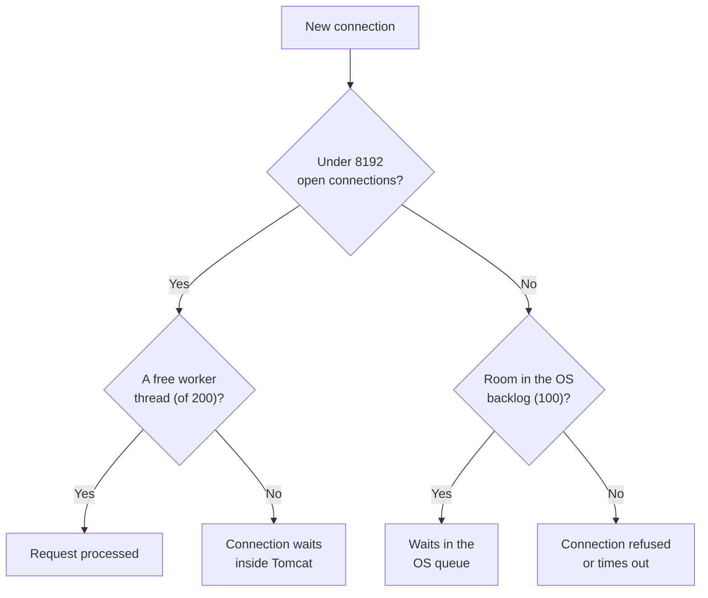

# Spring Boot Web (Spring MVC) — Interview Q&A

This file covers `spring-boot-starter-web` (`spring-boot-starter-webmvc` in Boot 4):
building REST APIs with Spring MVC on embedded Tomcat. The request flow, global
exception handling and validation basics are already in
[04_Spring_Boot_QA.md](04_Spring_Boot_QA.md) (Q16–Q18). This file goes deeper on
everything else an API interview asks.

Version facts were checked against the jars in the local Maven repository: Spring
Boot 3.5.7 / 4.0.3 and Spring Framework 6.2.12 / 7.0.5.

## Weight legend

| Mark | What it means | How the answer is written |
| --- | --- | --- |
| ★★★ | Asked in almost every Java backend round, with follow-ups | Answer, mechanism, code, traps |
| ★★ | Asked often | Answer and one example or table |
| ★ | Occasional, or a senior-level bonus | Two to four lines |

## Contents

| # | Question | Weight | One-line answer |
| --- | --- | --- | --- |
| 1 | [What the starter gives you](#1-what-the-web-starter-gives-you) | ★★ | MVC + Tomcat + Jackson + `/error`, all configured |
| 2 | [@Controller vs @RestController](#2-controller-vs-restcontroller) | ★★★ | `@RestController` = `@Controller` + `@ResponseBody` |
| 3 | [Binding parameters](#3-mapping-requests-and-binding-parameters) | ★★★ | Path, query, body, header — each fails with its own 4xx |
| 4 | [Status codes](#4-responseentity-and-choosing-status-codes) | ★★★ | 201 + Location for create; 409 for conflicts |
| 5 | [PUT, PATCH, POST, idempotency](#5-put-vs-patch-vs-post-and-idempotency) | ★★★ | POST needs an idempotency key to be retry-safe |
| 6 | [Content negotiation](#6-content-negotiation-and-message-converters) | ★★ | `Accept` picks the converter; 406 / 415 when it can't |
| 7 | [Jackson](#7-customizing-json-with-jackson) | ★★★ | Customize Boot's mapper; never `new ObjectMapper()` |
| 8 | [Error handling in depth](#8-error-handling-beyond-controlleradvice) | ★★ | Filter exceptions never reach `@ControllerAdvice` |
| 9 | [CORS](#9-cors) | ★★ | With Spring Security, configure it in the security chain |
| 10 | [Filters and interceptors](#10-registering-filters-and-interceptors) | ★★ | `OncePerRequestFilter`; `FilterRegistrationBean` for URL patterns |
| 11 | [File upload and download](#11-file-upload-and-download) | ★★ | 1MB default limit; stream, don't load into memory |
| 12 | [API versioning](#12-api-versioning) | ★★★ | Built into Spring 7: `@GetMapping(version = "2")` |
| 13 | [Pagination in REST](#13-pagination-and-sorting-in-rest) | ★★ | Don't serialize `PageImpl` directly |
| 14 | [Async and streaming](#14-async-and-streaming-responses) | ★★ | Release the Tomcat thread while waiting |
| 15 | [Tomcat under overload](#15-tomcat-limits-and-what-happens-under-overload) | ★★★ | 200 threads, 8192 connections, 100 backlog |
| 16 | [ETags and HTTP caching](#16-http-caching-with-etags) | ★★ | `If-Match` gives optimistic locking over HTTP |
| 17 | [Testing controllers](#17-testing-controllers) | ★★★ | `@WebMvcTest` + MockMvc + `@MockitoBean` |
| 18 | [OpenAPI documentation](#18-api-documentation-with-openapi) | ★ | springdoc generates spec + Swagger UI |
| 19 | [Rate limiting](#19-rate-limiting) | ★★ | Not built in; gateway, Bucket4j, or Redis counters |
| 20 | [Design an endpoint end to end](#20-designing-a-rest-endpoint-end-to-end) | ★★★ | The checklist a senior answer walks through |

---

## 1. What the web starter gives you

**Weight:** ★★

| Piece | What Boot sets up |
| --- | --- |
| Spring MVC | `DispatcherServlet` mapped to `/` (`spring.mvc.servlet.path=/`) |
| Embedded Tomcat | Port 8080, 200 worker threads (Q15) |
| Jackson | JSON reading and writing for request and response bodies |
| Error handling | A `/error` endpoint: HTML "Whitelabel" page for browsers, JSON for API clients |
| Static content | Files under `classpath:/static`, `/public`, `/resources` served directly |
| Multipart | File upload support, 1MB per file and 10MB per request by default (Q11) |

**Boot 4 note:** the starter is `spring-boot-starter-webmvc`; `spring-boot-starter-web`
is still listed in the 4.0.3 BOM. Jackson moved to version 3 (Q7).

---

## 2. Controller vs RestController

**Weight:** ★★★

- `@Controller` methods return a **view name** by default (`"orders"` → render
  `orders.html` with a template engine).
- `@RestController` = `@Controller` + `@ResponseBody` on every method. The return value
  is written to the response body by a message converter — JSON through Jackson.

```java
@RestController
@RequestMapping("/api/orders")
@RequiredArgsConstructor
public class OrderController {

    private final OrderService orderService;

    @GetMapping("/{id}")
    public OrderView get(@PathVariable long id) {
        return orderService.find(id);          // written as JSON
    }
}
```

**Senior point:** controllers stay thin — translate HTTP to a service call and back.
No business rules, no transactions, no repository calls. That keeps logic testable
without HTTP and reusable from a Kafka listener or a scheduled job.

---

## 3. Mapping requests and binding parameters

**Weight:** ★★★

| Annotation | Reads from | Example |
| --- | --- | --- |
| `@PathVariable` | The URL path | `/orders/{id}` |
| `@RequestParam` | Query string or form field | `?status=OPEN` |
| `@RequestBody` | The body, through a message converter | JSON → `CreateOrder` record |
| `@RequestHeader` | A header | `@RequestHeader("Idempotency-Key") String key` |
| `@CookieValue` | A cookie | `@CookieValue("session") String s` |
| `@ModelAttribute` (or no annotation on an object) | Query/form fields bound to an object's fields | Search filters |
| `Pageable`, `Sort` | `page`, `size`, `sort` parameters | Q13 |

**Defaults that surprise people:**

- `@RequestParam` is **required** by default. Use `required = false`,
  `defaultValue = "…"`, or `Optional<…>`.
- `@RequestBody` on a GET request is not supported in practice — many clients and
  proxies drop GET bodies
  ([Interview Memory Part 1, Q14](../07-Interview-QA-Memory/Interview_Memory_QA_Part1.md#14-controller-method-with-requestbody-pathvariable-and-requestparam)).

**Each binding failure has its own exception and status — know these:**

| What went wrong | Exception | Status |
| --- | --- | --- |
| Required query parameter missing | `MissingServletRequestParameterException` | 400 |
| Wrong type (`?page=abc`) | `MethodArgumentTypeMismatchException` | 400 |
| Malformed JSON body | `HttpMessageNotReadableException` | 400 |
| `@Valid` body fails validation | `MethodArgumentNotValidException` | 400 |
| Wrong `Content-Type` sent | `HttpMediaTypeNotSupportedException` | 415 |
| `Accept` can't be satisfied | `HttpMediaTypeNotAcceptableException` | 406 |
| Wrong HTTP method | `HttpRequestMethodNotSupportedException` | 405 |
| No endpoint for the path (Spring 6.1+) | `NoResourceFoundException` | 404 |

Extending `ResponseEntityExceptionHandler` turns all of these into consistent
`ProblemDetail` responses ([04 Q17](04_Spring_Boot_QA.md#17-global-exception-handling-and-problemdetail)).

---

## 4. ResponseEntity and choosing status codes

**Weight:** ★★★

```java
@PostMapping
public ResponseEntity<OrderView> create(@Valid @RequestBody CreateOrder request) {
    OrderView created = orderService.create(request);
    URI location = ServletUriComponentsBuilder.fromCurrentRequest()
            .path("/{id}")
            .buildAndExpand(created.id())
            .toUri();
    return ResponseEntity.created(location).body(created);   // 201 + Location
}
```

| Situation | Status |
| --- | --- |
| Resource created | **201** + `Location` header |
| Accepted, processed later (async job) | **202** + a link to poll |
| Success with no body (DELETE, some PUTs) | **204** |
| Malformed request or failed validation | **400** (some teams use 422 for valid syntax but invalid content) |
| Not authenticated (no or bad token) | **401** |
| Authenticated but not allowed | **403** |
| Doesn't exist | **404** |
| Conflict: duplicate, wrong state, version mismatch | **409** |
| `If-Match` didn't match (Q16) | **412** |
| Rate limited | **429** + `Retry-After` |
| Bug on our side | **500** |
| A dependency failed or timed out | **502 / 503 / 504** |

**Traps:**

- Returning 200 with `{"error": …}` in the body. Clients, gateways, retries and
  monitoring all rely on the status code.
- `ResponseEntity.of(Optional.of(x))` returns **200**, and only `Optional.empty()`
  gives 404 ([Interview Memory Part 1, Q13](../07-Interview-QA-Memory/Interview_Memory_QA_Part1.md#13-controlleradvice-global-exception-handler-and-orelsethrow-in-the-service)).
- Mixing up 401 and 403: 401 means "who are you?", 403 means "I know who you are,
  and no".

---

## 5. PUT vs PATCH vs POST, and idempotency

**Weight:** ★★★

**Idempotent** means doing it twice has the same effect as doing it once. It matters
because clients, gateways and load balancers **retry** on timeouts.

| Method | Meaning | Idempotent? |
| --- | --- | --- |
| GET | Read | Yes (and safe — no changes) |
| PUT | Replace the whole resource at this URL | Yes |
| DELETE | Remove | Yes (second call → 404 or 204, but the state is the same) |
| PATCH | Change some fields | Not guaranteed (`"qty": +1` style patches aren't) |
| POST | Create, or run an action | **No** |

**The problem with POST:** a client sends "pay ₹500", the response times out, the
client retries — and the customer is charged twice.

**Fix — an idempotency key:**

```java
@PostMapping("/payments")
public ResponseEntity<PaymentView> pay(
        @RequestHeader("Idempotency-Key") String key,
        @Valid @RequestBody PaymentRequest request) {
    return paymentService.payOnce(key, request);
}
```

Inside `payOnce`: store the key with a **unique constraint** in the same transaction
as the payment. If the insert fails because the key exists, return the stored result
of the first call instead of paying again. Keys expire after a retention window
(e.g. 24 hours).

**PATCH formats:** JSON Merge Patch (RFC 7396) — send only the changed fields, `null`
means "remove"; JSON Patch (RFC 6902) — a list of operations
(`[{"op":"replace","path":"/status","value":"PAID"}]`). With a plain DTO you can't
tell "field absent" from "field set to null" — use `JsonNullable`, `Optional`, or
apply the patch to a `JsonNode`.

---

## 6. Content negotiation and message converters

**Weight:** ★★

- An `HttpMessageConverter` turns the body into an object and back. Jackson handles
  JSON; add `jackson-dataformat-xml` and XML works too.
- **Request:** the `Content-Type` header picks the reader. None fits → **415**.
- **Response:** the `Accept` header picks the writer. None fits → **406**.
- Narrow a method with `consumes = MediaType.APPLICATION_JSON_VALUE` and
  `produces = …`.
- Choosing the format by file suffix (`/orders.json`) has been switched off since
  Spring 5.3 — use the `Accept` header.

---

## 7. Customizing JSON with Jackson

**Weight:** ★★★

**Through properties first:**

```properties
spring.jackson.default-property-inclusion=non_null
spring.jackson.serialization.indent-output=false
spring.jackson.deserialization.fail-on-unknown-properties=false
```

**Defaults Boot (with Jackson 2) sets for you:** dates are written as ISO-8601 strings,
not numbers; unknown JSON properties are ignored instead of failing; the Java time
module (`Instant`, `LocalDate`) is registered.

**Annotations:** `@JsonProperty("order_id")`, `@JsonIgnore`, `@JsonInclude(NON_NULL)`,
`@JsonFormat(pattern = "yyyy-MM-dd")`, `@JsonCreator`. Records work without
annotations.

**Trap — defining your own mapper with `new`:**

```java
@Bean
ObjectMapper objectMapper() { return new ObjectMapper(); }   // DON'T
```

Boot backs off, so you lose every `spring.jackson.*` property and registered module —
dates suddenly serialize as arrays of numbers. Customize Boot's mapper instead:

| Boot 3 (Jackson 2) | Boot 4 (Jackson 3) |
| --- | --- |
| `Jackson2ObjectMapperBuilderCustomizer` bean | `JsonMapperBuilderCustomizer` bean (checked in `spring-boot-jackson` 4.0.3) |
| `com.fasterxml.jackson.databind.ObjectMapper` | `tools.jackson.databind.ObjectMapper` / `json.JsonMapper` (checked in jackson-databind 3.0.4) |
| `com.fasterxml.jackson.annotation.*` | **Same package** — Jackson 3 keeps annotations at the 2.x group id (stated in the 3.0.4 POM) |

So on a Boot 4 upgrade, `@JsonProperty` and friends keep compiling, but code that
imports `ObjectMapper` or writes custom serializers must change packages. Several
defaults also changed in Jackson 3 — guard the JSON contract with tests before
upgrading.

**Security trap — binding request JSON straight to an entity:** a client can send
`"role": "ADMIN"` or `"id": 1` and Jackson will set it ("mass assignment"). Use a
request DTO that contains only the fields a client may set.

---

## 8. Error handling beyond ControllerAdvice

**Weight:** ★★

**Boot's fallback:** any unhandled error is forwarded to `/error`
(`BasicErrorController`). Browsers get the Whitelabel HTML page; API clients get
JSON:

```json
{
  "timestamp": "2026-10-07T10:15:30Z",
  "status": 500,
  "error": "Internal Server Error",
  "path": "/api/orders"
}
```

What it may include is controlled by properties whose default is `never` (checked in
3.5.7): `include-message`, `include-stacktrace`, `include-binding-errors`. Boot 3 names
them `server.error.*`; the 4.0.3 metadata lists them as `spring.web.error.*` (the old
names still appear). Keep stack traces off in production — they leak internals.

**Trap — exceptions thrown in filters:** `@ControllerAdvice` only sees exceptions
raised inside `DispatcherServlet`. An exception in a servlet filter — including
Spring Security's filters — never reaches it.

| Where it fails | Who handles it |
| --- | --- |
| Controller, argument binding, validation | `@RestControllerAdvice` |
| Not authenticated in Spring Security | `AuthenticationEntryPoint` (default: 401) |
| Not authorized in Spring Security | `AccessDeniedHandler` (default: 403) |
| Your own filter | Catch it in the filter and write the response, or let it go to `/error` |

So "my security errors don't use our ProblemDetail format" is fixed by configuring
the entry point and access-denied handler, not by adding another `@ExceptionHandler`.

---

## 9. CORS

**Weight:** ★★

**What it is:** the browser blocks a page from `https://shop.example.com` reading a
response from `https://api.example.com`, unless the API's response says that origin
is allowed. For "non-simple" requests (JSON bodies, custom headers) the browser first
sends an `OPTIONS` **preflight** request.

It is a **browser** protection only. `curl`, Postman and other servers ignore it, so
CORS is not access control.

```java
@Configuration
class CorsConfig implements WebMvcConfigurer {
    @Override
    public void addCorsMappings(CorsRegistry registry) {
        registry.addMapping("/api/**")
                .allowedOrigins("https://shop.example.com")
                .allowedMethods("GET", "POST", "PUT", "DELETE")
                .allowCredentials(true)
                .maxAge(3600);
    }
}
```

**Traps:**

- **With Spring Security,** the preflight `OPTIONS` request has no token, so security
  rejects it with 401 before MVC's CORS config runs. Enable CORS in the chain:
  `http.cors(Customizer.withDefaults())` with a `CorsConfigurationSource` bean.
- `allowCredentials(true)` can't be combined with `allowedOrigins("*")`. List the
  origins, or use `allowedOriginPatterns`.

---

## 10. Registering filters and interceptors

**Weight:** ★★ — when to use which: [01 Q17](01_Spring_AOP_QA.md#17-filter-vs-handlerinterceptor-vs-aspect).

**A filter as a `@Component`** applies to **every** URL. For URL patterns or an
explicit order, register it with `FilterRegistrationBean`. Extend
`OncePerRequestFilter` so it runs once even when a request is forwarded (for
example to `/error`).

```java
@Component
@Order(Ordered.HIGHEST_PRECEDENCE)
public class CorrelationIdFilter extends OncePerRequestFilter {

    @Override
    protected void doFilterInternal(HttpServletRequest request,
                                    HttpServletResponse response,
                                    FilterChain chain)
            throws ServletException, IOException {
        String id = Optional.ofNullable(request.getHeader("X-Correlation-Id"))
                            .orElseGet(() -> UUID.randomUUID().toString());
        MDC.put("correlationId", id);
        response.setHeader("X-Correlation-Id", id);
        try {
            chain.doFilter(request, response);
        } finally {
            MDC.remove("correlationId");    // threads are reused — always clean up
        }
    }
}
```

**An interceptor** is registered with path patterns:

```java
@Override
public void addInterceptors(InterceptorRegistry registry) {
    registry.addInterceptor(new TenantInterceptor())
            .addPathPatterns("/api/**")
            .excludePathPatterns("/api/public/**");
}
```

(If you use Micrometer Tracing, trace ids are already in the MDC — the filter above
is for a business correlation id.)

---

## 11. File upload and download

**Weight:** ★★

```java
@PostMapping(path = "/documents", consumes = MediaType.MULTIPART_FORM_DATA_VALUE)
public ResponseEntity<DocumentView> upload(@RequestParam("file") MultipartFile file)
        throws IOException {
    try (InputStream in = file.getInputStream()) {          // stream, don't getBytes()
        return ResponseEntity.status(HttpStatus.CREATED)
                .body(documentService.store(file.getOriginalFilename(), in));
    }
}
```

- **Limits:** `spring.servlet.multipart.max-file-size=1MB` and
  `max-request-size=10MB` by default (checked in 3.5.7 and 4.0.3). Over the limit →
  `MaxUploadSizeExceededException`; map it to **413**.
- **Memory:** `getBytes()` loads the whole file into the heap. Stream it to storage.
- **Large files:** don't send them through the app at all. Hand the client a
  pre-signed S3 URL and let it upload straight to S3
  ([08 Q6](08_Spring_Cloud_AWS_QA.md#6-s3-with-s3template)).
- **Don't trust the client:** check the real content type (by inspecting the bytes),
  and never use the original file name as a path — `../../etc/passwd` is a valid file
  name.

**Download:**

```java
@GetMapping("/documents/{id}")
public ResponseEntity<Resource> download(@PathVariable long id) {
    StoredDocument doc = documentService.load(id);
    ContentDisposition disposition = ContentDisposition.attachment()
            .filename(doc.name())
            .build();
    return ResponseEntity.ok()
            .contentType(MediaType.parseMediaType(doc.contentType()))
            .header(HttpHeaders.CONTENT_DISPOSITION, disposition.toString())
            .body(doc.resource());                           // streamed, not buffered
}
```

---

## 12. API versioning

**Weight:** ★★★

**When to version:** only for **breaking** changes — removing or renaming a field,
changing a type or a meaning. Adding an optional field is not breaking; clients
should ignore fields they don't know.

| Strategy | Example | Pros | Cons |
| --- | --- | --- | --- |
| URI path | `/v2/orders` | Visible, easy to route and cache | URL changes; "not RESTful" to purists |
| Header | `API-Version: 2` | Clean URLs | Invisible in a browser; caches must `Vary` on it |
| Media type | `Accept: application/vnd.shop.v2+json` | Most HTTP-correct | Most complex for clients |
| Query parameter | `/orders?version=2` | Simple | Mixes versioning with filtering |

**Spring Framework 7 / Boot 4 has versioning built in** (checked in the 7.0.5 jars:
`@RequestMapping` has a `version` attribute, and `WebMvcConfigurer` has
`configureApiVersioning(ApiVersionConfigurer)`):

```java
@GetMapping(path = "/orders/{id}", version = "1")
public OrderV1 getV1(@PathVariable long id) { ... }

@GetMapping(path = "/orders/{id}", version = "2")
public OrderV2 getV2(@PathVariable long id) { ... }
```

```properties
# Boot 4 properties (names checked in the 4.0.3 metadata)
spring.mvc.apiversion.use.header=API-Version
spring.mvc.apiversion.default=1
spring.mvc.apiversion.supported=1,2
```

Other sources: `spring.mvc.apiversion.use.path-segment`, `.query-parameter`,
`.media-type-parameter`.

**Before Spring 7:** separate controllers per version (`/v1/...`, `/v2/...`) or
`headers = "API-Version=2"` on the mapping.

**Senior point:** versioning is mostly a *process* — announce deprecation, send a
`Deprecation`/`Sunset` header, watch metrics for old-version traffic, then remove.

---

## 13. Pagination and sorting in REST

**Weight:** ★★

```java
@GetMapping
public PagedModel<OrderSummary> list(@RequestParam(required = false) Status status,
                                     Pageable pageable) {
    return new PagedModel<>(orderService.search(status, pageable));
}
```

Request: `GET /api/orders?page=0&size=20&sort=createdAt,desc`

- **Defaults** (checked in 3.5.7): page size 20, **max page size 2000**, page index
  starts at **0** (`spring.data.web.pageable.one-indexed-parameters=false`). Lower the
  max — a client asking for 2000 rows per call is rarely what you want.
- **Don't return `Page<T>` (a `PageImpl`) directly:** its JSON shape is an internal
  detail that can change. Return `PagedModel`, your own DTO, or set
  `@EnableSpringDataWebSupport(pageSerializationMode = VIA_DTO)` (modes `DIRECT` and
  `VIA_DTO` checked in Spring Data Commons 3.5.5).
- **Whitelist sort fields.** Sorting by an unindexed column on a large table is a
  cheap denial-of-service.
- Deep pages are slow with offsets — keyset pagination:
  [03 Q25](03_JPA_Spring_Data_QA.md#25-pagination-page-slice-and-keyset-scrolling).

---

## 14. Async and streaming responses

**Weight:** ★★

| Return type | What happens |
| --- | --- |
| `Callable<T>` | Runs on Spring's task executor; the Tomcat thread is released |
| `DeferredResult<T>` / `CompletableFuture<T>` | Completed later by any thread (e.g. when a message arrives) |
| `SseEmitter` | Server-sent events: push many events over one open response |
| `StreamingResponseBody` | Write a large body piece by piece (CSV export) |

- Timeout: `spring.mvc.async.request-timeout`.
- **Why it existed:** free the 200 Tomcat threads while waiting on slow work. With
  virtual threads (Q15) that reason mostly goes away; streaming and SSE remain useful.
- Use `SseEmitter` for one-way live updates (order status). For two-way messaging,
  WebSocket.

---

## 15. Tomcat limits and what happens under overload

**Weight:** ★★★

| Property | Default (checked in 3.5.7 and 4.0.3) | Meaning |
| --- | --- | --- |
| `server.tomcat.threads.max` | 200 | Requests processed at the same time |
| `server.tomcat.threads.min-spare` | 10 | Threads kept alive when idle |
| `server.tomcat.max-connections` | 8192 | Connections Tomcat holds open (waiting or working) |
| `server.tomcat.accept-count` | 100 | Operating-system queue once `max-connections` is reached |
| `server.max-http-request-header-size` | 8KB | Bigger headers (large JWTs, cookies) → 400 |



**The classic outage:** a downstream service slows from 100 ms to 10 s. Every worker
thread ends up waiting on it, so even requests that don't use that service — health
checks included — queue behind them. The whole app looks dead.

**Defences:**

- **Timeouts** on every outbound call, shorter than your own SLA.
- **Circuit breaker** (Resilience4j) — fail fast once a dependency is clearly down.
- **Bulkheads** — a separate, limited pool per downstream, so one slow dependency
  can't take every thread.
- **Separate management port** (`management.server.port`) — Actuator runs on its own
  server with its own threads, so probes still answer.
- **Virtual threads** (`spring.threads.virtual.enabled=true`) — threads stop being
  the limit, but the DB pool and downstream capacity still are.

---

## 16. HTTP caching with ETags

**Weight:** ★★

**Saving bandwidth — `ShallowEtagHeaderFilter`:** hashes the response body into an
`ETag`. If the client's `If-None-Match` matches, the response is **304 Not Modified**
with no body. The server still does all the work; only bytes on the wire are saved.

**Optimistic locking over HTTP — version-based ETag:**

```java
@GetMapping("/{id}")
public ResponseEntity<OrderView> get(@PathVariable long id) {
    OrderView order = orderService.find(id);
    return ResponseEntity.ok().eTag("\"" + order.version() + "\"").body(order);
}

@PutMapping("/{id}")
public ResponseEntity<OrderView> update(
        @PathVariable long id,
        @RequestHeader(HttpHeaders.IF_MATCH) String ifMatch,
        @Valid @RequestBody UpdateOrder request) {
    long expectedVersion = Long.parseLong(ifMatch.replace("\"", ""));
    return ResponseEntity.ok(orderService.update(id, expectedVersion, request));
}   // version mismatch → 412 Precondition Failed
```

The client sends back the version it read. If someone else changed the order in the
meantime, the update is rejected instead of silently overwriting their change. This
is the `@Version` field from [03 Q19](03_JPA_Spring_Data_QA.md#19-optimistic-and-pessimistic-locking)
exposed over HTTP.

**Caching headers:** `ResponseEntity.ok().cacheControl(CacheControl.maxAge(Duration.ofMinutes(5)))`
for data that can be a few minutes stale (catalogue pages).

---

## 17. Testing controllers

**Weight:** ★★★

```java
@WebMvcTest(OrderController.class)
class OrderControllerTest {

    @Autowired MockMvc mvc;
    @MockitoBean OrderService orderService;

    @Test
    void returns404AsProblemDetail() throws Exception {
        given(orderService.find(42L)).willThrow(new OrderNotFoundException(42L));

        mvc.perform(get("/api/orders/42"))
           .andExpect(status().isNotFound())
           .andExpect(content().contentType(MediaType.APPLICATION_PROBLEM_JSON))
           .andExpect(jsonPath("$.title").value("Order not found"));
    }

    @Test
    void rejectsInvalidBody() throws Exception {
        mvc.perform(post("/api/orders")
                   .contentType(MediaType.APPLICATION_JSON)
                   .content("""
                       {"items": []}
                       """))
           .andExpect(status().isBadRequest());
    }
}
```

**What to test at this layer:** status codes, JSON shape, validation, error mapping,
and security rules (with `spring-security-test`: `@WithMockUser`, or the `jwt()`
request post-processor). Business logic belongs in service tests.

**Newer option:** `MockMvcTester` (Spring 6.2, checked in `spring-test` 6.2.12) — the
same engine with AssertJ-style assertions instead of `andExpect(…)` chains.

---

## 18. API documentation with OpenAPI

**Weight:** ★

- **springdoc-openapi** (`springdoc-openapi-starter-webmvc-ui`) scans controllers and
  serves the spec at `/v3/api-docs` and Swagger UI at `/swagger-ui.html`. Pick the
  springdoc release line that matches your Boot major version.
- **Code-first** (generate the spec from code) is quick. **Contract-first** (write the
  spec, generate interfaces with openapi-generator) suits APIs shared between teams.
- Disable Swagger UI in production, or protect it.

---

## 19. Rate limiting

**Weight:** ★★

Spring MVC has **no** built-in rate limiter. Options, from the edge inward:

| Where | How |
| --- | --- |
| API gateway | AWS API Gateway usage plans, Spring Cloud Gateway's `RequestRateLimiter` (Redis-backed) |
| In the app, per instance | Bucket4j in a filter, or Resilience4j `RateLimiter` |
| In the app, across instances | Counters in Redis (`INCR` + `EXPIRE`) or Bucket4j with a Redis backend |

- Respond with **429 Too Many Requests** and a `Retry-After` header.
- A per-instance limit multiplies with the number of pods — 5 pods × 100/s = 500/s in
  total. Use a shared store if the limit must be global.
- Spring 7's `@ConcurrencyLimit` limits **concurrent** calls, not calls per second —
  a different control.

---

## 20. Designing a REST endpoint end to end

**Weight:** ★★★ — "Design `POST /orders`" is a common senior question. Walk through
these in order:

1. **Contract:** URL, method, request and response DTOs (never entities), status codes
   (Q4), error format (`ProblemDetail`).
2. **Validation:** Bean Validation on the request DTO; business rules in the service.
3. **Idempotency:** an `Idempotency-Key` header with a unique constraint (Q5).
4. **Security:** who may call it (JWT scopes or roles), and ownership checks — the
   order's customer must be the caller.
5. **Transaction boundary:** one `@Transactional` service method; no remote calls
   inside it. Publish follow-up work after commit (outbox or
   `@TransactionalEventListener`).
6. **Concurrency:** `@Version` and `If-Match` for updates (Q16).
7. **Performance:** pagination for lists, fetch plans to avoid N+1, timeouts on
   outbound calls.
8. **Observability:** trace id in logs, `http.server.requests` metrics, alerts on 5xx
   rate and latency percentiles.
9. **Documentation and tests:** OpenAPI spec, `@WebMvcTest` for the HTTP contract,
   Testcontainers for the database path.
10. **Evolution:** additive changes only; a new version only for breaking changes (Q12).
