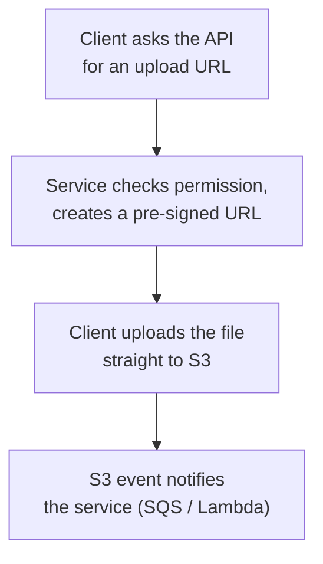
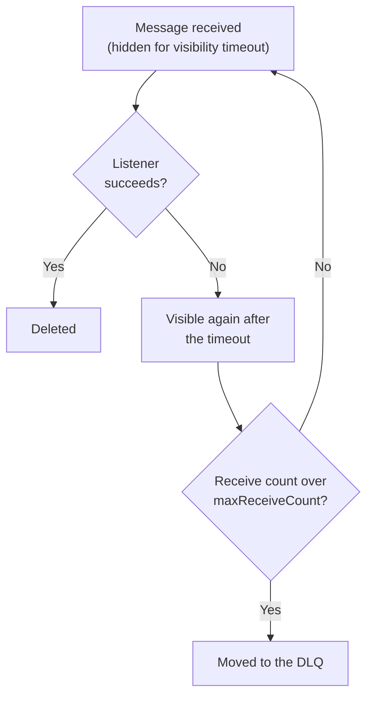
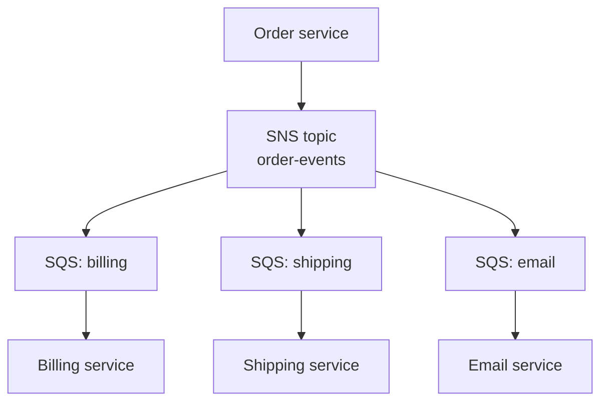

# Spring Boot on AWS (Spring Cloud AWS) — Interview Q&A

> **Looking for AWS itself** — EC2, VPC, IAM, S3, RDS, Lambda, architecture and
> scenario questions? Those are in files **09–12**, starting with
> [09_AWS_Compute_IAM_Networking_QA.md](09_AWS_Compute_IAM_Networking_QA.md). This
> file is only about connecting a Spring Boot application to AWS services.

**What this covers:** running a Spring Boot service on AWS, and the **Spring Cloud AWS**
starters that connect it to S3, SQS, SNS, DynamoDB, Secrets Manager and Parameter
Store. Interviews for AWS-based backend roles mix two kinds of questions: "how does
the Spring integration work?" and "how would you design this on AWS?" Both are here.

**Where the facts come from:** no AWS libraries are in the local Maven repository, so
Spring Cloud AWS facts come from the project's own sources, read on 7 Oct 2026:

- the compatibility table in the [GitHub repository](https://github.com/awspring/spring-cloud-aws);
- the [4.1.1 reference documentation](https://docs.awspring.io/spring-cloud-aws/docs/4.1.1/reference/html/index.html).

General AWS facts (limits, defaults of AWS services) are from my own knowledge, not
re-checked here. Spring Boot facts were checked in the local jars as before.

Related: [05 Q20](05_Spring_Boot_Starters_QA.md#20-spring-cloud-aws-starters) ·
[07 Actuator](07_Spring_Boot_Actuator_QA.md) · [06 Q11](06_Spring_Boot_Web_QA.md#11-file-upload-and-download)

## Weight legend

| Mark | What it means | How the answer is written |
| --- | --- | --- |
| ★★★ | Asked in almost every AWS backend round, with follow-ups | Answer, mechanism, code, traps |
| ★★ | Asked often | Answer and one example or table |
| ★ | Occasional, or a senior-level bonus | Two to four lines |

## Contents

| # | Question | Weight | One-line answer |
| --- | --- | --- | --- |
| 1 | [Where to run Boot on AWS](#1-ways-to-run-spring-boot-on-aws) | ★★★ | ECS Fargate by default; EKS if you already run Kubernetes |
| 2 | [Spring Cloud AWS and versions](#2-what-spring-cloud-aws-is-and-which-version) | ★★ | 3.4.x ↔ Boot 3.5; 4.x ↔ Boot 4.0 |
| 3 | [Credentials](#3-how-the-app-gets-aws-credentials) | ★★★ | IAM roles through the default chain; never access keys |
| 4 | [Region and endpoints](#4-region-and-endpoint-configuration) | ★ | `spring.cloud.aws.region.static`; endpoint override for local |
| 5 | [Secrets Manager, Parameter Store](#5-secrets-manager-and-parameter-store) | ★★★ | `spring.config.import=aws-secretsmanager:…` |
| 6 | [S3](#6-s3-with-s3template) | ★★★ | `S3Template`; pre-signed URLs keep big files off your servers |
| 7 | [SQS listeners](#7-sqs-listeners-and-sqstemplate) | ★★★ | `@SqsListener`; deleted only after success |
| 8 | [SQS failures and DLQs](#8-sqs-failure-handling-visibility-and-dlqs) | ★★★ | Visibility timeout → retry → DLQ after N receives |
| 9 | [SNS fan-out](#9-sns-and-the-fan-out-pattern) | ★★ | One topic, one queue per consumer |
| 10 | [Choosing a messaging service](#10-sqs-vs-sns-vs-eventbridge-vs-kinesis-vs-msk) | ★★★ | Queue, push, route, stream, or Kafka |
| 11 | [DynamoDB](#11-dynamodb-with-dynamodbtemplate) | ★★ | Design from access patterns; avoid hot partitions |
| 12 | [Observability](#12-observability-on-aws) | ★★ | JSON logs, CloudWatch or Prometheus, OpenTelemetry traces |
| 13 | [RDS and Aurora](#13-rds-and-aurora-from-spring-boot) | ★★ | Pool × instances < max_connections; plan for failover |
| 14 | [Spring Boot on Lambda](#14-spring-boot-on-lambda) | ★★ | Cold starts; SnapStart; RDS Proxy |
| 15 | [ALB health and shutdown](#15-health-checks-and-graceful-shutdown-behind-an-alb) | ★★ | ECS drains first, then SIGTERM |
| 16 | [Testing with LocalStack](#16-testing-with-localstack) | ★★★ | `@ServiceConnection`; LocalStack now needs a token |
| 17 | [Cost and networking](#17-cost-and-networking-gotchas) | ★★ | Free S3/DynamoDB gateway endpoints vs NAT charges |
| 18 | [Security](#18-securing-a-spring-boot-service-on-aws) | ★★ | Least-privilege task roles, private subnets, KMS |
| 19 | [Spring Cloud AWS 4 changes](#19-what-changed-in-spring-cloud-aws-4) | ★ | Jackson 3, inferred SQS payload types |

---

## 1. Ways to run Spring Boot on AWS

**Weight:** ★★★

| Option | You manage | Good for | Watch out for |
| --- | --- | --- | --- |
| EC2 (+ Auto Scaling) | OS, JVM, patching, scaling | Full control, special hardware | Most operational work |
| Elastic Beanstalk | Your jar; AWS creates EC2, load balancer, scaling | Getting one app running quickly | Less control; not common for new microservices |
| **ECS on Fargate** | Container image + task definition | Most microservice teams | Pay per task; no host access |
| EKS (Kubernetes) | Kubernetes manifests, cluster add-ons | Organisations already on Kubernetes | Highest platform complexity |
| Lambda | Functions | Spiky, event-driven, low steady traffic | Cold starts, 15-minute limit, DB connections (Q14) |

**How to answer:** for a team without a Kubernetes platform, ECS on Fargate — no
servers, per-service IAM roles, native ALB integration. EKS when a platform team
already runs Kubernetes. Lambda for event handlers (S3 upload → thumbnail), not for
a steady high-traffic REST API.

---

## 2. What Spring Cloud AWS is, and which version

**Weight:** ★★

- A community project (`io.awspring.cloud`, GitHub `awspring/spring-cloud-aws`), not
  part of Spring Boot and not the AWS SDK itself. Since 3.0 it is built on **AWS SDK
  for Java v2**.
- **What it adds over the raw SDK:** SDK clients auto-configured from properties;
  templates (`S3Template`, `SqsTemplate`, `SnsTemplate`, `DynamoDbTemplate`); an
  `@SqsListener` container with acknowledgement, concurrency and back-pressure; and
  loading secrets as Spring properties. You can still inject the SDK clients
  (`S3Client`, `SqsAsyncClient`…) for anything the templates don't cover.

**Compatibility (from the project's table):**

| Spring Cloud AWS | Spring Boot | Spring Framework |
| --- | --- | --- |
| 3.3.x | 3.4.x | 6.2.x |
| 3.4.x | 3.5.x | 6.2.x |
| 4.x | 4.0.x | 7.0.x |

The latest release listed was 4.1.1. The table lists 4.x against Boot 4.0.x — check it
again before pairing with Boot 4.1.

**Setup:**

```xml
<dependencyManagement>
  <dependencies>
    <dependency>
      <groupId>io.awspring.cloud</groupId>
      <artifactId>spring-cloud-aws-dependencies</artifactId>
      <version>${spring-cloud-aws.version}</version>
      <type>pom</type>
      <scope>import</scope>
    </dependency>
  </dependencies>
</dependencyManagement>

<dependency>
  <groupId>io.awspring.cloud</groupId>
  <artifactId>spring-cloud-aws-starter-sqs</artifactId>
</dependency>
```

**Starters (from the reference docs):** `spring-cloud-aws-starter` (core),
`-s3`, `-sqs`, `-sns`, `-ses`, `-dynamodb`, `-secrets-manager`, `-parameter-store`,
`-imds` (EC2 instance metadata).

---

## 3. How the app gets AWS credentials

**Weight:** ★★★

**Answer:** through the AWS SDK's **default credentials provider chain**, which tries
these in order (as listed in the reference docs) and uses the first that works:

1. Java system properties
2. Environment variables
3. Web identity token (EKS IAM Roles for Service Accounts)
4. Credential profiles (`~/.aws/credentials`, `~/.aws/config`)
5. Container credentials (ECS task role)
6. EC2 instance profile

So the same jar picks up the right identity wherever it runs, with **no keys in
configuration**:

| Runs on | Identity comes from |
| --- | --- |
| Your laptop | A profile — e.g. `aws sso login` |
| EC2 | The instance profile role |
| ECS | The **task role** |
| EKS | IAM Roles for Service Accounts (web identity) or EKS Pod Identity |
| Lambda | The function's execution role |

**ECS trap — task role vs task execution role:**

- The **execution role** is used by ECS itself: pull the image from ECR, write logs,
  inject secrets into the container at start.
- The **task role** is what **your code** uses to call S3 or SQS.

"AccessDenied from my app although the role has the permission" is often a policy
attached to the wrong one.

**Static keys** (`spring.cloud.aws.credentials.access-key` / `secret-key`) exist —
use them only for LocalStack in tests. Long-lived keys in a config file or
environment variable are the classic leak.

**Least privilege** — one role per service, scoped to its own resources:

```json
{
  "Effect": "Allow",
  "Action": ["s3:GetObject", "s3:PutObject"],
  "Resource": "arn:aws:s3:::shop-invoices/invoices/*"
}
```

---

## 4. Region and endpoint configuration

**Weight:** ★

- Region: `spring.cloud.aws.region.static=ap-south-1`. Without it, the SDK's region
  chain is used (`AWS_REGION` environment variable, profile, instance metadata).
- Endpoint override for local emulators: `spring.cloud.aws.endpoint` (all services) or
  a per-service property such as `spring.cloud.aws.s3.endpoint`.
- Calling a resource in another region works, but adds latency and cross-region data
  charges. Keep the service and its resources in the same region.

---

## 5. Secrets Manager and Parameter Store

**Weight:** ★★★

**Loading them as Spring properties** (syntax from the reference docs):

```yaml
spring:
  config:
    import:
      - aws-parameterstore:/config/order-service/
      - aws-secretsmanager:/secret/order-service/db?prefix=spring.datasource.
```

**How values become properties:**

- **Parameter Store:** every parameter under the path becomes a property named after
  the rest of its path — `/config/order-service/payment.timeout` → `payment.timeout`.
- **Secrets Manager, JSON secret:** each top-level key becomes a property. The secret
  `{"username": "app", "password": "…"}` with `?prefix=spring.datasource.` gives
  `spring.datasource.username` and `spring.datasource.password`.
- **Secrets Manager, plain-text secret:** the secret's name is the property name.

**Missing values fail startup** unless prefixed with `optional:` — usually what you
want: better not to start than to start with no database password.

**Reloading without a restart:** `spring.cloud.aws.secretsmanager.reload.strategy` (or
`…parameterstore.reload.strategy`) = `refresh` or `restart_context`; checked every
15 s by default. Needs `spring-boot-starter-actuator`, `spring-cloud-commons` and
`spring-cloud-context`.

| | Secrets Manager | Parameter Store |
| --- | --- | --- |
| Built for | Credentials that rotate | Configuration and simple secrets (`SecureString`, KMS-encrypted) |
| Automatic rotation | Yes (built-in for RDS, Lambda for others) | No |
| Cost | Per secret per month + per API call | Standard parameters free |
| Max size | 64 KB | 4 KB standard, 8 KB advanced |

**Senior trap — rotation and the connection pool:** after the database password
rotates, refreshing the property doesn't rebuild HikariCP's `DataSource`. Existing
connections keep working, but new ones fail with the old password. Options:

- **RDS IAM authentication** — short-lived tokens instead of passwords.
- **AWS Secrets Manager JDBC driver** (`aws-secretsmanager-jdbc`) — on an auth failure
  it fetches the new secret and retries.
- **AWS Advanced JDBC Wrapper** with its Secrets Manager plugin.

**Alternative — ECS injects secrets as environment variables** at task start
(`secrets` in the task definition). Simple, but a changed secret needs new tasks.

---

## 6. S3 with S3Template

**Weight:** ★★★

```java
@Service
@RequiredArgsConstructor
class InvoiceStorage {

    private static final String BUCKET = "shop-invoices";
    private final S3Template s3;

    void save(String key, InputStream pdf) {
        s3.upload(BUCKET, key, pdf);
    }

    URL downloadLink(String key) {
        return s3.createSignedGetURL(BUCKET, key, Duration.ofMinutes(10));
    }

    void saveJson(String key, InvoiceSummary summary) {
        s3.store(BUCKET, key, summary);            // serialized to JSON
    }

    InvoiceSummary readJson(String key) {
        return s3.read(BUCKET, key, InvoiceSummary.class);
    }
}
```

- `S3Template`: `upload`, `download`, `store` / `read` (JSON), `createSignedGetURL`
  (from the reference docs).
- An object is also a Spring `Resource`: `@Value("s3://shop-invoices/terms.pdf")
  Resource terms`.
- Writing through an `S3OutputStream` buffers in memory by default
  (`InMemoryBufferingS3OutputStream`); define a `DiskBufferingS3OutputStreamProvider`
  bean for large files.

**Pre-signed URLs — the key design point:**



The file never passes through your servers — no memory pressure, no 1MB multipart
limit, no bandwidth on your instances.

**Facts worth knowing (AWS, not re-checked):**

- Strong read-after-write consistency for all operations (since December 2020).
- New objects are encrypted by default (SSE-S3); use SSE-KMS when you need key control
  and audit.
- Request rates scale per key prefix (thousands of reads and writes per second per
  prefix).
- Large objects use multipart upload: recommended above about 100 MB, required above
  5 GB.
- Keep **Block Public Access** on; share objects through pre-signed URLs or CloudFront.

---

## 7. SQS listeners and SqsTemplate

**Weight:** ★★★

```java
@Component
@RequiredArgsConstructor
class OrderPaidListener {

    private final FulfilmentService fulfilment;

    @SqsListener("order-paid")
    void on(OrderPaid event) {               // JSON body converted to the parameter type
        fulfilment.start(event.orderId());   // must be idempotent — see Q8
    }
}
```

```java
sqsTemplate.send(to -> to.queue("order-paid").payload(new OrderPaid(orderId)));
```

**Container defaults (from the reference docs):**

| Option | Default | Meaning |
| --- | --- | --- |
| `acknowledgementMode` | `ON_SUCCESS` | Delete the message only if the listener returns normally (others: `ALWAYS`, `MANUAL`) |
| `maxConcurrentMessages` | 10 | Messages per queue processed in parallel |
| `maxMessagesPerPoll` | 10 | Messages fetched per receive call |
| `pollTimeout` | 10 s | Long-polling wait when the queue is empty |
| Acknowledgement batching | Standard: every 1 s or 10 messages; FIFO: immediately | Deletes are sent in batches |

**Why acknowledgement batching matters:** on a standard queue, a message processed
successfully can still be redelivered if the instance dies before the batched delete
is sent. One more reason consumers must be idempotent.

**Batch listener** (signature from the reference docs):

```java
@SqsListener("order-paid")
void onBatch(List<Message<OrderPaid>> messages, BatchAcknowledgement ack) {
    ...
}
```

**Standard vs FIFO queues (AWS facts, not re-checked):**

| | Standard | FIFO |
| --- | --- | --- |
| Ordering | Best effort | Strict **within a message group** |
| Duplicates | Possible (at-least-once) | Removed within a 5-minute deduplication window |
| Throughput | Nearly unlimited | 300 messages/s per API action, 3,000 with batching; more in high-throughput mode |
| Use for | Most background work | Per-entity ordering (all events for one order) |

**FIFO in Spring Cloud AWS:** messages in the same group are processed in order;
different groups are processed in parallel. Use the order id as the message group id
so one order's events stay ordered while different orders run in parallel.

---

## 8. SQS failure handling, visibility and DLQs

**Weight:** ★★★

**Mechanism:**

1. A consumer receives a message. SQS hides it from other consumers for the
   **visibility timeout**.
2. Success → Spring Cloud AWS deletes it (acknowledgement).
3. The listener throws → no delete. When the visibility timeout ends, the message
   becomes visible again and is received again.
4. Each receive increases its receive count. After `maxReceiveCount` receives, the
   queue's **redrive policy** moves it to a **dead-letter queue** (DLQ). This is a queue
   setting, not a Spring property.



**Rules to state:**

- **Visibility timeout > the longest processing time.** Otherwise the message
  reappears while still being processed and a second consumer handles it too. For long
  jobs, extend visibility from the listener (a `Visibility` parameter).
- **Back off between retries** — Spring Cloud AWS's `ExponentialBackoffErrorHandler`
  (or `LinearBackoffErrorHandler`) changes visibility so a failing message isn't
  retried immediately and in a tight loop.
- **Alarm on DLQ depth** (`ApproximateNumberOfMessagesVisible > 0`). A DLQ nobody
  watches is where orders silently disappear.
- After fixing the bug, **redrive** messages from the DLQ back to the source queue.
- **FIFO caveat:** when a message fails, the following messages of the same group are
  held back until it is handled. One poison message stalls its whole group until it
  reaches the DLQ.

**Idempotency — required because SQS is at-least-once:**

- Record processed message ids (or a business key) with a unique constraint, in the
  same transaction as the work.
- Or make the work naturally idempotent: "set status to PAID" instead of "add ₹500".

---

## 9. SNS and the fan-out pattern

**Weight:** ★★

```java
snsTemplate.sendNotification("order-events", new OrderPlaced(orderId), "OrderPlaced");
```

**Fan-out:** publish once to an SNS topic; each consumer service subscribes its **own**
SQS queue.



**Why a queue per consumer, not SNS straight to services:** each consumer gets its own
retries, its own DLQ and its own pace. If email is down for an hour, its messages wait
in its queue; billing and shipping are unaffected.

- **Subscription filter policies** deliver only matching messages to a queue (e.g.
  only `eventType = OrderCancelled`).
- **Raw message delivery** — otherwise each SQS message body is SNS's JSON envelope
  wrapping your payload.
- SNS also has FIFO topics, which pair with FIFO queues when ordering matters.

---

## 10. SQS vs SNS vs EventBridge vs Kinesis vs MSK

**Weight:** ★★★ — a favourite design question.

| Service | Model | Replay old messages? | Best for |
| --- | --- | --- | --- |
| SQS | Queue — each message handled by one consumer | No (deleted after processing; kept up to 14 days) | Background work, decoupling, load levelling |
| SNS | Push to subscribers, no storage | No | Fan-out to queues, Lambdas, HTTP, email |
| EventBridge | Event bus with content-based routing rules | Yes (archive and replay) | Routing events between services, accounts, SaaS and AWS events |
| Kinesis Data Streams | Ordered stream per shard; many readers | Yes (24 h default, up to 365 days) | High-volume ordered events, analytics |
| MSK (managed Kafka) | Ordered log per partition; consumer groups | Yes (configurable retention) | Kafka semantics, Kafka Connect/Streams, portability |

**How to answer "which one?":**

- One job, one worker, retries → **SQS**.
- One event, several independent consumers → **SNS + SQS** fan-out (or EventBridge if
  you need rich routing rules).
- Consumers must re-read history, or strict ordering at high volume → **Kinesis** or
  **MSK**. Choose MSK if the team already knows Kafka or needs its ecosystem.

---

## 11. DynamoDB with DynamoDbTemplate

**Weight:** ★★

```java
@DynamoDbBean
public class Cart {

    private String customerId;
    private List<CartItem> items;

    @DynamoDbPartitionKey
    public String getCustomerId() { return customerId; }

    // getters and setters
}
```

```java
dynamoDbTemplate.save(cart);
Cart cart = dynamoDbTemplate.load(
        Key.builder().partitionValue(customerId).build(), Cart.class);
```

- `DynamoDbTemplate` works with AWS SDK v2 Enhanced Client beans (`@DynamoDbBean`).
- **Table names:** the class name in snake_case (`Cart` → `cart`), plus optional
  `spring.cloud.aws.dynamodb.table-prefix` / `table-suffix` — handy for `dev_cart` vs
  `prod_cart`. Replace with your own `DynamoDbTableNameResolver` bean.

**Modelling questions (AWS facts, not re-checked):**

- **Design from access patterns**, not from entities. List the queries first, then
  choose keys. There are no joins.
- **Partition key with many distinct values.** A key like `status = ACTIVE` sends most
  traffic to one partition — a *hot partition* — and gets throttled.
- **Sort key** for ranges (`orderDate`); **global secondary indexes** for other access
  patterns.
- Item size limit: **400 KB**.
- Reads are eventually consistent by default; strongly consistent reads are available
  on the table, but not on global secondary indexes.
- Optimistic locking with `@DynamoDbVersionAttribute` (a conditional write).
- **Avoid `Scan`** in request paths — it reads the whole table.

**DynamoDB or RDS?** DynamoDB for known access patterns at very large scale with
predictable latency. RDS/Aurora for ad-hoc queries, joins, reporting and transactions
across many entities.

---

## 12. Observability on AWS

**Weight:** ★★

| Signal | Typical setup |
| --- | --- |
| Logs | JSON to stdout (`logging.structured.format.console=ecs`) → ECS `awslogs` / FireLens or EKS Fluent Bit → CloudWatch Logs |
| Metrics | `micrometer-registry-cloudwatch2` → CloudWatch; or Prometheus format → Amazon Managed Service for Prometheus + Grafana |
| Traces | Micrometer Tracing + OpenTelemetry → AWS Distro for OpenTelemetry (ADOT) collector → X-Ray or another OTLP backend |

**CloudWatch metrics (from the reference docs):**

- `management.cloudwatch.metrics.export.namespace` is **required** — there is no
  default.
- `management.cloudwatch.metrics.export.step` defaults to 1 minute.
- **Each unique metric name + tag combination is billed.** Limit what you publish with
  `MeterFilter` beans ([07 Q10](07_Spring_Boot_Actuator_QA.md#10-custom-metrics-and-the-cardinality-trap)).

**Alarms worth naming:** p99 latency, 5xx rate, DLQ depth, Hikari pending connections,
CPU and memory per task.

---

## 13. RDS and Aurora from Spring Boot

**Weight:** ★★

- **Connection budget:** pool size × number of tasks must stay below the database's
  `max_connections` — including during a deployment, when old and new tasks run
  together ([05 Q7](05_Spring_Boot_Starters_QA.md#7-jdbc)).
- **Failover:** Multi-AZ and Aurora failover moves the endpoint's DNS name to a new
  host. Make sure the JVM doesn't cache DNS for long, and keep Hikari's
  `maxLifetime` below any database-side connection timeout. The **AWS Advanced JDBC
  Wrapper** adds faster, topology-aware failover.
- **Read scaling:** route `readOnly` transactions to the Aurora reader endpoint
  ([03 Q27](03_JPA_Spring_Data_QA.md#27-transactions-and-readonly)). Replicas lag
  slightly — never read your own write from a replica.
- **RDS Proxy** pools connections across many clients. Essential for Lambda, useful for
  services that scale out quickly.
- **IAM database authentication** replaces passwords with short-lived tokens.

---

## 14. Spring Boot on Lambda

**Weight:** ★★

**The problem:** each cold start builds the whole Spring context — seconds of latency
for the first request on every new instance.

| Approach | What it is |
| --- | --- |
| Spring Cloud Function, AWS adapter | Write `Function<Input, Output>` beans; the adapter connects them to Lambda events |
| AWS Serverless Java Container | Runs an existing Spring MVC app behind API Gateway |
| Lambda SnapStart | Lambda snapshots the initialized JVM and restores it on cold start |
| GraalVM native image | Compiled ahead of time; starts in milliseconds; custom runtime |

**SnapStart caveats:**

- Anything created during init is restored in **every** instance — random seeds,
  generated ids, open connections. Re-create them after restore (CRaC
  `org.crac.Resource` hooks).
- Database connections must be re-established after restore.

**Connections:** thousands of concurrent Lambdas each opening a pool will exhaust the
database. Use RDS Proxy, and a pool of one connection per Lambda instance.

**When not to use Lambda:** steady high traffic (containers are cheaper), jobs longer
than 15 minutes, or latency SLAs that can't absorb cold starts.

---

## 15. Health checks and graceful shutdown behind an ALB

**Weight:** ★★

- **ALB target group health check** → `/actuator/health/readiness` (or `/readyz` on the
  main port, [07 Q6](07_Spring_Boot_Actuator_QA.md#6-liveness-and-readiness-probes)).
  Unhealthy targets stop receiving traffic.
- **ECS stop sequence:** ECS first **deregisters** the task from the target group and
  waits for the **deregistration delay** (connection draining — 300 s by default), then
  sends **SIGTERM**, then SIGKILL after `stopTimeout` (30 s by default).
- **Spring side:** graceful shutdown is the default in Boot 3.5.7 with a 30 s timeout
  ([04 Q25](04_Spring_Boot_QA.md#25-graceful-shutdown)).

**What to tune:**

- Lower the deregistration delay (e.g. 30–60 s) — the 300 s default makes every
  deployment slow.
- Keep `stopTimeout` ≥ Spring's shutdown timeout plus a margin, or in-flight requests
  are killed.
- On EKS, deregistration and SIGTERM happen **at the same time**, so add a `preStop`
  sleep there. On ECS the draining already happens before SIGTERM.

---

## 16. Testing with LocalStack

**Weight:** ★★★

**LocalStack** emulates AWS services in a Docker container. `spring-cloud-aws-testcontainers`
adds `@ServiceConnection` support, so Spring Cloud AWS points at the container
automatically:

```java
@SpringBootTest
@Testcontainers
class InvoiceStorageIT {

    @Container
    @ServiceConnection
    static LocalStackContainer localStack = new LocalStackContainer(
            DockerImageName.parse("localstack/localstack:2026.03.0"))
            .withEnv("LOCALSTACK_AUTH_TOKEN", System.getenv("LOCALSTACK_AUTH_TOKEN"));

    @BeforeAll
    static void createBucket() throws Exception {
        localStack.execInContainer("awslocal", "s3", "mb", "s3://shop-invoices");
    }

    @Autowired InvoiceStorage storage;

    @Test
    void storesAndSignsInvoice() { ... }
}
```

**Licensing change to know about** (from LocalStack's announcements): since release
2026.03.0 (March 2026), LocalStack ships as one image that **requires an auth token**.
A free plan exists for non-commercial use; commercial use needs a paid plan. In CI,
pass the token as a secret environment variable.

**Free alternatives per service:** MinIO (S3-compatible), ElasticMQ (SQS-compatible),
DynamoDB Local (from AWS). Each runs in Testcontainers; point
`spring.cloud.aws.s3.endpoint` (and the other per-service endpoints) at them.

**What to test against the emulator:** that messages really arrive, that JSON
(de)serialization matches, and the failure path — a listener that throws must leave
the message for a retry.

---

## 17. Cost and networking gotchas

**Weight:** ★★

- **NAT gateway charges:** tasks in private subnets that reach S3 or DynamoDB through
  a NAT gateway pay per GB processed. **Gateway VPC endpoints** for S3 and DynamoDB are
  free and remove that charge. Other services (SQS, Secrets Manager) have interface
  endpoints, which cost per hour.
- **Cross-AZ traffic** is billed. Chatty services spread over availability zones add
  up.
- **CloudWatch:** custom metrics and log ingestion are billed per metric and per GB —
  watch cardinality and DEBUG logging.
- **SDK clients:** create once and reuse (Spring beans already are); set explicit
  timeouts (`apiCallTimeout`, `apiCallAttemptTimeout`).
- **Retries:** the AWS SDK already retries throttling and transient errors. Adding your
  own retry layer on top multiplies attempts and can turn a slowdown into a retry
  storm.

---

## 18. Securing a Spring Boot service on AWS

**Weight:** ★★

- **Identity:** one IAM role per service, least privilege, no long-lived access keys
  (Q3).
- **Network:** tasks in private subnets; only the ALB is public; security groups allow
  traffic from the ALB's group only.
- **Secrets:** Secrets Manager / Parameter Store, never in the image, task definition
  plaintext or Git (Q5).
- **Encryption:** KMS keys for S3, RDS, SQS and secrets when you need key control and
  audit.
- **Edge:** AWS WAF on the ALB or API Gateway; TLS everywhere.
- **Auth:** an identity provider (Cognito or another OIDC provider) issues JWTs; the
  service validates them as an OAuth2 resource server
  ([05 Q10](05_Spring_Boot_Starters_QA.md#10-security-oauth2-resource-server)).
- **Audit:** CloudTrail records every AWS API call made by the service's role.

---

## 19. What changed in Spring Cloud AWS 4

**Weight:** ★ — from the 4.1.1 reference documentation; read the project's migration
guide before upgrading.

- Built for Spring Boot 4 / Spring Framework 7.
- Uses Jackson 3's `JsonMapper` when it is available, falling back to Jackson 2.
- SQS listeners infer the payload type from the method signature; mapping the type
  from message headers is off by default.
- Support for running listeners on virtual threads (JDK 21+).
