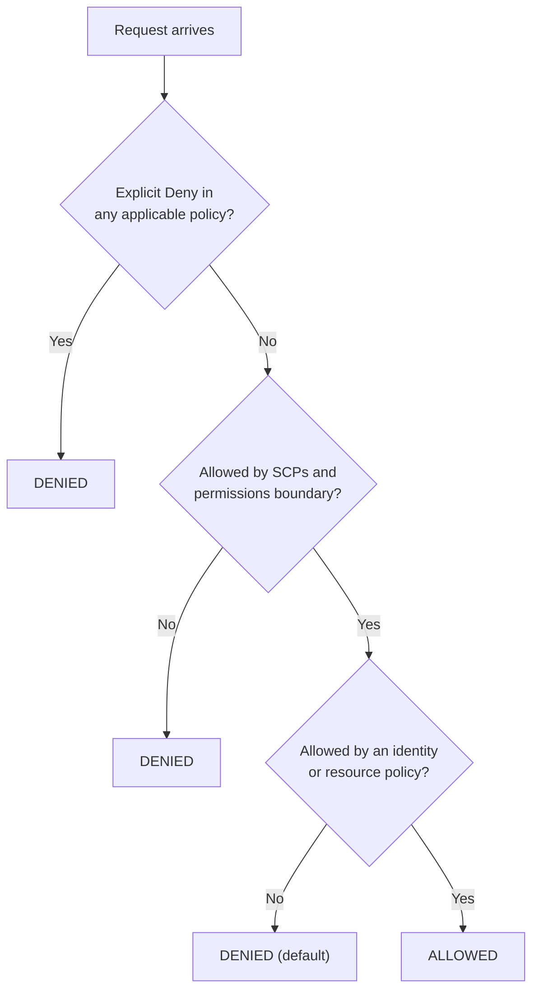
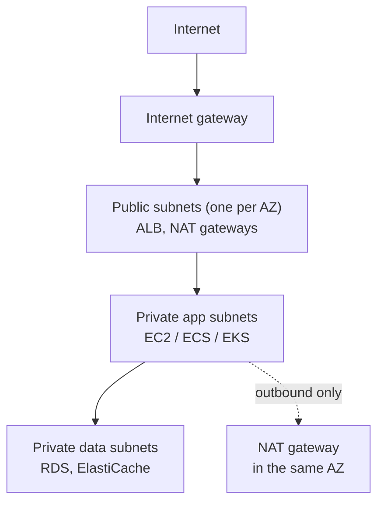

# AWS — Compute, IAM and Networking — Interview Q&A

**What this covers:** the AWS foundations every backend interview touches — regions and
availability zones, IAM, EC2, load balancers, Auto Scaling, VPC networking, Route 53
and CloudFront. Each answer says what the service is, **when you would use it**, and
what companies usually do in practice.

**This is file 1 of 4 on AWS:**

| File | Covers |
| --- | --- |
| **09 (this file)** | Global infrastructure, IAM, EC2, storage for EC2, load balancing, Auto Scaling, VPC, DNS, CDN |
| [10](10_AWS_Storage_Databases_Messaging_QA.md) | S3, RDS/Aurora, DynamoDB, ElastiCache, SQS, SNS, EventBridge, Kinesis |
| [11](11_AWS_Serverless_Containers_DevOps_QA.md) | Lambda, API Gateway, ECS/EKS, IaC, CI/CD, deployments, monitoring, KMS |
| [12](12_AWS_Architecture_Practices_Scenarios_QA.md) | Well-Architected, HA/DR, security and cost practices, scenario questions |

**How the facts were checked:** stable AWS facts come from my own knowledge. Limits
and features that changed recently were confirmed against AWS's own announcements on
7 Oct 2026; those are marked "(confirmed …)" and listed under Sources at the end.
AWS changes often — before quoting a number to an interviewer as current, the AWS
docs are the final word.

## Weight legend

| Mark | What it means | How the answer is written |
| --- | --- | --- |
| ★★★ | Asked in almost every AWS round, with follow-ups | Answer, mechanism, example, traps |
| ★★ | Asked often | Answer and one example or table |
| ★ | Occasional, or a senior-level bonus | Two to four lines |

## Contents

| # | Question | Weight | One-line answer |
| --- | --- | --- | --- |
| 1 | [Regions, AZs, edge locations](#1-regions-availability-zones-and-edge-locations) | ★★★ | Spread across AZs for HA; regions for DR and latency |
| 2 | [Shared responsibility](#2-the-shared-responsibility-model) | ★★ | AWS secures the cloud; you secure what you put in it |
| 3 | [IAM building blocks](#3-iam-building-blocks) | ★★★ | Users, groups, roles, policies — prefer roles |
| 4 | [Policy evaluation](#4-how-aws-evaluates-a-request) | ★★★ | Explicit deny > allow > default deny |
| 5 | [Credentials for apps and CI](#5-how-applications-and-pipelines-get-credentials) | ★★★ | Roles and temporary credentials; never access keys |
| 6 | [EC2 instance types](#6-choosing-an-ec2-instance-type) | ★★ | Family by workload; Graviton for price-performance |
| 7 | [Purchasing options](#7-ec2-purchasing-options) | ★★★ | Savings Plans for the baseline, Spot for interruptible work |
| 8 | [AMIs, user data, launch templates](#8-amis-user-data-and-launch-templates) | ★★ | Bake an image, keep boot scripts small |
| 9 | [EBS vs instance store vs EFS vs S3](#9-ebs-vs-instance-store-vs-efs-vs-s3) | ★★★ | Block in one AZ, temporary, shared files, objects |
| 10 | [EBS types and snapshots](#10-ebs-volume-types-and-snapshots) | ★★ | gp3 by default; snapshots are incremental |
| 11 | [ALB vs NLB vs GWLB](#11-alb-vs-nlb-vs-gwlb) | ★★★ | HTTP routing vs raw TCP/UDP speed vs firewalls |
| 12 | [Auto Scaling](#12-auto-scaling-groups-and-scaling-policies) | ★★★ | Target tracking on a metric that follows load |
| 13 | [Health checks, lifecycle hooks](#13-health-checks-grace-periods-and-lifecycle-hooks) | ★★ | Use ELB health checks; give apps a grace period |
| 14 | [VPC basics](#14-vpc-basics-subnets-route-tables-gateways) | ★★★ | Public subnet = route to an internet gateway |
| 15 | [Security groups vs NACLs](#15-security-groups-vs-network-acls) | ★★★ | Stateful allow-lists vs stateless subnet rules |
| 16 | [Connecting networks](#16-connecting-vpcs-and-on-premises-networks) | ★★ | Peering, Transit Gateway, PrivateLink, VPN, Direct Connect |
| 17 | [VPC endpoints](#17-vpc-endpoints) | ★★ | Gateway endpoints for S3/DynamoDB are free |
| 18 | [Route 53 routing](#18-route-53-routing-policies) | ★★ | Weighted, latency, failover, geolocation… |
| 19 | [CloudFront](#19-cloudfront) | ★★ | CDN in front of S3 and APIs; OAC for private buckets |
| 20 | [Reaching a private instance](#20-reaching-a-private-ec2-instance) | ★★ | Session Manager instead of SSH and bastions |
| 21 | [IMDSv2](#21-instance-metadata-and-imdsv2) | ★ | Token-based metadata blocks SSRF credential theft |
| 22 | [Scenario: EC2 unreachable](#22-scenario-i-cant-reach-my-ec2-instance) | ★★★ | Check outward from the instance, layer by layer |

---

## 1. Regions, Availability Zones and edge locations

**Weight:** ★★★

| Term | What it is | Why it matters |
| --- | --- | --- |
| **Region** | A geographic area (e.g. `ap-south-1`, Mumbai) with its own independent set of services | Data residency, latency to users, disaster recovery |
| **Availability Zone (AZ)** | One or more data centres inside a region, with separate power and networking, connected by fast private links | The unit of failure you design around |
| **Edge location** | A point of presence used by CloudFront, Route 53 and Global Accelerator | Low latency for content and DNS worldwide |
| **Local Zone / Wavelength** | Infrastructure placed close to a city or a 5G network | Single-digit-millisecond latency for specific users |

**How to choose a region:** where your users are (latency), legal requirements on where
data lives, which services and instance types the region has, and price — prices
differ between regions.

**The design rule everyone expects you to say:** run production across **at least two
AZs** (three is common) so one data-centre failure doesn't take you down. Use a
**second region** only when the business needs to survive a whole-region outage — it
roughly doubles cost and complexity (see [12 Q3](12_AWS_Architecture_Practices_Scenarios_QA.md#3-the-four-disaster-recovery-strategies)).

**Service scope — a common follow-up:**

| Scope | Examples |
| --- | --- |
| Global | IAM, Route 53, CloudFront, Organizations |
| Regional | S3 buckets, DynamoDB tables, Lambda, SQS, VPC |
| Per AZ | EC2 instances, EBS volumes, subnets |

---

## 2. The shared responsibility model

**Weight:** ★★

**Answer:** AWS is responsible for security **of** the cloud — data centres, hardware,
the network, the virtualization layer, and the software of managed services. You are
responsible for security **in** the cloud — your data, IAM, network rules,
encryption settings, and anything you install.

**How the line moves with the service:**

| Service type | AWS handles | You handle |
| --- | --- | --- |
| EC2 (infrastructure) | Hardware, hypervisor | OS patches, runtime, app, firewall rules, data |
| RDS (managed) | OS, database engine patching, backups mechanism | Users and grants, network access, encryption choice, parameter settings |
| Lambda / S3 (fully managed) | Servers, OS, runtime patching (Lambda) | Code, IAM permissions, bucket policies, data classification |

**Interview point:** "S3 bucket left public" incidents are always the customer's side
of the model.

---

## 3. IAM building blocks

**Weight:** ★★★

| Element | What it is | Use it for |
| --- | --- | --- |
| **User** | A long-term identity with a password and/or access keys | Rarely now — humans should sign in through SSO |
| **Group** | A set of users that share policies | Granting the same permissions to a team |
| **Role** | An identity with **no long-term credentials**; whoever is allowed to *assume* it gets temporary credentials | Applications, AWS services, CI pipelines, cross-account access, SSO users |
| **Policy** | A JSON document of allowed or denied actions on resources | Attached to users, groups, roles, or resources |

**Kinds of policy:**

| Policy type | Attached to | Purpose |
| --- | --- | --- |
| Identity-based | User, group or role | "This identity may do X" |
| Resource-based | A resource (S3 bucket policy, SQS queue policy, KMS key policy) | "These principals may do X on me" — also how cross-account access works |
| Trust policy | A role | Who is allowed to assume the role |
| Permissions boundary | User or role | The maximum permissions it can ever have, whatever else is attached |
| Service control policy (SCP) | An account or OU in AWS Organizations | The maximum for everything in that account — guardrails |

**A policy, read aloud:**

```json
{
  "Version": "2012-10-17",
  "Statement": [{
    "Effect": "Allow",
    "Action": ["s3:GetObject", "s3:PutObject"],
    "Resource": "arn:aws:s3:::shop-invoices/invoices/*",
    "Condition": { "Bool": { "aws:SecureTransport": "true" } }
  }]
}
```

"Allow reading and writing objects under `invoices/` in that one bucket, only over
TLS."

**What companies do:** people sign in through **IAM Identity Center** (SSO) and get
roles per account; applications use roles; the root user is locked away with MFA and
never used day to day.

---

## 4. How AWS evaluates a request

**Weight:** ★★★

**The rule:** everything is **denied by default**. An **explicit allow** grants access.
An **explicit deny** anywhere overrides every allow.



**Follow-ups:**

- **Cross-account access** needs both sides: the caller's identity policy must allow
  it, *and* the resource policy (or the role's trust policy) in the other account
  must allow the caller.
- **SCPs never grant anything.** They only cap what IAM in that account can grant. An
  administrator in an account still can't do what the SCP forbids.
- **Debugging "Access Denied":** the error usually says which policy type denied it;
  IAM Policy Simulator and CloudTrail show the exact request.

---

## 5. How applications and pipelines get credentials

**Weight:** ★★★

**Answer:** through **roles** and **temporary credentials** from AWS STS (Security
Token Service). Credentials expire on their own and are rotated automatically.
Long-lived access keys are the most common cause of AWS breaches — keys pushed to
GitHub are found by bots within minutes.

| Where the code runs | How it gets credentials |
| --- | --- |
| EC2 | **Instance profile** (a role attached to the instance), read from instance metadata |
| ECS | **Task role** (separate from the *task execution role*, which ECS uses to pull images and read secrets) |
| EKS | **IAM Roles for Service Accounts** or **EKS Pod Identity** — a role per Kubernetes service account |
| Lambda | The function's **execution role** |
| CI (GitHub Actions, GitLab) | **OIDC federation**: the pipeline exchanges its signed identity token for a role — no stored keys |
| A developer laptop | `aws sso login` through IAM Identity Center |
| Another AWS account | `sts:AssumeRole` into a role whose trust policy allows you |

The AWS SDKs find these automatically through the **default credential provider
chain**, so the same code works everywhere with no keys in configuration.

**OIDC trust policy for GitHub Actions** — only one repository's `main` branch may
assume the deploy role:

```json
{
  "Effect": "Allow",
  "Principal": { "Federated": "<GitHub OIDC provider ARN>" },
  "Action": "sts:AssumeRoleWithWebIdentity",
  "Condition": {
    "StringEquals": {
      "token.actions.githubusercontent.com:aud": "sts.amazonaws.com",
      "token.actions.githubusercontent.com:sub": "repo:acme/orders:ref:refs/heads/main"
    }
  }
}
```

The provider ARN has the form
`arn:aws:iam::<account-id>:oidc-provider/token.actions.githubusercontent.com`. The
`sub` condition is the important part: without it, **any** GitHub repository could
assume the role.

---

## 6. Choosing an EC2 instance type

**Weight:** ★★

**Reading the name `m7g.xlarge`:** family `m` (general purpose), generation `7`,
attribute `g` (Graviton, ARM), size `xlarge`.

| Family | Optimized for | Typical use |
| --- | --- | --- |
| **T** (t3, t4g) | Burstable CPU with credits | Low, spiky load: dev, small internal tools |
| **M** | Balanced CPU and memory | Most application servers |
| **C** | Compute | CPU-heavy services, batch, encoding |
| **R / X** | Memory | Caches, in-memory analytics, large JVM heaps |
| **I / D** | Local storage (NVMe / HDD) | Self-managed databases, Kafka, search |
| **P / G / Inf / Trn** | GPUs and ML chips | Training and inference |

Attribute letters: `g` = Graviton (ARM), `a` = AMD, `i` = Intel, `d` = local NVMe disk,
`n` = enhanced networking.

**What to say:**

- Start with **M**; move to C or R once metrics show which resource is the limit.
- **Graviton** gives better price-performance for most Java workloads (the JVM runs on
  ARM unchanged). It needs ARM container images — build multi-architecture images.
- **T instances trap:** when CPU credits run out the instance is throttled to its
  baseline, which looks like a mysterious slowdown under sustained load.
- Right-size from data: CloudWatch metrics and AWS Compute Optimizer recommendations.

---

## 7. EC2 purchasing options

**Weight:** ★★★

| Option | Commitment | Discount (AWS's "up to" figures) | Use for |
| --- | --- | --- | --- |
| On-Demand | None | — | New or unpredictable workloads |
| Compute Savings Plans | $/hour for 1 or 3 years; any family, region, also Fargate and Lambda | Up to 66% | The steady baseline — the most flexible commitment |
| EC2 Instance Savings Plans | $/hour for one family in one region | Up to 72% | A stable fleet you won't change |
| Reserved Instances | A specific instance configuration | Similar to Savings Plans | Mostly replaced by Savings Plans for EC2 |
| Spot | None; AWS can reclaim with a **2-minute warning** | Up to 90% | Interruptible work: batch, CI runners, stateless workers |
| Dedicated Hosts / Instances | — | — | Licensing or compliance needing physical isolation |

**The pattern most companies follow:**

1. Cover the always-on baseline with **Savings Plans** (usually Compute Savings Plans).
2. Run peaks on **On-Demand**.
3. Run fault-tolerant work on **Spot**, spread over many instance types so one type
   running out doesn't stop you.

**Databases** have their own commitment option: **Database Savings Plans** — 1-year,
no upfront, covering RDS, Aurora, DynamoDB, ElastiCache and others (confirmed: AWS
announcement, Dec 2025).

**Spot follow-up — handling interruptions:** react to the 2-minute notice (drain the
instance, checkpoint work), keep workers stateless, and use capacity-optimized
allocation across several instance types.

---

## 8. AMIs, user data and launch templates

**Weight:** ★★

- **AMI (Amazon Machine Image):** the disk image an instance boots from — OS plus
  whatever you baked in. Regional; copy it to use in another region.
- **User data:** a script that runs at first boot.
- **Launch template:** a versioned definition of how to launch an instance (AMI, type,
  security groups, IAM role, user data, storage). Auto Scaling groups use it.

**Baked AMI vs boot-time script:**

| | Bake into the AMI | Install at boot with user data |
| --- | --- | --- |
| Boot speed | Fast | Slow — every new instance installs again |
| Reliability | Tested image | A package mirror outage breaks scaling |
| Change effort | Rebuild the image (EC2 Image Builder, Packer) | Edit the script |

**Practice:** bake the slow, stable parts (OS hardening, agents, runtime); keep user
data for small per-environment settings. Most container teams avoid the question —
they use a standard AMI (ECS- or EKS-optimized, or Bottlerocket) and ship the app as
an image.

---

## 9. EBS vs instance store vs EFS vs S3

**Weight:** ★★★

| | EBS | Instance store | EFS | S3 |
| --- | --- | --- | --- | --- |
| Type | Block disk | Block disk on the host | Shared file system (NFS) | Object storage over HTTP |
| Scope | One AZ, usually one instance | That instance only | A region; many instances across AZs | A region; any client |
| Survives stop/terminate? | Yes (independent of the instance) | **No** — lost on stop or host failure | Yes | Yes |
| Typical use | Boot volumes, databases on EC2 | Caches, scratch, temporary data | Shared files for many servers (Linux) | Files, backups, data lakes, static assets |

**When-to-use answers:**

- Database on EC2 → **EBS** (or instance store with replication, for experts).
- Several servers need the same files → **EFS** (Linux) or **FSx** (Windows, Lustre,
  NetApp ONTAP, OpenZFS).
- User uploads, reports, backups, static websites → **S3**.
- Never keep the only copy of anything on **instance store**.

---

## 10. EBS volume types and snapshots

**Weight:** ★★

| Type | Kind | Use |
| --- | --- | --- |
| **gp3** | General-purpose SSD; baseline 3,000 IOPS and 125 MiB/s, more provisioned separately from size | The default for almost everything |
| gp2 | Older SSD; performance tied to size | Migrate to gp3 — usually cheaper |
| **io2 (Block Express)** | Provisioned-IOPS SSD | Latency-sensitive, high-IOPS databases |
| st1 | Throughput HDD | Large sequential reads (logs, big data) |
| sc1 | Cold HDD | Rarely accessed data, cheapest |

**Snapshots:**

- Point-in-time backups stored by AWS in S3 (you don't see the bucket).
- **Incremental** — each one stores only blocks changed since the last.
- The way to move a volume to **another AZ or region**: snapshot → copy → restore.
- Automate with **Amazon Data Lifecycle Manager** or **AWS Backup**.
- A snapshot of a running database is only crash-consistent. Flush or freeze first,
  or use the database's own backup.

---

## 11. ALB vs NLB vs GWLB

**Weight:** ★★★

| | Application Load Balancer | Network Load Balancer | Gateway Load Balancer |
| --- | --- | --- | --- |
| Layer | 7 (HTTP/HTTPS, gRPC, WebSockets) | 4 (TCP, UDP, TLS) | 3 (IP packets) |
| Routing | By host, path, headers, query, method | By port | To a fleet of virtual appliances |
| Static IP | No (use DNS name) | Yes, one per AZ (Elastic IPs possible) | — |
| Extras | TLS termination, auth with Cognito/OIDC, WAF, Lambda targets | Very high throughput, low latency, keeps the client's source IP, PrivateLink services | Inline firewalls and inspection |
| Use when | Web apps and REST APIs (the default) | Non-HTTP protocols, fixed IPs for allow-lists, extreme scale | Third-party network security appliances |

**Concepts that come up:**

- **Target group** — the set of targets (instances, IPs, Lambda) plus its health check.
- **Listener** — a port and protocol with rules that pick a target group.
- **Cross-zone load balancing** — on by default for ALB, off by default for NLB.
- **Connection draining** (deregistration delay, 300 s by default) — how long
  in-flight requests may finish when a target is removed. Lower it for faster
  deployments.
- **Sticky sessions** exist, but stateless services with external session storage
  scale better.
- The Classic Load Balancer is legacy — don't choose it for anything new.

---

## 12. Auto Scaling groups and scaling policies

**Weight:** ★★★

**An Auto Scaling group (ASG)** keeps between `min` and `max` instances (aiming at
`desired`), spread across AZs, replacing unhealthy ones automatically.

| Policy | How it works | Use when |
| --- | --- | --- |
| **Target tracking** | Keep a metric at a value, e.g. average CPU 50% or requests per target 1,000 | The default — simple and self-adjusting |
| Step scaling | Add or remove N instances depending on how far an alarm is breached | You need bigger jumps for bigger spikes |
| Scheduled | Change capacity at set times | Known patterns: business hours, a sale at 10:00 |
| Predictive | Forecasts from history and scales ahead | Strong daily or weekly cycles |

**Choosing the metric** — the follow-up that separates candidates:

- It must **rise with load** and **fall when you add capacity**.
- CPU works for CPU-bound services. For I/O-bound Java services, **requests per
  target** (ALB) or **queue depth per worker** (SQS backlog per instance) usually
  works better.

**Things that make scaling go wrong:**

- **Slow boot** — if an instance needs 5 minutes to become healthy, scaling reacts 5
  minutes late. Bake AMIs, use warm pools, keep a headroom target (50–60% CPU, not 90%).
- **Instance warm-up** — tell the ASG how long a new instance needs, so its startup CPU
  spike doesn't trigger more scaling.
- **Scaling the app but not its database** — more instances just move the bottleneck.

**Mixed instances policy:** one ASG can combine On-Demand and Spot across several
instance types.

---

## 13. Health checks, grace periods and lifecycle hooks

**Weight:** ★★

- **EC2 health check (default):** is the instance running at the hypervisor level?
  It doesn't notice a hung application.
- **ELB health check:** does the app answer the load balancer's check? **Turn this on**
  for ASGs behind a load balancer, so a broken app gets replaced.
- **Health check grace period:** how long after launch failures are ignored — set it
  longer than the app's startup time, or the ASG kills instances still booting
  (a "replacement loop").
- **Lifecycle hooks:** pause an instance on launch (to finish setup or register
  somewhere) or on termination (to drain work, upload logs) before the ASG proceeds.
- **What the health endpoint should check:** that *this* instance can serve — not
  every dependency. If the endpoint fails whenever the database blips, every instance
  is marked unhealthy at once.

---

## 14. VPC basics: subnets, route tables, gateways

**Weight:** ★★★

**A VPC** is your private network in a region, with an IP range (CIDR) such as
`10.0.0.0/16`. A **subnet** is a slice of that range in **one AZ**. AWS reserves 5 IP
addresses in every subnet.

**What makes a subnet "public" — the classic question:** its **route table** has a
route `0.0.0.0/0 → internet gateway`. Nothing else. A "private" subnet has no such
route.

| Component | What it does |
| --- | --- |
| Internet gateway (IGW) | Two-way internet access for resources with public IPs in public subnets |
| NAT gateway | Lets private subnets make **outbound** connections (patches, external APIs) without being reachable from the internet |
| Route table | Decides where traffic for each destination goes |
| Egress-only IGW | Outbound-only internet for IPv6 |

**The standard layout** (three AZs):



**Follow-ups:**

- **One NAT gateway per AZ** for high availability; a single NAT gateway is a single
  point of failure and adds cross-AZ data charges. NAT gateways also charge per GB
  processed — see [Q17](#17-vpc-endpoints) for avoiding that.
- **Plan CIDRs up front** — overlapping ranges can't be peered later, and EKS uses one
  VPC IP per pod, so small subnets run out.
- Public IPv4 addresses are billed (about $0.005 per hour each — confirmed: AWS, from
  Feb 2024). Keep instances private; expose only the load balancer.

---

## 15. Security groups vs network ACLs

**Weight:** ★★★

| | Security group | Network ACL |
| --- | --- | --- |
| Applies to | A network interface (instance, task, RDS, load balancer) | A whole subnet |
| Stateful? | **Yes** — return traffic is allowed automatically | **No** — you must allow return traffic (ephemeral ports) too |
| Rules | Allow only | Allow and deny |
| Evaluation | All rules together | In number order; first match wins |
| Can reference | Other security groups | Only IP ranges |

**What companies do:** rely on **security groups**, chained by reference:

```text
alb-sg : allow 443 from 0.0.0.0/0
app-sg : allow 8080 from alb-sg          ← only the load balancer can reach the app
db-sg  : allow 5432 from app-sg          ← only the app can reach the database
```

Referencing groups instead of IP ranges means scaling and IP changes need no rule
updates. **NACLs** stay at the default (allow all) except for broad blocks — e.g.
denying a known bad IP range, since security groups can't deny.

---

## 16. Connecting VPCs and on-premises networks

**Weight:** ★★

| Option | What it is | Use when |
| --- | --- | --- |
| VPC peering | A direct private link between two VPCs | A few VPCs; **not transitive** (A–B and B–C doesn't give A–C); CIDRs can't overlap |
| Transit Gateway | A regional hub that many VPCs and VPNs attach to | Tens or hundreds of VPCs; central routing |
| PrivateLink | Expose **one service** (behind an NLB) as a private endpoint in other VPCs | Sharing a service with other teams or customers without connecting whole networks |
| Site-to-Site VPN | Encrypted IPsec tunnels over the internet | Quick, cheap on-prem connectivity |
| Direct Connect | A dedicated physical link to AWS | Steady high bandwidth, predictable latency (often with VPN as backup) |

**Senior point:** PrivateLink connects a *service*, not a network — overlapping CIDRs
don't matter and consumers can reach nothing else.

---

## 17. VPC endpoints

**Weight:** ★★

**The problem:** an app in a private subnet calling S3 goes out through the NAT gateway
— paying NAT data-processing charges per GB, and leaving the private network.

| | Gateway endpoint | Interface endpoint (PrivateLink) |
| --- | --- | --- |
| Services | **S3 and DynamoDB only** | Most other services (SQS, Secrets Manager, ECR, STS, CloudWatch…) |
| How it works | A route-table entry | A network interface with a private IP in your subnet |
| Cost | **Free** | Hourly per AZ + per GB |

**Practice:** always add the free S3 and DynamoDB gateway endpoints. Add interface
endpoints where traffic is heavy (ECR image pulls, CloudWatch Logs) or where
compliance says traffic must never leave the AWS network. Endpoint policies can
restrict *which* buckets are reachable — a data-exfiltration control.

---

## 18. Route 53 routing policies

**Weight:** ★★

| Policy | Answers with | Use for |
| --- | --- | --- |
| Simple | One record | A single resource |
| Weighted | Records in proportion to weights (90/10) | Canary releases, gradual migration |
| Latency | The region with lowest latency to the user | Multi-region active-active |
| Failover | Primary while healthy, otherwise secondary | Active-passive disaster recovery |
| Geolocation | By the user's country or continent | Legal or content rules per country |
| Geoproximity | By distance, with an adjustable bias | Shifting traffic between regions |
| Multivalue answer | Up to 8 healthy records | Simple client-side load spreading |
| IP-based | By the client's IP range | Routing specific networks |

**Follow-ups:**

- **Health checks** make weighted, latency and failover policies skip unhealthy
  endpoints.
- **Alias records** point at AWS resources (ALB, CloudFront, S3 websites), work at the
  zone apex (`example.com`), and queries to them are free.
- **DNS TTL matters for failover:** clients cache answers for the TTL, so keep it short
  (e.g. 60 s) on records you may fail over.

---

## 19. CloudFront

**Weight:** ★★

- A **CDN**: caches content at edge locations close to users. Also terminates TLS near
  the user and forwards to your origin over AWS's network — faster even for uncached
  API calls.
- **Origins:** S3, ALB, API Gateway, any HTTP server.
- **Private S3 origin:** keep the bucket private and allow only CloudFront with
  **Origin Access Control (OAC)** — the successor to the older Origin Access Identity.
- **Private content:** signed URLs or signed cookies.
- **Code at the edge:** CloudFront Functions (lightweight header and URL rewrites) and
  Lambda@Edge (heavier logic).
- **Security:** AWS WAF attaches here; Shield Standard (DDoS protection) is included.
- **Cache key design:** include only the headers, cookies and query strings that change
  the response — every extra one splits the cache and lowers the hit ratio.
- **Invalidation** clears cached paths but isn't instant or free at scale — prefer
  versioned file names (`app.3f2a1c.js`).

---

## 20. Reaching a private EC2 instance

**Weight:** ★★

| Option | How | Verdict |
| --- | --- | --- |
| **SSM Session Manager** | The SSM agent connects out to AWS; you open a shell from the console or CLI | **Preferred** — no inbound port 22, no keys, IAM-controlled, every session logged |
| EC2 Instance Connect Endpoint | SSH to private instances without a bastion or public IP | Good when you specifically need SSH |
| Bastion host | A hardened public instance you SSH through | Legacy — an exposed host to patch, keys to manage |

**Practice:** no SSH keys and no port 22 in security groups at all; Session Manager
for the rare manual access. For containers, `aws ecs execute-command` (ECS Exec)
uses the same mechanism.

---

## 21. Instance metadata and IMDSv2

**Weight:** ★

- Every instance can read `http://169.254.169.254/` for its metadata — including the
  **temporary credentials** of its instance role.
- **IMDSv1** answers any GET request. An attacker who finds an SSRF bug (making your
  server fetch a URL) can read the role's credentials — the cause of well-known
  breaches.
- **IMDSv2** requires a session token obtained with a `PUT` request first, which SSRF
  bugs usually can't do. **Require IMDSv2** on all instances (and keep the hop limit at
  1 unless containers need metadata).

---

## 22. Scenario: I can't reach my EC2 instance

**Weight:** ★★★ — "Walk me through how you'd debug it."

Work outward from the instance, one layer at a time:

| # | Check | What you are looking for |
| --- | --- | --- |
| 1 | Instance state and status checks | Running? System and instance status checks passing? |
| 2 | Is the app listening? (via Session Manager) | Process up; bound to `0.0.0.0`, not `127.0.0.1`; OS firewall |
| 3 | Security group | Inbound rule for the port from *your* source |
| 4 | Network ACL | Inbound port **and** outbound ephemeral ports (NACLs are stateless) |
| 5 | Route table | Public subnet routes `0.0.0.0/0` to an IGW; private subnet has no direct route |
| 6 | Public IP | A public or Elastic IP exists, if you're coming from the internet |
| 7 | Load balancer path | Target group health checks passing; listener rules; ALB security group allowed in the app SG |
| 8 | DNS | The name resolves to the right load balancer or IP |

**Tools that answer it faster:** **VPC Reachability Analyzer** (tests a path and names
the blocking component) and **VPC Flow Logs** (`ACCEPT` / `REJECT` per connection).

---

## Sources

Recent changes confirmed on 7 Oct 2026:

- [Database Savings Plans announcement (Dec 2025)](https://aws.amazon.com/about-aws/whats-new/2025/12/database-savings-plans-savings)
- [Public IPv4 address charge (from Feb 2024)](https://aws.amazon.com/blogs/aws/new-aws-public-ipv4-address-charge-public-ip-insights)
