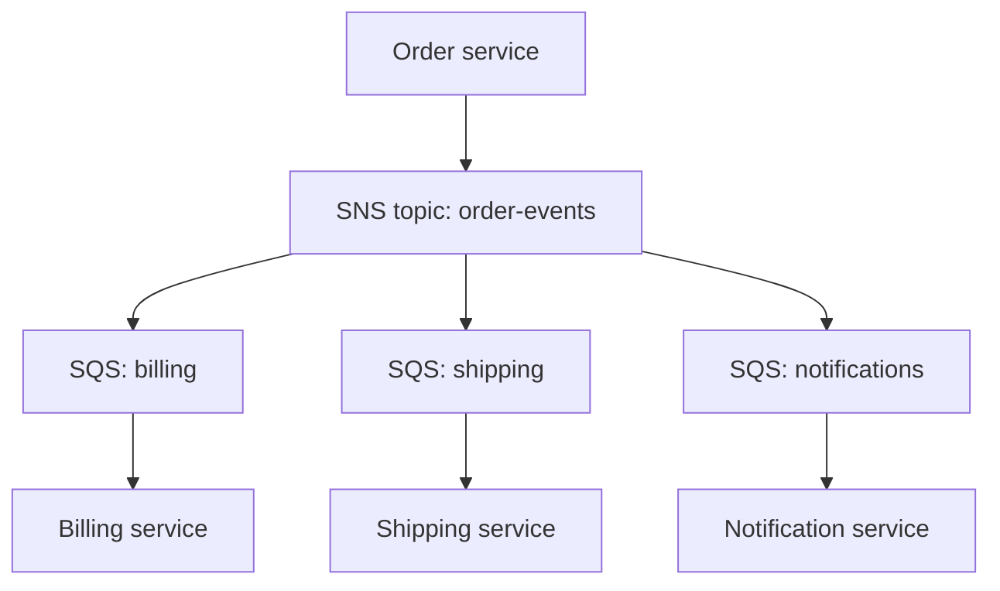

# AWS — Storage, Databases and Messaging — Interview Q&A

**What this covers:** where data lives on AWS and how services talk to each other
asynchronously — S3, RDS and Aurora, DynamoDB, ElastiCache, SQS, SNS, EventBridge,
Kinesis and MSK. The recurring interview question is "**which one would you use
here, and why?**" — so most answers end with a when-to-use rule.

**File 2 of 4 on AWS:** [09 Compute, IAM, networking](09_AWS_Compute_IAM_Networking_QA.md) ·
**10 Storage, databases, messaging** ·
[11 Serverless, containers, DevOps](11_AWS_Serverless_Containers_DevOps_QA.md) ·
[12 Architecture, practices, scenarios](12_AWS_Architecture_Practices_Scenarios_QA.md)

**How the facts were checked:** stable AWS facts come from my own knowledge. Limits
that changed recently were confirmed against AWS announcements on 7 Oct 2026 and are
marked "(confirmed …)"; links are under Sources at the end.

## Weight legend

| Mark | What it means | How the answer is written |
| --- | --- | --- |
| ★★★ | Asked in almost every AWS round, with follow-ups | Answer, mechanism, example, traps |
| ★★ | Asked often | Answer and one example or table |
| ★ | Occasional, or a senior-level bonus | Two to four lines |

## Contents

| # | Question | Weight | One-line answer |
| --- | --- | --- | --- |
| 1 | [S3 fundamentals](#1-s3-fundamentals) | ★★★ | Objects in buckets; strongly consistent; up to 50 TB per object |
| 2 | [Storage classes, lifecycle](#2-s3-storage-classes-and-lifecycle-rules) | ★★★ | Match class to access pattern; lifecycle moves data down |
| 3 | [Securing S3](#3-securing-s3) | ★★★ | Block Public Access, policies, encryption, pre-signed URLs |
| 4 | [Versioning, replication, Object Lock](#4-versioning-replication-and-object-lock) | ★★ | Protect against deletes, regions, and tampering |
| 5 | [S3 performance](#5-s3-performance-and-large-files) | ★★ | Parallelize: prefixes, multipart, byte ranges |
| 6 | [RDS vs Aurora vs EC2](#6-rds-vs-aurora-vs-a-database-on-ec2) | ★★★ | Managed by default; Aurora for HA and read scale |
| 7 | [Multi-AZ vs read replicas](#7-multi-az-vs-read-replicas) | ★★★ | Availability vs read scaling — different jobs |
| 8 | [Backups and PITR](#8-backups-snapshots-and-point-in-time-recovery) | ★★ | Restore creates a **new** instance |
| 9 | [Connections and read scaling](#9-database-connections-rds-proxy-and-scaling-reads) | ★★ | Pool × instances < max_connections; RDS Proxy |
| 10 | [DynamoDB fundamentals](#10-dynamodb-fundamentals) | ★★★ | Keys, capacity modes, Query not Scan, GSIs |
| 11 | [DynamoDB modelling](#11-dynamodb-data-modelling-and-hot-partitions) | ★★★ | Design from access patterns; spread the partition key |
| 12 | [Streams, TTL, global tables, DAX](#12-dynamodb-streams-ttl-global-tables-and-dax) | ★★ | Change feed, auto-expiry, multi-region, cache |
| 13 | [DynamoDB or RDS?](#13-dynamodb-or-rds) | ★★★ | Known patterns at scale vs flexible queries |
| 14 | [ElastiCache and caching](#14-elasticache-and-caching-strategies) | ★★★ | Cache-aside with TTL; plan for stampedes |
| 15 | [SQS essentials](#15-sqs-essentials) | ★★★ | Visibility timeout, DLQ, long polling, idempotency |
| 16 | [Standard vs FIFO](#16-sqs-standard-vs-fifo) | ★★ | FIFO only when per-key order matters |
| 17 | [SNS fan-out](#17-sns-and-the-fan-out-pattern) | ★★ | One topic, one queue per consumer |
| 18 | [EventBridge](#18-eventbridge) | ★★ | Content-based routing, replay, scheduler |
| 19 | [Kinesis, Firehose, MSK](#19-kinesis-firehose-and-msk) | ★★ | Ordered replayable streams; Firehose just delivers |
| 20 | [Choosing messaging](#20-choosing-a-messaging-service) | ★★★ | Queue, fan-out, route, or stream |
| 21 | [Choosing a database](#21-choosing-a-database-on-aws) | ★★ | Purpose-built: one table of who does what |

---

## 1. S3 fundamentals

**Weight:** ★★★

- **Bucket:** a container with a **globally unique** name, created in one region.
- **Object:** the data plus metadata, addressed by a **key**. There are no real
  folders — `invoices/2026/10/inv-1.pdf` is one key; the slashes are just a naming
  convention (prefixes).
- **Durability:** designed for 99.999999999% ("eleven nines") by storing data across
  multiple AZs (except One Zone classes).
- **Consistency:** strong read-after-write for all operations since December 2020 —
  after a successful write, every read and list sees it.
- **Size:** objects up to **50 TB** (confirmed: AWS announcement, Dec 2025; it was
  5 TB). A single PUT is limited to 5 GB — larger objects use multipart upload.

**When to use S3:** user uploads, documents, images and video, backups, logs, data
lakes, static website assets (with CloudFront), build artifacts.

**When not:** as a file system that apps lock and modify in place (use EFS), or for
small, frequently updated records (use a database).

---

## 2. S3 storage classes and lifecycle rules

**Weight:** ★★★

| Class | Access pattern | Retrieval | Minimum billed duration |
| --- | --- | --- | --- |
| Standard | Frequent | Milliseconds | — |
| Intelligent-Tiering | Unknown or changing | Milliseconds (optional archive tiers are slower) | — (small per-object monitoring fee) |
| Standard-IA | Infrequent, must stay multi-AZ | Milliseconds + per-GB retrieval fee | 30 days |
| One Zone-IA | Infrequent, can be re-created | Milliseconds | 30 days |
| Glacier Instant Retrieval | Rare, but needs instant access | Milliseconds | 90 days |
| Glacier Flexible Retrieval | Archive | Minutes to hours | 90 days |
| Glacier Deep Archive | Long-term archive, compliance | Within 12 hours (bulk: up to 48) | 180 days |
| Express One Zone | Latency-critical, high request rates | Single-digit milliseconds | — |

**Lifecycle rules** move or delete objects automatically, by age or prefix:

```text
invoices/   Standard → Standard-IA after 30 days → Glacier Flexible after 365 days
            → delete after 7 years
tmp/        delete after 7 days
all         abort incomplete multipart uploads after 7 days
            delete non-current versions after 90 days
```

**Traps:**

- **Minimum durations and per-object overheads:** moving millions of tiny objects to IA
  or Glacier can *raise* the bill. Small objects are often better left in Standard.
- **Incomplete multipart uploads** are invisible in listings but billed — always add
  the abort rule.
- **Intelligent-Tiering** is the safe default when nobody knows the access pattern.

---

## 3. Securing S3

**Weight:** ★★★

| Control | What it does | Practice |
| --- | --- | --- |
| **Block Public Access** | Overrides any policy or ACL that would make data public | On, at **account** level; on by default for new buckets since April 2023 |
| **Object Ownership** | Disables ACLs; the bucket owner owns every object | "Bucket owner enforced" (the default for new buckets since April 2023) |
| **Bucket policy** | Resource-based: who may do what on this bucket | Cross-account access, enforce TLS, restrict to a VPC endpoint |
| **IAM policy** | Identity-based: what this role may do | Least privilege per application |
| **Encryption** | All new objects are encrypted (SSE-S3) by default since Jan 2023 | SSE-KMS when you need key control and audit; enable S3 Bucket Keys to cut KMS request cost |
| **Pre-signed URLs** | Time-limited access to one object with the signer's permissions | Uploads and downloads from browsers and mobile apps |
| **Access points** | Named endpoints with their own policies | Large shared buckets with many consumers |

**Enforce TLS** with a bucket policy statement that denies requests where
`aws:SecureTransport` is `false`.

**Interview follow-up — "user uploads from a browser":** the backend checks
permissions and returns a **pre-signed PUT URL**; the browser uploads straight to S3;
an S3 event notification (to SQS, EventBridge or Lambda) tells the backend the file
arrived. The file never passes through your servers.

**Detection:** CloudTrail data events (who read what), Amazon Macie (finds personal
data in buckets), IAM Access Analyzer (flags buckets shared outside the account).

---

## 4. Versioning, replication and Object Lock

**Weight:** ★★

- **Versioning** keeps every version of every object. A DELETE adds a *delete marker*
  instead of destroying data — protection against accidental deletes and overwrites.
  Old versions are billed, so pair it with a lifecycle rule for non-current versions.
- **Replication** copies new objects to another bucket — **CRR** (another region, for
  DR or latency) or **SRR** (same region, e.g. into a separate account for backups).
  Requires versioning on both buckets. It is asynchronous; **Replication Time Control**
  adds an SLA (most objects within 15 minutes).
- **Object Lock** (WORM: write once, read many) blocks deletes and overwrites until a
  retention date. **Governance** mode can be bypassed with a special permission;
  **compliance** mode can't be bypassed by anyone, including root. Used for regulatory
  records and as ransomware protection for backups.

---

## 5. S3 performance and large files

**Weight:** ★★

- S3 scales per **prefix**: at least 3,500 writes and 5,500 reads per second per
  prefix. Spread hot data across prefixes for more.
- **Multipart upload:** split large files into parts uploaded in parallel and retried
  individually — recommended above about 100 MB.
- **Byte-range GETs:** download parts of an object in parallel.
- **Transfer Acceleration:** uploads go through the nearest edge location — for users
  far from the bucket's region.
- **CloudFront** in front of S3 for read-heavy public content.
- **503 Slow Down** errors mean you hit the request rate — back off and retry (the SDKs
  do this), and spread keys across prefixes.

---

## 6. RDS vs Aurora vs a database on EC2

**Weight:** ★★★

| | RDS | Aurora | Self-managed on EC2 |
| --- | --- | --- | --- |
| Engines | MySQL, PostgreSQL, MariaDB, Oracle, SQL Server, Db2 | MySQL- and PostgreSQL-compatible | Anything |
| Storage | EBS volumes per instance | Shared distributed storage: 6 copies across 3 AZs, grows automatically | Your EBS / instance store |
| Read replicas | Up to 15, asynchronous (confirmed: AWS, 2022) | Up to 15, sharing the same storage — very low lag | You build it |
| Failover | Multi-AZ: typically 1–2 minutes | Typically under 30 seconds | You build it |
| You manage | Schema, queries, parameters, sizing | Same | Everything: OS, patching, backups, HA |
| Extras | — | Serverless v2 (auto-scaling capacity), Global Database (cross-region) | Full OS access, any extension or version |

**How to answer:**

- **Default to a managed service.** Patching, backups and failover are solved problems
  you don't want to own.
- **Aurora** when you need fast failover, many read replicas, or cross-region
  replication. It usually costs more than RDS for small, steady workloads.
- **EC2** only for something managed services don't support (an engine version, an
  extension, OS-level tuning) — and accept the operational work.

---

## 7. Multi-AZ vs read replicas

**Weight:** ★★★ — the most common RDS question; they solve **different** problems.

| | Multi-AZ | Read replica |
| --- | --- | --- |
| Purpose | **Availability** — survive an instance or AZ failure | **Read scaling** (and a DR copy) |
| Replication | Synchronous | Asynchronous — replicas lag behind |
| Readable? | Classic Multi-AZ standby: **no**. Multi-AZ DB *cluster* (MySQL, PostgreSQL): two readable standbys | Yes |
| Failover | Automatic; the same endpoint DNS moves to the standby | Manual **promotion**, which creates a separate standalone database |
| Cross-region | No | Yes |

**Traps:**

- "We have read replicas, so we're highly available" — **wrong**. Replicas don't fail
  over automatically on RDS. Use Multi-AZ for availability (Aurora replicas are the
  exception: they *are* failover targets).
- **Replica lag:** a user who saves and immediately reloads may read old data from a
  replica. Send read-your-own-write requests to the primary.
- Applications must reconnect after failover — use connection pools that validate
  connections, and short DNS caching in the JVM.

---

## 8. Backups, snapshots and point-in-time recovery

**Weight:** ★★

- **Automated backups:** a daily snapshot plus transaction logs, kept 1–35 days.
  Enables **point-in-time recovery (PITR)** to any second in that window (usually up
  to about 5 minutes ago).
- **Manual snapshots:** kept until you delete them; can be copied to other regions and
  accounts.
- **The trap:** restoring (from a snapshot or PITR) creates a **new** database instance
  with a **new endpoint**. Applications must be pointed at it — plan that step in the
  runbook.
- **AWS Backup** applies one backup policy across RDS, DynamoDB, EBS, EFS and S3, with
  cross-account copies (protection if an account is compromised).
- **A backup you have never restored is not a backup.** Schedule restore tests and time
  them — that is your real RTO.

---

## 9. Database connections, RDS Proxy and scaling reads

**Weight:** ★★

- Each connection uses database memory; `max_connections` depends on instance size.
- **Budget:** pool size × number of app instances (× 2 during a rolling deployment)
  must stay under `max_connections`. Twenty containers with a pool of 20 = 400.
- **RDS Proxy** sits between the apps and the database, sharing a smaller set of real
  connections among many clients. It also makes failover faster for clients and
  supports IAM authentication. **Essential for Lambda**, where thousands of concurrent
  functions would otherwise each open connections.
- **Scaling reads, in order:** fix slow queries and indexes → cache hot reads
  (ElastiCache) → read replicas (Aurora's reader endpoint balances across them) →
  only then a bigger instance.
- **Scaling writes** is harder: a bigger instance, batching, or partitioning the data
  (sharding, or moving a workload to DynamoDB).

---

## 10. DynamoDB fundamentals

**Weight:** ★★★

- A **table** holds **items** (up to **400 KB** each) made of attributes. No fixed
  schema beyond the key.
- **Primary key:** a **partition key**, or a partition key + **sort key**. The
  partition key decides which physical partition stores the item.

**Capacity modes:**

| | On-demand | Provisioned |
| --- | --- | --- |
| Billing | Per request | Per hour for read and write capacity units |
| Scaling | Instant, automatic | Auto Scaling adjusts within limits; can throttle on sudden spikes |
| Best for | New, spiky or unpredictable traffic | Steady, predictable traffic (cheaper) |

Capacity units: one **RCU** = one strongly consistent read per second of up to 4 KB
(or two eventually consistent); one **WCU** = one write per second of up to 1 KB.

**Reading data:**

- **GetItem** — one item by full key.
- **Query** — items with one partition key, optionally a sort-key condition
  (`begins_with`, `between`). Efficient.
- **Scan** — reads the **whole table**. Slow and expensive; avoid in request paths.

**Indexes:**

| | Local secondary index (LSI) | Global secondary index (GSI) |
| --- | --- | --- |
| Key | Same partition key, different sort key | Any partition and sort key |
| When created | Only with the table | Any time |
| Consistency | Strong or eventual | Eventual only |
| Capacity | Shares the table's | Its own |

**Other facts:** reads are eventually consistent by default (strong is optional);
transactions cover up to 100 items; conditional writes give optimistic locking (a
version attribute); point-in-time recovery is available.

---

## 11. DynamoDB data modelling and hot partitions

**Weight:** ★★★

**The mindset change:** in a relational database you model entities, then write any
query. In DynamoDB you **list the access patterns first**, then design keys so each
pattern is a single Query. There are no joins.

**Example — single-table design for an orders service:**

| Access pattern | Key condition |
| --- | --- |
| Get a customer's profile | `PK = CUSTOMER#42`, `SK = PROFILE` |
| List a customer's orders, newest first | `PK = CUSTOMER#42`, `SK begins_with ORDER#`, descending |
| Get one order by its id | GSI1: `GSI1PK = ORDER#9876` |
| List open orders for a warehouse | GSI2: `GSI2PK = WAREHOUSE#7#OPEN` |

Order items are stored with `SK = ORDER#2026-10-07#9876`, so sorting by sort key gives
date order.

**Hot partitions:** throughput is spread across partitions by the partition key. A
key with few distinct values, or one very busy value, concentrates traffic on one
partition, which gets **throttled** even though the table has spare capacity.

- Bad: `PK = status` (most items are `ACTIVE`); `PK = today's date` for a write-heavy
  log (every write today hits one partition).
- Fix: high-cardinality keys (customer id, order id), or **write sharding** — add a
  random suffix `DATE#2026-10-07#7` across N shards and query all N when reading.

**Other modelling rules:** keep items small (put large blobs in S3 and store the key);
use sparse GSIs (only items with the attribute are indexed); paginate with
`LastEvaluatedKey`.

---

## 12. DynamoDB Streams, TTL, global tables and DAX

**Weight:** ★★

| Feature | What it does | Typical use |
| --- | --- | --- |
| **Streams** | An ordered log of item changes per key, kept 24 hours | Trigger Lambda on changes; sync to search; publish events (an outbox) |
| **TTL** | Deletes items after a timestamp attribute passes, in the background (not instantly) at no cost | Sessions, idempotency keys, temporary data |
| **Global tables** | The table replicated across regions, writable in every region | Multi-region active-active; conflicts resolved last-writer-wins by default |
| **DAX** | An in-memory cache in front of DynamoDB with the same API | Microsecond reads for read-heavy hot items (eventually consistent reads only) |

**Trap:** TTL deletion can lag well behind the expiry time — filter out expired items
in queries if exact expiry matters.

---

## 13. DynamoDB or RDS?

**Weight:** ★★★

| Choose DynamoDB when | Choose RDS / Aurora when |
| --- | --- |
| Access patterns are known and few | Queries are ad hoc or still changing |
| You need very large scale with predictable single-digit-ms latency | You need joins, aggregates, reporting |
| Key-value or simple hierarchical data (sessions, carts, profiles, events) | Rich relationships and constraints (orders, payments, inventory) |
| Serverless, spiky traffic (on-demand capacity, no connections to manage) | Multi-row transactions are central to the domain |
| Multi-region active-active is a requirement | The team's skills and tools are SQL |

**Senior answer:** most systems use **both** — a relational database for the core
transactional domain, DynamoDB for high-volume, simple-access data such as sessions,
idempotency keys, carts, or event history.

---

## 14. ElastiCache and caching strategies

**Weight:** ★★★

**Engines:** Valkey (the open-source Redis fork, which AWS prices lower), Redis OSS and
Memcached. A **serverless** option removes capacity planning.

| | Valkey / Redis OSS | Memcached |
| --- | --- | --- |
| Data types | Strings, hashes, lists, sets, sorted sets, streams | Strings only |
| Replication and failover | Yes (Multi-AZ) | No |
| Persistence | Optional | No |
| Use for | Most caching, sessions, rate limits, leaderboards, locks | Simple, multi-threaded, throwaway cache |

**Caching strategies:**

| Strategy | How | Trade-off |
| --- | --- | --- |
| **Cache-aside** (lazy loading) | Read cache → on miss, read DB and fill cache with a TTL | The default; first read after expiry is slow; data can be stale up to the TTL |
| Write-through | Write DB and cache together | Fresher; caches data nobody reads |
| Write-behind | Write cache; flush to DB later | Fast writes; risk of losing data |

**Problems to name and solve:**

- **Invalidation:** delete the key on update, and keep a TTL as a safety net.
- **Stampede:** a hot key expires and thousands of requests hit the database at once.
  Fixes: a short lock so one request refills it; refresh before expiry; add random
  **jitter** to TTLs so keys don't expire together.
- **Hot keys:** one key gets most traffic — replicate it or cache it locally in the
  app as well.
- **Cold start:** after a restart or failover the cache is empty — the database must
  survive the miss rate, or warm the cache first.

**Durable Redis-compatible database:** Amazon **MemoryDB** — when the data must not be
lost, not just cached.

---

## 15. SQS essentials

**Weight:** ★★★

**How it works:** a producer sends a message; a consumer **polls**, receives it,
processes it, and **deletes** it. While being processed, the message is hidden from
other consumers for the **visibility timeout**.

| Setting | Default | Range / limit |
| --- | --- | --- |
| Visibility timeout | 30 seconds | Up to 12 hours |
| Message retention | 4 days | 1 minute to 14 days |
| Maximum message size | 1 MiB (confirmed: AWS, Aug 2025 — was 256 KiB) | Larger payloads: store in S3, send a pointer |
| Long polling (`WaitTimeSeconds`) | Off (short polling) | Up to 20 seconds |
| Delivery delay | 0 | Up to 15 minutes |
| Batch size | — | Up to 10 messages per send/receive/delete |

**Must-know behaviours:**

- **At-least-once delivery:** a message can be delivered more than once. **Consumers
  must be idempotent** — store processed message ids or business keys with a unique
  constraint.
- **Visibility timeout > processing time.** Otherwise the message reappears mid-work
  and a second consumer processes it too. Long jobs extend visibility while working.
- **Failures:** if the consumer doesn't delete the message, it reappears after the
  timeout. After `maxReceiveCount` receives, the **redrive policy** moves it to a
  **dead-letter queue (DLQ)**. Alarm on DLQ depth; redrive back after fixing the bug.
- **Long polling** (e.g. 20 s) cuts empty responses and cost — turn it on.

**Scaling consumers:** scale on **backlog per worker** (visible messages ÷ workers)
rather than CPU; alarm on `ApproximateAgeOfOldestMessage` — it tells you how far
behind you are.

---

## 16. SQS standard vs FIFO

**Weight:** ★★

| | Standard | FIFO (name ends in `.fifo`) |
| --- | --- | --- |
| Ordering | Best effort | Strict within a **message group** |
| Duplicates | Possible | Removed within a 5-minute deduplication window |
| Throughput | Nearly unlimited | 300 messages/s per API action (3,000 with batching); much higher in high-throughput mode |
| Use for | Most background work | Per-entity ordering — all events of one order or account in sequence |

**How FIFO keeps parallelism:** order is only guaranteed **within a message group id**.
Use the entity id (order id) as the group: one order's events are processed in
sequence, different orders in parallel.

**Trap:** one failing message blocks the rest of its group until it succeeds or moves
to the DLQ.

**Senior answer:** prefer a standard queue plus idempotent, order-tolerant consumers
(e.g. ignore an event older than the stored version). Use FIFO only when ordering
really can't be handled in the consumer.

---

## 17. SNS and the fan-out pattern

**Weight:** ★★

- **SNS** is push-based publish/subscribe. A message published to a **topic** is pushed
  to every subscriber: SQS queues, Lambda, HTTP(S) endpoints, email, SMS, mobile push,
  Data Firehose. It doesn't store messages for later.
- **Filter policies** let a subscription receive only matching messages (e.g.
  `eventType = OrderCancelled`).
- **FIFO topics** exist, paired with FIFO queues, for ordered fan-out.

**Fan-out:**



**Why a queue per consumer instead of SNS straight to each service:** each consumer
gets its own buffer, retries, DLQ and pace. If notifications are down for an hour,
their messages wait; billing and shipping continue unaffected. Adding a consumer means
adding a subscription — the producer doesn't change.

---

## 18. EventBridge

**Weight:** ★★

- An **event bus** with **rules** that match event content (any field, not just a
  type) and send matches to **targets** — Lambda, SQS, Step Functions, API
  destinations (any HTTP API), other buses, and more.
- The **default bus** already receives events from AWS services (an EC2 state change, a
  CodePipeline failure); **partner buses** receive events from SaaS products.
- **Archive and replay** — re-send past events to recover or test a new consumer.
- **Schema registry** — discovers and documents event shapes.
- **EventBridge Scheduler** — one-time and recurring schedules at scale (replacing
  "cron on a server").
- **EventBridge Pipes** — point-to-point: source (SQS, DynamoDB Streams, Kinesis) →
  filter → enrich → target, without glue code.

**EventBridge or SNS?** EventBridge for routing many event types between many services
or accounts by content, SaaS integration, and replay. SNS for simple, high-throughput,
low-latency fan-out.

---

## 19. Kinesis, Firehose and MSK

**Weight:** ★★

**Kinesis Data Streams:**

- Data is split into **shards**. Each shard takes up to 1 MB/s or 1,000 records/s in,
  and serves 2 MB/s out (shared by readers, or per reader with *enhanced fan-out*).
- Records with the same **partition key** go to the same shard, **in order**.
- Kept from 24 hours (default) up to 365 days; **many consumers can read and re-read**
  the same data independently.
- On-demand mode removes shard planning.

**Amazon Data Firehose** (formerly Kinesis Data Firehose): a managed **delivery pipe** —
buffers records and writes them to S3, Redshift, OpenSearch or Splunk, optionally
transforming them. No consumers and no replay; it just delivers.

**MSK (Managed Streaming for Apache Kafka):** managed Kafka brokers (or MSK
Serverless). Partitions, consumer groups, configurable retention, Kafka Connect and
Kafka Streams. Choose it when the team knows Kafka, needs its ecosystem, or wants to
avoid AWS-specific APIs.

---

## 20. Choosing a messaging service

**Weight:** ★★★ — a favourite design question.

| Service | Model | Replay old messages? | Best for |
| --- | --- | --- | --- |
| SQS | Queue: each message handled by one consumer | No (kept up to 14 days until deleted) | Background jobs, decoupling, smoothing load spikes |
| SNS | Push to all subscribers; no storage | No | Fan-out to queues, Lambdas, HTTP, email |
| EventBridge | Bus with content-based routing rules | Yes (archive and replay) | Events between many services, accounts, SaaS |
| Kinesis Data Streams | Ordered stream per shard; many independent readers | Yes (up to 365 days) | High-volume ordered events, real-time analytics |
| MSK (Kafka) | Ordered log per partition; consumer groups | Yes (configurable) | Kafka semantics and ecosystem, portability |

**Rules of thumb:**

- One task, one worker, with retries → **SQS**.
- One event, several independent reactions → **SNS + SQS** (or EventBridge when routing
  rules or replay matter).
- Consumers must re-read history, or strict ordering at high volume → **Kinesis** or
  **MSK**.
- Whatever you choose: idempotent consumers, a DLQ (or equivalent), and an alarm on
  backlog age.

---

## 21. Choosing a database on AWS

**Weight:** ★★

| Need | Service | Example |
| --- | --- | --- |
| Relational data, transactions, joins | RDS or Aurora | Orders, payments, accounts |
| Key-value or document at massive scale | DynamoDB | Sessions, carts, user activity |
| In-memory cache | ElastiCache (Valkey, Redis OSS, Memcached) | Hot reads, rate limits, leaderboards |
| Durable in-memory database | MemoryDB | Redis-compatible primary store |
| MongoDB-compatible documents | DocumentDB | Content catalogues |
| Search and log analytics | OpenSearch Service | Product search, log search |
| Analytics warehouse | Redshift | BI dashboards over large history |
| Graph relationships | Neptune | Fraud rings, recommendations |
| Time series | Timestream | Metrics, IoT readings |
| Wide-column (Cassandra-compatible) | Keyspaces | Migrating Cassandra workloads |

**Interview framing:** AWS's position is "purpose-built databases" — choose by access
pattern, not one database for everything. **The counterpoint worth saying:** every
extra database is another thing to operate, secure, back up and keep consistent. Start
with one relational database plus a cache, and add a specialised store when a real
access pattern needs it.

---

## Sources

Recent changes confirmed on 7 Oct 2026:

- [Amazon S3 maximum object size increased to 50 TB (Dec 2025)](https://aws.amazon.com/about-aws/whats-new/2025/12/amazon-s3-maximum-object-size-50-tb/)
- [Amazon SQS maximum message size increased to 1 MiB (Aug 2025)](https://aws.amazon.com/about-aws/whats-new/2025/08/amazon-sqs-max-payload-size-1mib)
- [RDS for MySQL, MariaDB and PostgreSQL support 15 read replicas (Oct 2022)](https://aws.amazon.com/about-aws/whats-new/2022/10/amazon-rds-mysql-mariadb-postgre-sql-support-15-read-replicas-3x-read-capacity)
