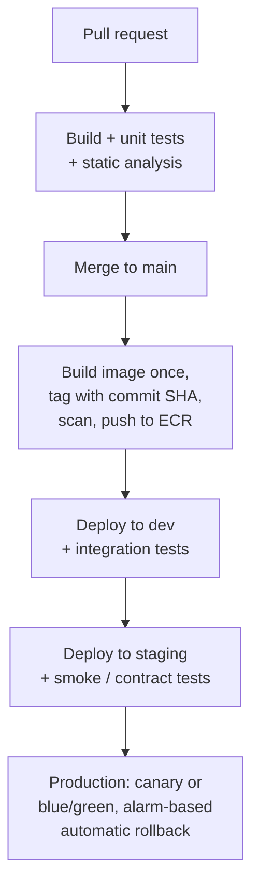
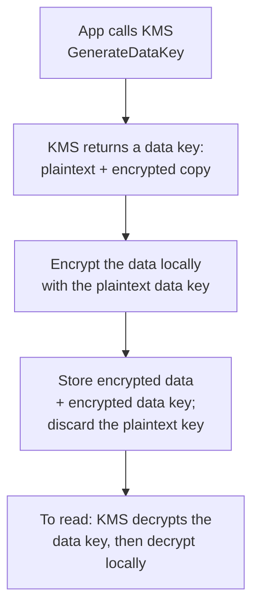

# AWS — Serverless, Containers and DevOps — Interview Q&A

**What this covers:** how code runs on AWS beyond plain EC2 — Lambda, API Gateway,
Step Functions, ECS, EKS — and how teams build, deploy, monitor and secure it:
infrastructure as code, CI/CD, deployment strategies, CloudWatch, tracing, CloudTrail,
secrets and KMS.

**File 3 of 4 on AWS:** [09 Compute, IAM, networking](09_AWS_Compute_IAM_Networking_QA.md) ·
[10 Storage, databases, messaging](10_AWS_Storage_Databases_Messaging_QA.md) ·
**11 Serverless, containers, DevOps** ·
[12 Architecture, practices, scenarios](12_AWS_Architecture_Practices_Scenarios_QA.md)

**How the facts were checked:** stable AWS facts come from my own knowledge. Recent
changes were confirmed against AWS and HashiCorp announcements on 7 Oct 2026 and are
marked "(confirmed …)"; links are under Sources at the end.

## Weight legend

| Mark | What it means | How the answer is written |
| --- | --- | --- |
| ★★★ | Asked in almost every AWS round, with follow-ups | Answer, mechanism, example, traps |
| ★★ | Asked often | Answer and one example or table |
| ★ | Occasional, or a senior-level bonus | Two to four lines |

## Contents

| # | Question | Weight | One-line answer |
| --- | --- | --- | --- |
| 1 | [How Lambda works, limits](#1-how-lambda-works-and-its-limits) | ★★★ | Reused execution environments; 15 min, 10 GB memory |
| 2 | [Cold starts](#2-cold-starts) | ★★★ | Init cost on new environments; SnapStart, provisioned concurrency |
| 3 | [Concurrency and throttling](#3-lambda-concurrency-and-throttling) | ★★ | Reserved caps and guarantees; provisioned pre-warms |
| 4 | [Invocation types, errors](#4-lambda-invocation-types-and-error-handling) | ★★★ | Sync, async, poll-based — each retries differently |
| 5 | [When not to use Lambda](#5-when-not-to-use-lambda) | ★★ | Steady heavy load, long jobs, strict latency |
| 6 | [API Gateway](#6-api-gateway) | ★★★ | REST vs HTTP API; 29 s timeout can now be raised |
| 7 | [Step Functions](#7-step-functions) | ★★ | Orchestrate steps, retries and sagas as a state machine |
| 8 | [ECS vs EKS, Fargate vs EC2](#8-ecs-vs-eks-fargate-vs-ec2) | ★★★ | ECS + Fargate unless you need Kubernetes |
| 9 | [ECS building blocks](#9-ecs-building-blocks) | ★★★ | Task definition, service, task role vs execution role |
| 10 | [EKS essentials](#10-eks-essentials) | ★★ | Managed control plane; you own nodes, add-ons, upgrades |
| 11 | [ECR and images](#11-ecr-and-container-image-practices) | ★ | Scan, tag by commit, lifecycle old images |
| 12 | [Infrastructure as code](#12-infrastructure-as-code) | ★★★ | Terraform or CDK/CloudFormation; no console changes |
| 13 | [CI/CD pipeline](#13-a-cicd-pipeline-on-aws) | ★★★ | Build once, deploy the same image everywhere, OIDC |
| 14 | [Deployment strategies](#14-deployment-strategies) | ★★★ | Rolling, blue/green, canary — with alarm rollback |
| 15 | [CloudWatch](#15-cloudwatch) | ★★★ | Metrics, logs, alarms; set log retention |
| 16 | [Tracing](#16-tracing-with-x-ray-and-opentelemetry) | ★★ | OpenTelemetry via ADOT; X-Ray as a backend |
| 17 | [CloudTrail vs CloudWatch vs Config](#17-cloudtrail-vs-cloudwatch-vs-config) | ★★★ | Who did it vs how it performs vs how it's configured |
| 18 | [Secrets Manager vs Parameter Store](#18-secrets-manager-vs-parameter-store) | ★★ | Rotating credentials vs configuration |
| 19 | [KMS](#19-kms-and-envelope-encryption) | ★★ | Envelope encryption; key policies; rotation |

---

## 1. How Lambda works, and its limits

**Weight:** ★★★

**Mechanism:** Lambda runs your function in an **execution environment** (a micro-VM).

1. **Init** — download the code, start the runtime, run code outside the handler
   (static initialisers, SDK clients). Happens once per environment.
2. **Invoke** — the handler runs. The environment is **reused** for later requests,
   one request at a time.
3. **Shutdown** — idle environments are removed after a while.

So **concurrency = number of environments running at once**, and anything created
during Init (SDK clients, connection pools) is reused across invocations — create it
outside the handler.

| Limit | Value |
| --- | --- |
| Memory | 128 MB – 10,240 MB (CPU scales with memory) |
| Timeout | Up to 15 minutes |
| `/tmp` storage | 512 MB – 10,240 MB |
| Synchronous payload | 6 MB |
| Asynchronous payload | 1 MB (confirmed: AWS, Oct 2025 — was 256 KB) |
| Package | 50 MB zipped upload, 250 MB unzipped; container images up to 10 GB |
| Concurrency | 1,000 per region by default (a soft quota you can raise) |

**Pricing:** per request plus **GB-seconds** (memory × duration, per millisecond).
Raising memory often makes a function *cheaper* — more CPU finishes the work faster.
Graviton (`arm64`) costs less per GB-second.

---

## 2. Cold starts

**Weight:** ★★★

**What it is:** a request that arrives when no idle environment exists has to wait for
**Init**. For Java with a framework, that can be seconds. It happens on first traffic,
on scale-out, and after deployments.

**Ways to reduce it, cheapest first:**

| Fix | Effect |
| --- | --- |
| Smaller package, fewer dependencies, lazy initialisation | Less to load |
| `JAVA_TOOL_OPTIONS=-XX:+TieredCompilation -XX:TieredStopAtLevel=1` | Faster JVM start for short-lived functions |
| More memory | More CPU during Init |
| **SnapStart** (Java, Python, .NET) | Lambda snapshots the initialised environment and restores it — large reduction for Java |
| **Provisioned concurrency** | Keeps N environments initialised — no cold start for them, but you pay while idle |
| GraalVM native image | Millisecond startup; longer builds, reflection limits |
| Lighter frameworks | Less reflection and classpath scanning at startup |

**SnapStart caveats:** anything unique created during Init (random seeds, ids, open
network connections) is restored identically in every copy — re-create those after
restore (runtime hooks).

**VPC myth:** putting a function in a VPC no longer adds a large cold-start penalty —
AWS changed VPC networking for Lambda in 2019.

---

## 3. Lambda concurrency and throttling

**Weight:** ★★

- **Estimate:** concurrency ≈ requests per second × average duration in seconds.
  100 req/s × 0.5 s = 50 concurrent environments.
- **The account limit is shared** by every function in the region. One runaway
  function can starve the others.

| Setting | What it does | Use for |
| --- | --- | --- |
| **Reserved concurrency** | Guarantees *and caps* a function's concurrency (0 = disabled) | Protect critical functions; stop one function overwhelming a database |
| **Provisioned concurrency** | Keeps environments initialised (billed) | Latency-sensitive APIs without cold starts |

**When throttled:** synchronous callers get **429 TooManyRequests**; asynchronous events
are retried automatically for up to 6 hours; poll-based sources slow down.

**Protecting a database:** cap the function's reserved concurrency to what the
database can handle, and put **RDS Proxy** in between.

---

## 4. Lambda invocation types and error handling

**Weight:** ★★★

| Type | Triggered by | On error |
| --- | --- | --- |
| **Synchronous** | API Gateway, ALB, a direct SDK `Invoke` | The error goes back to the caller; **the caller** decides whether to retry |
| **Asynchronous** | S3 events, SNS, EventBridge | Lambda retries up to 2 more times (configurable), keeps the event up to 6 hours, then sends it to an **on-failure destination** or a DLQ |
| **Poll-based** (event source mapping) | SQS, Kinesis, DynamoDB Streams, MSK | Lambda polls and invokes with **batches**; behaviour depends on the source (below) |

**Poll-based details — the follow-up interviewers love:**

- **SQS:** if the function fails, the **whole batch** returns to the queue after the
  visibility timeout. Return **partial batch failures** (`ReportBatchItemFailures`) so
  only the failed messages are retried. After `maxReceiveCount`, the queue's DLQ takes
  them.
- **Kinesis / DynamoDB Streams:** records are ordered per shard, so a failing batch
  **blocks the shard** until it succeeds or the records expire. Configure *bisect batch
  on error*, a maximum retry count, a maximum record age, and an on-failure
  destination.

**Everything is at-least-once** — make handlers idempotent (for example, an idempotency
key stored in DynamoDB with a conditional write).

---

## 5. When not to use Lambda

**Weight:** ★★

| Situation | Why | Better choice |
| --- | --- | --- |
| Steady high traffic all day | Per-request pricing exceeds always-on containers | ECS/Fargate or EC2 |
| Jobs longer than 15 minutes | Hard timeout | ECS tasks, AWS Batch, Step Functions + containers |
| Strict, consistent low latency | Cold starts | Containers, or provisioned concurrency |
| Long-lived connections, in-memory state | Environments are short-lived and isolated | Containers |
| Heavy relational database use at high concurrency | Connection storms | Containers with a pool, or RDS Proxy |

**Where Lambda shines:** event handlers (S3 upload → thumbnail, queue consumers,
scheduled jobs), glue between services, spiky or low-volume APIs, automation.

---

## 6. API Gateway

**Weight:** ★★★

| | REST API | HTTP API | WebSocket API |
| --- | --- | --- | --- |
| Use for | Full feature set | Most new simple APIs — cheaper and faster | Two-way real-time messaging |
| Features | API keys and usage plans, request validation, caching, WAF, private APIs, transformations | JWT authorizers built in, Lambda and HTTP integrations, CORS | Connection management, routes by message |

**Authentication options:** IAM (SigV4-signed requests, service to service), Cognito
user pools, **Lambda authorizers** (custom logic), JWT authorizers (HTTP APIs, any OIDC
provider).

**Limits worth knowing:**

- **Throttling:** 10,000 requests/s steady with a 5,000 burst per region by default,
  plus per-stage, per-method and per-API-key (usage plan) limits.
- **Integration timeout:** 29 seconds by default. For Regional and private REST APIs it
  can now be raised through a quota request, possibly lowering the throttle quota
  (confirmed: AWS announcement, June 2024).
- **Payload:** 10 MB.

**API Gateway or ALB in front of your service?** API Gateway for API management (keys,
quotas, auth, transformations, serverless backends). An ALB is cheaper at high steady
volume when you only need routing to containers. Many teams use an ALB for container
services and API Gateway for public partner APIs or Lambda backends.

---

## 7. Step Functions

**Weight:** ★★

- A **state machine** service: you define steps (tasks, choices, parallel branches,
  maps, waits), and Step Functions runs them with built-in **retries with backoff**,
  **error catching**, and a visual history of each execution.

| | Standard workflow | Express workflow |
| --- | --- | --- |
| Duration | Up to 1 year | Up to 5 minutes |
| Execution semantics | Exactly-once | At-least-once |
| Price | Per state transition | Per duration and requests |
| Use for | Business processes, long waits, human approval | High-volume, short event processing |

**Interview uses:**

- **Saga pattern:** order → reserve stock → charge payment → ship; if payment fails,
  run the **compensating** steps (release stock) instead of a distributed transaction.
- **Waiting for a human or an external system:** a task token pauses the workflow
  until a callback.
- **Direct service integrations:** call DynamoDB, SQS, ECS and many more without a
  Lambda in between.
- **Large batch processing:** the distributed map runs a step over millions of S3
  objects in parallel.

---

## 8. ECS vs EKS, Fargate vs EC2

**Weight:** ★★★

**Two separate decisions:** the **orchestrator** (ECS or EKS) and **where containers
run** (Fargate or EC2 instances you manage).

| | ECS | EKS |
| --- | --- | --- |
| What it is | AWS's own container orchestrator | Managed Kubernetes |
| Learning curve | Low — few concepts | High — Kubernetes plus AWS integrations |
| Control plane cost | Free | Charged per cluster per hour |
| Ecosystem | AWS-native integrations | Kubernetes tooling: Helm, operators, service meshes, Argo CD |
| Portability | AWS only | Runs on any cloud or on-prem |
| Choose when | You want to run containers on AWS with the least operations | You already use Kubernetes, need its ecosystem, or need portability |

| | Fargate | EC2 launch type / nodes |
| --- | --- | --- |
| Servers to manage | None | You manage the instances (AMIs, patching, scaling) |
| Pricing | Per task vCPU and memory | Per instance — cheaper when packed densely |
| Limits | No GPUs, no privileged containers, no host access | Anything, including GPUs and daemon processes |
| Choose when | Default for most services | GPUs, very large fleets where packing saves money, special host needs |

**What many companies do:** ECS on Fargate for most microservices; EKS where a platform
team already runs Kubernetes. AWS also offers middle options where it manages the EC2
hosts for you (ECS Managed Instances, EKS Auto Mode).

---

## 9. ECS building blocks

**Weight:** ★★★

| Concept | What it is |
| --- | --- |
| **Cluster** | A logical group of services and capacity |
| **Task definition** | The versioned blueprint: image, CPU and memory, ports, environment variables, secrets, log settings, IAM roles, health check |
| **Task** | A running instance of a task definition — one or more containers |
| **Service** | Keeps N tasks running, replaces failed ones, registers them with a load balancer, deploys new versions, scales |
| **Capacity provider** | Where tasks run: `FARGATE`, `FARGATE_SPOT`, or an Auto Scaling group of EC2 |

**Task role vs task execution role — the classic trap:**

| | Task execution role | Task role |
| --- | --- | --- |
| Used by | The ECS agent | **Your application code** |
| For | Pull the image from ECR, write logs, fetch secrets to inject at start | Call S3, SQS, DynamoDB… at runtime |

"My app gets AccessDenied though the role has the permission" is often a permission on
the wrong role.

**Service settings that come up:**

- **Rolling deployment:** `minimumHealthyPercent` and `maximumPercent` decide how many
  old tasks stay while new ones start (e.g. 100 / 200 = start new tasks first, then
  stop old).
- **Deployment circuit breaker** with rollback: a deployment whose tasks keep failing
  rolls back automatically.
- **Service auto scaling:** target tracking on CPU, memory, or ALB requests per target.
- **Service Connect / Cloud Map:** service-to-service discovery by name.
- **ECS Exec:** a shell into a running container through Session Manager.

---

## 10. EKS essentials

**Weight:** ★★

- **AWS runs the control plane** (API server, etcd) across AZs. **You** run the worker
  nodes and cluster add-ons.

| Topic | Options and practice |
| --- | --- |
| Nodes | Managed node groups, self-managed nodes, Fargate profiles, **Karpenter** (provisions right-sized nodes on demand, Spot-friendly), or **EKS Auto Mode** (AWS manages the nodes) |
| Networking | The VPC CNI gives every pod a VPC IP address — size subnets generously or use prefix delegation, or pods fail to schedule |
| Load balancing | AWS Load Balancer Controller: an Ingress creates an ALB, a Service creates an NLB |
| IAM for pods | IAM Roles for Service Accounts, or EKS Pod Identity |
| Secrets | Secrets Store CSI driver or External Secrets Operator, backed by Secrets Manager |
| Deployments | GitOps with Argo CD or Flux; Helm charts |
| Observability | Container Insights, Amazon Managed Prometheus and Grafana |

**Upgrades are your job:** Kubernetes releases new minor versions regularly, and EKS
supports each only for a limited time before paid extended support. Treat upgrades
as a routine, tested process — not a once-every-two-years project.

---

## 11. ECR and container image practices

**Weight:** ★

- **ECR** is AWS's private registry: image scanning (basic, or enhanced with Amazon
  Inspector), **lifecycle policies** to delete old images, **tag immutability**,
  cross-region replication, and a **pull-through cache** for public registries (avoids
  Docker Hub rate limits).
- **Image practices:** tag with the git commit SHA (never deploy `latest`); small base
  images; multi-stage builds; run as a non-root user; build multi-architecture images
  if you use Graviton.
- **For Spring Boot:** layered jars or buildpacks/Jib, so a code change rebuilds only
  the small application layer, not the dependencies.

---

## 12. Infrastructure as code

**Weight:** ★★★

| | CloudFormation | CDK | Terraform |
| --- | --- | --- | --- |
| Written in | YAML or JSON | TypeScript, Python, Java… (generates CloudFormation) | HCL |
| Clouds | AWS only | AWS only | Many clouds and SaaS providers |
| State | Managed by AWS | Managed by AWS (via CloudFormation) | A state file you store — usually S3 |
| Preview changes | Change sets | `cdk diff` | `terraform plan` |
| Strength | Native, no state to manage, drift detection, StackSets | Real programming language, reusable constructs | Multi-cloud, huge provider ecosystem, very common in industry |

**Terraform state:** store it in S3 with versioning and locking. Since Terraform 1.10
the S3 backend can lock with a lock file in S3 (`use_lockfile = true`), and the older
DynamoDB-table locking is deprecated (confirmed: HashiCorp docs).

**Practices to name:**

- **Everything in code**, reviewed in pull requests with the plan or diff attached.
- **No manual console changes in production** — they cause *drift* (reality differs
  from code) and get overwritten. Give people read-only console roles there.
- Separate state or stacks per environment and per component, so one change can't
  touch everything.
- Reusable modules or constructs for standard pieces (a "service" module with ECS
  service, alarms, log group).
- Policy checks in CI (Checkov, cfn-guard) to block insecure resources before they
  exist.

---

## 13. A CI/CD pipeline on AWS

**Weight:** ★★★



**Practices interviewers listen for:**

- **Build once, deploy the same artifact** (the same image digest) to every
  environment. Only configuration differs, read from Parameter Store or Secrets
  Manager.
- **No AWS access keys in the CI system** — the pipeline assumes a deploy role
  through **OIDC** ([09 Q5](09_AWS_Compute_IAM_Networking_QA.md#5-how-applications-and-pipelines-get-credentials)).
- **Automatic rollback** on CloudWatch alarms during and after the deploy.
- **Database migrations backward compatible** with the running version (expand, then
  contract), because old and new versions run side by side during a deploy.
- **Tools:** GitHub Actions, GitLab CI or Jenkins are common; AWS's own are
  CodePipeline and CodeBuild.
- Fast feedback: the main pipeline should run in minutes; slow suites run in parallel
  or later stages.

---

## 14. Deployment strategies

**Weight:** ★★★

| Strategy | How | Rollback | Cost / risk |
| --- | --- | --- | --- |
| All at once | Replace everything | Redeploy the old version | Downtime and full blast radius |
| Rolling | Replace a few instances or tasks at a time | Roll forward or back gradually | Old and new versions serve together |
| **Blue/green** | Start a full new environment; switch traffic at once | Switch back instantly | Double capacity during the switch |
| **Canary** | Send a small share (e.g. 10%) to the new version, watch, then shift the rest | Shift back the small share | Needs good metrics to judge the canary |
| Linear | Shift traffic in equal steps (10% every few minutes) | Stop and shift back | Slower |
| Feature flags | Deploy dark, turn the feature on for some users | Turn the flag off | Flag clean-up discipline |

**How on AWS:**

- **ECS:** rolling with the deployment circuit breaker; or **built-in blue/green**
  (since July 2025), with **canary and linear** added in October 2025, plus lifecycle
  hooks for validation — no CodeDeploy needed (confirmed: AWS announcements). Before
  that, ECS blue/green required CodeDeploy.
- **Lambda:** versions and **aliases** with weighted traffic shifting; CodeDeploy
  presets such as canary 10% for 5 minutes.
- **EC2 / Auto Scaling:** instance refresh (rolling), or CodeDeploy.
- **Any of them:** tie rollback to CloudWatch alarms on error rate and latency.

---

## 15. CloudWatch

**Weight:** ★★★

| Part | What it does | Notes |
| --- | --- | --- |
| **Metrics** | Time series with namespaces and dimensions | EC2 sends CPU, network, disk I/O; **memory and disk space need the CloudWatch agent** |
| Custom metrics | Your own (`PutMetricData`, or Embedded Metric Format in log lines) | Each unique name + dimension set is billed |
| **Alarms** | Threshold, anomaly detection, or composite (several alarms combined) | Actions: notify (SNS), scale, recover an instance |
| **Logs** | Log groups and streams | **Retention defaults to never expire** — set it, or costs grow forever |
| Logs Insights | A query language over logs | Ad-hoc incident investigation |
| Metric / subscription filters | Turn log patterns into metrics; stream logs elsewhere | Error-count metrics; ship to OpenSearch |
| Dashboards, Synthetics, Container Insights | Views, scripted canary checks, container metrics | — |

**A Logs Insights query — error count per 5 minutes:**

```text
fields @timestamp, @message
| filter level = "ERROR"
| stats count(*) as errors by bin(5m)
```

**Good alerting practice:** alarm on what users feel — **p99 latency, 5xx rate, queue
age** — not on every CPU spike. Use composite alarms to cut noise, and send alarms to
the on-call tool (SNS → PagerDuty, Opsgenie or Slack). Many companies use Datadog,
Grafana or New Relic on top of, or instead of, CloudWatch dashboards.

---

## 16. Tracing with X-Ray and OpenTelemetry

**Weight:** ★★

- **Distributed tracing** follows one request across services: each service records
  *spans*, linked by a trace id passed in headers.
- **AWS X-Ray** stores and visualises traces (service map, latency breakdown).
- **AWS Distro for OpenTelemetry (ADOT)** is AWS's supported OpenTelemetry
  distribution: instrument with OpenTelemetry, run the ADOT collector, send to X-Ray or
  any OTLP-compatible backend. For new code, instrumenting with **OpenTelemetry**
  avoids lock-in.
- **Sampling:** tracing every request is expensive. Sample a percentage, and keep all
  traces that contain errors or are slow (tail sampling in the collector).

---

## 17. CloudTrail vs CloudWatch vs Config

**Weight:** ★★★ — often confused.

| Service | Answers | Examples |
| --- | --- | --- |
| **CloudTrail** | "**Who** did **what**, **when**, from where?" — a log of AWS API calls | Who deleted the bucket? Who changed the security group? |
| **CloudWatch** | "**How** is it performing?" — metrics, logs, alarms | Why is latency high? Is CPU saturated? |
| **Config** | "What did this resource's **configuration** look like over time, and is it **compliant**?" | Which buckets allow public access? What did the security group look like last Tuesday? |

**CloudTrail details:** management events (create, delete, modify) are recorded by
default and viewable for 90 days in Event history. For longer retention and for data
events (S3 object reads, Lambda invokes), create a **trail** to S3 — usually one
**organization trail** written to a separate, locked-down logging account.

**Related security services:** GuardDuty (threat detection from logs), Security Hub
(collects findings and checks against standards), IAM Access Analyzer (finds
resources shared outside your account).

---

## 18. Secrets Manager vs Parameter Store

**Weight:** ★★

| | Secrets Manager | Systems Manager Parameter Store |
| --- | --- | --- |
| Built for | Credentials that rotate | Configuration and simple secrets (`SecureString`, KMS-encrypted) |
| Automatic rotation | Yes — built in for RDS and others, Lambda for custom | No |
| Cost | Per secret per month + API calls | Standard parameters free |
| Size | 64 KB | 4 KB standard, 8 KB advanced |
| Cross-account sharing | Resource policies | Limited |

**How applications get them:**

- ECS and EKS can inject them at container start (environment variables or mounted
  files).
- Or the app fetches them at startup and **caches** them — fetching per request is slow
  and costs money. Lambda has an extension that caches parameters and secrets.

**Rotation trap:** after a database password rotates, existing pooled connections keep
working but new ones fail until the app picks up the new secret. Handle it with a
driver that refreshes on authentication failure, or use **IAM database
authentication** instead of passwords.

---

## 19. KMS and envelope encryption

**Weight:** ★★

**Key types:** AWS owned (invisible to you), AWS managed (`aws/s3`, created per
service), and **customer managed** (you control the key policy, rotation and audit).

**Envelope encryption — how S3, EBS and RDS encrypt your data:**



The KMS key never leaves KMS; large data never goes to KMS. That keeps KMS fast and
cheap, and access to data is controlled by who may call KMS `Decrypt`.

**Facts that come up:**

- **Key policies:** every KMS key has one. IAM policies only work for a key if its key
  policy allows the account to use IAM.
- **Rotation:** automatic rotation for symmetric customer managed keys; the period is
  configurable from 90 to 2,560 days (default 365), and on-demand rotation is also
  available (confirmed: AWS KMS docs). Old key material is kept, so old data still
  decrypts.
- **Quotas:** KMS has request-rate limits. High-volume S3 encryption should use S3
  Bucket Keys; applications can cache data keys.
- **Multi-region keys** for data replicated across regions; **CloudHSM** when you need
  dedicated hardware security modules.

---

## Sources

Recent changes confirmed on 7 Oct 2026:

- [Lambda asynchronous payload increased to 1 MB (Oct 2025)](https://aws.amazon.com/about-aws/whats-new/2025/10/aws-lambda-payload-size-256-kb-1-mb-invocations)
- [API Gateway integration timeout beyond 29 seconds (June 2024)](https://aws.amazon.com/about-aws/whats-new/2024/06/amazon-api-gateway-integration-timeout-limit-29-seconds/)
- [Amazon ECS built-in blue/green deployments (July 2025)](https://aws.amazon.com/about-aws/whats-new/2025/07/amazon-ecs-built-in-blue-green-deployments/)
- [Choosing between ECS native blue/green and CodeDeploy](https://aws.amazon.com/blogs/devops/choosing-between-amazon-ecs-blue-green-native-or-aws-codedeploy-in-aws-cdk)
- [Terraform S3 backend — native state locking](https://developer.hashicorp.com/terraform/language/v1.14.x/backend/s3)
- [AWS KMS — enable automatic key rotation](https://docs.aws.amazon.com/kms/latest/developerguide/rotating-keys-enable.html)
