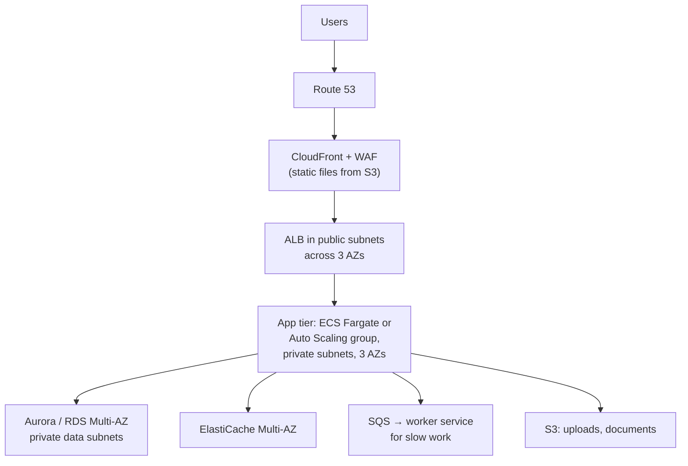
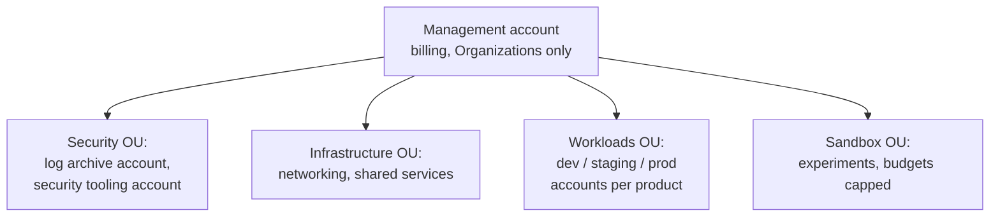

# AWS — Architecture, Practices and Scenarios — Interview Q&A

**What this covers:** the questions that decide senior-level AWS interviews — designing
for availability and disaster recovery, the security and cost practices most
companies follow, how a typical production setup looks, and **scenario questions**
("the site is slow — what do you do?", "an AZ went down", "keys leaked on GitHub").
The scenario answers are written as step-by-step checklists you can talk through.

**File 4 of 4 on AWS:** [09 Compute, IAM, networking](09_AWS_Compute_IAM_Networking_QA.md) ·
[10 Storage, databases, messaging](10_AWS_Storage_Databases_Messaging_QA.md) ·
[11 Serverless, containers, DevOps](11_AWS_Serverless_Containers_DevOps_QA.md) ·
**12 Architecture, practices, scenarios**

**How the facts were checked:** stable AWS facts come from my own knowledge. Recent
changes were confirmed against AWS announcements on 7 Oct 2026 and are marked
"(confirmed …)". Statements about what "most companies" do are **my judgement from
common industry practice, not survey data** — present them that way in an interview
too.

## Weight legend

| Mark | What it means | How the answer is written |
| --- | --- | --- |
| ★★★ | Asked in almost every senior AWS round | Answer, reasoning, diagram or checklist |
| ★★ | Asked often | Answer and one table or checklist |
| ★ | Occasional | Short answer |

## Contents

| # | Question | Weight | One-line answer |
| --- | --- | --- | --- |
| 1 | [Well-Architected Framework](#1-the-well-architected-framework) | ★★★ | Six pillars — use them to structure any design answer |
| 2 | [HA vs FT vs DR, RTO/RPO](#2-high-availability-fault-tolerance-and-disaster-recovery) | ★★★ | Minutes of downtime vs none vs recovering from disaster |
| 3 | [Four DR strategies](#3-the-four-disaster-recovery-strategies) | ★★★ | Backup/restore → pilot light → warm standby → active/active |
| 4 | [HA web application design](#4-designing-a-highly-available-web-application) | ★★★ | Three AZs, stateless app tier, managed data with failover |
| 5 | [Scaling to millions](#5-scaling-from-one-server-to-millions-of-users) | ★★★ | Remove one bottleneck at a time |
| 6 | [Multi-account setup](#6-multi-account-setup-with-organizations) | ★★ | Accounts per environment; SCP guardrails |
| 7 | [Security practices](#7-security-practices-most-companies-follow) | ★★★ | No keys, least privilege, encrypt, detect, private networks |
| 8 | [Cost practices](#8-cost-optimisation-practices) | ★★★ | See it, right-size, commit, Spot, clean up |
| 9 | [Tagging](#9-tagging) | ★ | Mandatory tags enforced in code |
| 10 | [Serverless or containers](#10-serverless-or-containers) | ★★ | By traffic shape, run time and team |
| 11 | [A typical production stack](#11-a-typical-production-stack) | ★★ | What you will see at most product companies |
| 12 | [Migrating to AWS](#12-migrating-an-application-to-aws) | ★★ | The 7 Rs; rehost first, modernize hot spots |
| 13 | [Scenario: slow under load](#13-scenario-the-site-is-slow-under-load) | ★★★ | Find the saturated layer, then fix that layer |
| 14 | [Scenario: S3 Access Denied](#14-scenario-access-denied-on-s3) | ★★ | Identity, bucket, SCP, KMS, endpoint policy |
| 15 | [Scenario: Lambda → RDS timeouts](#15-scenario-lambda-times-out-talking-to-rds) | ★★ | Security groups, NAT/endpoints, connection storms |
| 16 | [Scenario: bill jumped](#16-scenario-the-aws-bill-jumped) | ★★ | Cost Explorer by service and usage type |
| 17 | [Scenario: an AZ goes down](#17-scenario-an-availability-zone-goes-down) | ★★ | What fails over by itself, and what doesn't |
| 18 | [Scenario: keys leaked](#18-scenario-access-keys-leaked-on-github) | ★★ | Deactivate, investigate CloudTrail, clean up, prevent |
| 19 | [Scenario: bad deployment](#19-scenario-a-deployment-broke-production) | ★★ | Roll back first, investigate second |
| 20 | ["Your AWS experience"](#20-answering-tell-me-about-your-aws-experience) | ★★★ | Context, decisions, a problem solved, numbers |

---

## 1. The Well-Architected Framework

**Weight:** ★★★

AWS's checklist for judging an architecture, in **six pillars**:

| Pillar | Core question | Typical practices |
| --- | --- | --- |
| Operational excellence | Can we run and change it safely? | Infrastructure as code, small reversible changes, runbooks, observability |
| Security | Is data and access protected? | Least privilege, no long-lived keys, encryption, logging everything |
| Reliability | Does it keep working and recover from failure? | Multi-AZ, auto recovery, tested backups, scale horizontally |
| Performance efficiency | Are we using the right resources well? | Right instance and storage types, caching, managed and serverless services |
| Cost optimisation | Are we paying only for value? | Right-sizing, commitments, Spot, deleting idle resources |
| Sustainability | Are we using as little as needed? | High utilisation, Graviton, managed services, less data stored and moved |

**How to use it in an interview:** after sketching any design, walk the pillars —
"For reliability it's across three AZs… for security the app has its own task
role… for cost the baseline is on a Savings Plan…". It shows you think beyond "it
works". AWS also has a free **Well-Architected Tool** to review a workload against
these questions.

---

## 2. High availability, fault tolerance and disaster recovery

**Weight:** ★★★

| Term | Meaning | Example |
| --- | --- | --- |
| **High availability (HA)** | The system keeps serving through a component failure, maybe with a brief blip | Multi-AZ: an instance dies, the load balancer routes around it |
| **Fault tolerance** | No interruption at all, even during failure | Fully redundant active components; costs more |
| **Disaster recovery (DR)** | Recovering after a large event: a region outage, data corruption, ransomware | Restoring in another region from backups or replicas |

**Two numbers define DR requirements:**

- **RTO (recovery time objective):** how long until the service is back.
- **RPO (recovery point objective):** how much data you can afford to lose, measured in
  time (an RPO of 5 minutes = up to 5 minutes of writes lost).

**Availability in plain numbers:**

| Availability | Downtime per year | Per month |
| --- | --- | --- |
| 99.9% | ~8.8 hours | ~43 minutes |
| 99.95% | ~4.4 hours | ~22 minutes |
| 99.99% | ~53 minutes | ~4.4 minutes |
| 99.999% | ~5 minutes | ~26 seconds |

**Senior point — dependencies multiply:** a request that needs three services, each
99.9% available, is at best 99.9% × 99.9% × 99.9% ≈ **99.7%**. Higher availability
needs redundancy, timeouts, fallbacks and fewer hard dependencies in the request path.

---

## 3. The four disaster recovery strategies

**Weight:** ★★★

| Strategy | What runs in the DR region | Typical RTO / RPO | Cost |
| --- | --- | --- | --- |
| **Backup and restore** | Only backups (snapshots, replicated S3); infrastructure rebuilt with IaC | Hours / hours | Lowest |
| **Pilot light** | Data replicated live (a database replica); app servers off or minimal | Tens of minutes / minutes or less | Low |
| **Warm standby** | A smaller but fully working copy, scaled up on failover | Minutes / seconds | Medium |
| **Multi-site active/active** | Full capacity serving traffic in both regions | Near zero / near zero | Highest, plus data-conflict complexity |

**Points that impress:**

- **Choose by business need**, not by default — ask "what does an hour of downtime
  cost?" Most internal systems are fine with backup and restore; payments may need warm
  standby.
- **Replication is not backup.** Corruption, a bad migration or ransomware replicates
  instantly. Keep **point-in-time backups in a separate account**, ideally immutable
  (AWS Backup vault lock, S3 Object Lock).
- **Infrastructure as code** is what makes backup-and-restore realistic — you can
  rebuild the environment in a new region from code.
- **Test it** — a DR plan never exercised doesn't work. Run game days and measure the
  real RTO.

---

## 4. Designing a highly available web application

**Weight:** ★★★ — "Design a highly available web app on AWS."



**Walk through the decisions:**

1. **Three AZs** for every tier.
2. **Stateless app tier** — sessions in ElastiCache or DynamoDB, or JWTs — so any
   instance can serve any user and instances can be replaced freely.
3. **Auto scaling** on a load metric, with a minimum spread over AZs.
4. **Managed database with automatic failover** (Aurora, or RDS Multi-AZ), plus read
   replicas if reads dominate.
5. **Slow work goes to a queue** (emails, PDFs, third-party calls) so web requests stay
   fast and a slow dependency doesn't take the site down.
6. **Edge:** CloudFront for caching and TLS, WAF for common attacks.
7. **Private networking:** only the ALB is public; security groups chain ALB → app → DB.
8. **Operations:** IaC, CI/CD with canary deploys, alarms on latency and errors,
   backups in another account.

**Then say what happens when things fail:**

| Failure | What happens |
| --- | --- |
| An app instance dies | ALB health check removes it; auto scaling replaces it |
| A whole AZ fails | ALB and auto scaling shift to the other two AZs (see [Q17](#17-scenario-an-availability-zone-goes-down)) |
| The database primary fails | Automatic failover to the standby; the app reconnects |
| Traffic triples | Auto scaling adds tasks; CloudFront absorbs static load; the queue buffers background work |

---

## 5. Scaling from one server to millions of users

**Weight:** ★★★ — a classic; the idea is **find the bottleneck, remove it, repeat**.

| Stage | Change | Why |
| --- | --- | --- |
| 1 | One EC2 instance running app and database | Simplest start |
| 2 | Move the database to RDS | Managed backups; app and DB scale separately |
| 3 | ALB + an Auto Scaling group across AZs; stateless app | Horizontal scaling and HA for the app tier |
| 4 | RDS Multi-AZ, read replicas, ElastiCache | Database HA; take read load off the primary |
| 5 | CloudFront + S3 for static files and media | Serve heavy content from the edge, not the app |
| 6 | SQS + worker services for slow work | Keep requests fast; absorb spikes |
| 7 | Split services where teams or scaling needs differ; DynamoDB for hot key-value data; shard the database if writes saturate | Independent scaling and deployment |
| 8 | Multiple regions | Latency for global users; regional DR |

**What makes this answer senior:** saying you'd **measure before each step** (load tests,
metrics) and that each stage adds operational cost — don't build stage 7 for a
stage-3 problem.

---

## 6. Multi-account setup with Organizations

**Weight:** ★★

**Why multiple accounts:** an account is the strongest isolation boundary in AWS —
separate permissions, quotas, blast radius and billing. A mistake or breach in a dev
account can't touch production.



- **AWS Organizations:** groups accounts into OUs, consolidated billing, and **service
  control policies (SCPs)** as guardrails.
- **AWS Control Tower:** sets up this landing zone with preventive and detective
  guardrails and an account factory.
- **IAM Identity Center:** one sign-in for people, with roles per account.

**Typical SCP guardrails:** deny leaving the organization; deny disabling CloudTrail,
GuardDuty or Config; allow only approved regions; deny actions by the root user.
Remember SCPs only **limit** — they never grant permissions.

---

## 7. Security practices most companies follow

**Weight:** ★★★

| Area | Practice |
| --- | --- |
| Root user | MFA, no access keys, used only for the few tasks that need it |
| People | SSO through IAM Identity Center with MFA; no IAM users with passwords or keys |
| Applications and CI | Roles with least privilege; OIDC for pipelines; no long-lived access keys anywhere |
| Network | Private subnets for apps and data; security groups referencing each other; no SSH open to the internet (Session Manager instead) |
| Data | Encryption at rest (KMS) and in transit (TLS); S3 Block Public Access at account level; backups copied to a separate account |
| Instances | IMDSv2 required; patched images; container image scanning |
| Secrets | Secrets Manager / Parameter Store; rotation; secret scanning on repositories |
| Edge | WAF on CloudFront / ALB / API Gateway; Shield Standard (included) |
| Detection | Organization-wide CloudTrail to a locked log account; GuardDuty; Security Hub; Config rules; IAM Access Analyzer |
| Response | Runbooks for leaked keys, compromised instances, public buckets; practice them |

**How to frame it:** prevent (least privilege, private networks, encryption), detect
(CloudTrail, GuardDuty), respond (runbooks, automation) — and automate all three in
code rather than relying on people remembering.

---

## 8. Cost optimisation practices

**Weight:** ★★★

**1. Make cost visible first** — you can't cut what you can't see:
cost allocation tags, Cost Explorer, **AWS Budgets** with alerts, **Cost Anomaly
Detection**, and showing each team its own spend.

**2. Then the usual levers:**

| Lever | Practice |
| --- | --- |
| Right-size | Use CloudWatch metrics and Compute Optimizer; most instances are over-provisioned |
| Commit for the baseline | Compute Savings Plans for EC2, Fargate and Lambda; **Database Savings Plans** (1-year, no upfront, up to 35% for serverless and 20% for provisioned databases — confirmed: AWS, Dec 2025) |
| Spot | Batch jobs, CI runners, stateless workers, non-production |
| Graviton | Better price-performance for most JVM and container workloads |
| Schedule non-production | Stop dev and test environments nights and weekends — running 12 h × 5 days is ~36% of the week |
| Storage | S3 lifecycle rules and Intelligent-Tiering; gp2 → gp3; delete unattached EBS volumes and old snapshots |
| Network | Free S3/DynamoDB gateway endpoints instead of NAT; avoid needless cross-AZ and cross-region traffic; CloudFront to cut internet egress |
| Logs and metrics | Set CloudWatch log retention; drop DEBUG in production; control metric cardinality |
| Idle resources | Unused load balancers, idle databases, unattached public IPv4 addresses (billed about $0.005/hour each since Feb 2024 — confirmed) |
| Architecture | Serverless for spiky low-volume work; caching to shrink database size |

**Senior point:** cost is an engineering metric like latency — review it regularly,
attach it to the teams who create it, and weigh savings against engineering time.

---

## 9. Tagging

**Weight:** ★

- **Mandatory tags:** `Environment`, `Service`, `Team` (owner), `CostCenter`, and often
  `DataClassification`.
- **Enforce them in code** (Terraform `default_tags`, CDK aspects), with **tag
  policies** in Organizations and Config rules to catch untagged resources.
- **Activate them as cost allocation tags** so bills break down by team and service.
- **Uses beyond cost:** automation (stop everything tagged `Environment=dev` at night)
  and tag-based access control (ABAC).

---

## 10. Serverless or containers?

**Weight:** ★★

| Factor | Leans to Lambda | Leans to containers (ECS/EKS) |
| --- | --- | --- |
| Traffic shape | Spiky, low or unpredictable | Steady, high |
| Run time | Short (seconds) | Long-running, or over 15 minutes |
| Latency | Tolerant of occasional cold starts | Strict and consistent |
| Workload type | Event handlers, glue, scheduled jobs | APIs with heavy frameworks, in-memory state, long connections |
| Cost model | Pay per use, zero when idle | Cheaper per request at sustained load |
| Operations | Least to manage | More control, more to manage |

**Real answer:** most companies use **both** — containers for core services, Lambda for
events and glue around them.

---

## 11. A typical production stack

**Weight:** ★★ — my judgement of common practice at product companies, not survey
data.

| Layer | Common choice | Alternatives you'll also meet |
| --- | --- | --- |
| Accounts and access | Organizations + Control Tower + IAM Identity Center | Hand-built multi-account setups |
| Infrastructure as code | Terraform | CDK, CloudFormation, Pulumi |
| CI/CD | GitHub Actions or GitLab CI with OIDC to AWS | Jenkins, CodePipeline |
| Compute | ECS on Fargate or EKS; Lambda for events | EC2 Auto Scaling groups, Elastic Beanstalk |
| Edge | Route 53, CloudFront, WAF, ALB | API Gateway for public or partner APIs |
| Data | RDS PostgreSQL or Aurora, S3, ElastiCache, DynamoDB | DocumentDB, OpenSearch, Redshift |
| Messaging | SQS + SNS, EventBridge | MSK (Kafka), Kinesis |
| Secrets and keys | Secrets Manager, Parameter Store, KMS | HashiCorp Vault |
| Observability | CloudWatch plus Datadog, Grafana/Prometheus or New Relic; OpenTelemetry | X-Ray, Splunk |
| Security tooling | GuardDuty, Security Hub, Config | Third-party CSPM tools |

---

## 12. Migrating an application to AWS

**Weight:** ★★

**The 7 Rs:**

| Strategy | Meaning | Example |
| --- | --- | --- |
| Retire | Switch it off | An unused reporting app |
| Retain | Leave it where it is for now | A mainframe that isn't worth moving yet |
| **Rehost** ("lift and shift") | Move the servers as they are | VMs → EC2 with AWS Application Migration Service |
| Relocate | Move a whole platform without changes | VMware workloads to VMware on AWS |
| **Replatform** ("lift, tinker, shift") | Small changes for managed services | Self-run MySQL → RDS; app → containers |
| Repurchase | Replace with SaaS | Self-hosted CRM → a SaaS CRM |
| **Refactor** | Re-architect for cloud-native | Monolith → services, Lambda, DynamoDB |

**Tools:** AWS Database Migration Service (DMS) with change data capture for
near-zero-downtime database moves; DataSync or Snowball for large data transfers.

**Senior answer:** rehost or replatform first to get out of the data centre quickly and
safely, then refactor the parts where cloud-native design pays off — not everything
at once.

---

## 13. Scenario: the site is slow under load

**Weight:** ★★★

**Step 1 — scope it:** which endpoints, since when, all users or some, did anything
change (a deploy, a traffic spike, a config change)?

**Step 2 — find the saturated layer, top to bottom:**

| Layer | Look at |
| --- | --- |
| Load balancer | `TargetResponseTime`, 5xx counts, request count, unhealthy hosts |
| App tier | CPU, memory, thread or connection-pool saturation, GC pauses, task count at its max? |
| Database | CPU, connections, slow queries (Performance Insights / Database Insights), locks, replica lag |
| Cache | Hit ratio, evictions, CPU |
| Downstream services | Latency in traces; are timeouts set? |
| Lambda (if used) | Throttles, duration, concurrency at its limit |

**Step 3 — common causes and fixes:**

| Cause | Short-term | Long-term |
| --- | --- | --- |
| Slow queries / missing index | Kill runaway queries | Add indexes; fix N+1; cache |
| Connection pool exhausted | Restart slow pods, raise the pool carefully | Shorter transactions; RDS Proxy; size pools against `max_connections` |
| Auto scaling at its max or too slow | Raise max; scale manually | Better metric, faster boot, scheduled scaling before known peaks |
| Slow dependency, no timeouts | Circuit-break or disable the feature | Timeouts, bulkheads, async via a queue |
| Burstable instance out of credits | Switch to unlimited mode or an M instance | Right-size the instance family |

**Step 4 — afterwards:** a blameless post-incident review, a load test that reproduces
it, and an alarm that would have caught it earlier.

---

## 14. Scenario: Access Denied on S3

**Weight:** ★★

| # | Check | Common mistake |
| --- | --- | --- |
| 1 | Identity policy allows the action **on the right ARN** | `s3:ListBucket` needs `arn:aws:s3:::bucket`; `s3:GetObject` needs `arn:aws:s3:::bucket/*` |
| 2 | Bucket policy has no explicit deny | A "require TLS" or "only from VPC endpoint" condition the caller doesn't meet |
| 3 | SCPs and permission boundaries | The account or role is capped above the identity policy |
| 4 | **KMS** | SSE-KMS objects also need `kms:Decrypt` on the key, and the key policy must allow it |
| 5 | Cross-account | Both the caller's policy and the bucket policy must allow it |
| 6 | VPC endpoint policy | The endpoint only allows certain buckets |
| 7 | Pre-signed URL | Expired, or the signer itself lacks permission |

**Tools:** the error message often names the policy type that denied it; CloudTrail
shows the exact request and principal; IAM Policy Simulator tests a policy.

---

## 15. Scenario: Lambda times out talking to RDS

**Weight:** ★★

| Cause | Fix |
| --- | --- |
| Lambda isn't in the database's VPC, or the security groups don't allow it | Attach Lambda to private subnets; DB security group allows the Lambda security group on the port |
| Lambda in a VPC calls an AWS API (Secrets Manager, S3) and hangs | Private subnets have no internet route — add a NAT gateway or **VPC endpoints** |
| Too many concurrent Lambdas exhaust `max_connections` | **RDS Proxy**; cap reserved concurrency |
| A new connection opened on every invocation | Create the connection outside the handler so warm invocations reuse it |
| The query itself is slow | Indexes, query plans; Lambda timeout set above the real worst case |

The second row is the classic: the function "hangs" until timeout because the call to
Secrets Manager has nowhere to go, not because of the database at all.

---

## 16. Scenario: the AWS bill jumped

**Weight:** ★★

**Find it:** Cost Explorer → group by **service**, then **usage type**, then by
**account** or **tag**; compare with last month. Check Cost Anomaly Detection alerts.

| Usual suspect | Typical cause |
| --- | --- |
| NAT gateway | Heavy S3 / ECR / API traffic from private subnets without endpoints |
| Data transfer | Cross-AZ chatter, cross-region replication, internet egress |
| CloudWatch Logs | DEBUG logging left on; no retention set |
| Forgotten resources | Test environments, GPU instances, large databases nobody stopped |
| S3 requests | Millions of tiny objects; a loop rewriting objects |
| Lambda recursion | A function triggered by S3 writing back to the same bucket |
| DynamoDB on demand | A Scan in a hot path, or a runaway retry loop |
| Public IPv4 | Many instances or ENIs with public IPs (billed since Feb 2024) |

**Prevent it:** budgets with alerts per account and team, anomaly detection, mandatory
tags, and quotas or SCPs on expensive services in sandbox accounts.

---

## 17. Scenario: an Availability Zone goes down

**Weight:** ★★

**What recovers by itself — if you designed for it:**

| Component | Behaviour |
| --- | --- |
| ALB | Stops routing to targets in the failed AZ |
| Auto Scaling / ECS service | Launches replacements in healthy AZs |
| RDS Multi-AZ / Aurora | Fails over to the standby or replica (Aurora typically under 30 s; RDS about 1–2 minutes) |
| ElastiCache Multi-AZ | Promotes a replica |
| S3, DynamoDB, SQS, Lambda | Regional services — already multi-AZ |

**What doesn't — the follow-ups that catch people:**

- **A single NAT gateway** in the failed AZ cuts outbound access for private subnets in
  *every* AZ. Use one NAT gateway per AZ.
- **Single-AZ resources** — an EC2 instance with data on its EBS volume, a single-AZ
  database — are simply down.
- **Not enough spare capacity:** with 3 AZs, the remaining 2 must carry all traffic. If
  the AZs run at 90%, they can't. Plan *static stability* — keep each AZ at about
  two-thirds of its capacity, or over-provision so no scaling is needed during the
  event, because launching capacity may be slow while many customers do the same.
- Applications must **reconnect** to the database after failover.

**During the event:** watch the AWS Health Dashboard, consider shifting traffic away
from the impaired AZ (Route 53 Application Recovery Controller zonal shift for load
balancers), and freeze deployments.

---

## 18. Scenario: access keys leaked on GitHub

**Weight:** ★★

**Contain — minutes matter:**

1. **Deactivate** the access key (then delete it). Treat it as compromised even if the
   commit was removed — bots scan public repos continuously.
2. If the key could assume roles, **revoke those roles' active sessions**.

**Investigate:**

3. **CloudTrail:** every call made with that key — what was read, created or changed,
   from which IPs, in which regions.
4. **Look for persistence and abuse:** new IAM users, keys or roles; instances launched
   in unusual regions (crypto-mining is common); Lambda functions; changed policies.

**Recover:**

5. Delete what the attacker created; rotate any secrets the key could read; contact
   AWS Support about fraudulent charges.

**Prevent:**

6. No long-lived keys at all (roles, SSO, OIDC); secret scanning with push protection
   on repositories; SCPs restricting regions; GuardDuty alerts.

AWS itself often detects publicly exposed keys, emails the account, and attaches a
quarantine policy — useful, but not a substitute for your own response.

---

## 19. Scenario: a deployment broke production

**Weight:** ★★

1. **Roll back first, investigate second.** Restoring service beats finding the bug.
   - ECS: the circuit breaker rolls back automatically; blue/green switches traffic
     back.
   - Lambda: shift the alias back to the previous version.
   - Infrastructure: re-apply the previous IaC version.
2. **Database changes** are the hard part: if the release included a migration that the
   old version can't work with, rollback breaks too. That is why migrations must be
   **backward compatible** (expand first, contract in a later release).
3. **Communicate:** status page and stakeholders, with times.
4. **Blameless post-incident review:** why tests and the canary didn't catch it; add the
   missing alarm, test or deployment safeguard.

**Prevention to mention:** canary or blue/green with alarm-based automatic rollback,
smaller and more frequent deploys, feature flags for risky changes.

---

## 20. Answering "tell me about your AWS experience"

**Weight:** ★★★

**Don't** list services ("I've used EC2, S3, SQS…"). **Do** tell one or two concrete
stories with this structure:

| Part | What to say |
| --- | --- |
| Context | The system, its scale (requests per second, data size, number of services, team size) |
| Architecture | What ran where, and **why** — including one alternative you rejected |
| A problem you owned | An incident, a cost reduction, a performance or scaling issue |
| Result | Measured: latency from X to Y ms, cost down Z%, RTO from hours to minutes |
| Reflection | What you'd do differently now |

**Fill-in template** (use your own real systems and numbers — interviewers probe
details):

```text
"At <company>, I worked on <system>, handling about <N> requests/s and <data size>.
It ran on <compute choice> across <N> AZs, with <database> and <messaging>.
We chose <X> over <Y> because <reason>.
One problem I owned was <problem>. I found it by <how you diagnosed it>,
fixed it by <change>, and it moved <metric> from <before> to <after>.
Looking back, I'd <improvement>."
```

Prepare for the follow-ups this invites: how you secured it, how you deployed it, what
broke, what it cost.

---

## Sources

Recent changes confirmed on 7 Oct 2026:

- [Database Savings Plans (Dec 2025)](https://aws.amazon.com/about-aws/whats-new/2025/12/database-savings-plans-savings)
- [Public IPv4 address charge (from Feb 2024)](https://aws.amazon.com/blogs/aws/new-aws-public-ipv4-address-charge-public-ip-insights)
