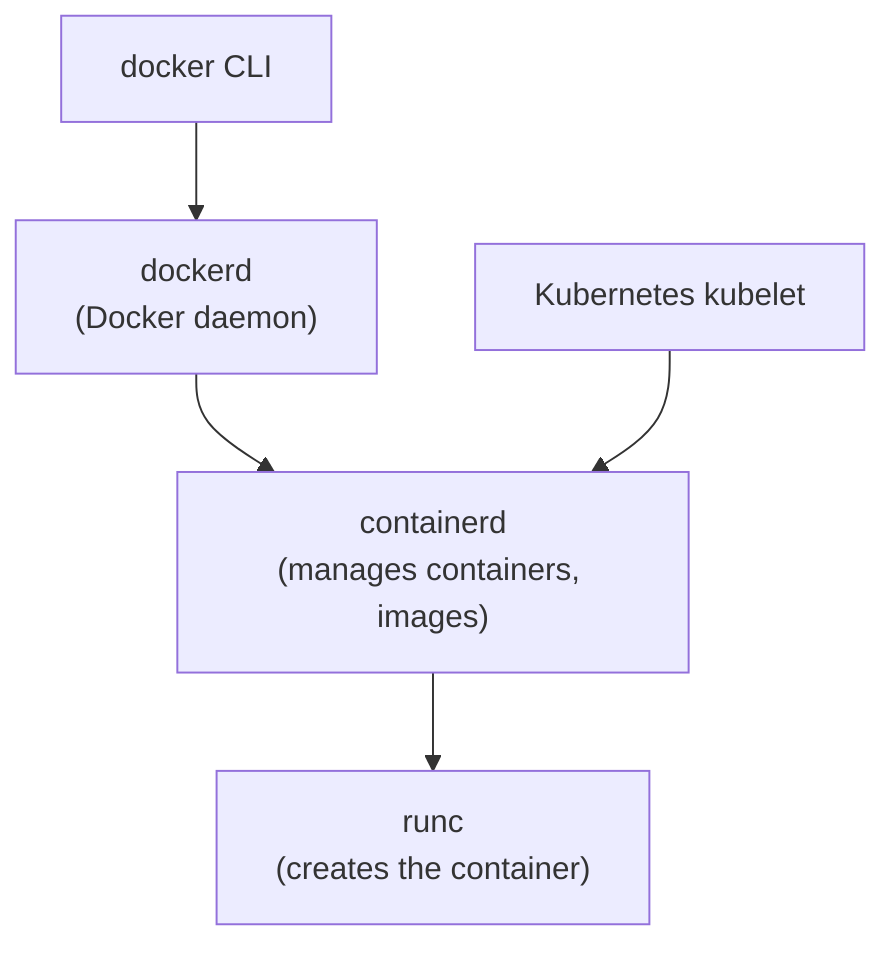

# Docker — Interview Q&A

**What this covers:** the Docker questions asked in backend interviews — what containers
are, Dockerfiles, images and layers, networking, volumes, Compose, security, and
running **Java / Spring Boot** in containers (a favourite follow-up for Java
developers). Every answer starts with the short version to say first; the ★★★
questions add the detail interviewers dig into.

**Quick revision:** the Contents table below gives a one-line answer for every
question. Kubernetes is in [14_Kubernetes_QA.md](14_Kubernetes_QA.md).

**How the facts were checked:** stable Docker facts come from my own knowledge. Points
that changed recently were confirmed on 7 Oct 2026 against official docs (listed
under Sources at the end) and are marked "(confirmed …)".

## Weight legend

| Mark | What it means | How the answer is written |
| --- | --- | --- |
| ★★★ | Asked in almost every round, with follow-ups | Short answer, then detail and an example |
| ★★ | Asked often | Short answer and one example or table |
| ★ | Occasional | Two to four lines |

## Contents

| # | Question | Weight | One-line answer |
| --- | --- | --- | --- |
| 1 | [Docker and containers](#1-what-is-docker-and-what-is-a-container) | ★★★ | Package an app with everything it needs; runs the same everywhere |
| 2 | [Container vs VM](#2-container-vs-virtual-machine) | ★★★ | Containers share the host kernel — lighter and faster |
| 3 | [Image vs container](#3-image-vs-container) | ★★★ | Image = read-only template; container = a running instance |
| 4 | [Isolation](#4-how-containers-are-isolated) | ★★ | Namespaces hide, cgroups limit |
| 5 | [Layers and cache](#5-image-layers-and-the-build-cache) | ★★★ | Each instruction is a cached layer; order rarely-changing steps first |
| 6 | [Dockerfile instructions](#6-dockerfile-instructions) | ★★★ | FROM, WORKDIR, COPY, RUN, ENV, USER, EXPOSE, ENTRYPOINT, CMD |
| 7 | [CMD vs ENTRYPOINT](#7-cmd-vs-entrypoint) | ★★★ | ENTRYPOINT = the program; CMD = default arguments |
| 8 | [COPY vs ADD, ARG vs ENV](#8-copy-vs-add-and-arg-vs-env) | ★★ | Prefer COPY; ARG is build-time, ENV is run-time |
| 9 | [Multi-stage builds](#9-multi-stage-builds) | ★★★ | Build in one stage, ship only the result |
| 10 | [Spring Boot image](#10-dockerizing-a-spring-boot-application) | ★★★ | Layered jar, buildpacks, or Jib |
| 11 | [JVM in a container](#11-the-jvm-inside-a-container) | ★★★ | Default heap is 25% of the limit; set MaxRAMPercentage |
| 12 | [Small images](#12-making-images-small) | ★★ | Slim base, multi-stage, fewer layers, .dockerignore |
| 13 | [Volumes vs bind mounts](#13-volumes-vs-bind-mounts-vs-tmpfs) | ★★★ | Volumes for data; bind mounts for development |
| 14 | [Networking](#14-docker-networking) | ★★★ | User-defined bridge gives DNS by container name |
| 15 | [EXPOSE vs -p](#15-expose-vs-publishing-ports) | ★★ | EXPOSE documents; `-p` actually opens the port |
| 16 | [Commands](#16-commands-you-should-know) | ★★★ | build, run, ps, logs, exec, inspect, stop, rm |
| 17 | [Restart policies, HEALTHCHECK](#17-restart-policies-and-health-checks) | ★★ | `unless-stopped`; a health command Docker runs |
| 18 | [Docker Compose](#18-docker-compose) | ★★★ | Several containers defined in one YAML file |
| 19 | [PID 1 and signals](#19-stopping-containers-cleanly-pid-1-and-signals) | ★★ | Exec-form ENTRYPOINT so Java receives SIGTERM |
| 20 | [Image security](#20-image-security-practices) | ★★★ | Non-root, minimal base, scan, pin, no secrets |
| 21 | [Secrets](#21-secrets-in-builds-and-containers) | ★★ | Never in the image; BuildKit secret mounts |
| 22 | [Tags, digests, registries](#22-tags-digests-and-registries) | ★★ | Don't deploy `latest`; Docker Hub rate-limits pulls |
| 23 | [Docker, containerd, OCI](#23-docker-containerd-runc-and-oci) | ★★ | Docker images are OCI images; Kubernetes runs them without Docker |
| 24 | [Container exits immediately](#24-scenario-the-container-exits-immediately) | ★★★ | Logs, exit code, inspect, run a shell |
| 25 | [Alternatives](#25-docker-alternatives) | ★ | Podman, Buildah, Kaniko |
| 26 | [Disk clean-up](#26-cleaning-up-disk-space) | ★ | `docker system prune` |

---

## 1. What is Docker, and what is a container?

**Weight:** ★★★

**Short answer:** a **container** is an application packaged with everything it needs —
runtime, libraries, configuration — running as an isolated process. **Docker** is the
tool that builds, ships and runs containers.

**Why it matters:** "works on my machine" goes away — the same image runs on a laptop,
in CI and in production. Containers start in seconds, use little overhead, and are
the unit that Kubernetes, ECS and other platforms deploy.

---

## 2. Container vs virtual machine

**Weight:** ★★★

| | Virtual machine | Container |
| --- | --- | --- |
| What is virtualised | Hardware — each VM runs its own full OS kernel | The operating system — containers share the host's kernel |
| Size | Gigabytes | Megabytes |
| Start time | Minutes | Seconds or less |
| Isolation | Strong (hypervisor boundary) | Weaker (shared kernel) |
| Density | Tens per host | Hundreds per host |

**Short answer:** containers are lighter and faster because they share the host kernel;
VMs isolate more strongly because each has its own. In the cloud you usually run
**containers inside VMs** (EC2 instances, Kubernetes nodes) and get both.

---

## 3. Image vs container

**Weight:** ★★★

- **Image:** a read-only template — a stack of file-system layers plus metadata (which
  command to run, environment, ports). Built from a Dockerfile, stored in a registry.
- **Container:** a running (or stopped) instance of an image, with a thin writable layer
  on top.

**Analogy:** image = class, container = object. One image can run as many containers.

**Trap:** anything written inside the container's writable layer is lost when the
container is removed. Persist data in volumes (Q13).

---

## 4. How containers are isolated

**Weight:** ★★

- **Namespaces** control what a container can **see**: its own process list (PID),
  network interfaces, mounts, hostname, users.
- **cgroups** (control groups) control what it can **use**: CPU, memory, I/O limits.
- **Union file system** (overlay2): stacks the read-only image layers with one writable
  layer (copy-on-write).

So a container is not a mini-VM — it is a normal Linux process with a restricted view
and limited resources.

---

## 5. Image layers and the build cache

**Weight:** ★★★

**Short answer:** each Dockerfile instruction that changes files creates a **layer**.
Docker reuses (caches) a layer if the instruction and its inputs haven't changed; once
one layer changes, **every layer after it is rebuilt**.

**So put things that change rarely first:**

```dockerfile
# Good: dependencies are cached until pom.xml changes
COPY pom.xml .
RUN mvn -q dependency:go-offline
COPY src ./src
RUN mvn -q package -DskipTests

# Bad: any code change invalidates the dependency download
COPY . .
RUN mvn -q package -DskipTests
```

**Other points:**

- Layers are shared between images on the same host and registry — a common base image
  is downloaded once.
- Deleting a file in a later layer doesn't shrink the image — the earlier layer still
  contains it. Clean up in the **same** `RUN` that created the files.
- BuildKit (the default builder since Docker Engine 23) adds parallel stages, cache
  mounts and secret mounts.

---

## 6. Dockerfile instructions

**Weight:** ★★★

| Instruction | Purpose |
| --- | --- |
| `FROM` | Base image to start from |
| `WORKDIR` | Working directory for the following instructions and the container |
| `COPY` / `ADD` | Copy files into the image (Q8) |
| `RUN` | Run a command at **build** time (install packages, compile) |
| `ENV` | Environment variable at build **and** run time |
| `ARG` | Variable available only at build time |
| `USER` | User to run as — set a non-root user |
| `EXPOSE` | Documents which port the app listens on (Q15) |
| `ENTRYPOINT` / `CMD` | What runs when the container starts (Q7) |
| `HEALTHCHECK` | Command Docker runs to check the container is healthy |
| `VOLUME` | Marks a path as a mount point for data |
| `LABEL` | Metadata (version, maintainer, source repo) |

---

## 7. CMD vs ENTRYPOINT

**Weight:** ★★★

**Short answer:** `ENTRYPOINT` is the program the container runs; `CMD` provides default
arguments. Arguments given to `docker run` **replace CMD** but are **appended to
ENTRYPOINT**.

```dockerfile
ENTRYPOINT ["java", "-jar", "app.jar"]
CMD ["--spring.profiles.active=prod"]
```

| You run | What executes |
| --- | --- |
| `docker run app` | `java -jar app.jar --spring.profiles.active=prod` |
| `docker run app --server.port=9090` | `java -jar app.jar --server.port=9090` |
| `docker run --entrypoint sh app` | `sh` (ENTRYPOINT overridden — useful for debugging) |

**Exec form vs shell form:** always use the JSON array (exec) form
`["java", "-jar", "app.jar"]`. The shell form `java -jar app.jar` runs under
`/bin/sh -c`, which doesn't pass SIGTERM to Java, so the app can't shut down
gracefully (Q19).

---

## 8. COPY vs ADD, and ARG vs ENV

**Weight:** ★★

- **COPY** copies local files. **ADD** also extracts local tar archives and can fetch
  URLs. **Prefer COPY** — it is explicit; use ADD only to auto-extract a tar.
- **ARG** exists only during the build (`docker build --build-arg VERSION=1.2`).
  **ENV** is baked into the image and visible to the running app.
- **Neither is safe for secrets** — both can be read from the image history (Q21).

---

## 9. Multi-stage builds

**Weight:** ★★★

**Short answer:** use one stage with the full build toolchain (JDK, Maven) to build the
app, then copy only the result into a small runtime stage. The final image has no
compiler, no source code and no build cache — smaller and safer.

```dockerfile
# Stage 1: build with Maven and a full JDK
FROM maven:3.9-eclipse-temurin-21 AS build
WORKDIR /src
COPY pom.xml .
RUN mvn -q dependency:go-offline
COPY src ./src
RUN mvn -q package -DskipTests

# Stage 2: run with only a JRE
FROM eclipse-temurin:21-jre
WORKDIR /app
COPY --from=build /src/target/*.jar app.jar
RUN useradd --system --uid 10001 app
USER 10001          # numeric, so Kubernetes' runAsNonRoot can verify it
EXPOSE 8080
ENTRYPOINT ["java", "-XX:MaxRAMPercentage=75", "-jar", "app.jar"]
```

---

## 10. Dockerizing a Spring Boot application

**Weight:** ★★★

| Option | How | Good for |
| --- | --- | --- |
| Dockerfile with a plain jar | Q9 above | Simple; but every code change re-uploads the whole jar layer |
| **Dockerfile with layered jar** | Extract dependencies and code into separate layers | Small, fast pushes: only the code layer changes |
| **Cloud Native Buildpacks** | `mvn spring-boot:build-image` — no Dockerfile | Good defaults, security patches by rebuilding |
| **Jib** (Google plugin) | `mvn jib:build` — no Docker daemon needed | CI without Docker; fast layered builds |

**Layered jar Dockerfile** (the approach in Spring Boot's own docs; `-Djarmode=tools`
since Boot 3.3 — the older `-Djarmode=layertools` was deprecated in 3.3 and removed in
4.1, confirmed against the Boot docs):

```dockerfile
FROM eclipse-temurin:21-jre AS builder
WORKDIR /builder
COPY target/*.jar application.jar
RUN java -Djarmode=tools -jar application.jar extract --layers --destination extracted

FROM eclipse-temurin:21-jre
WORKDIR /application
COPY --from=builder /builder/extracted/dependencies/ ./
COPY --from=builder /builder/extracted/spring-boot-loader/ ./
COPY --from=builder /builder/extracted/snapshot-dependencies/ ./
COPY --from=builder /builder/extracted/application/ ./
ENTRYPOINT ["java", "-jar", "application.jar"]
```

**Why layers matter:** dependencies (tens of MB) rarely change; your code (a few hundred
KB) changes every commit. With separate layers, a new build pushes and pulls only the
small layer.

---

## 11. The JVM inside a container

**Weight:** ★★★ — the follow-up every Java developer gets.

**Memory:**

- Modern JVMs (JDK 10+, backported to 8u191) read the **container's memory limit**, not
  the host's. Support for cgroup v2 (the default on current Linux) came in JDK 15 and
  was backported to 11.0.16 and 8u372 — use a recent JDK.
- **By default the maximum heap is 25% of the container limit.** A container with 1 GB
  gets about 256 MB of heap — usually too small.
- Set `-XX:MaxRAMPercentage=75` (or 70–80). Don't go to 100%: the JVM also needs memory
  outside the heap — metaspace, thread stacks, code cache, direct buffers.
- If the process exceeds the limit, the kernel kills it: **exit code 137**, `OOMKilled`
  in `docker inspect` (or in Kubernetes).

**CPU:**

- The JVM sizes GC threads and the common fork-join pool from the container's CPU limit.
  With a limit under 2 CPUs it may pick the Serial GC. Override with
  `-XX:ActiveProcessorCount=N` if needed.

**Startup:** for faster starts consider Class Data Sharing (CDS), Spring AOT, or a
GraalVM native image.

---

## 12. Making images small

**Weight:** ★★

- **Small base image:** a JRE instead of a JDK; `-slim` variants; distroless images
  (no shell or package manager — smaller and safer). Alpine is tiny but uses musl libc,
  which some native libraries don't support — test before choosing it.
- **Multi-stage builds** (Q9) — no build tools in the final image.
- **Clean up in the same `RUN`:** `apt-get install … && rm -rf /var/lib/apt/lists/*`.
- **`.dockerignore`:** keeps `target/`, `.git/`, IDE files and secrets out of the build
  context — faster builds and no accidental leaks.
- **For Java:** `jlink` can build a custom minimal runtime with only the modules you use.

---

## 13. Volumes vs bind mounts vs tmpfs

**Weight:** ★★★

| | Volume | Bind mount | tmpfs |
| --- | --- | --- | --- |
| Where data lives | Managed by Docker (`/var/lib/docker/volumes`) | Any path on the host | Memory only |
| Survives container removal | Yes | Yes (it's the host's folder) | No |
| Use for | Database data, anything persistent | Development: mount source code; config files | Temporary sensitive data |
| Example | `-v pgdata:/var/lib/postgresql/data` | `-v ./config:/app/config` | `--tmpfs /tmp` |

**Short answer:** volumes for data you want to keep; bind mounts for sharing host files
during development; tmpfs for scratch data that must never touch disk.

---

## 14. Docker networking

**Weight:** ★★★

| Network type | What it does | Use |
| --- | --- | --- |
| `bridge` (default) | Private network on one host; containers reach each other by IP only | Quick single containers |
| **User-defined bridge** | Same, **plus DNS by container name** | Several containers on one host (Compose creates one) |
| `host` | Container uses the host's network directly — no isolation, no port mapping | Maximum network performance |
| `none` | No network | Isolated batch jobs |
| `overlay` | Network spanning several hosts | Docker Swarm |

**The classic trap — `localhost` inside a container means the container itself.** An app
container connecting to `localhost:5432` won't find a PostgreSQL running in another
container. Use the other container's **name** on a shared network
(`jdbc:postgresql://db:5432/shop`). To reach a service on the host machine, use
`host.docker.internal` (built into Docker Desktop; on Linux add
`--add-host=host.docker.internal:host-gateway`).

---

## 15. EXPOSE vs publishing ports

**Weight:** ★★

- `EXPOSE 8080` in the Dockerfile only **documents** the port. It opens nothing.
- `docker run -p 8080:8080` **publishes** it: host port 8080 → container port 8080.
  `-p 9090:8080` maps host 9090 to container 8080.
- The app must listen on `0.0.0.0`, not `127.0.0.1` — otherwise it only accepts
  connections from inside the container.

---

## 16. Commands you should know

**Weight:** ★★★

| Command | Does |
| --- | --- |
| `docker build -t shop/orders:1.4.2 .` | Build an image from the Dockerfile here |
| `docker run -d --name orders -p 8080:8080 -e SPRING_PROFILES_ACTIVE=dev shop/orders:1.4.2` | Run in the background with a port and an env var |
| `docker ps` / `docker ps -a` | Running containers / all, including stopped |
| `docker logs -f orders` | Follow a container's logs |
| `docker exec -it orders sh` | Open a shell inside a running container |
| `docker inspect orders` | Full details: state, exit code, OOMKilled, IP, mounts |
| `docker stats` | Live CPU and memory per container |
| `docker stop orders` / `docker kill orders` | SIGTERM then SIGKILL after 10 s / SIGKILL now |
| `docker rm orders` / `docker rmi <image>` | Remove a container / an image |
| `docker images` | List local images |
| `docker tag` / `docker push` / `docker pull` | Name, upload, download images |
| `docker cp orders:/app/logs ./logs` | Copy files out of (or into) a container |
| `docker history <image>` | Show the layers and the commands that made them |
| `docker run --rm -it --memory=1g --cpus=2 …` | Remove when done; limit memory and CPU |

---

## 17. Restart policies and health checks

**Weight:** ★★

| Restart policy | Restarts the container |
| --- | --- |
| `no` (default) | Never |
| `on-failure[:N]` | Only when it exits with a non-zero code (up to N times) |
| `always` | Always, including after the Docker daemon restarts |
| `unless-stopped` | Always, unless you stopped it yourself |

**HEALTHCHECK:**

```dockerfile
HEALTHCHECK --interval=30s --timeout=3s --retries=3 \
  CMD curl -fs http://localhost:8080/actuator/health || exit 1
```

Docker marks the container `healthy` or `unhealthy`; Compose can wait for it
(`depends_on: condition: service_healthy`). **Kubernetes ignores Dockerfile
HEALTHCHECKs** — it uses its own probes ([14 Q16](14_Kubernetes_QA.md#16-liveness-readiness-and-startup-probes)).
Note that minimal images may not contain `curl`.

---

## 18. Docker Compose

**Weight:** ★★★

**Short answer:** defines several containers — app, database, cache — with their
networks and volumes in one `compose.yaml`, and starts them together with
`docker compose up`. Mainly for local development and tests.

```yaml
services:
  app:
    build: .
    ports: ["8080:8080"]
    environment:
      SPRING_DATASOURCE_URL: jdbc:postgresql://db:5432/shop
      SPRING_DATASOURCE_USERNAME: shop
      SPRING_DATASOURCE_PASSWORD: shop
    depends_on:
      db:
        condition: service_healthy     # wait until the DB is ready, not just started
  db:
    image: postgres:16
    environment:
      POSTGRES_DB: shop
      POSTGRES_USER: shop
      POSTGRES_PASSWORD: shop
    volumes: ["pgdata:/var/lib/postgresql/data"]
    healthcheck:
      test: ["CMD-SHELL", "pg_isready -U shop"]
      interval: 5s
      retries: 10
volumes:
  pgdata:
```

**Points that come up:**

- Compose puts all services on one network, so `app` reaches the database as `db`.
- `depends_on` alone only waits for the container to **start**; add a health check
  condition to wait until it is **ready**.
- `docker compose up -d`, `down` (add `-v` to delete volumes), `logs -f`, `ps`.
- The modern command is `docker compose` (Compose v2, built into the Docker CLI); the
  old Python `docker-compose` v1 is end-of-life. The top-level `version:` key is no
  longer needed.
- Spring Boot can start a `compose.yaml` for you during development
  ([05 Q18](05_Spring_Boot_Starters_QA.md#18-docker-compose-and-testcontainers)).
- **Compose vs Kubernetes:** Compose runs containers on one host; Kubernetes runs them
  across a cluster with self-healing, scaling and rolling updates.

---

## 19. Stopping containers cleanly: PID 1 and signals

**Weight:** ★★

- `docker stop` sends **SIGTERM** to the container's main process (PID 1), waits 10
  seconds, then sends **SIGKILL**.
- With the **shell form** (`ENTRYPOINT java -jar app.jar`) PID 1 is `/bin/sh`, which
  doesn't forward SIGTERM to Java. Java never shuts down gracefully and is killed after
  10 seconds — in-flight requests fail.
- **Fix:** exec form `ENTRYPOINT ["java", "-jar", "app.jar"]`, or `exec java …` inside a
  start script. For processes that don't handle signals or reap children, run with
  `--init` (adds a tiny init process).
- Spring Boot then runs its graceful shutdown on SIGTERM
  ([04 Q25](04_Spring_Boot_QA.md#25-graceful-shutdown)).

---

## 20. Image security practices

**Weight:** ★★★

| Practice | Why |
| --- | --- |
| Run as a **non-root** user (`USER app`) | A container escape or app exploit doesn't start as root |
| Minimal base image (distroless, slim) | Fewer packages = fewer vulnerabilities and tools for attackers |
| **Scan images** in CI (Docker Scout, Trivy, Grype, registry scanning) | Catch known CVEs before deploy |
| Pin versions — base image tag or digest | Repeatable builds; no surprise changes |
| Rebuild regularly | Pick up base-image security patches |
| No secrets in the image (Q21) | Anyone who can pull the image can read them |
| Read-only root file system; drop Linux capabilities | Limits what a compromised process can change |
| Never `--privileged`; never mount `/var/run/docker.sock` into apps | Either gives effectively full control of the host |
| Sign images (cosign) and verify on deploy | Proves the image came from your pipeline |

---

## 21. Secrets in builds and containers

**Weight:** ★★

**At build time** — use BuildKit secret mounts; the secret is available to one `RUN`
step and never stored in a layer:

```dockerfile
RUN --mount=type=secret,id=maven_settings,target=/root/.m2/settings.xml \
    mvn -q package -DskipTests
```

```text
docker build --secret id=maven_settings,src=$HOME/.m2/settings.xml .
```

**Never** `COPY` a secret file, pass it with `ARG`, or set it with `ENV` — all of these
are recoverable from the image (`docker history`, layer extraction).

**At run time:** inject secrets as environment variables or mounted files from the
platform — Kubernetes Secrets, AWS Secrets Manager, Vault — not from the image.

---

## 22. Tags, digests and registries

**Weight:** ★★

- **Tag** (`orders:1.4.2`) — a movable name. **`latest` is just a default tag name**, not
  "the newest" — never deploy it; you can't tell which code is running or roll back
  reliably.
- **Digest** (`orders@sha256:3f…`) — an immutable content hash. Production deployments
  can pin digests; tag images with the **git commit SHA** so every image maps to code.
- **Registries:** Docker Hub, Amazon ECR, GitHub Container Registry, Google Artifact
  Registry, Harbor, Nexus/Artifactory.
- **Docker Hub rate limits:** anonymous pulls are limited to 100 per 6 hours per IP
  address and free authenticated users to 200 per 6 hours (confirmed: Docker docs).
  CI systems hit this — log in, or pull through a cache or mirror (e.g. ECR pull-through
  cache).

---

## 23. Docker, containerd, runc and OCI

**Weight:** ★★



- **OCI** (Open Container Initiative) standardises the image format and runtime. An image
  built by Docker is an OCI image — it runs on containerd, CRI-O, Podman, Kubernetes.
- **Kubernetes removed "dockershim" in version 1.24**, so it no longer talks to Docker
  directly; it uses containerd or CRI-O. **Images built with Docker still work
  unchanged.** What broke was mounting the Docker socket on nodes, e.g. for
  Docker-in-Docker builds — use BuildKit, Kaniko or Buildah instead.

---

## 24. Scenario: the container exits immediately

**Weight:** ★★★

| Step | Command | What to look for |
| --- | --- | --- |
| 1 | `docker ps -a` | Status and **exit code** |
| 2 | `docker logs <container>` | The app's error: missing config, failed DB connection, stack trace |
| 3 | `docker inspect <container>` | `State.ExitCode`, `State.OOMKilled`, the actual command and environment |
| 4 | `docker run -it --entrypoint sh <image>` | Look inside: is the jar there, file permissions, can the user read it? |

**Exit codes:**

| Code | Meaning |
| --- | --- |
| 0 | The process finished — e.g. the command isn't a long-running server, or it started in the background and the foreground exited |
| 1 | Application error — read the logs |
| 126 / 127 | Command not executable / not found (wrong path, missing shell in a distroless image) |
| 137 | Killed by SIGKILL — usually out of memory (`OOMKilled: true`) |
| 143 | Stopped by SIGTERM |

**Also check:** wrong CPU architecture (`exec format error` — an ARM image on an x86
host or the reverse; build multi-arch images), and a process that daemonises itself —
the main process must stay in the foreground.

---

## 25. Docker alternatives

**Weight:** ★

- **Podman** — daemonless, runs rootless by default, same CLI as Docker.
- **Buildah / Kaniko / BuildKit** — build images without a Docker daemon, e.g. inside
  Kubernetes CI.
- **Rancher Desktop, Colima** — local alternatives to Docker Desktop, which requires a
  paid subscription for larger companies.

---

## 26. Cleaning up disk space

**Weight:** ★

- `docker system df` — what is using space.
- `docker system prune` — remove stopped containers, unused networks, dangling images
  and build cache. Add `-a` for all unused images, `--volumes` for unused volumes
  (careful — data).
- `docker image prune`, `docker builder prune` for images or build cache only.

---

## Sources

Confirmed on 7 Oct 2026:

- [Docker Hub pull usage and limits](https://docs.docker.com/docker-hub/usage/pulls/)
- [Spring Boot — Dockerfiles and the `tools` jar mode](https://docs.spring.io/spring-boot/3.5/reference/packaging/container-images/dockerfiles.html)
- [Migrating `layertools` to `tools` (removed in Boot 4.1)](https://docs.moderne.io/user-documentation/recipes/recipe-catalog/java/spring/boot4/migratelayertoolstotools_4_1)
