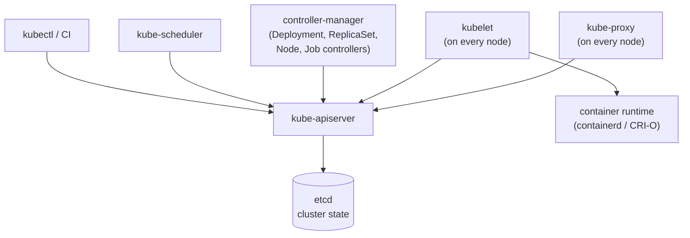
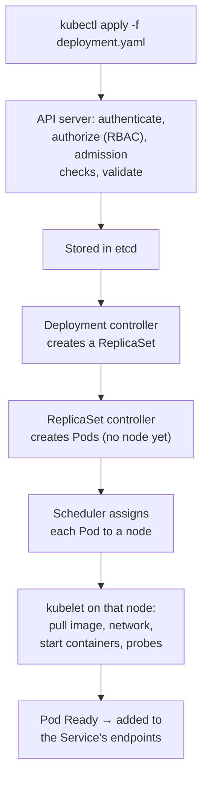

# Kubernetes — Interview Q&A

**What this covers:** the Kubernetes questions asked in backend interviews — the
architecture, the core objects (Pod, Deployment, Service, Ingress, ConfigMap, Secret,
volumes), probes, resources and autoscaling, security, tooling, the **troubleshooting
scenarios** every interviewer asks (CrashLoopBackOff, Pending, OOMKilled), and how to
run a **Spring Boot** service well on Kubernetes. Every answer starts with the short
version; ★★★ questions add the detail interviewers dig into.

**Quick revision:** the Contents table gives a one-line answer for every question.
Docker basics are in [13_Docker_QA.md](13_Docker_QA.md); EKS specifics in
[11 Q10](11_AWS_Serverless_Containers_DevOps_QA.md#10-eks-essentials).

**How the facts were checked:** stable Kubernetes facts come from my own knowledge.
Recent changes were confirmed on 7 Oct 2026 against kubernetes.io (listed under
Sources) and are marked "(confirmed …)".

## Weight legend

| Mark | What it means | How the answer is written |
| --- | --- | --- |
| ★★★ | Asked in almost every round, with follow-ups | Short answer, then detail and an example |
| ★★ | Asked often | Short answer and one example or table |
| ★ | Occasional | Two to four lines |

## Contents

| # | Question | Weight | One-line answer |
| --- | --- | --- | --- |
| 1 | [What is Kubernetes](#1-what-is-kubernetes-and-why-use-it) | ★★★ | Runs containers across machines and keeps them in the desired state |
| 2 | [Architecture](#2-kubernetes-architecture) | ★★★ | Control plane (API server, etcd, scheduler, controllers) + nodes (kubelet, kube-proxy, runtime) |
| 3 | [`kubectl apply` flow](#3-what-happens-when-you-run-kubectl-apply) | ★★★ | API server → etcd → controllers → scheduler → kubelet |
| 4 | [Pod](#4-what-is-a-pod) | ★★★ | Smallest unit: containers sharing an IP and volumes |
| 5 | [Init containers, sidecars](#5-init-containers-and-sidecars) | ★★ | Run-before helpers; run-alongside helpers |
| 6 | [Pod vs ReplicaSet vs Deployment](#6-pod-vs-replicaset-vs-deployment) | ★★★ | Deployment manages ReplicaSets, which manage Pods |
| 7 | [Deployment vs StatefulSet](#7-deployment-vs-statefulset) | ★★★ | Stateless and interchangeable vs stable names and storage |
| 8 | [DaemonSet, Job, CronJob](#8-daemonset-job-and-cronjob) | ★★ | One per node; run to completion; on a schedule |
| 9 | [Service types](#9-service-types) | ★★★ | ClusterIP, NodePort, LoadBalancer, ExternalName, headless |
| 10 | [Service discovery, DNS](#10-service-discovery-and-dns) | ★★ | `service.namespace.svc.cluster.local` |
| 11 | [Ingress and Gateway API](#11-ingress-and-gateway-api) | ★★★ | HTTP routing into the cluster; Gateway API is the successor |
| 12 | [ConfigMap vs Secret](#12-configmap-vs-secret) | ★★★ | Secrets are only base64 — encrypt and restrict them |
| 13 | [Volumes, PV, PVC](#13-volumes-pv-pvc-and-storageclass) | ★★★ | PVC requests storage; StorageClass provisions it |
| 14 | [Namespaces, labels](#14-namespaces-labels-and-annotations) | ★★ | Grouping and selection |
| 15 | [Requests, limits, QoS](#15-requests-limits-and-qos-classes) | ★★★ | Requests schedule; memory limit kills; CPU limit throttles |
| 16 | [Probes](#16-liveness-readiness-and-startup-probes) | ★★★ | Liveness restarts, readiness removes from traffic, startup waits |
| 17 | [Rolling updates](#17-rolling-updates-and-rollbacks) | ★★★ | maxSurge / maxUnavailable; `kubectl rollout undo` |
| 18 | [Autoscaling](#18-autoscaling) | ★★★ | HPA pods, VPA sizes, cluster autoscaler nodes |
| 19 | [Where pods run](#19-controlling-where-pods-run) | ★★ | Affinity, taints and tolerations, topology spread |
| 20 | [Graceful shutdown](#20-graceful-pod-shutdown) | ★★★ | SIGTERM, 30 s grace period, preStop sleep |
| 21 | [PodDisruptionBudget](#21-poddisruptionbudget) | ★★ | Keep N pods up during node drains |
| 22 | [RBAC](#22-rbac-and-service-accounts) | ★★ | Roles + bindings for users and service accounts |
| 23 | [Network policies](#23-network-policies) | ★★ | Pod firewall; everything is open by default |
| 24 | [Pod security](#24-pod-security) | ★★ | Non-root, read-only, no privilege escalation |
| 25 | [Quotas and limits](#25-resourcequota-and-limitrange) | ★ | Caps per namespace; defaults per container |
| 26 | [Helm vs Kustomize](#26-helm-vs-kustomize) | ★★ | Templated packages vs patch overlays |
| 27 | [GitOps](#27-gitops) | ★★ | Git is the source of truth; Argo CD syncs it |
| 28 | [CRDs and operators](#28-crds-and-operators) | ★★ | Custom resources + controllers that manage them |
| 29 | [Service mesh](#29-service-mesh) | ★ | mTLS, retries, traffic splitting outside the app |
| 30 | [Logging and monitoring](#30-logging-and-monitoring) | ★★ | stdout logs, metrics-server, Prometheus |
| 31 | [kubectl commands](#31-kubectl-commands-you-should-know) | ★★★ | get, describe, logs, exec, rollout, port-forward |
| 32 | [CrashLoopBackOff](#32-scenario-crashloopbackoff) | ★★★ | Read `logs --previous` and the exit code |
| 33 | [ImagePullBackOff](#33-scenario-imagepullbackoff) | ★★ | Wrong image or tag, or no registry access |
| 34 | [Pending pod](#34-scenario-pod-stuck-in-pending) | ★★★ | No node fits — read the events |
| 35 | [OOMKilled, Evicted](#35-scenario-oomkilled-and-evicted) | ★★ | Over the memory limit; node under pressure |
| 36 | [Service not reachable](#36-scenario-service-not-reachable) | ★★★ | Check endpoints, ports, readiness, policies, DNS |
| 37 | [Spring Boot on Kubernetes](#37-running-a-spring-boot-app-well-on-kubernetes) | ★★★ | Probes, graceful shutdown, JVM memory, config, metrics |
| 38 | [Managed Kubernetes](#38-managed-kubernetes-and-upgrades) | ★ | EKS/GKE/AKS run the control plane; you upgrade often |
| 39 | [etcd](#39-etcd) | ★ | The cluster's database; back it up |

---

## 1. What is Kubernetes, and why use it?

**Weight:** ★★★

**Short answer:** Kubernetes (K8s) is a container orchestrator. You describe the
**desired state** — "run 3 copies of this image, reachable on this port" — and it keeps
the cluster in that state across many machines.

**What it does for you:**

- **Scheduling** — decides which machine runs each container.
- **Self-healing** — restarts crashed containers, replaces pods on failed nodes.
- **Scaling** — more or fewer copies, manually or automatically.
- **Service discovery and load balancing** — a stable name and IP in front of changing
  pods.
- **Rolling updates and rollbacks** — new versions without downtime.
- **Configuration and secrets** — injected without rebuilding images.

**How it works underneath:** controllers run *reconciliation loops* — continuously
compare desired state with actual state and act to close the gap.

---

## 2. Kubernetes architecture

**Weight:** ★★★



**Control plane:**

| Component | Job |
| --- | --- |
| **kube-apiserver** | The front door: every request goes through it (authentication, authorization, admission checks). The only component that talks to etcd |
| **etcd** | Key-value store holding the whole cluster state |
| **kube-scheduler** | Picks a node for each new pod (filters nodes that fit, then scores them) |
| **kube-controller-manager** | Runs the controllers that reconcile desired vs actual state |
| **cloud-controller-manager** | Talks to the cloud: load balancers, node lifecycle, routes |

**Every worker node:**

| Component | Job |
| --- | --- |
| **kubelet** | Makes sure the pods assigned to its node are running; runs probes; reports status |
| **kube-proxy** | Implements Services — programs routing rules (iptables, IPVS or nftables) so traffic to a Service reaches a pod. Some network plugins (Cilium) replace it |
| **Container runtime** | Pulls images and runs containers (containerd, CRI-O) |
| **CNI plugin** | Gives every pod an IP and connects pods across nodes |

---

## 3. What happens when you run kubectl apply

**Weight:** ★★★ — tests whether you understand how the pieces cooperate.



No component calls another directly — each **watches** the API server for objects it
cares about and updates them. That is why Kubernetes keeps working when one controller
restarts: it simply resumes reconciling.

---

## 4. What is a Pod?

**Weight:** ★★★

**Short answer:** the smallest thing Kubernetes runs — one or more containers that
**share a network namespace** (one IP address; they reach each other on `localhost`)
and can **share volumes**. Usually one main container per pod.

**Key facts:**

- **Pods are ephemeral.** When a pod dies it is replaced by a **new** pod with a new name
  and IP — never "restarted somewhere else". So never depend on a pod's IP; use a
  Service.
- **Don't create bare pods.** Use a Deployment, StatefulSet or Job, so something
  recreates them.
- **Phases:** `Pending` → `Running` → `Succeeded` / `Failed` (and `Unknown` if the node
  can't be reached).
- **Restart policy:** `Always` (default for Deployments), `OnFailure`, `Never` (for Jobs).

---

## 5. Init containers and sidecars

**Weight:** ★★

- **Init containers** run **to completion, one after another, before** the main
  containers start. Use them for setup: wait for a dependency, run a migration, fetch
  config.
- **Sidecar containers** run **alongside** the main container for the pod's whole life:
  log shippers, proxies (service mesh), config reloaders.
- **Native sidecars:** declared as init containers with `restartPolicy: Always`. They
  start before the app, keep running, and stop after it — fixing the old problem of a
  sidecar blocking a Job from completing. Stable since Kubernetes 1.33 (confirmed:
  kubernetes.io).

---

## 6. Pod vs ReplicaSet vs Deployment

**Weight:** ★★★

| Object | Job |
| --- | --- |
| **Pod** | Runs the containers |
| **ReplicaSet** | Keeps N identical pods running (recreates missing ones) |
| **Deployment** | Manages ReplicaSets to roll out new versions and roll back |

**How a rollout works:** changing the pod template (a new image tag) makes the
Deployment create a **new ReplicaSet**, scale it up, and scale the old one down. The old
ReplicaSet is kept (at zero replicas) so `kubectl rollout undo` can switch back.

**Short answer:** you create Deployments; you almost never touch ReplicaSets or Pods
directly.

---

## 7. Deployment vs StatefulSet

**Weight:** ★★★

| | Deployment | StatefulSet |
| --- | --- | --- |
| Pod names | Random (`orders-7c9f…-x2kq`) | Stable, ordered (`kafka-0`, `kafka-1`) |
| Storage | Shared or none | **Each pod gets its own** volume (via `volumeClaimTemplates`) that follows it |
| Network identity | Through the Service only | Stable DNS per pod through a headless Service (`kafka-0.kafka.ns.svc.cluster.local`) |
| Start and stop order | Any order, in parallel | One by one, in order |
| Use for | Stateless apps — APIs, web services, workers | Databases, Kafka, ZooKeeper, Elasticsearch |

**Senior point:** running databases on Kubernetes is possible, but many teams prefer a
managed database (RDS, Cloud SQL) and keep the cluster for stateless services — backups,
failover and upgrades are then someone else's problem.

---

## 8. DaemonSet, Job and CronJob

**Weight:** ★★

- **DaemonSet** — exactly one pod on every node (or every matching node). For node-level
  agents: log collectors, monitoring agents, network plugins.
- **Job** — runs pods until a task **completes successfully**, retrying failures up to
  `backoffLimit`. For migrations, batch processing, one-off tasks.
- **CronJob** — creates a Job on a cron schedule. Set `concurrencyPolicy` (`Forbid` stops
  overlapping runs) and make the job **idempotent** — a run can occasionally happen
  twice or be missed.

---

## 9. Service types

**Weight:** ★★★

**Short answer:** a **Service** gives a stable name and virtual IP to a changing set of
pods, chosen by a **label selector**, and load-balances across them.

| Type | Reachable from | Use for |
| --- | --- | --- |
| **ClusterIP** (default) | Inside the cluster only | Service-to-service calls |
| **NodePort** | `<any node IP>:<port 30000–32767>` | Rarely directly; a building block |
| **LoadBalancer** | The internet or VPC, through a cloud load balancer | Exposing one service (non-HTTP, or simple setups) |
| **ExternalName** | — (a DNS alias) | Giving an outside service (a managed DB) a cluster name |
| **Headless** (`clusterIP: None`) | DNS returns the **pod IPs** directly | StatefulSets; client-side load balancing (gRPC) |

```yaml
apiVersion: v1
kind: Service
metadata:
  name: orders
spec:
  selector:
    app: orders            # sends traffic to pods with this label
  ports:
    - port: 80             # the Service's port
      targetPort: 8080     # the container's port
```

**For HTTP apps,** don't create a LoadBalancer per service — put one Ingress or Gateway
in front of many ClusterIP services (Q11).

---

## 10. Service discovery and DNS

**Weight:** ★★

- **CoreDNS** gives every Service a DNS name:
  `<service>.<namespace>.svc.cluster.local`.
- In the same namespace, just `http://orders`; from another namespace,
  `http://orders.billing`.
- The Service's endpoints list contains only **Ready** pods, so traffic skips pods still
  starting or failing readiness.
- That is why Spring Cloud service registries (Eureka) are usually unnecessary on
  Kubernetes — the platform already does discovery and load balancing.

---

## 11. Ingress and Gateway API

**Weight:** ★★★

**Ingress:** rules for routing external HTTP(S) traffic to Services by **host and path**,
with TLS termination. An Ingress object does nothing by itself — an **Ingress
controller** (NGINX, Traefik, HAProxy, the AWS Load Balancer Controller…) implements it.

```yaml
apiVersion: networking.k8s.io/v1
kind: Ingress
metadata:
  name: shop
spec:
  ingressClassName: alb
  rules:
    - host: api.shop.example.com
      http:
        paths:
          - path: /orders
            pathType: Prefix
            backend:
              service: { name: orders, port: { number: 80 } }
```

**Gateway API — the successor:** separate resources per role (`GatewayClass` for the
platform, `Gateway` for the cluster operator, `HTTPRoute` for app teams), with built-in
support for things Ingress needed annotations for: header matching, weighted traffic
splitting (canaries), cross-namespace routing.

**Recent change worth knowing:** the community **ingress-nginx** controller was retired —
best-effort maintenance ended in March 2026, with no further releases or security fixes,
and the Kubernetes project recommends moving to Gateway API (confirmed: kubernetes.io,
Nov 2025). Existing installations keep working but no longer get patches.

---

## 12. ConfigMap vs Secret

**Weight:** ★★★

| | ConfigMap | Secret |
| --- | --- | --- |
| For | Non-sensitive configuration | Passwords, tokens, keys, certificates |
| Stored as | Plain text | **base64 — an encoding, not encryption** |
| Size limit | 1 MiB | 1 MiB |

**Ways to use them:** as environment variables, or as files in a mounted volume.
Mounted files **update automatically** when the ConfigMap or Secret changes (eventually);
environment variables **do not** — the pod must restart.

**Securing Secrets — what interviewers want to hear:**

1. Turn on **encryption at rest** for Secrets in etcd (managed clusters can use a cloud
   KMS key).
2. Restrict who can read them with **RBAC** — `get secrets` in a namespace means seeing
   every secret there.
3. Better still, keep the real values in an external store (AWS Secrets Manager, Vault)
   and sync them in with **External Secrets Operator** or the **Secrets Store CSI
   driver**.
4. Never commit Secret YAML with real values to Git (use Sealed Secrets or SOPS if they
   must live in Git).

---

## 13. Volumes, PV, PVC and StorageClass

**Weight:** ★★★

| Object | What it is |
| --- | --- |
| **Volume** | Storage attached to a pod: `emptyDir` (scratch, lives as long as the pod), `configMap`, `secret`, or a PVC |
| **PersistentVolume (PV)** | A piece of real storage (an EBS volume, an NFS share) |
| **PersistentVolumeClaim (PVC)** | A pod's **request** for storage: "10 Gi, read-write by one node" |
| **StorageClass** | How to create PVs on demand (**dynamic provisioning**) — e.g. EBS gp3 through the CSI driver |

**Access modes:** `ReadWriteOnce` (one node — block storage like EBS), `ReadOnlyMany`,
`ReadWriteMany` (many nodes — file storage like EFS or NFS), `ReadWriteOncePod`.

**Reclaim policy:** `Delete` removes the disk when the PVC is deleted; `Retain` keeps it.
Use `Retain` for anything precious.

**Cloud trap:** an EBS volume lives in one AZ, so a pod using it can only run in that
AZ. Use a StorageClass with `volumeBindingMode: WaitForFirstConsumer`, so the volume is
created in the AZ where the pod is scheduled.

---

## 14. Namespaces, labels and annotations

**Weight:** ★★

- **Namespaces** split one cluster into groups (per team or environment) for names,
  RBAC permissions and resource quotas. They are **not** a network boundary — pods in
  different namespaces can talk unless a NetworkPolicy says otherwise.
- **Labels** are key-value pairs used to **select** objects: Services, Deployments and
  NetworkPolicies find pods by label (`app=orders, tier=backend`).
- **Annotations** are key-value metadata **not used for selection**: build info, tool
  configuration (ingress settings, Prometheus scrape hints).

---

## 15. Requests, limits and QoS classes

**Weight:** ★★★

| | Request | Limit |
| --- | --- | --- |
| Meaning | What the container is **guaranteed** | The **maximum** it may use |
| Used by | The scheduler, to place the pod on a node with room | The kernel, at run time |
| CPU above it | — | **Throttled** (slowed down), not killed |
| Memory above it | — | **OOMKilled** (exit code 137) and restarted |

```yaml
resources:
  requests:
    cpu: "500m"        # half a CPU
    memory: "1Gi"
  limits:
    memory: "1Gi"      # memory limit = request for Java apps
```

**QoS classes** decide who is evicted first when a node runs short of memory:

| Class | When | Evicted |
| --- | --- | --- |
| Guaranteed | Requests = limits for CPU and memory, every container | Last |
| Burstable | Some requests set | In between |
| BestEffort | No requests or limits | **First** |

**Practices:**

- **Always set requests** — without them the scheduler packs pods blindly.
- Set the **memory limit equal to the request** for predictable behaviour.
- CPU limits are debated: they cause throttling and latency spikes even when the node has
  spare CPU, so many teams set CPU requests but no CPU limit.
- **Java:** the JVM sizes its heap from the memory limit — set
  `-XX:MaxRAMPercentage=75` ([13 Q11](13_Docker_QA.md#11-the-jvm-inside-a-container)).

---

## 16. Liveness, readiness and startup probes

**Weight:** ★★★

| Probe | Question | On failure |
| --- | --- | --- |
| **Liveness** | Is the container broken beyond repair? | Container is **restarted** |
| **Readiness** | Can it handle traffic right now? | Removed from the Service's endpoints — **no restart** |
| **Startup** | Has it finished starting? | Liveness and readiness wait until it passes; if it never does, restart |

```yaml
startupProbe:
  httpGet: { path: /actuator/health/liveness, port: 8080 }
  periodSeconds: 5
  failureThreshold: 30       # up to 150 s to start
livenessProbe:
  httpGet: { path: /actuator/health/liveness, port: 8080 }
  periodSeconds: 10
  failureThreshold: 3
readinessProbe:
  httpGet: { path: /actuator/health/readiness, port: 8080 }
  periodSeconds: 5
```

**Rules:**

- **Never check the database (or any shared dependency) in liveness.** A database blip
  would restart every pod at once.
- Use a **startup probe** for slow-starting apps such as JVMs, instead of a long
  `initialDelaySeconds` that also delays restarts later.
- Probe types: `httpGet`, `tcpSocket`, `exec`, `grpc`.
- Spring Boot Actuator provides both endpoints
  ([07 Q6](07_Spring_Boot_Actuator_QA.md#6-liveness-and-readiness-probes)).

---

## 17. Rolling updates and rollbacks

**Weight:** ★★★

**Default strategy — RollingUpdate:**

```yaml
strategy:
  type: RollingUpdate
  rollingUpdate:
    maxSurge: 25%          # extra pods allowed during the update (default 25%)
    maxUnavailable: 0      # never drop below the desired count (default 25%)
```

- New pods must pass **readiness** before old ones are removed — so good readiness probes
  are what make rollouts safe.
- `progressDeadlineSeconds` (default 600) marks a rollout that isn't progressing as
  failed.
- The other built-in strategy, `Recreate`, stops all old pods first — downtime, but no two
  versions running together.

**Commands:**

```text
kubectl rollout status deployment/orders
kubectl rollout history deployment/orders
kubectl rollout undo deployment/orders                 # back to the previous version
kubectl rollout undo deployment/orders --to-revision=3
kubectl rollout restart deployment/orders              # restart pods, same version
```

**Blue/green and canary** aren't built into Deployments. Use Argo Rollouts or Flagger,
or weighted routes in Gateway API or a service mesh.

---

## 18. Autoscaling

**Weight:** ★★★

| Autoscaler | Scales | Based on |
| --- | --- | --- |
| **Horizontal Pod Autoscaler (HPA)** | Number of pods | CPU or memory vs requests, or custom metrics (requests per second, queue length) |
| **Vertical Pod Autoscaler (VPA)** | CPU and memory requests of pods | Observed usage |
| **Cluster Autoscaler / Karpenter** | Number of **nodes** | Pods stuck in Pending for lack of room; removes empty nodes |
| **KEDA** | Pods, down to zero | Event sources: queue depth, Kafka lag, cron |

```yaml
apiVersion: autoscaling/v2
kind: HorizontalPodAutoscaler
metadata:
  name: orders
spec:
  scaleTargetRef: { apiVersion: apps/v1, kind: Deployment, name: orders }
  minReplicas: 3
  maxReplicas: 20
  metrics:
    - type: Resource
      resource:
        name: cpu
        target: { type: Utilization, averageUtilization: 60 }
```

**Points interviewers check:**

- HPA needs **resource requests** (utilisation is measured against them) and
  **metrics-server**.
- HPA and cluster autoscaling work together: HPA adds pods → pods don't fit → the node
  autoscaler adds nodes.
- Don't let HPA and VPA both act on CPU or memory for the same workload.
- **In-place pod resize** — changing a running pod's CPU and memory, often without a
  restart — is stable since Kubernetes 1.35 (confirmed: kubernetes.io, Dec 2025).
- **Java:** CPU spikes during JVM startup can trigger needless scale-ups — use a
  stabilisation window or a request-based metric.

---

## 19. Controlling where pods run

**Weight:** ★★

| Tool | Set on | Effect |
| --- | --- | --- |
| `nodeSelector` | Pod | Only nodes with these labels |
| Node affinity | Pod | Required or preferred node rules (richer than nodeSelector) |
| Pod anti-affinity | Pod | Keep replicas apart (different nodes or zones) |
| **Taints** | Node | Repel pods: `NoSchedule`, `PreferNoSchedule`, `NoExecute` |
| **Tolerations** | Pod | Allow a pod onto tainted nodes |
| Topology spread constraints | Pod | Spread replicas evenly across zones or nodes |
| PriorityClass | Pod | Important pods can pre-empt less important ones |

**Examples:** taint GPU nodes so only GPU workloads (with the toleration) land there;
spread a service's replicas across three availability zones so one zone outage doesn't
take all of them.

---

## 20. Graceful pod shutdown

**Weight:** ★★★

**What happens when a pod is deleted** (deploy, scale-down, node drain):

1. The pod is marked **Terminating**, and — **at the same time** — removal from Service
   endpoints begins.
2. The **preStop** hook runs, if defined.
3. The container receives **SIGTERM**.
4. Kubernetes waits up to `terminationGracePeriodSeconds` (**default 30 s**, counting the
   preStop time), then sends **SIGKILL**.

**The race:** steps 1 and 3 happen in parallel, so for a few seconds load balancers and
kube-proxy may still send requests to a pod that has started shutting down — causing
errors during every deploy.

**Fix:**

```yaml
spec:
  terminationGracePeriodSeconds: 45
  containers:
    - name: orders
      lifecycle:
        preStop:
          exec:
            command: ["sh", "-c", "sleep 10"]   # let endpoints update first
```

…plus graceful shutdown in the app (Spring Boot does this by default —
[04 Q25](04_Spring_Boot_QA.md#25-graceful-shutdown)), so in-flight requests finish
after SIGTERM. The grace period must cover preStop + the app's shutdown time.

**Also:** the app must receive SIGTERM — use an exec-form `ENTRYPOINT`
([13 Q19](13_Docker_QA.md#19-stopping-containers-cleanly-pid-1-and-signals)).

---

## 21. PodDisruptionBudget

**Weight:** ★★

- Limits how many pods of an app can be down at once during **voluntary** disruptions:
  node drains, cluster upgrades, autoscaler scale-down.

```yaml
apiVersion: policy/v1
kind: PodDisruptionBudget
metadata:
  name: orders
spec:
  minAvailable: 2          # or maxUnavailable: 1
  selector:
    matchLabels: { app: orders }
```

- It does **not** protect against crashes or node failures — only against planned
  evictions.
- **Trap:** `minAvailable` equal to the replica count blocks node drains forever, which
  stalls cluster upgrades.

---

## 22. RBAC and service accounts

**Weight:** ★★

| Object | Scope | Purpose |
| --- | --- | --- |
| `Role` | One namespace | A set of allowed actions (verbs on resources) |
| `ClusterRole` | Whole cluster | Same, cluster-wide or reusable across namespaces |
| `RoleBinding` | One namespace | Grants a Role (or ClusterRole) to users, groups or service accounts |
| `ClusterRoleBinding` | Whole cluster | Grants a ClusterRole everywhere |

- **ServiceAccount** — the identity a **pod** uses to call the Kubernetes API. Each pod
  gets a short-lived token automatically.
- **Least privilege:** most application pods need **no** Kubernetes API access — don't
  bind them any roles, and consider `automountServiceAccountToken: false`.
- **Cloud permissions** (S3, SQS) are separate: map the ServiceAccount to an IAM role
  ([09 Q5](09_AWS_Compute_IAM_Networking_QA.md#5-how-applications-and-pipelines-get-credentials)).
- Check permissions with `kubectl auth can-i delete pods -n prod --as jane`.

---

## 23. Network policies

**Weight:** ★★

**Short answer:** by default **every pod can talk to every pod** in the cluster. A
NetworkPolicy is a firewall for pods — it selects pods by label and allows only the
listed incoming and outgoing traffic. It needs a network plugin that enforces it
(Calico, Cilium, and most managed-cluster plugins).

```yaml
apiVersion: networking.k8s.io/v1
kind: NetworkPolicy
metadata:
  name: orders-db-only-from-orders
spec:
  podSelector:
    matchLabels: { app: orders-db }
  policyTypes: [Ingress]
  ingress:
    - from:
        - podSelector:
            matchLabels: { app: orders }
      ports:
        - port: 5432
```

**Practice:** start each namespace with a **default-deny** policy, then allow only what
each service needs — and remember to allow DNS egress.

---

## 24. Pod security

**Weight:** ★★

**`securityContext` settings to know:**

```yaml
securityContext:
  runAsNonRoot: true
  runAsUser: 10001
  allowPrivilegeEscalation: false
  readOnlyRootFilesystem: true
  capabilities:
    drop: ["ALL"]
  seccompProfile:
    type: RuntimeDefault
```

- **Trap:** `runAsNonRoot: true` with an image whose `USER` is a **name** (`USER app`)
  fails to start — Kubernetes can't prove a named user isn't root. Use a numeric
  `USER 10001` in the Dockerfile or set `runAsUser`.
- **Pod Security Admission** enforces the **Pod Security Standards** per namespace with
  labels: `privileged`, `baseline`, or `restricted`. It replaced PodSecurityPolicy, which
  was removed in Kubernetes 1.25.
- **Policy engines** (Kyverno, OPA Gatekeeper) enforce custom rules: "images only from our
  registry", "every pod must have resource requests".
- **Also:** scan images, avoid `hostPath` and privileged pods, keep nodes patched.

---

## 25. ResourceQuota and LimitRange

**Weight:** ★

- **ResourceQuota** caps a **namespace's total**: CPU, memory, number of pods, PVCs,
  LoadBalancer services. Stops one team consuming the whole cluster.
- **LimitRange** sets **defaults and min/max per container** in a namespace — so pods
  without requests still get sensible ones.

---

## 26. Helm vs Kustomize

**Weight:** ★★

| | Helm | Kustomize |
| --- | --- | --- |
| Approach | Templates + a `values.yaml` per environment | Plain YAML base + patches (overlays) per environment |
| Packaging | **Charts** — versioned packages, shareable through repositories | No packaging |
| Releases | Tracks installed releases; `helm rollback` | None — just applies YAML |
| Learning curve | Templating language can get complex | Simple; built into `kubectl apply -k` |
| Typical use | Installing third-party software (Prometheus, cert-manager); internal service charts | Environment differences for your own manifests |

Many teams use both: Helm for third-party components, Kustomize (or a shared Helm chart)
for their own services.

---

## 27. GitOps

**Weight:** ★★

- **Git holds the desired state** of the cluster (manifests, Helm values). A controller in
  the cluster — **Argo CD** or **Flux** — continuously syncs the cluster to Git and
  reports or fixes drift.
- **Deploy** = merge a pull request (usually a new image tag). **Rollback** = revert the
  commit.
- **Benefits:** full audit trail, review on every change, no CI system holding cluster
  admin credentials, and the cluster can be rebuilt from Git.

---

## 28. CRDs and operators

**Weight:** ★★

- A **CustomResourceDefinition (CRD)** adds a new resource type to the Kubernetes API —
  e.g. `KafkaTopic`, `Certificate`, `PostgresCluster`.
- An **operator** is a controller that watches those custom resources and does the
  operational work a human expert would: create a database cluster, take backups, fail
  over, upgrade.
- **Examples:** cert-manager (TLS certificates), Strimzi (Kafka), Prometheus Operator,
  CloudNativePG / Zalando (PostgreSQL).

---

## 29. Service mesh

**Weight:** ★

- A layer of proxies (sidecars, or sidecar-less modes) that handles service-to-service
  traffic: **mutual TLS**, retries and timeouts, traffic splitting, and uniform metrics
  and traces — without application code changes.
- **Examples:** Istio, Linkerd.
- **Trade-off:** real operational complexity and some latency. Worth it at many services
  with strict security or traffic-control needs; overkill for a handful of services.

---

## 30. Logging and monitoring

**Weight:** ★★

- **Logs:** apps write to **stdout/stderr**; a node agent (Fluent Bit, a DaemonSet) ships
  them to a backend (CloudWatch, Elasticsearch/OpenSearch, Loki). `kubectl logs` reads
  them; `--previous` shows the last crashed container.
- **Metrics:** **metrics-server** powers `kubectl top` and the HPA. **Prometheus +
  Grafana** (often the kube-prometheus-stack chart) for dashboards and alerts;
  **kube-state-metrics** exposes object state (desired vs available replicas, restarts).
- **Events:** `kubectl get events --sort-by=.lastTimestamp` — scheduling failures, image
  pulls, probe failures, OOM kills.
- **Traces:** OpenTelemetry, with the trace id in every log line.

---

## 31. kubectl commands you should know

**Weight:** ★★★

| Command | Does |
| --- | --- |
| `kubectl get pods -n shop -o wide` | List pods with node and IP |
| `kubectl describe pod <pod>` | Details **and events** — the first stop when something is wrong |
| `kubectl logs <pod> [-c container] [-f] [--previous]` | Container logs; `--previous` = the crashed instance |
| `kubectl exec -it <pod> -- sh` | Shell inside a container |
| `kubectl apply -f file.yaml` / `kubectl delete -f file.yaml` | Create or update / remove objects |
| `kubectl rollout status / undo deployment/<name>` | Watch or roll back a deployment |
| `kubectl scale deployment/<name> --replicas=5` | Change the replica count |
| `kubectl port-forward svc/orders 8080:80` | Reach a service from your laptop |
| `kubectl top pods` / `kubectl top nodes` | Live CPU and memory |
| `kubectl get events --sort-by=.lastTimestamp` | Recent cluster events |
| `kubectl get endpointslices -l kubernetes.io/service-name=orders` | Which pods a Service actually routes to |
| `kubectl debug -it <pod> --image=busybox` | Attach a temporary debug container |
| `kubectl auth can-i <verb> <resource>` | Check permissions |
| `kubectl explain deployment.spec.strategy` | Built-in field documentation |

---

## 32. Scenario: CrashLoopBackOff

**Weight:** ★★★ — the most common troubleshooting question.

**What it means:** the container starts, exits (or is killed), and Kubernetes keeps
restarting it, waiting longer between attempts (back-off up to 5 minutes).

| Step | Command | Look for |
| --- | --- | --- |
| 1 | `kubectl logs <pod> --previous` | The crashed container's last output — the stack trace |
| 2 | `kubectl describe pod <pod>` | `Last State`: exit code and reason; events (probe failures, OOM) |

| Exit code / reason | Usual cause | Fix |
| --- | --- | --- |
| 1 (Error) | App error: missing config or secret, can't reach the DB, bad property | Read the logs; check ConfigMaps, Secrets, env vars |
| 137 / `OOMKilled` | Exceeded the memory limit | Raise the limit, set `MaxRAMPercentage`, look for a leak (Q35) |
| 137 after liveness failures | Liveness probe killed a slow-starting app | Add a startup probe; relax liveness |
| 126 / 127 | Command not found or not executable | Wrong `command`/`args` or image entrypoint |
| `exec format error` | Image built for another CPU architecture | Build a multi-arch image (amd64 + arm64) |

---

## 33. Scenario: ImagePullBackOff

**Weight:** ★★

`kubectl describe pod` shows the exact pull error. Usual causes:

- **Wrong image name or tag** (typo, tag never pushed).
- **No access to a private registry:** missing `imagePullSecrets`, or the node's IAM role
  can't read ECR.
- **Registry rate limits** (Docker Hub — see
  [13 Q22](13_Docker_QA.md#22-tags-digests-and-registries)): use a mirror or pull-through
  cache.
- **Network:** nodes in private subnets with no route to the registry (needs NAT or VPC
  endpoints).

---

## 34. Scenario: pod stuck in Pending

**Weight:** ★★★

**Pending = the scheduler can't find a node, or the pod waits for storage.**
`kubectl describe pod` → Events says why, e.g.
`0/6 nodes are available: 3 Insufficient memory, 3 node(s) had untolerated taint`.

| Cause | Fix |
| --- | --- |
| Not enough CPU or memory on any node | Lower requests that are too high, or add nodes (cluster autoscaler) |
| nodeSelector / affinity matches no node | Fix labels or rules |
| Taints without matching tolerations | Add the toleration or use other nodes |
| PVC not bound | Check the StorageClass; zone mismatch for EBS volumes (Q13) |
| Namespace ResourceQuota exceeded | Raise the quota or clean up |
| Anti-affinity can't be satisfied (more replicas than nodes or zones) | Use `preferred` instead of `required`, or add capacity |

---

## 35. Scenario: OOMKilled and Evicted

**Weight:** ★★

- **OOMKilled** — the **container** used more memory than its **limit**; the kernel killed
  it (exit code 137).
  - Java: by default the heap is only 25% of the limit, but non-heap memory (metaspace,
    threads, direct buffers) also counts. Set `-XX:MaxRAMPercentage=75`, size the limit
    with headroom, and check for leaks with a heap dump.
- **Evicted** — the **node** ran short of memory, disk or ephemeral storage, and the
  kubelet evicted pods to protect itself, **BestEffort first, then Burstable** (Q15).
  - Fix: set requests realistically; limit local disk use (logs, `/tmp`); use
    `ephemeral-storage` requests and limits.

---

## 36. Scenario: service not reachable

**Weight:** ★★★

Check in this order:

| # | Check | Command / what to look for |
| --- | --- | --- |
| 1 | Are the pods Running **and Ready**? | `kubectl get pods` — not Ready = failing readiness, so not in the Service |
| 2 | Does the Service select them? | `kubectl get endpointslices -l kubernetes.io/service-name=orders` — **empty means the selector doesn't match the pod labels** |
| 3 | Ports | Service `targetPort` must equal the container's listening port |
| 4 | Does the app listen on all interfaces? | Listening on `127.0.0.1` instead of `0.0.0.0` rejects traffic from outside the pod |
| 5 | Can you reach it directly? | `kubectl port-forward pod/<pod> 8080:8080`, then curl |
| 6 | DNS | From a debug pod: `nslookup orders.shop` |
| 7 | NetworkPolicy | A default-deny policy without an allow rule for the caller |
| 8 | From outside | Ingress/Gateway rules (host, path), controller logs, the cloud load balancer's target health |

---

## 37. Running a Spring Boot app well on Kubernetes

**Weight:** ★★★ — a likely question for a Java backend role.

```yaml
apiVersion: apps/v1
kind: Deployment
metadata:
  name: orders
spec:
  replicas: 3
  selector:
    matchLabels: { app: orders }
  template:
    metadata:
      labels: { app: orders }
    spec:
      terminationGracePeriodSeconds: 45
      containers:
        - name: orders
          image: 123456789012.dkr.ecr.ap-south-1.amazonaws.com/orders:3f2a1c9
          ports:
            - containerPort: 8080
          env:
            - name: JAVA_TOOL_OPTIONS
              value: "-XX:MaxRAMPercentage=75"
            - name: SPRING_PROFILES_ACTIVE
              value: prod
          envFrom:
            - configMapRef: { name: orders-config }
            - secretRef: { name: orders-secrets }
          resources:
            requests: { cpu: "500m", memory: "1Gi" }
            limits: { memory: "1Gi" }
          startupProbe:
            httpGet: { path: /actuator/health/liveness, port: 8080 }
            periodSeconds: 5
            failureThreshold: 30
          livenessProbe:
            httpGet: { path: /actuator/health/liveness, port: 8080 }
          readinessProbe:
            httpGet: { path: /actuator/health/readiness, port: 8080 }
          lifecycle:
            preStop:
              exec: { command: ["sh", "-c", "sleep 10"] }
          securityContext:
            runAsNonRoot: true
            runAsUser: 10001
            allowPrivilegeEscalation: false
            readOnlyRootFilesystem: true
          volumeMounts:
            - { name: tmp, mountPath: /tmp }      # Tomcat needs a writable /tmp
      volumes:
        - { name: tmp, emptyDir: {} }
```

**The checklist behind it:**

| Concern | What to do |
| --- | --- |
| Image | Layered jar or buildpacks; tag with the git SHA; non-root ([13 Q10](13_Docker_QA.md#10-dockerizing-a-spring-boot-application)) |
| Memory | Memory limit = request; `MaxRAMPercentage=75` |
| Probes | Actuator liveness/readiness; startup probe for JVM start time; no DB in liveness |
| Shutdown | Boot graceful shutdown + preStop sleep; grace period covers both |
| Configuration | ConfigMap and env vars (relaxed binding: `SPRING_DATASOURCE_URL`); Secrets from an external store |
| Logs and metrics | JSON logs to stdout; `/actuator/prometheus`; trace ids in logs |
| Availability | ≥ 2–3 replicas spread across zones; a PodDisruptionBudget; HPA |
| Discovery | Kubernetes Services — no Eureka needed |

---

## 38. Managed Kubernetes and upgrades

**Weight:** ★

- **EKS, GKE, AKS** run the control plane (API server, etcd) for you. You still own
  nodes (unless you use a fully managed mode such as GKE Autopilot or EKS Auto Mode),
  add-ons, networking choices and **upgrades**.
- Kubernetes releases a new minor version roughly three times a year, and each is
  supported only for a limited time. Treat upgrades as routine: read deprecation notes,
  test in a lower environment, upgrade the control plane, then nodes and add-ons.
- AWS specifics: [11 Q10](11_AWS_Serverless_Containers_DevOps_QA.md#10-eks-essentials).

---

## 39. etcd

**Weight:** ★

- A distributed key-value store holding **all** cluster state — every object, including
  Secrets. Uses the Raft consensus algorithm, so it needs a **majority (quorum)**: run 3 or
  5 members; 3 survives one failure.
- **Self-managed clusters must back it up** (`etcdctl snapshot save`) — losing etcd means
  losing the cluster's definition. Managed services handle this for you.
- Because Secrets live here, enable **encryption at rest**.

---

## Sources

Confirmed on 7 Oct 2026:

- [Ingress NGINX retirement (kubernetes.io, Nov 2025)](https://kubernetes.io/blog/2025/11/11/ingress-nginx-retirement/)
- [Kubernetes v1.33 release — sidecar containers stable](https://kubernetes.io/blog/2025/04/23/kubernetes-v1-33-release/)
- [Kubernetes 1.35 — in-place pod resize stable](https://kubernetes.io/blog/2025/12/19/kubernetes-v1-35-in-place-pod-resize-ga)
