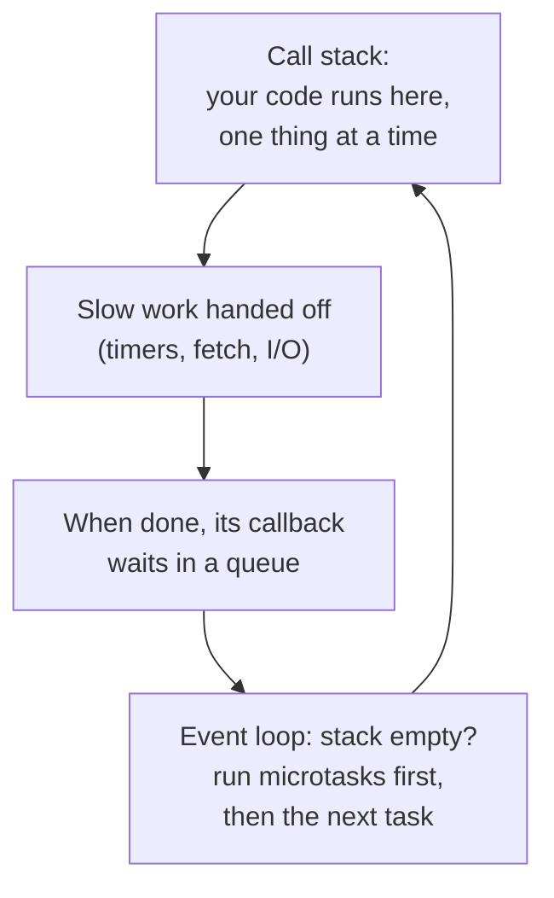

# JavaScript Fundamentals — Learn the Concepts You'll Use Every Day

**What this is:** a hands-on introduction to the JavaScript you actually use at work —
variables, functions, objects, arrays, classes, modules, asynchronous code, and the
browser DOM. Each section explains one idea in plain language, shows a small example you
can paste into a playground, and ends with a short exercise.

**Written for a Java developer:** where JavaScript behaves differently from Java, a
"**Java vs JS**" note says so — that is where most bugs come from.

**Interview questions** on these topics are in [17_JavaScript_QA.md](17_JavaScript_QA.md).
React builds on everything here: [16_React_Fundamentals.md](16_React_Fundamentals.md).

**How the facts were checked:** language behaviour is standard JavaScript. Playground
links were opened on 7 Oct 2026 and loaded, except where marked; version numbers came
from the npm registry and nodejs.org on the same day.

---

## Where to practise online

**Run code (no install needed):**

| Playground | Good for | Link |
| --- | --- | --- |
| Browser console | Instant one-liners — press **F12 → Console** in Chrome or Edge | — |
| MDN Playground | HTML + CSS + JS together, no login | https://developer.mozilla.org/en-US/play |
| PlayCode | JS/TS with live console output as you type | https://playcode.io |
| JSFiddle | Small snippets you want to share | https://jsfiddle.net |
| CodePen | Front-end demos (blocked our automated check; opens fine in a browser) | https://codepen.io |
| StackBlitz | Whole Node or Vite projects in the browser | https://stackblitz.com |
| TypeScript Playground | Plain JS too; shows errors and compiled output | https://www.typescriptlang.org/play |

**See what the code does step by step:**

| Tool | Shows | Link |
| --- | --- | --- |
| Python Tutor (JavaScript mode) | Variables, objects and references as diagrams, line by line | https://pythontutor.com/javascript.html |
| JS Visualizer 9000 | The event loop: call stack, task and microtask queues | https://www.jsv9000.app |

**Learn and practise with exercises:**

| Site | Why use it | Link |
| --- | --- | --- |
| javascript.info | The best free tutorial; every chapter has tasks with solutions | https://javascript.info |
| Exercism — JavaScript track | Exercises with tests and optional mentor feedback | https://exercism.org/tracks/javascript |
| LeetCode — 30 Days of JavaScript | Interview-style JS problems: closures, promises, debounce (blocked our automated check; opens fine in a browser) | https://leetcode.com/studyplan/30-days-of-javascript/ |
| BFE.dev | Front-end interview coding: implement `debounce`, `Promise.all`… | https://bigfrontend.dev |
| GreatFrontEnd | Front-end interview questions and coding problems | https://www.greatfrontend.com |
| JavaScript30 | 30 small projects in plain JavaScript (no frameworks) | https://javascript30.com |
| freeCodeCamp | A structured, free curriculum | https://www.freecodecamp.org/learn |

**Run locally:** install Node.js (current LTS line: **24**, per nodejs.org, Oct 2026),
then `node hello.js`. Guide: https://nodejs.org/en/learn

---

## Contents

| # | Section | You'll learn |
| --- | --- | --- |
| 1 | [Variables](#1-variables-let-const-var) | `let`, `const`, and why not `var` |
| 2 | [Types](#2-types-and-typeof) | The 7 primitives and objects |
| 3 | [Equality and truthiness](#3-equality-and-truthiness) | `===`, and what counts as false |
| 4 | [Strings](#4-strings-and-template-literals) | Template literals, common methods |
| 5 | [Numbers](#5-numbers) | One number type, `NaN`, `0.1 + 0.2` |
| 6 | [Functions](#6-functions) | Declarations, arrows, defaults, rest and spread |
| 7 | [Scope and closures](#7-scope-hoisting-and-closures) | How functions remember variables |
| 8 | [`this`](#8-this) | Why `this` changes, and how arrows fix it |
| 9 | [Objects](#9-objects) | Destructuring, spread, `?.`, `??` |
| 10 | [Arrays](#10-arrays-and-their-methods) | `map`, `filter`, `reduce`, `find`, sorting |
| 11 | [Classes](#11-classes-and-prototypes) | Classes, inheritance, private fields, prototypes |
| 12 | [Modules](#12-modules) | `import` / `export` |
| 13 | [Errors](#13-errors) | `try` / `catch`, custom errors |
| 14 | [Async JavaScript](#14-asynchronous-javascript) | Event loop, promises, `async`/`await` |
| 15 | [fetch and JSON](#15-fetch-and-json) | Calling an API |
| 16 | [DOM and events](#16-the-dom-and-events) | Changing the page, handling clicks |
| 17 | [Copying](#17-copying-objects-shallow-vs-deep) | Shallow vs deep copies |
| 18 | [Map and Set](#18-map-set-and-friends) | Better collections than plain objects |
| 19 | [Modern features](#19-modern-features-worth-knowing) | What arrived in ES2020–ES2025 |
| 20 | [Gotchas](#20-common-gotchas) | The mistakes everyone makes once |
| 21 | [Java vs JavaScript](#21-javascript-for-java-developers) | Side-by-side differences |
| 22 | [Practice plan](#22-a-two-week-practice-plan) | What to do, day by day |

---

## 1. Variables: let, const, var

```js
const taxRate = 0.18;     // can't be reassigned — use by default
let count = 0;            // can be reassigned
count = count + 1;

var old = "avoid";        // old style: function-scoped, hoisted — don't use
```

**Rule:** use `const` by default, `let` when the value must change, never `var`.

**`const` means the *variable* can't be reassigned — not that the object is frozen:**

```js
const user = { name: "Asha" };
user.name = "Ravi";        // OK — the object can change
user = {};                 // TypeError: Assignment to constant variable.
```

**Block scope:** `let` and `const` exist only inside the `{ }` where they are declared —
like Java locals. `var` ignores blocks and belongs to the whole function, which causes
surprises (section 7).

> **Java vs JS:** `const` is like Java's `final` on a reference. There are no type
> declarations — a variable can hold any type.

**Try it:** declare `const items = []`, then `items.push(1)`. Why does that work?

---

## 2. Types and typeof

**Seven primitive types** (immutable values):

| Type | Example |
| --- | --- |
| `string` | `"hello"`, `'hi'`, `` `hi ${name}` `` |
| `number` | `42`, `3.14`, `NaN`, `Infinity` — one type for integers and decimals |
| `bigint` | `9007199254740993n` — integers beyond 2⁵³ |
| `boolean` | `true`, `false` |
| `undefined` | A variable declared but not given a value |
| `null` | "Intentionally empty" — you set it |
| `symbol` | A unique identifier (rarely used directly) |

**Everything else is an object:** plain objects, arrays, functions, dates, maps.

```js
typeof "hi"          // "string"
typeof 42            // "number"
typeof undefined     // "undefined"
typeof null          // "object"   ← a famous historical bug
typeof []            // "object"   ← use Array.isArray([]) instead
typeof function(){}  // "function"
```

**Primitives are copied by value; objects by reference:**

```js
let a = 5;  let b = a;  b = 6;        // a is still 5
const x = { n: 5 };  const y = x;  y.n = 6;   // x.n is now 6 — same object
```

> **Java vs JS:** like Java primitives vs objects — except JS strings are primitives,
> so `===` compares their content.

---

## 3. Equality and truthiness

**Always use `===` and `!==`** (strict: no type conversion).

```js
1 === "1"            // false
1 == "1"             // true   — == converts types first
0 == ""              // true
null == undefined    // true
NaN === NaN          // false  — use Number.isNaN(x)
```

**Falsy values** — these become `false` in an `if`:
`false`, `0`, `-0`, `0n`, `""`, `null`, `undefined`, `NaN`.

**Everything else is truthy** — including `"0"`, `"false"`, `[]` and `{}`.

```js
if (user) { /* … */ }     // runs when user is not null/undefined (and not falsy)
const name = input || "guest";   // careful: also replaces 0 and "" (see ?? in section 9)
```

> **Java vs JS:** Java only allows booleans in `if`. JS converts anything — powerful,
> and a source of bugs.

---

## 4. Strings and template literals

```js
const name = "Asha";
const total = 1250;
const msg = `Hi ${name}, your total is ₹${total.toFixed(2)}`;   // backticks

"  hello ".trim()               // "hello"
"hello".toUpperCase()           // "HELLO"
"a,b,c".split(",")              // ["a", "b", "c"]
["a", "b"].join("-")            // "a-b"
"hello".includes("ell")         // true
"hello".startsWith("he")        // true
"hello".slice(1, 3)             // "el"
"5".padStart(3, "0")            // "005"
"order-42".replace("order-", "") // "42"
```

Template literals can span several lines and embed any expression inside `${ }`.

---

## 5. Numbers

```js
0.1 + 0.2              // 0.30000000000000004 — floating point, as in Java's double
Number("42")           // 42
Number("42px")         // NaN  ("Not a Number")
parseInt("42px", 10)   // 42   — reads digits until it can't
(1234.5).toFixed(1)    // "1234.5" (a string)
Math.round(2.5)        // 3
Number.MAX_SAFE_INTEGER // 9007199254740991 — beyond this, use BigInt (123n)
```

**There is only one `number` type** (a 64-bit double). For money, store whole units
(paise/cents) as integers, or use a decimal library.

---

## 6. Functions

```js
function add(a, b) { return a + b; }            // declaration — can be called before it
const subtract = function (a, b) { return a - b; };  // function expression
const multiply = (a, b) => a * b;                // arrow function — implicit return
const greet = (name = "guest") => `Hi ${name}`;  // default parameter
const sum = (...nums) => nums.reduce((t, n) => t + n, 0);   // rest: any number of args

sum(1, 2, 3);          // 6
sum(...[4, 5, 6]);     // 15 — spread an array into arguments
const makeUser = () => ({ id: 1 });   // returning an object literal needs ( )
```

**Functions are values** — pass them around like any other value:

```js
const shout = text => text.toUpperCase() + "!";
function applyTwice(fn, value) { return fn(fn(value)); }
applyTwice(shout, "hi");          // "HI!!"
[1, 2, 3].map(n => n * 2);        // [2, 4, 6] — a function passed to map
```

> **Java vs JS:** like Java lambdas and functional interfaces, but any function can be
> stored, passed or returned — no interface needed. There is no overloading; extra
> arguments are ignored and missing ones are `undefined`.

**Try it:** write `const average = (...nums) => …` returning the average.

---

## 7. Scope, hoisting and closures

**Scope:** a variable is visible in the block where it is declared and in blocks inside
it.

**Hoisting:** declarations are processed before code runs.

```js
console.log(a);   // undefined — var is hoisted and set to undefined
var a = 1;

console.log(b);   // ReferenceError — let/const can't be used before the line
let b = 2;        //   that declares them (the "temporal dead zone")

hello();          // works — function declarations are hoisted completely
function hello() { console.log("hi"); }
```

**Closure:** a function **remembers the variables of the place where it was created**,
even after that outer function has returned.

```js
function makeCounter() {
  let count = 0;                  // private — nothing outside can touch it
  return () => ++count;
}
const next = makeCounter();
next();   // 1
next();   // 2 — count survives between calls
```

Closures are everywhere: event handlers, callbacks, React hooks, data hiding,
`debounce` and `once` helpers.

**The classic loop bug:**

```js
for (var i = 0; i < 3; i++) setTimeout(() => console.log(i));   // 3 3 3
for (let j = 0; j < 3; j++) setTimeout(() => console.log(j));   // 0 1 2
```

`var` creates one `i` shared by all callbacks; `let` creates a new `j` for every loop
iteration.

---

## 8. this

**`this` is decided by how a function is called**, not where it is written.

| How it's called | `this` is |
| --- | --- |
| `obj.method()` | `obj` |
| `fn()` (plain call) | `undefined` in strict mode and modules (the global object in old scripts) |
| `new Fn()` | The new object |
| Arrow function | Whatever `this` was where the arrow was **written** |
| `fn.call(x)`, `fn.apply(x)`, `fn.bind(x)` | `x` |

```js
const user = {
  name: "Asha",
  hello() { return `Hi ${this.name}`; },
  helloLater() {
    setTimeout(() => console.log(this.name), 100);   // arrow keeps user's this
  },
};

user.hello();          // "Hi Asha"
const f = user.hello;
f();                   // this is lost — TypeError in modules/strict mode
const g = user.hello.bind(user);
g();                   // "Hi Asha" — bind fixes this permanently
```

> **Java vs JS:** in Java `this` is always the current object. In JS it depends on the
> call — the most common source of "undefined" bugs. Arrow functions avoid most of
> them.

---

## 9. Objects

```js
const name = "Asha", age = 31, field = "city";

const user = {
  name,                         // shorthand for name: name
  age,
  [field]: "Pune",              // computed key → city: "Pune"
  address: { pin: "411001" },
  greet() { return `Hi ${this.name}`; },
};

user.name;                      // dot access
user["age"];                    // bracket access (for dynamic keys)
user.email = "a@x.com";         // add a property
delete user.email;              // remove it
```

**Destructuring — pull values out:**

```js
const { name: userName, age: years = 18, address: { pin } } = user;
const [first, second, ...rest] = [10, 20, 30, 40];   // rest = [30, 40]

function show({ name, age }) { return `${name} (${age})`; }   // in parameters
```

**Spread — copy and merge:**

```js
const updated = { ...user, age: 32 };          // copy with one change
const merged = { ...defaults, ...overrides };   // later keys win
```

**Optional chaining and nullish coalescing:**

```js
user.company?.name           // undefined instead of a crash if company is missing
user.getTitle?.()            // call only if the method exists
const qty = input ?? 1;      // 1 only when input is null/undefined (keeps 0 and "")
const qty2 = input || 1;     // 1 when input is ANY falsy value (0 becomes 1!)
```

**Looping over an object:**

```js
Object.keys(user);       // ["name", "age", ...]
Object.values(user);
for (const [key, value] of Object.entries(user)) console.log(key, value);
Object.hasOwn(user, "age");   // true
```

**Try it:** given `const order = { id: 7, items: [{ price: 100 }, { price: 50 }] }`,
destructure `id` and compute the total with `reduce`.

---

## 10. Arrays and their methods

```js
const orders = [
  { id: 1, total: 250, status: "PAID" },
  { id: 2, total: 90, status: "NEW" },
  { id: 3, total: 400, status: "PAID" },
];

const paid = orders.filter(o => o.status === "PAID");      // keep matching items
const totals = orders.map(o => o.total);                   // [250, 90, 400]
const revenue = paid.reduce((sum, o) => sum + o.total, 0); // 650
const big = orders.find(o => o.total > 300);               // { id: 3, ... }
const index = orders.findIndex(o => o.id === 2);           // 1
const anyNew = orders.some(o => o.status === "NEW");       // true
const allPaid = orders.every(o => o.status === "PAID");    // false
const has90 = totals.includes(90);                         // true
const byStatus = Object.groupBy(orders, o => o.status);    // { PAID: [...], NEW: [...] }
```

**Which methods change the original array:**

| Change the array (mutate) | Return a new array (safe) |
| --- | --- |
| `push`, `pop`, `shift`, `unshift` | `map`, `filter`, `slice`, `concat` |
| `splice`, `sort`, `reverse`, `fill` | `toSorted`, `toReversed`, `toSpliced`, `with` (ES2023) |

**Sorting trap:**

```js
[10, 9, 1].sort();                   // [1, 10, 9] — compares as strings!
[10, 9, 1].sort((a, b) => a - b);    // [1, 9, 10]
orders.toSorted((a, b) => b.total - a.total);   // new array, highest first
```

**Loops:**

```js
for (const order of orders) { /* … */ }  // values — use this for arrays
orders.forEach(o => console.log(o));     // no break/continue possible
for (const key in obj) { /* … */ }       // keys of an object — avoid for arrays
```

**Other useful ones:** `arr.at(-1)` (last item), `arr.flat()`, `arr.flatMap(fn)`,
`Array.from({ length: 3 }, (_, i) => i)` → `[0, 1, 2]`, `[...new Set(arr)]` (remove
duplicates).

> **Java vs JS:** `map`/`filter`/`reduce` feel like Java Streams, but they run
> immediately and each step creates a new array — no `collect()`, no laziness.

**Try it:** from `orders`, build `["#1 ₹250", "#3 ₹400"]` for paid orders only.

---

## 11. Classes and prototypes

```js
class Account {
  #balance = 0;                         // private field (truly private)
  static count = 0;                     // shared by the class

  constructor(owner) {
    this.owner = owner;
    Account.count++;
  }

  deposit(amount) {
    if (amount <= 0) throw new Error("Amount must be positive");
    this.#balance += amount;
    return this;                        // allows chaining
  }

  get balance() { return this.#balance; }   // read as acc.balance, no ()
}

class SavingsAccount extends Account {
  constructor(owner, rate) {
    super(owner);                       // must call before using this
    this.rate = rate;
  }
}

const acc = new SavingsAccount("Ravi", 0.04).deposit(100).deposit(50);
acc.balance;          // 150
acc instanceof Account;   // true
```

**Underneath, classes are prototypes:** methods live on `Account.prototype`, and every
object has a hidden link to its prototype. When a property isn't found on the object,
JavaScript looks up the chain.

```js
const animal = { speak() { return `${this.name} makes a sound`; } };
const dog = Object.create(animal);   // dog's prototype is animal
dog.name = "Rex";
dog.speak();                         // "Rex makes a sound" — found on the prototype
```

> **Java vs JS:** no interfaces, no abstract classes, no overloading, no access
> modifiers except `#private`. TypeScript adds interfaces and types on top.

---

## 12. Modules

```js
// money.js
export const GST = 0.18;
export function withTax(amount) { return amount * (1 + GST); }
export default function format(amount) { return `₹${amount.toFixed(2)}`; }
```

```js
// app.js
import format, { withTax, GST } from "./money.js";   // default + named imports
import * as money from "./money.js";                 // everything as one object
```

- **Named exports** (`export const …`) — import with the exact name in `{ }`.
- **Default export** (one per file) — import with any name.
- **ES modules** (`import`/`export`) are the standard in browsers, bundlers and modern
  Node. Older Node code uses **CommonJS**: `const x = require("./x")` and
  `module.exports = …`.

> **Java vs JS:** like Java packages and imports, but per file; each file has its own
> scope.

---

## 13. Errors

```js
class ValidationError extends Error {
  constructor(field, message) {
    super(message);
    this.name = "ValidationError";
    this.field = field;
  }
}

function parseAge(text) {
  const age = Number(text);
  if (Number.isNaN(age)) throw new ValidationError("age", `"${text}" is not a number`);
  return age;
}

try {
  parseAge("abc");
} catch (err) {
  if (err instanceof ValidationError) console.warn(err.field, err.message);
  else throw err;                     // don't swallow errors you don't understand
} finally {
  console.log("always runs");
}
```

> **Java vs JS:** there are no checked exceptions and no typed `catch` clauses — check
> with `instanceof` inside one `catch`.

---

## 14. Asynchronous JavaScript

**The key idea:** JavaScript runs your code on **one thread**. Slow work — timers,
network calls, file reads — is handed to the browser or Node, and your callback runs
later when the result is ready. The **event loop** decides what runs next.



**Order of execution — a favourite interview question:**

```js
console.log("1");
setTimeout(() => console.log("2"), 0);        // task queue
Promise.resolve().then(() => console.log("3")); // microtask queue — runs first
console.log("4");
// Output: 1, 4, 3, 2
```

**Promises** represent a value that will arrive later — *pending*, then *fulfilled*
(success) or *rejected* (error):

```js
fetch("https://jsonplaceholder.typicode.com/users/1")
  .then(res => res.json())
  .then(user => console.log(user.name))
  .catch(err => console.error(err))
  .finally(() => console.log("done"));
```

**async / await** — the same thing, written like normal code:

```js
async function loadUser(id) {
  try {
    const res = await fetch(`https://jsonplaceholder.typicode.com/users/${id}`);
    if (!res.ok) throw new Error(`HTTP ${res.status}`);   // fetch doesn't fail on 404
    return await res.json();
  } catch (err) {
    console.error("Could not load user:", err.message);
    throw err;
  }
}
```

**Run things in parallel, not one after another:**

```js
// Slow: second request starts only after the first finishes
const a = await loadUser(1);
const b = await loadUser(2);

// Fast: both start at once
const [c, d] = await Promise.all([loadUser(1), loadUser(2)]);
```

| Helper | Resolves when | Rejects when |
| --- | --- | --- |
| `Promise.all` | **All** succeed (results in order) | **Any** fails |
| `Promise.allSettled` | All finish, success or not | Never |
| `Promise.race` | The **first** finishes | The first finishes with an error |
| `Promise.any` | The first **success** | All fail |

> **Java vs JS:** no threads to manage, no locks, no `synchronized` — but one slow
> synchronous loop freezes the whole page. A Promise is close to Java's
> `CompletableFuture`.

**Try it:** paste the "1, 4, 3, 2" example into JS Visualizer 9000
(https://www.jsv9000.app) and watch the queues.

---

## 15. fetch and JSON

```js
const json = JSON.stringify({ id: 1, tags: ["a"] });   // object → '{"id":1,"tags":["a"]}'
const obj = JSON.parse(json);                           // string → object

// POST with a timeout
const res = await fetch("https://jsonplaceholder.typicode.com/posts", {
  method: "POST",
  headers: { "Content-Type": "application/json" },
  body: JSON.stringify({ title: "Hello", userId: 1 }),
  signal: AbortSignal.timeout(5000),          // give up after 5 seconds
});
if (!res.ok) throw new Error(`HTTP ${res.status}`);
const created = await res.json();
```

**Remember:** `fetch` only rejects on network failure. A 404 or 500 still "succeeds" —
always check `res.ok`.

(`https://jsonplaceholder.typicode.com` is a free fake API for practice — it accepts
POSTs but doesn't store them.)

---

## 16. The DOM and events

The **DOM** is the page as a tree of objects that JavaScript can read and change.

```html
<input id="name" placeholder="Your name" />
<button id="greet">Greet</button>
<p id="out"></p>

<script>
  const input = document.querySelector("#name");
  const out = document.querySelector("#out");

  document.querySelector("#greet").addEventListener("click", () => {
    out.textContent = `Hello, ${input.value || "stranger"}!`;
  });
</script>
```

- `querySelector` / `querySelectorAll` find elements with CSS selectors.
- Use **`textContent`** to show user input — `innerHTML` interprets HTML and opens the
  door to script injection (XSS).
- `event.preventDefault()` stops the default action (a form submitting, a link
  navigating).

**Event bubbling and delegation:** an event on an element "bubbles up" to its parents,
so one listener on a parent can handle all its children — even ones added later.

```html
<ul id="todos">
  <li data-id="1">Buy milk</li>
  <li data-id="2">Pay bills</li>
</ul>
<script>
  document.querySelector("#todos").addEventListener("click", (event) => {
    const li = event.target.closest("li");
    if (li) console.log("Clicked todo", li.dataset.id);
  });
</script>
```

**Try it:** in the MDN Playground, build a counter: a number and "+" / "−" buttons.

---

## 17. Copying objects: shallow vs deep

```js
const original = { name: "Asha", address: { city: "Pune" } };

const shallow = { ...original };          // top level copied; address is SHARED
shallow.address.city = "Delhi";           // original.address.city is now "Delhi"!

const deep = structuredClone(original);   // everything copied
deep.address.city = "Mumbai";             // original unchanged
```

- Spread (`{...obj}`, `[...arr]`) and `Object.assign` are **shallow**.
- `structuredClone` makes a **deep** copy (it can't copy functions or class methods).
- `JSON.parse(JSON.stringify(obj))` is an old trick — it loses dates, `undefined`,
  `Map` and `Set`.

This matters a lot in React, where you must never change state objects in place.

---

## 18. Map, Set and friends

```js
const stock = new Map();
stock.set("apple", 10).set("mango", 4);
stock.get("apple");          // 10
stock.has("kiwi");           // false
stock.size;                  // 2
for (const [fruit, qty] of stock) console.log(fruit, qty);

const tags = new Set(["java", "js", "java"]);   // { "java", "js" } — unique values
tags.add("react");
tags.has("js");                                 // true
const unique = [...new Set([1, 1, 2, 3, 3])];   // [1, 2, 3]
```

| | Plain object | `Map` |
| --- | --- | --- |
| Key types | Strings and symbols | **Anything** (objects too) |
| Order | Mostly insertion order, with exceptions | Insertion order |
| Size | `Object.keys(o).length` | `map.size` |
| Use for | Records with known fields, JSON | Dictionaries with many changing keys |

`WeakMap` / `WeakSet` hold objects without stopping them from being garbage-collected —
for attaching data to objects you don't own.

---

## 19. Modern features worth knowing

| Feature | Example | Since |
| --- | --- | --- |
| Optional chaining | `user?.address?.city` | ES2020 |
| Nullish coalescing | `value ?? "default"` | ES2020 |
| Logical assignment | `count ??= 0`, `x ||= y` | ES2021 |
| `at()` | `arr.at(-1)` — last item | ES2022 |
| Private class fields | `#balance` | ES2022 |
| `Object.hasOwn` | `Object.hasOwn(obj, "id")` | ES2022 |
| Copying array methods | `toSorted`, `toReversed`, `with` | ES2023 |
| `findLast` / `findLastIndex` | `arr.findLast(x => x.ok)` | ES2023 |
| Grouping | `Object.groupBy(items, i => i.type)` | ES2024 |
| `Promise.withResolvers` | `const { promise, resolve } = Promise.withResolvers()` | ES2024 |
| Set operations | `a.union(b)`, `a.intersection(b)`, `a.difference(b)` | ES2025 |
| Iterator helpers | `iterator.map(…).filter(…).take(5)` — lazy | ES2025 |
| `Promise.try` | Start a promise chain from code that may throw | ES2025 |
| `structuredClone` | Deep copy (a web/Node API, not part of ECMAScript) | Browsers and Node |

---

## 20. Common gotchas

| Gotcha | What happens | Do this instead |
| --- | --- | --- |
| `==` | `0 == ""` is `true` | Always `===` |
| `[10, 9, 1].sort()` | Sorted as strings: `[1, 10, 9]` | `sort((a, b) => a - b)` |
| `x \|\| default` with 0 or `""` | Valid 0 or `""` is replaced | `x ?? default` |
| Losing `this` | Passing `obj.method` as a callback | Arrow function or `.bind(obj)` |
| `var` in loops | All callbacks see the last value | `let` |
| Forgetting `await` | You get a Promise, not the value | `await` (and an `async` function) |
| `fetch` "succeeds" on 404 | No error thrown | Check `res.ok` |
| `typeof null === "object"` | Null checks via `typeof` fail | `value === null` |
| Shallow copies | Nested objects shared | `structuredClone` |
| `0.1 + 0.2 !== 0.3` | Floating-point rounding | Integers for money; compare with a tolerance |
| `innerHTML` with user input | Script injection (XSS) | `textContent` |

---

## 21. JavaScript for Java developers

| Topic | Java | JavaScript |
| --- | --- | --- |
| Typing | Static; checked at compile time | Dynamic; checked at run time (TypeScript adds static types) |
| Number types | `int`, `long`, `double`, `BigDecimal` | One `number` (double) + `bigint` |
| Equality | `==` on references, `.equals()` for content | `===` for both; strings compare by content |
| Functions | Methods in classes; lambdas via interfaces | First-class values, anywhere |
| `this` | Always the current object | Depends on how the function is called |
| Concurrency | Threads, locks, `ExecutorService` | One thread + event loop; Promises / `async`-`await` |
| Collections | `List`, `Map`, `Set`, Streams | Arrays (`map`/`filter`/`reduce`), `Map`, `Set` |
| Null safety | `Optional`, annotations | `?.` and `??` |
| Errors | Checked + unchecked exceptions | Unchecked only |
| Classes | Classes, interfaces, overloading | Classes over prototypes; no interfaces or overloading |
| Modules | Packages + `import` | ES modules, one per file |
| Build tools | Maven / Gradle | npm / pnpm + Vite / bundlers |

---

## 22. A two-week practice plan

| Days | Learn | Practise |
| --- | --- | --- |
| 1–2 | Sections 1–6 | javascript.info "JavaScript Fundamentals" tasks |
| 3–4 | Sections 7–9 (closures, `this`, objects) | Exercism JS track: first 5 exercises |
| 5–6 | Section 10 (arrays) | Rewrite five Java Stream pipelines from your own code as `map`/`filter`/`reduce` |
| 7–8 | Sections 11–13 | Build a small `Account` / `Cart` class with tests in PlayCode |
| 9–10 | Sections 14–15 (async, fetch) | Fetch users from jsonplaceholder and show the ones from one city; use JS Visualizer 9000 for the event loop |
| 11–12 | Section 16 (DOM) | Build a to-do list in the MDN Playground — add, complete, delete, with event delegation |
| 13–14 | Review gotchas + interview questions | LeetCode "30 Days of JavaScript" or BFE.dev easy problems; then [17_JavaScript_QA.md](17_JavaScript_QA.md) |

**After this:** move to [React](16_React_Fundamentals.md), and learn **TypeScript** —
most React jobs use it. TypeScript is JavaScript plus type annotations (current major
version: 7, per npm, Oct 2026); the TypeScript Playground is the easiest place to try
it.
