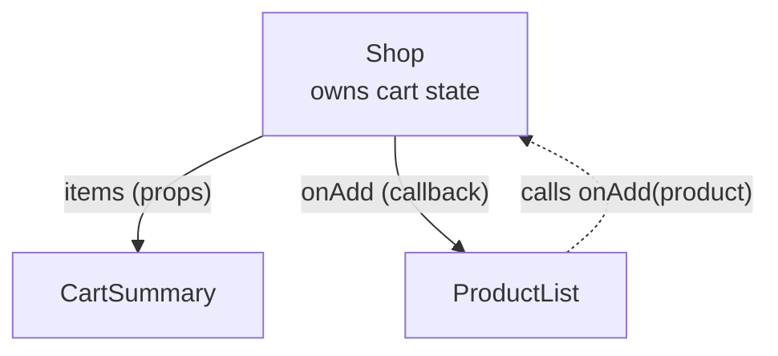

# React Fundamentals — Learn the Concepts You'll Use Every Day

**What this is:** a hands-on introduction to React — components, JSX, props, state,
events, forms, effects, context, hooks, routing and data fetching — in the order you
need them. Each section explains one idea, shows a small working example, and ends with
something to try.

**Before this:** React is "just JavaScript", so arrow functions, destructuring, spread,
`map`/`filter` and Promises are used everywhere. If those feel shaky, do
[15_JavaScript_Fundamentals.md](15_JavaScript_Fundamentals.md) first.
**Interview questions:** [18_React_QA.md](18_React_QA.md).

**How the facts were checked:** version numbers come from the npm registry on
7 Oct 2026; React release notes and the Create React App deprecation were confirmed on
react.dev; playground links were opened and loaded on the same day.

| Package | Latest version (npm, 7 Oct 2026) |
| --- | --- |
| React / React DOM | 19.3 |
| Vite | 8 |
| Next.js | 16 |
| React Router | 8 |
| TanStack Query | 5 |

---

## Where to practise online

**Start coding in one click:**

| Playground | What you get | Link |
| --- | --- | --- |
| **react.new** | A ready React project on CodeSandbox | https://react.new |
| **vite.new/react** | A Vite + React project on StackBlitz | https://vite.new/react |
| react.dev Learn | Every lesson has live, editable sandboxes | https://react.dev/learn |
| react.dev tutorial | Build tic-tac-toe step by step | https://react.dev/learn/tutorial-tic-tac-toe |
| CodeSandbox | Full projects, shareable | https://codesandbox.io |
| StackBlitz | Full projects running in the browser | https://stackblitz.com |
| PlayCode | Quick React snippets with live preview | https://playcode.io |
| TypeScript Playground | Try typed props (`.tsx`) | https://www.typescriptlang.org/play |

**Practise with real tasks:**

| Site | Why use it | Link |
| --- | --- | --- |
| Frontend Mentor | Real UI designs to build — good portfolio pieces | https://www.frontendmentor.io |
| GreatFrontEnd | React interview questions and UI coding problems | https://www.greatfrontend.com |
| BFE.dev | Front-end interview problems, including React quizzes | https://bigfrontend.dev |
| freeCodeCamp | Free curriculum including React projects | https://www.freecodecamp.org/learn |
| React API reference | Every hook and component with examples | https://react.dev/reference/react |

**Run locally** (needs Node.js 24 LTS):

```text
npm create vite@latest my-app -- --template react-ts
cd my-app
npm install
npm run dev
```

**Don't use Create React App** — the React team deprecated it for new apps on
14 Feb 2025 (confirmed: react.dev). Use **Vite** for a plain React app, or a framework
such as **Next.js** (`npx create-next-app@latest`) or React Router's framework mode when
you need routing, server rendering and data loading built in.

---

## Contents

| # | Section | You'll learn |
| --- | --- | --- |
| 1 | [How React thinks](#1-how-react-thinks) | UI as a function of state |
| 2 | [JSX](#2-jsx) | HTML-like syntax inside JavaScript |
| 3 | [Components and props](#3-components-and-props) | Building blocks and their inputs |
| 4 | [Lists and keys](#4-rendering-lists-and-keys) | `map()` and why keys matter |
| 5 | [Conditional rendering](#5-conditional-rendering) | Showing things only sometimes |
| 6 | [State](#6-state-with-usestate) | `useState`, immutability, updater functions |
| 7 | [Events and forms](#7-events-and-forms) | Clicks, inputs, controlled forms |
| 8 | [A complete small app](#8-putting-it-together-a-to-do-app) | To-do app using sections 2–7 |
| 9 | [Lifting state up](#9-lifting-state-up-and-one-way-data-flow) | Sharing state between components |
| 10 | [Effects](#10-effects-with-useeffect) | `useEffect`, dependencies, cleanup |
| 11 | [Refs](#11-refs-with-useref) | DOM access and values that don't re-render |
| 12 | [Context](#12-context-sharing-data-without-props) | Global-ish data without passing props |
| 13 | [Custom hooks](#13-custom-hooks) | Reusing stateful logic |
| 14 | [Rules of hooks](#14-the-rules-of-hooks) | Two rules that must never break |
| 15 | [Performance](#15-performance-memo-usememo-usecallback-and-the-compiler) | `memo`, `useMemo`, `useCallback`, React Compiler |
| 16 | [Fetching data](#16-fetching-data-in-real-apps) | TanStack Query |
| 17 | [Routing](#17-routing-with-react-router) | Pages and URLs with React Router |
| 18 | [Styling](#18-styling) | CSS Modules, Tailwind, and others |
| 19 | [React 19 features](#19-what-react-19-added) | Actions, `useActionState`, `use`, `<Activity>` |
| 20 | [TypeScript with React](#20-typescript-with-react) | Typing props and state |
| 21 | [Thinking in React](#21-thinking-in-react) | Turning a design into components |
| 22 | [Practice plan](#22-a-two-week-practice-plan) | What to build, day by day |

---

## 1. How React thinks

**The idea:** you describe **what the screen should look like for the current data**
(state). When the data changes, React works out what changed and updates only those
parts of the page.

```text
UI = f(state)
```

- **Component** — a JavaScript function that returns what to show.
- **Props** — inputs passed into a component by its parent (read-only).
- **State** — data a component owns and can change; changing it re-renders.
- **Re-render** — React calls your component function again with the new state,
  compares the result with the previous one (*reconciliation*), and updates only the
  real DOM nodes that differ.

**Compared with section 16 of the JavaScript file:** there you found elements and
changed them by hand. In React you never touch the DOM directly — you change state, and
React updates the page.

---

## 2. JSX

JSX looks like HTML but is JavaScript. The build tool turns it into function calls.

```jsx
const name = "Asha";
const element = (
  <div className="card">
    {/* className, not class */}
    <h1>Hello, {name}!</h1>
    {/* { } holds any JS expression */}
    <p>2 + 2 = {2 + 2}</p>
    {/* every tag must be closed, even  */}
    
    {/* events are camelCase */}
    <button onClick={() => alert("Hi")}>Say hi</button>
  </div>
);
```

**Rules:**

- Return **one** root element — wrap siblings in `<> … </>` (a *fragment*) if needed.
- `className` instead of `class`, `htmlFor` instead of `for`.
- Attributes and events are camelCase: `onClick`, `tabIndex`.
- `{ }` holds expressions only (values), not statements — no `if` or `for` inside; use
  `? :`, `&&` and `map()` (sections 4–5).
- Inline styles are objects: `style={{ color: "red", fontSize: 14 }}`.

---

## 3. Components and props

**A component is a function whose name starts with a capital letter and returns JSX.**

```jsx
function Avatar({ name, size = 48 }) {          // props destructured, with a default
  return ;
}

function UserCard({ user, children }) {
  return (
    <div className="card">
      <Avatar name={user.name} />
      <h2>{user.name}</h2>
      {/* children = whatever is nested inside <UserCard> */}
      {children}
    </div>
  );
}

export default function App() {
  const user = { name: "asha" };
  return (
    <UserCard user={user}>
      {/* this <p> becomes UserCard's children */}
      <p>Joined 2024</p>
    </UserCard>
  );
}
```

**Props:**

- Passed like HTML attributes; any value works — strings, numbers, objects, functions,
  other JSX.
- **Read-only.** A component must never change its own props.
- `children` is the content between the opening and closing tags.

> **Java comparison:** a component is like a class with a constructor taking a
> parameter object (props) and a `render()` — except it's a plain function, called
> again on every re-render.

**Try it (react.new):** make a `ProductCard` that shows a name, a price, and an "Out of
stock" label when a `stock` prop is 0.

---

## 4. Rendering lists and keys

```jsx
const products = [
  { id: 101, name: "Laptop", price: 55000 },
  { id: 102, name: "Mouse", price: 700 },
];

function ProductList() {
  return (
    <ul>
      {products.map(p => (
        <li key={p.id}>
          {p.name} — ₹{p.price}
        </li>
      ))}
    </ul>
  );
}
```

**`key` tells React which item is which between renders**, so it can keep, move or
remove the right DOM element.

- Use a **stable, unique id** from the data.
- **Don't use the array index** when items can be added, removed or reordered — React
  then matches the wrong items, and input text or checkbox state jumps to another row.
- Keys only need to be unique among siblings.

---

## 5. Conditional rendering

```jsx
function OrderStatus({ order }) {
  if (!order) return <p>Loading…</p>;                    // early return

  return (
    <div>
      {/* either / or */}
      {order.paid ? <span>Paid</span> : <span>Unpaid</span>}
      {/* only if */}
      {order.items.length > 0 && <p>{order.items.length} items</p>}
    </div>
  );
}
```

**Trap with `&&`:** `{count && <p>{count} items</p>}` renders the number **`0`** when
count is 0 (because `0 && …` evaluates to `0`). Write `{count > 0 && …}`.

---

## 6. State with useState

```jsx
import { useState } from "react";

function Counter() {
  const [count, setCount] = useState(0);        // [current value, setter]

  return (
    <div>
      <p>Clicked {count} times</p>
      <button onClick={() => setCount(count + 1)}>+1</button>
      <button onClick={() => setCount(0)}>Reset</button>
    </div>
  );
}
```

**What happens on click:** `setCount` asks React to re-render; React calls `Counter()`
again; this time `useState` returns the new value; React updates the text.

**Three rules that prevent most bugs:**

**1. State updates are not immediate.** The variable keeps its old value until the next
render:

```jsx
function handleClick() {
  setCount(count + 1);
  setCount(count + 1);
  setCount(count + 1);       // count goes up by 1, not 3 — all three saw the same count
}

function handleClickFixed() {
  setCount(c => c + 1);      // updater function: gets the latest value
  setCount(c => c + 1);
  setCount(c => c + 1);      // now +3
}
```

**2. Never change state objects or arrays in place — create new ones.** React compares
old and new by reference; if you mutate, it sees "same object" and may not re-render.

```jsx
const [user, setUser] = useState({ name: "Asha", city: "Pune" });
const [items, setItems] = useState([]);

setUser({ ...user, city: "Delhi" });              // ✅ new object
user.city = "Delhi";                              // ❌ mutation — don't

setItems([...items, newItem]);                    // add
setItems(items.filter(i => i.id !== id));         // remove
setItems(items.map(i => (i.id === id ? { ...i, done: true } : i)));  // update one
```

**3. Keep state minimal.** Don't store what you can calculate: with `items` in state,
compute `const total = items.reduce(…)` during render instead of a separate `total`
state.

---

## 7. Events and forms

```jsx
function SearchBox({ onSearch }) {
  const [query, setQuery] = useState("");

  function handleSubmit(event) {
    event.preventDefault();             // stop the browser reloading the page
    onSearch(query.trim());
  }

  return (
    <form onSubmit={handleSubmit}>
      <input
        value={query}                                 // React controls the value
        onChange={e => setQuery(e.target.value)}      // update on every keystroke
        placeholder="Search products"
      />
      <button type="submit" disabled={!query.trim()}>Search</button>
    </form>
  );
}
```

- **Controlled input:** its value comes from state and every change goes through
  `onChange`. React is the single source of truth — easy to validate, reset or format.
- Pass the function, don't call it: `onClick={handleClick}`, not
  `onClick={handleClick()}` (that runs during render).
- To pass an argument: `onClick={() => remove(item.id)}`.
- For larger forms, libraries such as React Hook Form reduce boilerplate. React 19 also
  lets a `<form action={fn}>` call a function directly (section 19).

---

## 8. Putting it together: a to-do app

Paste this into **react.new** — it uses everything from sections 2–7.

```jsx
import { useState } from "react";

export default function TodoApp() {
  const [todos, setTodos] = useState([]);
  const [text, setText] = useState("");

  function addTodo(event) {
    event.preventDefault();
    if (!text.trim()) return;
    setTodos([...todos, { id: crypto.randomUUID(), text: text.trim(), done: false }]);
    setText("");
  }

  function toggle(id) {
    setTodos(todos.map(t => (t.id === id ? { ...t, done: !t.done } : t)));
  }

  function remove(id) {
    setTodos(todos.filter(t => t.id !== id));
  }

  const remaining = todos.filter(t => !t.done).length;   // derived, not state

  return (
    <div>
      <h1>To-do</h1>
      <form onSubmit={addTodo}>
        <input
          value={text}
          onChange={e => setText(e.target.value)}
          placeholder="What needs doing?"
        />
        <button>Add</button>
      </form>

      <ul>
        {todos.map(t => (
          <li key={t.id}>
            <label style={{ textDecoration: t.done ? "line-through" : "none" }}>
              <input type="checkbox" checked={t.done} onChange={() => toggle(t.id)} />
              {t.text}
            </label>
            <button onClick={() => remove(t.id)}>Delete</button>
          </li>
        ))}
      </ul>

      {todos.length > 0 && <p>{remaining} left</p>}
    </div>
  );
}
```

**Try it:** add a filter — "All / Active / Done" buttons. Store the filter in state and
compute the visible list during render.

---

## 9. Lifting state up and one-way data flow

**Data flows down** through props; **events flow up** through callback props.

When two components need the same state, move it to their **closest common parent** and
pass it down:

```jsx
function Shop() {
  const [cart, setCart] = useState([]);                 // lives in the parent

  return (
    <>
      {/* event goes up */}
      <ProductList onAdd={p => setCart([...cart, p])} />
      {/* data goes down */}
      <CartSummary items={cart} />
    </>
  );
}

function ProductList({ onAdd }) {
  return <button onClick={() => onAdd({ id: 1, name: "Mouse", price: 700 })}>Add</button>;
}

function CartSummary({ items }) {
  const total = items.reduce((sum, i) => sum + i.price, 0);
  return <p>{items.length} items, ₹{total}</p>;
}
```



When props must pass through many layers that don't use them ("prop drilling"), use
**context** (section 12) or a state library.

---

## 10. Effects with useEffect

**What effects are for:** synchronising a component with something **outside React** —
fetching data, subscriptions, timers, browser APIs, a chat connection.

```jsx
import { useEffect, useState } from "react";

function UserProfile({ userId }) {
  const [user, setUser] = useState(null);
  const [error, setError] = useState(null);

  useEffect(() => {
    const controller = new AbortController();

    fetch(`https://jsonplaceholder.typicode.com/users/${userId}`, {
      signal: controller.signal,
    })
      .then(res => {
        if (!res.ok) throw new Error(`HTTP ${res.status}`);
        return res.json();
      })
      .then(setUser)
      .catch(err => {
        if (err.name !== "AbortError") setError(err);
      });

    return () => controller.abort();   // cleanup: cancel if userId changes or we unmount
  }, [userId]);                        // re-run only when userId changes

  if (error) return <p>Error: {error.message}</p>;
  if (!user) return <p>Loading…</p>;
  return <h2>{user.name}</h2>;
}
```

**The dependency array decides when the effect runs:**

| Dependency array | Runs |
| --- | --- |
| `[userId]` | After the first render, then whenever `userId` changes |
| `[]` | Once, after the first render |
| None | After **every** render — rarely what you want |

**Cleanup** (the returned function) runs before the effect runs again and when the
component is removed. Use it to cancel requests, clear timers, unsubscribe. Without it
you get race conditions — a slow old request overwriting a newer result.

**You often don't need an effect:**

- Values computed from props or state → calculate during render.
- Responding to a click → do it in the event handler, not in an effect watching state.
- Fetching data → in real apps, a data library or framework handles caching, retries
  and race conditions for you (section 16).

**Development note:** in `<StrictMode>` (on by default in new projects), React runs
every effect **twice** on mount in development — mount, cleanup, mount — to expose
missing cleanups. Production runs it once.

---

## 11. Refs with useRef

A **ref** holds a value that survives re-renders but **doesn't cause one** when it
changes. Two uses:

**1. Access a DOM element:**

```jsx
function SearchInput() {
  const inputRef = useRef(null);
  return (
    <>
      <input ref={inputRef} />
      <button onClick={() => inputRef.current.focus()}>Focus</button>
    </>
  );
}
```

**2. Keep a mutable value** (a timer id, the previous value, a counter you don't
display):

```jsx
const intervalId = useRef(null);
intervalId.current = setInterval(tick, 1000);
// later: clearInterval(intervalId.current);
```

**React 19:** a function component can receive `ref` as a normal prop —
`function MyInput({ ref, ...props }) { return <input ref={ref} {...props} />; }` — so
`forwardRef` is no longer needed in new code.

---

## 12. Context: sharing data without props

For data many components need — the logged-in user, theme, language:

```jsx
import { createContext, useContext, useState } from "react";

const ThemeContext = createContext("light");     // default value

export default function App() {
  const [theme, setTheme] = useState("light");
  return (
    // React 19: the context itself is the provider
    <ThemeContext value={theme}>
      <Toolbar />
      <button onClick={() => setTheme(t => (t === "light" ? "dark" : "light"))}>
        Toggle theme
      </button>
    </ThemeContext>
  );
}

function Toolbar() {
  return <ThemeLabel />;                         // no props passed down
}

function ThemeLabel() {
  const theme = useContext(ThemeContext);        // read it anywhere below the provider
  return <p className={theme}>Current theme: {theme}</p>;
}
```

(Before React 19 the provider was written `<ThemeContext.Provider value={…}>` — it still
works.)

**Use context for data that changes rarely.** Every component using a context
re-renders when its value changes, so fast-changing data (form input, live prices) in a
big context slows the app. Server data belongs in a data-fetching library
(section 16).

---

## 13. Custom hooks

A **custom hook** is a function whose name starts with `use` that calls other hooks —
the way to reuse stateful logic between components.

```jsx
function useLocalStorage(key, initialValue) {
  const [value, setValue] = useState(() => {
    const saved = localStorage.getItem(key);
    return saved !== null ? JSON.parse(saved) : initialValue;
  });

  useEffect(() => {
    localStorage.setItem(key, JSON.stringify(value));
  }, [key, value]);

  return [value, setValue];
}

// Usage — the to-do list now survives a page refresh:
const [todos, setTodos] = useLocalStorage("todos", []);
```

Each component calling a custom hook gets its **own** state — hooks share logic, not
data.

---

## 14. The rules of hooks

1. **Only call hooks at the top level** of a component or custom hook — never inside
   `if`, loops, nested functions or after an early `return`.
2. **Only call hooks from React components or custom hooks** — not from plain
   functions or classes.

**Why:** React identifies each hook by the **order** it is called in. If a hook is
skipped on one render, every later hook gets the wrong state.

The ESLint plugin `eslint-plugin-react-hooks` catches these mistakes (and missing effect
dependencies) — keep it on.

---

## 15. Performance: memo, useMemo, useCallback and the Compiler

By default, **when a component re-renders, all its children re-render too.** Usually
that's fast enough. When it isn't:

| Tool | What it does | Use when |
| --- | --- | --- |
| `memo(Component)` | Skips re-rendering a child if its props are unchanged | An expensive child re-renders with the same props |
| `useMemo(() => calc, [deps])` | Caches a **calculated value** between renders | An expensive calculation, or an object passed to a memoized child |
| `useCallback(fn, [deps])` | Caches a **function** between renders | A function passed to a memoized child or used in an effect's dependencies |

```jsx
const visible = useMemo(
  () => products.filter(p => p.name.includes(query)),   // only re-filter when needed
  [products, query]
);
const handleAdd = useCallback(p => setCart(c => [...c, p]), []);
```

**React Compiler** (v1.0, released 7 Oct 2025 — confirmed: react.dev) memoizes
components and values **automatically at build time**, so new projects that enable it
need far less manual `useMemo`/`useCallback`. Still, know these hooks — existing code
and interviews use them.

**Measure first:** React DevTools → Profiler shows which components re-render and how
long they take.

---

## 16. Fetching data in real apps

`useEffect` + `fetch` (section 10) works, but you end up writing caching, loading and
error states, retries and refetching yourself. Most teams use **TanStack Query**:

```jsx
import { QueryClient, QueryClientProvider, useQuery } from "@tanstack/react-query";

const queryClient = new QueryClient();

function Users() {
  const { data, isPending, error } = useQuery({
    queryKey: ["users"],                     // cache key
    queryFn: () =>
      fetch("https://jsonplaceholder.typicode.com/users").then(r => r.json()),
  });

  if (isPending) return <p>Loading…</p>;
  if (error) return <p>Error: {error.message}</p>;
  return <ul>{data.map(u => <li key={u.id}>{u.name}</li>)}</ul>;
}

export default function App() {
  return (
    <QueryClientProvider client={queryClient}>
      <Users />
    </QueryClientProvider>
  );
}
```

It caches results, removes duplicate requests, refetches stale data, retries failures,
and has `useMutation` for POST/PUT/DELETE. Frameworks such as Next.js and React Router
also have their own data-loading APIs.

---

## 17. Routing with React Router

React itself has no pages or URLs — a router maps URLs to components. (The components
below were checked as exports of React Router 8.4 on npm; from v7 onwards everything is
imported from `"react-router"`.)

```jsx
import { BrowserRouter, Routes, Route, Link, useParams } from "react-router";

function OrderPage() {
  const { id } = useParams();                 // reads :id from the URL
  return <h2>Order #{id}</h2>;
}

export default function App() {
  return (
    <BrowserRouter>
      <nav>
        <Link to="/">Home</Link> | <Link to="/orders/42">Order 42</Link>
      </nav>
      <Routes>
        <Route path="/" element={<h2>Home</h2>} />
        <Route path="/orders/:id" element={<OrderPage />} />
        <Route path="*" element={<h2>Not found</h2>} />
      </Routes>
    </BrowserRouter>
  );
}
```

- `<Link>` changes the URL without reloading the page.
- `useNavigate()` navigates from code (after a successful form submit, for example).
- `<Outlet />` renders nested child routes inside a layout.

---

## 18. Styling

| Approach | How | Notes |
| --- | --- | --- |
| Plain CSS | `import "./App.css"` | Global — class names can clash |
| **CSS Modules** | `import styles from "./Card.module.css"` → `className={styles.card}` | Class names scoped to the file; built into Vite |
| **Tailwind CSS** | Utility classes: `className="p-4 rounded bg-white"` | Very popular; no separate CSS files |
| CSS-in-JS | styled-components, Emotion | Less common in new projects |
| Component libraries | MUI, Chakra, shadcn/ui | Ready-made, accessible components |

---

## 19. What React 19 added

React 19 shipped in December 2024; 19.1 and 19.2 followed in 2025, and npm shows 19.3
as the latest (7 Oct 2026). The features you will be asked about:

| Feature | What it does |
| --- | --- |
| **Actions** + `useActionState` | Pass an async function to a form; React tracks pending state, result and errors |
| `useOptimistic` | Show the expected result immediately, roll back if the server call fails |
| `use(promise)` / `use(context)` | Read a promise (with Suspense) or context — even inside conditions |
| `ref` as a prop | No more `forwardRef` in new code |
| `<Context>` as provider | `<ThemeContext value={…}>` instead of `.Provider` |
| Document metadata | `<title>` and `<meta>` inside components are moved to `<head>` |
| `<Activity>` (19.2) | Hide part of the UI while keeping its state, and pre-render hidden parts |
| `useEffectEvent` (19.2) | Read the latest props/state inside an effect without re-running it |

(19.2 features confirmed: react.dev, 1 Oct 2025.)

**A form with `useActionState`:**

```jsx
import { useActionState } from "react";

async function subscribe(previousState, formData) {
  const res = await fetch("/api/subscribe", { method: "POST", body: formData });
  return res.ok ? { message: "Subscribed!" } : { message: "Failed — try again" };
}

export function SubscribeForm() {
  const [state, formAction, isPending] = useActionState(subscribe, { message: "" });

  return (
    <form action={formAction}>
      <input name="email" type="email" required />
      <button disabled={isPending}>{isPending ? "Saving…" : "Subscribe"}</button>
      <p>{state.message}</p>
    </form>
  );
}
```

---

## 20. TypeScript with React

Most React jobs use TypeScript. Create the project with `--template react-ts` and type
your props:

```tsx
type Product = { id: number; name: string; price: number };

type ProductCardProps = {
  product: Product;
  onAdd: (product: Product) => void;
  compact?: boolean;                     // optional prop
};

function ProductCard({ product, onAdd, compact = false }: ProductCardProps) {
  return (
    <div className={compact ? "card small" : "card"}>
      {product.name} — ₹{product.price}
      <button onClick={() => onAdd(product)}>Add</button>
    </div>
  );
}

// type the state when it starts empty:
const [items, setItems] = useState<Product[]>([]);
```

> **Java comparison:** TypeScript types feel like Java interfaces and records — but
> they exist only at compile time and are erased in the running JavaScript.

---

## 21. Thinking in React

The React docs' method for turning a design into code:

1. **Break the UI into a component tree** — one component per responsibility.
2. **Build a static version** with props only — no state yet.
3. **Find the minimal state** — what changes over time and can't be computed from
   something else?
4. **Decide where each piece of state lives** — the closest common parent of everything
   that uses it.
5. **Add inverse data flow** — pass callbacks down so children can request changes.

---

## 22. A two-week practice plan

| Days | Learn | Build (on react.new or vite.new/react) |
| --- | --- | --- |
| 1–2 | Sections 1–5 | A product grid from a hard-coded array, with an "out of stock" badge |
| 3–4 | Sections 6–8 | The to-do app; add filters and an item counter |
| 5 | Section 9 | A shop page: product list + cart summary sharing state |
| 6–7 | Sections 10–11 | A user directory from jsonplaceholder with loading and error states, and a search box |
| 8 | Sections 12–14 | Dark/light theme via context; the `useLocalStorage` hook |
| 9–10 | Sections 16–17 | Two pages with React Router — a list and a detail page — data via TanStack Query |
| 11 | Section 15 | Open React DevTools → Profiler on your app and remove one unnecessary re-render |
| 12 | Section 19 | Rebuild one form with `useActionState` |
| 13–14 | Review | A Frontend Mentor challenge, then [18_React_QA.md](18_React_QA.md) |

---

## Sources

Confirmed on 7 Oct 2026:

- [Sunsetting Create React App (react.dev, Feb 2025)](https://react.dev/blog/2025/02/14/sunsetting-create-react-app)
- [React 19.2 (react.dev, Oct 2025)](https://react.dev/blog/2025/10/01/react-19-2)
- [React Compiler v1.0 (react.dev, Oct 2025)](https://react.dev/blog/2025/10/07/react-compiler-1)
- Package versions: npm registry (`registry.npmjs.org/<package>/latest`)
