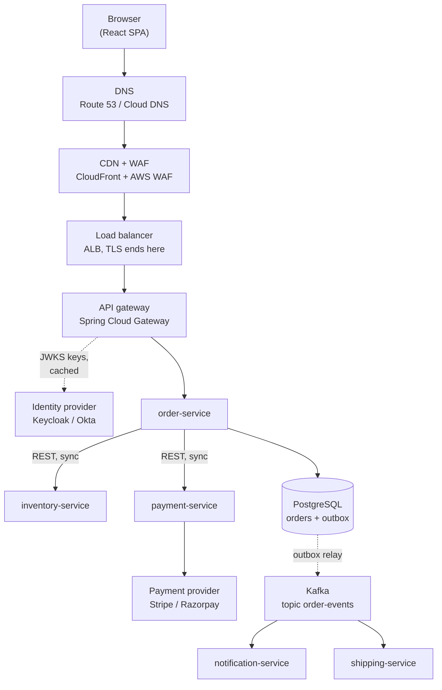
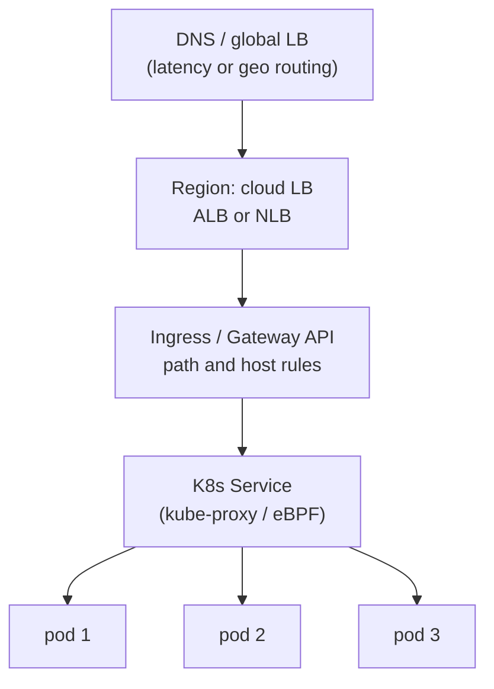

# Microservices End to End: Request Flow and Architecture — Interview Q&A

**What this covers:** how a real Spring Boot microservices system fits together, told as
the journey of one request — browser → DNS → CDN/WAF → load balancer → API gateway →
service → other services and Kafka → database → back. Plus the architecture questions
every round opens with, and which tools most companies pick.

**Running example (used in files 19–27):** an online shop. A React app calls
**order-service**, which calls **inventory-service** and **payment-service** over REST,
saves the order in **PostgreSQL**, and publishes `OrderPlaced` to **Kafka**;
**notification-service** sends the email. Everything runs on **Kubernetes** (EKS / GKE).

| File | Topic |
| --- | --- |
| **19** (this one) | Request flow, architecture, service-to-service calls |
| [20](20_Microservices_Security_AuthN_AuthZ_QA.md) | Authentication, authorization, secrets |
| [21](21_API_Gateway_Rate_Limiting_Resilience_QA.md) | API gateway, rate limiting, circuit breaker, retries |
| [22](22_Kafka_Event_Driven_Microservices_QA.md) | Kafka, outbox, saga, idempotent consumers |
| [23](23_Caching_Data_Management_QA.md) | Caching, database per service, migrations |
| [24](24_Microservice_Patterns_Catalogue_QA.md) | All microservice patterns in one map |
| [25](25_CI_CD_Build_Deploy_QA.md) | CI/CD, images, Helm, Argo CD, EKS/GKE |
| [26](26_Observability_Logging_Monitoring_Tracing_QA.md) | Logs, metrics, traces, alerts |
| [27](27_Microservices_Production_Scenarios_QA.md) | "What would you do if…" scenarios |

Docker, Kubernetes and AWS basics live in [13](13_Docker_QA.md), [14](14_Kubernetes_QA.md)
and files 08–12. **Facts:** version details checked on 7 Oct 2026 against the Boot 3.5.7 /
4.0.3 / 4.1.1 jars in the local Maven cache and spring.io (see Sources). Snippets target
**Boot 3.5**; Boot 4 differences are noted.

## Weight legend

| Mark | Meaning |
| --- | --- |
| ★★★ | Asked in almost every round — know the detail |
| ★★ | Asked often — know the short answer and one example |
| ★ | Occasional — two or three lines |

## Contents

| # | Question | Weight | One-line answer |
| --- | --- | --- | --- |
| 1 | [Explain your project's architecture](#1-explain-your-projects-architecture) | ★★★ | Business → services → request path → data/events → platform → your part |
| 2 | [What happens when a user clicks "Place order"](#2-what-happens-when-a-user-clicks-place-order) | ★★★ | DNS → CDN/WAF → LB → gateway → service → DB + Kafka → response |
| 3 | [What most companies pick](#3-what-most-companies-pick-for-each-concern) | ★★★ | Gateway, IdP, Kafka, Redis, Postgres, K8s, Argo CD, Prometheus, OTel |
| 4 | [Monolith vs microservices](#4-monolith-vs-microservices) | ★★★ | Split for independent teams and scaling, not by default |
| 5 | [Service boundaries](#5-how-do-you-decide-service-boundaries) | ★★ | One business capability and its data per service |
| 6 | [Sync vs async](#6-synchronous-vs-asynchronous-communication) | ★★★ | REST when you need the answer now; events when you don't |
| 7 | [REST vs gRPC vs GraphQL](#7-rest-vs-grpc-vs-graphql) | ★★ | REST outside, gRPC for hot internal paths, GraphQL for flexible UIs |
| 8 | [Calling another service](#8-how-one-spring-boot-service-calls-another) | ★★★ | `RestClient` or an HTTP interface; Feign is feature-complete |
| 9 | [Service discovery](#9-service-discovery) | ★★ | Kubernetes DNS; Eureka only off Kubernetes |
| 10 | [Configuration across environments](#10-configuration-across-environments) | ★★★ | Same image everywhere; config from env, ConfigMaps, secret stores |
| 11 | [Load balancing layers](#11-where-load-balancing-happens) | ★★★ | DNS, L4/L7 cloud LB, ingress/gateway, K8s Service, client-side |
| 12 | [Load-balancing algorithms](#12-load-balancing-algorithms) | ★★ | Round robin, least connections, weighted, consistent hashing |
| 13 | [Backend for Frontend](#13-backend-for-frontend-bff) | ★★ | One API layer per client type |
| 14 | [API versioning](#14-api-versioning-and-backward-compatibility) | ★★★ | Add, don't change; version only for breaking changes |
| 15 | [Error responses](#15-a-consistent-error-response-across-services) | ★★ | RFC 9457 `ProblemDetail` everywhere |
| 16 | [Timeouts across a call chain](#16-timeouts-across-a-call-chain) | ★★★ | Every call has a timeout, shorter than its caller's |
| 17 | [Idempotent APIs](#17-making-post-apis-idempotent) | ★★★ | `Idempotency-Key` header + stored result |
| 18 | [Following one request](#18-following-one-request-across-services) | ★★ | Trace id in `traceparent` and in every log line |
| 19 | [REST API conventions](#19-rest-api-design-conventions) | ★★ | Nouns, right status codes, pagination, DTOs |
| 20 | [Long-running operations](#20-long-running-operations) | ★★ | 202 Accepted + status URL, or events/webhooks |
| 21 | [Large file uploads](#21-large-file-uploads) | ★ | Pre-signed URL straight to S3/GCS |
| 22 | [Local development](#22-local-development-setup) | ★★ | Docker Compose support + Testcontainers |
| 23 | [Twelve-factor app](#23-the-twelve-factor-app) | ★★ | Config in env, stateless, logs to stdout, disposable |
| 24 | [Virtual threads](#24-virtual-threads-in-microservices) | ★★ | One property; great for blocking I/O; still cap downstream calls |
| 25 | [AWS vs GCP names](#25-aws-and-google-cloud-equivalents) | ★★ | Same building blocks, different names |
| 26 | [Synchronous chain anti-pattern](#26-why-long-synchronous-chains-are-dangerous) | ★★★ | Availability multiplies down; latency adds up |

---

## 1. Explain your project's architecture

**Weight:** ★★★

**Short answer:** A 2-minute walk in a fixed order. The interviewer picks every follow-up
from this answer, so plant the topics you are strongest in.

| Step | Say | Example |
| --- | --- | --- |
| 1. Business | What it does, scale | "E-commerce, ~2 M orders/month, peak 800 req/s" |
| 2. Services | 5–8 services, who owns what | "Order, inventory, payment, catalog, notification — my team owned order and payment" |
| 3. Request path | Edge to service | "React → CloudFront → ALB → Spring Cloud Gateway (JWT, rate limit) → EKS" |
| 4. Data and events | DBs, Kafka, cache | "Postgres per service, Redis for catalog, Kafka order events via outbox" |
| 5. Platform | Build and run | "GitHub Actions → image → Argo CD; Prometheus, Grafana, OpenTelemetry" |
| 6. Your part | One problem + a number | "Payment idempotency: duplicate charges went from ~40/month to zero" |

**Avoid:** listing tools without saying why; "we" for everything — they are hiring *you*.
Have [Q2](#2-what-happens-when-a-user-clicks-place-order)'s diagram ready to draw.

---

## 2. What happens when a user clicks "Place order"

**Weight:** ★★★

**Short answer:** DNS resolves the API host → **CDN/WAF** filters at the edge → a **cloud
load balancer** terminates TLS → the **API gateway** checks the JWT, rate-limits and routes
→ **order-service** calls inventory and payment synchronously, saves the order plus an
**outbox** event in one DB transaction and returns **201** → the event reaches **Kafka**
and other services react asynchronously.



| Hop | Job | Typical tool |
| --- | --- | --- |
| CDN + WAF | Serve SPA assets; block SQLi, bots, IP floods | CloudFront + AWS WAF, Cloud CDN + Cloud Armor |
| Load balancer | TLS termination, host/path routing into the cluster | ALB, Google Cloud Load Balancing |
| API gateway | JWT check, rate limit, correlation id, routing | Spring Cloud Gateway, Kong, Apigee |
| order-service | Validation, authorization, business logic | Spring Boot |
| Sync calls | Reserve stock, authorise payment — with timeouts + circuit breakers | `RestClient` + Resilience4j |
| Database | Order row + outbox row in **one** transaction | PostgreSQL (RDS / Cloud SQL) |
| Event relay → consumers | Email, shipping, analytics react in their own time | Debezium / poller → Kafka → `@KafkaListener` |

**Follow-ups:** where is the JWT checked? (gateway **and** service — [20 Q7](20_Microservices_Security_AuthN_AuthZ_QA.md#7-validate-the-token-at-the-gateway-or-in-every-service));
why not call notification directly? (the user shouldn't wait for email — [Q6](#6-synchronous-vs-asynchronous-communication));
payment succeeded but saving failed? (saga with a refund — [22 Q10](22_Kafka_Event_Driven_Microservices_QA.md#10-saga-choreography-vs-orchestration)).

---

## 3. What most companies pick for each concern

**Weight:** ★★★

| Concern | Common pick | Alternatives | AWS | Google Cloud |
| --- | --- | --- | --- | --- |
| Framework | Spring Boot 3.5 / 4 | Quarkus, Micronaut | — | — |
| Edge / WAF | CloudFront + WAF | Cloudflare, Akamai | CloudFront, AWS WAF | Cloud CDN, Cloud Armor |
| Load balancer | Cloud L7 LB | NGINX, HAProxy | ALB, NLB | Cloud Load Balancing |
| API gateway | Spring Cloud Gateway | Kong, Apigee, Envoy | API Gateway | Apigee |
| Login / tokens | Keycloak, Okta, Auth0 | Entra ID | Cognito | Identity Platform |
| Service calls | `RestClient`, HTTP interfaces | OpenFeign, gRPC | — | — |
| Resilience | Resilience4j | Spring 7 `@Retryable`, mesh | — | — |
| Messaging | Kafka | RabbitMQ, SQS/SNS, Pub/Sub | MSK, SQS, SNS | Managed Kafka, Pub/Sub |
| Database | PostgreSQL | MySQL, MongoDB, DynamoDB | RDS, Aurora | Cloud SQL, AlloyDB |
| Cache | Redis / Valkey | Caffeine (local) | ElastiCache | Memorystore |
| Orchestration | Kubernetes | ECS, Cloud Run | EKS, ECS | GKE, Cloud Run |
| CI / CD | GitHub Actions or Jenkins + Argo CD | GitLab CI, Flux | CodePipeline | Cloud Build / Deploy |
| Secrets | Cloud secret store | Vault | Secrets Manager | Secret Manager |
| Metrics / logs / traces | Prometheus + Grafana, Loki/OpenSearch, OTel → Tempo | Datadog, New Relic | CloudWatch, X-Ray | Cloud Monitoring / Logging / Trace |
| IaC | Terraform | CDK, Pulumi | CloudFormation | Terraform |

Always pair a tool with its reason: "Kafka **because** five teams consume order events and
we need replay." (This table is an industry-pattern summary, not survey data.)

---

## 4. Monolith vs microservices

**Weight:** ★★★

**Short answer:** Microservices let **teams deploy independently** and **scale parts
separately**, at the cost of network failures, distributed transactions, eventual
consistency and platform work. Start with a **modular monolith**; split when team size or
scaling forces it.

| | Monolith | Microservices |
| --- | --- | --- |
| Deploy / scale | Everything together | Each service alone |
| Data | One DB, ACID | DB per service, sagas, eventual consistency |
| Failure | Fails together | Partial failures → timeouts, circuit breakers |
| Debugging | Stack trace | Distributed tracing |
| Ops cost | Low | High (K8s, CI/CD per service, observability) |

**Good reasons to split:** teams blocking each other's releases; very different scaling
needs; fault isolation. **Bad reason:** "Netflix does it" — you end up with a
**distributed monolith** ([24 Q14](24_Microservice_Patterns_Catalogue_QA.md#14-anti-patterns-distributed-monolith-shared-database-chatty-services)).
Spring Modulith can enforce module boundaries inside a monolith so it splits cleanly later.

---

## 5. How do you decide service boundaries?

**Weight:** ★★

Split by **business capability** (order, payment, inventory), not technical layer. DDD's
**bounded context** is the tool: where a word changes meaning ("product" in catalog vs
shipping), there is a boundary. A good boundary means the service owns its tables, most
features change only one service, and one team owns it. Smells: services that always
deploy together, circular calls, a "common-db-service".

---

## 6. Synchronous vs asynchronous communication

**Weight:** ★★★

**Short answer:** **Sync** (REST/gRPC) when the caller **needs the answer to continue** —
"is it in stock?". **Async** (Kafka, SQS, Pub/Sub) when the caller only **announces a
fact** — "order placed" — and others react in their own time.

| | Sync | Async |
| --- | --- | --- |
| Coupling | Callee must be up now | Producer doesn't know consumers |
| User latency | Whole chain | Fast response |
| Failure | Propagates immediately | Broker buffers; consumers retry |
| Consistency | Immediate | Eventual |
| Use for | Queries, validation, payment authorisation | Notifications, projections, integration |

In the example: stock reservation and payment are sync; email, shipping and analytics are
async. Request/reply over Kafka is possible but usually more complex than REST for reads.

---

## 7. REST vs gRPC vs GraphQL

**Weight:** ★★

| | REST | gRPC | GraphQL |
| --- | --- | --- | --- |
| Format / contract | JSON, OpenAPI | Protobuf, `.proto` (required) | JSON, schema |
| Transport | HTTP/1.1 or 2 | HTTP/2, streaming | HTTP |
| Browser | Native | Needs gRPC-Web | Native |
| Best for | Public APIs, most internal calls | Low-latency internal paths | Many clients needing different shapes |

Typical answer: "REST everywhere; gRPC for the pricing hot path, where Protobuf cut payload
size and latency."

---

## 8. How one Spring Boot service calls another

**Weight:** ★★★

**Short answer:** Use **`RestClient`** (Spring 6.1+) or a declarative **HTTP interface**
(`@HttpExchange`) backed by it; **`WebClient`** only in reactive apps. `RestTemplate` is in
maintenance mode and **OpenFeign is feature-complete** — Spring recommends HTTP interfaces
(confirmed 7 Oct 2026). Always: **timeouts, resilience, trace propagation.**

```java
@HttpExchange("/api/inventory")
interface InventoryClient {
    @PostExchange("/reservations")
    ReservationResponse reserve(@RequestBody ReserveRequest request);
}

@Bean
InventoryClient inventoryClient(RestClient.Builder builder) {   // Boot's builder = tracing
    var settings = ClientHttpRequestFactorySettings.defaults()
            .withConnectTimeout(Duration.ofSeconds(1))
            .withReadTimeout(Duration.ofSeconds(2));
    RestClient rest = builder.baseUrl("http://inventory-service:8080")
            .requestFactory(ClientHttpRequestFactoryBuilder.detect().build(settings))
            .build();
    return HttpServiceProxyFactory.builderFor(RestClientAdapter.create(rest))
            .build().createClient(InventoryClient.class);
}
```

**Gotchas:**
- Inject Boot's **`RestClient.Builder`** — `RestClient.create()` loses the `traceparent`
  header and metrics.
- Global timeouts also exist as properties: `spring.http.client.connect-timeout` /
  `read-timeout` (Boot 3.5); Boot 4.1 adds `spring.http.clients.*` (checked in the jars).
- **Boot 4 / Spring 7:** `@ImportHttpServices` registers the proxies; base URL and timeouts
  move to per-group properties — no factory code.
- Resilience on the call (circuit breaker, retry): [21 Q13](21_API_Gateway_Rate_Limiting_Resilience_QA.md#13-resilience4j-in-spring-boot).

---

## 9. Service discovery

**Weight:** ★★

On Kubernetes it's free: a `Service` named `inventory-service` gets a DNS name and a
virtual IP balanced across **ready** pods — call `http://inventory-service:8080`.
**Eureka** / **Consul** are for VMs or mixed platforms; ECS uses Cloud Map / Service
Connect. Running Eureka *and* Kubernetes is a smell — two registries that can disagree.
→ [Microservices_QA Q4](../05-Spring-Microservices/notes/Microservices_QA.md#4-how-does-service-discovery-work)

---

## 10. Configuration across environments

**Weight:** ★★★

**Short answer:** **One image**, promoted dev → staging → prod; only config changes.
Non-secret config from **env vars / ConfigMaps**, secrets from a **secret store** synced to
the pod, bound with **`@ConfigurationProperties`**.

```java
@ConfigurationProperties(prefix = "payment")
@Validated
record PaymentProperties(@NotBlank String providerUrl, @NotNull Duration timeout) {}
// env var PAYMENT_PROVIDERURL overrides payment.provider-url (relaxed binding)
```

| Option | Good | Watch out |
| --- | --- | --- |
| Env vars / ConfigMap | Native to K8s, GitOps-friendly | Pod restart to pick up changes |
| Spring Cloud Config Server | Central Git-backed, `@RefreshScope` | Another service to run |
| Spring Cloud Kubernetes | Reads ConfigMaps, can reload | Needs RBAC |
| External Secrets Operator | Cloud secrets → K8s Secrets | One more controller |

Use **profiles** for environment *shape* (`local`, `test`); per-environment *values* belong
in deployment config (Helm values), so prod URLs never live in the image.

---

## 11. Where load balancing happens

**Weight:** ★★★

**Short answer:** At several layers — **DNS** across regions, a **cloud LB** (L4 NLB / L7
ALB) across nodes, the **ingress/gateway** by path, the **K8s Service** across pods, and
optionally **client-side** (Spring Cloud LoadBalancer) or a **service mesh**.



| Type | Routes by | Example |
| --- | --- | --- |
| L4 | IP and port only | AWS NLB |
| L7 | Host, path, headers | AWS ALB, GCP HTTP(S) LB, Envoy |
| Client-side | Instance list in the caller | Spring Cloud LoadBalancer |

**Gotcha:** a K8s Service balances **connections**, not requests. gRPC/HTTP-2 keeps one
long connection, so one client pod can pin to one server pod — use client-side LB or a
mesh. LBs only route to targets passing health checks — on K8s, the **readiness probe**.

---

## 12. Load-balancing algorithms

**Weight:** ★★

| Algorithm | Good for |
| --- | --- |
| Round robin | Equal instances, similar requests (the default) |
| Weighted | Mixed sizes; canary (5% / 95%) |
| Least connections / outstanding requests | Requests with very different durations |
| Power of two random choices | Large fleets (Envoy) |
| Consistent hashing | Cache locality, sharding, stickiness |

Avoid **sticky sessions**: keep services stateless and put sessions in Redis.

---

## 13. Backend for Frontend (BFF)

**Weight:** ★★

A thin API layer **per client type** (web, mobile, partner), owned by the client team, that
aggregates and shapes data from many services — the mobile app makes one call instead of
six. No business rules in it. The gateway is generic (auth, limits, routing); the BFF is
client-specific. The web BFF can also hold tokens server-side
([20 Q11](20_Microservices_Security_AuthN_AuthZ_QA.md#11-where-should-the-browser-keep-tokens)).

---

## 14. API versioning and backward compatibility

**Weight:** ★★★

**Short answer:** Avoid breaking changes — only **add** optional fields, never rename or
remove, and make clients ignore unknown fields (**tolerant reader**). When a break is
unavoidable, publish **v2** alongside v1, migrate consumers, then retire v1.

| Non-breaking | Breaking (new version) |
| --- | --- |
| Add optional response field or endpoint | Remove/rename a field |
| Add optional request parameter | Change a type or meaning |
| New enum value (if clients tolerate it) | Make an optional field required; change error format |

Styles: **URI path** `/v2/orders` (most common), header (`API-Version: 2`), media type.
**Spring 7 / Boot 4** has built-in versioning: `@GetMapping(path = "/orders/{id}",
version = "2")` + `spring.mvc.apiversion.use.header=API-Version` (checked in the 4.0.3 jar).
Catch breaks before deploy with contract tests ([24 Q12](24_Microservice_Patterns_Catalogue_QA.md#12-consumer-driven-contract-testing));
events follow the same rules via a schema registry ([22 Q12](22_Kafka_Event_Driven_Microservices_QA.md#12-schema-evolution-and-the-schema-registry)).

---

## 15. A consistent error response across services

**Weight:** ★★

Use **RFC 9457 Problem Details** (`application/problem+json`, Spring's `ProblemDetail`) in
every service, mapped centrally; never leak stack traces or SQL.

```java
@ExceptionHandler(OrderNotFoundException.class)          // in a @RestControllerAdvice
ProblemDetail notFound(OrderNotFoundException ex) {
    ProblemDetail pd = ProblemDetail.forStatusAndDetail(HttpStatus.NOT_FOUND, ex.getMessage());
    pd.setProperty("traceId", tracer.currentSpan().context().traceId()); // support → logs
    return pd;
}
```

`spring.mvc.problemdetails.enabled=true` makes Spring's own errors use the same format.
Status discipline: 400 bad input · 401 no/invalid token · 403 not allowed · 404 missing ·
409 conflict · 422 business rule · 429 rate limited · 503 dependency down · 500 bug.

---

## 16. Timeouts across a call chain

**Weight:** ★★★

**Short answer:** **Every remote call has a timeout, and inner timeouts are shorter than
outer ones**, so callers fail fast instead of piling up waiting threads. One slow
dependency without timeouts exhausts every caller's threads — a cascading outage.

| Layer | Timeout |
| --- | --- |
| Gateway → order-service | 5 s response timeout |
| order-service → inventory | 1 s connect, 2 s read |
| order-service → payment (external PSP) | 1 s connect, 3 s read |
| JDBC statement | 2 s |
| Hikari `connection-timeout` | 2 s (default 30 s!) |

**Rules:** retries multiply time (3 × 2 s = 6 s breaks a 5 s budget); connect timeout ≈ 1 s,
read timeout from the dependency's p99 + margin; gRPC propagates deadlines natively. On a
timeout the write **may still have happened** — hence idempotency keys ([Q17](#17-making-post-apis-idempotent)).

---

## 17. Making POST APIs idempotent

**Weight:** ★★★

**Short answer:** The client sends an **`Idempotency-Key`** (a UUID per user action). The
server stores the key with the result; a repeat returns the **stored response** instead of
creating a second order or charge. That makes retries — by users, gateways or
Resilience4j — safe.

```sql
CREATE TABLE idempotency_keys (
    key           VARCHAR(64) PRIMARY KEY,  -- the unique constraint is the lock
    request_hash  VARCHAR(64) NOT NULL,     -- same key + different body -> 422
    status        VARCHAR(16) NOT NULL,     -- IN_PROGRESS / COMPLETED
    response_json JSONB
);
```

**Flow:** insert the key as `IN_PROGRESS` (duplicate insert = it's a retry) → do the work →
save the response as `COMPLETED`. A retry finding `COMPLETED` gets the saved response;
`IN_PROGRESS` gets 409. Expire keys after 24–48 h. GET/PUT/DELETE are naturally idempotent.
→ [Microservices_QA Q8](../05-Spring-Microservices/notes/Microservices_QA.md#8-how-do-you-actually-make-an-operation-idempotent)

---

## 18. Following one request across services

**Weight:** ★★

The first hop creates a **trace id**; it travels in the W3C **`traceparent`** header (and
Kafka record headers), and **Micrometer Tracing** writes it into every log line via the MDC.

```text
traceparent: 00-4bf92f3577b34da6a3ce929d0e0e4736-00f067aa0ba902b7-01
                version-trace id (whole request)-span id (this hop)-sampled
```

It's automatic only with Boot's **auto-configured** builders and `KafkaTemplate` with
observation on. → [26 Q5](26_Observability_Logging_Monitoring_Tracing_QA.md#5-getting-the-trace-id-into-every-log-line),
[07 Q12](07_Spring_Boot_Actuator_QA.md#12-observations-and-distributed-tracing)

---

## 19. REST API design conventions

**Weight:** ★★

| Rule | Good | Bad |
| --- | --- | --- |
| Plural nouns | `GET /orders/123` | `GET /getOrder?id=123` |
| Non-CRUD action | `POST /orders/123/cancellation` | `GET /cancelOrder/123` |
| Status codes | `201` + `Location` | `200` with `"success": false` |
| Pagination | `?size=20&after=<cursor>` | Returning 50,000 rows |
| DTOs | `OrderResponse` record | Returning JPA entities |

Cursor (keyset) pagination beats `OFFSET` on big tables ([23 Q20](23_Caching_Data_Management_QA.md#20-offset-vs-keyset-pagination)).
Document with OpenAPI (springdoc-openapi).

---

## 20. Long-running operations

**Weight:** ★★

Don't hold HTTP open for minutes. Return **`202 Accepted`** + a status URL, do the work in
the background (queue/Kafka consumer), and let the client **poll** or get a **push**
(webhook, WebSocket, SSE). Reason: LBs and gateways time out (ALB 60 s default; AWS API
Gateway REST APIs 29 s default), and pods restart during deploys.

```text
POST /reports          -> 202, Location: /reports/jobs/77
GET  /reports/jobs/77  -> {"status":"RUNNING"} ... {"status":"DONE","downloadUrl":"…"}
```

---

## 21. Large file uploads

**Weight:** ★

Return a **pre-signed URL**; the browser uploads straight to S3/GCS; a bucket event tells
the service it arrived. Pods never hold gigabytes and gateway body limits don't matter.
→ [08 Q6](08_Spring_Cloud_AWS_QA.md#6-s3-with-s3template)

---

## 22. Local development setup

**Weight:** ★★

Run the service from the IDE and its dependencies in containers. Boot's **Docker Compose
support** starts `compose.yaml` and wires connection details; **Testcontainers** +
**`@ServiceConnection`** does the same in tests — no `spring.datasource.*` needed.

```java
@Container @ServiceConnection
static PostgreSQLContainer<?> db = new PostgreSQLContainer<>("postgres:17");
```

**Versions:** Boot 3.5.7 manages Testcontainers 1.21.3 (snippet above). Boot 4.0.3 manages
**2.0.3**, where artifacts gained a `testcontainers-` prefix and classes moved to per-module
packages (`org.testcontainers.postgresql`) — fix dependencies and imports on upgrade
(checked in the local BOMs; renames confirmed 7 Oct 2026). Other teams' services: use their
contract stubs or WireMock, not a shared, always-broken dev environment.

---

## 23. The twelve-factor app

**Weight:** ★★

The factors interviewers care about, in Spring Boot on K8s terms: **config in the
environment**; **stateless processes** (state in DB/Redis); **backing services as config**;
**build once, release = image + config**; **scale out with pods**; **disposability** (fast
start, graceful SIGTERM shutdown); **dev/prod parity** (same Postgres/Kafka via
containers); **logs to stdout** as JSON; **admin tasks** (migrations) as Jobs, not manual SQL.

---

## 24. Virtual threads in microservices

**Weight:** ★★

`spring.threads.virtual.enabled=true` (Java 21+, Boot 3.2+) runs request handling, `@Async`
and listeners on **virtual threads**, which release their carrier while blocked on I/O — a
blocking `RestClient`/JDBC service handles far more concurrent requests without going
reactive.

**It doesn't fix:** downstream limits (10,000 virtual threads still share ~10 Hikari
connections — cap with a bulkhead or Spring 7 `@ConcurrencyLimit`); CPU-bound work;
**pinning** inside `synchronized` before JDK 24 (JEP 491 removed most of it); large
ThreadLocals × millions of threads.

---

## 25. AWS and Google Cloud equivalents

**Weight:** ★★

| Need | AWS | Google Cloud |
| --- | --- | --- |
| Managed Kubernetes | EKS | GKE (Standard / Autopilot) |
| Simpler containers | ECS on Fargate | Cloud Run |
| Image registry | ECR | Artifact Registry |
| L7 load balancer | ALB | External Application LB |
| CDN + WAF | CloudFront + WAF | Cloud CDN + Cloud Armor |
| API gateway | API Gateway | Apigee, API Gateway |
| Postgres / MySQL | RDS, Aurora | Cloud SQL, AlloyDB |
| Redis-compatible | ElastiCache (Redis OSS / Valkey) | Memorystore (Redis / Valkey) |
| Kafka | MSK | Managed Service for Apache Kafka (GA Nov 2024) |
| Queue / pub-sub | SQS, SNS, EventBridge | Pub/Sub, Eventarc |
| Secrets | Secrets Manager | Secret Manager |
| Logs / metrics / traces | CloudWatch, X-Ray | Cloud Logging / Monitoring / Trace |
| Pod → cloud permissions | IRSA / EKS Pod Identity | Workload Identity |

The one to remember: pods get cloud permissions through **workload identity**, never
access keys in env vars.

---

## 26. Why long synchronous chains are dangerous

**Weight:** ★★★

**Short answer:** In A → B → C → D, **availability multiplies** and **latency adds**. Four
services at 99.9% give ~99.6% for the chain (~3 hours of failure a month instead of 43
minutes), and one slow service at the end holds threads in every service above it.

**Shorten or protect the chain:** make non-essential steps **async**; **cache** hot reads;
keep a **local copy** of others' data updated by events ([22 Q11](22_Kafka_Event_Driven_Microservices_QA.md#11-designing-event-messages));
**call in parallel** when calls are independent (latency = max, not sum); and put
**timeouts, circuit breakers and bulkheads** on every hop ([21](21_API_Gateway_Rate_Limiting_Resilience_QA.md)).

---

## Sources

Confirmed on 7 Oct 2026:

- Local Maven cache: Spring Boot 3.5.7 / 4.0.3 / 4.1.1 metadata (`spring.http.client.*`,
  `spring.http.clients.*`, `spring.mvc.apiversion.*`) and BOMs (Testcontainers versions)
- [Spring Cloud release train ↔ Boot compatibility](https://spring.io/projects/spring-cloud)
- [Spring Cloud OpenFeign — feature-complete status](https://docs.spring.io/spring-cloud-openfeign/reference/)
- [Spring Framework 7 resilience features](https://docs.spring.io/spring-framework/reference/core/resilience.html)
- [Testcontainers 2 dependency renames](https://docs.openrewrite.org/recipes/java/testing/testcontainers/testcontainers2dependencies)
- [Google Cloud Managed Service for Apache Kafka release notes](https://docs.cloud.google.com/managed-service-for-apache-kafka/docs/release-notes)
