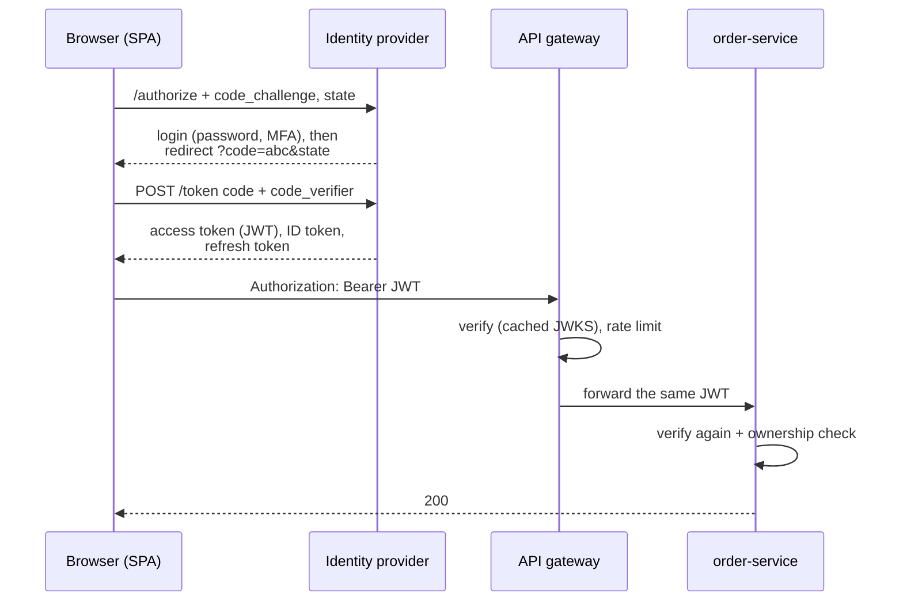
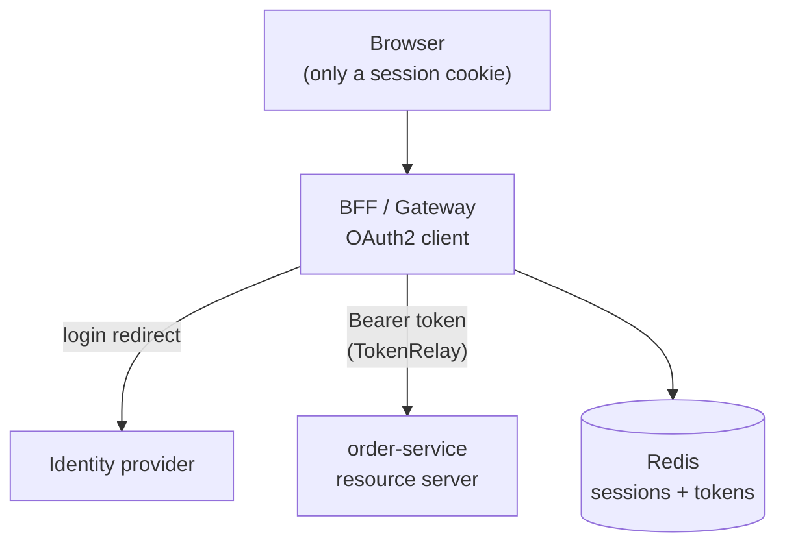

# Microservices Security: Authentication, Authorization and Secrets — Interview Q&A

**What this covers:** how a microservices system logs users in and decides what they may
do — OAuth 2.0 / OpenID Connect, JWTs, identity providers, checking tokens at the gateway
**and** in every service, roles vs scopes, ownership checks, service-to-service auth,
where the browser keeps tokens, CORS/CSRF, secrets and the OWASP API risks — from the
developer's side.

Filter-chain internals and OAuth grant details: [Spring_Security_QA.md](../05-Spring-Microservices/notes/Spring_Security_QA.md).
Where this sits in the request journey: [19 Q2](19_Microservices_Request_Flow_Architecture_QA.md#2-what-happens-when-a-user-clicks-place-order).
**Facts:** property names checked in the Boot 3.5.7 jar; Spring Security 7 changes and the
`RestClient` OAuth2 interceptor confirmed on docs.spring.io, 7 Oct 2026. Snippets use only
the lambda DSL, so they work on Security 6.5 and 7.

## Weight legend

| Mark | Meaning |
| --- | --- |
| ★★★ | Asked in almost every round — know the detail |
| ★★ | Asked often — know the short answer and one example |
| ★ | Occasional — two or three lines |

## Contents

| # | Question | Weight | One-line answer |
| --- | --- | --- | --- |
| 1 | [AuthN vs AuthZ in microservices](#1-authentication-vs-authorization-in-microservices) | ★★★ | Who you are (IdP) vs what you may do (gateway coarse, service fine) |
| 2 | [OAuth2, OIDC, JWT, SAML](#2-oauth-20-openid-connect-jwt-and-saml) | ★★★ | Delegated access; login on top; a token format; older XML SSO |
| 3 | [SPA login flow](#3-how-a-single-page-app-logs-in-authorization-code-with-pkce) | ★★★ | Authorization Code + PKCE, never the implicit flow |
| 4 | [Choosing an identity provider](#4-choosing-an-identity-provider) | ★★ | Keycloak self-hosted; Okta/Auth0/Entra/Cognito managed |
| 5 | [JWT contents and validation](#5-whats-inside-a-jwt-and-how-it-is-validated) | ★★★ | Signature via JWKS, then `exp`, `iss`, `aud` |
| 6 | [Resource server setup](#6-spring-boot-resource-server-setup) | ★★★ | One starter + `issuer-uri`; a `SecurityFilterChain` |
| 7 | [Gateway or every service?](#7-validate-the-token-at-the-gateway-or-in-every-service) | ★★★ | Both — zero trust |
| 8 | [Roles and scopes → authorities](#8-mapping-roles-and-scopes-to-authorities) | ★★★ | `SCOPE_` by default; a converter for IdP role claims |
| 9 | [Method security, ownership](#9-method-security-and-ownership-checks) | ★★★ | `@PreAuthorize` + "is this *your* order?" |
| 10 | [Service-to-service auth](#10-service-to-service-authentication) | ★★★ | Token relay, client credentials, or mTLS |
| 11 | [Where the browser keeps tokens](#11-where-should-the-browser-keep-tokens) | ★★★ | Best: BFF + httpOnly cookie; avoid localStorage |
| 12 | [Expiry, refresh, logout](#12-token-expiry-refresh-tokens-and-logout) | ★★★ | Short access tokens, rotating refresh tokens |
| 13 | [Sessions vs stateless tokens](#13-sessions-vs-stateless-tokens) | ★★ | Stateless APIs; Spring Session + Redis when needed |
| 14 | [CORS](#14-cors) | ★★★ | Browser rule for cross-origin calls; configure in one place |
| 15 | [CSRF](#15-csrf) | ★★★ | Needed with cookies; not for pure bearer-token APIs |
| 16 | [Storing passwords](#16-storing-passwords) | ★★ | BCrypt/Argon2 via `DelegatingPasswordEncoder` |
| 17 | [API keys and webhook signatures](#17-api-keys-and-webhook-signatures) | ★★ | Hashed keys per partner; HMAC-signed webhooks |
| 18 | [Secrets management](#18-secrets-management) | ★★★ | Secret store → pod; never in Git or images |
| 19 | [OWASP API Top 10](#19-owasp-api-security-top-10-for-developers) | ★★★ | BOLA is #1 — check ownership on every object |
| 20 | [Validation and injection](#20-input-validation-and-injection) | ★★ | Bean Validation, bind parameters, DTOs |
| 21 | [TLS and mTLS](#21-tls-and-mtls-inside-the-cluster) | ★★ | TLS at the edge; mTLS inside via a mesh |
| 22 | [Security headers](#22-security-headers) | ★ | HSTS, nosniff, frame options, CSP |
| 23 | [Vulnerability scanning](#23-dependency-and-image-vulnerability-scanning) | ★★ | Jars and images scanned in CI |
| 24 | [Testing secured endpoints](#24-testing-secured-endpoints) | ★★ | `jwt()` post-processor in MockMvc |
| 25 | [Logging safely](#25-logging-without-leaking-tokens-or-personal-data) | ★★ | Never log tokens, passwords, card numbers |
| 26 | [Fine-grained authorization](#26-fine-grained-authorization) | ★ | ABAC, OPA, relationship-based |
| 27 | [Spring Security 7 changes](#27-what-changed-in-spring-security-7) | ★ | Lambda DSL only; Authorization Server merged in |

---

## 1. Authentication vs authorization in microservices

**Weight:** ★★★

**Short answer:** **Authentication** = *who* the caller is; **authorization** = *what* they
may do. Authentication is **delegated to an identity provider** that issues a signed token.
Every hop verifies the token with the IdP's **public key** — no IdP call per request. The
gateway does coarse checks; each service does fine-grained ones.

| Question | Where | Failure |
| --- | --- | --- |
| Who are you? (login, MFA) | Identity provider | — |
| Is the token genuine and fresh? | Gateway **and** every service | 401 |
| May you call this API? (scopes/roles) | Gateway (coarse), service | 403 |
| May you touch *this* record? | The owning service only | 403 / 404 |

---

## 2. OAuth 2.0, OpenID Connect, JWT and SAML

**Weight:** ★★★

**Short answer:** **OAuth 2.0** = delegated *authorization* (an app gets an **access
token** to call an API). **OIDC** = a login layer on OAuth that adds an **ID token** (who
logged in). **JWT** = a signed-JSON *token format* both commonly use. **SAML** = older
XML enterprise SSO.

| Grant type | Use it for |
| --- | --- |
| Authorization Code **+ PKCE** | Users in web, SPA and mobile apps |
| Client Credentials | Service-to-service, no user |
| Refresh Token | New access token without logging in again |
| Device Code | TVs, CLIs |
| ~~Implicit~~, ~~Password~~ | Removed in OAuth 2.1 |

**Classic mistake:** sending the **ID token** to your API. The API takes the **access
token** (audience = the API); the ID token is only for the client app.

---

## 3. How a single-page app logs in: Authorization Code with PKCE

**Weight:** ★★★

**Short answer:** The SPA redirects to the IdP with a **code_challenge** (hash of a random
**code_verifier**). After login the IdP returns a short-lived **authorization code**; the
SPA exchanges code + verifier for tokens. PKCE proves the redeemer started the login, so a
stolen code is useless.



**Why not implicit flow?** It put the token in the URL fragment (history, referrers) with
no proof of the receiver. **`state`** blocks CSRF on the callback; OIDC's **`nonce`** binds
the ID token. Safer still for browsers: a BFF so the SPA never holds tokens ([Q11](#11-where-should-the-browser-keep-tokens)).

---

## 4. Choosing an identity provider

**Weight:** ★★

| IdP | Type | Typical user |
| --- | --- | --- |
| **Keycloak** | Open source, self-hosted | Java shops wanting control, no per-user fees |
| **Okta / Auth0** | SaaS | Workforce SSO (Okta), customer login (Auth0) |
| **Entra ID** | SaaS | Microsoft-centric enterprises |
| **Cognito** / **Identity Platform** | Managed (AWS / GCP) | Cloud-native apps |
| **Spring Authorization Server** | Library | Building your own OAuth server — now inside Spring Security 7 |

Services only need the **issuer URI**; JWKS and algorithms are discovered from
`{issuer}/.well-known/openid-configuration`. Swapping IdPs is mostly config plus role-claim
mapping. Don't build your own login unless that's the product.

---

## 5. What's inside a JWT and how it is validated

**Weight:** ★★★

**Short answer:** `header.payload.signature`, Base64URL-encoded. **Signed, not encrypted** —
anyone can read it, so no secrets inside. Validation: **signature** with the IdP's public
key from **JWKS** → **`exp`/`nbf`** → **`iss`** → **`aud`**.

```json
{ "alg": "RS256", "kid": "2026-key-1" }
{ "iss": "https://auth.shop.com/realms/shop", "sub": "user-42", "aud": "order-service",
  "exp": 1791367200, "scope": "orders.read orders.write",
  "realm_access": { "roles": ["CUSTOMER"] } }
```

**What Spring's `NimbusJwtDecoder` does:** rejects `alg: none` / unexpected algorithms;
finds the key by `kid` in the cached JWKS (an unknown `kid` triggers a re-fetch — that's
how **key rotation** works); verifies the signature; checks `exp` with 60 s clock skew and
`iss`. **Audience is checked only if you configure `audiences`.**

| RS256 / ES256 (asymmetric) | HS256 (shared secret) |
| --- | --- |
| Services verify with the public key but can't mint tokens | Every service holding the secret can forge tokens |

**Revocation problem:** a JWT stays valid until `exp`, even after logout — hence short
lifetimes ([Q12](#12-token-expiry-refresh-tokens-and-logout)).

---

## 6. Spring Boot resource server setup

**Weight:** ★★★

**Short answer:** `spring-boot-starter-oauth2-resource-server` + the **issuer URI** (and
audience) + a `SecurityFilterChain` that is **stateless**, enables `.jwt()`, and turns
CSRF off (bearer tokens, no cookies).

```yaml
spring.security.oauth2.resourceserver.jwt:
  issuer-uri: https://auth.shop.com/realms/shop   # discovers the JWKS URL
  audiences: order-service                         # reject tokens meant for other APIs
```

```java
@Bean
SecurityFilterChain api(HttpSecurity http) throws Exception {
    return http
        .authorizeHttpRequests(a -> a
            .requestMatchers("/actuator/health/**").permitAll()
            .requestMatchers(HttpMethod.GET, "/api/orders/**").hasAuthority("SCOPE_orders.read")
            .anyRequest().authenticated())
        .oauth2ResourceServer(o -> o.jwt(Customizer.withDefaults()))
        .sessionManagement(s -> s.sessionCreationPolicy(SessionCreationPolicy.STATELESS))
        .csrf(c -> c.disable())                    // safe only because no cookies
        .build();
}
```

**Per request:** `BearerTokenAuthenticationFilter` → `JwtDecoder` → `JwtAuthenticationToken`
in the `SecurityContext` → `AuthorizationFilter`; controllers can take
`@AuthenticationPrincipal Jwt jwt`. **Opaque tokens** use `.opaqueToken()` and call the
IdP's introspection endpoint per request — cache it or the IdP becomes the bottleneck.

---

## 7. Validate the token at the gateway or in every service?

**Weight:** ★★★

**Short answer:** **Both.** The gateway rejects bad traffic early. Each service validates
**again** because the network behind the gateway is not trusted — another pod, a misrouted
call or a compromised service can call it directly. That's **zero trust**.

| Approach | Problem |
| --- | --- |
| Gateway only; services trust everything | One breach inside = access to every service |
| Gateway converts JWT to an `X-User-Id` header | Any internal caller can forge the header |
| **Gateway validates + forwards the JWT; services validate again** | The standard answer |

"Isn't that slow?" — no: an RS256 check with a cached key takes microseconds, no network
call. Add **network policies** so only expected callers can reach each service
([14 Q23](14_Kubernetes_QA.md#23-network-policies)).

---

## 8. Mapping roles and scopes to authorities

**Weight:** ★★★

**Short answer:** Spring maps `scope`/`scp` to `SCOPE_xxx` authorities by default. Roles
live in IdP-specific claims (Keycloak `realm_access.roles`, Cognito `cognito:groups`, Entra
`roles`), so you map them to `ROLE_xxx`.

```yaml
# flat claim (Entra/Cognito style) — properties only
spring.security.oauth2.resourceserver.jwt:
  authorities-claim-name: roles
  authority-prefix: ROLE_
```

```java
// Keycloak's nested claim, keeping scopes too
converter.setJwtGrantedAuthoritiesConverter(jwt -> {
    Collection<GrantedAuthority> auth = new ArrayList<>(scopes.convert(jwt)); // SCOPE_*
    Map<String, Object> realm = jwt.getClaimAsMap("realm_access");
    if (realm != null && realm.get("roles") instanceof Collection<?> roles)
        roles.forEach(r -> auth.add(new SimpleGrantedAuthority("ROLE_" + r)));
    return auth;
});
```

| Scopes | Roles |
| --- | --- |
| What the **client app** may do (`orders.read`) | What the **user** is (`ADMIN`) |
| `hasAuthority('SCOPE_orders.read')` | `hasRole('ADMIN')` → checks `ROLE_ADMIN` |

Forgetting the `ROLE_` prefix is the most common "why always 403?" bug.

---

## 9. Method security and ownership checks

**Weight:** ★★★

**Short answer:** URL rules protect endpoints; `@PreAuthorize` protects methods; but the #1
API vulnerability is **BOLA / IDOR** — user 42 changes `/orders/42` to `/orders/43`. Every
object access must check **ownership**.

```java
@PreAuthorize("hasAuthority('SCOPE_orders.read')")        // needs @EnableMethodSecurity
public OrderResponse get(long orderId, Jwt caller) {
    return repo.findByIdAndCustomerId(orderId, caller.getSubject())  // owner in the query
            .map(OrderResponse::from)
            .orElseThrow(OrderNotFoundException::new);   // someone else's order -> 404
}
```

Putting the owner in the **query** is the safest form — other users' rows can't even be
loaded; return 404 rather than 403 so you don't reveal the record exists. Alternatives:
`@PostAuthorize("returnObject.customerId == authentication.name")`. Like `@Transactional`,
it works only through the proxy (not `private`, not self-calls). Multi-tenant systems add
`tenant_id` from the token to every query.

---

## 10. Service-to-service authentication

**Weight:** ★★★

**Short answer:** Three options, often combined:

| Option | Meaning | Use when |
| --- | --- | --- |
| **Token relay** | Forward the user's JWT | Acting on the user's behalf |
| **Client credentials** | The service gets its **own** token from the IdP | Background jobs, Kafka consumers, service-level trust |
| **mTLS** | Both sides present certificates (usually via a mesh) | Proving *which workload* calls |

**Client credentials with `RestClient`** (Spring Security 6.4+, confirmed in current docs):

```yaml
spring.security.oauth2.client:
  registration.payment-client:
    provider: keycloak
    client-id: order-service
    client-secret: ${ORDER_SERVICE_CLIENT_SECRET}
    authorization-grant-type: client_credentials
  provider.keycloak.issuer-uri: https://auth.shop.com/realms/shop
```

```java
var oauth = new OAuth2ClientHttpRequestInterceptor(authorizedClientManager);
oauth.setClientRegistrationIdResolver(request -> "payment-client");
RestClient payment = builder.baseUrl("http://payment-service:8080")
        .requestInterceptor(oauth)          // fetches, caches and refreshes the token
        .build();
```

**Gotcha:** outside an HTTP request (Kafka consumers, schedulers) use an
`AuthorizedClientServiceOAuth2AuthorizedClientManager`. **Token exchange (RFC 8693)** swaps
the user's token for a narrower-audience one per hop — a strong senior-level mention.

---

## 11. Where should the browser keep tokens?

**Weight:** ★★★

**Short answer:** Best: a **Backend for Frontend (BFF)** — the browser never sees tokens. A
server-side component (Spring Cloud Gateway as an OAuth2 client, or a small Boot BFF) does
the login, keeps tokens server-side, and gives the browser an **httpOnly, Secure,
SameSite** session cookie. If the SPA must hold tokens: **memory**, not `localStorage`.

| Storage | XSS can steal it? | CSRF risk? | Verdict |
| --- | --- | --- | --- |
| `localStorage` | **Yes** | No | Avoid |
| JS memory | Harder | No | OK, with refresh rotation |
| JWT in httpOnly cookie | No | **Yes** | Needs CSRF protection |
| **BFF session cookie** | No | Mitigated (SameSite + CSRF token) | **Recommended** |



Mobile apps: Authorization Code + PKCE via the system browser; refresh tokens in Keychain /
Android Keystore.

---

## 12. Token expiry, refresh tokens and logout

**Weight:** ★★★

**Short answer:** **Short access tokens** (5–15 min) limit a stolen token's value. A
**refresh token** gets new ones silently; with **rotation**, each use returns a new refresh
token and invalidates the old, so a replayed stolen one is detected.

| Need | Mechanism |
| --- | --- |
| Log the user out | Revoke the refresh token + OIDC `end_session_endpoint` |
| Kill access tokens instantly | Not possible with pure JWTs — wait for `exp`, or a `jti` deny-list in Redis |
| Logout everywhere (password change) | Revoke all the user's refresh tokens |
| Instant revocation always | Opaque tokens + introspection (cache briefly) |

Tokens "expired" the moment they're issued → check **clock skew** (NTP) first.

---

## 13. Sessions vs stateless tokens

**Weight:** ★★

APIs behind a gateway should be **stateless** — any pod serves any request. Browser apps
and BFFs still use **sessions**, stored in **Redis via Spring Session** so they survive
restarts and work across replicas. Sessions revoke instantly; JWTs don't. Never use
in-memory `HttpSession` with several replicas.

---

## 14. CORS

**Weight:** ★★★

**Short answer:** A **browser** rule: JS on `https://www.shop.com` may call
`https://api.shop.com` only if the API answers with a matching
`Access-Control-Allow-Origin`. JSON bodies and `Authorization` headers trigger an
**OPTIONS preflight** first. It protects users' browsers — it is **not** API security
(curl ignores it).

```java
var cfg = new CorsConfiguration();
cfg.setAllowedOrigins(List.of("https://www.shop.com"));      // never "*" with credentials
cfg.setAllowedMethods(List.of("GET", "POST", "PUT", "DELETE"));
cfg.setAllowedHeaders(List.of("Authorization", "Content-Type", "Idempotency-Key"));
cfg.setAllowCredentials(true);
// register in a CorsConfigurationSource bean + http.cors(Customizer.withDefaults())
```

**Gotchas:** configure it in **one** place — if the gateway (`…webflux.globalcors`) and the
service both add the header, the browser rejects the duplicate. Enable `http.cors()` in
Spring Security, or the token-less preflight gets a 401.

---

## 15. CSRF

**Weight:** ★★★

**Short answer:** CSRF makes a logged-in user's browser send a request from another site;
it works because **browsers attach cookies automatically**. **Cookie-based auth** (sessions,
BFF, JWT-in-cookie) → keep CSRF protection on (`CookieCsrfTokenRepository` for SPAs).
**Bearer token in the `Authorization` header** → the browser never attaches it on its own,
so disabling CSRF is safe. `SameSite=Lax/Strict` cookies add defence in depth. Interviewers
want the *why*, not just "we disabled it".

---

## 16. Storing passwords

**Weight:** ★★

Only if you run your own user store. Use a slow, salted, adaptive hash — **BCrypt**
(Spring's default), **Argon2** or scrypt; never plain SHA/MD5 or encryption. Use
`PasswordEncoderFactories.createDelegatingPasswordEncoder()`: it stores `{bcrypt}…`, so you
can upgrade algorithms and re-hash on next login. Rate-limit login attempts.

---

## 17. API keys and webhook signatures

**Weight:** ★★

**API keys:** one per partner, stored **hashed**, scoped, rate-limited, rotatable (two
active keys during a switch). Keys identify a *client*, not a user — prefer OAuth client
credentials when partners support it.

**Incoming webhooks** (Stripe, Razorpay, GitHub): verify the **HMAC** over the **raw body**
(re-serialised JSON breaks the signature) with a **constant-time** compare, reject old
timestamps, and process idempotently (webhooks repeat).

```java
Mac mac = Mac.getInstance("HmacSHA256");
mac.init(new SecretKeySpec(secret.getBytes(UTF_8), "HmacSHA256"));
boolean valid = MessageDigest.isEqual(mac.doFinal(rawBody), HexFormat.of().parseHex(sigHex));
```

---

## 18. Secrets management

**Weight:** ★★★

**Short answer:** Secrets live in a **secret store** — AWS Secrets Manager, GCP Secret
Manager, Vault — and reach the pod at runtime; **never** in Git, `application.yml`, images
or CI logs. The pod authenticates with its **workload identity** (IRSA / EKS Pod Identity,
GKE Workload Identity), so there are no bootstrap keys.

| Way into the app | Notes |
| --- | --- |
| **External Secrets Operator** → K8s Secret → env/file | Most common; app stays cloud-agnostic |
| Secrets Store CSI driver | Mounted as files |
| `spring.config.import=aws-secretsmanager:…` | App reads directly ([08 Q5](08_Spring_Cloud_AWS_QA.md#5-secrets-manager-and-parameter-store)) |
| Spring Cloud Vault | Can issue **dynamic DB credentials** |
| Sealed Secrets / SOPS | Encrypted secrets in Git |

**Must-knows:** K8s Secrets are only **base64** — enable etcd encryption and tight RBAC
([14 Q12](14_Kubernetes_QA.md#12-configmap-vs-secret)); rotation must not break running pods
([27 Q19](27_Microservices_Production_Scenarios_QA.md#19-a-rotated-secret-broke-the-service));
scan commits for secrets; mask Actuator `/env` ([07 Q4](07_Spring_Boot_Actuator_QA.md#4-securing-actuator)).

---

## 19. OWASP API Security Top 10 for developers

**Weight:** ★★★

| # | Risk (2023) | What you do in code |
| --- | --- | --- |
| API1 | Broken Object Level Authorization (BOLA) | Ownership check on **every** object ([Q9](#9-method-security-and-ownership-checks)) |
| API2 | Broken Authentication | Use the IdP; validate `iss`/`aud`/`exp`; rate-limit login |
| API3 | Broken Object Property Level Authorization | Separate request/response DTOs — no mass assignment |
| API4 | Unrestricted Resource Consumption | Rate limits, page-size caps, body limits, timeouts |
| API5 | Broken Function Level Authorization | Role checks on admin endpoints, not hidden URLs |
| API6 | Sensitive Business Flows | Bot protection, per-user limits on checkout/coupons |
| API7 | SSRF | Allow-list hosts; block metadata IPs (169.254.169.254) |
| API8 | Security Misconfiguration | No open Actuator, no stack traces, correct CORS |
| API9 | Improper Inventory Management | Retire old versions; know every endpoint |
| API10 | Unsafe Consumption of APIs | Validate and time-limit third-party responses |

Mass-assignment example: binding a request into the `User` entity lets someone send
`"role": "ADMIN"`; an `UpdateProfileRequest` record with only allowed fields prevents it.

---

## 20. Input validation and injection

**Weight:** ★★

Bean Validation (`@Valid`, `@NotBlank`, `@Size`) on request DTOs → 400 `ProblemDetail`.
SQL/JPQL only with bound parameters; user-chosen sort columns need an allow-list. Don't
enable Jackson default typing on untrusted input. Cap body and list sizes. Strip newlines
from logged user input (or log JSON).

---

## 21. TLS and mTLS inside the cluster

**Weight:** ★★

TLS always terminates at the **edge** (ACM, Google-managed certs, cert-manager). Inside,
many teams use plain HTTP behind network policies; regulated ones use **mTLS via a service
mesh** (Istio, Linkerd), which issues and rotates certificates with no app changes. For
app-level TLS, Boot's **SSL bundles** (`spring.ssl.bundle.*`) configure keystores once for
the server, `RestClient`, Kafka and Redis.

---

## 22. Security headers

**Weight:** ★

Spring Security adds `X-Content-Type-Options: nosniff`, `X-Frame-Options: DENY`,
`Cache-Control: no-store` and HSTS (on HTTPS) by default. Add a **Content-Security-Policy**
wherever the SPA is served — CSP is the main limit on XSS, which is what steals tokens.

---

## 23. Dependency and image vulnerability scanning

**Weight:** ★★

| What | Tools |
| --- | --- |
| Library CVEs | Dependabot / Renovate, Snyk, OWASP Dependency-Check |
| Image CVEs | Trivy, Grype, registry scanning (ECR / Artifact Registry) |
| Code | SonarQube, CodeQL, Semgrep |
| Secrets in commits | GitHub secret scanning, gitleaks |
| SBOM | CycloneDX plugin, Boot's `/actuator/sbom` |

Fail the build on **critical, fixable** findings; small base images mean fewer CVEs.
→ [25 Q17](25_CI_CD_Build_Deploy_QA.md#17-supply-chain-security-sbom-scanning-and-signing)

---

## 24. Testing secured endpoints

**Weight:** ★★

Use the **`jwt()`** post-processor from `spring-security-test` — no real IdP. Test the
negative cases too: no token → 401, missing scope → 403, someone else's order → 404.

```java
mvc.perform(get("/api/orders/1")
        .with(jwt().jwt(j -> j.subject("user-42"))
                   .authorities(new SimpleGrantedAuthority("SCOPE_orders.read"))))
   .andExpect(status().isOk());

mvc.perform(get("/api/orders/1")).andExpect(status().isUnauthorized());
```

In `@WebMvcTest`, `@Import` your security config. For end-to-end, run Keycloak in
Testcontainers (community module `dasniko/testcontainers-keycloak`).

---

## 25. Logging without leaking tokens or personal data

**Weight:** ★★

Never log `Authorization` headers, cookies, passwords, card numbers, OTPs or full JWTs —
log the user id (`sub`) and trace id instead. Mask PII where GDPR / DPDP / PCI apply. Keep
request-body logging off in production. Actuator `/httpexchanges` and `/env` can expose
headers and secrets — keep them off or secured ([07 Q2](07_Spring_Boot_Actuator_QA.md#2-the-endpoints)).

---

## 26. Fine-grained authorization

**Weight:** ★

When roles aren't enough ("managers refund under ₹50,000 in their own region"): **ABAC** via
`@PreAuthorize` calling a bean or a custom `AuthorizationManager`; **policy engines** (OPA,
Cedar / AWS Verified Permissions) keep rules outside the code; **ReBAC** (Zanzibar-style:
OpenFGA, SpiceDB) for "can edit if in a group that owns the folder".

---

## 27. What changed in Spring Security 7

**Weight:** ★

Ships with Boot 4 (confirmed on docs.spring.io, 7 Oct 2026): **lambda DSL only** (`.and()`
and `authorizeRequests()` removed; use `.with(…)` for custom configurers);
`AntPathRequestMatcher`/`MvcRequestMatcher` replaced by `PathPatternRequestMatcher`;
**Spring Authorization Server merged in** (same coordinates, version 7.x); built-in **MFA**
support (extended in 7.1).

---

## Sources

Confirmed on 7 Oct 2026:

- Local Maven cache: Boot 3.5.7 metadata (`spring.security.oauth2.resourceserver.jwt.*`)
- [OAuth2 authorized clients and `OAuth2ClientHttpRequestInterceptor`](https://docs.spring.io/spring-security/reference/servlet/oauth2/client/authorized-clients.html)
- [Spring Security 7 configuration migrations](https://docs.spring.io/spring-security/reference/migration-7/configuration.html)
- [What's new in Spring Security](https://docs.spring.io/spring-security/reference/whats-new.html)
- [Spring Authorization Server moving to Spring Security 7.0](https://spring.io/blog/2025/09/11/spring-authorization-server-moving-to-spring-security-7-0)
- [OWASP API Security Top 10 — 2023](https://owasp.org/API-Security/editions/2023/en/0x11-t10/)
