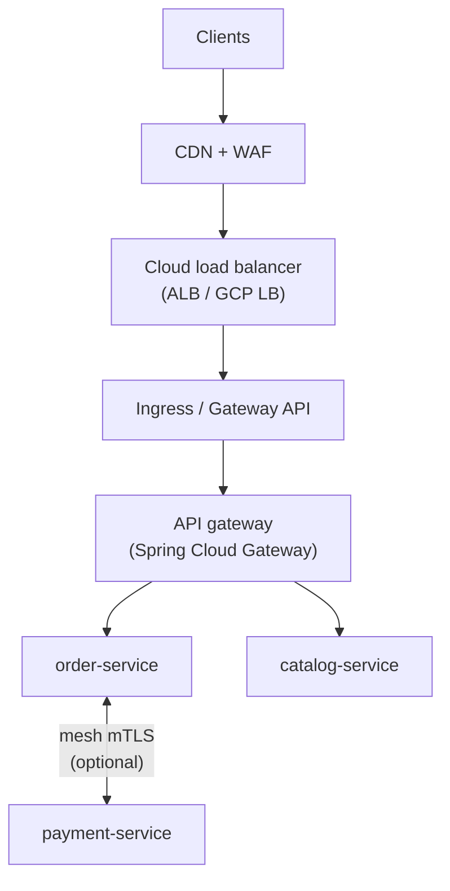
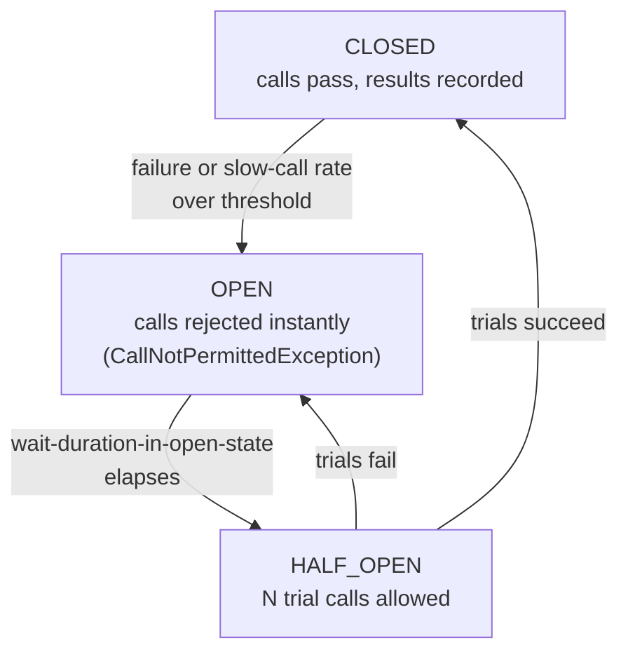
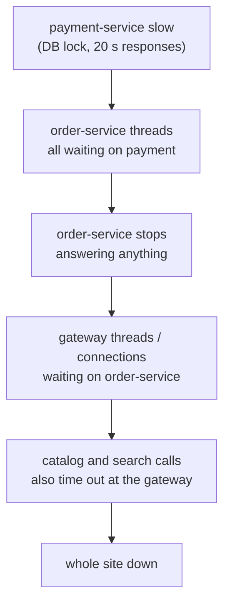

# API Gateway, Rate Limiting and Resilience — Interview Q&A

**What this covers:** the front door of a microservices system and the safety equipment on
every remote call. Part one: the **API gateway** — what it does, how it differs from a load
balancer / ingress / mesh, **Spring Cloud Gateway** routes and filters, and **Redis-backed
rate limiting**. Part two: **resilience** — timeouts, retries, **circuit breakers**,
bulkheads, fallbacks, load shedding with **Resilience4j**, how cascading failures happen,
and how to test the protections.

Deeper circuit-breaker and retry theory: [Microservices_QA](../05-Spring-Microservices/notes/Microservices_QA.md)
(Q2, Q3, Q7). **Facts:** properties and classes checked in the local Maven cache on 7 Oct
2026 — Spring Cloud Gateway **5.0.3** (Spring Cloud 2025.1), Resilience4j **2.3.0**
(`-spring-boot3`) and **2.4.0** (`-spring-boot4`); release trains, gateway renames and
Spring 7 resilience annotations confirmed on spring.io.

## Weight legend

| Mark | Meaning |
| --- | --- |
| ★★★ | Asked in almost every round — know the detail |
| ★★ | Asked often — know the short answer and one example |
| ★ | Occasional — two or three lines |

## Contents

| # | Question | Weight | One-line answer |
| --- | --- | --- | --- |
| 1 | [What an API gateway does](#1-what-an-api-gateway-does) | ★★★ | One front door: routing, auth, rate limits, cross-cutting concerns |
| 2 | [Gateway vs LB vs ingress vs mesh](#2-api-gateway-vs-load-balancer-vs-ingress-vs-service-mesh) | ★★★ | API policy vs traffic spreading vs cluster entry vs service-to-service |
| 3 | [Which gateway companies use](#3-which-gateway-do-companies-use) | ★★★ | Spring Cloud Gateway, Kong, AWS API Gateway, Apigee, Envoy-based |
| 4 | [SCG routes, predicates, filters](#4-spring-cloud-gateway-routes-predicates-and-filters) | ★★★ | Predicate matches; filters change; route sends |
| 5 | [A custom global filter](#5-writing-a-custom-global-filter) | ★★ | `GlobalFilter` + `Ordered`; mutate the exchange; never block |
| 6 | [SCG WebFlux vs WebMVC](#6-spring-cloud-gateway-webflux-or-webmvc) | ★★ | Two server flavours; renamed artifacts and properties since 2025.0 |
| 7 | [Why and where to rate limit](#7-why-and-where-to-rate-limit) | ★★★ | Edge for floods, gateway per user/plan, service for its own resources |
| 8 | [Rate-limiting algorithms](#8-rate-limiting-algorithms) | ★★★ | Token bucket allows bursts; sliding window is fairest |
| 9 | [Distributed rate limiting with Redis](#9-distributed-rate-limiting-with-redis) | ★★★ | Shared counters so all replicas enforce one limit |
| 10 | [What the client sees](#10-what-a-rate-limited-client-sees) | ★★ | 429 + `Retry-After` + remaining-quota headers |
| 11 | [The resilience toolkit](#11-the-resilience-toolkit) | ★★★ | Timeout, retry, circuit breaker, bulkhead, rate limiter, fallback |
| 12 | [How a circuit breaker works](#12-how-a-circuit-breaker-works) | ★★★ | Closed → open on failures/slow calls → half-open trial → closed |
| 13 | [Resilience4j in Spring Boot](#13-resilience4j-in-spring-boot) | ★★★ | Annotations + per-instance YAML |
| 14 | [Decorator order](#14-the-order-of-resilience4j-decorators) | ★★ | Retry ( CircuitBreaker ( RateLimiter ( TimeLimiter ( Bulkhead ) ) ) ) |
| 15 | [Retrying safely](#15-retrying-safely) | ★★★ | Transient errors only, idempotent only, backoff + jitter, one layer |
| 16 | [Bulkhead](#16-bulkhead) | ★★ | Cap concurrent calls per dependency |
| 17 | [Good fallbacks](#17-what-makes-a-good-fallback) | ★★ | Degrade honestly; never fake success |
| 18 | [Timeouts on every client](#18-timeouts-on-every-client) | ★★★ | HTTP, JDBC, Redis, Kafka, gateway — each has its own setting |
| 19 | [Cascading failure](#19-how-a-cascading-failure-happens) | ★★★ | Slow dependency → threads pile up → callers die in turn |
| 20 | [Load shedding, backpressure](#20-load-shedding-and-backpressure) | ★★ | Reject early when full; let consumers pull |
| 21 | [CB at gateway or service](#21-circuit-breaker-at-the-gateway-or-in-the-service) | ★★ | Gateway per route, service per dependency — usually both |
| 22 | [Which resilience library](#22-resilience4j-vs-spring-cloud-circuit-breaker-vs-spring-framework-7) | ★★ | Resilience4j; Spring 7 adds simple `@Retryable` |
| 23 | [Monitoring resilience](#23-monitoring-circuit-breakers-and-limits) | ★★ | Actuator endpoints + metrics + alerts on state |
| 24 | [Testing resilience](#24-testing-resilience) | ★★ | WireMock/Toxiproxy faults; chaos in staging |
| 25 | [Hystrix](#25-what-happened-to-hystrix) | ★ | Dead since 2018; use Resilience4j |
| 26 | [Scenario: slow downstream](#26-scenario-a-downstream-service-becomes-slow) | ★★★ | Timeout + CB + bulkhead contain it; then find the cause |

---

## 1. What an API gateway does

**Weight:** ★★★

**Short answer:** The **single entry point** for client traffic. It routes each request to
the right service and handles what every API needs, so services don't repeat it:
**authentication, rate limiting, CORS, header rewriting, timeouts/circuit breaking per
route, canary routing, access logs and trace start.**

It must **not** hold business logic — a "smart gateway" becomes a bottleneck owned by one
team. Response aggregation belongs in a BFF ([19 Q13](19_Microservices_Request_Flow_Architecture_QA.md#13-backend-for-frontend-bff)).

---

## 2. API gateway vs load balancer vs ingress vs service mesh

**Weight:** ★★★

| | Load balancer | Ingress / Gateway API | API gateway | Service mesh |
| --- | --- | --- | --- | --- |
| Job | Spread traffic | HTTP entry into K8s | API policy for clients | Service ↔ service |
| Knows users / API keys | No | Barely | **Yes** | Workload identity only |
| Examples | ALB, NLB | Envoy Gateway, GKE Gateway | Spring Cloud Gateway, Kong, Apigee | Istio, Linkerd |



Small setups merge layers (ALB straight to SCG, or AWS API Gateway alone). Ingress NGINX
is being retired; new clusters use **Gateway API** ([14 Q11](14_Kubernetes_QA.md#11-ingress-and-gateway-api)).

---

## 3. Which gateway do companies use?

**Weight:** ★★★

| Gateway | Choose when |
| --- | --- |
| **Spring Cloud Gateway** | Java team; custom filters in Java; runs as a normal Deployment |
| **Kong** | Polyglot company; big plugin catalogue; can act as K8s ingress |
| **AWS API Gateway** | Serverless/Lambda, usage plans and API keys ([11 Q6](11_AWS_Serverless_Containers_DevOps_QA.md#6-api-gateway)) |
| **Apigee** (Google) | Partner/public APIs, monetisation, analytics |
| **Envoy-based** | Mesh users, gRPC-heavy systems |

Answer with a reason: "SCG, because we needed Java filters for tenant routing and per-plan
limits; partner APIs went through Apigee for key management."

---

## 4. Spring Cloud Gateway: routes, predicates and filters

**Weight:** ★★★

**Short answer:** A **route** = id + destination URI + **predicates** (when it matches:
path, method, header, host, weight) + **filters** (what to change: strip prefix, headers,
rate limit, retry, circuit breaker). First match wins.

```yaml
spring.cloud.gateway.server.webflux:        # 2025.x prefix (was spring.cloud.gateway)
  httpclient: { connect-timeout: 1000, response-timeout: 5s }
  routes:
    - id: orders
      uri: http://order-service:8080        # K8s Service DNS
      predicates: [ "Path=/api/orders/**" ]
      filters: [ "StripPrefix=1" ]          # /api/orders/1 -> /orders/1
    - id: catalog-canary
      uri: http://catalog-service-v2:8080
      predicates: [ "Path=/api/catalog/**", "Weight=catalog, 10" ]   # 10% canary
    - id: catalog
      uri: http://catalog-service:8080
      predicates: [ "Path=/api/catalog/**", "Weight=catalog, 90" ]
```

Common filters: `StripPrefix`, `RewritePath`, `AddRequestHeader`, `RequestRateLimiter`,
`CircuitBreaker`, `Retry`, `TokenRelay`, `RequestSize`. `lb://name` URIs need a discovery
client; on plain K8s `http://name:port` is enough. A Java `RouteLocator` DSL exists for
routes that need logic.

---

## 5. Writing a custom global filter

**Weight:** ★★

Implement **`GlobalFilter`** (every route) + **`Ordered`**; the exchange is immutable, so
`mutate()` it. The WebFlux gateway is **reactive — never block** (no JDBC, no RestTemplate).

```java
@Component
class CorrelationIdFilter implements GlobalFilter, Ordered {
    public Mono<Void> filter(ServerWebExchange ex, GatewayFilterChain chain) {
        String id = Optional.ofNullable(ex.getRequest().getHeaders().getFirst("X-Correlation-Id"))
                .orElseGet(() -> UUID.randomUUID().toString());
        return chain.filter(ex.mutate().request(r -> r.header("X-Correlation-Id", id)).build());
    }
    public int getOrder() { return Ordered.HIGHEST_PRECEDENCE; }
}
```

"Pre" logic runs in ascending order; "post" logic (in `.then(...)`) in reverse. Per-route
filters extend `AbstractGatewayFilterFactory` and become usable by name in YAML.

---

## 6. Spring Cloud Gateway: WebFlux or WebMVC?

**Weight:** ★★

Two server flavours: the original **reactive (WebFlux/Netty)** and **Server WebMVC** (servlet
stack, works well with virtual threads). **Spring Cloud 2025.0** renamed them (confirmed
7 Oct 2026); old names were deprecated, then removed:

| Old | New |
| --- | --- |
| `spring-cloud-starter-gateway` | `spring-cloud-starter-gateway-server-webflux` |
| `spring-cloud-starter-gateway-mvc` | `spring-cloud-starter-gateway-server-webmvc` |
| `spring.cloud.gateway.routes` | `spring.cloud.gateway.server.webflux.routes` |

Release-train pairing: **2025.0 ↔ Boot 3.5**, **2025.1 ↔ Boot 4.0/4.1**.

---

## 7. Why and where to rate limit

**Weight:** ★★★

**Short answer:** Rate limiting caps requests per client per time window — protecting
services from overload and abuse, keeping one tenant from starving others, and enforcing
paid plans. Apply it in **layers**, each with its own key:

| Layer | Key | Protects against | Tool |
| --- | --- | --- | --- |
| Edge / WAF | IP | Floods, bots, credential stuffing | AWS WAF, Cloud Armor |
| API gateway | User id, API key, plan | Abuse, fair use, quotas | SCG `RequestRateLimiter`, Kong |
| Service | Endpoint | Expensive operations (search, export) | Bucket4j |
| Outbound client | Partner API | Breaching a partner's limit | Resilience4j `RateLimiter` |

**Gotcha:** behind a load balancer the client IP is in `X-Forwarded-For` — trust it only
from known proxies (`…webflux.trusted-proxies`), or attackers spoof it.

---

## 8. Rate-limiting algorithms

**Weight:** ★★★

**Short answer:** **Token bucket** is the default: a bucket of `capacity` tokens refills at
rate `r`; each request takes one; empty = reject. It allows short **bursts** while
enforcing the average. **Fixed window** is simplest but lets 2× through at a window
boundary; **sliding window** fixes that.

| Algorithm | Pros | Cons |
| --- | --- | --- |
| Fixed window counter | One Redis `INCR` + `EXPIRE` | 100 at 12:00:59 + 100 at 12:01:00 |
| Sliding window log | Exact | Stores every timestamp |
| Sliding window counter | Smooth, cheap | Approximate |
| **Token bucket** | Bursts + smooth average (SCG, Bucket4j, AWS) | Two parameters to tune |
| Leaky bucket | Perfectly smooth output | Adds queueing latency |

```java
// fixed window in Redis — the classic whiteboard answer
String key = "rl:" + userId + ":" + (System.currentTimeMillis() / 60_000);
Long count = redis.opsForValue().increment(key);          // atomic
if (count == 1) redis.expire(key, Duration.ofSeconds(70));
boolean allowed = count <= 100;                            // 100 per minute
```

Weak spot to mention: `INCR` + `EXPIRE` aren't atomic together — production versions use a
**Lua script**, which is what SCG's Redis limiter does.

---

## 9. Distributed rate limiting with Redis

**Weight:** ★★★

**Short answer:** With 6 gateway pods, an in-memory 10/s limit really allows 60/s. The
count must live in a **shared store** — Redis. SCG's `RequestRateLimiter` + Redis rate
limiter implements a token bucket in Lua (needs `spring-boot-starter-data-redis-reactive`).

```yaml
filters:
  - name: RequestRateLimiter
    args:
      redis-rate-limiter.replenishRate: 10     # tokens per second (average)
      redis-rate-limiter.burstCapacity: 20     # bucket size (burst)
      key-resolver: "#{@userKeyResolver}"
```

```java
@Bean
KeyResolver userKeyResolver() {                // per user; empty key -> denied by default
    return ex -> ex.getPrincipal().map(Principal::getName);
}
```

- **In a service:** Bucket4j —
  `Bucket.builder().addLimit(l -> l.capacity(20).refillGreedy(10, Duration.ofSeconds(1)))`
  — in memory or Redis/JDBC-backed.
- **Resilience4j `RateLimiter` is per instance** — for protecting an outbound dependency,
  not a cluster-wide user limit.
- **Redis down?** Decide **fail-open** (allow — usual for user APIs) or **fail-closed**
  (reject — for expensive or abuse-prone endpoints), and say why.

---

## 10. What a rate-limited client sees

**Weight:** ★★

```http
HTTP/1.1 429 Too Many Requests
Retry-After: 2
X-RateLimit-Remaining: 0
X-RateLimit-Burst-Capacity: 20
```

429, not 503 — the service is fine; *this client* is over. `Retry-After` tells clients when
to return. Your own clients calling partners must honour it — retrying a 429 immediately
makes it worse.

---

## 11. The resilience toolkit

**Weight:** ★★★

| Tool | Solves | Without it |
| --- | --- | --- |
| **Timeout** | A call that never returns | Threads wait forever |
| **Retry** | A brief glitch | One blip = failed request |
| **Circuit breaker** | A dependency that's down or very slow | Every call waits for a timeout; retries hammer it |
| **Bulkhead** | One dependency using all threads | A slow payment-service blocks catalog requests too |
| **Rate limiter** | Too many calls | Overload, partner bans |
| **Fallback** | What to return on failure | Raw errors instead of a degraded answer |

One-liner: "Every outbound call has a timeout, circuit breaker and bulkhead; idempotent
calls also get a retry with backoff and jitter; the fallback is decided per call."

---

## 12. How a circuit breaker works

**Weight:** ★★★

**Short answer:** It wraps calls to a dependency and tracks recent results. **Closed** —
calls pass. When the **failure rate** or **slow-call rate** in the sliding window crosses a
threshold → **Open** — calls fail **immediately**, giving the dependency time to recover.
After a wait → **Half-open** — a few trial calls; success closes it, failure re-opens it.



| Setting | Typical |
| --- | --- |
| `sliding-window-size` (count-based) | 20–100 calls |
| `minimum-number-of-calls` | 10 (don't judge on 2 calls) |
| `failure-rate-threshold` | 50% |
| `slow-call-duration-threshold` / `slow-call-rate-threshold` | Just under the timeout / 50–80% |
| `wait-duration-in-open-state` | 10–60 s |
| `permitted-number-of-calls-in-half-open-state` | 3–10 |

**Most-missed point:** a **400/404 is not a dependency failure**. Put client/business
errors in `ignore-exceptions`, or one bad input pattern opens the circuit for everyone.
→ [Microservices_QA Q3](../05-Spring-Microservices/notes/Microservices_QA.md#3-how-does-a-circuit-breaker-actually-work)

---

## 13. Resilience4j in Spring Boot

**Weight:** ★★★

**Short answer:** `resilience4j-spring-boot3` (or `-spring-boot4`) + AOP + Actuator.
Annotate the method making the remote call; configure each named **instance** in YAML.

```java
@Retry(name = "inventory")
@CircuitBreaker(name = "inventory", fallbackMethod = "reserveFallback")
@Bulkhead(name = "inventory")
public ReservationResponse reserve(ReserveRequest req) { return client.reserve(req); }

// same parameters + Throwable, same return type
private ReservationResponse reserveFallback(ReserveRequest req, Throwable t) { ... }
```

```yaml
resilience4j:
  circuitbreaker.instances.inventory:
    sliding-window-size: 20
    minimum-number-of-calls: 10
    failure-rate-threshold: 50
    slow-call-duration-threshold: 1500ms
    wait-duration-in-open-state: 20s
    record-exceptions: [ org.springframework.web.client.ResourceAccessException,
                         org.springframework.web.client.HttpServerErrorException ]
    ignore-exceptions: [ org.springframework.web.client.HttpClientErrorException ]
  retry.instances.inventory:
    max-attempts: 3                     # 1 call + 2 retries
    wait-duration: 200ms
    enable-exponential-backoff: true
    enable-randomized-wait: true        # jitter; combines with exponential in 2.x
  bulkhead.instances.inventory:
    max-concurrent-calls: 25
    max-wait-duration: 0                # fail fast, don't queue
```

**Gotchas:** AOP proxy rules apply (no `private`, no self-calls — [01](01_Spring_AOP_QA.md));
a wrong fallback signature is only found at runtime; a fallback that swallows every
exception hides bugs; `@TimeLimiter` needs async return types — for blocking calls use the
HTTP client's read timeout.

---

## 14. The order of Resilience4j decorators

**Weight:** ★★

Default, outermost first: **Retry ( CircuitBreaker ( RateLimiter ( TimeLimiter ( Bulkhead (
method ) ) ) ) )**. So each retry attempt is counted by the breaker, and an open breaker
makes retries fail instantly — exclude `CallNotPermittedException` from retries. A full
bulkhead counts as a breaker failure (it signals overload). Change the order with the
`…-aspect-order` properties, or more clearly with the functional `Decorators` API.

---

## 15. Retrying safely

**Weight:** ★★★

**Short answer:** Retry only **transient** failures, only **idempotent** operations (or
ones with an idempotency key), with **exponential backoff + jitter**, few attempts, at **one
layer**. Bad retries turn a small outage into a big one.

| Retry | Don't retry |
| --- | --- |
| Connect refused/reset, read timeout | 400, 401, 403, 404, 409, 422 |
| 502, 503, 504 | Business-rule errors |
| 429 — after `Retry-After` | POST without an idempotency key |
| Transient DB/Kafka errors | `CallNotPermittedException` |

- **Jitter:** 1,000 clients retrying at exactly 200 ms hit the recovering service as one wave.
- **Amplification:** gateway 3× → service 3× → service 3× = **27 calls** per click.
- **Budget:** attempts × timeout + backoff must fit the caller's timeout
  ([19 Q16](19_Microservices_Request_Flow_Architecture_QA.md#16-timeouts-across-a-call-chain)).

---

## 16. Bulkhead

**Weight:** ★★

Caps **concurrent calls to one dependency**, so a slow one can only tie up its own share of
threads; extra calls are rejected fast. **Semaphore** bulkhead (default; fine with virtual
threads) or **thread-pool** bulkhead (separate pool + queue). Spring 7 has
`@ConcurrencyLimit(n)` built in. **Sizing (Little's law):** in-flight ≈ rate × latency —
200 rps × 0.1 s = 20; cap at ~2× that.

---

## 17. What makes a good fallback

**Weight:** ★★

| Call | Good fallback | Bad fallback |
| --- | --- | --- |
| Recommendations | Popular items from cache | Error page |
| Price | Last cached price, marked stale | Price 0 |
| Payment | Fail fast with a clear message | Mark the order paid |
| Reviews widget | Hide the widget | Fail the product page |

Rule: **money and stock** fail fast and clearly; **nice-to-have** data degrades silently.
It's a business decision — agree it with the product owner.

---

## 18. Timeouts on every client

**Weight:** ★★★

Several Java clients wait **forever** or very long by default. Set connect and read
timeouts on everything that leaves the process:

| Client | Setting |
| --- | --- |
| `RestClient` | `ClientHttpRequestFactorySettings` or `spring.http.client.*` ([19 Q8](19_Microservices_Request_Flow_Architecture_QA.md#8-how-one-spring-boot-service-calls-another)) |
| `WebClient` | Reactor Netty `responseTimeout` + `CONNECT_TIMEOUT_MILLIS` |
| OpenFeign | `spring.cloud.openfeign.client.config.<name>.connect-timeout` / `read-timeout` |
| Spring Cloud Gateway | `…webflux.httpclient.connect-timeout` / `response-timeout` |
| JDBC (Hikari) | `connection-timeout` (default 30 s) + statement timeout |
| Redis (Lettuce) | `spring.data.redis.timeout` |
| Kafka producer | `delivery.timeout.ms`, `max.block.ms` (`send()` can block on metadata) |

---

## 19. How a cascading failure happens

**Weight:** ★★★

**Short answer:** One dependency gets **slow** (not even down). Callers' threads wait on it,
their pools fill, they stop answering *their* callers — and the failure climbs until the
gateway fails **everything**, including features that never touch the slow service.



What stops each step: **timeouts** (no waiting forever), **circuit breaker** (fail fast),
**bulkhead** (one dependency can't eat all threads), few retries with jitter, **load
shedding**, **fallbacks**, and **async** for non-essential steps. **Slow is worse than
down** — a dead service fails fast; a slow one holds resources. That's why breakers track
slow calls.

---

## 20. Load shedding and backpressure

**Weight:** ★★

**Load shedding:** at capacity, reject extra work **early and cheaply** (fast 503) instead
of accepting it and timing out for everyone — concurrency limits, bounded queues (Tomcat
`threads.max` / `accept-count`), and **priority** (shed recommendations before checkout).
**Backpressure:** the consumer sets the pace — Kafka is pull-based, so a spike becomes lag
instead of an outage; Reactive Streams signal demand upstream.

---

## 21. Circuit breaker at the gateway or in the service?

**Weight:** ★★

Usually **both**: the gateway breaker (per route) protects the gateway and returns a
friendly fallback when a whole service fails; the service breaker (per dependency)
protects the service's threads so it degrades one feature and keeps serving others.

```yaml
# needs spring-cloud-starter-circuitbreaker-reactor-resilience4j
filters:
  - name: CircuitBreaker
    args: { name: ordersCB, fallbackUri: "forward:/fallback/orders" }
  - name: Retry
    args: { retries: 2, methods: GET, statuses: "BAD_GATEWAY,SERVICE_UNAVAILABLE" }
```

---

## 22. Resilience4j vs Spring Cloud Circuit Breaker vs Spring Framework 7

**Weight:** ★★

| Option | Use when |
| --- | --- |
| **Resilience4j directly** | Most services — full feature set |
| Spring Cloud Circuit Breaker | Gateway filters; abstraction over Resilience4j |
| **Spring Framework 7** `@Retryable` / `@ConcurrencyLimit` | Simple retry and caps without a library (Boot 4) — **no circuit breaker** |
| Spring Retry | Older code; superseded by Spring 7's built-in retry |
| Service mesh | Uniform timeouts/retries across languages — but no business fallbacks, no idempotency awareness |

```java
@EnableResilientMethods                                   // on a @Configuration class
@Retryable(includes = ResourceAccessException.class, maxRetries = 2,
           delay = 200, multiplier = 2, jitter = 50)
@ConcurrencyLimit(25)
public StockLevel stock(String sku) { ... }
```

(Attribute names confirmed in the Spring Framework reference, 7 Oct 2026.)

---

## 23. Monitoring circuit breakers and limits

**Weight:** ★★

- **Actuator:** `/actuator/circuitbreakers`, `/circuitbreakerevents`, `/retries`,
  `/bulkheads`. `register-health-indicator: true` adds breakers to health — but keep them
  **out of liveness**, or an open breaker restarts a healthy pod.
- **Metrics:** `resilience4j.circuitbreaker.state`, `…calls` (kind: failed, not_permitted),
  `…failure.rate`, `resilience4j.bulkhead.available.concurrent.calls`;
  gateway: `spring.cloud.gateway.requests` by route and status.
- **Alert** on a breaker open for minutes and rising `not_permitted` — users are getting
  fallbacks. → [26](26_Observability_Logging_Monitoring_Tracing_QA.md)

---

## 24. Testing resilience

**Weight:** ★★

Inject faults on purpose and assert the protection fires:

```java
wireMock.stubFor(post("/api/inventory/reservations")
        .willReturn(aResponse().withFixedDelay(500)));     // slower than the 200 ms test timeout
for (int i = 0; i < 5; i++)                                 // test profile: min calls = 5
    assertThrows(InventoryUnavailableException.class, () -> gw.reserve(req));
assertThat(registry.circuitBreaker("inventory").getState()).isEqualTo(State.OPEN);
```

| Level | Tool |
| --- | --- |
| Integration | WireMock (`withFixedDelay`, `withFault`) |
| Real infra | Toxiproxy (Testcontainers) — latency/drops to Postgres, Redis, Kafka |
| Staging chaos | Chaos Monkey for Spring Boot, AWS FIS, Chaos Mesh, LitmusChaos |
| Load | Gatling, k6 |

---

## 25. What happened to Hystrix?

**Weight:** ★

Netflix put Hystrix into maintenance in 2018; Spring Cloud Netflix dropped it in the
2020.0 release train. **Resilience4j** replaced it — lighter, modular, Micrometer metrics.
Mention Hystrix only as what you migrated *from*.

---

## 26. Scenario: a downstream service becomes slow

**Weight:** ★★★

**"inventory-service suddenly takes 20 s per call. What happens, and what do you do?"**

1. **What contains it:** order-service's 2 s read timeout cuts each call; the breaker sees
   >60% slow calls and **opens** within ~10 calls, so further requests fail in
   microseconds with "inventory unavailable, try again"; the bulkhead caps inventory calls
   at 25, so order history and catalog keep working.
2. **How we notice:** alerts on p99 latency and breaker state; traces show the time in the
   inventory span.
3. **Root cause:** inventory's dashboards — CPU, GC, Hikari pending connections, slow
   queries, a recent deploy. Roll back if a deploy correlates; scale if it's load; fix the
   query if it's the DB.

Without those protections it becomes [Q19](#19-how-a-cascading-failure-happens). More
incidents: [27](27_Microservices_Production_Scenarios_QA.md).

---

## Sources

Confirmed on 7 Oct 2026:

- Local Maven cache: `spring-cloud-gateway-server-webflux` 5.0.3 metadata and classes;
  `resilience4j-spring-boot3` 2.3.0, `-spring-boot4` 2.4.0, `-framework-common` 2.3.0
- [Spring Cloud release trains and Boot compatibility](https://spring.io/projects/spring-cloud)
- [Spring Cloud 2025.0.0 release — gateway renames](https://spring.io/blog/2025/05/29/spring-cloud-2025-0-0-is-abvailable)
- [OpenRewrite: new Spring Cloud Gateway modules and starters](https://docs.openrewrite.org/recipes/java/spring/cloud2025/springcloudgatewaydeprecatedmodulesandstarters)
- [Spring Framework 7 resilience features](https://docs.spring.io/spring-framework/reference/core/resilience.html)
