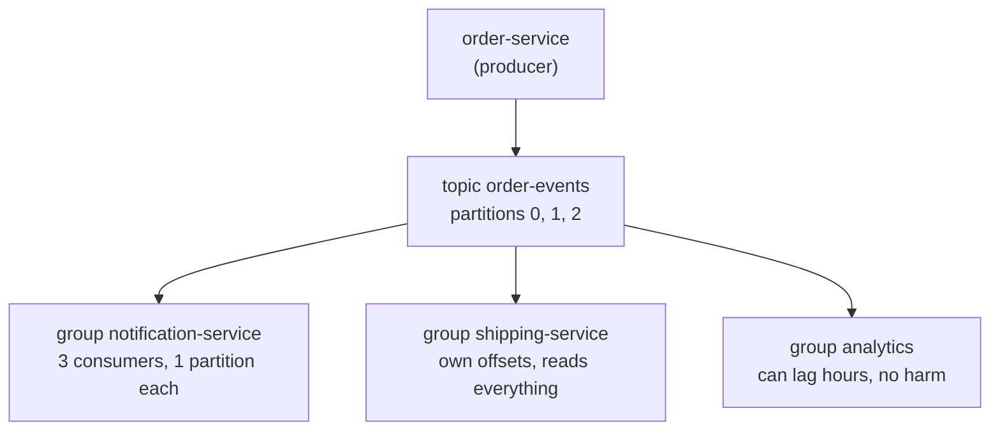
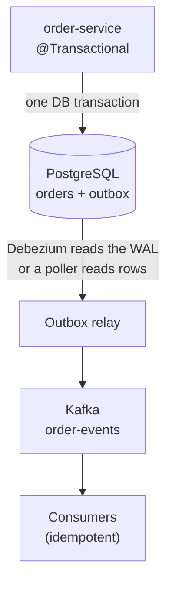
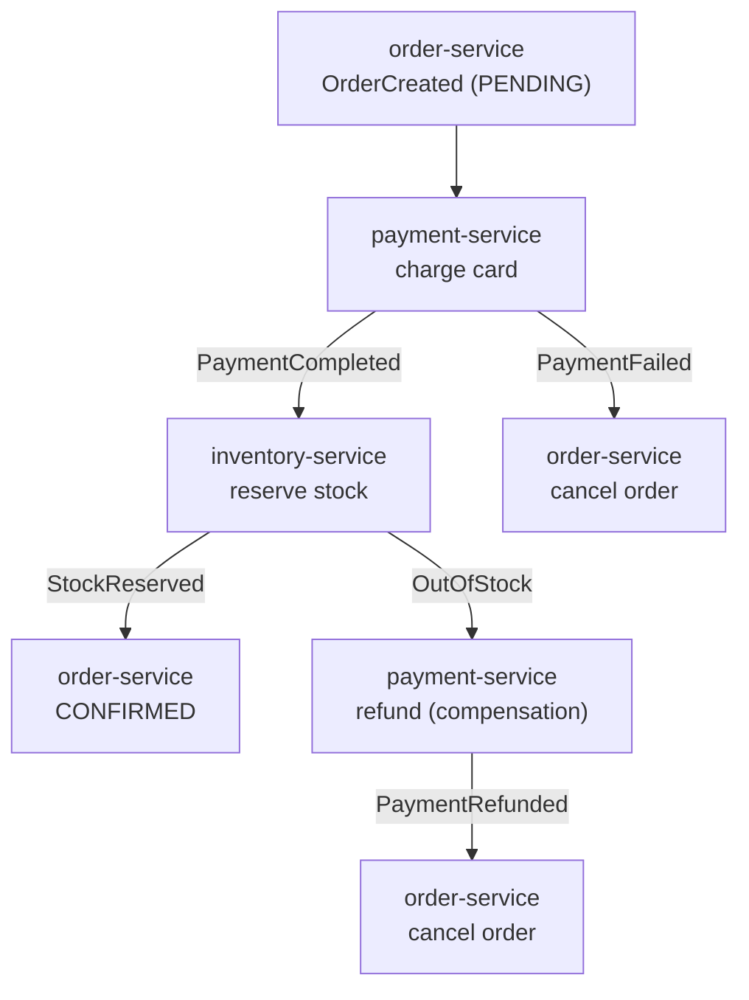

# Kafka and Event-Driven Microservices — Interview Q&A

**What this covers:** how Spring Boot services talk through events in practice — choosing a
broker, producing and consuming with **Spring for Apache Kafka**, the **dual-write problem
and transactional outbox**, retries and **dead-letter topics**, **idempotent consumers**,
sagas, event and schema design, ordering, lag, rebalancing, what "exactly-once" really
means, testing — and two incident scenarios.

Kafka internals (EOS mechanics, offset semantics, `acks`, why it's fast):
[Kafka_QA.md](../05-Spring-Microservices/notes/Kafka_QA.md); saga theory:
[Distributed_Transactions_Saga_QA.md](../04-HLD-System-Design/notes/Distributed_Transactions_Saga_QA.md).
**Facts:** Boot 3.5.7 manages Spring Kafka **3.3.10** / kafka-clients **3.9.1**; Boot 4.0.3 →
**4.0.3 / 4.1.1**; Boot 4.1.1 → **4.1.1 / 4.2.1** (local BOMs). Class names checked in the
Spring Kafka 4.1.1 jar; Kafka 4.2 and GCP facts confirmed on official sites, 7 Oct 2026.

## Weight legend

| Mark | Meaning |
| --- | --- |
| ★★★ | Asked in almost every round — know the detail |
| ★★ | Asked often — know the short answer and one example |
| ★ | Occasional — two or three lines |

## Contents

| # | Question | Weight | One-line answer |
| --- | --- | --- | --- |
| 1 | [Why events, which broker](#1-why-event-driven-and-which-broker) | ★★★ | Kafka for streams/replay/fan-out; queues for simple work distribution |
| 2 | [Kafka in one minute](#2-kafka-in-one-minute) | ★★★ | Topics → partitions; consumer groups share partitions |
| 3 | [Producing with Spring Kafka](#3-producing-events-with-spring-kafka) | ★★★ | `KafkaTemplate`, a business key, `acks=all`, idempotence |
| 4 | [Consuming with `@KafkaListener`](#4-consuming-events-with-kafkalistener) | ★★★ | Offset committed after processing; concurrency ≤ partitions |
| 5 | [Dual write and the outbox](#5-the-dual-write-problem-and-the-transactional-outbox) | ★★★ | Event row in the same DB transaction; relay it to Kafka |
| 6 | [Retries and dead-letter topics](#6-error-handling-retries-and-dead-letter-topics) | ★★★ | `DefaultErrorHandler` + backoff → `.DLT` |
| 7 | [Non-blocking retries](#7-non-blocking-retries-with-retryabletopic) | ★★ | `@RetryableTopic` — partition keeps flowing, order lost |
| 8 | [Poison pills](#8-poison-pills-and-deserialization-errors) | ★★ | `ErrorHandlingDeserializer` so one bad record doesn't block |
| 9 | [Idempotent consumers](#9-idempotent-consumers) | ★★★ | Store processed event ids; skip repeats |
| 10 | [Saga](#10-saga-choreography-vs-orchestration) | ★★★ | Local transactions + compensations; events or an orchestrator |
| 11 | [Event message design](#11-designing-event-messages) | ★★ | Past-tense facts in an envelope with id/type/version/time |
| 12 | [Schema evolution](#12-schema-evolution-and-the-schema-registry) | ★★ | Avro/Protobuf + registry + compatibility mode |
| 13 | [Ordering and keys](#13-ordering-and-partition-keys) | ★★★ | Order only within a partition; same key → same partition |
| 14 | [Consumer lag](#14-consumer-lag) | ★★★ | Latest offset − committed offset; alert on growth |
| 15 | [Rebalancing](#15-rebalancing) | ★★ | Cooperative sticky, static membership, KIP-848 |
| 16 | [Exactly-once, really](#16-what-exactly-once-really-means) | ★★★ | Kafka-to-Kafka only; DB side effects need idempotency |
| 17 | [Retention, compaction, replay](#17-retention-compaction-and-replay) | ★★ | Delete by time vs keep latest per key; reset offsets to replay |
| 18 | [Testing Kafka code](#18-testing-kafka-code) | ★★ | Testcontainers Kafka + Awaitility |
| 19 | [Tracing through Kafka](#19-tracing-through-kafka) | ★★ | `observation-enabled` → `traceparent` in headers |
| 20 | [Spring Kafka vs Cloud Stream](#20-spring-kafka-vs-spring-cloud-stream) | ★ | Direct control vs broker-neutral functions |
| 21 | [Managed Kafka, cloud options](#21-managed-kafka-and-cloud-alternatives) | ★★ | MSK, Confluent, GCP Managed Kafka; or SQS/SNS, Pub/Sub |
| 22 | [Kafka 4 changes](#22-what-changed-in-kafka-4) | ★ | No ZooKeeper, faster rebalances, queues |
| 23 | [Scenario: duplicate emails](#23-scenario-customers-got-two-confirmation-emails) | ★★★ | At-least-once + non-idempotent consumer |
| 24 | [Scenario: lag keeps growing](#24-scenario-consumer-lag-keeps-growing) | ★★★ | One partition or all? Find the slow step |

---

## 1. Why event-driven, and which broker?

**Weight:** ★★★

**Short answer:** Events **decouple**: order-service announces `OrderPlaced` once; email,
shipping and analytics react independently, and a consumer outage doesn't fail the order.
**Kafka** when you need throughput, **many consumers**, **per-key ordering** and **replay**;
a **queue** when each job just needs one worker.

| | Kafka | RabbitMQ | SQS / SNS | Pub/Sub |
| --- | --- | --- | --- | --- |
| Model | Log; consumers track offsets | Broker routes; deleted on ack | Queue / push fan-out | Topic + subscriptions |
| Replay | **Yes** (retention) | No | No | Limited (seek) |
| Ordering | Per partition | Per queue | FIFO queues | Ordering keys |
| Ops | Highest unless managed | Medium | None | None |

→ AWS options compared: [08 Q10](08_Spring_Cloud_AWS_QA.md#10-sqs-vs-sns-vs-eventbridge-vs-kinesis-vs-msk)

---

## 2. Kafka in one minute

**Weight:** ★★★

| Term | Meaning |
| --- | --- |
| Topic / partition | A stream split into ordered append-only logs — the unit of parallelism |
| Offset | Position in a partition |
| Key | `hash(key) % partitions` picks the partition → same key, same order |
| Replication factor / ISR | Copies (3 in prod); in-sync replicas that `acks=all` waits for |
| Consumer group | Members share partitions; each partition → one member |
| Lag | Latest offset − committed offset |
| KRaft | Built-in metadata quorum; ZooKeeper gone since 4.0 |



Two rules behind most answers: **max useful consumers = partitions**; each **group** gets
every message, each **member** gets a share.

---

## 3. Producing events with Spring Kafka

**Weight:** ★★★

**Short answer:** `KafkaTemplate.send(topic, key, value)` with a **business key** (order id)
so one order's events stay ordered; `acks=all` + idempotence (client defaults since Kafka
3.0); and treat `send()` as **async** — check the result.

```yaml
spring.kafka.producer:
  value-serializer: org.springframework.kafka.support.serializer.JsonSerializer
  acks: all                                # wait for in-sync replicas
  properties: { enable.idempotence: true, linger.ms: 5, compression.type: lz4 }
spring.kafka.template.observation-enabled: true   # traceparent into headers
```

```java
kafka.send("order-events", event.orderId(), event)          // key = orderId
     .whenComplete((result, ex) -> { if (ex != null) log.error("publish failed", ex); });
```

**Mistakes interviewers look for:** fire-and-forget (ignoring the future); publishing
inside a DB transaction and assuming both commit ([Q5](#5-the-dual-write-problem-and-the-transactional-outbox));
no key (one order's events out of order); `acks=1` (leader crash loses data).
**Spring Kafka 4:** `JsonSerializer` is deprecated for Jackson 3's `JacksonJsonSerializer`
(checked in the jar). → [Kafka_QA Q14](../05-Spring-Microservices/notes/Kafka_QA.md#14-what-is-acks-in-the-kafka-producer-and-what-are-its-levels)

---

## 4. Consuming events with `@KafkaListener`

**Weight:** ★★★

**Short answer:** The container polls, calls your method, and **commits the offset after it
returns** — a crash mid-processing means redelivery (**at-least-once**). `concurrency` up to
the partition count.

```java
@KafkaListener(topics = "order-events", groupId = "notification-service", concurrency = "3")
void on(OrderPlaced event) { ... }                 // must be idempotent (Q9)
```

```yaml
spring.kafka.consumer:
  auto-offset-reset: earliest
  enable-auto-commit: false             # the container commits after processing
  max-poll-records: 100
  value-deserializer: org.springframework.kafka.support.serializer.ErrorHandlingDeserializer
  properties:
    spring.deserializer.value.delegate.class: >-
      org.springframework.kafka.support.serializer.JsonDeserializer
    spring.json.trusted.packages: com.shop.events
spring.kafka.listener.ack-mode: record    # default BATCH; MANUAL = you call acknowledge()
```

**Gotchas:** handing work to another thread and returning commits the offset **before** the
work is done (loss on crash, order lost). If one poll's work exceeds
`max.poll.interval.ms` (5 min), the consumer is kicked out and the batch is redelivered —
the classic duplicate source ([Kafka_QA Q8](../05-Spring-Microservices/notes/Kafka_QA.md#8-what-happens-when-a-consumer-takes-longer-than-maxpollintervalms)).

---

## 5. The dual-write problem and the transactional outbox

**Weight:** ★★★

**Short answer:** Saving to Postgres and publishing to Kafka are **two systems with no
shared transaction**. Commit then fail to publish → the order exists but nobody hears;
publish then fail to commit → you announced a ghost order. The **outbox** fixes it: write
the event to an **`outbox` table in the same DB transaction**, and a **relay** publishes it.



```java
@Transactional
public Order place(CreateOrder cmd) {
    Order order = orders.save(...);
    outbox.save(new OutboxEvent(UUID.randomUUID(), order.getId(), "OrderPlaced", json(order)));
    return order;                                  // both rows commit, or neither
}
```

| | Polling publisher | Debezium CDC |
| --- | --- | --- |
| How | `@Scheduled` reads unpublished rows, sends, marks sent | Tails the DB write-ahead log |
| Latency | Poll interval | Near real time |
| Extra infra | None | Kafka Connect |
| Gotcha | Replicas must not double-publish: `FOR UPDATE SKIP LOCKED` or ShedLock | Outbox Event Router routes rows to topics |

**Delivery is at-least-once** (relay crashes after send, before marking) → consumers must
be idempotent. Kafka transactions don't help — they're atomic across Kafka writes, not with
your Postgres commit ([Kafka_QA Q6](../05-Spring-Microservices/notes/Kafka_QA.md#6-transaction-boundaries-across-services-db-write-plus-event-publish)).

---

## 6. Error handling: retries and dead-letter topics

**Weight:** ★★★

**Short answer:** When the listener throws, **`DefaultErrorHandler`** retries with a
**backoff**; after the last attempt **`DeadLetterPublishingRecoverer`** sends the record to
`<topic>.DLT` (exception in headers) and the consumer moves on. Errors that can never
succeed skip retries.

```java
@Bean            // Boot applies a single CommonErrorHandler bean to its listener factory
DefaultErrorHandler errorHandler(KafkaTemplate<Object, Object> template) {
    var backOff = new ExponentialBackOffWithMaxRetries(3);   // 0.5 s, 1 s, 2 s
    backOff.setInitialInterval(500);
    var handler = new DefaultErrorHandler(new DeadLetterPublishingRecoverer(template), backOff);
    handler.addNotRetryableExceptions(ValidationException.class);
    return handler;
}
```

**These retries block the partition** — ordering is kept but lag grows; keep total retry
time well under `max.poll.interval.ms`. For long waits use [Q7](#7-non-blocking-retries-with-retryabletopic).
**DLT discipline:** alert on any DLT traffic, have a runbook/tool to inspect and
re-publish, keep DLT retention long.

---

## 7. Non-blocking retries with `@RetryableTopic`

**Weight:** ★★

Failed records go to delayed **retry topics** instead of blocking; after the last attempt,
the DLT. The main topic keeps flowing, but **ordering for that key is lost**.

```java
@RetryableTopic(attempts = "4", backoff = @Backoff(delay = 1000, multiplier = 2.0),
                exclude = ValidationException.class)
@KafkaListener(topics = "payment-events", groupId = "ledger-service")
void on(PaymentCaptured event) { ... }

@DltHandler
void dead(PaymentCaptured event) { ... }       // alert / park for manual handling
```

**Spring Kafka 4:** the attribute became `backOff = @BackOff(delay = 1000, multiplier = 2)`
from `org.springframework.kafka.annotation` (checked in the 4.1.1 jar).

| | Blocking (`DefaultErrorHandler`) | Non-blocking (`@RetryableTopic`) |
| --- | --- | --- |
| Partition | Stalled during retry | Keeps flowing |
| Order per key | Kept | Lost for the retried record |
| Good for | Short waits; order-sensitive streams | Minutes-long waits; independent events |

---

## 8. Poison pills and deserialization errors

**Weight:** ★★

A **poison pill** is a record that can never be processed — usually bytes that don't
deserialize. That happens *before* your listener, so without protection the consumer fails
on the same offset forever. **`ErrorHandlingDeserializer`** wrapping the real deserializer
([Q4](#4-consuming-events-with-kafkalistener) config) hands the failure to the error
handler → DLT → move on. Also restrict `spring.json.trusted.packages`.

---

## 9. Idempotent consumers

**Weight:** ★★★

**Short answer:** At-least-once means every consumer sometimes sees an event twice. Record
each **event id** in the **same DB transaction** as the side effect, and skip ids already
seen.

```java
@Modifying
@Query(value = "INSERT INTO processed_events(event_id) VALUES (:id) "
             + "ON CONFLICT (event_id) DO NOTHING", nativeQuery = true)
int markProcessed(@Param("id") UUID eventId);        // 1 = first time, 0 = duplicate

@KafkaListener(topics = "order-events", groupId = "loyalty-service")
@Transactional
void on(OrderPlaced e) {
    if (processed.markProcessed(e.eventId()) == 0) return;   // seen before
    loyalty.addPoints(...);                                  // commits with the marker
}
```

**Why not catch the unique-key exception?** In JPA it marks the transaction rollback-only,
so the commit fails anyway.

| Other technique | Example |
| --- | --- |
| Natural idempotency | `UPDATE … SET status='SHIPPED'` — repeating changes nothing |
| Upsert by business key | `INSERT … ON CONFLICT (order_id) DO UPDATE` |
| Version check | Apply only if `event.version > row.version` (also handles reordering) |
| Downstream key | Pass `eventId` as the `Idempotency-Key` to the email/payment provider |

---

## 10. Saga: choreography vs orchestration

**Weight:** ★★★

**Short answer:** A saga replaces a distributed transaction with **local transactions** in
each service plus **compensations** to undo earlier steps (refund, release stock).
**Choreography:** services react to each other's events. **Orchestration:** one
orchestrator sends commands and tracks state.



| | Choreography | Orchestration |
| --- | --- | --- |
| Visibility | Flow spread across services | State in one place |
| Good for | 2–4 simple steps | Many steps, branching, timeouts, human steps |
| Tools | Kafka + listeners | Temporal, Camunda, Step Functions, a state table |

**Must be true:** every step and compensation is **idempotent**; compensations are
**semantic** (a refund, not a delete); users see intermediate states (`PENDING`); a failed
compensation retries, then alerts a human.
→ [Microservices_QA Q11](../05-Spring-Microservices/notes/Microservices_QA.md#11-choreography-versus-orchestration-in-a-saga)

---

## 11. Designing event messages

**Weight:** ★★

Name events as **past-tense facts** (`OrderPlaced`, not `PlaceOrder`), keyed by aggregate
id, inside a standard envelope:

```json
{ "eventId": "7c1e9a52-…", "eventType": "OrderPlaced", "eventVersion": 2,
  "occurredAt": "2026-10-07T10:15:30Z", "source": "order-service",
  "data": { "orderId": "order-123", "customerId": "user-42", "total": 2499.00 } }
```

| Style | Carries | Trade-off |
| --- | --- | --- |
| Event notification | Just ids | Small, but consumers call back → coupling |
| **Event-carried state transfer** | The data consumers need | No call-backs; consumers keep a local copy; bigger events |

Trace context goes in **headers**, not the body. Avoid unneeded PII — a Kafka log is hard to
delete from (GDPR). **CloudEvents** is a standard envelope for cross-company use.

---

## 12. Schema evolution and the schema registry

**Weight:** ★★

Producers and consumers deploy at different times, so formats must change **compatibly**.
**Avro/Protobuf + a schema registry** (Confluent, AWS Glue, Apicurio) rejects incompatible
changes at build/deploy time.

| Mode | Guarantee | Deploy order |
| --- | --- | --- |
| **BACKWARD** (Confluent default) | New schema reads old data | Consumers first |
| FORWARD | Old schema reads new data | Producers first |
| FULL | Both | Any |

Safe: add an optional field with a default. Breaking: rename, change type, add required.
Protobuf: never reuse a field number. **JSON without a registry:** same rules by
discipline — only add optional fields, consumers ignore unknown fields, `eventVersion` in
the envelope; a real break gets a new event type or topic.

---

## 13. Ordering and partition keys

**Weight:** ★★★

**Short answer:** Kafka orders **only within a partition**; the key picks the partition, so
all events keyed `order-123` are consumed in order. Key by the entity whose events must
stay ordered.

| Breaks ordering | Fix |
| --- | --- |
| No key / random key | Key by aggregate id |
| Async processing inside the listener | Process in the listener thread (or a key-ordered parallel consumer) |
| Non-blocking retry topics | Blocking retries for order-sensitive streams |
| **Adding partitions** | Changes key → partition; size partitions up front |
| Different topics | No cross-topic order at all |

**Hot partition:** one huge key (a giant merchant) overloads one partition and one thread —
use a finer key, or salt it and give up strict order. If consumers need "latest state",
compare an entity **version** and ignore older events.
→ [Kafka_QA Q4](../05-Spring-Microservices/notes/Kafka_QA.md#4-what-ordering-does-kafka-actually-guarantee)

---

## 14. Consumer lag

**Weight:** ★★★

**Lag** = latest offset − committed offset — records waiting. Growing lag = consumers slower
than producers; users see delays. Alert on **growing** lag or on **time lag** (age of the
oldest unprocessed record).

```bash
kafka-consumer-groups.sh --bootstrap-server kafka:9092 --describe --group notification-service
# PARTITION  CURRENT-OFFSET  LOG-END-OFFSET  LAG
# 0          10420           10425           5
# 1          9810            48210           38400   <- one partition: hot key or stuck record
```

Tools: Kafka exporter / Burrow → Prometheus, MSK CloudWatch metrics, Datadog. Lag on **one**
partition → hot key or stuck consumer; on **all** → too slow overall or too few consumers
([Q24](#24-scenario-consumer-lag-keeps-growing)).

---

## 15. Rebalancing

**Weight:** ★★

A rebalance reassigns partitions when a member joins, leaves, crashes or misses
`max.poll.interval.ms`. With the old **eager** protocol everyone pauses — rebalances on
every rolling deploy cause lag spikes and duplicates.

| Fix | Effect |
| --- | --- |
| Cooperative sticky assignor | Only moved partitions pause |
| Static membership (`group.instance.id` = pod name) | A quick restart gets its partitions back, no rebalance |
| **KIP-848 protocol** (`group.protocol=consumer`, GA in Kafka 4.0) | Broker-side, incremental, much faster |
| Short polls | Lower `max.poll.records`; no long blocking retries |

---

## 16. What exactly-once really means

**Weight:** ★★★

**Short answer:** Kafka's EOS (idempotent producer + transactions + `read_committed`) makes a
**consume → transform → produce-to-Kafka** loop atomic with the offset commit. It does
**not** cover DB writes, emails or API calls. For those: **at-least-once + idempotent
processing** ("effectively once").

| Flow | How you get "once" |
| --- | --- |
| Kafka → Kafka | Kafka transactions / Streams `exactly_once_v2` |
| Kafka → your DB | Idempotent consumer in one DB transaction |
| Kafka → external API | An idempotency key the API honours |
| DB → Kafka | Transactional outbox |

Say: "Exactly-once *delivery* across systems isn't possible in general; we build
exactly-once *effects* with idempotency."
→ [Kafka_QA Q1](../05-Spring-Microservices/notes/Kafka_QA.md#1-how-do-you-ensure-exactly-once-semantics-with-ordering-of-messages-in-kafka),
[Kafka_QA Q10](../05-Spring-Microservices/notes/Kafka_QA.md#10-how-do-you-ensure-exactly-once-in-kafka-streams-or-spring-kafka)

---

## 17. Retention, compaction and replay

**Weight:** ★★

- **Retention:** records kept for `retention.ms` (7 days default), consumed or not — what
  makes replay possible.
- **Compaction:** keeps the **latest record per key** (a changelog of state); a null value
  (**tombstone**) deletes the key.
- **Replay:** stop the group, `kafka-consumer-groups.sh --reset-offsets --to-datetime …
  --execute`, or start a new group from `earliest`. Consumers must be idempotent first.
- **Tiered storage** (production-ready in 3.9; MSK too) moves old segments to object
  storage for cheap long retention. → [Kafka_QA Q5](../05-Spring-Microservices/notes/Kafka_QA.md#5-retention-versus-compaction)

---

## 18. Testing Kafka code

**Weight:** ★★

Unit-test listener logic as a plain method. Integration: a **real broker in
Testcontainers** with `@ServiceConnection`, then **Awaitility** for the effect.
`@EmbeddedKafka` is faster but less realistic.

```java
@Container @ServiceConnection
static KafkaContainer kafka = new KafkaContainer("apache/kafka:4.1.0"); // org.testcontainers.kafka

@Test
void duplicateEventSendsOneEmail() {
    template.send("order-events", "order-1", event);
    template.send("order-events", "order-1", event);              // simulated redelivery
    await().atMost(Duration.ofSeconds(15))
           .untilAsserted(() -> verify(notifications, times(1)).sendConfirmation(any()));
}
```

Also test: a poison pill reaches the DLT; retries happen the expected number of times; the
outbox publishes after commit and not on rollback.

---

## 19. Tracing through Kafka

**Weight:** ★★

`spring.kafka.template.observation-enabled=true` + `spring.kafka.listener.observation-enabled=true`
(Boot 3.5.7 metadata): the producer writes **`traceparent`** into record headers and the
listener continues the trace — one trace from HTTP request to every consumer. With an
outbox, store the trace context in the row and restore it in the relay.
→ [26 Q7](26_Observability_Logging_Monitoring_Tracing_QA.md#7-context-propagation-across-kafka-and-async-code)

---

## 20. Spring Kafka vs Spring Cloud Stream

**Weight:** ★

**Spring Kafka** (`KafkaTemplate`, `@KafkaListener`) gives full control of retries,
transactions and partitions — the usual choice in Kafka shops. **Spring Cloud Stream**
hides the broker behind binders (Kafka, Rabbit, Pub/Sub…) with `Consumer<T>` /
`Function<A,B>` beans — pick it for broker portability.

---

## 21. Managed Kafka and cloud alternatives

**Weight:** ★★

| Option | Notes |
| --- | --- |
| **Amazon MSK** (provisioned / serverless) | IAM auth; MSK Connect for Debezium |
| **Confluent Cloud** | Schema registry, connectors, Flink |
| **GCP Managed Service for Apache Kafka** | GA Nov 2024; Kafka Connect GA Oct 2025 (confirmed) |
| SQS + SNS / EventBridge, Google Pub/Sub | No brokers; no Kafka-style replay |

Developer impact of managed Kafka is mostly **auth settings** (IAM/SASL/mTLS in
`spring.kafka.properties`), private networking and plan quotas — the Spring code is the same.

---

## 22. What changed in Kafka 4

**Weight:** ★

- **4.0 (March 2025):** ZooKeeper removed — KRaft only; clients need Java 11+, brokers 17+;
  **KIP-848** consumer protocol GA ([Q15](#15-rebalancing)).
- **Queues for Kafka (KIP-932, share groups):** many consumers share one partition with
  per-record acks. **Production-ready in 4.2** (released 17 Feb 2026, confirmed on
  kafka.apache.org); Spring Kafka 4.x has `ShareKafkaListenerContainerFactory`.
- Boot 4.0 manages kafka-clients 4.1; Boot 4.1 manages 4.2.

---

## 23. Scenario: customers got two confirmation emails

**Weight:** ★★★

**Mechanism:** at-least-once delivery + a consumer that **isn't idempotent** → two emails.

| Trigger | How to confirm |
| --- | --- |
| Sent the email, crashed/redeployed before committing | Duplicates cluster around deploys |
| Poll work exceeded `max.poll.interval.ms` → reassigned → redelivered | "poll timeout has expired" + rebalance logs |
| Outbox relay resent after a crash | Same `eventId` at two offsets |
| Email call timed out but succeeded, then retried | Provider logs show two sends |
| A deploy **renamed the groupId** → new group re-read old events | Duplicates for old orders, all at once |

**Fix:** processed-event-id table ([Q9](#9-idempotent-consumers)) + `eventId` as the
provider's idempotency key; then remove the trigger (smaller `max.poll.records`, static
membership, never rename group ids casually). **Prove it:** a test delivering the event
twice, and a "duplicates skipped" metric that stays non-zero — duplicates still arrive,
they're just harmless.

---

## 24. Scenario: consumer lag keeps growing

**Weight:** ★★★

1. **One partition or all?** (`--describe`, [Q14](#14-consumer-lag)). One → hot key or a
   record stuck in retries (check for the same offset repeating). All → step 2.
2. **Input up or output down?** Compare produce rate with processing rate (a sale or
   backfill vs a slow dependency).
3. **Where does per-record time go?** Listener timers and traces: slow query, slow HTTP
   call, GC, CPU throttling.

| Cause | Fix |
| --- | --- |
| Too few consumers | Scale to the partition count (`concurrency` × pods) |
| Already at partition count | More partitions (mind ordering) or batch processing |
| Slow per-record work | Fix the query, batch writes, cache lookups |
| Blocking retries | Retry topics / DLT; cap attempts |
| Rebalance storms | Static membership, cooperative assignor |

Tell stakeholders: lag is **delay, not loss** (within retention), and how long the backlog
will take to drain.

---

## Sources

Confirmed on 7 Oct 2026:

- Local Maven cache: Boot 3.5.7 / 4.0.3 / 4.1.1 BOMs; Boot 3.5.7 `spring.kafka.*` metadata;
  Spring Kafka 4.1.1 jar (`JacksonJsonSerializer`, deprecated `JsonSerializer`,
  `@RetryableTopic.backOff`, `ShareKafkaListenerContainerFactory`); Testcontainers 1.21.4
  (`org.testcontainers.kafka.KafkaContainer`)
- [Apache Kafka 4.2.0 release announcement](https://kafka.apache.org/blog/2026/02/17/apache-kafka-4.2.0-release-announcement/)
- [Google Cloud Managed Service for Apache Kafka release notes](https://docs.cloud.google.com/managed-service-for-apache-kafka/docs/release-notes)
