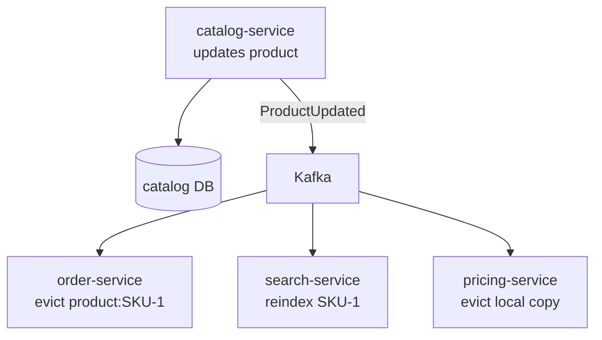

# Caching and Data Management in Microservices — Interview Q&A

**What this covers:** the data side as a developer sees it. **Caching** — where caches sit,
`@Cacheable`, Caffeine vs Redis, cache patterns, invalidation, stampedes, Redis config and
operations, locks, HTTP caching. **Data** — database per service, queries across services,
**zero-downtime migrations**, connection pools, replicas, locking, SQL vs NoSQL, pagination.

Hibernate / Spring Data internals: [02](02_Hibernate_QA.md), [03](03_JPA_Spring_Data_QA.md);
earlier caching answer: [Microservices_QA Q9](../05-Spring-Microservices/notes/Microservices_QA.md#9-why-caching-and-where-and-how-do-you-apply-it).
**Facts:** `spring.cache.*` / `spring.data.redis.*` checked in Boot 3.5.7 metadata and
serializers in the Spring Data Redis 4.1.1 jar (7 Oct 2026); the rest is stable knowledge.

## Weight legend

| Mark | Meaning |
| --- | --- |
| ★★★ | Asked in almost every round — know the detail |
| ★★ | Asked often — know the short answer and one example |
| ★ | Occasional — two or three lines |

## Contents

| # | Question | Weight | One-line answer |
| --- | --- | --- | --- |
| 1 | [Where caching happens](#1-where-caching-happens-in-a-request) | ★★★ | Browser, CDN, gateway, in-process, Redis, DB buffer cache |
| 2 | [Spring cache abstraction](#2-springs-cache-abstraction) | ★★★ | `@Cacheable`, `@CachePut`, `@CacheEvict` over a `CacheManager` |
| 3 | [Caffeine vs Redis vs both](#3-caffeine-vs-redis-vs-two-levels) | ★★★ | Local is fastest; Redis is shared; two levels for hot reads |
| 4 | [Cache patterns](#4-cache-aside-read-through-write-through-write-behind) | ★★★ | Cache-aside is the default |
| 5 | [Invalidation and TTLs](#5-cache-invalidation-and-ttls) | ★★★ | Update DB, then delete the key; TTL as the safety net |
| 6 | [Stampede, penetration, avalanche](#6-cache-stampede-penetration-and-avalanche) | ★★★ | Single-flight, negative caching, TTL jitter |
| 7 | [Configuring Redis caching](#7-configuring-redis-caching-in-spring-boot) | ★★ | JSON values, TTL per cache, transaction-aware |
| 8 | [Redis data structures](#8-redis-data-structures-backend-developers-use) | ★★ | Strings, hashes, sets, sorted sets, streams |
| 9 | [Distributed locks](#9-distributed-locks-and-scheduled-jobs) | ★★ | ShedLock for jobs; Redis locks for efficiency, not safety |
| 10 | [Redis in production](#10-running-redis-in-production) | ★★ | Managed, replicated, right eviction policy, no `KEYS` |
| 11 | [HTTP caching](#11-http-caching-with-etag-and-cache-control) | ★★ | `Cache-Control`, `ETag` → 304 |
| 12 | [What not to cache](#12-what-not-to-cache) | ★★ | Fast-changing, money, per-user sensitive, rarely reused |
| 13 | [Database per service](#13-database-per-service) | ★★★ | Each service owns its tables |
| 14 | [Queries across services](#14-querying-data-owned-by-several-services) | ★★★ | API composition, CQRS read model, or a warehouse |
| 15 | [Zero-downtime migrations](#15-zero-downtime-schema-migrations-with-flyway) | ★★★ | Expand → migrate → contract |
| 16 | [Connection pool sizing](#16-connection-pool-sizing-with-hikaricp) | ★★★ | Pods × pool size < DB max connections |
| 17 | [Read replicas](#17-read-replicas-and-replication-lag) | ★★ | Scale reads; handle read-your-own-writes |
| 18 | [Optimistic vs pessimistic locking](#18-optimistic-vs-pessimistic-locking) | ★★★ | `@Version` normally; atomic SQL or `FOR UPDATE` for hot rows |
| 19 | [SQL vs NoSQL per service](#19-sql-vs-nosql-per-service) | ★★ | Postgres by default; NoSQL for specific access patterns |
| 20 | [Offset vs keyset pagination](#20-offset-vs-keyset-pagination) | ★★ | Keyset stays fast on deep pages |
| 21 | [JPA traps in services](#21-jpa-performance-traps-in-microservices) | ★★ | N+1, open-in-view, no batching, unbounded queries |
| 22 | [Search](#22-adding-search-with-opensearch-or-elasticsearch) | ★ | An index fed by events/CDC, never the source of truth |

---

## 1. Where caching happens in a request

**Weight:** ★★★

| Layer | Example | Saves | TTL |
| --- | --- | --- | --- |
| Browser | `max-age=31536000` on hashed JS/CSS | The whole request | Long |
| CDN | Public `GET /api/catalog/categories` | Origin traffic | Seconds–minutes |
| Gateway | SCG `LocalResponseCache` | Service calls | Seconds |
| In-process | Caffeine: config, flags, hot lookups | Network + DB | Seconds–minutes |
| Distributed | Redis: products, sessions, prices | DB and service calls | Minutes |
| Database | Postgres shared buffers | Disk reads | Automatic |

Say what you cached, why, and the result: "Product details are read 200× per write, so
Redis with a 10-minute TTL plus eviction on `ProductUpdated`; product-page p99 went from
180 ms to 25 ms."

---

## 2. Spring's cache abstraction

**Weight:** ★★★

**Short answer:** `@EnableCaching` + annotations on service methods; a `CacheManager`
(Caffeine, Redis…) stores the values.

```java
@Cacheable(cacheNames = "products", key = "#sku", sync = true)   // read-through
public ProductDto get(String sku) { ... }

@CachePut(cacheNames = "products", key = "#result.sku()")       // always runs, updates cache
public ProductDto update(UpdateProduct cmd) { ... }

@CacheEvict(cacheNames = "products", key = "#sku")               // removes the entry
public void delete(String sku) { ... }
```

| Pitfall | Fix |
| --- | --- |
| Self-invocation bypasses the proxy | Call through another bean |
| Caching JPA entities (lazy proxies, huge graphs) | Cache DTOs / records |
| Mutable objects in a local cache | Immutable records |
| Evict **before** commit → a reader re-caches the old row | Transaction-aware cache manager, or evict `AFTER_COMMIT` |
| No TTL / size limit | Always set both |

`sync = true` makes concurrent misses for one key in **one JVM** wait for a single load.

---

## 3. Caffeine vs Redis vs two levels

**Weight:** ★★★

| | Caffeine (local) | Redis (distributed) |
| --- | --- | --- |
| Read latency | Nanoseconds | ~0.5–1 ms |
| Consistency across pods | Each pod differs until TTL | One shared value |
| Survives restart | No | Yes |
| Invalidation | Needs a broadcast to every pod | Delete one key |
| Best for | Small, read-mostly, tolerates seconds of staleness | Shared data, sessions, rate limits |

`spring.cache.type=caffeine` + `spring.cache.caffeine.spec=maximumSize=10000,expireAfterWrite=5m`.

**Two levels** for very hot keys: L1 Caffeine (~30 s) → L2 Redis (~10 min) → DB; on update,
delete in Redis and **broadcast** an eviction (Redis pub/sub or Kafka) to clear every pod's
L1. Spring's `CompositeCacheManager` is *not* two-level — it only looks managers up in order.

---

## 4. Cache-aside, read-through, write-through, write-behind

**Weight:** ★★★

| Pattern | How | Pros | Cons |
| --- | --- | --- | --- |
| **Cache-aside** (default) | App: cache → miss → DB → fill; write DB then **delete** key | Simple; cache outage isn't fatal | Miss is slow; stale-read race |
| Read-through | Cache layer loads on miss (`@Cacheable`) | Less app code | Loader tied to cache |
| Write-through | Write cache **and** DB synchronously | Always fresh | Slower writes |
| Write-behind | Write cache; flush to DB later | Fast writes, batching | **Data loss** if the cache dies |
| Refresh-ahead | Refresh hot keys before expiry | No miss latency | Wasted refreshes |

---

## 5. Cache invalidation and TTLs

**Weight:** ★★★

**Short answer:** On write, **update the DB first, then delete the key** (don't update it in
place — two writers can update the cache in the opposite order to the DB). Always set a
**TTL** so anything that missed an invalidation self-corrects. Across services, the data
owner publishes a change event and every service caching that data evicts on it.

**The race TTL protects against:** reader A misses and reads the **old** row → writer B
updates and deletes the key → A writes the old value into the cache → stale until TTL.
Mitigations: short TTLs, a delayed second delete, versioned values, or evictions driven by
**CDC** after commit.



TTL = "how stale may this be?" — prices seconds, descriptions minutes–hours, country lists
a day. Add **jitter** so keys written together don't expire together.

---

## 6. Cache stampede, penetration and avalanche

**Weight:** ★★★

| Problem | What happens | Fixes |
| --- | --- | --- |
| **Stampede** | A hot key expires; thousands of misses hit the DB at once | `sync = true` (per JVM), a distributed single-flight lock, refresh-ahead, serve stale while refreshing |
| **Penetration** | Requests for keys that don't exist always miss | Cache "not found" briefly; Bloom filter; validate input |
| **Avalanche** | Many keys expire together, or the cache cluster dies | TTL jitter; replicated Redis; circuit breaker + bulkhead before the DB; warm-up |
| **Hot key** | One key overloads one Redis shard | L1 local cache; read replicas |
| **Big key** | A 50 MB value blocks single-threaded Redis | Split it |

---

## 7. Configuring Redis caching in Spring Boot

**Weight:** ★★

`spring-boot-starter-data-redis` + `spring-boot-starter-cache`; then customise: **JSON
values** (not JDK serialization), **TTL per cache**, no null caching, **transaction-aware**.

```yaml
spring.data.redis: { host: redis.internal, ssl.enabled: true, timeout: 500ms }  # timeout!
spring.cache.type: redis
```

```java
@Bean
RedisCacheManagerBuilderCustomizer caches() {
    var base = RedisCacheConfiguration.defaultCacheConfig().disableCachingNullValues()
            .serializeValuesWith(SerializationPair.fromSerializer(
                    new GenericJackson2JsonRedisSerializer()));
    return b -> b.cacheDefaults(base.entryTtl(Duration.ofMinutes(5)))
                 .withCacheConfiguration("prices", base.entryTtl(Duration.ofSeconds(30)))
                 .transactionAware();               // put/evict after the DB commit
}
```

**Gotchas:** JDK serialization makes values unreadable and breaks on class renames. If Redis
is down, cache errors fail the request by default — a `CacheErrorHandler` that treats
errors as misses keeps the service up. **Boot 4:** a Jackson 3 `GenericJacksonJsonRedisSerializer`
exists alongside the Jackson 2 class (both in the 4.1.1 jar).

---

## 8. Redis data structures backend developers use

**Weight:** ★★

| Structure | Used for |
| --- | --- |
| String (`SET … EX`, `INCR`, `SETNX`) | Cached values, counters, rate-limit windows, simple locks |
| Hash | An object's fields (cart: sku → qty) |
| Set | Unique ids, dedupe, tags |
| Sorted set | Leaderboards, sliding-window limits, delayed jobs by timestamp |
| Stream (`XADD`, `XREADGROUP`) | Lightweight event log with consumer groups |
| HyperLogLog | Approximate unique counts |
| Pub/Sub | Fire-and-forget broadcast (L1 eviction to all pods) |

---

## 9. Distributed locks and scheduled jobs

**Weight:** ★★

With several replicas, a `@Scheduled` job runs on **every** pod. The common fix is
**ShedLock** (a lock row in the DB, or Redis) so one pod runs each execution:

```java
@Scheduled(cron = "0 */5 * * * *")
@SchedulerLock(name = "outboxCleanup", lockAtMostFor = "4m", lockAtLeastFor = "30s")
public void cleanOutbox() { ... }
// + @EnableSchedulerLock and a LockProvider bean (e.g. JdbcTemplateLockProvider)
```

**Senior caveat:** a Redis lock (Redisson, `SET NX PX`) can be held by two processes — one
pauses (GC), its TTL expires, another takes it. Redlock doesn't fully fix that. Use Redis
locks for **efficiency** (avoid duplicate work); for **correctness** use the database (row
lock, unique constraint) or a **fencing token**. Alternatives: a Kubernetes CronJob, or a
queue where one worker takes each item.

---

## 10. Running Redis in production

**Weight:** ★★

- **Managed:** ElastiCache (Redis OSS / **Valkey**), Memorystore (Redis / Valkey). Redis's
  2024 licence change produced the Linux Foundation **Valkey** fork, now offered by AWS and
  Google.
- **HA:** replicas across AZs with automatic failover; **cluster mode** shards 16,384 hash
  slots — multi-key commands need one slot (hash tags `cart:{user42}:items`).
- **Eviction:** pure cache → `allkeys-lru`/`allkeys-lfu`; `noeviction` (OSS default) makes
  writes fail when memory is full.
- **Ops traps:** never `KEYS *` (use `SCAN`); watch big and hot keys; set Lettuce command
  timeouts; private subnet, TLS, AUTH/IAM.

---

## 11. HTTP caching with ETag and Cache-Control

**Weight:** ★★

```java
return ResponseEntity.ok()
        .cacheControl(CacheControl.maxAge(Duration.ofMinutes(5)).cachePublic())
        .eTag("\"" + product.version() + "\"")    // If-None-Match matches -> 304, no body
        .body(product);
```

| `Cache-Control` | Meaning |
| --- | --- |
| `public, max-age=300` | Browsers and CDNs may cache 5 min |
| `private, max-age=60` | Only the user's browser |
| `no-cache` | Store, but revalidate every time |
| `no-store` | Never store (auth, payment pages) |

`ShallowEtagHeaderFilter` hashes the response — saves bandwidth, not server work; a
version-based ETag saves both and enables `If-Match` optimistic concurrency (412).

---

## 12. What not to cache

**Weight:** ★★

Data changing faster than it's read (stock in a flash sale); anything needing **strong
consistency** for money (balances, payment status); **per-user sensitive data** without
user-scoped keys; large one-off results; errors (except short negative caching). Measure
first — if an indexed query takes 2 ms, fix queries before adding a cache.

---

## 13. Database per service

**Weight:** ★★★

**Short answer:** Each service **owns its data**; others get it through its **API or
events**. Schema changes can't break other services, and each picks the right database.
Pragmatic version: same server, **separate schema + DB user per service**. Shared tables
between services = a distributed monolith.

| You lose | Replacement |
| --- | --- |
| Cross-service joins | API composition, or local copies kept fresh by events |
| Cross-service ACID | Saga + outbox ([22 Q5](22_Kafka_Event_Driven_Microservices_QA.md#5-the-dual-write-problem-and-the-transactional-outbox), [22 Q10](22_Kafka_Event_Driven_Microservices_QA.md#10-saga-choreography-vs-orchestration)) |
| One place for reporting | CDC into a warehouse (BigQuery, Redshift, Snowflake) |
| Cross-domain foreign keys | Store the other service's id; validate via API/events |

---

## 14. Querying data owned by several services

**Weight:** ★★★

"Customer's orders with product names and shipment status" spans three services:

| | API composition | CQRS read model | Warehouse |
| --- | --- | --- | --- |
| How | BFF calls each service and merges | A service consumes events into a denormalised table/index | CDC → BigQuery/Redshift |
| Freshness | Live | Seconds behind | Minutes–hours |
| Best for | Simple screens, few calls | Hot screens, filters across services | Reports, BI |

**CQRS caveat — read-your-own-writes:** "I placed an order and it's not in my list." Return
the new data from the write call, show a pending state, or read the write side briefly.
→ [Microservices_QA Q6](../05-Spring-Microservices/notes/Microservices_QA.md#6-how-would-you-ensure-read-your-own-write-consistency-in-a-cqrs-system)

---

## 15. Zero-downtime schema migrations with Flyway

**Weight:** ★★★

**Short answer:** Migrations are versioned SQL files (`V7__add_channel.sql`) run by
**Flyway**. During a rolling deploy **old and new app versions run together** against one
schema, so every migration must work with **both**. Breaking changes become **expand →
migrate → contract** across releases.

**Renaming `customer` → `customer_id`:**

| Release | Database | App |
| --- | --- | --- |
| 1 Expand | Add `customer_id` (nullable) | Write both, read old |
| 2 Migrate | Backfill in batches | Read new, write both |
| 3 Contract | — | Stop writing old |
| 4 Clean up | Drop `customer` | — |

**Rules:** never drop/rename what the previous version uses; new columns nullable (add `NOT
NULL` after backfill); big tables → batched backfills and `CREATE INDEX CONCURRENTLY`
(outside a transaction: Flyway script config `executeInTransaction=false`); check what lock
an `ALTER` takes. Run migrations on startup (Flyway's lock table prevents races) or —
preferred by many — as a pre-deploy Job ([25 Q13](25_CI_CD_Build_Deploy_QA.md#13-database-migrations-in-the-pipeline)).

---

## 16. Connection pool sizing with HikariCP

**Weight:** ★★★

**Short answer:** Each pod holds a pool (Hikari default **10**); the DB has a hard
`max_connections`. **Pods × pool size (+ other clients) must stay below it** — and the HPA
changes the pod count. More connections isn't faster: databases do best with a few per
CPU core.

**The trap:** 20 pods × 10 = 200, fine on a 400-limit DB. A sale scales to 50 pods → 500 →
new pods can't connect exactly when you need them.

| Fix | How |
| --- | --- |
| Cap the math | HPA `maxReplicas` × pool < DB limit |
| Pooler / proxy | PgBouncer, RDS Proxy |
| Short transactions | No HTTP calls inside `@Transactional` |
| Release early | `spring.jpa.open-in-view=false` |
| Fail fast | `spring.datasource.hikari.connection-timeout=2000` (default 30 s) |

**Watch** `hikaricp.connections.pending` > 0 — requests queueing for a connection. With
virtual threads, the pool becomes the main concurrency limit.
→ [08 Q13](08_Spring_Cloud_AWS_QA.md#13-rds-and-aurora-from-spring-boot)

---

## 17. Read replicas and replication lag

**Weight:** ★★

Replicas copy the primary asynchronously and serve reads. Route with an
`AbstractRoutingDataSource` on `@Transactional(readOnly = true)` (wrapped in
`LazyConnectionDataSourceProxy`), or use Aurora / Cloud SQL **reader endpoints**. **Lag**
breaks read-your-own-writes — read the primary for that user briefly after a write. Alert
on replica lag.

---

## 18. Optimistic vs pessimistic locking

**Weight:** ★★★

**Short answer:** **Optimistic** (`@Version`) checks at update time that nobody changed the
row — conflict → `OptimisticLockException` → retry or **409**. Best when conflicts are rare.
**Pessimistic** (`SELECT … FOR UPDATE`) locks while you work — for hot rows. For counters
and stock, an **atomic conditional UPDATE** beats both.

```java
@Version long version;   // UPDATE … SET …, version = 6 WHERE id = ? AND version = 5

@Modifying
@Query("update Stock s set s.qty = s.qty - :n where s.sku = :sku and s.qty >= :n")
int reserve(@Param("sku") String sku, @Param("n") int n);   // 0 rows = not enough stock
```

| Approach | Use when |
| --- | --- |
| `@Version` | Most entities, user edits |
| `@Lock(PESSIMISTIC_WRITE)` + lock timeout | Wallet balance, seat booking; keep it short |
| Atomic conditional UPDATE | Counters, stock — no read-modify-write race |
| `ETag` / `If-Match` | Optimistic concurrency over the API |

No locks span services: inventory **reserves** with an expiry; the saga confirms or releases.

---

## 19. SQL vs NoSQL per service

**Weight:** ★★

| Need | Fit |
| --- | --- |
| Transactions, relations, flexible queries | **PostgreSQL** / MySQL |
| Huge-scale key-value, known access patterns | DynamoDB, Bigtable, Cassandra |
| Flexible documents | MongoDB, Firestore — or Postgres JSONB |
| Full-text search, facets | OpenSearch / Elasticsearch |
| Time series | TimescaleDB, InfluxDB |

Default: Postgres until a specific access pattern or scale demands otherwise. With
DynamoDB-style stores, design tables **from the queries** first.

---

## 20. Offset vs keyset pagination

**Weight:** ★★

`OFFSET 100000` reads and discards 100,000 rows, and rows shift as data arrives. **Keyset**
remembers the last row's sort key and seeks to it via the index — constant speed.

```sql
SELECT * FROM orders
WHERE customer_id = ? AND (created_at, id) < (?, ?)    -- values from the last row seen
ORDER BY created_at DESC, id DESC
LIMIT 20;                                              -- index on (customer_id, created_at, id)
```

Spring Data 3.1+: `Window<Order> findFirst20ByCustomerIdOrderByCreatedAtDescIdDesc(String id,
ScrollPosition pos)` with `ScrollPosition.keyset()`. The API returns an opaque cursor;
trade-off: no "jump to page 57".

---

## 21. JPA performance traps in microservices

**Weight:** ★★

| Trap | Fix |
| --- | --- |
| N+1 selects | `JOIN FETCH`, `@EntityGraph`, batch fetch size |
| Open-in-view on (default) | `spring.jpa.open-in-view=false` |
| No JDBC batching | `hibernate.jdbc.batch_size`; `SEQUENCE` ids (IDENTITY disables insert batching) |
| Entities returned from APIs | DTO projections / records |
| Unbounded `findAll()` | Pagination or streaming with a fetch size |
| Remote calls inside transactions | Keep them outside — they hold the connection |

Details: [02](02_Hibernate_QA.md), [03](03_JPA_Spring_Data_QA.md).

---

## 22. Adding search with OpenSearch or Elasticsearch

**Weight:** ★

A search service keeps an index built from events or CDC. It's a **read model**, never the
source of truth — rebuild it from the DB or by replay. Reindex without downtime by building
a new index and swapping an **alias**. Expect seconds of lag.

---

## Sources

Checked on 7 Oct 2026:

- Local Maven cache: Boot 3.5.7 metadata (`spring.cache.*`, `spring.data.redis.*`); Spring
  Data Redis 4.1.1 jar (Jackson 2 and Jackson 3 JSON serializers)
- Everything else is stable, version-independent knowledge
