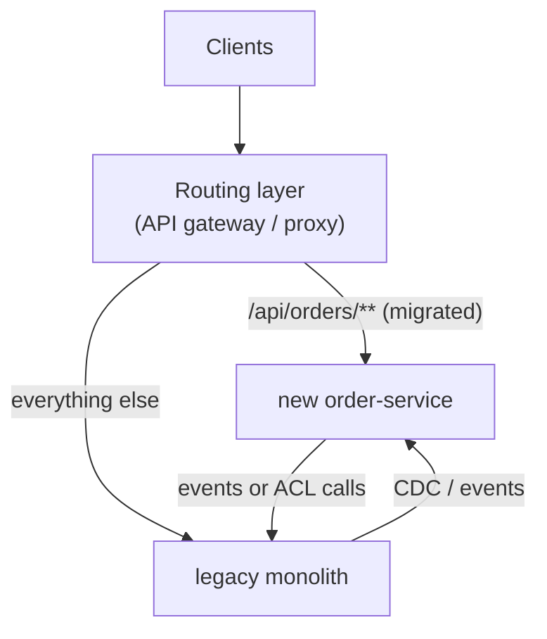

# Microservice Patterns Catalogue — Interview Q&A

**What this covers:** every microservice pattern an interviewer is likely to name, in one
map — problem → pattern → tool → where it's answered. Patterns covered in files 19–23 get a
line and a link; the rest are answered here: decomposition, **strangler fig**,
anti-corruption layer, sidecar, **CQRS**, **event sourcing**, **contract testing**, shared
libraries, multi-tenancy and the **anti-patterns**.

Start with [Q1](#1-the-pattern-map); [Q18](#18-what-patterns-did-you-use-a-model-answer) is
a ready answer for "which patterns did you use?". Pattern names follow Chris Richardson's
microservices.io catalogue and Fowler / Newman / Evans.

## Weight legend

| Mark | Meaning |
| --- | --- |
| ★★★ | Asked in almost every round — know the detail |
| ★★ | Asked often — know the short answer and one example |
| ★ | Occasional — two or three lines |

## Contents

| # | Question | Weight | One-line answer |
| --- | --- | --- | --- |
| 1 | [The pattern map](#1-the-pattern-map) | ★★★ | Problem → pattern → tool → where answered |
| 2 | [Decomposition patterns](#2-decomposition-by-business-capability-and-by-subdomain) | ★★ | Split by capability or DDD subdomain |
| 3 | [Strangler fig](#3-strangler-fig-migrating-a-monolith) | ★★★ | Route piece by piece from the monolith to new services |
| 4 | [Anti-corruption layer](#4-anti-corruption-layer) | ★★ | A translator so a legacy model doesn't leak in |
| 5 | [Sidecar and ambassador](#5-sidecar-and-ambassador) | ★★ | Helper container next to the app |
| 6 | [Gateway, BFF, aggregation](#6-api-gateway-backend-for-frontend-and-gateway-aggregation) | ★★ | One front door; one API per client; merge calls |
| 7 | [API composition](#7-api-composition) | ★★ | Query several services, join in memory |
| 8 | [CQRS](#8-cqrs) | ★★★ | Separate write model from event-fed read models |
| 9 | [Event sourcing](#9-event-sourcing) | ★★ | Store the events, derive the state |
| 10 | [Saga, outbox, idempotent consumer](#10-saga-transactional-outbox-and-idempotent-consumer) | ★★★ | Consistency without distributed transactions |
| 11 | [Health check API, externalized config](#11-health-check-api-and-externalized-configuration) | ★★ | Probes tell the platform; config from outside the image |
| 12 | [Consumer-driven contract testing](#12-consumer-driven-contract-testing) | ★★★ | Consumers' expectations become the provider's tests |
| 13 | [Shared libraries vs duplication](#13-shared-libraries-vs-duplication) | ★★ | Share technical starters, not domain models |
| 14 | [Anti-patterns](#14-anti-patterns-distributed-monolith-shared-database-chatty-services) | ★★★ | Distributed monolith, shared DB, chatty sync chains |
| 15 | [Observability patterns](#15-observability-patterns) | ★ | Log aggregation, tracing, metrics, audit |
| 16 | [Deployment patterns](#16-deployment-patterns) | ★★ | Container per service; blue-green, canary, flags |
| 17 | [Multi-tenancy patterns](#17-multi-tenancy-patterns) | ★ | Silo, bridge, pool |
| 18 | [Model answer: "which patterns?"](#18-what-patterns-did-you-use-a-model-answer) | ★★★ | Name 6–8, tell one story with a number |

---

## 1. The pattern map

**Weight:** ★★★

Group patterns by the **problem** and you can explain any of them.

**Splitting and migrating**

| Problem | Pattern | Tool | Where |
| --- | --- | --- | --- |
| Where are the boundaries? | Decompose by capability / subdomain | DDD, event storming | [Q2](#2-decomposition-by-business-capability-and-by-subdomain) |
| Leave a monolith safely | Strangler fig | Gateway routing, CDC | [Q3](#3-strangler-fig-migrating-a-monolith) |
| Legacy model leaking in | Anti-corruption layer | Adapter | [Q4](#4-anti-corruption-layer) |

**Communication**

| Problem | Pattern | Tool | Where |
| --- | --- | --- | --- |
| One entry point | API gateway | Spring Cloud Gateway, Kong | [21 Q1](21_API_Gateway_Rate_Limiting_Resilience_QA.md#1-what-an-api-gateway-does) |
| Different client shapes | BFF | Spring Boot BFF, GraphQL | [19 Q13](19_Microservices_Request_Flow_Architecture_QA.md#13-backend-for-frontend-bff) |
| Finding instances | Service discovery | K8s DNS, Eureka | [19 Q9](19_Microservices_Request_Flow_Architecture_QA.md#9-service-discovery) |
| Decoupled reactions | Publish-subscribe events | Kafka, SNS, Pub/Sub | [22 Q1](22_Kafka_Event_Driven_Microservices_QA.md#1-why-event-driven-and-which-broker) |
| Long work over HTTP | Async request-reply | 202 + status URL | [19 Q20](19_Microservices_Request_Flow_Architecture_QA.md#20-long-running-operations) |

**Data**

| Problem | Pattern | Tool | Where |
| --- | --- | --- | --- |
| Independent schemas | Database per service | Schema per service | [23 Q13](23_Caching_Data_Management_QA.md#13-database-per-service) |
| Queries across services | API composition / CQRS | BFF; Kafka + read store | [Q7](#7-api-composition), [Q8](#8-cqrs) |
| Transaction across services | Saga | Kafka, Temporal | [22 Q10](22_Kafka_Event_Driven_Microservices_QA.md#10-saga-choreography-vs-orchestration) |
| DB write + publish atomically | Transactional outbox | Outbox + Debezium | [22 Q5](22_Kafka_Event_Driven_Microservices_QA.md#5-the-dual-write-problem-and-the-transactional-outbox) |
| Duplicate messages | Idempotent consumer | Processed-ids table | [22 Q9](22_Kafka_Event_Driven_Microservices_QA.md#9-idempotent-consumers) |
| Audit, rebuildable state | Event sourcing | Axon, EventStoreDB | [Q9](#9-event-sourcing) |
| Read load | Cache-aside | Redis, Caffeine | [23 Q4](23_Caching_Data_Management_QA.md#4-cache-aside-read-through-write-through-write-behind) |

**Reliability**

| Problem | Pattern | Tool | Where |
| --- | --- | --- | --- |
| Failing dependency | Circuit breaker | Resilience4j | [21 Q12](21_API_Gateway_Rate_Limiting_Resilience_QA.md#12-how-a-circuit-breaker-works) |
| One dependency eats all threads | Bulkhead | Resilience4j | [21 Q16](21_API_Gateway_Rate_Limiting_Resilience_QA.md#16-bulkhead) |
| Transient glitches | Retry + backoff | Resilience4j, Spring 7 | [21 Q15](21_API_Gateway_Rate_Limiting_Resilience_QA.md#15-retrying-safely) |
| Overload / abuse | Rate limiter | SCG + Redis | [21 Q9](21_API_Gateway_Rate_Limiting_Resilience_QA.md#9-distributed-rate-limiting-with-redis) |
| Safe write retries | Idempotency key | `Idempotency-Key` | [19 Q17](19_Microservices_Request_Flow_Architecture_QA.md#17-making-post-apis-idempotent) |

**Operations and delivery**

| Problem | Pattern | Tool | Where |
| --- | --- | --- | --- |
| Is the instance OK? | Health check API | Actuator + probes | [Q11](#11-health-check-api-and-externalized-configuration) |
| One image, many envs | Externalized config | ConfigMaps, secret stores | [19 Q10](19_Microservices_Request_Flow_Architecture_QA.md#10-configuration-across-environments) |
| Follow a request | Distributed tracing | OpenTelemetry | [26 Q6](26_Observability_Logging_Monitoring_Tracing_QA.md#6-distributed-tracing-with-micrometer-and-opentelemetry) |
| Logs from 200 pods | Log aggregation | Fluent Bit → Loki/OpenSearch | [26 Q16](26_Observability_Logging_Monitoring_Tracing_QA.md#16-shipping-logs-from-kubernetes) |
| Breaking another team's API | Consumer-driven contracts | Spring Cloud Contract, Pact | [Q12](#12-consumer-driven-contract-testing) |
| Releasing safely | Canary, blue-green, flags | Argo Rollouts, Unleash | [25 Q12](25_CI_CD_Build_Deploy_QA.md#12-deployment-strategies-and-feature-flags) |

---

## 2. Decomposition by business capability and by subdomain

**Weight:** ★★

**By capability:** split along what the business *does* — ordering, payments, shipping.
**By subdomain (DDD):** find **bounded contexts** where a term has one meaning and make each
a service. Vocabulary to use: **bounded context** ("product" in catalog ≠ in shipping);
**aggregate** (objects changed in one transaction, e.g. `Order` + lines); **core vs
generic subdomain** (build pricing, buy email). Rule: one aggregate's transaction never
spans services — things that must change atomically live together.

---

## 3. Strangler fig: migrating a monolith

**Weight:** ★★★

**Short answer:** No big-bang rewrite. Put a **routing layer** in front of the monolith and
move **one capability at a time** to a new service; the router sends migrated routes to the
new service and everything else to the monolith, until the monolith is gone.



**Steps:** pick a seam with clear boundaries and real value → route it through the gateway
(reads first, or a % of traffic) → give the new service its own tables, kept in sync during
transition (Debezium CDC from the monolith DB) → switch writes → delete the old code →
repeat. **Risks:** sync bugs between old and new; never finishing the hard core. Track
progress by monolith endpoints retired.

---

## 4. Anti-corruption layer

**Weight:** ★★

A translation layer between your service and a system with a messy or foreign model
(legacy ERP, third party), so that model doesn't spread into your code. The ERP returns
`ORD_STAT_CD = "S3"`; the adapter turns it into `OrderStatus.SHIPPED`, and nothing else in
the service knows ERP codes — replacing the ERP changes only the adapter. It can be a
package (hexagonal adapter) or a small shared service.

---

## 5. Sidecar and ambassador

**Weight:** ★★

A **sidecar** is a helper container **in the same pod**, sharing network and volumes, adding
cross-cutting features without app changes; an **ambassador** is a sidecar proxying
outbound calls. Examples: Envoy (mesh mTLS, retries), Fluent Bit (log shipping), OTel
Collector, Cloud SQL Auth Proxy, Vault Agent. Kubernetes 1.33 made **native sidecars**
stable ([14 Q5](14_Kubernetes_QA.md#5-init-containers-and-sidecars)); Istio **ambient mode**
removes per-pod sidecars.

---

## 6. API gateway, Backend for Frontend and gateway aggregation

**Weight:** ★★

**Gateway** = generic front door (auth, limits, routing). **BFF** = one API per client type,
owned by the client team. **Aggregation** = the gateway/BFF calls several services in
parallel and returns one response; keep business rules out, timeout each call, and return
partial data if a non-critical call fails. → [21 Q1](21_API_Gateway_Rate_Limiting_Resilience_QA.md#1-what-an-api-gateway-does),
[19 Q13](19_Microservices_Request_Flow_Architecture_QA.md#13-backend-for-frontend-bff)

---

## 7. API composition

**Weight:** ★★

A composer (BFF, gateway or query service) calls each data owner's API — **in parallel**
where independent — and joins in memory; optional parts get a timeout and a default
(`CompletableFuture.completeOnTimeout(Shipment.unknown(), 300, MILLISECONDS)`). Simple and
always fresh, but latency, partial failure and big in-memory joins limit it. When you need
**filters across services** ("orders over ₹10,000 shipped to Pune last week"), switch to a
CQRS read model.

---

## 8. CQRS

**Weight:** ★★★

**Short answer:** **Command Query Responsibility Segregation** separates the model that
**changes** data (validated, normalised) from models that **read** it (denormalised per
screen). In microservices, a read-side service **consumes events** from several services
into a ready-to-query store (Postgres table, OpenSearch index, Redis).

```java
@KafkaListener(topics = "order-events", groupId = "order-history-view")
void project(OrderEvent event) {                     // sealed interface, Java 21 switch
    switch (event) {
        case OrderPlaced e    -> views.insert(OrderHistoryRow.from(e));
        case OrderShipped e   -> views.markShipped(e.orderId(), e.shippedAt());
        case OrderCancelled e -> views.markCancelled(e.orderId());
    }
}
```

| Benefit | Cost |
| --- | --- |
| Fast single-table queries per screen | **Eventual consistency** (ms–s lag) |
| Reads and writes scale independently | Projections to maintain; duplicates/reordering to handle |
| Joins data from many services | Replay must be possible to rebuild views |

Not for simple CRUD. Read-your-own-writes handling: [23 Q14](23_Caching_Data_Management_QA.md#14-querying-data-owned-by-several-services).

---

## 9. Event sourcing

**Weight:** ★★

**Short answer:** Store the **sequence of events** that happened to an entity in an
append-only **event store**, not its current state; state = replay (with **snapshots**).
You get a perfect audit trail, time travel and new read models by replay.

| Event-driven architecture | Event sourcing |
| --- | --- |
| Services **publish** events to communicate | Events **are** the source of truth |
| State in normal tables | State derived from events |
| Common | Rare — ledgers, trading, insurance, regulated audit |

**Costs:** needs CQRS projections to query; old events must stay readable forever
(upcasting); GDPR deletion is hard (crypto-shredding); unfamiliar to most teams. Tools:
Axon Framework, EventStoreDB. Honest answer: "We were event-driven with Kafka, not
event-sourced — state lived in Postgres."

---

## 10. Saga, transactional outbox and idempotent consumer

**Weight:** ★★★

These three appear together — they replace the distributed transaction:

| Pattern | Solves | Detail |
| --- | --- | --- |
| **Saga** | Business transaction across services → local transactions + compensations | [22 Q10](22_Kafka_Event_Driven_Microservices_QA.md#10-saga-choreography-vs-orchestration) |
| **Transactional outbox** | DB write and event publish must both happen | [22 Q5](22_Kafka_Event_Driven_Microservices_QA.md#5-the-dual-write-problem-and-the-transactional-outbox) |
| **Idempotent consumer** | At-least-once delivery creates duplicates | [22 Q9](22_Kafka_Event_Driven_Microservices_QA.md#9-idempotent-consumers) |

**Why not 2PC/XA?** Kafka and most cloud services don't support it, it holds locks across
the network, and the coordinator is a single point of failure.

---

## 11. Health check API and externalized configuration

**Weight:** ★★

**Health check API:** `/actuator/health/liveness` ("restart me") and `/readiness` ("no
traffic now"); keep dependencies **out of liveness** so a DB outage doesn't restart every
pod ([07 Q6](07_Spring_Boot_Actuator_QA.md#6-liveness-and-readiness-probes),
[14 Q16](14_Kubernetes_QA.md#16-liveness-readiness-and-startup-probes)).
**Externalized config:** one image for every environment; config and secrets from outside
([19 Q10](19_Microservices_Request_Flow_Architecture_QA.md#10-configuration-across-environments)).

---

## 12. Consumer-driven contract testing

**Weight:** ★★★

**Short answer:** Each **consumer** writes down exactly what it sends and expects (a
**contract**). The **provider** runs the contracts as tests in its own build, so a breaking
change **fails the provider's CI** before deploy. Consumers test against **stubs generated
from the same contracts** — no shared, flaky end-to-end environment.

```yaml
# inventory-service: src/test/resources/contracts/shouldReserveStock.yml (Spring Cloud Contract)
request:
  method: POST
  url: /api/inventory/reservations
  body: { sku: "SKU-1", quantity: 2 }
response:
  status: 201
  body: { status: "RESERVED" }
```

The provider's plugin **generates tests** against the real controller and publishes a
**stubs jar**; the consumer runs `@AutoConfigureStubRunner(ids =
"com.shop:inventory-service:+:stubs:8090")` and calls the stub.

| | Spring Cloud Contract | Pact |
| --- | --- | --- |
| Contract lives in | Provider repo | Consumer, shared via Pact Broker |
| Languages | JVM-centred | Many |
| Release gate | Provider build | `can-i-deploy` |

End-to-end tests alone are slow, flaky and find breaks after the fact.

---

## 13. Shared libraries vs duplication

**Weight:** ★★

Share **technical** code as internal Spring Boot **starters** — error format, security
defaults, logging/tracing setup, outbox helpers. **Never share domain models or entities**:
a shared `Order` jar couples every service's release to one change. For API DTOs, generate
clients from the provider's **OpenAPI**, or let each consumer define only the fields it
reads (tolerant reader). Version starters with semver and roll upgrades through a platform
BOM.

---

## 14. Anti-patterns: distributed monolith, shared database, chatty services

**Weight:** ★★★

**Short answer:** The most common failure is a **distributed monolith** — services that
can't be deployed, scaled or changed independently: all the cost of distribution, none of
the benefit.

| Anti-pattern | Symptom | Fix |
| --- | --- | --- |
| **Distributed monolith** | Releases need 5 services deployed in order | Redraw boundaries; async events; contracts |
| **Shared database** | A column rename breaks three teams | Database per service |
| **Chatty services** | One page = 40 internal calls | Coarser APIs, batch endpoints, local copies via events |
| **Long sync chains** | A → B → C → D → E | Async, cache, parallelise ([19 Q26](19_Microservices_Request_Flow_Architecture_QA.md#26-why-long-synchronous-chains-are-dangerous)) |
| **Nano-services** | A service per table | Merge into capability-sized services |
| **Shared domain library** | Everyone redeploys for `common-model` | Share only technical starters |
| **Smart gateway** | Business rules in the gateway | Keep it generic |
| **Microservices first** | 4 engineers, 15 services | Modular monolith first ([19 Q4](19_Microservices_Request_Flow_Architecture_QA.md#4-monolith-vs-microservices)) |

Test to quote: "Can my team deploy our service on a Tuesday afternoon without talking to
anyone? If not, there's coupling to remove."

---

## 15. Observability patterns

**Weight:** ★

Log aggregation, distributed tracing, application metrics (RED), health check API, audit
logging (durable business record), exception tracking — all in
[26](26_Observability_Logging_Monitoring_Tracing_QA.md).

---

## 16. Deployment patterns

**Weight:** ★★

One service per container/Deployment ([13](13_Docker_QA.md), [14](14_Kubernetes_QA.md));
rolling updates ([14 Q17](14_Kubernetes_QA.md#17-rolling-updates-and-rollbacks)); blue-green,
canary and feature flags ([25 Q12](25_CI_CD_Build_Deploy_QA.md#12-deployment-strategies-and-feature-flags));
serverless functions ([11 Q1](11_AWS_Serverless_Containers_DevOps_QA.md#1-how-lambda-works-and-its-limits)).

---

## 17. Multi-tenancy patterns

**Weight:** ★

| Model | Isolation | Cost | Tool |
| --- | --- | --- | --- |
| **Silo** — DB per tenant | Strongest | Highest | Routing `DataSource` |
| **Bridge** — schema per tenant | Medium | Medium | Hibernate schema multi-tenancy |
| **Pool** — shared tables + `tenant_id` | Weakest | Lowest | Hibernate `@TenantId`, Postgres row-level security |

The tenant comes from a JWT claim and filters **every** query in one central place.

---

## 18. What patterns did you use: a model answer

**Weight:** ★★★

Name 6–8 grouped by problem, then **expand one** with a story and a number:

> "Clients came in through an **API gateway** (Spring Cloud Gateway), with a **BFF** for
> mobile. Each service had its **own database**. Checkout was a **choreographed saga** over
> Kafka with compensations like refunds; events went out through a **transactional
> outbox** with Debezium, and every consumer was **idempotent** on event id. Order history
> was a **CQRS read model**. Sync calls had Resilience4j **circuit breakers, bulkheads and
> retries**. We moved checkout out of the monolith with the **strangler fig** pattern.
>
> The one I'd highlight is the outbox: before it, about 1 in 20,000 orders had no
> confirmation event because publishing happened after the commit and sometimes failed.
> After the outbox that went to zero, and replays became trivial."

For each pattern you name, be ready for: why it, what you rejected, what went wrong, and
which metric shows it works.

---

## Sources

- [microservices.io pattern language](https://microservices.io/patterns/) (Chris Richardson)
- Martin Fowler — [StranglerFigApplication](https://martinfowler.com/bliki/StranglerFigApplication.html), [CQRS](https://martinfowler.com/bliki/CQRS.html)
- Eric Evans, *Domain-Driven Design*
- Kubernetes native sidecars stable in 1.33 — see [14_Kubernetes_QA.md](14_Kubernetes_QA.md#sources)
