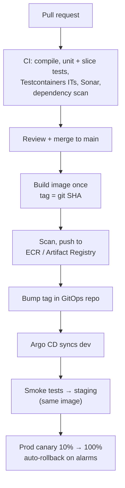

# CI/CD: Building and Deploying Spring Boot Microservices — Interview Q&A

**What this covers:** how a Spring Boot service goes from pull request to production at
most product companies — pipeline stages, **GitHub Actions** and **Jenkins**, which tests
run where, quality gates, building the image, "build once, promote everywhere", **Helm +
Argo CD (GitOps)**, canary/blue-green and feature flags, DB migrations, **OIDC instead of
cloud keys**, rollback, supply-chain security, and where Spring Boot runs on AWS and GCP.

Image details: [13_Docker_QA.md](13_Docker_QA.md); Helm/GitOps basics: [14](14_Kubernetes_QA.md)
(Q17, Q26, Q27); the AWS pipeline view: [11 Q13](11_AWS_Serverless_Containers_DevOps_QA.md#13-a-cicd-pipeline-on-aws).
**Facts:** action versions (`checkout@v7`, `setup-java@v6`, `configure-aws-credentials@v6`)
checked on their GitHub release pages on 7 Oct 2026 — they move fast, re-check before copying.

## Weight legend

| Mark | Meaning |
| --- | --- |
| ★★★ | Asked in almost every round — know the detail |
| ★★ | Asked often — know the short answer and one example |
| ★ | Occasional — two or three lines |

## Contents

| # | Question | Weight | One-line answer |
| --- | --- | --- | --- |
| 1 | [Walk me through your pipeline](#1-walk-me-through-your-cicd-pipeline) | ★★★ | PR checks → merge → image → GitOps deploy → promote |
| 2 | [CI vs delivery vs deployment](#2-ci-vs-continuous-delivery-vs-continuous-deployment) | ★★ | Integrate often; always releasable; release automatically |
| 3 | [CI/CD tools companies use](#3-cicd-tools-companies-use) | ★★★ | GitHub Actions / Jenkins / GitLab CI + Argo CD |
| 4 | [Trunk-based vs GitFlow](#4-trunk-based-development-vs-gitflow) | ★★★ | Short-lived branches to main, behind feature flags |
| 5 | [GitHub Actions example](#5-a-github-actions-workflow-for-a-spring-boot-service) | ★★★ | Test on PR; image, scan, push, bump GitOps on main |
| 6 | [Jenkins example](#6-a-jenkins-pipeline) | ★★ | Declarative `Jenkinsfile` with a quality gate |
| 7 | [Tests in the pipeline](#7-which-tests-run-where) | ★★★ | Unit + slice + Testcontainers on every PR; e2e/perf later |
| 8 | [Quality gates](#8-quality-gates-coverage-and-static-analysis) | ★★ | Sonar gate on new code, JaCoCo coverage |
| 9 | [Building the image](#9-building-the-image-dockerfile-jib-or-buildpacks) | ★★★ | Multi-stage Dockerfile, Jib, or Buildpacks |
| 10 | [Build once, promote](#10-build-once-tag-by-commit-promote-everywhere) | ★★★ | Same digest everywhere; tag = git SHA |
| 11 | [Helm and Argo CD](#11-deploying-to-kubernetes-with-helm-and-argo-cd) | ★★★ | Values per env in Git; Argo CD syncs the cluster |
| 12 | [Deployment strategies, flags](#12-deployment-strategies-and-feature-flags) | ★★★ | Rolling, blue-green, canary with metric analysis |
| 13 | [DB migrations in the pipeline](#13-database-migrations-in-the-pipeline) | ★★ | Backward-compatible, before rollout, tested in CI |
| 14 | [Cloud credentials in CI](#14-cloud-credentials-in-ci-oidc-not-keys) | ★★★ | OIDC federation; no stored keys |
| 15 | [Rolling back](#15-rolling-back) | ★★★ | Revert in Git, abort the canary, or flip the flag |
| 16 | [Versioning and releases](#16-versioning-and-releases) | ★★ | Services: commit SHA; libraries/APIs: semver |
| 17 | [Supply chain security](#17-supply-chain-security-sbom-scanning-and-signing) | ★★ | SBOM, CVE scans, signed images, pinned deps |
| 18 | [Where Spring Boot runs](#18-where-spring-boot-runs-eks-gke-ecs-cloud-run) | ★★★ | EKS/GKE for platforms; ECS Fargate/Cloud Run for simplicity |
| 19 | [Infrastructure as code](#19-infrastructure-as-code-from-a-developers-view) | ★★ | Terraform PRs: plan in review, apply on merge |
| 20 | [Environments and promotion](#20-environments-and-promotion) | ★★ | dev → staging → prod; DORA metrics |
| 21 | [Monorepo vs polyrepo](#21-monorepo-vs-polyrepo) | ★ | Shared tooling vs independent pipelines |
| 22 | [Speeding up pipelines](#22-speeding-up-a-slow-pipeline) | ★★ | Cache, parallelise, build only what changed |
| 23 | [Scenario: green pipeline, broken prod](#23-scenario-the-pipeline-was-green-but-production-broke) | ★★ | Roll back; find the prod-only difference |
| 24 | [Scenario: pods never ready](#24-scenario-the-new-pods-never-become-ready) | ★★ | Events, probes, logs; the rollout stalls safely |

---

## 1. Walk me through your CI/CD pipeline

**Weight:** ★★★

**Short answer:** "Every PR runs build, unit/slice/Testcontainers tests, static analysis and
a dependency scan; it merges only when green and reviewed. On main, CI builds **one image**
tagged with the **commit SHA**, scans and pushes it, and bumps the tag in our **GitOps
repo**; **Argo CD** deploys to dev. After smoke tests it's promoted to staging, then to prod
as a **canary** with automatic rollback on error alarms."



What scores: image built **once**; real-infra tests via **Testcontainers**; **no cloud
keys** in CI; deploys **declarative** (Git) and **reversible**; prod rollout gated by metrics.

---

## 2. CI vs continuous delivery vs continuous deployment

**Weight:** ★★

**CI:** everyone merges small changes often; each is built and tested. **Continuous
delivery:** every green change is *releasable*; prod is a button/approval. **Continuous
deployment:** every green change goes to prod automatically. Most companies do delivery
with an approval; mature teams with strong canary analysis do deployment.

---

## 3. CI/CD tools companies use

**Weight:** ★★★

| Job | Common choices |
| --- | --- |
| CI | **GitHub Actions**, **Jenkins** (still everywhere in enterprises), GitLab CI, Azure DevOps |
| CD to Kubernetes | **Argo CD**, Flux (GitOps); Spinnaker, Harness |
| Progressive delivery | Argo Rollouts, Flagger |
| Cloud-native | CodePipeline/CodeBuild; Cloud Build/Cloud Deploy |
| Artifacts / images | Nexus, Artifactory, CodeArtifact; ECR, Artifact Registry, GHCR |
| Code quality | SonarQube, CodeQL |

Say the split: "Jenkins for CI, Argo CD for CD — CI never had cluster credentials; it only
committed to the GitOps repo."

---

## 4. Trunk-based development vs GitFlow

**Weight:** ★★★

**Trunk-based** — branches live hours to a day or two, merge to `main` behind feature
flags, `main` always deployable — is what CI/CD teams use. **GitFlow** — long-lived
`develop`/`release/*`/`hotfix/*` — suits scheduled releases (mobile, installed software)
but means big, risky merges. PR rules: required checks, a reviewer, up to date with main,
squash merge.

---

## 5. A GitHub Actions workflow for a Spring Boot service

**Weight:** ★★★

The critical parts (setup steps trimmed):

```yaml
on: { pull_request: {}, push: { branches: [main] } }
permissions: { contents: read, id-token: write }     # id-token = OIDC to the cloud
env: { IMAGE: "1234.dkr.ecr.ap-south-1.amazonaws.com/order-service:${{ github.sha }}" }

jobs:
  test:
    steps:
      - uses: actions/checkout@v7
      - uses: actions/setup-java@v6
        with: { distribution: temurin, java-version: '21', cache: maven }
      - run: ./mvnw -B verify                       # unit + Testcontainers ITs + coverage
  image:
    needs: test
    if: github.ref == 'refs/heads/main'
    steps:
      - uses: aws-actions/configure-aws-credentials@v6
        with: { role-to-assume: "arn:aws:iam::123456789012:role/gha-order", aws-region: ap-south-1 }
      - run: ./mvnw -B -DskipTests jib:dockerBuild -Djib.to.image=$IMAGE   # tag = github.sha
      - run: docker run --rm -v /var/run/docker.sock:/var/run/docker.sock
             aquasec/trivy image --exit-code 1 --severity CRITICAL $IMAGE  # scan before push
      - run: docker push $IMAGE
      - run: ./ci/bump-gitops.sh dev "${{ github.sha }}"   # commit new tag; Argo CD deploys
```

**Explain:** `id-token: write` + `configure-aws-credentials` = no stored AWS keys ([Q14](#14-cloud-credentials-in-ci-oidc-not-keys));
tag = commit SHA; scan **before** push; CI never touches the cluster. Many teams pin actions
to a full commit SHA instead of `@v7`.

---

## 6. A Jenkins pipeline

**Weight:** ★★

```groovy
pipeline {
    agent { kubernetes { yamlFile 'ci/build-pod.yaml' } }     // agents are pods
    stages {
        stage('Build & test') { steps { sh './mvnw -B verify' } }
        stage('Quality gate') {
            steps {
                withSonarQubeEnv('sonar') { sh './mvnw -B sonar:sonar' }
                timeout(time: 5, unit: 'MINUTES') { waitForQualityGate abortPipeline: true }
            }
        }
        stage('Image') { when { branch 'main' }
            steps { sh './mvnw -B -DskipTests jib:build -Djib.to.image=$IMAGE' } }
        stage('Deploy dev') { when { branch 'main' }
            steps { sh 'ci/bump-gitops.sh dev "$GIT_COMMIT"' } }
    }
}
```

Talking points: pipeline as code in the repo; **shared libraries** for common stages across
50 services; pod agents (no snowflake servers); cloud access via IRSA/OIDC, not stored keys;
plugin sprawl is why teams move to GitHub Actions / GitLab CI.

---

## 7. Which tests run where

**Weight:** ★★★

| Test | Tools | When |
| --- | --- | --- |
| Unit | JUnit 5, Mockito, AssertJ | Every PR (seconds) |
| Slice | `@WebMvcTest`, `@DataJpaTest` | Every PR |
| Integration | `@SpringBootTest` + **Testcontainers** | Every PR (minutes) |
| Contract | Spring Cloud Contract, Pact | Every PR ([24 Q12](24_Microservice_Patterns_Catalogue_QA.md#12-consumer-driven-contract-testing)) |
| Security | Dependency, SAST, secret scans | Every PR |
| Smoke | REST Assured / curl on the deployed service | After each deploy |
| End-to-end | Playwright, API suites | Staging |
| Performance | Gatling, k6 | Nightly / before big releases |

Surefire runs `*Test`, Failsafe runs `*IT`; `./mvnw verify` runs both. Quarantine flaky
tests fast — "usually green" trains people to ignore red.

---

## 8. Quality gates: coverage and static analysis

**Weight:** ★★

SonarQube fails the PR on **new code** (e.g. coverage ≥ 80%, no new critical issues) so
legacy code doesn't block every change; JaCoCo produces the coverage report. Coverage is a
floor, not a goal — mutation testing (PIT) checks tests actually catch changes. Formatting
(Spotless, Checkstyle) runs first and fails fast.

---

## 9. Building the image: Dockerfile, Jib or Buildpacks

**Weight:** ★★★

| | Multi-stage Dockerfile | Jib | Buildpacks (`spring-boot:build-image`) |
| --- | --- | --- | --- |
| Docker daemon | Yes | **No** | Yes |
| Control | Full | Good | Opinionated |
| Layering | You write it (Boot `tools` jar mode) | Automatic | Automatic |

All give **layered** images — dependencies below your classes — so pushes are small. Small
non-root base images (Temurin JRE, distroless, Chainguard) mean fewer CVEs; set
`-XX:MaxRAMPercentage=75` for the container limit ([13](13_Docker_QA.md)). GraalVM **native
images** give ~100 ms startup at the cost of long builds and reflection config.

---

## 10. Build once, tag by commit, promote everywhere

**Weight:** ★★★

Build the image **once** per commit and deploy that exact image (same **digest**) to every
environment — only config differs. Rebuilding per environment means prod runs something
never tested.

| Practice | Why |
| --- | --- |
| Tag = **git SHA** | Running image → exact commit |
| Never deploy `:latest` | It changes underneath you; rollbacks become guesses |
| Immutable tags (ECR setting) | A tag can't be overwritten |
| Deploy by digest | Strongest guarantee |

---

## 11. Deploying to Kubernetes with Helm and Argo CD

**Weight:** ★★★

**Short answer:** One shared **Helm chart** templates the Deployment, Service, HPA, PDB and
monitors; each service and environment has a **values file** in a **GitOps repo**; **Argo
CD** keeps the cluster equal to Git. CI changes the tag in Git; Argo CD applies it. Git is
the audit log and the rollback button.

```yaml
# deploy repo: apps/order-service/prod/values.yaml
image: { repository: 1234.dkr.ecr.ap-south-1.amazonaws.com/order-service, tag: 3f9c2a1b }
replicaCount: 3
resources: { requests: { cpu: 500m, memory: 1Gi }, limits: { memory: 1Gi } }
env: { SPRING_PROFILES_ACTIVE: prod, JAVA_TOOL_OPTIONS: "-XX:MaxRAMPercentage=75" }
autoscaling: { minReplicas: 3, maxReplicas: 12, targetCPU: 70 }
```

```yaml
# Argo CD Application (key fields)
spec:
  source: { repoURL: https://github.com/shop/deploy.git, path: charts/spring-service,
            helm: { valueFiles: [ ../../apps/order-service/prod/values.yaml ] } }
  destination: { server: https://kubernetes.default.svc, namespace: orders }
  syncPolicy: { automated: { prune: true, selfHeal: true } }   # undo manual kubectl edits
```

| Push CD (CI runs `helm`) | Pull GitOps (Argo CD / Flux) |
| --- | --- |
| CI holds cluster credentials | Cluster pulls; CI only writes Git |
| Drift unnoticed | Drift detected and reverted |
| Rollback = rerun an old job | Rollback = `git revert` |

Helm vs Kustomize: [14 Q26](14_Kubernetes_QA.md#26-helm-vs-kustomize).

---

## 12. Deployment strategies and feature flags

**Weight:** ★★★

| Strategy | Exposure | Rollback | Tooling |
| --- | --- | --- | --- |
| Rolling (K8s default) | Grows gradually, no metric gate | `rollout undo` | Deployment |
| Blue-green | Everyone at the switch | **Instant** (2× capacity briefly) | Argo Rollouts, ALB target groups |
| **Canary** | Small % first, gated by metrics | Automatic | Argo Rollouts, Flagger, mesh |
| Shadow | None — mirrored traffic, responses discarded | n/a | Istio/Envoy |

```yaml
strategy:                                   # Argo Rollouts canary
  canary:
    steps:
      - setWeight: 10
      - pause: { duration: 10m }
      - analysis: { templates: [ { templateName: error-rate-below-1-percent } ] }  # PromQL
      - setWeight: 50
```

**Feature flags** (LaunchDarkly, Unleash, AWS AppConfig, the **OpenFeature** API) separate
*deploy* from *release*: dark launches, % rollouts, kill switches. Remove flags once rolled
out — old flags are untested branches. Schema changes must suit old and new versions
([Q13](#13-database-migrations-in-the-pipeline)).

---

## 13. Database migrations in the pipeline

**Weight:** ★★

Migrations must be **backward compatible** (old pods run during rollout and after a
rollback), **tested in CI** on a real DB (Testcontainers), and run **before** new pods take
traffic.

| Where they run | Trade-off |
| --- | --- |
| App startup (`spring.flyway.enabled`) | Simple; a failed migration crash-loops every pod |
| **Pre-deploy Job** (Helm `pre-upgrade` / Argo CD `PreSync` hook) | Fails once, clearly, before rollout |

Never edit an applied migration (checksum failure — add a new one); test big-table
migrations for lock time; **rolling back code doesn't roll back the schema** — that's why
changes use expand → contract ([23 Q15](23_Caching_Data_Management_QA.md#15-zero-downtime-schema-migrations-with-flyway)).

---

## 14. Cloud credentials in CI: OIDC, not keys

**Weight:** ★★★

**Short answer:** No long-lived access keys in CI secrets. With **OIDC federation** the CI
issues a short-lived signed token describing the job (repo, branch, environment); the cloud
trusts that issuer and returns **temporary credentials** for a narrow role.

| CI → cloud | How |
| --- | --- |
| GitHub Actions → AWS | IAM OIDC provider; role trust condition on `sub` = `repo:shop/order-service:ref:refs/heads/main` |
| GitHub Actions → GCP | Workload Identity Federation + `google-github-actions/auth` |
| Jenkins on EKS → AWS | IRSA / Pod Identity on the agent pod |

Leaked keys are the most common cloud breach; OIDC tokens expire in minutes and can be
restricted to one repo **and branch**, so a fork's PR can't assume the prod role.
→ [12 Q18](12_AWS_Architecture_Practices_Scenarios_QA.md#18-scenario-access-keys-leaked-on-github)

---

## 15. Rolling back

**Weight:** ★★★

**Roll back first, investigate second.**

| Situation | Rollback |
| --- | --- |
| GitOps | `git revert` the tag change (or Argo CD rollback) |
| Plain Deployment | `kubectl rollout undo deployment/order-service` |
| Helm, no GitOps | `helm rollback order-service <rev>` |
| Canary | Abort (often automatic on failed analysis) |
| Feature problem | Flag off — fastest of all |

**Gotchas:** with Argo CD `selfHeal`, a manual `rollout undo` is **reverted back** — roll back
in Git. Code rollback works only if the schema change was compatible. Kafka messages the bad
version published aren't rolled back.
→ [12 Q19](12_AWS_Architecture_Practices_Scenarios_QA.md#19-scenario-a-deployment-broke-production)

---

## 16. Versioning and releases

**Weight:** ★★

Continuously deployed **services** are identified by **commit SHA**; **libraries/starters**
use **semver**; **APIs** carry their own version ([19 Q14](19_Microservices_Request_Flow_Architecture_QA.md#14-api-versioning-and-backward-compatibility)).
Release notes from conventional commits (release-please, semantic-release). Expose build
and git info in `/actuator/info` ([07 Q8](07_Spring_Boot_Actuator_QA.md#8-the-info-endpoint)).

---

## 17. Supply chain security: SBOM, scanning and signing

**Weight:** ★★

| Practice | Tools |
| --- | --- |
| SBOM per build | CycloneDX plugin; Boot `/actuator/sbom` ([07 Q17](07_Spring_Boot_Actuator_QA.md#17-the-sbom-endpoint)) |
| Dependency CVEs | Dependabot / Renovate, Snyk |
| Image CVEs | Trivy, Grype, registry scanning |
| Signing / provenance | Sigstore **cosign** (keyless via CI OIDC), SLSA, GitHub attestations |
| Enforce at deploy | Kyverno / Gatekeeper: only signed images from your registry |
| Dependency confusion | Resolve Maven via a private proxy (Nexus, Artifactory) |

The Log4Shell test — "how fast could you tell if you were affected?" — with stored SBOMs
it's a search; without them, days of grepping.

---

## 18. Where Spring Boot runs: EKS, GKE, ECS, Cloud Run

**Weight:** ★★★

| Platform | You manage | Choose when |
| --- | --- | --- |
| **EKS** | Nodes (or Auto Mode), add-ons, upgrades | Many services, platform team, K8s ecosystem |
| **GKE** Standard / **Autopilot** | Node pools / just pods | Same, on GCP |
| **ECS on Fargate** | Task definitions | AWS-only, fewer services, no K8s skills ([11 Q8](11_AWS_Serverless_Containers_DevOps_QA.md#8-ecs-vs-eks-fargate-vs-ec2)) |
| **Cloud Run** | The container | Request-driven, scale to zero, small teams |
| Lambda | Functions | Spiky event handlers (SnapStart for JVM cold starts) |

For the app, little changes between them: health endpoints, graceful shutdown, JVM memory
for the limit, config from env, logs to stdout ([14 Q37](14_Kubernetes_QA.md#37-running-a-spring-boot-app-well-on-kubernetes)).

---

## 19. Infrastructure as code from a developer's view

**Weight:** ★★

Cloud resources live in **Terraform** (or OpenTofu), CDK/CloudFormation or Pulumi — never
console clicks. Need a queue or Redis? Open a PR using the platform team's **modules**; the
pipeline posts `terraform plan` on the PR and applies on merge (Atlantis, Terraform Cloud,
a CI job); state is remote with locking. K8s-native alternatives: Crossplane, AWS ACK.
→ [11 Q12](11_AWS_Serverless_Containers_DevOps_QA.md#12-infrastructure-as-code)

---

## 20. Environments and promotion

**Weight:** ★★

Local (Testcontainers) → dev (auto on merge) → staging (prod-like data, same image) → prod
(approval or automatic canary); optionally ephemeral per-PR environments. **Promotion =
changing the image tag in the next environment's values**, often a PR after smoke tests.
**DORA metrics** — deployment frequency, lead time, change failure rate, time to restore —
quote yours ("~15 deploys a day, change failure rate under 5%").

---

## 21. Monorepo vs polyrepo

**Weight:** ★

**Polyrepo** (repo per service) gives independent pipelines and clear ownership — the common
setup. **Monorepo** eases cross-service refactors and shared tooling but needs
path-filtered, build-only-what-changed pipelines and good caching. Either way, services must
build and deploy independently.

---

## 22. Speeding up a slow pipeline

**Weight:** ★★

| Cause | Fix |
| --- | --- |
| Downloading dependencies | Maven cache, nearby artifact proxy |
| Sequential work | `./mvnw -T 1C`, parallel tests, split unit/IT jobs |
| Many Spring contexts | Reuse contexts; prefer slices; avoid unique `@MockitoBean` mixes |
| Container start-up | One shared Testcontainers instance per JVM |
| Rebuilding unchanged services | Path filters |
| Slow e2e on every PR | Move to post-deploy / nightly |

Target PR feedback under ~10 minutes — slower and people batch changes.

---

## 23. Scenario: the pipeline was green, but production broke

**Weight:** ★★

1. **Restore:** abort the canary / revert the GitOps commit / flag off; confirm errors drop.
2. **Find the prod-only difference:** prod-only config or secrets; data volume (a migration
   locking a big table, a new query plan); flag state; real traffic or old client versions;
   a third-party endpoint; resource limits under real load.
3. **Evidence:** errors and traces split by version (canary), the deploy diff, migration logs.
4. **Prevent:** the missing test; closer staging; canary analysis on the metric that caught
   it; synthetic checks on the key journey.

---

## 24. Scenario: the new pods never become ready

**Weight:** ★★

Argo CD shows `Progressing` → `Degraded`; old pods keep serving (a rolling update removes
old pods only when new ones are ready), and the rollout fails after
`progressDeadlineSeconds`.

| Check | Common causes |
| --- | --- |
| `kubectl describe pod` events | `ImagePullBackOff` (missing tag, registry permissions), `Pending` (no capacity, quota) |
| `kubectl logs --previous` | Missing env/secret, Flyway failure, bad config |
| Readiness failures | Wrong path/port, slow start without `startupProbe`, a failing dependency check |
| `OOMKilled` | Memory limit too low for the JVM settings |

Not obvious in minutes → revert. → [14 Q32–Q36](14_Kubernetes_QA.md#32-scenario-crashloopbackoff)

---

## Sources

Checked on 7 Oct 2026:

- [actions/checkout releases](https://github.com/actions/checkout/releases) — v7 current
- [actions/setup-java releases](https://github.com/actions/setup-java/releases) — v6 current
- [aws-actions/configure-aws-credentials releases](https://github.com/aws-actions/configure-aws-credentials/releases) — v6 current
- Practices (trunk-based development, GitOps, progressive delivery, DORA) are stable knowledge
