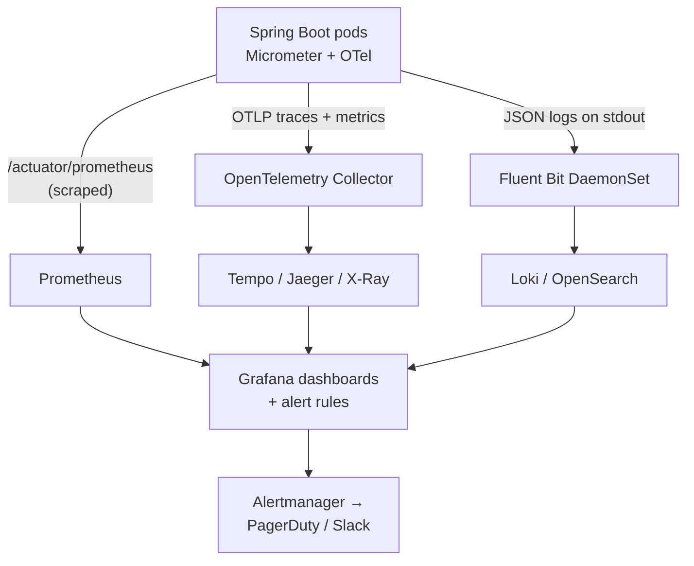
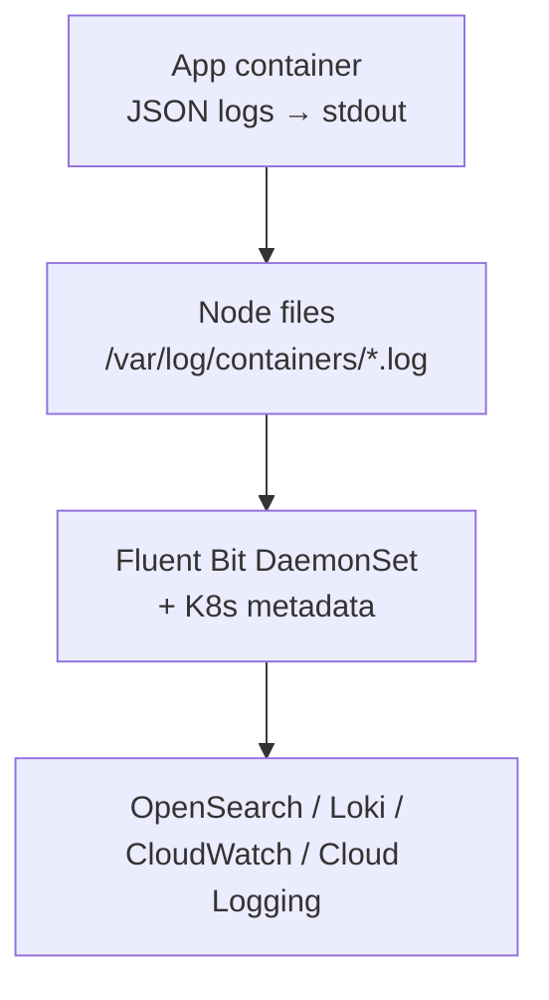

# Observability: Logging, Monitoring and Tracing — Interview Q&A

**What this covers:** how you find out what a microservices system is doing — and why it's
broken. **Logs, metrics and traces**, the stacks companies use (Prometheus + Grafana,
Loki/OpenSearch, OpenTelemetry, Tempo/Jaeger, Datadog, CloudWatch, Google Cloud
Operations), **JSON logging**, the **trace id in every log line**, **distributed tracing**
through Kafka and async code, RED/USE metrics, **SLO alerting**, JVM diagnostics, and two
debugging walk-throughs.

Actuator, Micrometer, cardinality and percentiles: [07](07_Spring_Boot_Actuator_QA.md)
(Q9–Q14); AWS tools: [11 Q15](11_AWS_Serverless_Containers_DevOps_QA.md#15-cloudwatch),
[08 Q12](08_Spring_Cloud_AWS_QA.md#12-observability-on-aws). **Facts:** property names checked
in the Boot 3.5.7 / 4.1.1 jars and the Boot 3.5 tracing reference; the Boot 4 OpenTelemetry
starter confirmed on spring.io (7 Oct 2026).

## Weight legend

| Mark | Meaning |
| --- | --- |
| ★★★ | Asked in almost every round — know the detail |
| ★★ | Asked often — know the short answer and one example |
| ★ | Occasional — two or three lines |

## Contents

| # | Question | Weight | One-line answer |
| --- | --- | --- | --- |
| 1 | [Logs, metrics, traces](#1-logs-metrics-and-traces) | ★★★ | That something's wrong, where, and exactly what |
| 2 | [Typical stacks](#2-the-tool-stacks-companies-use) | ★★★ | Prometheus + Grafana + Loki/OpenSearch + OTel/Tempo, or Datadog |
| 3 | [Structured JSON logging](#3-structured-json-logging-in-spring-boot) | ★★★ | `logging.structured.format.console` (Boot 3.4+) |
| 4 | [What to log](#4-what-to-log-and-at-which-level) | ★★★ | Business events and errors with ids; never secrets |
| 5 | [Trace id in every log line](#5-getting-the-trace-id-into-every-log-line) | ★★★ | Micrometer Tracing puts it in the MDC automatically |
| 6 | [Distributed tracing](#6-distributed-tracing-with-micrometer-and-opentelemetry) | ★★★ | Micrometer Tracing + OTel bridge → OTLP → Tempo/Jaeger/X-Ray |
| 7 | [Context across Kafka and async](#7-context-propagation-across-kafka-and-async-code) | ★★ | Observation on Kafka; wrap executors; Reactor auto mode |
| 8 | [Which metrics matter](#8-the-metrics-that-matter-red-use-golden-signals) | ★★★ | RED for services, USE for resources |
| 9 | [Custom business metrics](#9-custom-business-metrics) | ★★ | Counters/timers with low-cardinality tags |
| 10 | [SLI, SLO, SLA, error budget](#10-sli-slo-sla-and-error-budgets) | ★★ | Measure, target, promise; budget = allowed failure |
| 11 | [Alerting](#11-alerting-that-people-trust) | ★★★ | Page on user-visible symptoms and SLO burn rate |
| 12 | [OTel agent vs Micrometer](#12-opentelemetry-java-agent-vs-micrometer) | ★★ | Zero-code and broad vs Spring-native |
| 13 | [Service dashboard](#13-what-goes-on-a-service-dashboard) | ★★ | RED + dependencies + saturation + business KPI |
| 14 | [JVM diagnostics](#14-jvm-diagnostics-in-containers) | ★★ | Thread/heap dumps, JFR, GC — container gotchas first |
| 15 | [Sampling and cost](#15-sampling-cardinality-and-cost) | ★★ | Tail sampling; cardinality; log volume |
| 16 | [Shipping logs from K8s](#16-shipping-logs-from-kubernetes) | ★★ | stdout → node files → Fluent Bit DaemonSet → backend |
| 17 | [Errors, audit, frontend](#17-exception-tracking-audit-logs-and-frontend-monitoring) | ★ | Error grouping; durable audit; RUM and synthetics |
| 18 | [Debug: latency spike](#18-debugging-walkthrough-a-latency-spike) | ★★★ | Metrics → trace → slow span → logs → cause |
| 19 | [Debug: one bad pod](#19-debugging-walkthrough-errors-from-only-one-pod) | ★★ | Group by pod; compare; dump; replace |

---

## 1. Logs, metrics and traces

**Weight:** ★★★

**Short answer:** **Metrics** tell you **that** something is wrong and how much (error rate
4%, p99 2 s). **Traces** show **where** one request spent its time across services.
**Logs** say **exactly what** happened in one place. Go metrics → traces → logs, linked by
the **trace id**.

| | Metrics | Traces | Logs |
| --- | --- | --- | --- |
| Shape | Time series + tags | Tree of spans | Timestamped events |
| Cost | Cheap | Medium (sampled) | Expensive at volume |
| Spring source | Micrometer | Micrometer Tracing / OTel | SLF4J + Logback |
| Backend | Prometheus, CloudWatch, Datadog | Tempo, Jaeger, X-Ray | OpenSearch, Loki, Splunk |

Monitoring checks known failure modes; observability lets you ask **new** questions of the
data you already have.

---

## 2. The tool stacks companies use

**Weight:** ★★★

| Stack | Logs | Metrics | Traces |
| --- | --- | --- | --- |
| Open source "LGTM" | Loki | Prometheus / Mimir | Tempo (Grafana for all) |
| Elastic / OpenSearch | ELK / EFK | Prometheus | Jaeger / Elastic APM |
| Datadog, New Relic, Dynatrace, Splunk | All-in-one SaaS | | |
| AWS-native | CloudWatch Logs | CloudWatch, Managed Prometheus | X-Ray via ADOT |
| GCP-native | Cloud Logging (automatic for GKE) | Cloud Monitoring | Cloud Trace |

**The common thread:** **OpenTelemetry** is the vendor-neutral standard. Apps emit OTLP; an
**OTel Collector** batches, filters and forwards — switching vendors doesn't mean
re-instrumenting.



---

## 3. Structured JSON logging in Spring Boot

**Weight:** ★★★

**Short answer:** Log **JSON to stdout**, one object per line, so the platform indexes fields
(`level`, `traceId`, `orderId`) instead of regex-parsing text. Since **Boot 3.4** it's one
property: `ecs`, `logstash` or `gelf` (confirmed in Boot 3.5.7 metadata).

```yaml
logging.structured:                     # application-prod.yml; plain text stays local
  format.console: ecs
  ecs.service.name: order-service
```

```java
log.atInfo().addKeyValue("orderId", id).addKeyValue("amount", total).log("Order placed");
```

Output (one line in reality): `{"@timestamp":"…","log.level":"INFO","message":"Order
placed","traceId":"4bf92f…","orderId":"order-123","service.name":"order-service"}`.
Before 3.4 teams used `logstash-logback-encoder` — still common in older code. JSON also
keeps a multi-line stack trace as **one** event.

---

## 4. What to log, and at which level

**Weight:** ★★★

| Level | For |
| --- | --- |
| ERROR | Failed and needs attention — with the exception |
| WARN | Unexpected but handled (fallback used, retry needed) |
| INFO | Business events and lifecycle (order placed, started) |
| DEBUG | Developer detail — off in prod |

Good lines answer *who, what, which entity, outcome* (ids, operation, result, duration) —
the trace id is automatic. **Don't:** log secrets/PII ([20 Q25](20_Microservices_Security_AuthN_AuthZ_QA.md#25-logging-without-leaking-tokens-or-personal-data));
log-and-rethrow at every layer (log once where handled); log in tight loops; concatenate
strings (use `{}`). `/actuator/loggers` changes levels on **one** pod only
([07 Q13](07_Spring_Boot_Actuator_QA.md#13-changing-log-levels-at-runtime)).

---

## 5. Getting the trace id into every log line

**Weight:** ★★★

**Short answer:** With **Micrometer Tracing** on the classpath, Boot puts `traceId`/`spanId`
in the **MDC** per request and (since 3.2) prints them **by default** via
`logging.pattern.correlation`; JSON formats include them as fields. Search one trace id →
every line from every service for that request.

```text
INFO [order-service,4bf92f3577b34da6a3ce929d0e0e4736,00f067aa0ba902b7] Order placed
INFO [payment-service,4bf92f3577b34da6a3ce929d0e0e4736,a1b2c3d4e5f60718] Authorised
      (service, trace id — same in both, span id — one per hop)
```

| Trace id missing because… | Fix |
| --- | --- |
| Client built with `new` / `RestClient.create()` | Use Boot's auto-configured builders |
| Work moved to another thread | Context-propagating executors ([Q7](#7-context-propagation-across-kafka-and-async-code)) |
| Kafka hop | `observation-enabled` on template and listener |
| A proxy strips headers | Allow `traceparent` through |

Return the trace id in error responses so support tickets come with it.

---

## 6. Distributed tracing with Micrometer and OpenTelemetry

**Weight:** ★★★

**Short answer:** A **trace** is one request's whole journey; each hop is a **span** (start,
duration, tags, parent). Boot creates spans via **Micrometer Observation** for HTTP
in/out, Kafka, Redis and `@Observed` methods; the **OTel bridge** exports them over **OTLP**.
Context crosses services in the W3C **`traceparent`** header.

```yaml
# Boot 3.5: micrometer-tracing-bridge-otel + opentelemetry-exporter-otlp
management:
  tracing.sampling.probability: 0.1        # the default — only 10% of traces kept
  otlp.tracing.endpoint: http://otel-collector:4318/v1/traces
```

**Boot 4:** one `spring-boot-starter-opentelemetry` (OTel API + tracing bridge + OTLP
metrics); endpoint property `management.opentelemetry.tracing.export.otlp.endpoint`
(starter confirmed on spring.io; property in the 4.1.1 jar). Custom business spans:
`@Observed(name = "order.pricing")` with `management.observations.annotations.enabled=true`.

**Reading a trace:** the **widest span** (where time went), **gaps** (queueing, pool waits,
GC), **sequential calls that could be parallel**, the **same call repeated** (N+1 over HTTP).
At 10% sampling the failing request a customer reports is probably missing — see
[Q15](#15-sampling-cardinality-and-cost).

---

## 7. Context propagation across Kafka and async code

**Weight:** ★★

Trace context and MDC live in **ThreadLocals** — every thread or process hop must carry
them, or the trace breaks.

| Hop | How context travels |
| --- | --- |
| HTTP | Auto-configured `RestClient` / `WebClient` builders |
| Kafka | `spring.kafka.template/listener.observation-enabled=true` → `traceparent` header |
| `@Async`, Boot's executor | A `ContextPropagatingTaskDecorator` bean (Spring 6.1+) |
| Your own executor | `ContextExecutorService.wrap(executor)` (Micrometer Context Propagation) |
| Reactor / WebFlux | `spring.reactor.context-propagation=auto` |
| Outbox relay | Store `traceparent` in the row; restore when publishing |

Virtual threads are still threads — the same rules apply.

---

## 8. The metrics that matter: RED, USE, golden signals

**Weight:** ★★★

**Short answer:** Services: **RED** — Rate, Errors, Duration. Resources (CPU, pools,
disks): **USE** — Utilisation, Saturation, Errors. Google's **four golden signals**:
latency, traffic, errors, saturation.

| Signal | Spring Boot metric |
| --- | --- |
| Your API's rate/errors/latency | `http.server.requests` (tags `uri`, `status`, `outcome`) |
| Calls to others | `http.client.requests` |
| DB pool saturation | `hikaricp.connections.active`, **`…pending`** |
| JVM | `jvm.memory.used`, `jvm.gc.pause`, `jvm.threads.live` |
| Kafka | Listener timers + broker-side consumer lag |
| Circuit breakers | `resilience4j.circuitbreaker.state` |
| Container | CPU usage **and throttling**, memory vs limit, restarts |

**p99 across pods:** enable histograms
(`management.metrics.distribution.percentiles-histogram.http.server.requests=true`) and use
`histogram_quantile` — averaging per-pod percentiles is wrong ([07 Q11](07_Spring_Boot_Actuator_QA.md#11-percentiles-histograms-and-slos)).

```text
sum(rate(http_server_requests_seconds_count{status=~"5.."}[5m]))
  / sum(rate(http_server_requests_seconds_count[5m]))          # 5xx error ratio
```

---

## 9. Custom business metrics

**Weight:** ★★

Technical metrics say the service is up; **business metrics** say it's *working* — orders
per minute, payment success rate. They catch bugs that return 200 but drop the cart.

```java
registry.counter("orders.placed", "channel", channel, "payment", method).increment();
// channel ∈ {web, ios, android}, method ∈ {card, upi, cod} — small fixed sets only
```

**Cardinality rule:** tag values from a **small fixed set** — never order id, user id, email
or full URL. Each unique value is a new time series; millions crash Prometheus and multiply
SaaS bills ([07 Q10](07_Spring_Boot_Actuator_QA.md#10-custom-metrics-and-the-cardinality-trap)).

---

## 10. SLI, SLO, SLA and error budgets

**Weight:** ★★

| Term | Meaning | Example |
| --- | --- | --- |
| SLI | Measured ratio of good events | % checkouts OK in < 500 ms |
| SLO | Internal target over a window | 99.9% over 30 days |
| SLA | External promise with penalties | 99.5% monthly |
| Error budget | 100% − SLO | ≈ 43 min of "bad" per 30 days |

Budget left → ship features; budget burned → reliability work first. Keep SLA < SLO < actual,
so you're warned before breaking a contract.

---

## 11. Alerting that people trust

**Weight:** ★★★

**Short answer:** **Page on symptoms users feel** (errors, latency, SLO burn), not causes
(CPU 85%). Every page must be actionable, urgent and have a runbook; everything else is a
ticket or a dashboard.

| Page on | Don't page on |
| --- | --- |
| SLO **burn rate** too high | CPU 80% with latency fine |
| 5xx ratio over threshold for 5+ min | One pod restart |
| Kafka lag growing for 15+ min | One failed request |
| Breaker open 5+ min | Disk 70% (ticket it) |
| No orders for 10 min in business hours | Every WARN |

**Burn-rate alerts (Google SRE workbook):** page if **2% of the 30-day budget burns in 1 h**
(burn rate 14.4) or **5% in 6 h** (6); ticket if 10% burns in 3 days. Two windows avoid late
alerts and alerts that stay firing after recovery. Tools: Prometheus rules → Alertmanager →
PagerDuty/Slack; Grafana alerting; CloudWatch alarms; Datadog monitors.

---

## 12. OpenTelemetry Java agent vs Micrometer

**Weight:** ★★

| | OTel Java agent (`-javaagent`) | Micrometer (Spring-native) |
| --- | --- | --- |
| Code changes | None (bytecode instrumentation) | Dependencies + config |
| Coverage | Very broad (JDBC, clients, Kafka, Redis, gRPC…) | Spring-managed components |
| Startup / native image | Slower start; no native image | Minimal; works native |
| Fits | Platform teams, many languages | Spring teams wanting control |

Don't run both for traces (duplicate spans). Vendor agents (Datadog, New Relic) work like
the OTel agent.

---

## 13. What goes on a service dashboard

**Weight:** ★★

Top to bottom: **RED** per endpoint (rate, error %, p50/p95/p99) → **dependencies**
(outbound rate/errors/latency, breaker state, DB time, Kafka produce errors) →
**saturation** (Hikari pending, busy threads, CPU + throttling, memory vs limit, GC,
restarts) → **Kafka consumers** (lag, processing time, DLT) → **business KPI** → **deploy
markers** — half of all incidents start at one.

---

## 14. JVM diagnostics in containers

**Weight:** ★★

| Problem | Tool |
| --- | --- |
| Stuck threads, deadlock, exhausted pool | Thread dump: `/actuator/threaddump` or `jcmd 1 Thread.print` |
| Leak / OOM | Heap dump: `-XX:+HeapDumpOnOutOfMemoryError` to a volume; Eclipse MAT |
| CPU, allocation, locks | JFR: `jcmd 1 JFR.start duration=60s filename=/tmp/rec.jfr` |
| Flame graph | async-profiler |
| Distroless image, no tools | `kubectl debug -it <pod> --image=eclipse-temurin:21-jdk --target=app` |

**Check container causes first:** heap sized above the limit → kernel **OOMKilled** (not a
Java OOM) — use `-XX:MaxRAMPercentage`; **CPU throttling** from a low limit slows GC and
requests ([14 Q35](14_Kubernetes_QA.md#35-scenario-oomkilled-and-evicted)).

---

## 15. Sampling, cardinality and cost

**Weight:** ★★

- **Head sampling** (decide at the first hop, e.g. 10%) is cheap but random — interesting
  traces get dropped.
- **Tail sampling** (OTel Collector) decides after the trace ends: keep **all errors and
  slow traces** + a little of the rest — what most teams want.
- **Cardinality:** watch series per metric; drop high-cardinality labels at the collector.
- **Log volume** is the biggest bill: drop noisy DEBUG/health-check logs at the shipper,
  7–30 days hot then archive, and set retention on every CloudWatch log group (default is
  forever).

---

## 16. Shipping logs from Kubernetes

**Weight:** ★★

Apps write to **stdout**; the runtime writes it to node files; a **DaemonSet** agent —
**Fluent Bit** most often (or OTel Collector, Vector, Grafana Alloy) — tails them, adds pod
metadata and ships them.



Don't write log files inside the container — they vanish with the pod and fill its disk.
GKE sends stdout to Cloud Logging automatically; on EKS, Fluent Bit (Container Insights)
sends to CloudWatch or OpenSearch.

---

## 17. Exception tracking, audit logs and frontend monitoring

**Weight:** ★

**Exception tracking** (Sentry, Datadog Error Tracking) groups identical errors and shows
the release that introduced them. **Audit logs** are a durable business record ("who
refunded order 123") in a DB table or dedicated stream — not the sampled, expiring app log.
**Frontend:** RUM measures real users; **synthetic checks** run the checkout journey every
minute and alert before users complain.

---

## 18. Debugging walkthrough: a latency spike

**Weight:** ★★★

**"At 14:05 checkout p99 jumped from 400 ms to 6 s."**

1. **Scope (metrics):** all endpoints or one? all pods or one? anything change at 14:05 —
   deploy marker, traffic, a dependency's dashboard?
2. **Find the hop (traces):** slow `POST /checkout` traces show a 5.5 s
   `payment-service` span.
3. **One level down:** payment-service's own latency high? Its traces show a 5 s DB span.
   (Its latency normal? Then the time is lost **between** services — client pool waits,
   DNS, a sidecar.)
4. **Logs for that trace id:** `HikariPool-1 - Connection is not available, request timed
   out after 5000ms`.
5. **Root cause:** `hikaricp.connections.pending` rose at 14:05; a report query deployed at
   14:03 holds connections for 30 s → roll back, then fix the query and add a statement
   timeout.
6. **Close the loop:** an alert on pending connections > 0 for 2 min, plus a runbook entry.

Interviewers score the **method** (metrics → traces → logs), real metric names, and "roll
back first when a deploy correlates".

---

## 19. Debugging walkthrough: errors from only one pod

**Weight:** ★★

Error rate is 3% overall, but **grouped by pod**, one of eight shows 25%. Likely causes: a
bad node (network, disk, noisy neighbour); a **stale connection or cache** (e.g. to a Redis
primary that failed over); a leak or GC thrash after long uptime; config loaded before a
ConfigMap change; a pool held by stuck requests.

Compare it with a healthy pod (node, restarts, heap, GC, threads, logs filtered by pod);
take a **thread dump** before touching it; then delete it (or relabel it out of the Service
to inspect) so a fresh pod replaces it. Fix the root cause — probes that would catch it,
connection validation, the leak.

---

## Sources

Confirmed on 7 Oct 2026:

- Local Maven cache: Boot 3.5.7 (`logging.structured.*`); Boot 4.1.1
  (`management.tracing.sampling.probability`,
  `management.opentelemetry.tracing.export.otlp.endpoint`,
  `management.observations.annotations.enabled`); Micrometer context-propagation 1.2.1
  (`ContextExecutorService.wrap`)
- [Spring Boot 3.5 reference — Tracing](https://docs.spring.io/spring-boot/3.5/reference/actuator/tracing.html)
- [OpenTelemetry with Spring Boot (spring.io, Nov 2025)](https://spring.io/blog/2025/11/18/opentelemetry-with-spring-boot/)
- [Google SRE workbook — Alerting on SLOs](https://sre.google/workbook/alerting-on-slos/)
