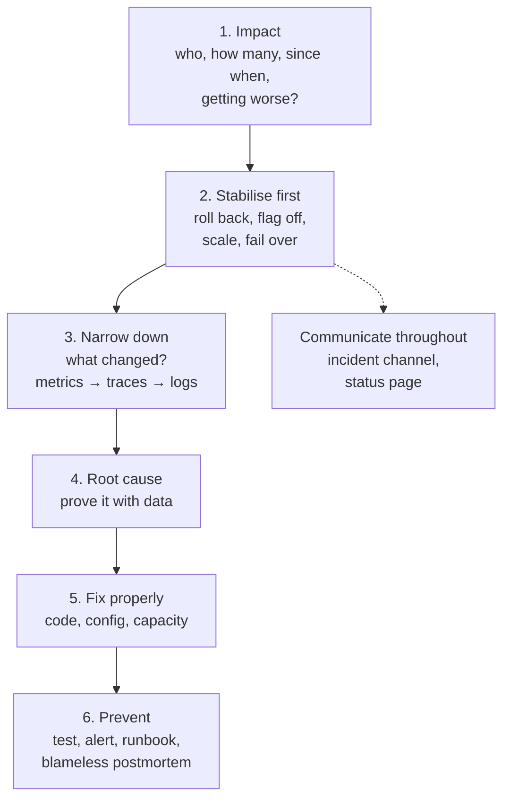

# Microservices Production Scenarios — Interview Q&A

**What this covers:** the "what would you do if…" questions senior backend rounds are built
around — real failures in Spring Boot microservices on Kubernetes, each answered in one
shape: **first checks → likely causes → fix now → prevent**. Ends with a model answer for
"tell me about an incident you handled".

Read [Q1](#1-how-to-answer-any-production-scenario) first — the method matters more than
any single answer. Concepts behind the scenarios: [19](19_Microservices_Request_Flow_Architecture_QA.md)
request flow, [20](20_Microservices_Security_AuthN_AuthZ_QA.md) security,
[21](21_API_Gateway_Rate_Limiting_Resilience_QA.md) resilience,
[22](22_Kafka_Event_Driven_Microservices_QA.md) Kafka, [23](23_Caching_Data_Management_QA.md)
data, [25](25_CI_CD_Build_Deploy_QA.md) delivery, [26](26_Observability_Logging_Monitoring_Tracing_QA.md)
observability. AWS scenarios: [12 Q13–Q19](12_AWS_Architecture_Practices_Scenarios_QA.md#13-scenario-the-site-is-slow-under-load);
Kubernetes: [14 Q32–Q36](14_Kubernetes_QA.md#32-scenario-crashloopbackoff). These are
standard failure modes, not version-specific facts.

## Weight legend

| Mark | Meaning |
| --- | --- |
| ★★★ | Asked in almost every round — know the full answer |
| ★★ | Asked often — know the causes and the fix |
| ★ | Occasional — a few lines |

## Contents

| # | Scenario | Weight | One-line answer |
| --- | --- | --- | --- |
| 1 | [How to answer any scenario](#1-how-to-answer-any-production-scenario) | ★★★ | Impact → stabilise → narrow down → root cause → prevent → communicate |
| 2 | [5xx spike after a deploy](#2-5xx-errors-spike-right-after-a-deploy) | ★★★ | Roll back first; then diff the release |
| 3 | [One slow service takes everything down](#3-one-slow-service-takes-down-the-whole-site) | ★★★ | Missing timeouts/breakers/bulkheads |
| 4 | [Customer charged twice](#4-a-customer-was-charged-twice) | ★★★ | Retried non-idempotent payment; idempotency keys + reconciliation |
| 5 | [Duplicate notifications](#5-customers-receive-duplicate-notifications) | ★★ | At-least-once + non-idempotent consumer |
| 6 | [Kafka lag growing](#6-kafka-consumer-lag-keeps-growing) | ★★ | One partition or all? Find the slow step |
| 7 | [Pods OOMKilled](#7-pods-are-oomkilled) | ★★★ | JVM total memory above the container limit |
| 8 | [High CPU](#8-cpu-is-pegged-on-one-service) | ★★ | GC thrash, hot loop, throttling — profile it |
| 9 | [DB pool exhausted](#9-connection-is-not-available-the-db-pool-is-exhausted) | ★★★ | Slow queries / long transactions hold connections |
| 10 | [Partner API returns 429](#10-a-partner-api-starts-returning-429) | ★★ | Throttle yourself to their quota; queue and back off |
| 11 | [Stale data after an update](#11-users-see-stale-data-after-an-update) | ★★ | Find the stale layer: cache, CDN, replica, projection |
| 12 | [Services disagree on state](#12-order-is-paid-in-one-service-and-pending-in-another) | ★★★ | An event was lost/failed; replay + reconcile |
| 13 | [Pods restart every few minutes](#13-pods-restart-every-few-minutes) | ★★★ | Liveness probe too strict or checking dependencies |
| 14 | [10x traffic next week](#14-a-sale-will-bring-10x-traffic-next-week) | ★★★ | Load test, fix the bottleneck, pre-scale, protect checkout |
| 15 | [Rename a column, no downtime](#15-rename-a-database-column-with-zero-downtime) | ★★ | Expand → migrate → contract |
| 16 | [Breaking API change](#16-you-must-make-a-breaking-api-change) | ★★ | New version, migrate consumers, deprecate, remove |
| 17 | ["Token expired" right after login](#17-token-expired-errors-right-after-login) | ★★ | Clock skew, issuer/audience mismatch, key rotation |
| 18 | [A message was lost](#18-a-message-seems-to-have-been-lost) | ★★★ | Produced? stored? consumed? swallowed? |
| 19 | [Rotated secret broke the service](#19-a-rotated-secret-broke-the-service) | ★★ | Pods kept the old value; rotate with overlap + reload |
| 20 | [An AZ goes down](#20-an-availability-zone-goes-down) | ★★ | Spread pods, multi-AZ data, reconnect after failover |
| 21 | [Report endpoint times out](#21-a-report-endpoint-times-out) | ★★ | Make it async; query a replica or warehouse |
| 22 | [Memory grows until restart](#22-memory-grows-slowly-until-the-pod-restarts) | ★★ | Leak: compare heap dumps |
| 23 | [Deadlocks / lock timeouts](#23-deadlocks-and-lock-wait-timeouts) | ★★ | Lock ordering, short transactions, retry the victim |
| 24 | [Query slow after data growth](#24-a-query-became-slow-as-data-grew) | ★★ | `EXPLAIN ANALYZE`; index, rewrite, keyset |
| 25 | [Errors only for some users](#25-errors-only-for-some-users) | ★★ | Group by attribute until one separates them |
| 26 | [Tell me about an incident](#26-tell-me-about-a-production-incident-you-handled) | ★★★ | STAR with numbers and systemic prevention |

---

## 1. How to answer any production scenario

**Weight:** ★★★

Interviewers grade the **method**. Say the steps in order:

Phrases that score: "First, did anything **change** — deploy, config, traffic, a
dependency?" · "**Mitigate before investigating** — if a deploy correlates, roll back." ·
"The cause must explain *why only this endpoint* and *why since 14:05*." · "Afterwards: the
**alert** that would have caught it earlier and the **test** that would have stopped it."

---

## 2. 5xx errors spike right after a deploy

**Weight:** ★★★

| Step | What you do |
| --- | --- |
| Stabilise | Roll back (revert GitOps commit / abort canary / flag off); errors dropping also confirms the cause |
| Check | Errors and traces split by version; the release diff (code, config, dependency bumps, migrations) |
| Likely causes | Untested path; prod-only config/secret missing; incompatible migration; a library upgrade changing behaviour; a changed API contract |
| Prevent | Canary with error-rate analysis; contract tests; compatible migrations; post-deploy smoke tests |

→ [25 Q12](25_CI_CD_Build_Deploy_QA.md#12-deployment-strategies-and-feature-flags), [25 Q15](25_CI_CD_Build_Deploy_QA.md#15-rolling-back)

---

## 3. One slow service takes down the whole site

**Weight:** ★★★

**Mechanism:** recommendation-service got slow; callers had long or no timeouts; their
threads all waited; their pools filled; they stopped answering their own callers; the
gateway timed out on **everything** — a cascading failure.

| Step | What you do |
| --- | --- |
| Stabilise | Flag the widget off (or scale/restart the slow service) — threads free up |
| Fix | Timeouts on every client, a breaker that opens on **slow** calls, a bulkhead per dependency, a cached fallback; load the widget async |
| Prevent | Fault-injection tests proving each dependency can fail without spreading |

→ [21 Q19](21_API_Gateway_Rate_Limiting_Resilience_QA.md#19-how-a-cascading-failure-happens), [21 Q26](21_API_Gateway_Rate_Limiting_Resilience_QA.md#26-scenario-a-downstream-service-becomes-slow)

---

## 4. A customer was charged twice

**Weight:** ★★★

| Step | What you do |
| --- | --- |
| Stabilise | Refund; find every affected order by comparing provider records with our ledger |
| Check | How many authorisation calls left us for that order; retries in Resilience4j/gateway logs; webhook deliveries |
| Likely causes | Provider call **timed out but succeeded**, then retried; double click; gateway retried a POST; webhook processed twice |
| Fix | **Idempotency key** (order id + attempt) sent to the provider; unique constraint — one successful payment per order; idempotent webhooks; no POST retries at the gateway |
| Prevent | Daily **reconciliation** of provider settlement vs ledger with alerts; disable the pay button after click |

→ [19 Q17](19_Microservices_Request_Flow_Architecture_QA.md#17-making-post-apis-idempotent), [21 Q15](21_API_Gateway_Rate_Limiting_Resilience_QA.md#15-retrying-safely)

---

## 5. Customers receive duplicate notifications

**Weight:** ★★

At-least-once delivery (crash/rebalance before the offset commit, outbox resend) + a
consumer that isn't idempotent = two emails. Add a processed-event-id table, then remove the
trigger (slow polls past `max.poll.interval.ms`, renamed group ids).
→ [22 Q23](22_Kafka_Event_Driven_Microservices_QA.md#23-scenario-customers-got-two-confirmation-emails)

---

## 6. Kafka consumer lag keeps growing

**Weight:** ★★

One partition (hot key, stuck retry) or all (too slow, too few consumers)? Compare produce
vs consume rate; trace per-record time (slow DB/HTTP, GC, throttling). Scale to the
partition count, fix the slow step, move long retries to retry topics. Lag is delay, not
loss. → [22 Q24](22_Kafka_Event_Driven_Microservices_QA.md#24-scenario-consumer-lag-keeps-growing)

---

## 7. Pods are OOMKilled

**Weight:** ★★★

**Symptom:** `Reason: OOMKilled, Exit Code: 137`, usually under load. The **kernel** killed
the container for exceeding its memory **limit** — not a Java `OutOfMemoryError`.

| Step | What you do |
| --- | --- |
| Check | Limit vs `-Xmx`/`MaxRAMPercentage`; memory graph — spike or slow climb; thread count |
| Likely causes | Heap too close to the limit, no room for **non-heap** (metaspace, thread stacks, Netty direct buffers); too many threads; a leak; a huge payload loaded into memory |
| Fix | `-XX:MaxRAMPercentage=70–75`; request = limit; cap thread pools; stream big payloads; check native memory with `-XX:NativeMemoryTracking=summary` |
| Prevent | Alert at ~90% of the limit; load tests with realistic payloads |

→ [14 Q35](14_Kubernetes_QA.md#35-scenario-oomkilled-and-evicted)

---

## 8. CPU is pegged on one service

**Weight:** ★★

| Step | What you do |
| --- | --- |
| Check | Real usage vs **throttling**; GC time; hot threads (thread dumps seconds apart, JFR, async-profiler) |
| Likely causes | GC thrashing (heap too small / leak); hot loop on bigger data; catastrophic regex; huge JSON; excessive logging; BCrypt login spike; retry loop without backoff |
| Fix | What the profile shows; raise/remove a throttling CPU limit (keep the request); scale out for real load |

---

## 9. "Connection is not available": the DB pool is exhausted

**Weight:** ★★★

**Symptom:** `HikariPool-1 - Connection is not available, request timed out after 30000ms`;
latency jumps to 30 s, then errors.

| Step | What you do |
| --- | --- |
| Check | `hikaricp.connections.active` at max, `…pending` > 0; DB: long queries and locks (`pg_stat_activity`); did the HPA add pods past `max_connections`? |
| Likely causes | Slow queries; **long transactions calling HTTP/Kafka**; a connection leak; open-in-view; pool too small for the concurrency; DB limit hit |
| Fix now | Kill runaway queries; roll back the deploy that added them; cap replicas if the DB limit is the issue |
| Fix properly | Remote calls outside `@Transactional`; statement timeouts; `open-in-view=false`; `leak-detection-threshold`; size pools against `max_connections`; RDS Proxy / PgBouncer |
| Prevent | Alert on pending > 0 for 2 min; `connection-timeout` 2 s so failures are fast |

→ [23 Q16](23_Caching_Data_Management_QA.md#16-connection-pool-sizing-with-hikaricp)

---

## 10. A partner API starts returning 429

**Weight:** ★★

Check the partner's quota and `Retry-After`, our call rate across **all pods**, and whether a
batch job, our own retries or HPA scale-out raised it. Fix: honour `Retry-After` with
jittered backoff; a client-side rate limiter sized to the quota (shared via Redis, or quota
÷ pods); queue non-urgent calls; cache; batch. Prevent: alert at ~80% of quota; negotiate
higher limits before big events. → [21 Q9](21_API_Gateway_Rate_Limiting_Resilience_QA.md#9-distributed-rate-limiting-with-redis)

---

## 11. Users see stale data after an update

**Weight:** ★★

Read the item from the DB, Redis, the service (bypassing the CDN) and the full path —
find **which layer** is stale:

| Stale layer | Cause | Fix |
| --- | --- | --- |
| Redis / Caffeine | Missed invalidation (race, evict before commit, another service's local copy) | Delete after commit, event-driven eviction, shorter TTL |
| CDN / browser | Long `max-age` on an API response | Correct `Cache-Control`; invalidate |
| Read replica | Replication lag | Read-your-own-writes from the primary |
| CQRS view | Projection lag or consumer errors into the DLT | Fix consumer; replay DLT |

→ [23 Q5](23_Caching_Data_Management_QA.md#5-cache-invalidation-and-ttls)

---

## 12. Order is PAID in one service and PENDING in another

**Weight:** ★★★

| Step | What you do |
| --- | --- |
| Check | Was `PaymentCompleted` **published** (outbox row, topic by key)? **consumed** (group offsets)? Did the consumer **fail** (logs by event id, the DLT)? |
| Likely causes | Dual write without an outbox; consumer error → DLT; events **out of order** and the early one dropped; an exception swallowed and the offset committed |
| Fix now | Replay from the DLT / re-publish; or an audited admin correction |
| Fix properly | Outbox; idempotent, version-aware handlers that park early events; never swallow listener exceptions |
| Prevent | **Reconciliation job** + alert on orders `PENDING` > 15 min; DLT alerts |

In an eventually consistent system inconsistencies **will** happen — design to detect and
repair them. → [22 Q5](22_Kafka_Event_Driven_Microservices_QA.md#5-the-dual-write-problem-and-the-transactional-outbox),
[22 Q10](22_Kafka_Event_Driven_Microservices_QA.md#10-saga-choreography-vs-orchestration)

---

## 13. Pods restart every few minutes

**Weight:** ★★★

**Symptom:** restarts climbing; events say `Liveness probe failed: … timeout`.

| Step | What you do |
| --- | --- |
| Check | `describe` (probe failure or OOMKilled?), `logs --previous` (crash?), probe path/timeouts |
| Likely causes | **Liveness checks the DB** — DB slows, every pod restarts, making it worse; 1 s probe timeout (default) with GC pauses; no `startupProbe` for slow starts; a real crash |
| Fix | Liveness = `/actuator/health/liveness` (process only); dependencies at most in readiness; realistic timeouts; a `startupProbe` |
| Prevent | Probe settings defined once in the shared Helm chart |

→ [14 Q16](14_Kubernetes_QA.md#16-liveness-readiness-and-startup-probes), [07 Q6](07_Spring_Boot_Actuator_QA.md#6-liveness-and-readiness-probes)

---

## 14. A sale will bring 10x traffic next week

**Weight:** ★★★

**Measure, don't guess:** load-test the critical journey at 10–12× in a prod-like
environment, find the **first bottleneck**, fix or scale it, repeat.

| Area | Actions |
| --- | --- |
| Usual bottlenecks | DB connections/CPU, partner quotas, Kafka partitions vs consumers, Redis hot keys, node capacity |
| Pre-scale | Raise HPA `minReplicas`; node headroom (autoscaling is slow); bigger DB or read replicas; warm caches |
| Protect checkout | Flags to switch off recommendations/reviews; rate limits; a virtual waiting room; CDN caching for catalog |
| Limits | Cloud quotas, partner quotas, `max_connections` vs pods × pool |
| Operations | Deploy freeze, staffed on-call, dashboards, rehearsed rollback |

Afterwards compare predicted vs actual — that improves next year's plan.

---

## 15. Rename a database column with zero downtime

**Weight:** ★★

Old and new pods run together during a rolling deploy, so never rename in one step:
**expand** (add the new column, write both) → **migrate** (backfill in batches, read the new
one) → **contract** (stop writing the old, drop it in a later release).
→ [23 Q15](23_Caching_Data_Management_QA.md#15-zero-downtime-schema-migrations-with-flyway)

---

## 16. You must make a breaking API change

**Weight:** ★★

Avoid it if you can (add a field or endpoint instead). Otherwise: publish **v2** beside v1 →
find **every consumer** (gateway logs by client, contract tests) → announce a date and send
`Deprecation`/`Sunset` headers → **measure** v1 traffic per consumer and help stragglers →
remove v1 at zero traffic. Events: a new type or topic, same process.
→ [19 Q14](19_Microservices_Request_Flow_Architecture_QA.md#14-api-versioning-and-backward-compatibility)

---

## 17. "Token expired" errors right after login

**Weight:** ★★

| Cause | Confirm | Fix |
| --- | --- | --- |
| **Clock skew** | `iat`/`exp` vs server time | NTP everywhere; small skew allowance (Spring: 60 s) |
| **Issuer mismatch** (`https://auth.shop.com` vs `http://keycloak:8080`) | `WWW-Authenticate` error description | Configure the IdP's public hostname; use it as `issuer-uri` |
| Audience mismatch | `aud` vs configured `audiences` | Request the right audience |
| Signing key rotated | Unknown `kid` | Decoder re-fetches JWKS — check egress to the IdP |
| Wrong environment's token | `iss` = staging | Fix client config |

→ [20 Q5](20_Microservices_Security_AuthN_AuthZ_QA.md#5-whats-inside-a-jwt-and-how-it-is-validated)

---

## 18. A message seems to have been lost

**Weight:** ★★★

Follow it hop by hop until it stops:

| Question | Check | If it stopped here |
| --- | --- | --- |
| Produced? | Send-callback errors; outbox row | No outbox; `acks=1` + broker failure; ignored send future |
| In the topic? | `kcat` / console consumer around that time, by key | Wrong topic/key; retention expired first |
| Consumed by the right group? | Group offsets vs record offset | **Another instance with the same group id** (old deployment, a laptop) took it |
| Processed? | Listener logs by event id; the DLT | Exception **swallowed** and offset committed; sent to DLT |

Prevent: outbox, `acks=all` + `min.insync.replicas=2`, no catch-and-ignore in listeners, DLT
alerts, reconciliation for critical flows. "Kafka lost it" is rarely true.

---

## 19. A rotated secret broke the service

**Weight:** ★★

**Mechanism:** pods read the DB password **once at startup**. Pool connections keep working
until `max-lifetime`; new ones then use the **old** password and fail — so errors appear
hours after the rotation.

**Fix now:** `kubectl rollout restart`. **Fix properly:** rotate with **overlap**
(alternating-users strategy — the old user stays valid until all pods reload); a reloader
that restarts pods when the synced Secret changes; or per-connection credentials (IAM DB
auth, Vault dynamic credentials). Rehearse rotation in staging.
→ [20 Q18](20_Microservices_Security_AuthN_AuthZ_QA.md#18-secrets-management)

---

## 20. An availability zone goes down

**Weight:** ★★

| Component | Should happen | Check |
| --- | --- | --- |
| Pods | Others keep serving; replacements elsewhere | Topology spread; spare capacity in other AZs |
| Load balancer | Stops routing to the dead AZ | Health checks |
| RDS / Cloud SQL Multi-AZ | Failover (~1–2 min), DNS → new primary | App **reconnects** (Hikari drops dead connections; short JVM DNS TTL) |
| Redis | Replica promoted | Client reconnects |
| Kafka | Leaders move | RF 3, `min.insync.replicas=2` across AZs |

Region outages need a DR strategy chosen by RTO/RPO
([12 Q3](12_AWS_Architecture_Practices_Scenarios_QA.md#3-the-four-disaster-recovery-strategies),
[12 Q17](12_AWS_Architecture_Practices_Scenarios_QA.md#17-scenario-an-availability-zone-goes-down)).

---

## 21. A report endpoint times out

**Weight:** ★★

A synchronous report scanning millions of rows hits the 60 s LB timeout. Make it
**async** (202 + job status + download URL), run it on a **replica or the warehouse**,
stream results, pre-aggregate. → [19 Q20](19_Microservices_Request_Flow_Architecture_QA.md#20-long-running-operations)

---

## 22. Memory grows slowly until the pod restarts

**Weight:** ★★

Heap **after full GC** creeps up daily. Take two heap dumps hours apart and compare in
Eclipse MAT. Usual leaks: unbounded caches (`static Map`, Caffeine without `maximumSize`);
ThreadLocals not cleared on pooled threads; **high-cardinality metrics** (a meter per user);
a huge Hibernate persistence context in a batch loop (flush + clear every N rows);
listeners never unregistered. → [26 Q14](26_Observability_Logging_Monitoring_Tracing_QA.md#14-jvm-diagnostics-in-containers)

---

## 23. Deadlocks and lock wait timeouts

**Weight:** ★★

**DB deadlock** (Postgres `40P01`): two transactions lock rows in opposite order — lock in a
consistent order, keep transactions short, **retry** the victim (it's transient). **Lock
waits:** a long transaction (often calling another service) blocks others — find it in
`pg_locks`/`pg_stat_activity`, move remote calls out, use atomic updates for hot rows.
**Java deadlock:** a thread dump says "Found one Java-level deadlock".
→ [23 Q18](23_Caching_Data_Management_QA.md#18-optimistic-vs-pessimistic-locking)

---

## 24. A query became slow as data grew

**Weight:** ★★

Find it (`pg_stat_statements`, Performance Insights / Query Insights, DB spans in traces) →
`EXPLAIN (ANALYZE, BUFFERS)` for sequential scans, bad estimates, disk sorts → fix: the
missing index (`CONCURRENTLY`), fresh statistics, no functions/casts on indexed columns,
keyset instead of deep offsets, fix ORM N+1, cache. Prevent with performance tests on
production-sized data. → [23 Q20](23_Caching_Data_Management_QA.md#20-offset-vs-keyset-pagination),
[23 Q21](23_Caching_Data_Management_QA.md#21-jpa-performance-traps-in-microservices)

---

## 25. Errors only for some users

**Weight:** ★★

Group failing requests by every attribute until one separates failing from working users:
**app version**, platform, **region**, **tenant**, **feature-flag cohort**, payment method,
**data shape** (empty/huge field, special characters, giant cart), data created before a
migration. Typical findings: an old mobile version's request format; a flag on for 10%; one
tenant's data failing new validation. Structured logs and traces make this a query, not a
guess.

---

## 26. Tell me about a production incident you handled

**Weight:** ★★★

Use **STAR** with numbers, your own actions and systemic prevention — about two minutes:

> **Situation:** "In a Friday sale, checkout errors hit 12% and p99 9 s — ~3,000 failed
> orders an hour."
> **Task:** "I was on call for order and payment."
> **Action:** "No recent deploy, so I followed traces: time was spent waiting for DB
> connections — Hikari pending at 40. The HPA had scaled order-service from 10 to 30 pods,
> and 30 × 20 connections exceeded Postgres's limit, so new pods couldn't connect. I capped
> the HPA at 18 and cut the pool to 10 per pod; errors fell below 0.5% in 10 minutes."
> **Result:** "We added RDS Proxy, an alert on pending connections, and a Helm-chart check of
> max replicas × pool size against the DB limit, plus a 10× load test before every sale.
> The next sale peaked higher with no errors."

What makes it strong: a concrete mechanism, mitigation before the full fix, and prevention
that changes the **system**, not just "we fixed the bug".

---

## Sources

- Standard production failure modes and remedies; no version-specific facts. Related
  sources are in files 19–26 and [12_AWS_Architecture_Practices_Scenarios_QA.md](12_AWS_Architecture_Practices_Scenarios_QA.md).
